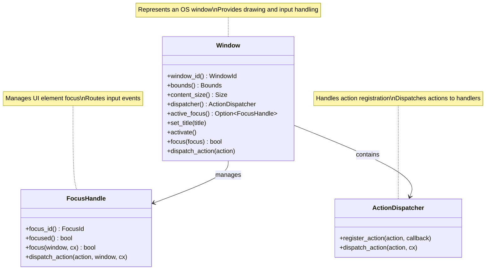
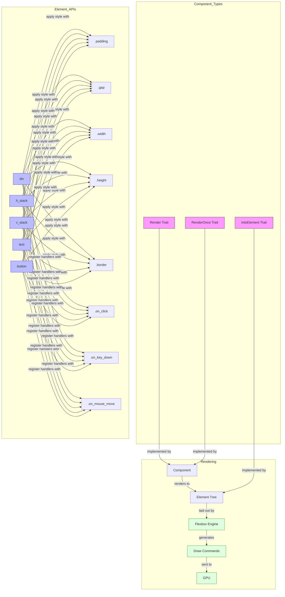
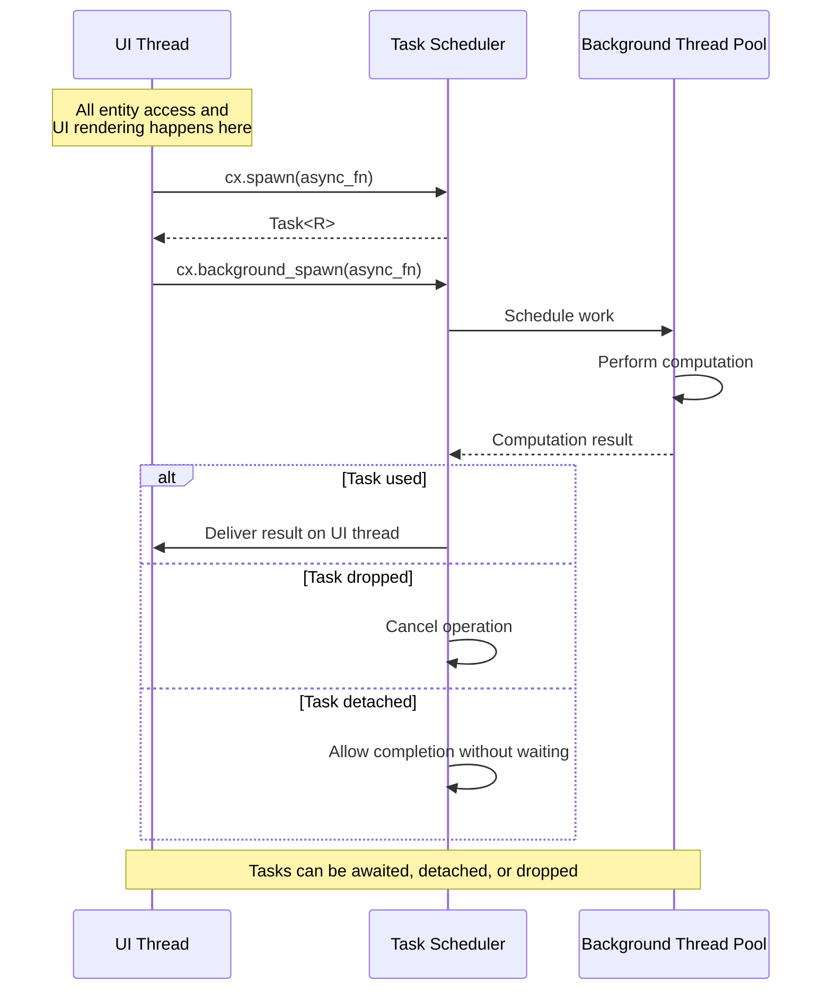
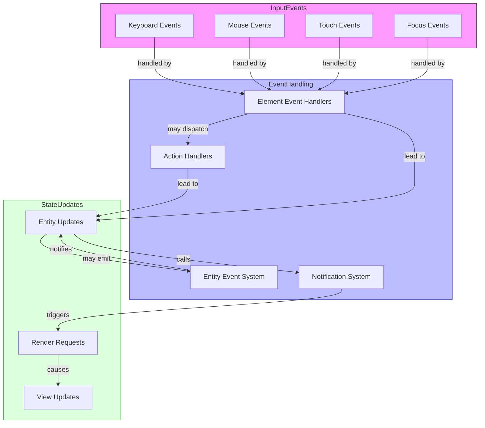

# Stratospheric View: GPUI Framework

## Purpose

GPUI (GPU User Interface) is Zed's custom UI framework that serves as the foundation for the entire application. It combines a reactive UI system with state management and concurrency primitives, optimized for performance through GPU acceleration.

## Core Concepts

### Entity System

```mermaid
classDiagram
    class Entity~T~ {
        +entity_id() EntityId
        +read(cx: &App) &T
        +read_with(cx, callback) R
        +update(cx, callback) R
        +update_in(cx, callback) R
        +downgrade() WeakEntity~T~
    }

    class WeakEntity~T~ {
        +upgrade() Option~Entity~T~~
        +read_with(cx, callback) Result~R~
        +update(cx, callback) Result~R~
        +update_in(cx, callback) Result~R~
    }

    class Context~T~ {
        +notify()
        +emit(event)
        +observe(entity, callback) Subscription
        +subscribe(entity, callback) Subscription
        +spawn(async_fn) Task~R~
        +background_spawn(async_fn) Task~R~
    }

    class App {
        +new() App
        +entity_ids() Vec~EntityId~
        +read_entity(id) &Any
        +create_entity(state) Entity~T~
        +windows() Vec~Window~
        +open_window(callback) Window
    }

    Entity~T~ --> WeakEntity~T~ : downgrades to
    WeakEntity~T~ -.-> Entity~T~ : may upgrade to
    Context~T~ --|> App : derefs to

    note for Entity~T~ "Strong handle to state of type T\nPrevents garbage collection"
    note for WeakEntity~T~ "Non-owning reference to an entity\nWon't prevent garbage collection"
    note for Context~T~ "Provided during entity updates\nAllows interaction with entity system"
    note for App "Root context providing access\nto global state and entities"
```

The entity system is the backbone of GPUI's state management, providing:

- **Entity<T>**: A handle to state of type T, providing methods to read and update the state
- **WeakEntity<T>**: A non-owning reference to an entity that won't prevent garbage collection
- **Context<T>**: Provided during entity updates, allows interaction with the entity system
- **App**: The root context providing access to global state and entities

### Window Management



- **Window**: Represents an OS window and provides capabilities for:
  - Drawing and layout
  - Input handling (keyboard, mouse, etc.)
  - Focus management
  - Action dispatching

### Rendering System



- **Element Tree**: A tree of UI elements representing the interface
- **Flexbox Layout**: Positioning and sizing of elements
- **IntoElement Trait**: Conversion of components into renderable elements
- **Render Trait**: Interface for components that can be rendered
- **RenderOnce Trait**: For components that render themselves once and are then consumed

### Concurrency Model



- **Task System**: Manages concurrent work that interacts with the UI
- **Foreground Thread**: Where all UI rendering and entity updates occur
- **Background Tasks**: For computation-heavy work off the main thread
- **Cancellation**: Tasks can be cancelled when no longer needed

### Event System



- **Event Handlers**: Process user input events (click, keypress, etc.)
- **Actions**: High-level, serializable commands that can be bound to keys
- **EventEmitter**: Allows entities to emit and subscribe to typed events
- **Notify Mechanism**: Triggers UI updates when state changes

## Architecture

### Core Components

1. **Entity Manager**
   - Creates and tracks entities
   - Manages entity lifecycle
   - Handles weak references

2. **Window Manager**
   - Creates and tracks windows
   - Routes OS events to appropriate handlers
   - Manages window lifecycle

3. **Renderer**
   - Processes element trees
   - Computes layouts
   - Generates draw commands
   - Interfaces with GPU

4. **Task Scheduler**
   - Manages foreground and background tasks
   - Handles task cancellation
   - Ensures UI responsiveness

### Data Flow

1. **State Changes**
   - Entity state is updated via `update` methods
   - Changes are applied atomically
   - Notifications are triggered for observers

2. **Rendering Cycle**
   - State changes trigger notification
   - Components re-render to produce new element trees
   - Element trees are diffed to minimize GPU work
   - Layout is calculated
   - Draw commands are sent to GPU

3. **Event Processing**
   - OS events are received by the window
   - Events are dispatched to appropriate handlers
   - Handlers may update entity state
   - State changes trigger rendering cycle

4. **Concurrency Pattern**
   - UI updates happen on foreground thread
   - Long-running work is offloaded to background threads
   - Results from background work are brought back to foreground for UI updates
   - Tasks can be cancelled when components are dropped

## Key Interfaces

### Entity Operations

```
// Conceptual interface, not actual Rust code
Entity<T> {
    read(cx: &App) -> &T
    read_with(cx, |state: &T, cx: &App| -> R) -> R
    update(cx, |state: &mut T, cx: &mut Context<T>| -> R) -> R
    update_in(cx, |state: &mut T, window: &mut Window, cx: &mut Context<T>| -> R) -> R
}
```

### Render Trait

```
// Conceptual interface, not actual Rust code
trait Render {
    fn render(&mut self, window: &mut Window, cx: &mut Context<Self>) -> impl IntoElement
}
```

### Element Interface

```
// Conceptual interface, not actual Rust code
Element {
    // Layout methods
    width(value)
    height(value)
    padding(value)
    margin(value)
    gap(value)
    
    // Children
    child(element)
    children(elements)
    
    // Events
    on_click(handler)
    on_key_down(handler)
    
    // Conditionals
    when(condition, |element| modified_element)
    when_some(option, |element, value| modified_element)
}
```

### Concurrency Primitives

```
// Conceptual interface, not actual Rust code
Context {
    spawn(async |cx| -> R) -> Task<R>
    background_spawn(async || -> R) -> Task<R>
}

Task<R> {
    detach()
    cancel()
}
```

## State Management

### Entity Lifecycle

1. **Creation**: Entities are created and return a handle
2. **Updates**: Entities are updated through their handle using `update` methods
3. **Observation**: Other components can observe entity changes
4. **Destruction**: Entities are destroyed when all strong references are dropped

### State Change Propagation

1. **Direct Notification**: `cx.notify()` triggers re-renders
2. **Observation**: `cx.observe(entity, callback)` registers for changes
3. **Events**: `cx.emit(event)` sends typed events to subscribers
4. **Actions**: `window.dispatch_action(action)` sends actions to handlers

### Memory Management

1. **Strong References**: `Entity<T>` keeps the entity alive
2. **Weak References**: `WeakEntity<T>` doesn't prevent garbage collection
3. **Subscriptions**: Automatically cancelled when dropped
4. **Tasks**: Cancelled when dropped unless detached

## Swift Considerations

### Entity System Translation

- Swift's reference counting can implement the entity system
- Use protocols and generics for `Entity<T>` pattern
- Class-based implementation for `Context` types

### Concurrency Model Adaptation

- Use Swift's structured concurrency (async/await) 
- Consider actors for thread-safe entity access
- Adapt Task system to leverage Swift's task cancellation

### UI Component Migration

- SwiftUI provides a reactive UI foundation
- Consider implementing GPUI's layout system on top of iOS's layout engine
- Translate flexbox layout to SwiftUI's layout system

### Event Handling 

- Use Swift's Combine for event propagation
- Implement action system using Swift's command pattern
- Consider using NotificationCenter for cross-component communication

### Memory Management

- Use Swift's ARC instead of manual reference counting
- Implement weak references using Swift's weak and unowned references
- Consider using a subscription bag pattern for tracking subscriptions

## Key Implementation Patterns

1. **Context Passing**: All operations receive a context parameter for system access
2. **Immutable Borrowing**: Read operations take immutable references
3. **Closure-based Updates**: Mutations happen through closures with mutable access
4. **Element Composition**: UI is built by composing elements with style attributes
5. **Reactive Updates**: UI automatically reacts to state changes
6. **Typed Events**: Events and actions are strongly typed
7. **Hierarchical Rendering**: Components render into element trees

## Performance Considerations

1. **Render Caching**: Avoid unnecessary re-renders
2. **Element Diffing**: Minimize changes to element tree
3. **Task Management**: Cancel tasks that are no longer needed
4. **GPU Utilization**: Leverage GPU for rendering
5. **Background Processing**: Offload heavy work from UI thread

## Subsystem Interactions

### GPUI → Text Editor Core
- The Text Editor Core builds directly on GPUI's entity system
- Editor components are implemented as GPUI entities that implement the `Render` trait
- Buffer operations update entity state, triggering UI redraws
- See: [03_StratosphericView_TextEditorCore.md](./03_StratosphericView_TextEditorCore.md)

### GPUI → Terminal Integration
- Terminal views are implemented as GPUI components
- Terminal rendering uses GPUI's drawing capabilities
- Terminal input handling uses GPUI's event system
- See: [08_StratosphericView_TerminalIntegration.md](./08_StratosphericView_TerminalIntegration.md)

### GPUI → Project Management
- Project tree views use GPUI's UI components
- Project entities are tracked using GPUI's entity system
- File operations trigger entity state updates
- See: [05_StratosphericView_ProjectManagement.md](./05_StratosphericView_ProjectManagement.md)

### GPUI → All Other Subsystems
- As the foundational framework, GPUI provides core capabilities to all subsystems
- All UI components across the application leverage GPUI rendering
- State management throughout the application uses GPUI's entity system
- Task management uses GPUI's concurrency model

For a complete map of how GPUI connects to all other subsystems, see: [SubsystemRelationshipMap.md](./SubsystemRelationshipMap.md)

## Next Steps

After understanding GPUI, we'll examine the Text Editor Core system, which builds on GPUI to implement Zed's text editing capabilities including buffer management, cursor models, and text operations.