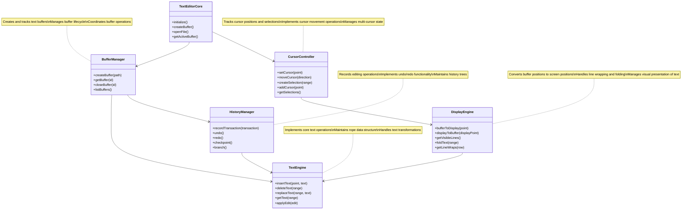
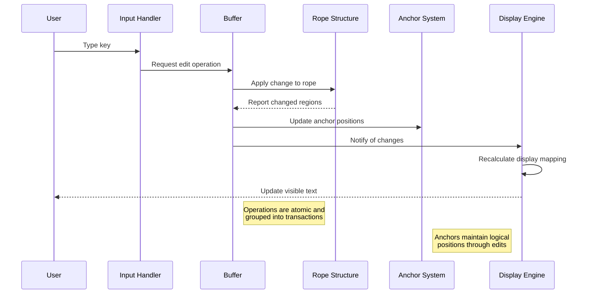
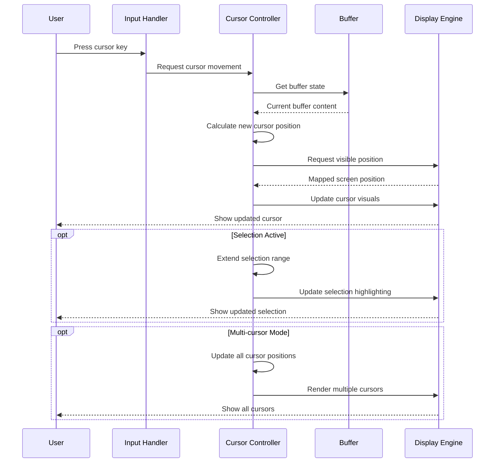
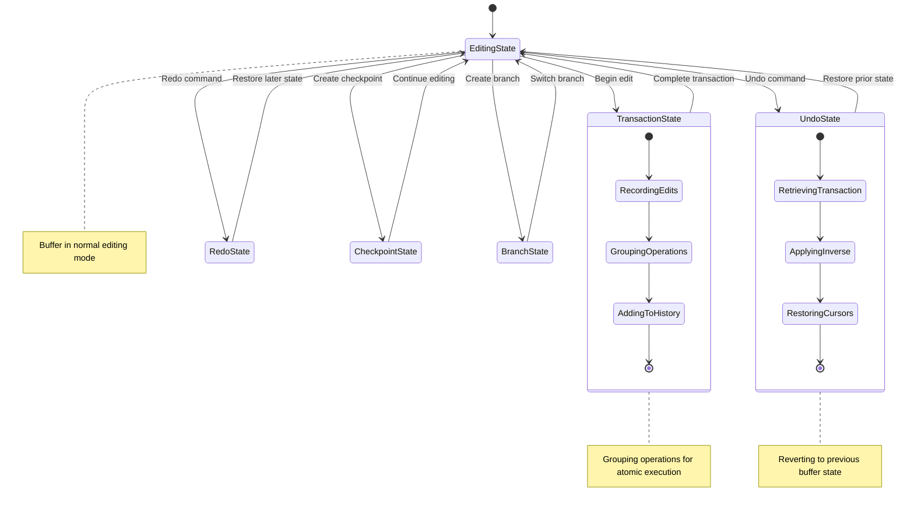
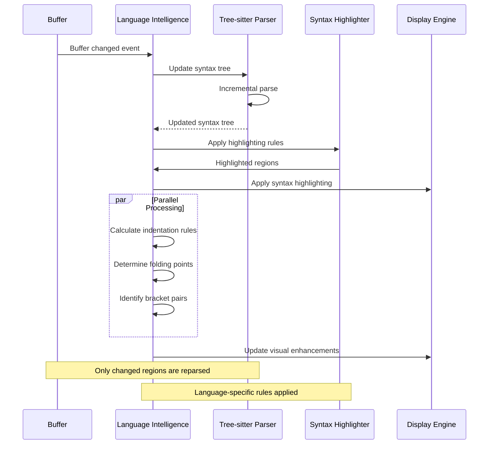

# Stratospheric View: Text Editor Core

## Purpose

The Text Editor Core is the heart of Zed, providing the fundamental text manipulation capabilities. It manages text buffers, handles editing operations, maintains cursor state, and provides the foundation for advanced editor features like multi-cursor editing, selections, and language-specific behaviors.

## Core Concepts

### Buffer System

- **Buffer**: Represents the content of a text file or unsaved document
- **Rope**: Specialized data structure for efficient text manipulation
- **Point**: Represents a position in text (row, column)
- **Range**: Represents a range in text (start point, end point)
- **Anchor**: Position markers that maintain logical position as text changes
- **Excerpt**: A view into a portion of a buffer

### Editing Operations

- **Insert**: Add text at specified positions
- **Delete**: Remove text from specified ranges
- **Replace**: Substitute text in specified ranges
- **Transact**: Group operations for atomic execution

### Cursor Model

- **Cursor**: Represents caret position in the buffer
- **Selection**: Represents selected text (cursor + anchor)
- **Multi-cursor**: Multiple independent cursors operating simultaneously
- **DisplayPoint/DisplayMap**: Mapping between buffer positions and visual positions

### History System

- **Transaction**: Group of edits as a single undoable operation
- **Snapshot**: Point-in-time state of buffer for undo/redo
- **Checkpoint**: Marked positions in history

### Syntax Integration

- **Syntax Layer**: Interfaces with Tree-sitter for syntax understanding
- **Highlighting**: Applies visual styling based on syntax
- **Indentation**: Language-aware indentation rules
- **Folding**: Code folding based on structural understanding

## Architecture

### Core Components



### Data Flow

#### Text Editing Flow



#### Cursor Operation Flow



#### History Operation Flow



#### Syntax Processing Flow



## Key Interfaces

### Buffer Operations

```
// Conceptual interface, not actual Rust code
Buffer {
    insert(point: Point, text: String) -> Transaction
    delete(range: Range) -> Transaction
    replace(range: Range, text: String) -> Transaction
    read(range: Range) -> String
    line(row: u32) -> String
    lines() -> Iterator<String>
    len() -> usize
    line_count() -> u32
    transact(|buffer| -> R) -> (R, Transaction)
}
```

### Cursor Operations

```
// Conceptual interface, not actual Rust code
CursorController {
    move_up(count: u32)
    move_down(count: u32)
    move_left(count: u32)
    move_right(count: u32)
    move_to_beginning_of_line()
    move_to_end_of_line()
    select_up(count: u32)
    select_down(count: u32)
    select_left(count: u32)
    select_right(count: u32)
    select_word()
    select_line()
    add_cursor_above()
    add_cursor_below()
    create_selection(range: Range)
    get_selections() -> Vec<Selection>
}
```

### History Operations

```
// Conceptual interface, not actual Rust code
HistoryManager {
    record(transaction: Transaction)
    undo() -> Transaction
    redo() -> Transaction
    checkpoint() -> CheckpointId
    revert_to_checkpoint(id: CheckpointId) -> Transaction
    branch() -> BranchId
    switch_to_branch(id: BranchId)
}
```

### Display Mapping

```
// Conceptual interface, not actual Rust code
DisplayMap {
    buffer_to_display(point: Point) -> DisplayPoint
    display_to_buffer(display_point: DisplayPoint) -> Point
    visible_ranges() -> Vec<Range>
    fold_range(range: Range)
    unfold_range(range: Range)
    is_folded(point: Point) -> bool
}
```

## State Management

### Buffer State

1. **Content State**: The actual text content in rope structure
2. **Syntax State**: Current parse tree and syntax information
3. **Edit State**: Pending and in-progress edits
4. **File State**: Path, save status, encoding

### Cursor State

1. **Primary Cursor**: Main insertion point
2. **Secondary Cursors**: Additional insertion points for multi-cursor editing
3. **Selections**: Ranges of selected text
4. **Sticky State**: Persistence behavior during edits

### History State

1. **Transaction Stack**: Record of edit operations
2. **Branch Tree**: Alternative history paths
3. **Checkpoint Map**: Named positions in history
4. **Undo/Redo Position**: Current position in history

### Display State

1. **Viewport**: Currently visible portion of buffer
2. **Folds**: Collapsed regions of text
3. **Wrap State**: Line wrapping information
4. **Scroll Position**: Vertical and horizontal scroll state

## Swift Considerations

### Rope Implementation

- Consider implementing a Swift version of the rope data structure
- Leverage Swift's value types for immutable rope nodes
- Use copy-on-write semantics for efficiency

### Cursor and Selection Model

- Use Swift structs for Point and Range types
- Consider Swift's Collection protocols for selection groups
- Implement custom indexing for efficient cursor movement

### Multi-cursor Support

- Use Swift arrays and sets for managing multiple cursors
- Consider implementing custom collection types for cursor operations
- Use protocol-oriented design for cursor behaviors

### History Management

- Leverage Swift enums for representing history operations
- Consider using the Command pattern for undoable operations
- Use structs for immutable history records

### Display Mapping

- Implement display mapping using Swift's numeric conversion patterns
- Consider using Swift's measurement types for display positioning
- Use protocols to define coordinate conversion behaviors

## Key Implementation Patterns

1. **Immutable Data Structures**: Content changes create new versions
2. **Transaction Grouping**: Operations grouped for atomic execution
3. **Position Tracking**: Anchors maintain logical positions through edits
4. **Change Notification**: Events emitted for state changes
5. **Lazy Syntax Parsing**: Incremental analysis for performance
6. **Virtual Positioning**: Separation of buffer and display coordinates
7. **Edit Grouping**: Related edits combined into single transactions

## Performance Considerations

1. **Efficient Text Storage**: Rope data structure for O(log n) operations
2. **Incremental Parsing**: Partial syntax reanalysis on changes
3. **Lazy Rendering**: Only compute display for visible text
4. **Batched Updates**: Group notifications for efficiency
5. **Cursor Optimization**: Special handling for common cursor patterns
6. **Memory Management**: Careful handling of history to manage memory use

## Subsystem Interactions

### Text Editor Core ← GPUI
- Text Editor Core is built on GPUI's entity and rendering system
- Editor components are implemented as GPUI entities
- Editor state is managed using GPUI's state management
- See: [02_StratosphericView_GPUI.md](./02_StratosphericView_GPUI.md)

### Text Editor Core → Language Intelligence
- Editor provides buffer content to Language Intelligence
- Editor receives syntax highlighting information from Language Intelligence
- Code diagnostics flow from Language Intelligence to text display
- Code navigation features connect editor state to language services
- See: [04_StratosphericView_LanguageIntelligence.md](./04_StratosphericView_LanguageIntelligence.md)

### Text Editor Core → Project Management
- Project system provides files that editor loads as buffers
- Editor notifies project system of file modifications
- Buffer state is coordinated with project-wide state
- See: [05_StratosphericView_ProjectManagement.md](./05_StratosphericView_ProjectManagement.md)

### Text Editor Core → Collaboration
- Editor operations are synchronized via the collaboration system
- Multiple remote cursors are displayed in the editor
- Collaborative edits are integrated into the editor buffer
- See: [06_StratosphericView_CollaborationSystem.md](./06_StratosphericView_CollaborationSystem.md)

### Text Editor Core → Terminal Integration
- Terminal is displayed alongside editor views
- Editor and terminal share focus and input handling systems
- Terminal output can be copied to editor and vice versa
- See: [08_StratosphericView_TerminalIntegration.md](./08_StratosphericView_TerminalIntegration.md)

### Text Editor Core → AI Features
- Editor content provides context for AI operations
- AI suggestions are displayed inline with editor content
- AI edits are applied to editor buffers
- See: [09_StratosphericView_AIFeatures.md](./09_StratosphericView_AIFeatures.md)

For a complete map of how Text Editor Core connects to all other subsystems, see: [SubsystemRelationshipMap.md](./SubsystemRelationshipMap.md)

## Next Steps

After understanding the Text Editor Core, we'll examine the Language Intelligence system, which builds on the editor core to provide syntax highlighting, code completion, and other language-aware features. This includes Tree-sitter integration, LSP support, and semantic analysis capabilities.