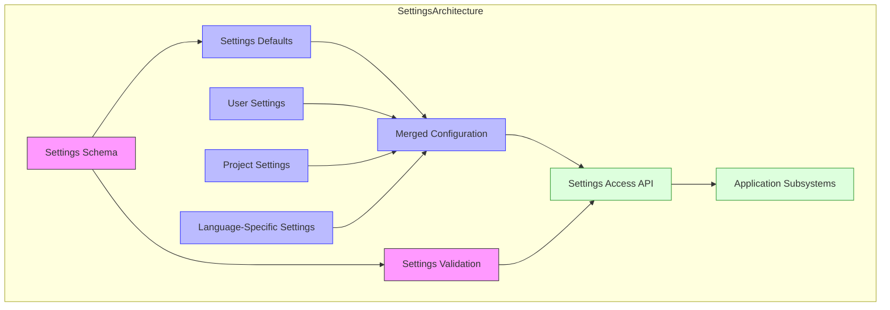
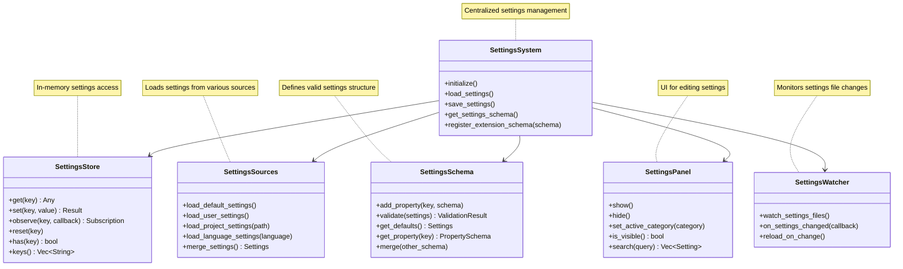
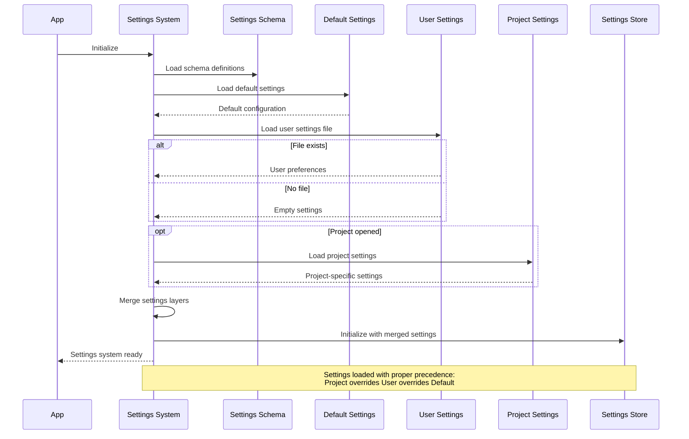
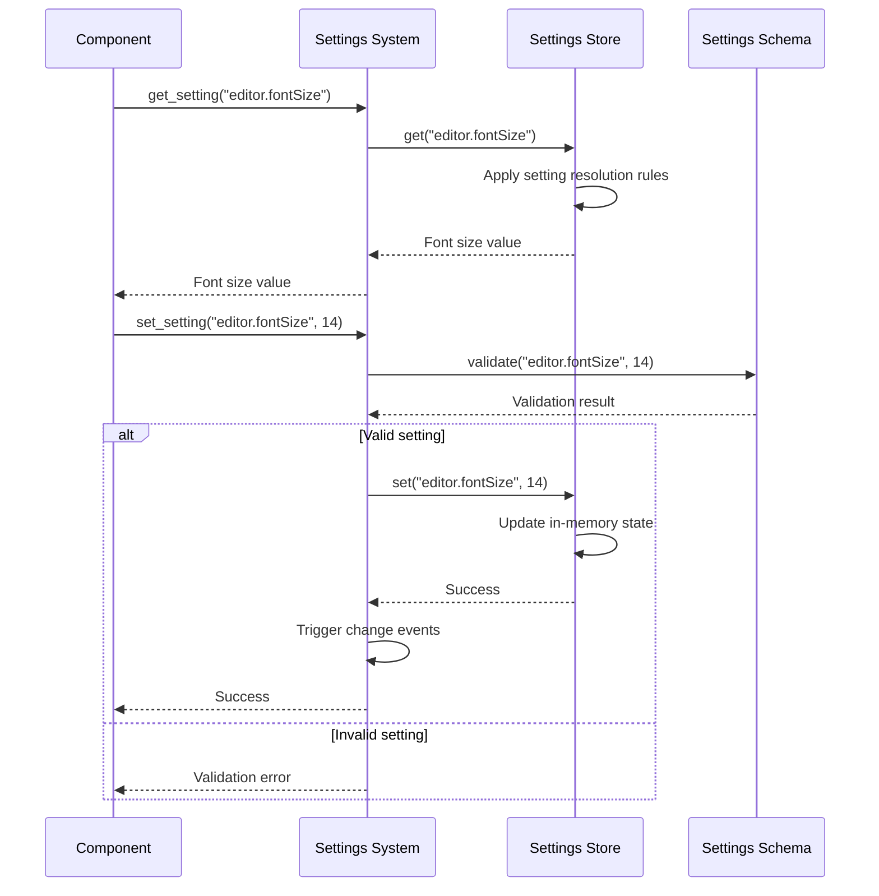
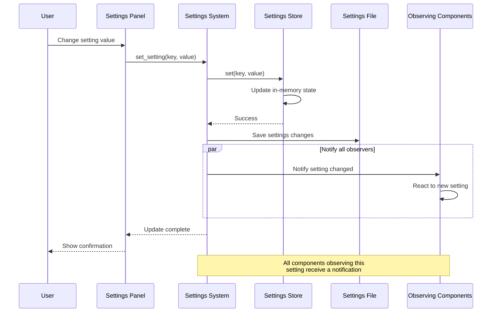
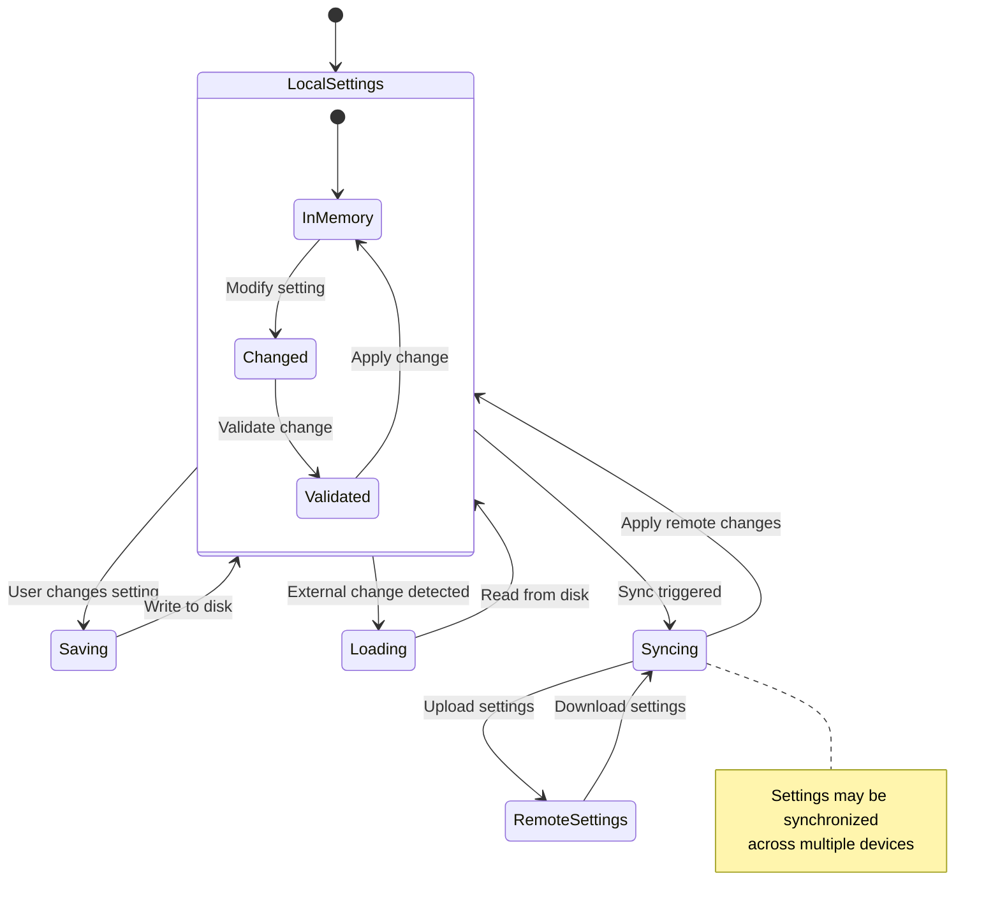
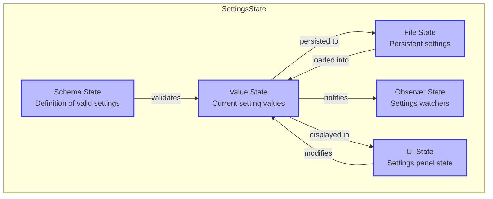
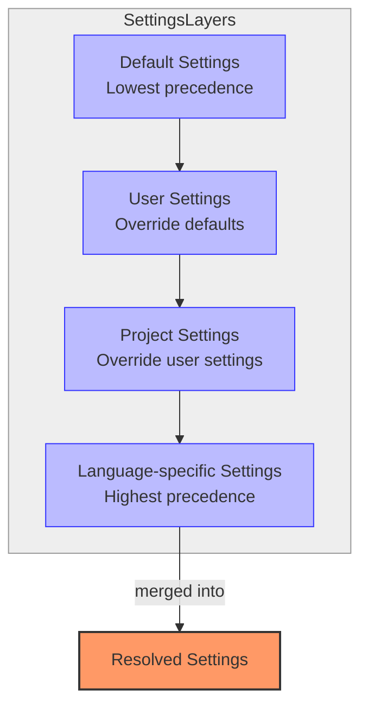
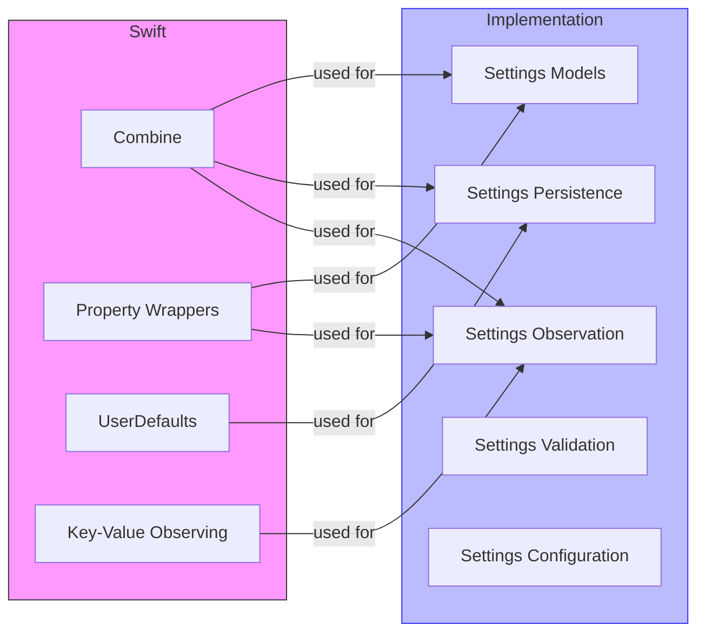

# Stratospheric View: Settings System

## Purpose

The Settings System provides a unified framework for user preferences, application configuration, and customization throughout Zed. It enables users to tailor the editor to their workflow while offering subsystems a consistent way to access and respond to configuration changes.

## Core Concepts

### Settings Architecture



- **Settings Schema**: Formal definition of available settings
- **Default Values**: Factory settings for all preferences
- **User Settings**: Global user preferences
- **Project Settings**: Project-specific overrides
- **Language Settings**: Language-specific configurations
- **Settings Layers**: Hierarchy of settings sources
- **Change Events**: Notifications of settings updates

### Settings Storage

- **JSON Format**: Settings stored as structured JSON
- **File Storage**: Persistent settings files
- **In-memory Cache**: Fast access to current values
- **Settings Synchronization**: Sharing settings across instances
- **Version Control**: Settings in project repositories

### Settings UI

- **Settings Panel**: User interface for editing preferences
- **Search**: Finding specific settings
- **Categories**: Logical grouping of related settings
- **Documentation**: Descriptions and examples
- **Defaults Reset**: Reverting to factory settings

### Settings Types

- **Primitive Settings**: Strings, numbers, booleans
- **Structured Settings**: Objects and arrays
- **Enumerated Settings**: Fixed sets of allowed values
- **Theme Settings**: Visual customization
- **Keybinding Settings**: Keyboard shortcuts
- **Extension Settings**: Extension-specific preferences

### Change Management

- **Change Observers**: Components that watch for updates
- **Settings Events**: Notifications of value changes
- **Scoped Changes**: Updates to specific settings domains
- **Validation**: Ensuring settings values are valid
- **Migration**: Handling settings format evolution

## Architecture

### Core Components



### Data Flow

#### Settings Initialization Flow



#### Settings Access Flow



#### Settings Change Flow



#### Settings Sync Flow



## Key Interfaces

### Settings Access

```
// Conceptual interface, not actual Rust code
SettingsSystem {
    // Core settings access
    get_setting<T>(key: String) -> T
    set_setting<T>(key: String, value: T) -> Result<()>
    reset_setting(key: String) -> Result<()>
    
    // Observing changes
    observe_setting<T>(key: String, callback: Fn(T)) -> Subscription
    observe_settings_in_scope(scope: String, callback: Fn(SettingsChanges)) -> Subscription
    
    // Schema management
    get_settings_schema() -> SettingsSchema
    register_schema(schema: SettingsSchema) -> Result<()>
    
    // Settings sources
    load_user_settings() -> Result<Settings>
    load_project_settings(project_path: String) -> Result<Settings>
    load_language_settings(language: String) -> Result<Settings>
    
    // Settings persistence
    save_user_settings() -> Result<()>
    save_project_settings(project_path: String) -> Result<()>
}
```

### Settings Schema Definition

```
// Conceptual interface, not actual Rust code
SettingsSchema {
    // Schema definition
    add_string_property(key: String, default: String, description: String) -> PropertyBuilder
    add_number_property(key: String, default: f64, description: String) -> PropertyBuilder
    add_boolean_property(key: String, default: bool, description: String) -> PropertyBuilder
    add_array_property(key: String, items_schema: Schema, description: String) -> PropertyBuilder
    add_object_property(key: String, properties_schema: Schema, description: String) -> PropertyBuilder
    add_enum_property(key: String, values: Vec<String>, default: String, description: String) -> PropertyBuilder
    
    // Schema operations
    merge_schema(other: SettingsSchema) -> SettingsSchema
    validate_settings(settings: Settings) -> ValidationResult
    get_default_settings() -> Settings
    
    // Property builders allow adding constraints
    property(key: String) -> PropertyBuilder
}

PropertyBuilder {
    description(text: String) -> Self
    default(value: Any) -> Self
    minimum(value: f64) -> Self
    maximum(value: f64) -> Self
    pattern(regex: String) -> Self
    required(is_required: bool) -> Self
    deprecated(reason: String) -> Self
    enum_values(values: Vec<String>) -> Self
    format(format: String) -> Self
}
```

### Settings UI

```
// Conceptual interface, not actual Rust code
SettingsPanel {
    show()
    hide()
    is_visible() -> bool
    
    set_active_category(category: String)
    get_active_category() -> String
    
    search_settings(query: String) -> Vec<SettingMatch>
    reset_search()
    
    get_categories() -> Vec<Category>
    get_settings_in_category(category: String) -> Vec<Setting>
    
    render() -> Element
}

Setting {
    key: String
    value: Any
    default_value: Any
    description: String
    schema: PropertySchema
    is_modified: bool
    
    reset() -> Result<()>
    set_value(value: Any) -> Result<()>
    get_ui_component() -> Element
}
```

### Settings Persistence

```
// Conceptual interface, not actual Rust code
SettingsPersistence {
    load_settings_file(path: String) -> Result<Settings>
    save_settings_file(path: String, settings: Settings) -> Result<()>
    
    get_user_settings_path() -> String
    get_project_settings_path(project_path: String) -> String
    
    watch_settings_file(path: String, callback: Fn()) -> WatcherId
    stop_watching(watcher_id: WatcherId)
    
    settings_to_json(settings: Settings) -> String
    json_to_settings(json: String) -> Result<Settings>
}
```

## State Management

### Settings State



1. **Schema State**: Definition of valid settings and their constraints
2. **Value State**: Current resolved values for all settings
3. **File State**: Persistent settings stored on disk
4. **Observer State**: Components watching for settings changes
5. **UI State**: Current state of settings user interface
6. **Layer State**: Active settings sources and their precedence
7. **Validation State**: Results of schema validation

### Settings Layers



### UI State

1. **Visibility State**: Is settings panel visible
2. **Active Category**: Currently selected settings category
3. **Search State**: Current search query and results
4. **Edit State**: Settings currently being edited
5. **Validation State**: Current validation errors
6. **Modified State**: Which settings differ from defaults
7. **Scroll State**: Current scroll position in panel

### Observer State

1. **Subscription Registry**: Active settings observers
2. **Key Watchers**: Callbacks for specific setting changes
3. **Scope Watchers**: Callbacks for groups of settings
4. **Change Queue**: Pending change notifications
5. **Delivery State**: Status of notification delivery
6. **Active Callbacks**: Currently executing observers
7. **Error State**: Failed observer notifications

## Swift Considerations

### Settings Implementation



- Leverage Swift's `Codable` for settings serialization
- Use property wrappers for setting access patterns
- Consider SwiftUI's `@AppStorage` for simple settings
- Implement a custom settings manager for complex needs
- Use Swift's strong typing for type-safe settings access
- Consider Combine for reactive settings updates
- Implement proper validation using Swift's strong type system

### Settings UI Design

- Use SwiftUI for settings interface
- Consider property wrappers for binding settings to UI
- Use Swift's `Form` and related components for settings groups
- Implement proper localization for settings labels
- Design with accessibility in mind for all settings controls
- Consider SwiftUI's `@Environment` for propagating settings changes
- Use Swift's native validation patterns for input validation

### File System Integration

- Use Swift's file system APIs for settings persistence
- Consider FileProvider framework for settings synchronization
- Implement proper error handling for file operations
- Use Swift's security APIs for sensitive settings
- Consider CloudKit for settings synchronization
- Use file coordination for concurrent access
- Implement proper migration for settings format changes

### Extension Settings

- Design a clear protocol for extension settings
- Consider JSON Schema for validating extension settings
- Use Swift's generic system for type-safe extension settings
- Implement proper isolation for extension settings
- Consider capability-based permissions for settings access
- Provide a clear API for extensions to register settings
- Design for forward and backward compatibility

## Key Implementation Patterns

1. **Settings Schema Registry**: Central repository of setting definitions
2. **Layered Resolution**: Precedence-based settings resolution
3. **Observable Settings**: Settings as observable state
4. **Schema Validation**: Enforcing constraints on settings values
5. **UI Binding**: Direct connection between settings and UI
6. **Settings Synchronization**: Keeping settings in sync across instances
7. **Extension Points**: Allowing extensions to register settings

## Performance Considerations

1. **Lazy Loading**: Only load settings when needed
2. **Caching**: Cache resolved settings values
3. **Efficient Notification**: Only notify observers of relevant changes
4. **Throttled Persistence**: Limit frequency of settings file writes
5. **Schema Optimization**: Efficient schema validation
6. **Partial Updates**: Only persist changed settings
7. **Background IO**: Perform settings IO off the main thread

## Subsystem Interactions

### Settings → GPUI
- Settings system provides configuration for UI components
- Theme settings affect GPUI's rendering
- UI layout settings configure GPUI's flexbox engine
- See: [02_StratosphericView_GPUI.md](./02_StratosphericView_GPUI.md)

### Settings → Text Editor Core
- Editor behavior is configured through settings
- Font, cursor, and layout settings affect editor display
- Key settings like tab size, line wrapping affect editing experience
- See: [03_StratosphericView_TextEditorCore.md](./03_StratosphericView_TextEditorCore.md)

### Settings → Language Intelligence
- Language-specific settings configure syntax highlighting, indentation, and formatting
- LSP settings configure language server behavior
- Tree-sitter configuration is managed through settings
- See: [04_StratosphericView_LanguageIntelligence.md](./04_StratosphericView_LanguageIntelligence.md)

### Settings → Project Management
- Project settings override global settings
- Project-specific ignore patterns are configured in settings
- Build and task configurations are stored in settings
- See: [05_StratosphericView_ProjectManagement.md](./05_StratosphericView_ProjectManagement.md)

### Settings → Extension System
- Extensions register their own settings schemas
- Settings provide configuration for extension behavior
- Extensions observe settings for reactive configuration
- See: [07_StratosphericView_ExtensionSystem.md](./07_StratosphericView_ExtensionSystem.md)

For a complete map of how the Settings System connects to all other subsystems, see: [SubsystemRelationshipMap.md](./SubsystemRelationshipMap.md)

## Next Steps

After understanding the Settings System, we'll examine the Command System, which handles key bindings, command registration, and command execution throughout the editor. This includes the command palette, keyboard shortcuts, and extension commands.