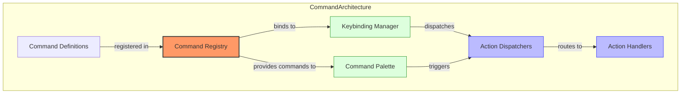
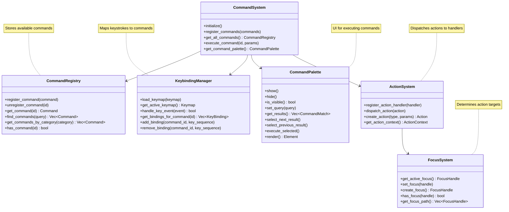
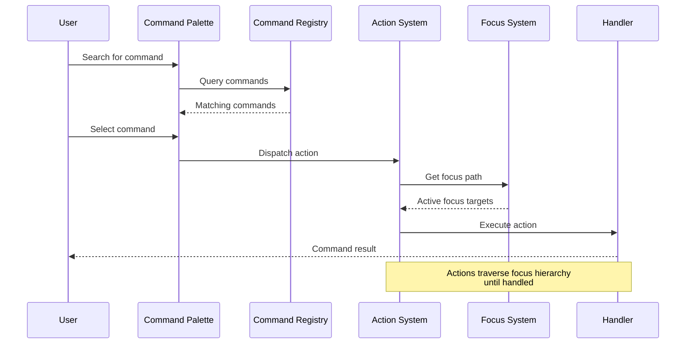
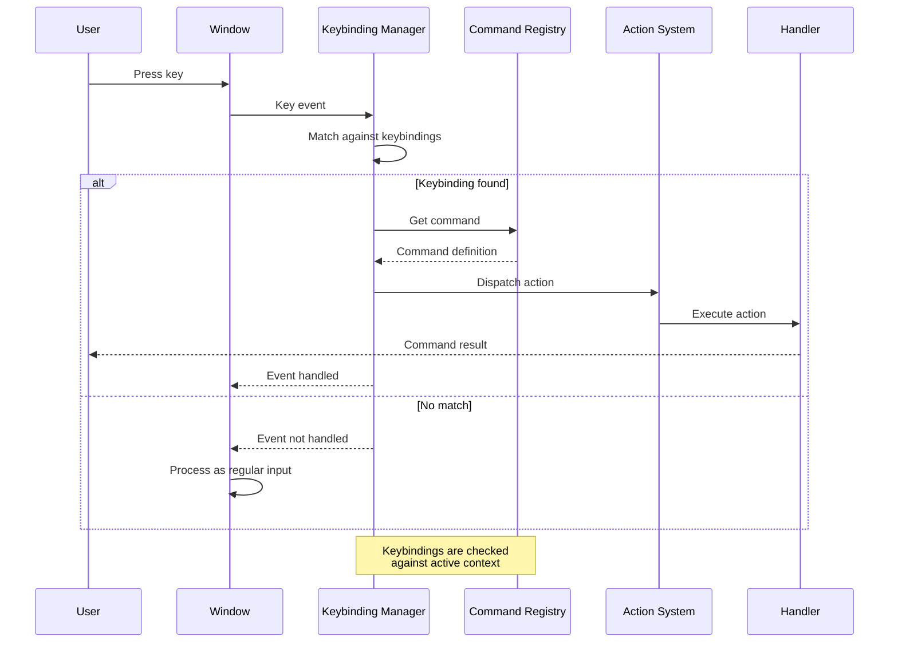
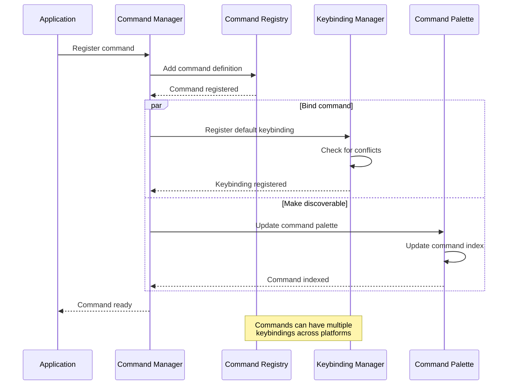
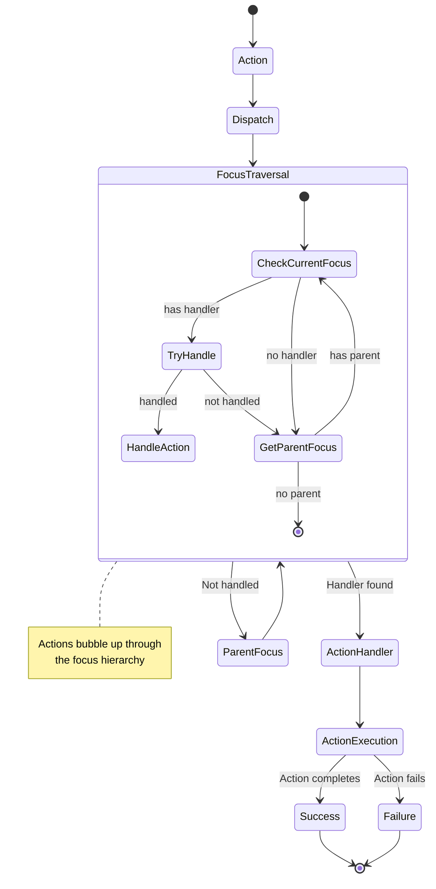
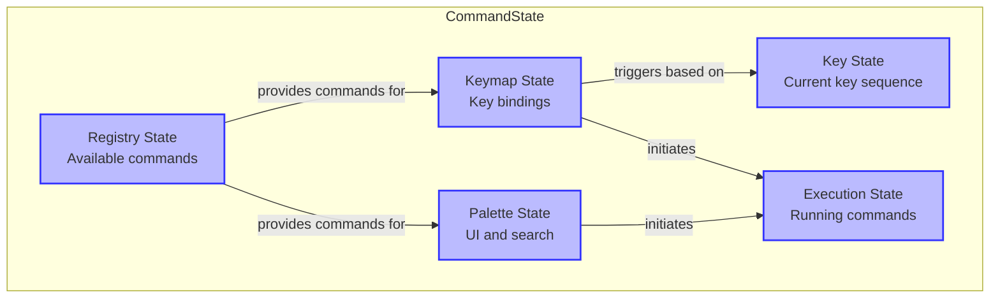

# Stratospheric View: Command System

## Purpose

The Command System provides a unified mechanism for registering, discovering, and executing commands throughout Zed. It enables keyboard shortcut binding, command palette access, and programmatic activation of editor features, creating a consistent interface for both users and code to interact with the application's functionality.

## Core Concepts

### Command Architecture



- **Commands**: Named operations that can be executed
- **Actions**: Serializable command representations
- **Keybindings**: Keyboard shortcuts for commands
- **Command Palette**: UI for finding and executing commands
- **Action Handlers**: Code that implements command behavior
- **Action Dispatchers**: Routes commands to appropriate handlers

### Keybinding System

- **Keymap**: Mapping of keys to commands
- **Key Sequence**: Sequence of keystrokes
- **Key Combinations**: Multiple keys pressed simultaneously
- **Keybinding Context**: When keybindings are active
- **Conflict Resolution**: Handling overlapping keybindings

### Command Registry

- **Command Definitions**: Metadata about available commands
- **Registration**: Process of adding commands
- **Discovery**: Finding available commands
- **Categories**: Grouping related commands
- **Command ID**: Unique identifier for commands

### Command Palette

- **Command Search**: Finding commands by name
- **Command Display**: Showing available commands
- **Command Execution**: Running selected commands
- **Recent Commands**: History of executed commands
- **Keyboard Navigation**: Navigating palette with keyboard

### Action System

- **Action Types**: Different categories of actions
- **Action Parameters**: Data passed with actions
- **Dispatch Path**: How actions find their handlers
- **Focus Targets**: UI elements that receive actions
- **Action Context**: State available during execution

## Architecture

### Core Components



### Data Flow

#### Command Execution Flow



#### Keybinding Flow



#### Command Registration Flow



#### Action Dispatch Flow



## Key Interfaces

### Command Definition

```
// Conceptual interface, not actual Rust code
Command {
    // Command identity
    id: String,
    title: String,
    category: String,
    
    // Command behavior
    execute: fn(context) -> Result<()>,
    is_enabled: fn(context) -> bool,
    is_visible: fn(context) -> bool,
    
    // Command appearance
    icon: Option<String>,
    description: String,
    
    // Command metadata
    keybindings: Vec<KeyBinding>,
    when: Option<String>, // context expression
    source: CommandSource, // builtin, extension, user
}

KeyBinding {
    key: String, // e.g. "cmd+s", "ctrl+k ctrl+s"
    platform: Option<Platform>, // specific platform or null for all
    when: Option<String>, // context expression
}
```

### Command Registry

```
// Conceptual interface, not actual Rust code
CommandRegistry {
    // Registration
    register_command(command: Command) -> CommandId
    unregister_command(id: CommandId)
    update_command(id: CommandId, properties: CommandProperties)
    
    // Discovery
    get_command(id: CommandId) -> Option<Command>
    find_commands(query: String) -> Vec<Command>
    get_all_commands() -> Vec<Command>
    get_commands_by_category(category: String) -> Vec<Command>
    
    // Metadata
    get_categories() -> Vec<String>
    get_command_count() -> usize
    has_command(id: CommandId) -> bool
    
    // Events
    on_command_registered(callback: Fn(Command))
    on_command_unregistered(callback: Fn(CommandId))
}
```

### Keybinding Management

```
// Conceptual interface, not actual Rust code
KeybindingManager {
    // Keymap management
    load_keymap(keymap: Keymap)
    get_active_keymap() -> Keymap
    reset_to_defaults()
    
    // Binding operations
    add_keybinding(command_id: CommandId, key: String, when: Option<String>)
    remove_keybinding(key: String, when: Option<String>)
    get_bindings_for_command(command_id: CommandId) -> Vec<KeyBinding>
    get_command_for_key(key: String) -> Option<CommandId>
    
    // Key handling
    handle_key_event(event: KeyEvent) -> bool
    is_partial_match(key_sequence: String) -> bool
    
    // Conflict detection
    find_conflicts(binding: KeyBinding) -> Vec<Conflict>
    resolve_conflict(binding: KeyBinding, action: ConflictResolution)
}
```

### Command Palette

```
// Conceptual interface, not actual Rust code
CommandPalette {
    // Visibility
    show()
    hide()
    toggle()
    is_visible() -> bool
    
    // Search
    set_query(query: String)
    get_query() -> String
    clear_query()
    
    // Results
    get_results() -> Vec<CommandMatch>
    select_result(index: usize)
    get_selected_index() -> usize
    
    // Navigation
    select_next_result()
    select_previous_result()
    
    // Execution
    execute_selected() -> Result<()>
    execute_result(index: usize) -> Result<()>
    
    // History
    get_recent_commands() -> Vec<CommandId>
    clear_history()
}
```

### Action System

```
// Conceptual interface, not actual Rust code
ActionSystem {
    // Action creation
    create_action(type: ActionType, params: ActionParams) -> Action
    boxed_action(action: Action) -> BoxedAction
    
    // Dispatch
    dispatch_action(action: Action) -> bool
    dispatch_action_to_focus(action: Action, focus: FocusHandle) -> bool
    
    // Registration
    register_action_handler(handler: ActionHandler) -> Registration
    register_global_action_handler(handler: ActionHandler) -> Registration
    
    // Action types
    register_action_type(type_id: String, schema: ActionSchema)
    get_action_types() -> Vec<ActionType>
    
    // Context
    get_action_context() -> ActionContext
    with_context(context: ActionContext, callback: Fn())
}
```

## State Management

### Command State



1. **Registry State**: What commands are available
2. **Keymap State**: Active key bindings
3. **Palette State**: Command palette UI state
4. **Key State**: Current key sequence being typed
5. **Execution State**: Currently running commands
6. **Context State**: Current command context
7. **Focus State**: Where actions are directed

### Command Registry State

1. **Command Definitions**: Registered command metadata
2. **Command Categories**: Grouping of commands
3. **Command Sources**: Origin of commands (builtin, extension)
4. **Default Commands**: Factory command definitions
5. **Command Overrides**: User modifications to commands
6. **Command Count**: Number of available commands
7. **Last Registration**: Most recently added command

### Keybinding State

1. **Active Keymap**: Current set of key bindings
2. **Platform Keymaps**: OS-specific key bindings
3. **User Keymaps**: Custom user key bindings
4. **Partial Matches**: Incomplete key sequences
5. **Key Sequence**: Currently entered key sequence
6. **Conflicts**: Overlapping key bindings
7. **Override Status**: Which bindings override others

### Palette State

1. **Visibility State**: Is palette currently shown
2. **Query State**: Current search text
3. **Result State**: Matching commands
4. **Selection State**: Currently selected result
5. **History State**: Recently executed commands
6. **Filter State**: Active result filters
7. **Size State**: UI dimensions

### Execution State

1. **Running Commands**: Currently executing commands
2. **Command Parameters**: Input to commands
3. **Command Output**: Results from commands
4. **Error State**: Failed commands
5. **Execution Time**: Performance metrics
6. **Queue State**: Pending command execution
7. **Cancel State**: Interrupted commands

## Swift Considerations

### Command Implementation

- Use Swift protocols to define command interfaces
- Consider a command registry as a central singleton
- Use enum for action types with associated values
- Leverage Swift's strong typing for command parameters
- Consider property wrappers for command properties

### Keybinding System

- Design a Swift-native key event handling system
- Use enumeration types for key codes and modifiers
- Create a flexible keymap definition format
- Consider platform-specific key binding adjustments
- Implement proper key composition for non-Latin keyboards

### Command Palette UI

- Implement command palette using SwiftUI
- Use SwiftUI's search bar for command filtering
- Consider custom keyboard focus management
- Design for both mouse and keyboard navigation
- Implement result highlighting for better visibility

### Action System

- Use Swift's responder chain pattern for action handling
- Consider implementing a focus tree similar to UIResponder
- Use protocol-oriented design for action handlers
- Implement type-safe action dispatching
- Use Swift's Result type for command outcomes

### Extension Integration

- Design a clear protocol for extension commands
- Consider capability-based permissions for commands
- Use Swift's dynamism features for command discovery
- Provide proper serialization for cross-process commands
- Implement versioning for command API compatibility

## Key Implementation Patterns

1. **Command Registration**: Declarative command definition
2. **Focus Chaining**: Actions bubble up through UI hierarchy
3. **Context-aware Bindings**: Commands available in specific contexts
4. **Command Composition**: Complex commands built from simpler ones
5. **Keybinding Resolution**: Deterministic handling of key conflicts
6. **Action Dispatching**: Routing actions to proper handlers
7. **Command Discoverability**: Making commands findable by users

## Performance Considerations

1. **Command Indexing**: Efficient command lookup
2. **Key Event Processing**: Fast keybinding matching
3. **Lazy Command Loading**: Only initialize commands when needed
4. **Palette Responsiveness**: Quick command search results
5. **Action Dispatch Optimization**: Efficient handler lookup
6. **Context Evaluation**: Fast binding context checking
7. **Command Caching**: Remember frequently used commands

## Subsystem Interactions

### Command System → GPUI
- Commands integrate with GPUI's action dispatching
- Command UI components are built on GPUI elements
- Focus system determines command targets
- See: [02_StratosphericView_GPUI.md](./02_StratosphericView_GPUI.md)

### Command System → Text Editor Core
- Editor operations are exposed as commands
- Commands modify buffer state through controlled operations
- Key bindings trigger editor actions
- See: [03_StratosphericView_TextEditorCore.md](./03_StratosphericView_TextEditorCore.md)

### Command System → Extension System
- Extensions register custom commands
- Command API provides extension points
- Extensions can provide specialized handlers
- See: [07_StratosphericView_ExtensionSystem.md](./07_StratosphericView_ExtensionSystem.md)

### Command System → Settings System
- Keybindings are configured through settings
- Command behavior can be modified via settings
- Settings system stores custom keymaps
- See: [10_StratosphericView_Settings.md](./10_StratosphericView_Settings.md)

### Command System → Language Intelligence
- Language-specific commands integrate with language services
- Context-aware commands activate based on language
- Code actions are presented as commands
- See: [04_StratosphericView_LanguageIntelligence.md](./04_StratosphericView_LanguageIntelligence.md)

For a complete map of how the Command System connects to all other subsystems, see: [SubsystemRelationshipMap.md](./SubsystemRelationshipMap.md)

## Next Steps

After understanding the Command System, we'll examine the Theme System, which provides visual styling and customization throughout the editor. This includes theme definition, styling rules, and theme switching capabilities.