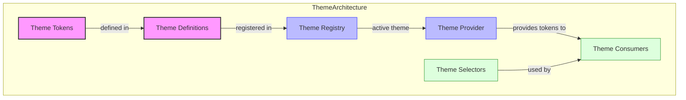
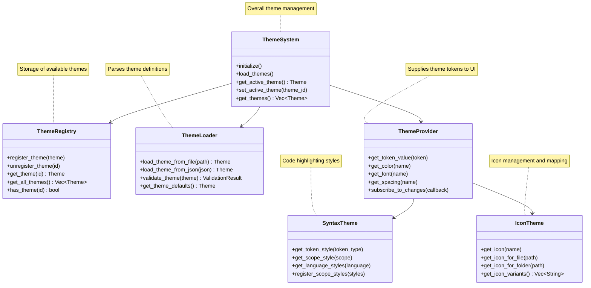
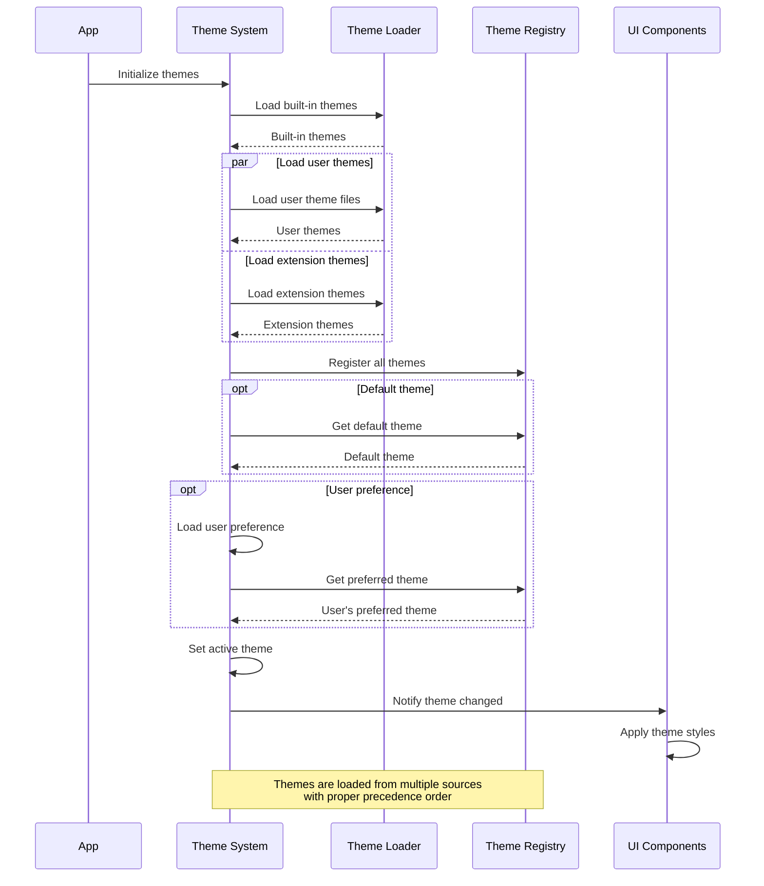
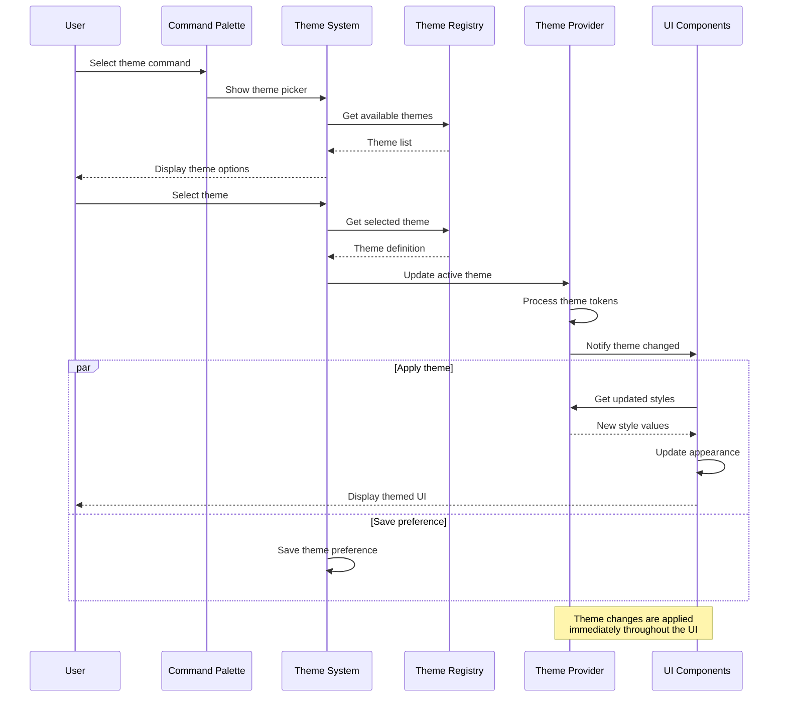
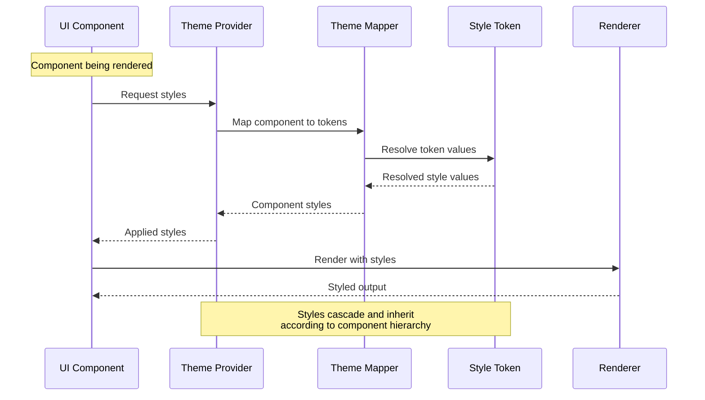
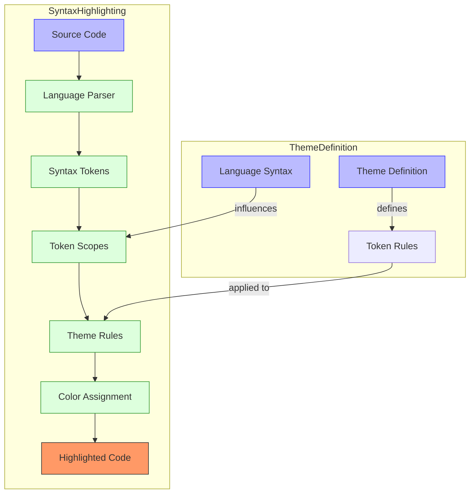
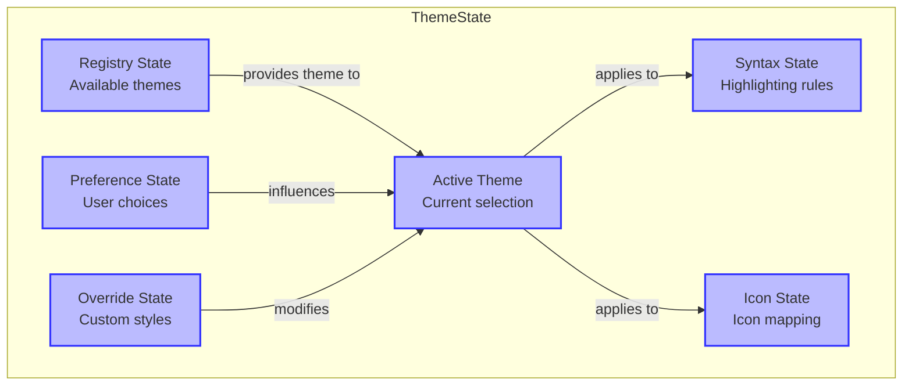

# Stratospheric View: Theme System

## Purpose

The Theme System provides visual styling and customization throughout Zed, enabling consistent appearance across the editor while supporting user preferences for colors, fonts, and visual elements. It manages theme definitions, loading, switching, and application of styles to UI components.

## Core Concepts

### Theme Architecture



- **Theme**: Complete set of visual styling rules
- **Color Scheme**: Palette of colors used by a theme
- **Theme Tokens**: Named values for colors, sizes, etc.
- **Theme Registry**: Repository of available themes
- **Theme Provider**: Supplies active theme to components
- **Theme Consumers**: Components that apply theme styles

### Theme Definition

- **Color Values**: RGB/HSL color definitions
- **Color References**: Symbolic references to colors
- **Semantic Colors**: Purpose-based color assignments
- **UI Element Styles**: Specific component styling
- **Syntax Highlighting**: Code coloring rules
- **Variant Support**: Light/dark mode variations

### Theme Integration

- **Theme Loading**: Process of reading theme files
- **Theme Switching**: Changing the active theme
- **Theme Inheritance**: Base and derived themes
- **Style Application**: How components receive styling
- **User Overrides**: Custom theme modifications

### Syntax Highlighting

- **Token Types**: Categories of syntax elements
- **Scope Selectors**: Targeting specific syntax elements
- **Highlighting Rules**: Mapping scopes to colors
- **TextMate Grammar**: Scope naming conventions
- **Language-specific Rules**: Custom highlighting per language

### Icon Theming

- **Icon Sets**: Collections of icons
- **Icon Variants**: Different visual styles of icons
- **Icon Mapping**: Associating icons with functions
- **Icon Coloring**: Applying theme colors to icons
- **Icon Scaling**: Size adaptation for icons

## Architecture

### Core Components



### Data Flow

#### Theme Loading Flow



#### Theme Switching Flow



#### Style Application Flow



#### Syntax Highlighting Flow



## Key Interfaces

### Theme Definition

```
// Conceptual interface, not actual Rust code
Theme {
    // Identity
    id: String,
    name: String,
    author: String,
    version: String,
    
    // Basic properties
    type: ThemeType, // "dark", "light", "high-contrast"
    base_theme: Option<String>, // parent theme to extend
    
    // Color definitions
    colors: Map<String, Color>,
    semantic_colors: Map<String, ColorReference>,
    
    // UI-specific styles
    ui: {
        font_family: String,
        ui_font_size: Number,
        editor_font_family: String,
        editor_font_size: Number,
        line_height: Number,
        // Component-specific styles
        components: Map<String, ComponentStyle>
    },
    
    // Syntax highlighting
    tokenColors: Vec<TokenColorRule>,
    semanticTokenColors: Map<String, TokenStyle>,
    
    // Custom properties
    custom: Map<String, any>
}

Color {
    hex: String, // "#RRGGBB" or "#RRGGBBAA"
    rgb: [Number, Number, Number],
    alpha: Number,
    
    // Computed properties
    is_dark: bool,
    is_light: bool,
    complementary: Color,
    transparent(alpha: Number): Color
}

TokenColorRule {
    name: Option<String>,
    scope: Scope, // String or array of strings
    settings: {
        foreground: Option<String>,
        background: Option<String>,
        fontStyle: Option<String>
    }
}
```

### Theme Registry

```
// Conceptual interface, not actual Rust code
ThemeRegistry {
    // Registration
    register_theme(theme: Theme) -> ThemeId
    unregister_theme(id: ThemeId)
    update_theme(id: ThemeId, properties: ThemeProperties)
    
    // Retrieval
    get_theme(id: ThemeId) -> Option<Theme>
    get_themes_by_type(type: ThemeType) -> Vec<Theme>
    get_all_themes() -> Vec<Theme>
    
    // Metadata
    get_theme_types() -> Vec<ThemeType>
    get_theme_count() -> usize
    has_theme(id: ThemeId) -> bool
    
    // Events
    on_theme_registered(callback: Fn(Theme))
    on_theme_unregistered(callback: Fn(ThemeId))
}
```

### Theme Provider

```
// Conceptual interface, not actual Rust code
ThemeProvider {
    // Current theme
    get_active_theme() -> Theme
    set_active_theme(theme_id: ThemeId) -> Result<()>
    
    // Style resolution
    get_color(token: String) -> Color
    get_font_family(token: String) -> String
    get_font_size(token: String) -> Number
    get_spacing(token: String) -> Number
    get_border(token: String) -> Border
    get_component_style(component: String) -> ComponentStyle
    
    // Syntax highlighting
    get_token_style(token_type: String) -> TokenStyle
    get_scope_style(scope: String) -> TokenStyle
    
    // Change notification
    subscribe_to_theme_changes(callback: Fn(Theme)) -> Subscription
    
    // Theme type
    is_dark_theme() -> bool
    is_light_theme() -> bool
    get_theme_type() -> ThemeType
    
    // Computed values
    get_contrasting_color(color: Color) -> Color
    get_transparent_color(color: Color, alpha: Number) -> Color
}
```

### Syntax Theme

```
// Conceptual interface, not actual Rust code
SyntaxTheme {
    // Token styling
    get_style_for_token(token: SyntaxToken) -> TokenStyle
    get_style_for_scope(scope: String) -> TokenStyle
    get_style_for_language(language: String, token: SyntaxToken) -> TokenStyle
    
    // Rule management
    add_token_rule(rule: TokenRule)
    add_scope_rule(rule: ScopeRule)
    add_language_specific_rule(language: String, rule: TokenRule)
    
    // Inheritance
    extend_with(other: SyntaxTheme)
    override_with(other: SyntaxTheme)
    
    // Conversion
    to_text_mate_theme() -> TextMateTheme
    from_text_mate_theme(theme: TextMateTheme) -> SyntaxTheme
    
    // Language support
    get_supported_languages() -> Vec<String>
    has_language_specific_rules(language: String) -> bool
}
```

### Icon Theme

```
// Conceptual interface, not actual Rust code
IconTheme {
    // Icon retrieval
    get_icon(name: String) -> Icon
    get_icon_for_file(path: String) -> Icon
    get_icon_for_folder(path: String) -> Icon
    
    // Icon definitions
    define_file_icon(pattern: String, icon: Icon)
    define_folder_icon(pattern: String, icon: Icon)
    define_language_icon(language: String, icon: Icon)
    
    // Icon sets
    get_available_sets() -> Vec<String>
    set_active_set(set: String)
    get_active_set() -> String
    
    // Variants
    get_icon_variants() -> Vec<String>
    set_icon_variant(variant: String)
    get_icon_variant() -> String
    
    // Icon properties
    colorize_icons(enable: bool)
    is_colorizing_icons() -> bool
}
```

## State Management

### Theme System State



1. **Registry State**: Available themes and their definitions
2. **Active Theme State**: Currently selected theme
3. **Preference State**: User theme preferences
4. **Syntax State**: Current syntax highlighting rules
5. **Icon State**: Active icon set and mappings
6. **Override State**: User customizations of themes
7. **Application State**: How theme is applied to UI

### Theme Definition State

1. **Color Map**: Named color definitions
2. **Token Rules**: Syntax coloring rules
3. **UI Styles**: Component-specific styling
4. **Font Config**: Text rendering settings
5. **Spacing Rules**: Layout and sizing values
6. **Inheritance Chain**: Base themes being extended
7. **Custom Properties**: Theme-specific extensions

### Theme Provider State

1. **Active Theme**: Currently applied theme
2. **Token Resolution**: Mapped style values
3. **Subscription List**: Theme change observers
4. **Cache State**: Computed style values
5. **Theme Type**: Light, dark, or high contrast
6. **UI Scale**: Size adjustments for theme
7. **System Integration**: OS theme synchronization

### Syntax Highlighting State

1. **Token Styles**: Current styling for syntax tokens
2. **Scope Map**: Textmate scope to style mapping
3. **Language Rules**: Language-specific highlighting
4. **Rule Precedence**: Order of rule application
5. **Default Styles**: Fallback token styling
6. **Tree-sitter Integration**: Parser state
7. **Semantic Token State**: LSP-provided highlighting

## Swift Considerations

### Theme Implementation

- Use Swift's strong type system for theme structure
- Consider using property wrappers for theme tokens
- Implement theme loading with Codable
- Use Swift's asset catalog for built-in themes
- Consider Swift's Color/UIColor/NSColor for color management
- Implement proper dark mode support using trait collections
- Use SwiftUI's environment for theme distribution

### Syntax Highlighting

- Implement a Swift wrapper for Tree-sitter
- Consider TextKit integration for syntax highlighting
- Use attributed strings for highlighted text
- Design clean interfaces for token styling
- Consider performance optimizations for large files
- Implement incremental highlighting for editing
- Consider Metal for GPU-accelerated text rendering

### Theme Switching

- Implement smooth transitions between themes
- Consider animation support for theme changes
- Use proper memory management for theme resources
- Implement theme hot-reloading for development
- Consider background thread loading for large themes
- Design for minimal UI flicker during theme changes
- Support system dark/light mode integration

### Icon Theming

- Consider using SF Symbols where appropriate
- Design a flexible icon loading system
- Support vector icon formats for sharp rendering
- Implement icon caching for performance
- Consider using asset catalogs for icon management
- Support proper scaling for different display densities
- Implement icon coloring based on theme

## Key Implementation Patterns

1. **Token-based Styling**: Named values for consistent appearance
2. **Theme Inheritance**: Building themes through extension
3. **Scoped Rules**: Context-specific styling rules
4. **Style Providers**: Centralized access to theme values
5. **Token Mapping**: Connecting syntax to visual styles
6. **Observer Pattern**: Notifying components of theme changes
7. **Layered Application**: Theme application in rendering pipeline

## Performance Considerations

1. **Theme Caching**: Cache resolved style values
2. **Incremental Updates**: Only update changed styles
3. **Lazy Loading**: Load themes on demand
4. **Render Optimization**: Efficient styling application
5. **Memory Management**: Properly handle theme resources
6. **Style Computation**: Minimize style calculation overhead
7. **Theme Switching**: Optimize theme transition performance

## Subsystem Interactions

### Theme System → GPUI
- GPUI components receive styling from the theme system
- UI rendering applies theme colors and styles
- GPUI's flexbox engine uses theme spacing values
- See: [02_StratosphericView_GPUI.md](./02_StratosphericView_GPUI.md)

### Theme System → Text Editor Core
- Editor appearance is styled through the theme system
- Syntax highlighting applies to editor content
- Editor chrome receives theme styling
- See: [03_StratosphericView_TextEditorCore.md](./03_StratosphericView_TextEditorCore.md)

### Theme System → Language Intelligence
- Syntax tokens from language services receive theme colors
- Language-specific highlighting rules are defined in themes
- Tree-sitter and LSP highlighting integrate with theme system
- See: [04_StratosphericView_LanguageIntelligence.md](./04_StratosphericView_LanguageIntelligence.md)

### Theme System → Project Management
- Project tree receives themed icons
- File type recognition influences icon selection
- Project panels receive theme styling
- See: [05_StratosphericView_ProjectManagement.md](./05_StratosphericView_ProjectManagement.md)

### Theme System → Extension System
- Extensions can contribute custom themes
- Extensions receive theme information for their UI
- Extensions can provide theme-aware components
- See: [07_StratosphericView_ExtensionSystem.md](./07_StratosphericView_ExtensionSystem.md)

### Theme System → Settings System
- Theme preferences are stored in settings
- Theme customization happens through settings
- Settings UI for theme configuration
- See: [10_StratosphericView_Settings.md](./10_StratosphericView_Settings.md)

For a complete map of how the Theme System connects to all other subsystems, see: [SubsystemRelationshipMap.md](./SubsystemRelationshipMap.md)

## Next Steps

After completing our overview of all major subsystems at the Stratospheric level, we'll begin diving deeper with Atmospheric View documents focusing on key component clusters. The first of these will be an in-depth examination of the Buffer and Rope data structures that form the core of Zed's text manipulation capabilities.