# Atmospheric View: Buffer and Rope

## Purpose

The Buffer and Rope implementation forms the core text representation system in Zed, providing efficient storage, manipulation, and access to text content. This system enables fast editing operations even for large files while maintaining consistent performance characteristics and supporting features like multi-cursor editing, undo/redo, and collaborative editing.

## Core Concepts

### Rope Data Structure

```mermaid
graph TD
    subgraph RopeStructure
        Root[Root Node]
        IL1[Internal Node]
        IL2[Internal Node]
        IL3[Internal Node]
        L1[Leaf: "Hello"]
        L2[Leaf: " world"]
        L3[Leaf: "!"]
        L4[Leaf: " How"]
        L5[Leaf: " are"]
        L6[Leaf: " you?"]
        
        Root --> IL1
        Root --> IL2
        IL1 --> L1
        IL1 --> L2
        IL1 --> L3
        IL2 --> IL3
        IL2 --> L6
        IL3 --> L4
        IL3 --> L5
    end
    
    style Root fill:#f96,stroke:#333,stroke-width:2px
    style IL1,IL2,IL3 fill:#bbf,stroke:#33f,stroke-width:1px
    style L1,L2,L3,L4,L5,L6 fill:#dfd,stroke:#393,stroke-width:1px
```

- **Rope**: A tree-based data structure optimized for text representation
- **Nodes**: Tree components containing text chunks or references
- **Balancing**: Maintaining optimal tree shape for performance
- **Chunking**: Dividing text into manageable pieces
- **Metrics**: Length and position tracking throughout the tree

### Buffer Abstraction

- **Buffer**: High-level abstraction over the rope
- **Point**: Position within text (row, column)
- **Range**: Span of text between two points
- **Edit Operation**: Insertion, deletion, or replacement
- **Transaction**: Grouped set of operations
- **Snapshot**: Point-in-time state of buffer
- **Undo/Redo**: History tracking mechanism

### Anchor System

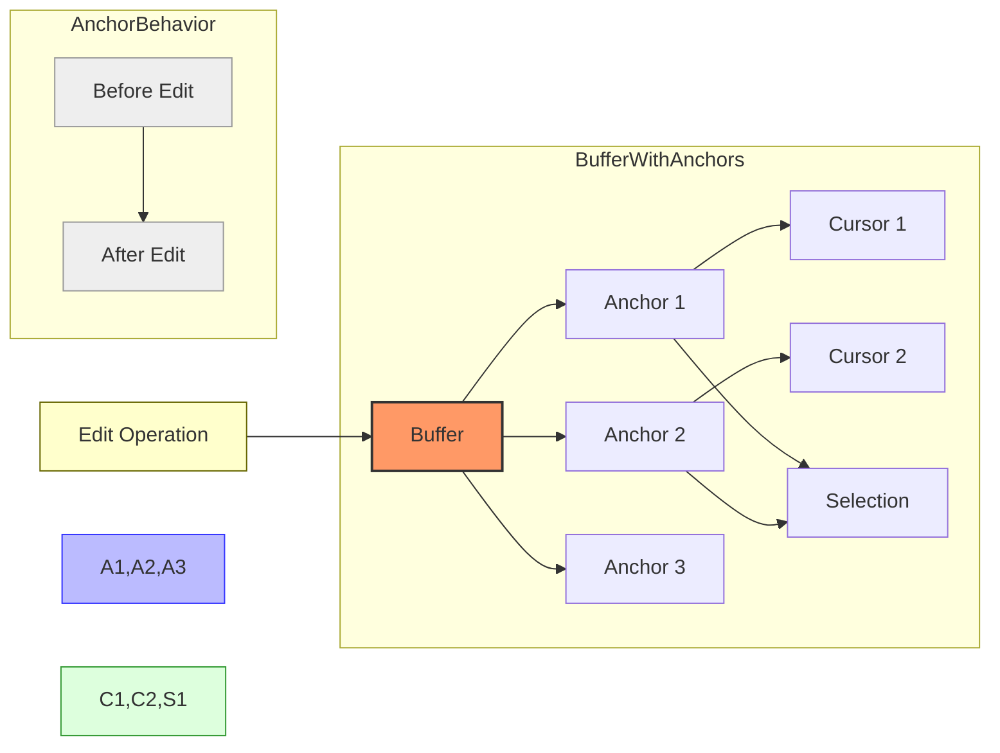

- **Anchor**: Marker that tracks a logical position
- **Bias**: Direction anchor moves when text is inserted at its position
- **Stability**: Maintaining logical position through edits
- **Tracking**: How anchors update with buffer changes
- **Garbage Collection**: Cleaning up unused anchors

### Edit Operations

- **Insert**: Adding text at a position
- **Delete**: Removing text within a range
- **Replace**: Combination of delete and insert
- **Transact**: Grouping operations atomically
- **Checkpoint**: Marked positions in edit history
- **Branch**: Alternative history paths
- **Revert**: Returning to previous state

### Multi-Buffer System

- **Excerpts**: Views into portions of buffers
- **Buffer Registry**: Management of open buffers
- **Buffer Coordination**: Relationships between buffers
- **Shared Content**: Text reuse between buffers
- **Specialized Buffers**: Search results, logs, etc.

## Architecture

### Core Components

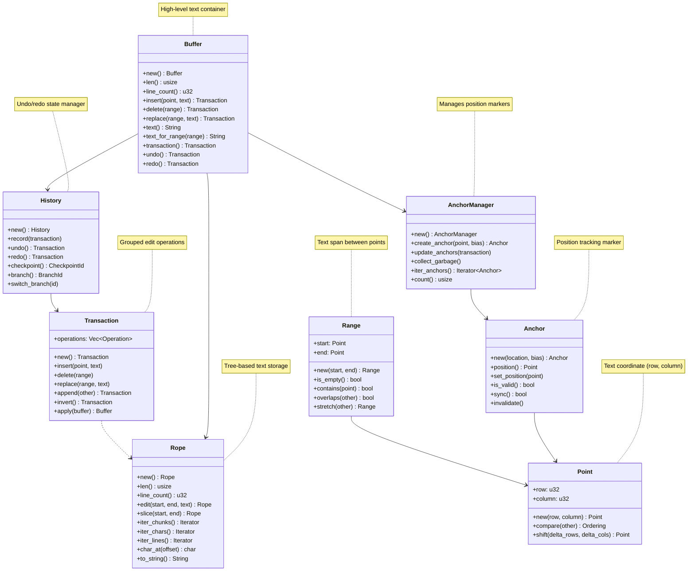

### Detailed Rope Implementation

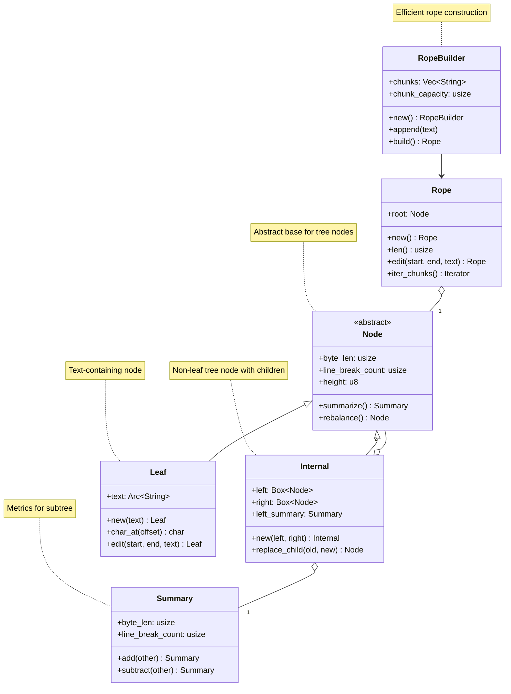

### Buffer Edit Flow

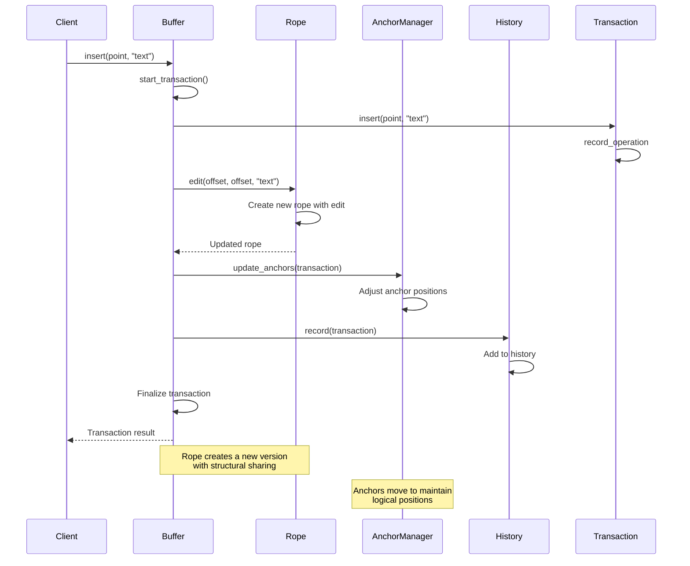

### Coordinate Mapping

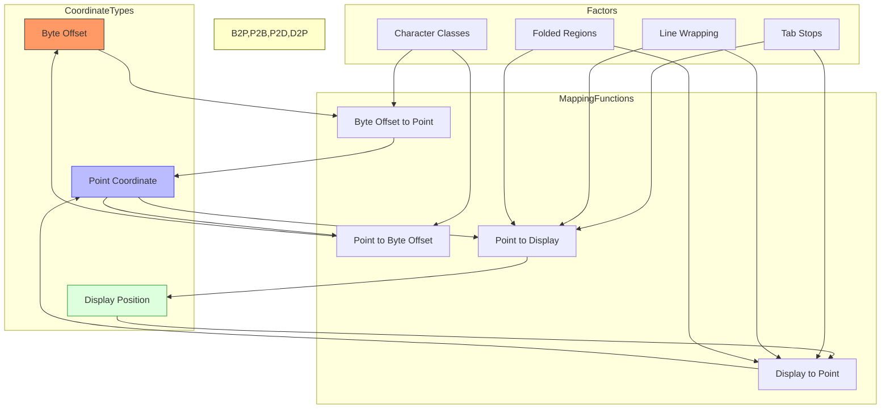

### Undo/Redo System

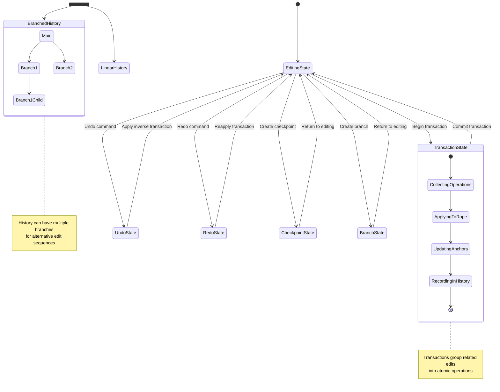

## Key Interfaces

### Buffer Operations

```
// Conceptual interface, not actual Rust code
Buffer {
    // Creation and state
    new() -> Buffer
    new_from_text(text: String) -> Buffer
    len() -> usize
    line_count() -> u32
    is_empty() -> bool
    is_modified() -> bool
    
    // Text access
    text() -> String
    line(row: u32) -> String
    text_for_range(range: Range) -> String
    char_at(point: Point) -> char
    line_ending() -> LineEnding
    
    // Editing
    insert(point: Point, text: String) -> Transaction
    delete(range: Range) -> Transaction
    replace(range: Range, text: String) -> Transaction
    append(text: String) -> Transaction
    prepend(text: String) -> Transaction
    
    // Transactions
    start_transaction() -> Transaction
    end_transaction(transaction: Transaction)
    transact<F>(func: F) -> (R, Transaction) where F: FnOnce(&mut Buffer) -> R
    
    // History
    undo() -> Option<Transaction>
    redo() -> Option<Transaction>
    checkpoint() -> CheckpointId
    revert_to_checkpoint(id: CheckpointId) -> Transaction
    branch() -> BranchId
    switch_to_branch(id: BranchId) -> Result<()>
    
    // Positions and anchors
    create_anchor(point: Point, bias: Bias) -> Anchor
    point_for_offset(offset: usize) -> Point
    offset_for_point(point: Point) -> usize
    line_len(row: u32) -> usize
    
    // Events
    subscribe_to_changes(callback: Callback) -> Subscription
    
    // Iteration
    chars() -> Iterator<char>
    lines() -> Iterator<String>
    points() -> Iterator<Point>
    
    // Utility
    find(pattern: &str) -> Vec<Range>
    replace_all(pattern: &str, replacement: &str) -> Transaction
}
```

### Rope Interface

```
// Conceptual interface, not actual Rust code
Rope {
    // Creation
    new() -> Rope
    new_from_str(text: &str) -> Rope
    new_from_chunks(chunks: Vec<String>) -> Rope
    
    // Metrics
    len() -> usize
    char_count() -> usize
    line_count() -> u32
    height() -> u8
    is_balanced() -> bool
    
    // Editing
    edit(start: usize, end: usize, text: &str) -> Rope
    insert(offset: usize, text: &str) -> Rope
    remove(start: usize, end: usize) -> Rope
    append(other: &Rope) -> Rope
    
    // Slicing
    slice(start: usize, end: usize) -> Rope
    
    // Conversion
    to_string() -> String
    
    // Character access
    char_at(offset: usize) -> char
    char_at_point(point: Point) -> char
    
    // Line access
    line(row: u32) -> String
    line_to_char(row: u32) -> usize
    char_to_line(offset: usize) -> u32
    
    // Iteration
    chars() -> Iterator<char>
    chunks() -> Iterator<&str>
    lines() -> Iterator<String>
    
    // Utility
    clone() -> Rope
    rebalance() -> Rope
}
```

### Anchor System

```
// Conceptual interface, not actual Rust code
Anchor {
    // Creation and state
    new(location: Point, bias: Bias) -> Anchor
    position() -> Point
    is_valid() -> bool
    is_equivalent_to(other: &Anchor) -> bool
    bias() -> Bias
    
    // Modification
    set_position(point: Point)
    set_bias(bias: Bias)
    invalidate()
    
    // Conversion
    to_explicit_point() -> ExplicitPoint
    
    // Lifecycle
    sync() -> bool
    track()
    untrack()
}

AnchorManager {
    // Creation
    new() -> AnchorManager
    
    // Anchor management
    create_anchor(point: Point, bias: Bias) -> Anchor
    update_anchors(transaction: &Transaction)
    invalidate_anchors_in_range(range: Range)
    
    // Cleaning
    collect_garbage()
    prune_history()
    
    // Statistics
    count() -> usize
    valid_count() -> usize
    
    // Iteration
    iter_anchors() -> Iterator<Anchor>
    iter_anchors_in_range(range: Range) -> Iterator<Anchor>
}
```

### Transaction & History

```
// Conceptual interface, not actual Rust code
Transaction {
    // Creation
    new() -> Transaction
    
    // Operations
    insert(point: Point, text: String)
    delete(range: Range)
    replace(range: Range, text: String)
    
    // Composition
    append(other: Transaction) -> Transaction
    
    // Inspection
    is_empty() -> bool
    operations() -> &[Operation]
    
    // Application
    apply(buffer: &mut Buffer) -> Result<()>
    
    // Inversion
    invert() -> Transaction
    
    // Utility
    clone() -> Transaction
}

History {
    // Creation
    new() -> History
    
    // Recording
    record(transaction: Transaction)
    
    // Navigation
    undo() -> Option<Transaction>
    redo() -> Option<Transaction>
    
    // Checkpoints
    checkpoint() -> CheckpointId
    revert_to_checkpoint(id: CheckpointId) -> Transaction
    has_checkpoint(id: CheckpointId) -> bool
    
    // Branches
    branch() -> BranchId
    switch_to_branch(id: BranchId) -> Result<()>
    current_branch() -> BranchId
    branches() -> Vec<BranchId>
    
    // State
    can_undo() -> bool
    can_redo() -> bool
    
    // Cleanup
    prune(max_operations: usize)
    clear()
}
```

## Data Structures

### Rope Implementation

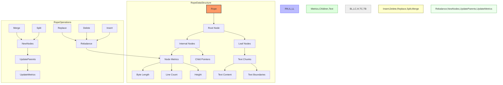

#### Key Design Principles for Rope

1. **Persistent Data Structure**: Creates new versions without modifying the original
2. **Structural Sharing**: Reuses unmodified subtrees between versions
3. **Self-balancing**: Maintains performance characteristics through rebalancing
4. **Chunked Storage**: Groups text into manageable leaf nodes
5. **Efficient Metrics**: Caches length and line count for quick access
6. **Hierarchical Access**: Log(n) operations for most text access patterns
7. **Copy-on-write**: New nodes created only for modified paths in the tree

### Buffer Implementation

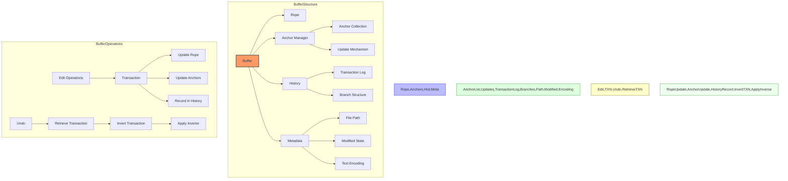

#### Key Design Principles for Buffer

1. **Immutable Core**: Rope changes create new versions rather than modifying in place
2. **Transactional Edits**: Operations are grouped into atomic transactions
3. **Position Tracking**: Anchors maintain logical positions through edits
4. **Undo History**: Maintains sequence of transactions for undo/redo
5. **Notification System**: Changes trigger events for observers
6. **Efficient Mapping**: Fast conversion between different coordinate systems
7. **Lazy Operations**: Defers expensive calculations until needed

### Anchor System

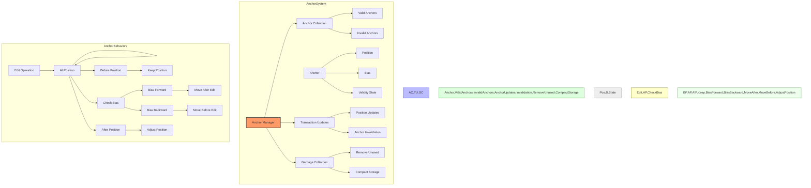

#### Key Design Principles for Anchors

1. **Logical Positions**: Track positions by logical meaning, not physical offset
2. **Bias Direction**: Specify behavior when text is inserted at anchor position
3. **Validity State**: Track whether anchors still represent valid positions
4. **Lazy Updates**: Update positions only when accessed if possible
5. **Garbage Collection**: Clean up anchors that are no longer used
6. **Efficient Updates**: Batch anchor updates for edit operations
7. **Range Support**: Anchors can mark both ends of a text range

### History Implementation

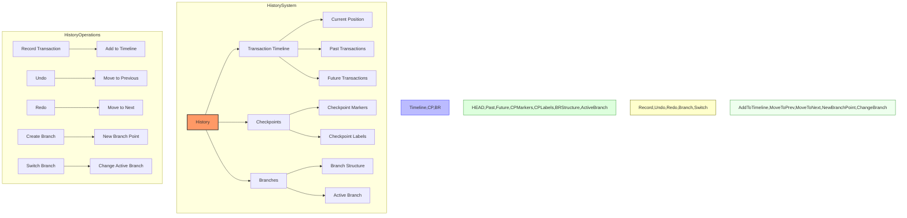

#### Key Design Principles for History

1. **Transaction Recording**: Store complete edit transactions
2. **Bidirectional Navigation**: Support both undo and redo
3. **Branched History**: Support alternative edit sequences
4. **Checkpointing**: Mark important states for later return
5. **Pruning**: Manage history size by removing old entries
6. **Composition**: Combine consecutive related operations
7. **Serialization**: Support for saving and loading history state

## Performance Characteristics

### Core Operations Complexity

| Operation | Time Complexity | Space Complexity | Notes |
|-----------|----------------|------------------|-------|
| Insert    | O(log n)       | O(log n)         | Creates new nodes along insertion path |
| Delete    | O(log n)       | O(log n)         | Creates new nodes along deletion path |
| Append    | O(log n)       | O(log n)         | Efficient for end-of-rope operations |
| Char Access | O(log n)     | O(1)             | Traverses tree to find character |
| Substring | O(log n)       | O(log n)         | Creates shallow rope with subset of nodes |
| Iteration | O(n)           | O(log n)         | Sequential traversal of rope |
| Rebalance | O(n)           | O(n)             | Full rebalance (rare operation) |
| Concat    | O(log n)       | O(log n)         | Joining two ropes |
| Line Access | O(log n)     | O(log n)         | Finding start of line by row number |

### Memory Optimization

```mermaid
graph TD
    subgraph MemoryOptimization
        SR[Structural Reuse] --> SS[Shared Subtrees]
        SR --> COW[Copy-on-Write]
        
        CS[Chunk Sizing] --> OptChunk[Optimal Chunk Size]
        CS --> FragReduce[Fragment Reduction]
        
        PC[Position Caching] --> QP[Quick Positioning]
        PC --> RP[Reduced Path Traversal]
        
        LP[Lazy Processing] --> DU[Deferred Updates]
        LP --> OM[On-demand Materialization]
    end
    
    subgraph MemoryImpact
        SS --> ReducedAllocation[Reduced Allocation]
        COW --> EfficientVersioning[Efficient Versioning]
        
        OptChunk --> BalancedOverhead[Balanced Overhead]
        FragReduce --> CompactStorage[Compact Storage]
        
        QP --> ReducedComputation[Reduced Computation]
        RP --> LessTraversal[Less Traversal Overhead]
        
        DU --> JustInTime[Just-in-time Processing]
        OM --> OnlyWhenNeeded[Only When Needed]
    end
    
    style SR,CS,PC,LP fill:#f96,stroke:#333,stroke-width:2px
    style SS,COW,OptChunk,FragReduce,QP,RP,DU,OM fill:#bbf,stroke:#33f,stroke-width:1px
    style ReducedAllocation,EfficientVersioning,BalancedOverhead,CompactStorage,ReducedComputation,LessTraversal,JustInTime,OnlyWhenNeeded fill:#dfd,stroke:#393,stroke-width:1px
```

### Optimization Techniques

1. **Chunked Storage**: Balance between too many small nodes and large monolithic nodes
2. **Piece Table Inspiration**: Efficient handling of insertions and deletions
3. **Tree Balancing**: Maintain logarithmic operation complexity
4. **Metrics Caching**: Store line counts and lengths at each node
5. **Structural Sharing**: Reuse unmodified parts of the tree
6. **Incremental Operations**: Process large texts in manageable chunks
7. **Lazy Evaluation**: Calculate properties on demand

## Swift Considerations

### Swift Implementation Strategies

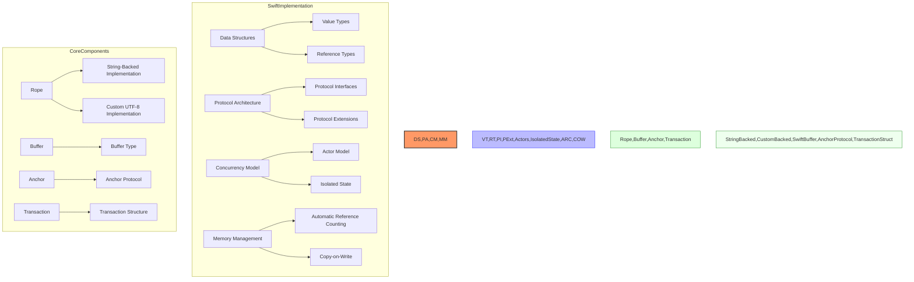

### Rope Implementation in Swift

- Consider using value types (structs) for immutable tree nodes
- Implement copy-on-write semantics for efficient versioning
- Use Swift's strong type system for coordinate types
- Consider actors for thread-safe buffer access
- Use Swift's collections and slices for efficient text chunks
- Implement custom string processing for optimal performance
- Consider leveraging Swift's unicode handling for correct text operations

### Buffer and Anchors in Swift

- Design a clear protocol-based API for buffer operations
- Use Swift's property observers for change notification
- Consider custom collection types for specialized iterations
- Implement proper error handling for all operations
- Use Swift's reference counting for anchor lifecycle management
- Consider weak references for disposable anchors
- Design a clean API for transaction composition

### History System in Swift

- Use Swift enums with associated values for transactions
- Consider using the Command pattern for undoable operations
- Design a clean branching model using Swift's type system
- Use Swift's Result type for operation outcomes
- Consider implementing Codable for history serialization
- Design a thread-safe history system using Swift concurrency
- Implement proper cleanup using Swift's lifecycle hooks

### Performance Optimization in Swift

- Leverage Swift's value semantics for immutable data
- Use unsafe APIs only where absolutely necessary for performance
- Consider custom memory management for large buffer content
- Implement incremental processing for large text operations
- Use Swift's optimization attributes for performance-critical code
- Design efficient UTF-8/UTF-16 conversion strategies
- Consider platform-specific optimizations where appropriate

## Interaction with Other Subsystems

### Buffer System → Text Editor Core
- Buffer provides the core text storage for the editor
- Editor operations manipulate buffer content through transactions
- Buffer change events drive editor updates
- See: [03_StratosphericView_TextEditorCore.md](./03_StratosphericView_TextEditorCore.md)

### Buffer System → Language Intelligence
- Language services operate on buffer content for analysis
- Incremental text changes optimize language processing
- Buffer anchors track important language positions
- See: [04_StratosphericView_LanguageIntelligence.md](./04_StratosphericView_LanguageIntelligence.md)

### Buffer System → Collaboration System
- Operational transformation coordinates multi-user edits
- Buffer transactions map to collaboration operations
- Shared buffer state is synchronized across clients
- See: [06_StratosphericView_CollaborationSystem.md](./06_StratosphericView_CollaborationSystem.md)

### Buffer System → Project Management
- Project system provides files that load into buffers
- Buffer changes drive file saving and modification tracking
- Multiple buffers coordinate for multi-file operations
- See: [05_StratosphericView_ProjectManagement.md](./05_StratosphericView_ProjectManagement.md)

For a complete map of how the Buffer System connects to all other subsystems, see: [SubsystemRelationshipMap.md](./SubsystemRelationshipMap.md)

## Next Steps

After understanding the Buffer and Rope implementation, we'll examine the Cursor and Selection models, which build on the buffer system to provide user interaction with text. This includes cursor positioning, selection management, and multi-cursor operations.