# Atmospheric View: Cursor and Selection

## Purpose

The Cursor and Selection system manages user interaction with text content, enabling precise positioning, text selection, and multi-cursor editing. This system builds on the Buffer and Anchor capabilities to create a responsive and intuitive text editing experience, handling everything from simple cursor movements to complex multi-selection operations.

## Core Concepts

### Cursor Fundamentals

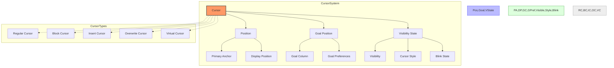

- **Cursor**: Visual indicator of insertion point
- **Position**: Location in buffer (row, column)
- **Goal Position**: Desired column for vertical movement
- **Buffer Anchor**: Stable reference to buffer position
- **Cursor Style**: Visual appearance (block, line, etc.)
- **Cursor State**: Visibility, blink status, etc.

### Selection Model

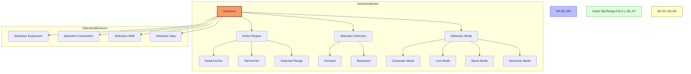

- **Selection**: Range of text between two positions
- **Head**: Leading edge of selection (cursor position)
- **Tail**: Trailing edge of selection (anchor position)
- **Direction**: Whether selection runs forward or backward
- **Selection Mode**: Character, line, or block-based selection
- **Semantic Selection**: Language-aware selection units

### Multi-Cursor System

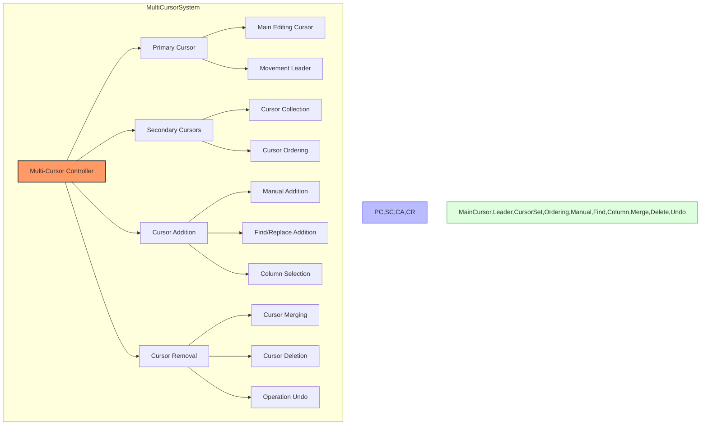

- **Multi-Cursor**: Multiple independent cursor positions
- **Primary Cursor**: Main cursor among multiple cursors
- **Secondary Cursors**: Additional editing positions
- **Cursor Set**: Collection of all active cursors
- **Cursor Addition**: Ways to create new cursors
- **Cursor Removal**: Ways to reduce cursor count

### Cursor Navigation

- **Movement**: Cursor position changes
- **Vertical Motion**: Moving up and down lines
- **Horizontal Motion**: Moving left and right
- **Word Navigation**: Moving by word boundaries
- **Smart Motion**: Context-aware movement
- **Jump Lists**: History of significant positions

### Selection Operations

- **Extend**: Grow the selection
- **Shrink**: Reduce the selection
- **Flip**: Swap head and tail
- **Multiple Selections**: Independent selection ranges
- **Selection Modification**: Operations on selected text
- **Selection Persistence**: Maintaining selection through operations

## Architecture

### Core Components

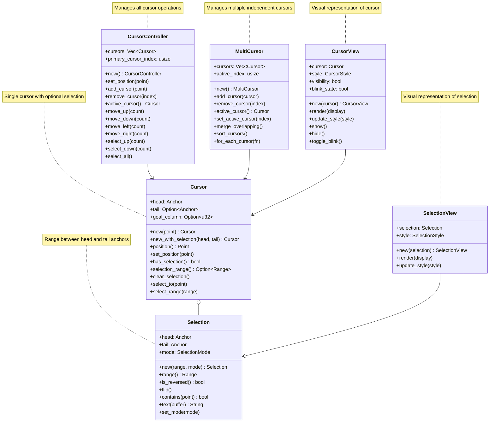

### Detailed Component Structure

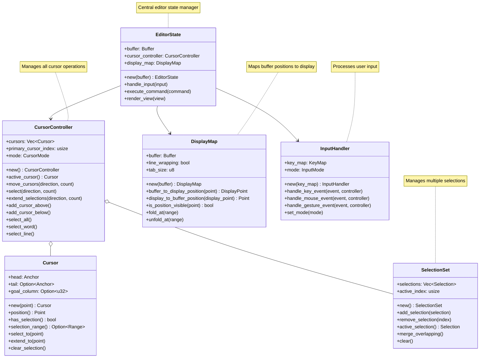

### Data Flow

#### Cursor Movement Flow

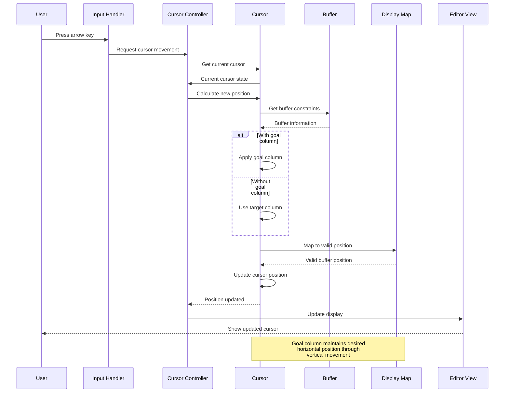

#### Selection Creation Flow

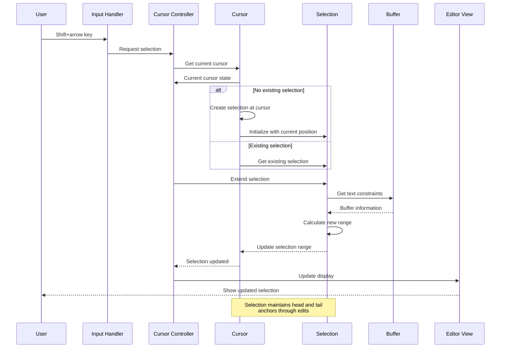

#### Multi-Cursor Creation Flow

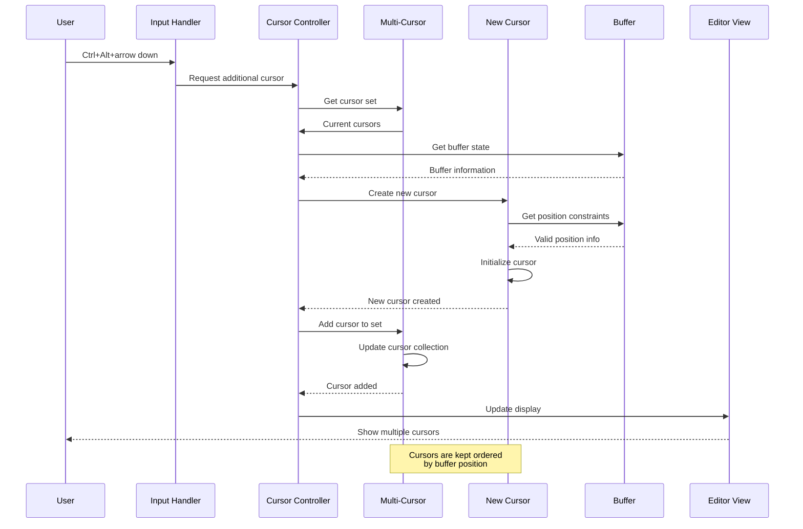

#### Find and Multi-Select Flow

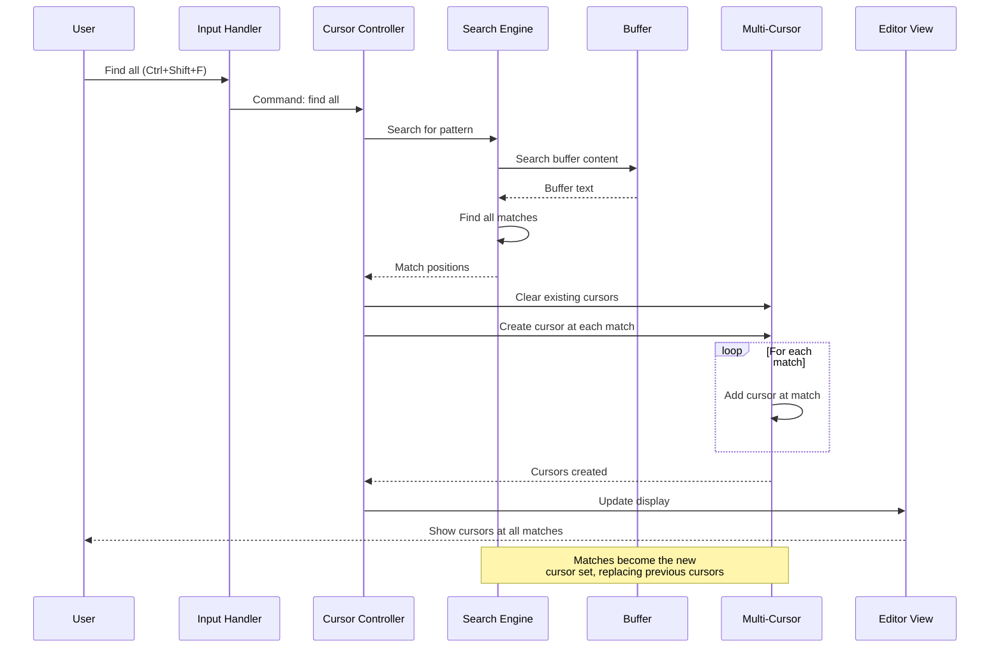

#### Column Selection Flow

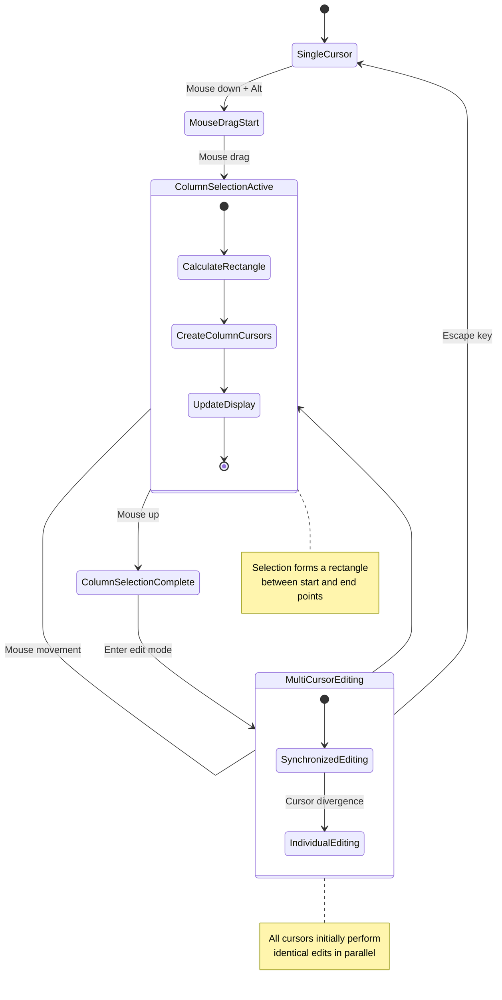

## Key Interfaces

### Cursor Controller

```
// Conceptual interface, not actual Rust code
CursorController {
    // Cursor management
    new() -> CursorController
    new_with_buffer(buffer: Buffer) -> CursorController
    active_cursor() -> Cursor
    cursors() -> Vec<Cursor>
    cursor_count() -> usize
    set_active_cursor(index: usize) -> Result<()>
    add_cursor(point: Point) -> CursorId
    remove_cursor(index: usize)
    clear_cursors()
    merge_cursors()
    
    // Basic movement
    move_up(count: usize)
    move_down(count: usize)
    move_left(count: usize)
    move_right(count: usize)
    move_to_line_start()
    move_to_line_end()
    move_to_first_line()
    move_to_last_line()
    
    // Word movement
    move_word_left()
    move_word_right()
    move_to_word_start()
    move_to_word_end()
    
    // Page movement
    page_up()
    page_down()
    
    // Semantic movement
    move_to_enclosing_bracket()
    move_to_next_paragraph()
    move_to_previous_paragraph()
    
    // Selection
    select_up(count: usize)
    select_down(count: usize)
    select_left(count: usize)
    select_right(count: usize)
    select_to_line_start()
    select_to_line_end()
    select_word()
    select_line()
    select_paragraph()
    select_all()
    
    // Multiple cursors
    add_cursor_above()
    add_cursor_below()
    split_selection_into_cursors()
    select_next_occurrence()
    select_all_occurrences()
    
    // Column selection
    start_column_selection(start: Point)
    update_column_selection(end: Point)
    end_column_selection()
    
    // Visibility
    visible_cursors() -> Vec<Cursor>
    scroll_to_cursor()
    ensure_cursor_visible()
    
    // Events
    on_cursor_changed(callback: Callback) -> Subscription
    on_selection_changed(callback: Callback) -> Subscription
}
```

### Cursor

```
// Conceptual interface, not actual Rust code
Cursor {
    // Creation
    new(point: Point) -> Cursor
    new_with_selection(head: Point, tail: Point) -> Cursor
    
    // Position
    position() -> Point
    set_position(point: Point)
    display_position(display_map: &DisplayMap) -> DisplayPoint
    
    // Goal column
    goal_column() -> Option<u32>
    set_goal_column(column: u32)
    clear_goal_column()
    
    // Selection
    has_selection() -> bool
    selection_range() -> Option<Range>
    select_to(point: Point)
    clear_selection()
    is_selection_reversed() -> bool
    flip_selection()
    
    // Anchor access
    head_anchor() -> Anchor
    tail_anchor() -> Option<Anchor>
    
    // State
    is_valid() -> bool
    clone() -> Cursor
    
    // Buffer interaction
    selected_text(buffer: &Buffer) -> String
    delete_selection(buffer: &mut Buffer) -> Option<Transaction>
}
```

### Selection

```
// Conceptual interface, not actual Rust code
Selection {
    // Creation
    new(range: Range) -> Selection
    new_with_mode(range: Range, mode: SelectionMode) -> Selection
    
    // Range
    range() -> Range
    set_range(range: Range)
    contains(point: Point) -> bool
    is_empty() -> bool
    
    // Anchors
    head() -> Point
    tail() -> Point
    set_head(point: Point)
    set_tail(point: Point)
    
    // Direction
    is_reversed() -> bool
    flip()
    
    // Mode
    mode() -> SelectionMode
    set_mode(mode: SelectionMode)
    
    // Buffer interaction
    text(buffer: &Buffer) -> String
    delete(buffer: &mut Buffer) -> Transaction
    
    // Utility
    clone() -> Selection
    merge(other: &Selection) -> Selection
    overlaps(other: &Selection) -> bool
    is_adjacent(other: &Selection) -> bool
}
```

### Multi-Cursor System

```
// Conceptual interface, not actual Rust code
MultiCursor {
    // Management
    new() -> MultiCursor
    add_cursor(cursor: Cursor) -> CursorId
    remove_cursor(id: CursorId)
    get_cursor(id: CursorId) -> Option<&Cursor>
    active_cursor() -> &Cursor
    set_active_cursor(id: CursorId)
    cursor_count() -> usize
    
    // Operations
    merge_overlapping()
    sort_cursors()
    filter_cursors(predicate: Fn(&Cursor) -> bool)
    for_each_cursor(operation: Fn(&mut Cursor))
    map_cursors<R>(operation: Fn(&Cursor) -> R) -> Vec<R>
    
    // Bulk operations
    move_all(direction: Direction, count: usize)
    select_all(direction: Direction, count: usize)
    clear_all_selections()
    
    // Column operations
    create_column_cursors(start: Point, end: Point) -> Vec<CursorId>
    
    // Events
    on_cursors_changed(callback: Callback) -> Subscription
}
```

### Display Integration

```
// Conceptual interface, not actual Rust code
CursorView {
    // Creation
    new(cursor: Cursor) -> CursorView
    
    // Rendering
    render(display: &mut Display)
    update(cursor: &Cursor)
    
    // Styling
    set_style(style: CursorStyle)
    set_color(color: Color)
    
    // Visibility
    show()
    hide()
    is_visible() -> bool
    
    // Blinking
    set_blink_enabled(enabled: bool)
    toggle_blink()
    blink_interval() -> Duration
    set_blink_interval(interval: Duration)
}

SelectionView {
    // Creation
    new(selection: Selection) -> SelectionView
    
    // Rendering
    render(display: &mut Display)
    update(selection: &Selection)
    
    // Styling
    set_style(style: SelectionStyle)
    set_colors(foreground: Color, background: Color)
    
    // Options
    set_show_inactive(show: bool)
    set_round_corners(round: bool)
}
```

## Behavioral Patterns

### Cursor Movement Patterns

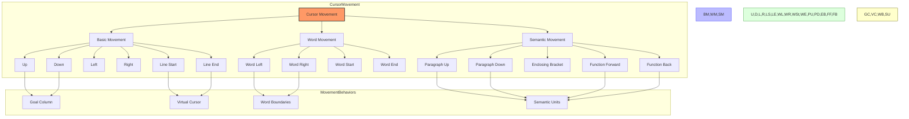

#### Key Movement Concepts

1. **Goal Column**: Maintaining desired horizontal position during vertical movement
2. **Word Boundaries**: Language-aware word start/end detection
3. **Virtual Positions**: Positions beyond physical text (line end, etc.)
4. **Wrapping Behavior**: How cursor moves at line boundaries
5. **Semantic Navigation**: Movement based on code structure
6. **Visual vs. Logical**: Movement in displayed vs. stored text

### Selection Patterns

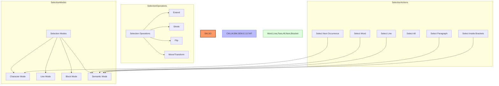

#### Key Selection Concepts

1. **Mode-specific Behavior**: Different selection modes for different tasks
2. **Extension Direction**: How selection grows in different directions
3. **Head/Tail Dynamics**: How selection endpoints behave during editing
4. **Selection Persistence**: Maintaining selection through operations
5. **Selection Transformation**: Operations that modify selection shape
6. **Selection Merging**: Combining overlapping selections

### Multi-Cursor Patterns

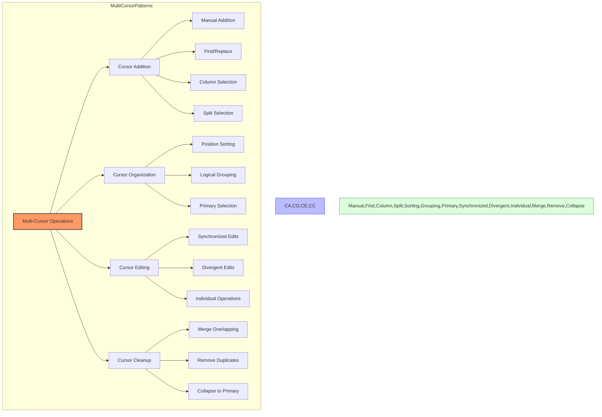

#### Key Multi-Cursor Concepts

1. **Creation Methods**: Different ways to create multiple cursors
2. **Primary Cursor**: Special status of main cursor
3. **Cursor Synchronization**: How multiple cursors behave during edits
4. **Cursor Lifetime**: When cursors are created and destroyed
5. **Cursor Independence**: How cursors operate independently
6. **Cursor Merging**: Rules for cursor collision and overlap

## State Management

### Cursor State

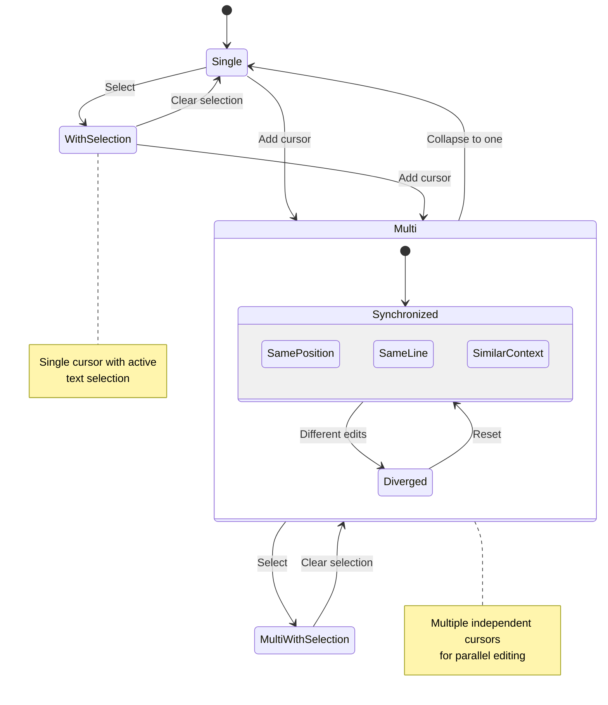

#### Key State Elements

1. **Cursor Position State**: Current location of each cursor
2. **Selection State**: Active selections for each cursor
3. **Goal Column State**: Desired column for vertical movement
4. **Visual State**: Cursor appearance and visibility
5. **Mode State**: Current editing mode affecting behavior
6. **History State**: Previous cursor positions for navigation

### Position Tracking

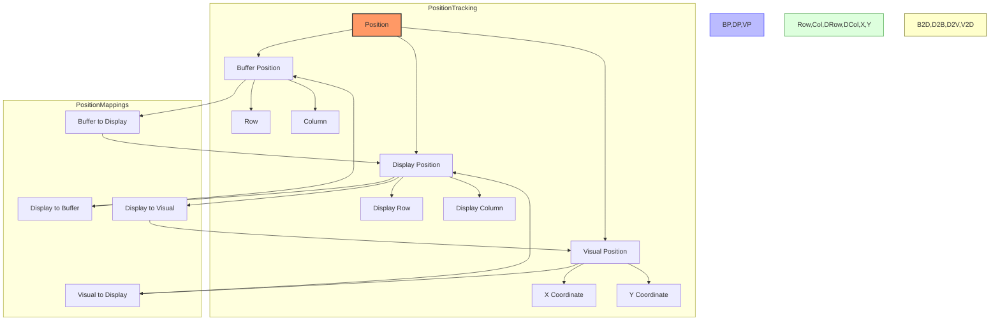

#### Key Position Concepts

1. **Buffer Coordinates**: Positions in the actual text content
2. **Display Coordinates**: Positions in the rendered view (with wrapping, etc.)
3. **Anchor Positions**: Stable positions maintained through edits
4. **Visual Coordinates**: Pixel positions on screen
5. **Position Validation**: Ensuring positions are valid in buffer
6. **Position Mapping**: Converting between coordinate systems

### Selection State

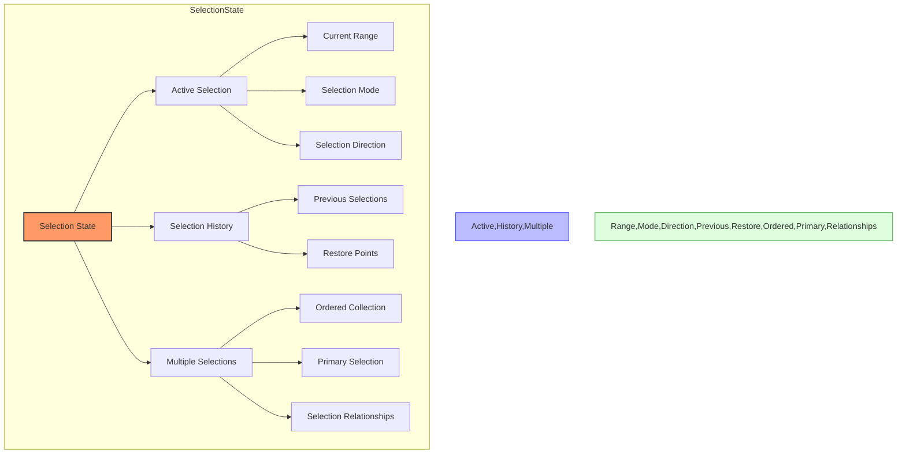

#### Key Selection State Elements

1. **Range State**: Current selected ranges for each cursor
2. **Mode State**: Character, line, or block selection mode
3. **Direction State**: Whether selection runs forward or backward
4. **History State**: Previous selections for navigation
5. **Multiple Selection State**: State of multiple independent selections
6. **Ordering State**: Relative ordering of multiple selections

## Swift Considerations

### Swift Implementation Approach

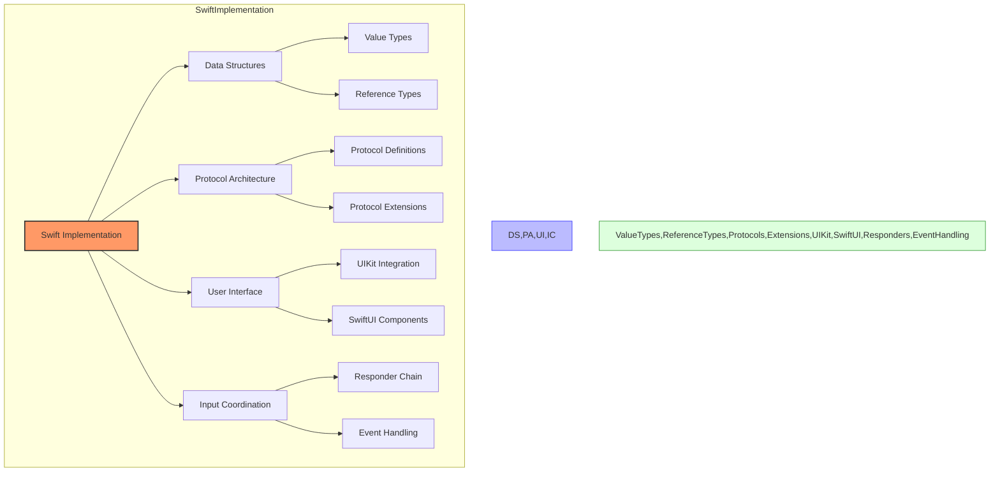

### Cursor Implementation in Swift

- Use `struct` for immutable cursor positions and selections
- Consider `class` for cursor controller with mutable state
- Use value semantics for position types (struct Point)
- Implement proper Equatable and Hashable for position types
- Consider using custom collection types for cursor sets
- Use Swift's strong type system for cursor and selection types
- Implement Foundation-compatible cursor serialization

### Selection Models in Swift

- Use Swift's ranges for selection representation
- Consider custom types for different selection modes
- Implement efficient text extraction with Swift strings
- Design clear protocols for selection behavior
- Use value semantics for selection ranges
- Consider attributed strings for selection rendering
- Implement proper Unicode handling for selection boundaries

### Multi-Cursor Implementation

- Design a clear model for cursor collections
- Use Swift arrays with proper sorting semantics
- Consider custom collection types for specialized behavior
- Implement efficient cursor merging algorithms
- Use protocol-based design for cursor behavior
- Consider using Swift's Result type for operation outcomes
- Implement custom equality for cursor comparison

### Input Handling and Event Flow

- Consider using the responder chain for input handling
- Design a clear protocol for cursor commands
- Implement efficient key binding resolution
- Use Swift's pattern matching for input processing
- Consider custom event types for specialized input
- Design clear APIs for gesture recognition
- Implement proper accessibility support

## Performance Considerations

1. **Efficient Position Tracking**: Use anchors for stable positions
2. **Batch Rendering**: Update UI efficiently with multiple cursors
3. **Lazy Calculation**: Only compute needed information
4. **Selection Caching**: Cache selection text when appropriate
5. **Cursor Merging**: Efficiently merge overlapping cursors
6. **Position Validation**: Fast checking of cursor constraints
7. **Memory Management**: Proper handling of cursor/selection lifecycle

## Interaction with Other Subsystems

### Cursor System → Buffer System
- Cursors reference buffer positions through anchors
- Edit operations are performed at cursor locations
- Selection ranges define edit targets in buffer
- See: [13_AtmosphericView_BufferAndRope.md](./13_AtmosphericView_BufferAndRope.md)

### Cursor System → Text Editor Core
- Editor view renders cursors and selections
- Input events are translated to cursor operations
- Editor commands operate on cursor state
- See: [03_StratosphericView_TextEditorCore.md](./03_StratosphericView_TextEditorCore.md)

### Cursor System → Language Intelligence
- Semantic cursor movement uses language structure
- Smart selection leverages syntax understanding
- Code actions operate at cursor positions
- See: [04_StratosphericView_LanguageIntelligence.md](./04_StratosphericView_LanguageIntelligence.md)

### Cursor System → Collaboration System
- Remote cursors show collaborator positions
- Selection sharing enables awareness
- Cursor operations are synchronized across clients
- See: [06_StratosphericView_CollaborationSystem.md](./06_StratosphericView_CollaborationSystem.md)

For a complete map of how the Cursor System connects to all other subsystems, see: [SubsystemRelationshipMap.md](./SubsystemRelationshipMap.md)

## Next Steps

After understanding the Cursor and Selection systems, we'll examine the Syntax Highlighting implementation, which provides visual differentiation of code elements based on language syntax. This includes Tree-sitter integration, tokenization, and theme-based styling.