# Atmospheric View: Syntax Highlighting

## Purpose

The Syntax Highlighting system provides visual differentiation of code elements based on language syntax, enhancing code readability and comprehension. It integrates Tree-sitter parsing, theme-based styling, and incremental updates to efficiently render syntax-aware colorization and formatting of source code in the editor.

## Core Concepts

### Syntax Parsing Architecture

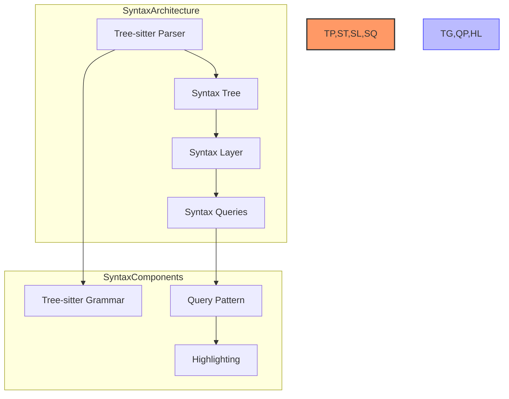

- **Tree-sitter**: Incremental parsing system for syntax trees
- **Grammar**: Language-specific parsing rules
- **Syntax Tree**: Hierarchical representation of code structure
- **Nodes**: Elements in the syntax tree
- **Queries**: Pattern matching against the syntax tree
- **Captures**: Named elements from query matches

### Highlighting System

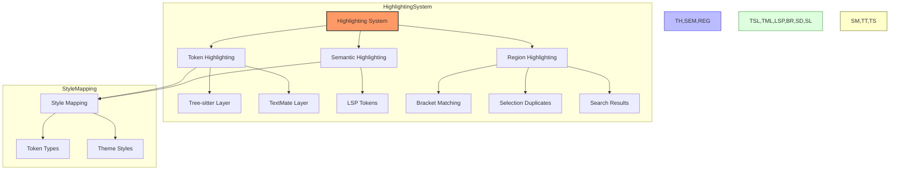

- **Token Highlighting**: Syntax-based colorization of code elements
- **Semantic Highlighting**: Language-server provided token styling
- **Region Highlighting**: Special highlighted areas (search, brackets)
- **Style Mapping**: Connecting syntax elements to visual styles
- **Theme Integration**: Using theme colors for syntax elements
- **Scope Selectors**: Targeting specific syntax elements

### Incremental Processing

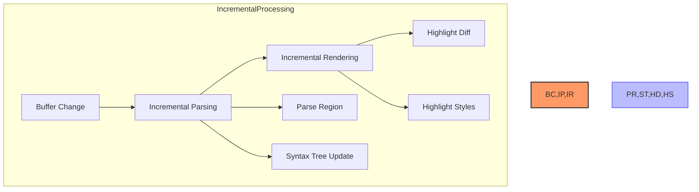

- **Incremental Parsing**: Only reparse changed portions of text
- **Change Tracking**: Monitoring buffer modifications
- **Visible Range**: Prioritizing visible text for highlighting
- **Lazy Highlighting**: Processing syntax on demand
- **Highlight Batching**: Grouping highlight operations
- **Background Processing**: Non-blocking syntax analysis

### Layer Integration

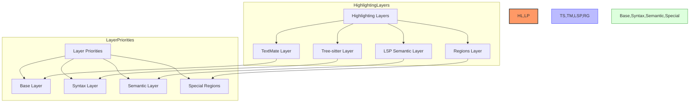

- **Layer Stack**: Multiple highlighting sources combined
- **Layer Priority**: Order of application for highlighting layers
- **Layer Blending**: How overlapping highlights are combined
- **Layer Configuration**: Enabling/disabling specific layers
- **Layer Extensions**: Adding custom highlighting layers

## Architecture

### Core Components

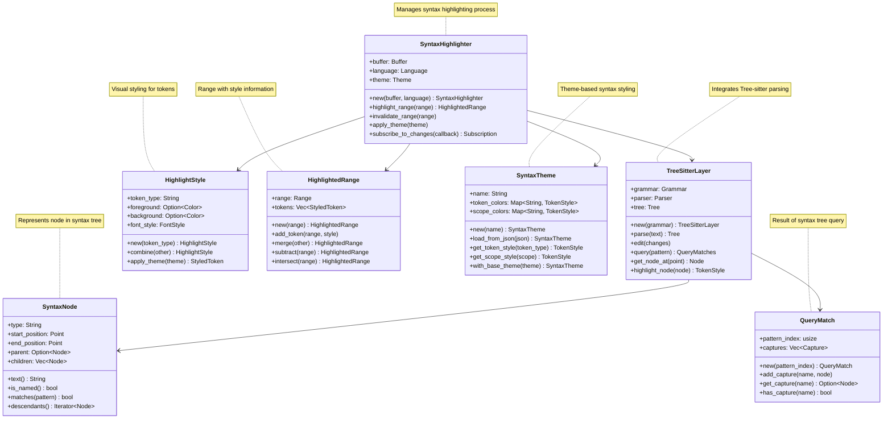

### Detailed Tree-sitter Integration

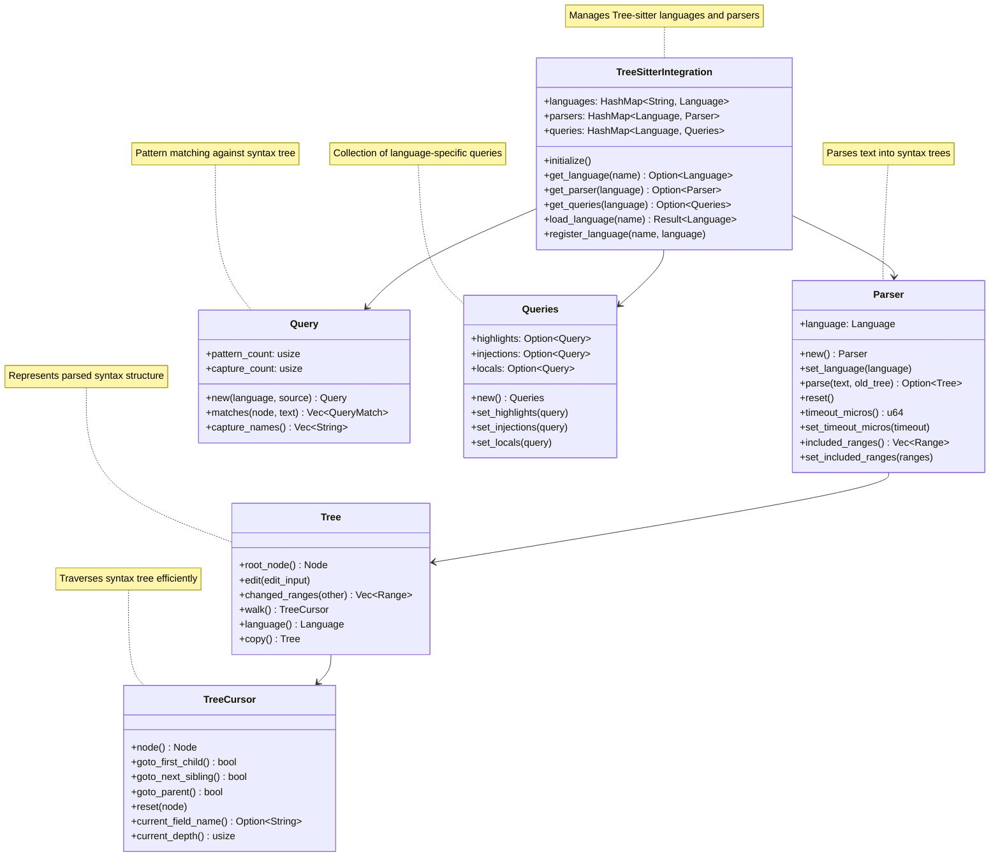

### Highlight Processing Flow

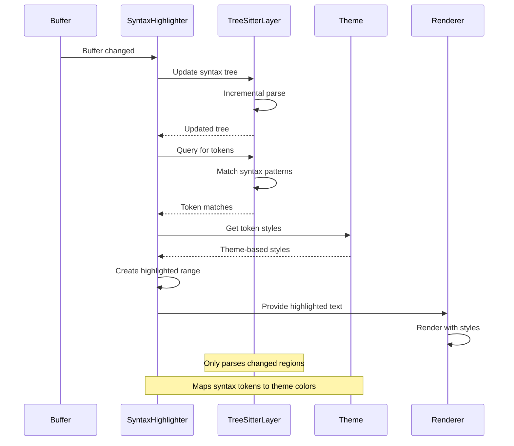

### Incremental Update Flow

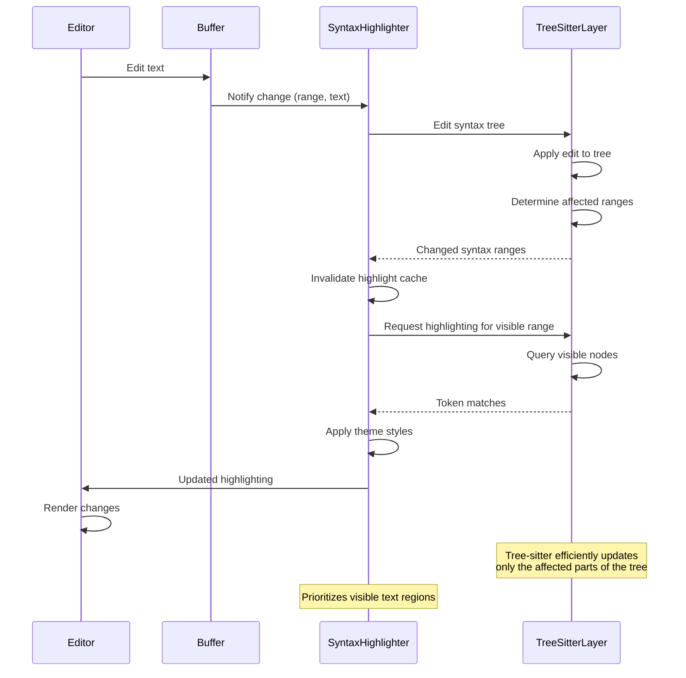

### Multi-Language Embedding Flow

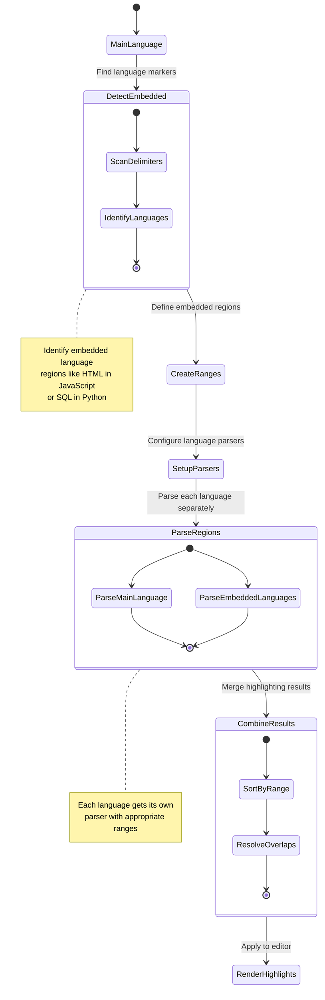

## Key Interfaces

### Syntax Highlighter

```
// Conceptual interface, not actual Rust code
SyntaxHighlighter {
    // Creation
    new(buffer: Buffer, language: Language) -> SyntaxHighlighter
    with_theme(theme: Theme) -> SyntaxHighlighter
    
    // Core highlighting
    highlight_range(range: Range) -> HighlightedRange
    highlight_visible_range(view: &EditorView) -> HighlightedRange
    
    // Incremental updates
    invalidate_range(range: Range)
    update_tree(edit: &TextEdit)
    
    // Configuration
    set_language(language: Language)
    set_theme(theme: Theme)
    set_highlight_config(config: HighlightConfig)
    
    // Layer management
    add_highlighting_layer(layer: HighlightLayer)
    remove_highlighting_layer(layer_id: LayerId)
    set_layer_priority(layer_id: LayerId, priority: usize)
    
    // State
    is_valid() -> bool
    has_pending_work() -> bool
    tree() -> Option<&Tree>
    
    // Events
    on_highlight_changed(callback: Callback) -> Subscription
    
    // Performance
    priority_range(range: Range)
    suspend_highlighting()
    resume_highlighting()
}
```

### Tree-sitter Integration

```
// Conceptual interface, not actual Rust code
TreeSitterLayer {
    // Creation
    new(language: Language) -> TreeSitterLayer
    with_queries(queries: Queries) -> TreeSitterLayer
    
    // Parsing
    parse(text: &str) -> Tree
    edit_tree(edit: &TextEdit)
    
    // Queries
    query(source: &str) -> Query
    query_matches(query: &Query, node: &Node) -> Vec<QueryMatch>
    node_at_point(point: Point) -> Option<Node>
    nodes_in_range(range: Range) -> Vec<Node>
    
    // Highlighting
    highlight_node(node: &Node) -> Vec<HighlightTag>
    highlight_range(range: Range) -> Vec<(Range, HighlightTag)>
    
    // Language injection
    register_injection_language(scope: &str, language: Language)
    detect_injections(node: &Node) -> Vec<(Range, Language)>
    
    // Performance
    set_included_ranges(ranges: Vec<Range>)
    set_timeout_micros(timeout: u64)
}
```

### Syntax Node

```
// Conceptual interface, not actual Rust code
SyntaxNode {
    // Properties
    type_name() -> &str
    start_position() -> Point
    end_position() -> Point
    start_byte() -> usize
    end_byte() -> usize
    is_named() -> bool
    is_missing() -> bool
    is_extra() -> bool
    
    // Tree navigation
    parent() -> Option<Node>
    child(index: usize) -> Option<Node>
    children() -> Vec<Node>
    named_children() -> Vec<Node>
    child_count() -> usize
    named_child_count() -> usize
    first_child() -> Option<Node>
    last_child() -> Option<Node>
    next_sibling() -> Option<Node>
    prev_sibling() -> Option<Node>
    
    // Content
    text() -> String
    field_name_for_child(index: usize) -> Option<&str>
    child_by_field_name(field: &str) -> Option<Node>
    
    // Traversal
    walk() -> TreeCursor
    descendants() -> Vec<Node>
    descendants_of_type(type_name: &str) -> Vec<Node>
    
    // Predicates
    has_changes() -> bool
    has_error() -> bool
    matches(pattern: &str) -> bool
}
```

### Highlighted Range

```
// Conceptual interface, not actual Rust code
HighlightedRange {
    // Creation
    new(range: Range) -> HighlightedRange
    
    // Token management
    add_token(range: Range, style: TokenStyle)
    add_tokens(tokens: Vec<(Range, TokenStyle)>)
    tokens() -> &[(Range, TokenStyle)]
    
    // Range operations
    range() -> Range
    merge(other: &HighlightedRange) -> HighlightedRange
    split_at(point: Point) -> (HighlightedRange, HighlightedRange)
    subtract(range: Range) -> Vec<HighlightedRange>
    intersect(range: Range) -> Option<HighlightedRange>
    
    // Styling
    apply_theme(theme: &Theme) -> HighlightedText
    style_at_point(point: Point) -> Option<TokenStyle>
    styles_in_range(range: Range) -> Vec<(Range, TokenStyle)>
    
    // Serialization
    to_attributed_string() -> AttributedString
    to_html() -> String
}
```

### Theme Integration

```
// Conceptual interface, not actual Rust code
SyntaxTheme {
    // Creation
    new(name: String) -> SyntaxTheme
    from_json(json: &str) -> Result<SyntaxTheme>
    
    // Token styling
    get_token_style(token_type: &str) -> TokenStyle
    get_scope_style(scope: &str) -> TokenStyle
    
    // Theme operations
    merge(other: &SyntaxTheme) -> SyntaxTheme
    with_base_theme(theme: &Theme) -> SyntaxTheme
    
    // Configuration
    set_token_style(token_type: &str, style: TokenStyle)
    set_scope_style(scope: &str, style: TokenStyle)
    
    // Utilities
    token_types() -> Vec<String>
    scopes() -> Vec<String>
    color_for_token(token_type: &str) -> Option<Color>
}
```

## Data Structures

### Syntax Tree Structure

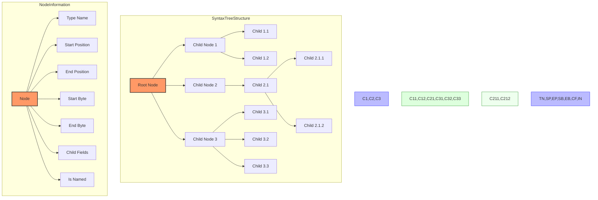

#### Key Principles of Syntax Trees

1. **Hierarchical Structure**: Represents code as nested nodes
2. **Node Types**: Each node has a specific type (e.g., function, identifier)
3. **Position Information**: Each node tracks its position in source
4. **Parent-Child Relationships**: Nodes maintain their hierarchy
5. **Named vs. Anonymous**: Some nodes have semantic meaning
6. **Field Associations**: Children may be associated with named fields
7. **Incremental Updates**: Only changed parts are reparsed

### Query System

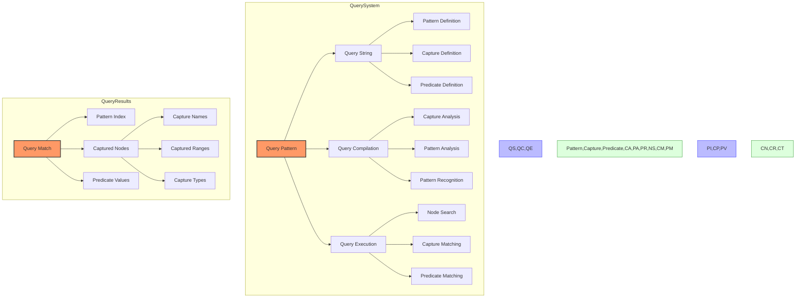

#### Key Query Concepts

1. **Pattern Definition**: Specifies what to look for in syntax tree
2. **Captures**: Named parts of pattern to extract
3. **Predicates**: Conditions that matches must satisfy
4. **Match Results**: Collection of nodes matching the pattern
5. **Capture Names**: Identification of captured nodes
6. **Query Optimization**: Efficient pattern matching
7. **Query Reuse**: Compiling queries once, using many times

### Highlighting Layers

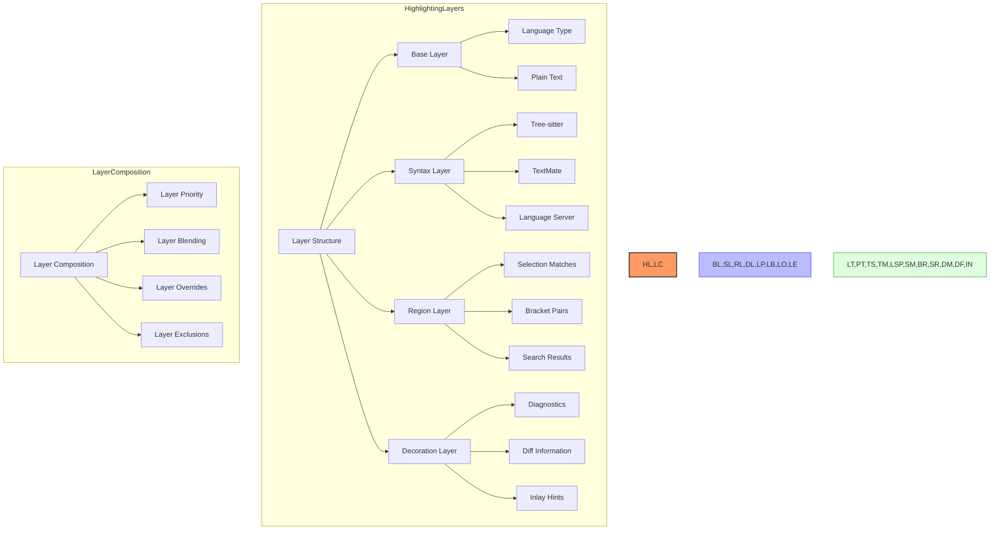

#### Key Layer Concepts

1. **Layer Stack**: Multiple layers building the final highlighting
2. **Layer Priority**: Which layers take precedence when overlapping
3. **Layer Blending**: How overlapping styles combine
4. **Base Layer**: Fundamental language-based highlighting
5. **Special Regions**: Highlighting specific areas differently
6. **Decorations**: Additional visual elements beyond syntax
7. **Layer Configuration**: Enabling/disabling specific layers

### Highlight Caching

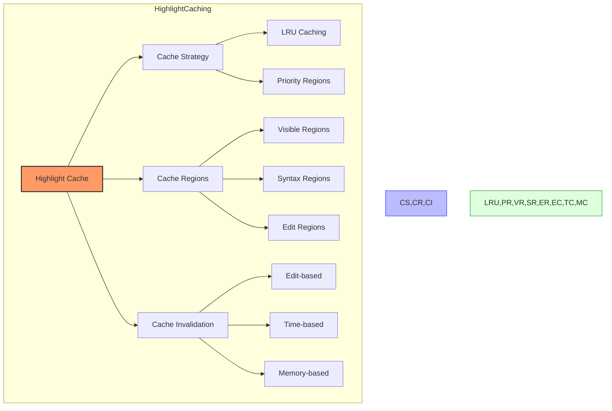

#### Key Caching Principles

1. **Region-Based Caching**: Store highlighting for regions of text
2. **Visible-First Strategy**: Prioritize caching visible text
3. **Edit Invalidation**: Clear cache for modified regions
4. **Partial Invalidation**: Only invalidate affected regions
5. **LRU Strategy**: Discard least recently used cache entries
6. **Memory Limits**: Constrain cache size based on available memory
7. **Background Caching**: Fill cache during idle time

## Performance Characteristics

### Parsing Performance

| Operation | Time Complexity | Space Complexity | Notes |
|-----------|----------------|------------------|-------|
| Initial Parse | O(n) | O(n) | Full parse of entire document |
| Incremental Parse | O(log(n) + k) | O(log(n) + k) | Where k is size of change |
| Tree Query | O(m) | O(m) | Where m is size of matches |
| Node Traversal | O(1) | O(1) | Moving between adjacent nodes |
| Tree Walk | O(n) | O(1) | Using TreeCursor for iteration |
| Node Search | O(log n) | O(1) | Finding node at position |
| Query Execution | O(n) | O(m) | Where n is tree size, m is matches |
| Highlight Generation | O(v) | O(v) | Where v is size of visible text |

### Optimization Techniques

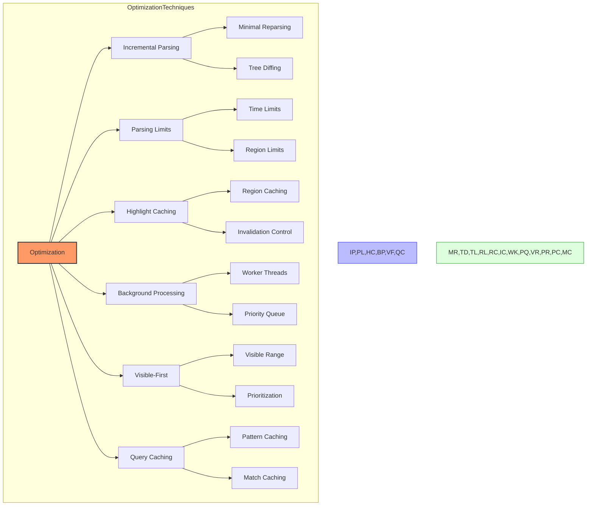

#### Key Optimization Strategies

1. **Incremental Parsing**: Only reparse changed regions
2. **Visible-First Strategy**: Prioritize visible text for processing
3. **Lazy Highlighting**: Process highlighting on demand
4. **Time Slicing**: Limit processing time to maintain responsiveness
5. **Background Processing**: Handle heavy work off the main thread
6. **Query Caching**: Reuse compiled queries and common results
7. **Memory Management**: Efficient use of memory for syntax trees

## Swift Considerations

### Swift Implementation Strategies

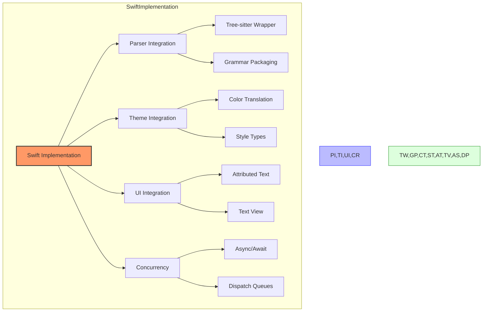

### Tree-sitter in Swift

- Create a Swift wrapper around Tree-sitter's C API
- Handle memory management for Tree-sitter objects
- Consider using Swift's value semantics for immutable trees
- Implement Objective-C bridging for C types
- Design a clean Swift API that hides C implementation details
- Use Swift's error handling for parser errors
- Consider packaging language grammars with the application

### Highlighting Implementation

- Use NSAttributedString for styled text
- Design custom Swift types for token styles
- Leverage Swift's strong type system for token types
- Consider using protocol-oriented design for highlighters
- Implement efficient caching with Swift's collections
- Use value types for immutable highlighting results
- Consider custom drawing for advanced highlighting effects

### Theme Integration

- Design a Swift-native theme model
- Use Swift's Codable for theme parsing
- Consider property wrappers for theme properties
- Implement proper color space handling
- Design for dark mode compatibility
- Use Swift's enum for token types
- Consider using Swift's KeyPath for style mapping

### Concurrency and Performance

- Use Swift's structured concurrency for async operations
- Consider actors for thread-safe state
- Implement efficient incremental updates
- Use Swift's dispatch queues for background work
- Design for cancellable operations
- Consider using Swift's tasks for prioritized work
- Implement proper progress reporting

## Interaction with Other Subsystems

### Syntax Highlighting → Text Editor Core
- Provides visual styling for text content
- Affects rendering of editor content
- Requires buffer content and change notifications
- See: [03_StratosphericView_TextEditorCore.md](./03_StratosphericView_TextEditorCore.md)

### Syntax Highlighting → Buffer System
- Receives content changes from buffer
- Tracks changes for incremental updates
- Processes buffer content for highlighting
- See: [13_AtmosphericView_BufferAndRope.md](./13_AtmosphericView_BufferAndRope.md)

### Syntax Highlighting → Language Intelligence
- Uses Tree-sitter for syntax understanding
- Receives semantic tokens from language servers
- Shares language detection and grammar selection
- See: [04_StratosphericView_LanguageIntelligence.md](./04_StratosphericView_LanguageIntelligence.md)

### Syntax Highlighting → Theme System
- Receives styling information from themes
- Maps syntax tokens to theme colors
- Adapts to theme changes
- See: [12_StratosphericView_ThemeSystem.md](./12_StratosphericView_ThemeSystem.md)

### Syntax Highlighting → Cursor System
- Highlights text at cursor position
- Shows matching brackets for cursor position
- Highlights other occurrences of selected text
- See: [14_AtmosphericView_CursorAndSelection.md](./14_AtmosphericView_CursorAndSelection.md)

For a complete map of how the Syntax Highlighting system connects to all other subsystems, see: [SubsystemRelationshipMap.md](./SubsystemRelationshipMap.md)

## Next Steps

After understanding the Syntax Highlighting system, we'll examine the UI Components, which provide the visual building blocks for Zed's user interface. This includes core UI elements, layout patterns, and event handling mechanisms that build on the GPUI framework.