# Atmospheric View: UI Components

## Purpose

The UI Components system provides the visual building blocks for Zed's user interface, enabling consistent, performant, and composable UI elements that can be assembled into complex interfaces. Built on top of the GPUI framework, these components implement Zed's design language while providing a rich set of interactions and behaviors.

## Core Concepts

### Component Architecture

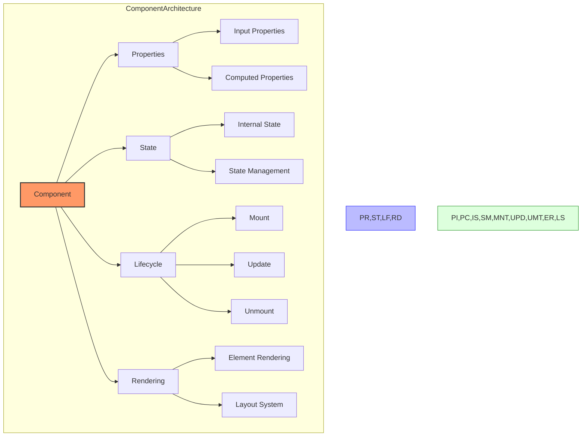
```mermaid
graph TD
    subgraph ComponentArchitecture
        CP[Component]
        
        CP --> PR[Properties]
        CP --> ST[State]
        CP --> LF[Lifecycle]
        CP --> RD[Rendering]
        
        PR --> PI[Input Properties]
        PR --> PC[Computed Properties]
        
        ST --> IS[Internal State]
        ST --> SM[State Management]
        
        LF --> MNT[Mount]
        LF --> UPD[Update]
        LF --> UMT[Unmount]
        
        RD --> ER[Element Rendering]
        RD --> LS[Layout System]
    end
    
    style CP fill:#f96,stroke:#333,stroke-width:2px
    style PR,ST,LF,RD fill:#bbf,stroke:#33f,stroke-width:1px
    style PI,PC,IS,SM,MNT,UPD,UMT,ER,LS fill:#dfd,stroke:#393,stroke-width:1px
```

- **Component**: Reusable UI element with defined behavior
- **Properties**: Input values passed to components
- **State**: Internal component state management
- **Lifecycle**: Component creation, update, and destruction
- **Rendering**: Visual representation of component
- **Composition**: Building complex UIs from simple components

### Element System

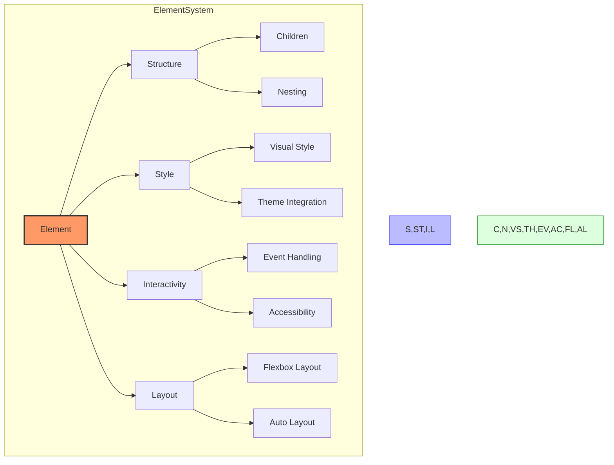
```mermaid
graph TD
    subgraph ElementSystem
        E[Element]
        
        E --> S[Structure]
        E --> ST[Style]
        E --> I[Interactivity]
        E --> L[Layout]
        
        S --> C[Children]
        S --> N[Nesting]
        
        ST --> VS[Visual Style]
        ST --> TH[Theme Integration]
        
        I --> EV[Event Handling]
        I --> AC[Accessibility]
        
        L --> FL[Flexbox Layout]
        L --> AL[Auto Layout]
    end
    
    style E fill:#f96,stroke:#333,stroke-width:2px
    style S,ST,I,L fill:#bbf,stroke:#33f,stroke-width:1px
    style C,N,VS,TH,EV,AC,FL,AL fill:#dfd,stroke:#393,stroke-width:1px
```

- **Element**: Building block of UI rendering
- **Structure**: Organization of element tree
- **Style**: Visual presentation rules
- **Interactivity**: User interaction handling
- **Layout**: Positioning and sizing of elements
- **Composition**: Combining elements into complex structures

### Component Library

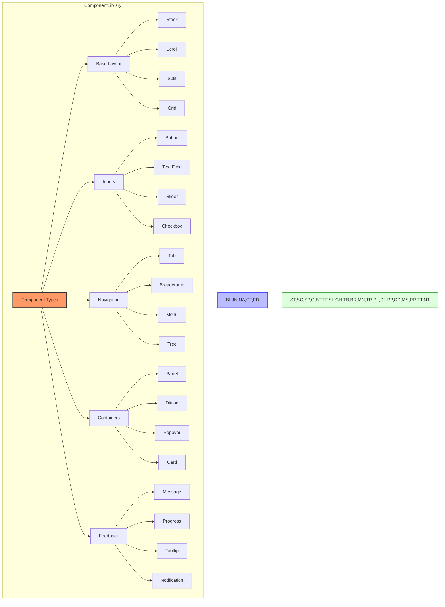
```mermaid
graph TD
    subgraph ComponentLibrary
        CL[Component Types]
        
        CL --> BL[Base Layout]
        CL --> IN[Inputs]
        CL --> NA[Navigation]
        CL --> CT[Containers]
        CL --> FD[Feedback]
        
        BL --> ST[Stack]
        BL --> SC[Scroll]
        BL --> SP[Split]
        BL --> G[Grid]
        
        IN --> BT[Button]
        IN --> TF[Text Field]
        IN --> SL[Slider]
        IN --> CH[Checkbox]
        
        NA --> TB[Tab]
        NA --> BR[Breadcrumb]
        NA --> MN[Menu]
        NA --> TR[Tree]
        
        CT --> PL[Panel]
        CT --> DL[Dialog]
        CT --> PP[Popover]
        CT --> CD[Card]
        
        FD --> MS[Message]
        FD --> PR[Progress]
        FD --> TT[Tooltip]
        FD --> NT[Notification]
    end
    
    style CL fill:#f96,stroke:#333,stroke-width:2px
    style BL,IN,NA,CT,FD fill:#bbf,stroke:#33f,stroke-width:1px
    style ST,SC,SP,G,BT,TF,SL,CH,TB,BR,MN,TR,PL,DL,PP,CD,MS,PR,TT,NT fill:#dfd,stroke:#393,stroke-width:1px
```

- **Base Layouts**: Fundamental layout components
- **Input Controls**: User input gathering components
- **Navigation**: User interface navigation components
- **Containers**: Content organization components
- **Feedback**: User notification components
- **Data Display**: Information presentation components

### Styling System

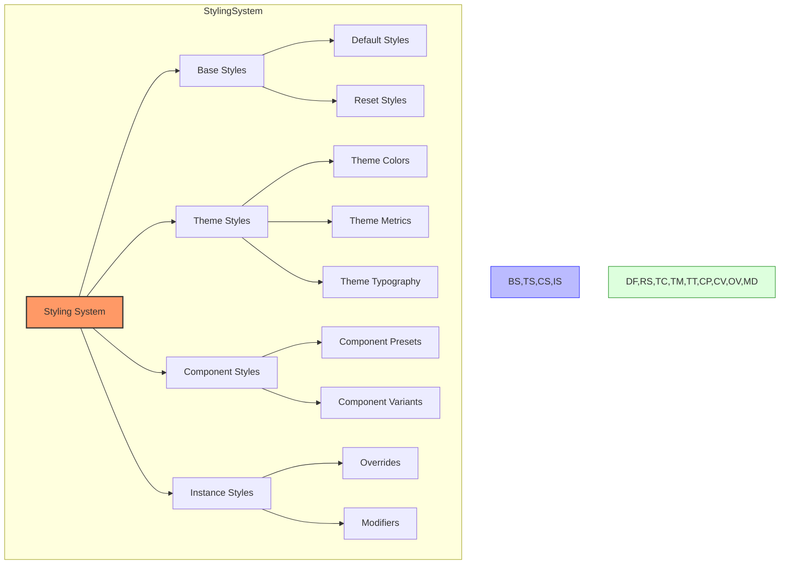
```mermaid
graph TD
    subgraph StylingSystem
        SS[Styling System]
        
        SS --> BS[Base Styles]
        SS --> TS[Theme Styles]
        SS --> CS[Component Styles]
        SS --> IS[Instance Styles]
        
        BS --> DF[Default Styles]
        BS --> RS[Reset Styles]
        
        TS --> TC[Theme Colors]
        TS --> TM[Theme Metrics]
        TS --> TT[Theme Typography]
        
        CS --> CP[Component Presets]
        CS --> CV[Component Variants]
        
        IS --> OV[Overrides]
        IS --> MD[Modifiers]
    end
    
    style SS fill:#f96,stroke:#333,stroke-width:2px
    style BS,TS,CS,IS fill:#bbf,stroke:#33f,stroke-width:1px
    style DF,RS,TC,TM,TT,CP,CV,OV,MD fill:#dfd,stroke:#393,stroke-width:1px
```

- **Base Styles**: Foundational visual properties
- **Theme Integration**: Theme-based styling
- **Component Styles**: Component-specific styling
- **Style Inheritance**: Style cascading rules
- **Style Variants**: Alternate component appearances
- **Style Composition**: Combining styles

### Layout System

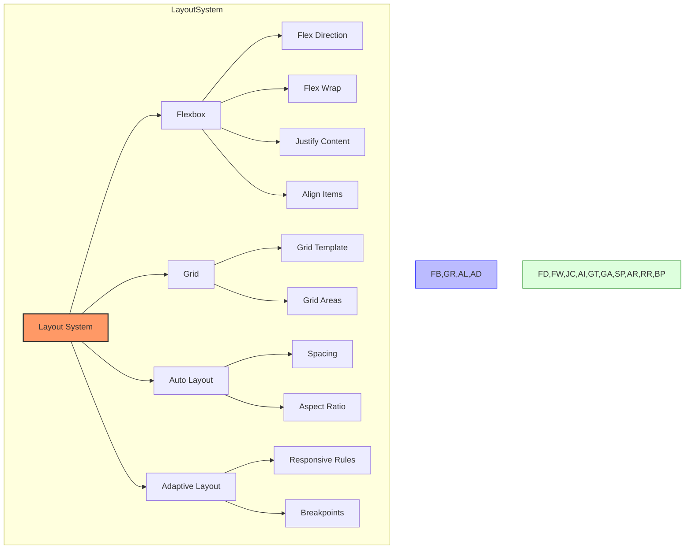
```mermaid
graph TD
    subgraph LayoutSystem
        LS[Layout System]
        
        LS --> FB[Flexbox]
        LS --> GR[Grid]
        LS --> AL[Auto Layout]
        LS --> AD[Adaptive Layout]
        
        FB --> FD[Flex Direction]
        FB --> FW[Flex Wrap]
        FB --> JC[Justify Content]
        FB --> AI[Align Items]
        
        GR --> GT[Grid Template]
        GR --> GA[Grid Areas]
        
        AL --> SP[Spacing]
        AL --> AR[Aspect Ratio]
        
        AD --> RR[Responsive Rules]
        AD --> BP[Breakpoints]
    end
    
    style LS fill:#f96,stroke:#333,stroke-width:2px
    style FB,GR,AL,AD fill:#bbf,stroke:#33f,stroke-width:1px
    style FD,FW,JC,AI,GT,GA,SP,AR,RR,BP fill:#dfd,stroke:#393,stroke-width:1px
```

- **Flexbox**: Flexible box layout system
- **Grid**: Two-dimensional grid layout
- **Stack**: Linear organization of elements
- **Absolute Positioning**: Manual positioning
- **Size Constraints**: Width and height rules
- **Spacing**: Margin and padding management

## Architecture

### Core Components

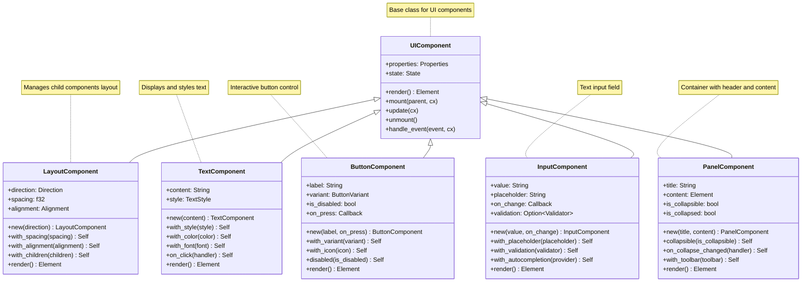
```mermaid
classDiagram
    class UIComponent {
        +properties: Properties
        +state: State
        +render() Element
        +mount(parent, cx)
        +update(cx)
        +unmount()
        +handle_event(event, cx)
    }
    
    class LayoutComponent {
        +direction: Direction
        +spacing: f32
        +alignment: Alignment
        +new(direction) LayoutComponent
        +with_spacing(spacing) Self
        +with_alignment(alignment) Self
        +with_children(children) Self
        +render() Element
    }
    
    class TextComponent {
        +content: String
        +style: TextStyle
        +new(content) TextComponent
        +with_style(style) Self
        +with_color(color) Self
        +with_font(font) Self
        +on_click(handler) Self
        +render() Element
    }
    
    class ButtonComponent {
        +label: String
        +variant: ButtonVariant
        +is_disabled: bool
        +on_press: Callback
        +new(label, on_press) ButtonComponent
        +with_variant(variant) Self
        +with_icon(icon) Self
        +disabled(is_disabled) Self
        +render() Element
    }
    
    class InputComponent {
        +value: String
        +placeholder: String
        +on_change: Callback
        +validation: Option~Validator~
        +new(value, on_change) InputComponent
        +with_placeholder(placeholder) Self
        +with_validation(validator) Self
        +with_autocompletion(provider) Self
        +render() Element
    }
    
    class PanelComponent {
        +title: String
        +content: Element
        +is_collapsible: bool
        +is_collapsed: bool
        +new(title, content) PanelComponent
        +collapsible(is_collapsible) Self
        +on_collapse_changed(handler) Self
        +with_toolbar(toolbar) Self
        +render() Element
    }
    
    UIComponent <|-- LayoutComponent
    UIComponent <|-- TextComponent
    UIComponent <|-- ButtonComponent
    UIComponent <|-- InputComponent
    UIComponent <|-- PanelComponent
    
    note for UIComponent "Base class for UI components"
    note for LayoutComponent "Manages child components layout"
    note for TextComponent "Displays and styles text"
    note for ButtonComponent "Interactive button control"
    note for InputComponent "Text input field"
    note for PanelComponent "Container with header and content"
```

### UI Element Types

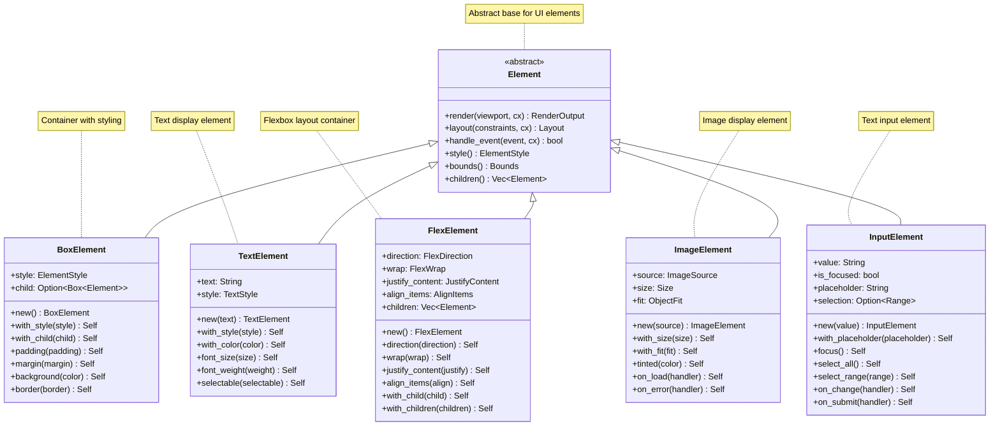
```mermaid
classDiagram
    class Element {
        <<abstract>>
        +render(viewport, cx) RenderOutput
        +layout(constraints, cx) Layout
        +handle_event(event, cx) bool
        +style() ElementStyle
        +bounds() Bounds
        +children() Vec~Element~
    }
    
    class BoxElement {
        +style: ElementStyle
        +child: Option~Box~Element~~
        +new() BoxElement
        +with_style(style) Self
        +with_child(child) Self
        +padding(padding) Self
        +margin(margin) Self
        +background(color) Self
        +border(border) Self
    }
    
    class TextElement {
        +text: String
        +style: TextStyle
        +new(text) TextElement
        +with_style(style) Self
        +with_color(color) Self
        +font_size(size) Self
        +font_weight(weight) Self
        +selectable(selectable) Self
    }
    
    class FlexElement {
        +direction: FlexDirection
        +wrap: FlexWrap
        +justify_content: JustifyContent
        +align_items: AlignItems
        +children: Vec~Element~
        +new() FlexElement
        +direction(direction) Self
        +wrap(wrap) Self
        +justify_content(justify) Self
        +align_items(align) Self
        +with_child(child) Self
        +with_children(children) Self
    }
    
    class ImageElement {
        +source: ImageSource
        +size: Size
        +fit: ObjectFit
        +new(source) ImageElement
        +with_size(size) Self
        +with_fit(fit) Self
        +tinted(color) Self
        +on_load(handler) Self
        +on_error(handler) Self
    }
    
    class InputElement {
        +value: String
        +is_focused: bool
        +placeholder: String
        +selection: Option~Range~
        +new(value) InputElement
        +with_placeholder(placeholder) Self
        +focus() Self
        +select_all() Self
        +select_range(range) Self
        +on_change(handler) Self
        +on_submit(handler) Self
    }
    
    Element <|-- BoxElement
    Element <|-- TextElement
    Element <|-- FlexElement
    Element <|-- ImageElement
    Element <|-- InputElement
    
    note for Element "Abstract base for UI elements"
    note for BoxElement "Container with styling"
    note for TextElement "Text display element"
    note for FlexElement "Flexbox layout container"
    note for ImageElement "Image display element"
    note for InputElement "Text input element"
```

### Component Composition

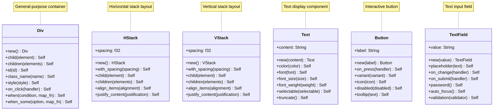
```mermaid
classDiagram
    class Div {
        +new() Div
        +child(element) Self
        +children(elements) Self
        +id(id) Self
        +class_name(name) Self
        +style(style) Self
        +on_click(handler) Self
        +when(condition, map_fn) Self
        +when_some(option, map_fn) Self
    }
    
    class HStack {
        +spacing: f32
        +new() HStack
        +with_spacing(spacing) Self
        +child(element) Self
        +children(elements) Self
        +align_items(alignment) Self
        +justify_content(justification) Self
    }
    
    class VStack {
        +spacing: f32
        +new() VStack
        +with_spacing(spacing) Self
        +child(element) Self
        +children(elements) Self
        +align_items(alignment) Self
        +justify_content(justification) Self
    }
    
    class Text {
        +content: String
        +new(content) Text
        +color(color) Self
        +font(font) Self
        +font_size(size) Self
        +font_weight(weight) Self
        +selectable(selectable) Self
        +truncate() Self
    }
    
    class Button {
        +label: String
        +new(label) Button
        +on_press(handler) Self
        +variant(variant) Self
        +icon(icon) Self
        +disabled(disabled) Self
        +tooltip(text) Self
    }
    
    class TextField {
        +value: String
        +new(value) TextField
        +placeholder(text) Self
        +on_change(handler) Self
        +on_submit(handler) Self
        +password() Self
        +auto_focus() Self
        +validation(validator) Self
    }
    
    note for Div "General-purpose container"
    note for HStack "Horizontal stack layout"
    note for VStack "Vertical stack layout"
    note for Text "Text display component"
    note for Button "Interactive button"
    note for TextField "Text input field"
```

### Component Flow

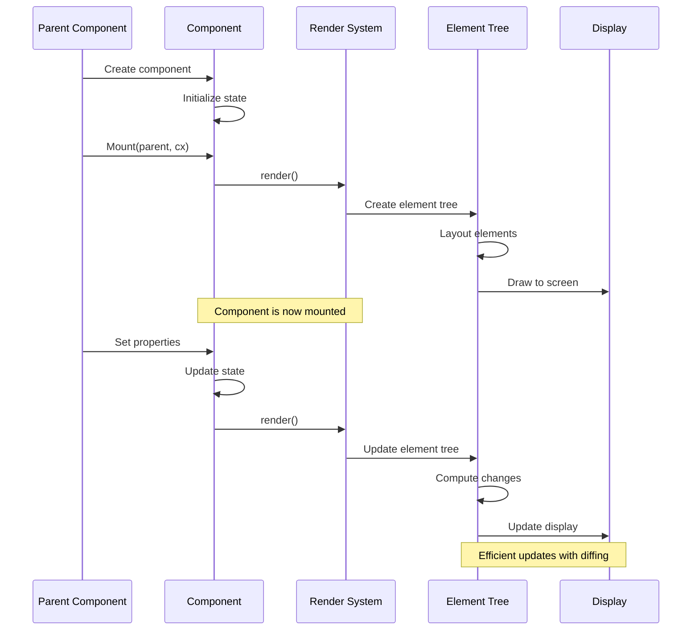
```mermaid
sequenceDiagram
    participant P as Parent Component
    participant C as Component
    participant R as Render System
    participant E as Element Tree
    participant D as Display
    
    P->>C: Create component
    C->>C: Initialize state
    
    P->>C: Mount(parent, cx)
    C->>R: render()
    R->>E: Create element tree
    
    E->>E: Layout elements
    E->>D: Draw to screen
    
    Note over C,R: Component is now mounted
    
    P->>C: Set properties
    C->>C: Update state
    C->>R: render()
    R->>E: Update element tree
    E->>E: Compute changes
    E->>D: Update display
    
    Note over E,D: Efficient updates with diffing
```

### Event Handling Flow

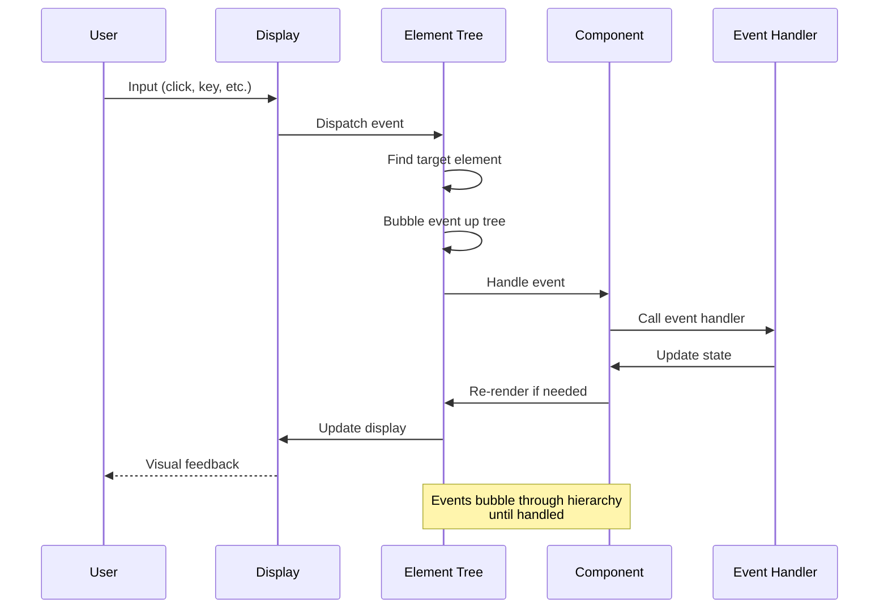
```mermaid
sequenceDiagram
    participant U as User
    participant D as Display
    participant E as Element Tree
    participant C as Component
    participant H as Event Handler
    
    U->>D: Input (click, key, etc.)
    D->>E: Dispatch event
    
    E->>E: Find target element
    E->>E: Bubble event up tree
    
    E->>C: Handle event
    C->>H: Call event handler
    H->>C: Update state
    
    C->>E: Re-render if needed
    E->>D: Update display
    D-->>U: Visual feedback
    
    Note over E,C: Events bubble through hierarchy<br>until handled
```

### Style Propagation

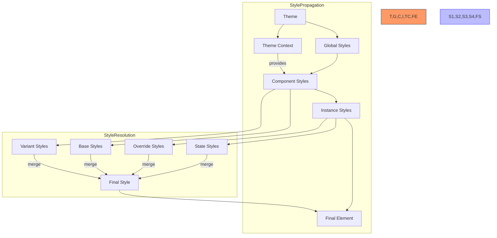
```mermaid
flowchart TD
    subgraph StylePropagation
        T[Theme] --> G[Global Styles]
        G --> C[Component Styles]
        C --> I[Instance Styles]
        
        T --> TC[Theme Context]
        TC -->|provides| C
        
        I --> FE[Final Element]
    end
    
    subgraph StyleResolution
        S1[Base Styles]
        S2[Variant Styles]
        S3[State Styles]
        S4[Override Styles]
        
        S1 & S2 & S3 & S4 -->|merge| FS[Final Style]
    end
    
    C --> S1
    C --> S2
    I --> S3
    I --> S4
    
    FS --> FE
    
    style T,G,C,I,TC,FE fill:#f96,stroke:#333,stroke-width:1px
    style S1,S2,S3,S4,FS fill:#bbf,stroke:#33f,stroke-width:1px
```

## Key Interfaces

### Component Interface

```
// Conceptual interface, not actual Rust code
UIComponent {
    // Lifecycle
    new(props: P) -> Self
    mount(parent: Element, cx: &mut Context)
    update(cx: &mut Context)
    unmount()
    
    // Rendering
    render(&self) -> impl IntoElement
    
    // State management
    state() -> &State
    set_state<F>(f: F) where F: FnOnce(&mut State)
    
    // Event handling
    handle_event(event: &Event, cx: &mut Context) -> bool
    
    // Properties
    props() -> &Props
    set_props(props: Props)
    
    // Children
    children() -> &[Child]
    append_child(child: Child)
    remove_child(child_id: ChildId)
    
    // Accessibility
    accessibility_role() -> Role
    set_accessibility_label(label: String)
    is_focusable() -> bool
}
```

### Element Builder Interface

```
// Conceptual interface, not actual Rust code
ElementBuilder {
    // Structure
    child(element: impl IntoElement) -> Self
    children(elements: impl IntoIterator<Item = impl IntoElement>) -> Self
    
    // Layout
    width(width: impl Into<Dimension>) -> Self
    height(height: impl Into<Dimension>) -> Self
    min_width(min_width: impl Into<Dimension>) -> Self
    max_width(max_width: impl Into<Dimension>) -> Self
    padding(padding: impl Into<Insets>) -> Self
    margin(margin: impl Into<Insets>) -> Self
    
    // Flexbox
    direction(direction: FlexDirection) -> Self
    wrap(wrap: FlexWrap) -> Self
    justify_content(justify: JustifyContent) -> Self
    align_items(align: AlignItems) -> Self
    align_self(align: AlignSelf) -> Self
    flex_grow(grow: f32) -> Self
    flex_shrink(shrink: f32) -> Self
    
    // Appearance
    background(color: impl Into<Color>) -> Self
    border(border: impl Into<Border>) -> Self
    corner_radius(radius: impl Into<CornerRadius>) -> Self
    opacity(opacity: f32) -> Self
    shadow(shadow: impl Into<Shadow>) -> Self
    
    // Events
    on_click(handler: impl Fn(&ClickEvent, &mut WindowContext)) -> Self
    on_hover(handler: impl Fn(&HoverEvent, &mut WindowContext)) -> Self
    on_key_down(handler: impl Fn(&KeyEvent, &mut WindowContext)) -> Self
    on_focus(handler: impl Fn(&FocusEvent, &mut WindowContext)) -> Self
    
    // Conditionals
    when(condition: bool, map_fn: impl FnOnce(Self) -> Self) -> Self
    when_some<T>(option: Option<T>, map_fn: impl FnOnce(Self, T) -> Self) -> Self
    
    // Accessibility
    accessibility_label(label: impl Into<String>) -> Self
    accessibility_role(role: Role) -> Self
    focusable(focusable: bool) -> Self
    
    // Building
    build() -> Element
}
```

### Layout System

```
// Conceptual interface, not actual Rust code
LayoutSystem {
    // Layout calculation
    compute_layout(root: &Element, constraints: BoxConstraints) -> Layout
    
    // Layout info
    element_layout(element_id: ElementId) -> Option<Rect>
    element_global_position(element_id: ElementId) -> Option<Point>
    
    // Viewport
    viewport_size() -> Size
    set_viewport_size(size: Size)
    
    // Layout debugging
    debug_layout(element_id: ElementId) -> LayoutDebugInfo
    
    // Layout engine configuration
    set_layout_algorithm(algorithm: LayoutAlgorithm)
    
    // Layout constraints
    constrain_width(min: Option<f32>, max: Option<f32>) -> WidthConstraint
    constrain_height(min: Option<f32>, max: Option<f32>) -> HeightConstraint
    
    // Layout helpers
    center(element: impl IntoElement) -> Element
    spacer(size: f32) -> Element
    divider(thickness: f32, color: Color) -> Element
}
```

### Styling Interface

```
// Conceptual interface, not actual Rust code
StyleSystem {
    // Style creation
    create_style() -> StyleBuilder
    style_from_theme(token: StyleToken) -> Style
    
    // Style application
    apply_style(element: Element, style: Style) -> Element
    apply_theme(element: Element, theme: Theme) -> Element
    
    // Style composition
    combine_styles(base: Style, override: Style) -> Style
    
    // Style variants
    create_variant(base: Style, variant_name: String) -> StyleVariant
    apply_variant(element: Element, variant: StyleVariant) -> Element
    
    // Style conditions
    apply_when(element: Element, condition: bool, style: Style) -> Element
    apply_when_state(element: Element, state: ElementState, style: Style) -> Element
    
    // Style tokens
    register_token(name: String, value: StyleValue)
    get_token_value(name: String) -> Option<StyleValue>
    
    // Theme integration
    current_theme() -> Theme
    set_theme(theme: Theme)
    subscribe_to_theme_changes(callback: Callback) -> Subscription
}
```

### Component Events

```
// Conceptual interface, not actual Rust code
UIEvents {
    // Mouse events
    on_click(handler: impl Fn(&ClickEvent, &mut WindowContext)) -> Self
    on_double_click(handler: impl Fn(&ClickEvent, &mut WindowContext)) -> Self
    on_mouse_down(handler: impl Fn(&MouseEvent, &mut WindowContext)) -> Self
    on_mouse_up(handler: impl Fn(&MouseEvent, &mut WindowContext)) -> Self
    on_mouse_move(handler: impl Fn(&MouseEvent, &mut WindowContext)) -> Self
    
    // Hover events
    on_hover(handler: impl Fn(&HoverEvent, &mut WindowContext)) -> Self
    on_hover_start(handler: impl Fn(&HoverEvent, &mut WindowContext)) -> Self
    on_hover_end(handler: impl Fn(&HoverEvent, &mut WindowContext)) -> Self
    
    // Keyboard events
    on_key_down(handler: impl Fn(&KeyEvent, &mut WindowContext)) -> Self
    on_key_up(handler: impl Fn(&KeyEvent, &mut WindowContext)) -> Self
    on_key_press(handler: impl Fn(&KeyEvent, &mut WindowContext)) -> Self
    
    // Focus events
    on_focus(handler: impl Fn(&FocusEvent, &mut WindowContext)) -> Self
    on_blur(handler: impl Fn(&FocusEvent, &mut WindowContext)) -> Self
    
    // Gesture events
    on_pan(handler: impl Fn(&PanEvent, &mut WindowContext)) -> Self
    on_pinch(handler: impl Fn(&PinchEvent, &mut WindowContext)) -> Self
    on_swipe(handler: impl Fn(&SwipeEvent, &mut WindowContext)) -> Self
    
    // Drag events
    on_drag_start(handler: impl Fn(&DragEvent, &mut WindowContext)) -> Self
    on_drag(handler: impl Fn(&DragEvent, &mut WindowContext)) -> Self
    on_drag_end(handler: impl Fn(&DragEvent, &mut WindowContext)) -> Self
    on_drop(handler: impl Fn(&DropEvent, &mut WindowContext)) -> Self
}
```

## Implementation Patterns

### Component Composition

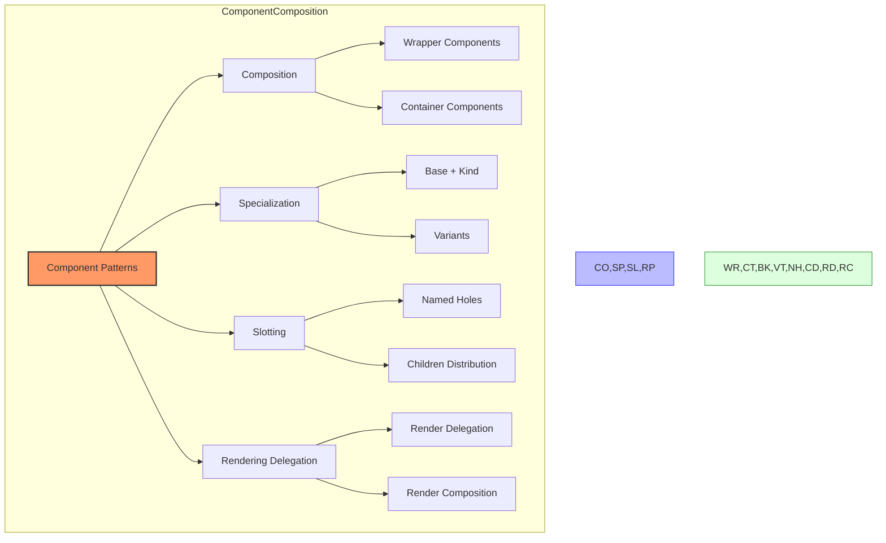
```mermaid
graph TD
    subgraph ComponentComposition
        CP[Component Patterns]
        
        CP --> CO[Composition]
        CP --> SP[Specialization]
        CP --> SL[Slotting]
        CP --> RP[Rendering Delegation]
        
        CO --> WR[Wrapper Components]
        CO --> CT[Container Components]
        
        SP --> BK[Base + Kind]
        SP --> VT[Variants]
        
        SL --> NH[Named Holes]
        SL --> CD[Children Distribution]
        
        RP --> RD[Render Delegation]
        RP --> RC[Render Composition]
    end
    
    style CP fill:#f96,stroke:#333,stroke-width:2px
    style CO,SP,SL,RP fill:#bbf,stroke:#33f,stroke-width:1px
    style WR,CT,BK,VT,NH,CD,RD,RC fill:#dfd,stroke:#393,stroke-width:1px
```

#### Component Pattern Examples

1. **Composition**: Building complex components from simpler ones
   ```
   let card = div()
       .padding(10.0)
       .border_1()
       .corner_radius(5.0)
       .background(theme.surface)
       .child(
           v_stack().gap(8.0)
               .child(text(title).font_weight(.bold))
               .child(text(description))
               .child(
                   h_stack().gap(5.0)
                       .child(button("Cancel").on_press(on_cancel))
                       .child(button("OK").on_press(on_ok))
               )
       );
   ```

2. **Specialization**: Creating specialized versions of components
   ```
   fn primary_button(label: &str, on_press: impl Fn()) -> impl IntoElement {
       button(label)
           .on_press(on_press)
           .background(theme.primary)
           .text_color(theme.on_primary)
           .font_weight(.medium)
   }
   ```

3. **Slotting**: Providing specific places for child content
   ```
   fn dialog(title: &str, content: impl IntoElement, actions: impl IntoElement) -> impl IntoElement {
       v_stack()
           .padding(16.0)
           .gap(12.0)
           .background(theme.surface)
           .corner_radius(8.0)
           .shadow(theme.shadow_medium)
           .child(text(title).font_size(18.0).font_weight(.bold))
           .child(div().child(content))
           .child(h_stack().justify_content(.end).child(actions))
   }
   ```

4. **Render Delegation**: Delegating rendering to child components
   ```
   fn list<T>(items: Vec<T>, render_item: impl Fn(&T) -> impl IntoElement) -> impl IntoElement {
       v_stack()
           .children(
               items.iter()
                   .map(|item| render_item(item))
                   .collect()
           )
   }
   ```

### Layout Patterns

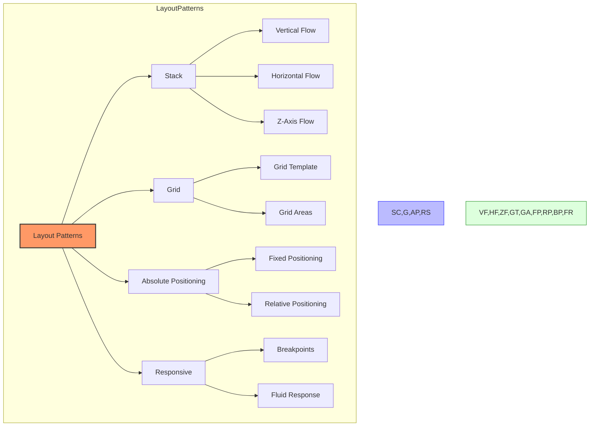
```mermaid
graph TD
    subgraph LayoutPatterns
        LP[Layout Patterns]
        
        LP --> SC[Stack]
        LP --> G[Grid]
        LP --> AP[Absolute Positioning]
        LP --> RS[Responsive]
        
        SC --> VF[Vertical Flow]
        SC --> HF[Horizontal Flow]
        SC --> ZF[Z-Axis Flow]
        
        G --> GT[Grid Template]
        G --> GA[Grid Areas]
        
        AP --> FP[Fixed Positioning]
        AP --> RP[Relative Positioning]
        
        RS --> BP[Breakpoints]
        RS --> FR[Fluid Response]
    end
    
    style LP fill:#f96,stroke:#333,stroke-width:2px
    style SC,G,AP,RS fill:#bbf,stroke:#33f,stroke-width:1px
    style VF,HF,ZF,GT,GA,FP,RP,BP,FR fill:#dfd,stroke:#393,stroke-width:1px
```

#### Layout Pattern Examples

1. **Stack Layout**: Vertical and horizontal stacking
   ```
   v_stack()
       .gap(8.0)
       .child(header)
       .child(content)
       .child(footer)
   ```

2. **Grid Layout**: Two-dimensional grid
   ```
   grid()
       .columns("1fr 2fr 1fr")
       .rows("auto 1fr auto")
       .gap(10.0)
       .child(header.grid_column("1 / span 3"))
       .child(sidebar.grid_column("1"))
       .child(content.grid_column("2"))
       .child(panel.grid_column("3"))
       .child(footer.grid_column("1 / span 3"))
   ```

3. **Absolute Positioning**: Manual positioning
   ```
   div()
       .position(.relative)
       .size(.fill)
       .child(
           div()
               .position(.absolute)
               .top(10.0)
               .right(10.0)
               .child(close_button)
       )
   ```

4. **Responsive Layout**: Adapting to different sizes
   ```
   div()
       .responsive(|style, constraints| {
           if constraints.max_width < 600.0 {
               style.flex_direction(.column)
           } else {
               style.flex_direction(.row)
           }
       })
       .child(sidebar)
       .child(content)
   ```

### State Management

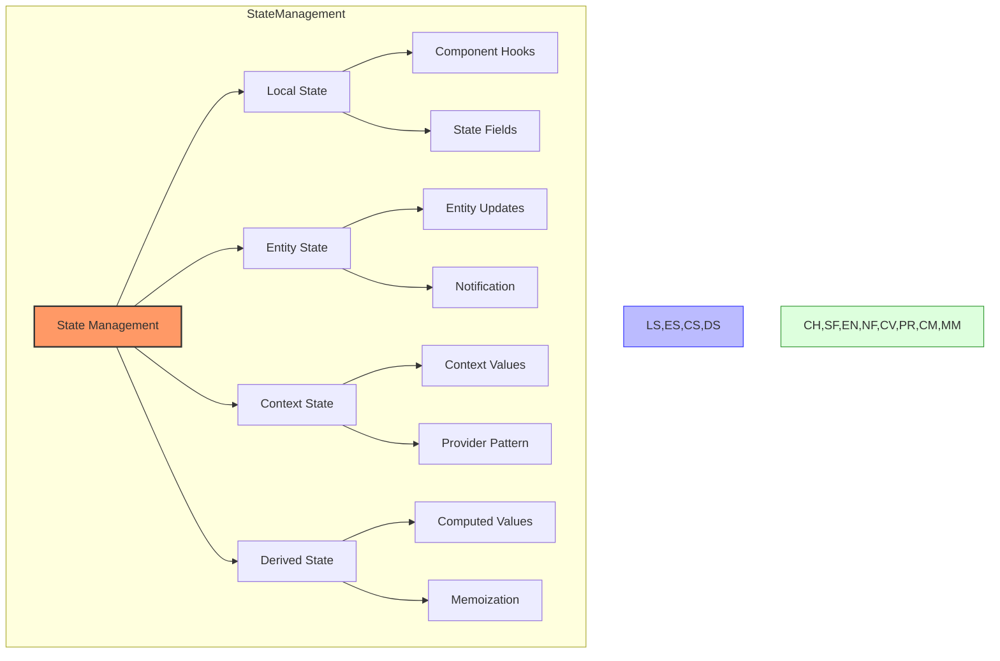
```mermaid
graph TD
    subgraph StateManagement
        SM[State Management]
        
        SM --> LS[Local State]
        SM --> ES[Entity State]
        SM --> CS[Context State]
        SM --> DS[Derived State]
        
        LS --> CH[Component Hooks]
        LS --> SF[State Fields]
        
        ES --> EN[Entity Updates]
        ES --> NF[Notification]
        
        CS --> CV[Context Values]
        CS --> PR[Provider Pattern]
        
        DS --> CM[Computed Values]
        DS --> MM[Memoization]
    end
    
    style SM fill:#f96,stroke:#333,stroke-width:2px
    style LS,ES,CS,DS fill:#bbf,stroke:#33f,stroke-width:1px
    style CH,SF,EN,NF,CV,PR,CM,MM fill:#dfd,stroke:#393,stroke-width:1px
```

#### State Management Examples

1. **Local State**: State within a component
   ```
   struct CounterComponent {
       count: u32,
   }
   
   impl CounterComponent {
       fn increment(&mut self, cx: &mut Context<Self>) {
           self.count += 1;
           cx.notify();
       }
       
       fn render(&self, _cx: &mut Context<Self>) -> impl IntoElement {
           div()
               .child(text(format!("Count: {}", self.count)))
               .child(button("Increment").on_press(|_, cx| self.increment(cx)))
       }
   }
   ```

2. **Entity State**: Shared state in entities
   ```
   fn counter_view(counter: Entity<Counter>, cx: &mut Context) -> impl IntoElement {
       let count = counter.read(cx).count;
       
       div()
           .child(text(format!("Count: {}", count)))
           .child(
               button("Increment").on_press(move |_, cx| {
                   counter.update(cx, |counter, cx| {
                       counter.count += 1;
                       cx.notify();
                   });
               })
           )
   }
   ```

3. **Context State**: State shared through context
   ```
   fn app(cx: &mut AppContext) -> impl IntoElement {
       let theme = cx.global::<ThemeProvider>().current_theme();
       
       theme_provider(theme)
           .child(
               v_stack()
                   .child(header())
                   .child(main_content())
                   .child(footer())
           )
   }
   
   fn themed_button(label: &str, cx: &mut Context) -> impl IntoElement {
       let theme = cx.get::<ThemeProvider>().current_theme();
       
       button(label)
           .background(theme.button_bg)
           .text_color(theme.button_fg)
   }
   ```

4. **Derived State**: Computed from other state
   ```
   fn filtered_list(items: Vec<Item>, filter: &str, cx: &mut Context) -> impl IntoElement {
       // Derived state - computed from items and filter
       let filtered_items = items.iter()
           .filter(|item| item.title.contains(filter))
           .collect::<Vec<_>>();
       
       v_stack()
           .child(text(format!("Showing {} of {} items", filtered_items.len(), items.len())))
           .children(
               filtered_items.iter()
                   .map(|item| item_view(item, cx))
                   .collect()
           )
   }
   ```

### Event Handling

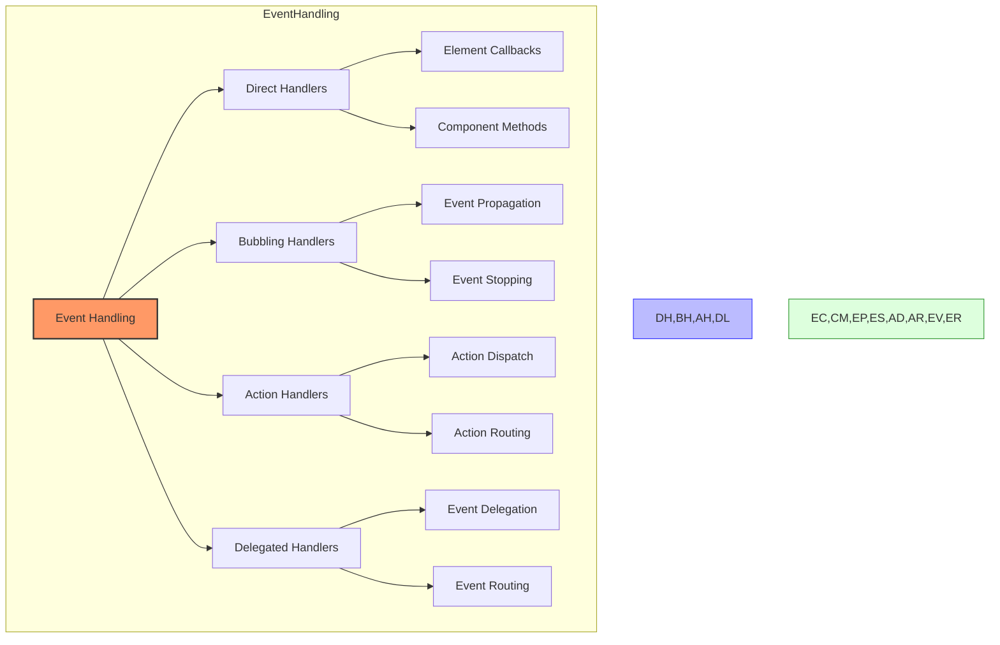
```mermaid
graph TD
    subgraph EventHandling
        EH[Event Handling]
        
        EH --> DH[Direct Handlers]
        EH --> BH[Bubbling Handlers]
        EH --> AH[Action Handlers]
        EH --> DL[Delegated Handlers]
        
        DH --> EC[Element Callbacks]
        DH --> CM[Component Methods]
        
        BH --> EP[Event Propagation]
        BH --> ES[Event Stopping]
        
        AH --> AD[Action Dispatch]
        AH --> AR[Action Routing]
        
        DL --> EV[Event Delegation]
        DL --> ER[Event Routing]
    end
    
    style EH fill:#f96,stroke:#333,stroke-width:2px
    style DH,BH,AH,DL fill:#bbf,stroke:#33f,stroke-width:1px
    style EC,CM,EP,ES,AD,AR,EV,ER fill:#dfd,stroke:#393,stroke-width:1px
```

#### Event Handling Examples

1. **Direct Handlers**: Handling events directly on elements
   ```
   button("Click me")
       .on_click(|event, cx| {
           println!("Button clicked at: {:?}", event.position);
       })
   ```

2. **Bubbling Handlers**: Events bubbling up through the tree
   ```
   div()
       .on_click(|event, cx| {
           println!("Container clicked");
       })
       .child(
           button("Click me")
               .on_click(|event, cx| {
                   println!("Button clicked");
                   event.stop_propagation(); // Prevent container handler from firing
               })
       )
   ```

3. **Action Handlers**: Using the action system
   ```
   div()
       .on_action(SaveAction, |action, cx| {
           save_document();
           true // Action handled
       })
       .child(
           button("Save")
               .on_press(|_, cx| {
                   cx.dispatch_action(SaveAction);
               })
       )
   ```

4. **Delegated Handlers**: Delegating event handling
   ```
   fn list_with_items<T>(
       items: Vec<T>,
       on_item_click: impl Fn(&T, &mut Context),
   ) -> impl IntoElement {
       v_stack()
           .children(
               items.iter()
                   .map(|item| {
                       let item_ref = item.clone();
                       div()
                           .padding(8.0)
                           .on_click(move |_, cx| {
                               on_item_click(&item_ref, cx);
                           })
                           .child(text(&item.title))
                   })
                   .collect()
           )
   }
   ```

## Style Implementation

### Theme Integration

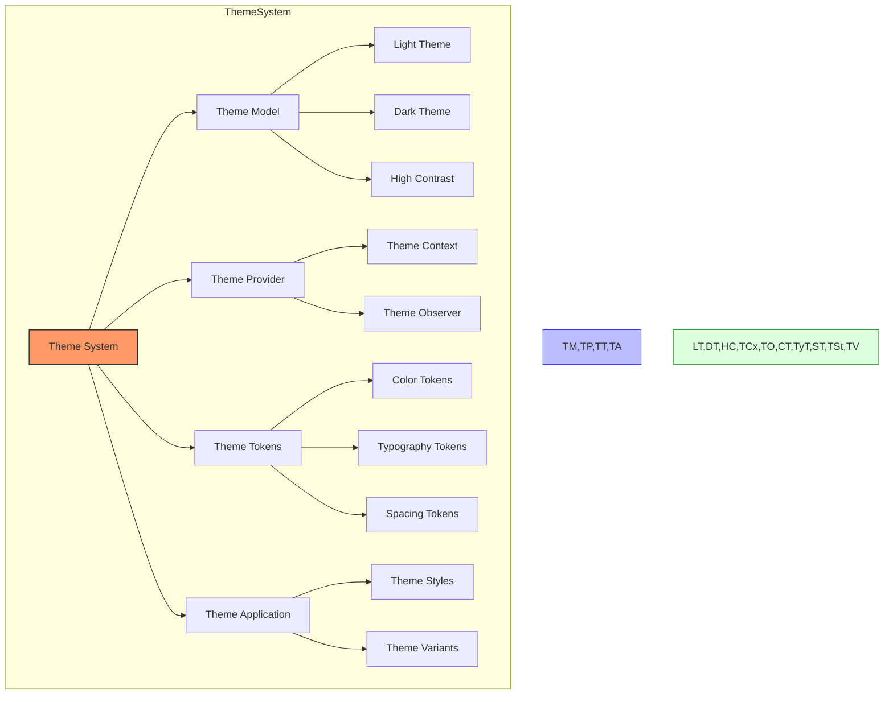
```mermaid
graph TD
    subgraph ThemeSystem
        TS[Theme System]
        
        TS --> TM[Theme Model]
        TS --> TP[Theme Provider]
        TS --> TT[Theme Tokens]
        TS --> TA[Theme Application]
        
        TM --> LT[Light Theme]
        TM --> DT[Dark Theme]
        TM --> HC[High Contrast]
        
        TP --> TCx[Theme Context]
        TP --> TO[Theme Observer]
        
        TT --> CT[Color Tokens]
        TT --> TyT[Typography Tokens]
        TT --> ST[Spacing Tokens]
        
        TA --> TSt[Theme Styles]
        TA --> TV[Theme Variants]
    end
    
    style TS fill:#f96,stroke:#333,stroke-width:2px
    style TM,TP,TT,TA fill:#bbf,stroke:#33f,stroke-width:1px
    style LT,DT,HC,TCx,TO,CT,TyT,ST,TSt,TV fill:#dfd,stroke:#393,stroke-width:1px
```

#### Theme Implementation Examples

1. **Theme Definition**: Defining a theme
   ```
   struct AppTheme {
       // Colors
       primary: Color,
       secondary: Color,
       background: Color,
       surface: Color,
       on_primary: Color,
       on_secondary: Color,
       on_background: Color,
       on_surface: Color,
       
       // Typography
       font_family: String,
       font_size_small: f32,
       font_size_medium: f32,
       font_size_large: f32,
       
       // Spacing
       spacing_xs: f32,
       spacing_sm: f32,
       spacing_md: f32,
       spacing_lg: f32,
       
       // Effects
       shadow_sm: Shadow,
       shadow_md: Shadow,
       shadow_lg: Shadow,
   }
   
   impl AppTheme {
       fn light() -> Self {
           Self {
               primary: rgb(0x6200EE),
               secondary: rgb(0x03DAC6),
               background: rgb(0xFFFFFF),
               surface: rgb(0xFFFFFF),
               on_primary: rgb(0xFFFFFF),
               on_secondary: rgb(0x000000),
               on_background: rgb(0x000000),
               on_surface: rgb(0x000000),
               // ... other properties
           }
       }
       
       fn dark() -> Self {
           Self {
               primary: rgb(0xBB86FC),
               secondary: rgb(0x03DAC6),
               background: rgb(0x121212),
               surface: rgb(0x121212),
               on_primary: rgb(0x000000),
               on_secondary: rgb(0x000000),
               on_background: rgb(0xFFFFFF),
               on_surface: rgb(0xFFFFFF),
               // ... other properties
           }
       }
   }
   ```

2. **Theme Provider**: Providing theme to components
   ```
   fn app(cx: &mut AppContext) -> impl IntoElement {
       let theme = cx.global::<ThemeProvider>().current_theme();
       
       theme_provider(theme)
           .child(
               v_stack()
                   .child(header())
                   .child(main_content())
                   .child(footer())
           )
   }
   ```

3. **Theme Usage**: Using theme values in components
   ```
   fn themed_button(label: &str, cx: &mut Context) -> impl IntoElement {
       let theme = cx.get::<ThemeProvider>().current_theme();
       
       button(label)
           .background(theme.primary)
           .text_color(theme.on_primary)
           .padding(theme.spacing_sm)
           .font_size(theme.font_size_medium)
   }
   ```

4. **Theme Switching**: Changing themes
   ```
   fn theme_switcher(cx: &mut Context) -> impl IntoElement {
       let theme_provider = cx.get::<ThemeProvider>();
       let is_dark = theme_provider.is_dark_theme();
       
       button(if is_dark { "Switch to Light" } else { "Switch to Dark" })
           .on_press(move |_, cx| {
               if is_dark {
                   theme_provider.set_theme(AppTheme::light());
               } else {
                   theme_provider.set_theme(AppTheme::dark());
               }
           })
   }
   ```

### Style Composition

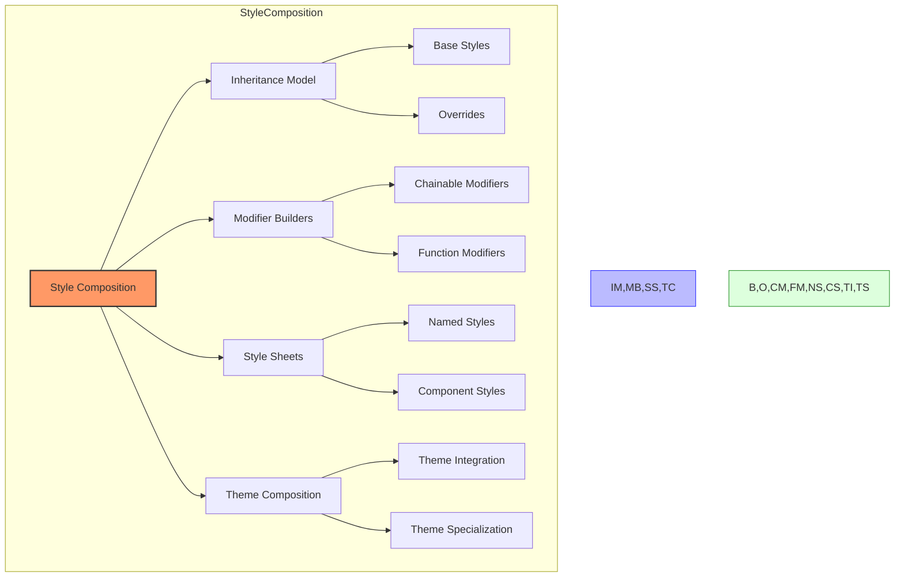
```mermaid
graph TD
    subgraph StyleComposition
        SC[Style Composition]
        
        SC --> IM[Inheritance Model]
        SC --> MB[Modifier Builders]
        SC --> SS[Style Sheets]
        SC --> TC[Theme Composition]
        
        IM --> B[Base Styles]
        IM --> O[Overrides]
        
        MB --> CM[Chainable Modifiers]
        MB --> FM[Function Modifiers]
        
        SS --> NS[Named Styles]
        SS --> CS[Component Styles]
        
        TC --> TI[Theme Integration]
        TC --> TS[Theme Specialization]
    end
    
    style SC fill:#f96,stroke:#333,stroke-width:2px
    style IM,MB,SS,TC fill:#bbf,stroke:#33f,stroke-width:1px
    style B,O,CM,FM,NS,CS,TI,TS fill:#dfd,stroke:#393,stroke-width:1px
```

#### Style Composition Examples

1. **Style Inheritance**: Building on base styles
   ```
   let base_card_style = Style::new()
       .padding(16.0)
       .background(theme.surface)
       .corner_radius(8.0)
       .shadow(theme.shadow_sm);
   
   let elevated_card_style = base_card_style
       .clone()
       .shadow(theme.shadow_md);
   
   let highlighted_card_style = base_card_style
       .clone()
       .border(Border::new(2.0, theme.primary));
   ```

2. **Modifier Builders**: Chainable style modifications
   ```
   fn card(content: impl IntoElement) -> impl IntoElement {
       div()
           .padding(16.0)
           .background(theme.surface)
           .corner_radius(8.0)
           .shadow(theme.shadow_sm)
           .child(content)
   }
   
   fn elevated(element: impl IntoElement) -> impl IntoElement {
       element.shadow(theme.shadow_md)
   }
   
   fn highlighted(element: impl IntoElement) -> impl IntoElement {
       element.border(Border::new(2.0, theme.primary))
   }
   
   // Usage
   elevated(card(content))
   highlighted(card(content))
   ```

3. **Named Styles**: Reusable style collections
   ```
   struct AppStyles {
       card: Style,
       button: Style,
       heading: Style,
       body_text: Style,
   }
   
   impl AppStyles {
       fn new(theme: &AppTheme) -> Self {
           Self {
               card: Style::new()
                   .padding(16.0)
                   .background(theme.surface)
                   .corner_radius(8.0)
                   .shadow(theme.shadow_sm),
               
               button: Style::new()
                   .padding(theme.spacing_sm)
                   .background(theme.primary)
                   .text_color(theme.on_primary)
                   .corner_radius(4.0),
               
               heading: Style::new()
                   .font_size(theme.font_size_large)
                   .font_weight(.bold)
                   .text_color(theme.on_background),
               
               body_text: Style::new()
                   .font_size(theme.font_size_medium)
                   .text_color(theme.on_background),
           }
       }
   }
   
   // Usage
   let styles = AppStyles::new(&theme);
   
   div()
       .style(styles.card)
       .child(text("Title").style(styles.heading))
       .child(text("Content").style(styles.body_text))
       .child(button("OK").style(styles.button))
   ```

4. **Theme Composition**: Composing with theme
   ```
   fn theme_aware_component(content: impl IntoElement, cx: &mut Context) -> impl IntoElement {
       let theme = cx.get::<ThemeProvider>().current_theme();
       
       let container_style = if theme.is_dark() {
           Style::new()
               .background(color(0x2C2C2C))
               .border(Border::new(1.0, color(0x3C3C3C)))
       } else {
           Style::new()
               .background(color(0xF5F5F5))
               .border(Border::new(1.0, color(0xE0E0E0)))
       };
       
       div()
           .style(container_style)
           .padding(16.0)
           .child(content)
   }
   ```

## Swift Considerations

### Swift Implementation Strategies

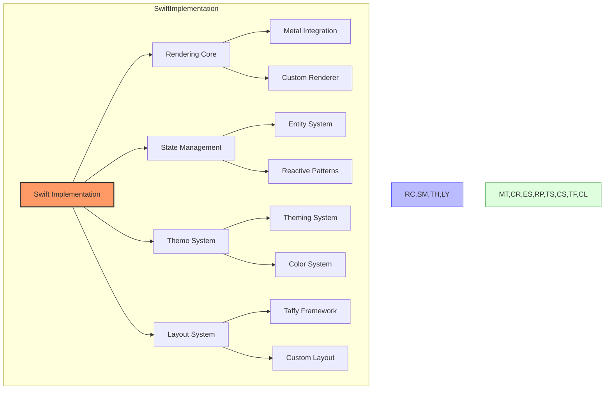
```mermaid
graph TD
    subgraph SwiftImplementation
        SI[Swift Implementation]

        SI --> RC[Rendering Core]
        SI --> SM[State Management]
        SI --> TH[Theme System]
        SI --> LY[Layout System]

        RC --> MT[Metal Integration]
        RC --> CR[Custom Renderer]

        SM --> ES[Entity System]
        SM --> RP[Reactive Patterns]

        TH --> TS[Theming System]
        TH --> CS[Color System]

        LY --> TF[Taffy Framework]
        LY --> CL[Custom Layout]
    end

    style SI fill:#f96,stroke:#333,stroke-width:2px
    style RC,SM,TH,LY fill:#bbf,stroke:#33f,stroke-width:1px
    style MT,CR,ES,RP,TS,CS,TF,CL fill:#dfd,stroke:#393,stroke-width:1px
```

### UI Implementation in Swift

- **Custom GPU Renderer**: Implement Metal-based rendering pipeline
- **Taffy Layout Engine**: Port the Taffy Flexbox layout engine (or use an existing Swift port)
- **Entity System**: Design a Swift version of the entity component system
- **Element Architecture**: Build the element tree system with proper Swift idioms
- **Component Protocols**: Define clear protocols for component behavior
- **Builder Pattern**: Create fluent APIs for element construction
- **Reactive System**: Implement a reactive update system for UI

### State Management in Swift

- **Property Wrappers**: Use `@State`, `@Binding`, etc. for state
- **ObservableObject**: Implement observable objects for shared state
- **Environment Objects**: Use environment for globally accessible state
- **Combine Integration**: Use Combine for reactive state updates
- **Entity System**: Adapt GPUI's entity system to Swift
- **State Restoration**: Implement proper state saving and restoration
- **Memory Management**: Use proper reference management for state objects

### Theme Implementation in Swift

- **Color Assets**: Use asset catalogs for theme colors
- **Dynamic Colors**: Support dark mode with dynamic color sets
- **Theme Provider**: Create a theme provider pattern
- **Environment Values**: Use SwiftUI environment for theme propagation
- **Theme Switching**: Support runtime theme switching
- **Color Management**: Implement proper color space handling
- **Typography System**: Create a consistent typography system

### Component Adaptation

- **Protocol-Based Design**: Use protocols to define component interfaces
- **View Modifiers**: Implement the chainable modifier pattern
- **Property Wrappers**: Use for component state and configuration
- **PreviewProvider**: Add preview support for components
- **Accessibility**: Ensure proper accessibility implementation
- **Platform Adaptation**: Support different Apple platforms
- **UIKit Integration**: Bridge to UIKit where necessary

## Interaction with Other Subsystems

### UI Components → GPUI
- UI components are built on GPUI's core rendering system
- Components use GPUI's event handling mechanism
- Layout is processed through GPUI's layout engine
- See: [02_StratosphericView_GPUI.md](./02_StratosphericView_GPUI.md)

### UI Components → Theme System
- Components receive styling from theme system
- Theme colors are applied to component rendering
- Theme metrics influence component sizing
- See: [12_StratosphericView_ThemeSystem.md](./12_StratosphericView_ThemeSystem.md)

### UI Components → Command System
- UI components trigger commands through actions
- Command system provides keyboard shortcuts for components
- Component focus influences command availability
- See: [11_StratosphericView_CommandSystem.md](./11_StratosphericView_CommandSystem.md)

### UI Components → Editor Core
- Editor view uses UI components for rendering
- UI handles user interaction with editor content
- Editor state is displayed through UI components
- See: [03_StratosphericView_TextEditorCore.md](./03_StratosphericView_TextEditorCore.md)

### UI Components → Settings System
- UI provides interface for settings configuration
- Component behavior is affected by settings
- Settings UI is built from UI components
- See: [10_StratosphericView_Settings.md](./10_StratosphericView_Settings.md)

For a complete map of how UI Components connect to all other subsystems, see: [SubsystemRelationshipMap.md](./SubsystemRelationshipMap.md)

## Next Steps

After understanding the UI Components system, we'll examine the Search System, which provides text search and replace functionality across files. This includes search algorithms, matching strategies, and user interface for search operations.