# Atmospheric View: Search System

## Purpose

The Search System provides functionality for finding and replacing text across files and within buffers. It enables users to efficiently locate content using various search strategies, including literal text matching, regular expressions, and structural code search. The system handles both single-buffer searches and project-wide operations with optimized performance.

## Core Concepts

### Search Architecture

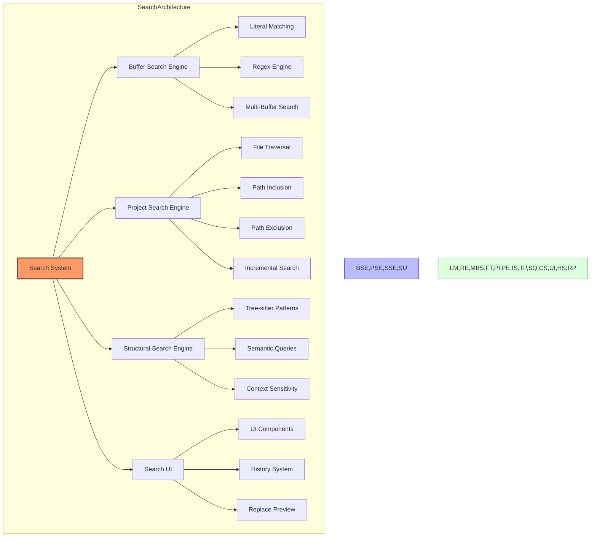

- **Buffer Search**: Finding text within open buffers
- **Project Search**: Finding text across multiple files
- **Structural Search**: Finding code based on syntax patterns
- **Search Strategies**: Different ways to match text
- **Replace Operations**: Text substitution capabilities
- **Search UI**: User interface for search interactions

### Search Strategies

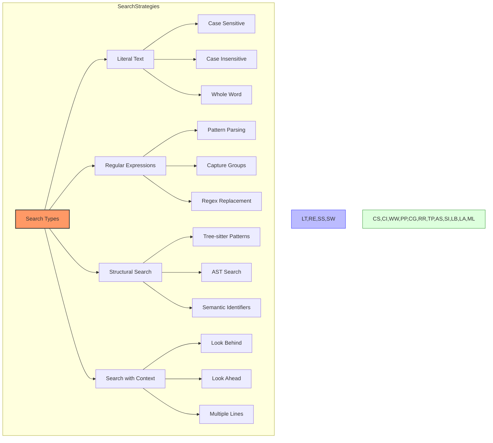

- **Literal Search**: Exact string matching
- **Case Sensitivity**: Ignoring or respecting letter case
- **Regular Expressions**: Pattern-based search
- **Whole Word**: Matching complete words only
- **Boundary Conditions**: Word/line start and end
- **Structural Matching**: Syntax-aware search

### Project-Wide Search

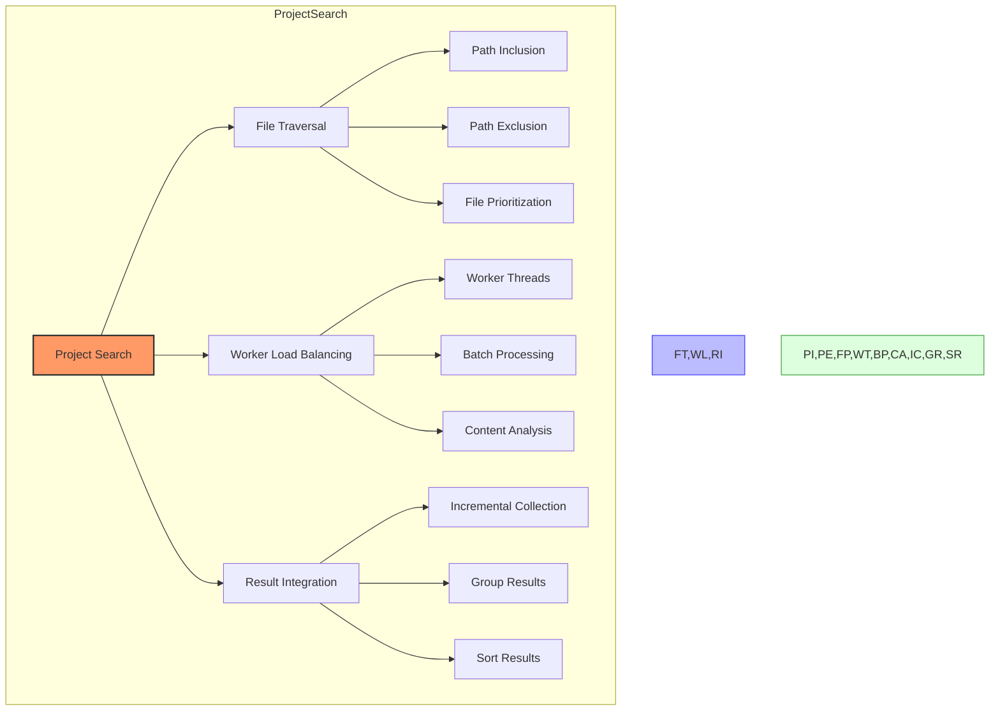

- **File Filtering**: Including/excluding files
- **Path Patterns**: Glob-based path matching
- **Concurrent Search**: Multi-threaded search
- **Incremental Results**: Progressive result delivery
- **Result Categorization**: Grouping and filtering
- **Performance Optimization**: Efficient searching

### Replace Operations

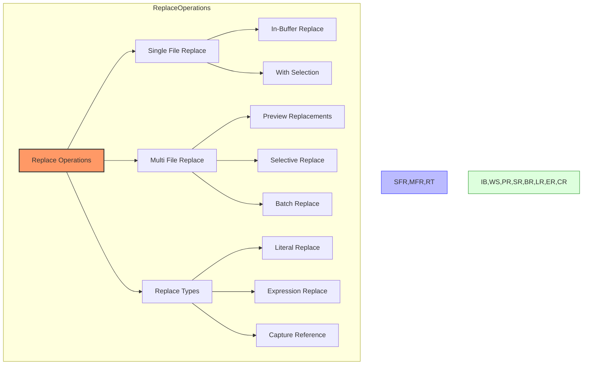

- **Replace Text**: Substituting text with new content
- **Replace All**: Replacing all occurrences
- **Replace In Selection**: Limiting scope to selection
- **Expression Replacement**: Using regex capture groups
- **Preview Before Replace**: Seeing changes before applying
- **Undo Support**: Reverting replacement operations

## Architecture

### Core Components

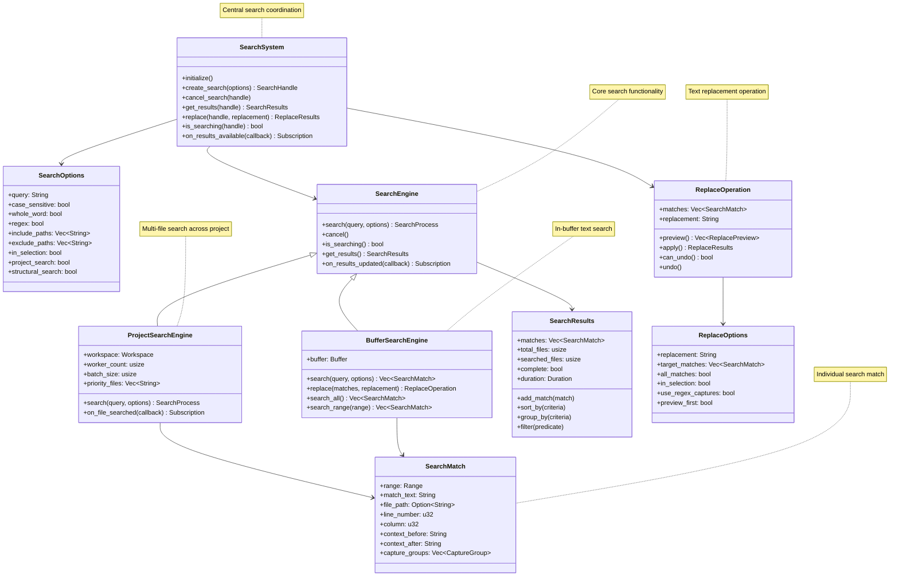

### Detailed Component Structure

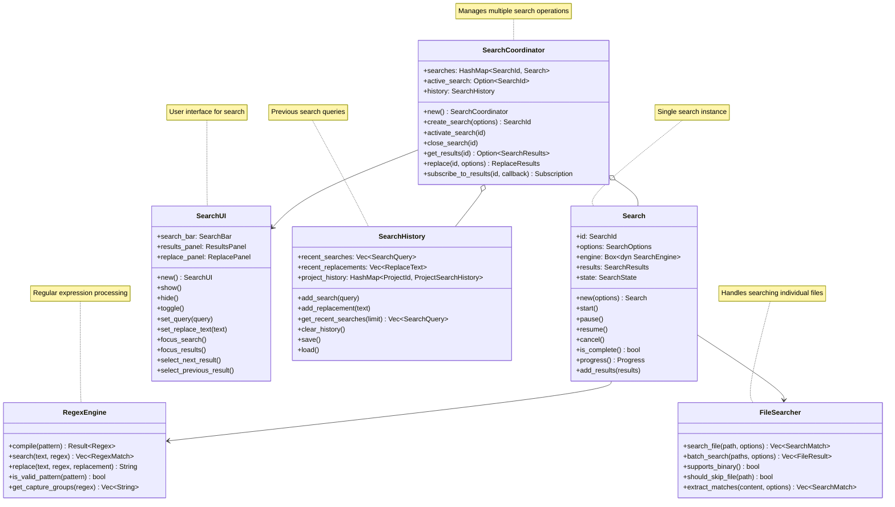

### Search Flow

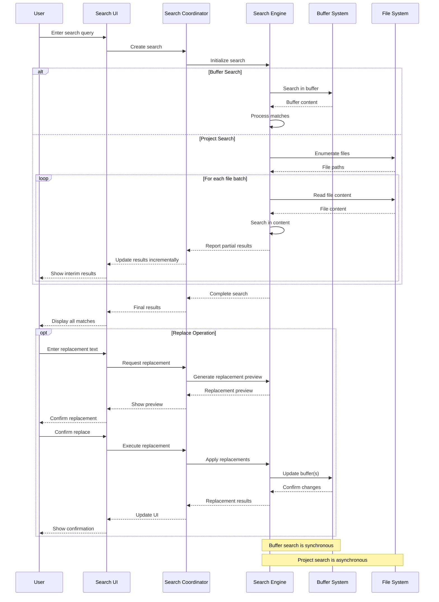

### Replace Flow

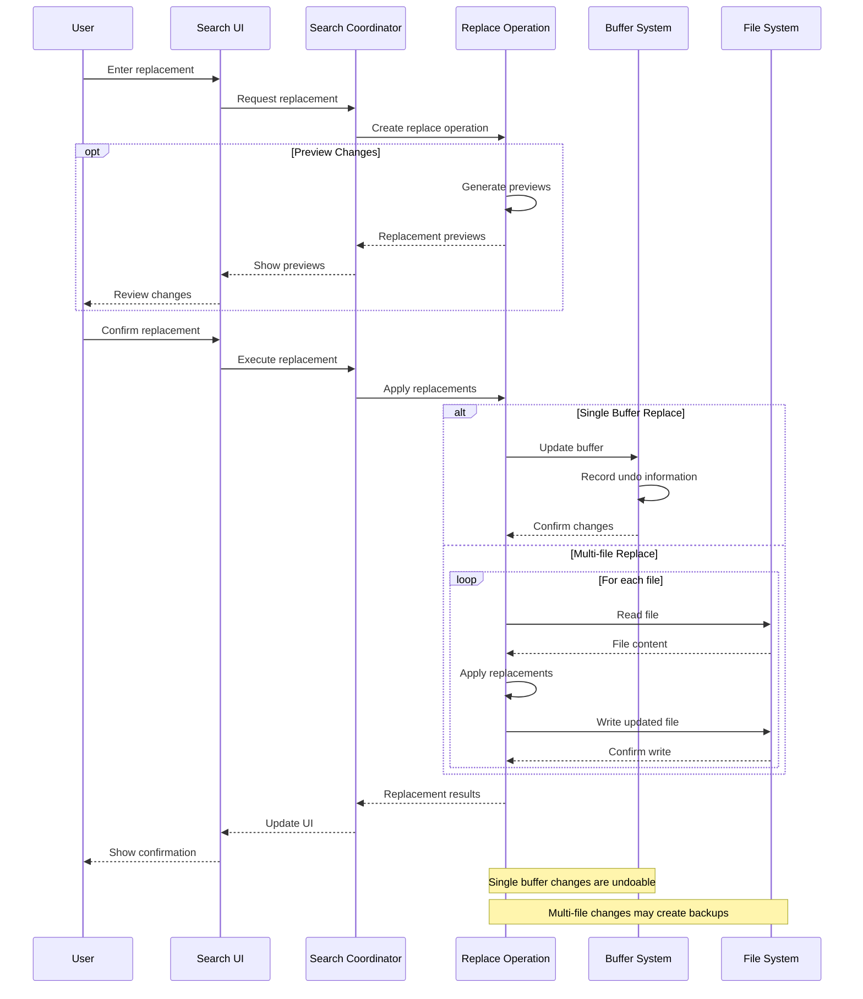

### Incremental Search Results Flow

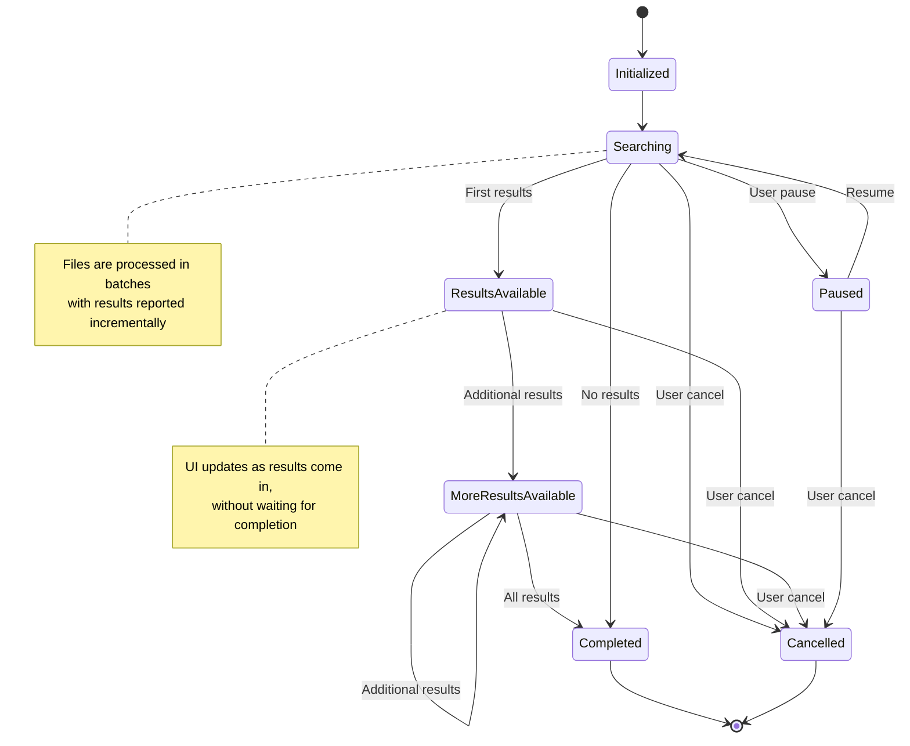

## Key Interfaces

### Search System

```
// Conceptual interface, not actual Rust code
SearchSystem {
    // Core search operations
    create_search(options: SearchOptions) -> SearchId
    activate_search(id: SearchId) -> Result<()>
    close_search(id: SearchId)
    
    // Status and results
    is_searching(id: SearchId) -> bool
    get_search_progress(id: SearchId) -> Progress
    get_results(id: SearchId) -> Option<SearchResults>
    
    // Replace operations
    replace(id: SearchId, options: ReplaceOptions) -> ReplaceResults
    preview_replace(id: SearchId, options: ReplaceOptions) -> Vec<ReplacePreview>
    
    // History
    get_recent_searches(limit: usize) -> Vec<SearchQuery>
    add_to_history(query: SearchQuery)
    clear_history()
    
    // Events
    on_search_started(callback: Callback) -> Subscription
    on_results_available(callback: Callback) -> Subscription
    on_search_completed(callback: Callback) -> Subscription
}
```

### Search Options

```
// Conceptual interface, not actual Rust code
SearchOptions {
    // Search query
    query: String,
    
    // Search behavior
    case_sensitive: bool,
    whole_word: bool,
    regex: bool,
    multiline: bool,
    
    // Search scope
    scope: SearchScope, // Buffer, Selection, Workspace, etc.
    include_paths: Vec<String>,
    exclude_paths: Vec<String>,
    
    // Specialized search
    structural_search: bool,
    semantic_search: bool,
    
    // Result handling
    max_results: Option<usize>,
    context_lines: usize,
    include_binary: bool,
    
    // Performance
    worker_count: Option<usize>,
    batch_size: usize,
}

SearchScope {
    CurrentBuffer,
    Selection,
    OpenBuffers,
    Workspace,
    Directory(String),
    Custom(Vec<String>),
}
```

### Search Results

```
// Conceptual interface, not actual Rust code
SearchResults {
    // Results collection
    matches: Vec<SearchMatch>,
    
    // Status
    total_files: usize,
    searched_files: usize,
    complete: bool,
    duration: Duration,
    
    // Result management
    add_match(match: SearchMatch),
    add_matches(matches: Vec<SearchMatch>),
    clear(),
    
    // Filtering and sorting
    sort_by(criteria: SortCriteria) -> Self,
    group_by(criteria: GroupCriteria) -> GroupedResults,
    filter(predicate: Predicate) -> Self,
    
    // Search info
    query() -> &str,
    options() -> &SearchOptions,
    
    // Statistics
    match_count() -> usize,
    file_count() -> usize,
    has_results() -> bool,
}

SearchMatch {
    // Location
    range: Range,
    file_path: Option<String>,
    line_number: u32,
    column: u32,
    
    // Content
    match_text: String,
    context_before: String,
    context_after: String,
    
    // Regex information
    capture_groups: Vec<CaptureGroup>,
    
    // Utility
    to_selection() -> Selection,
    in_visible_range(viewport: Range) -> bool,
    overlaps(other: &SearchMatch) -> bool,
}
```

### Replace Operations

```
// Conceptual interface, not actual Rust code
ReplaceOptions {
    // Replace with
    replacement: String,
    
    // Scope
    all_matches: bool,
    selected_matches: Option<Vec<SearchMatchId>>,
    in_selection: bool,
    
    // Behavior
    use_regex_captures: bool,
    create_backups: bool,
    preview_first: bool,
    
    // Constraints
    max_files: Option<usize>,
    max_matches: Option<usize>,
}

ReplaceOperation {
    // Setup
    with_matches(matches: Vec<SearchMatch>) -> Self,
    with_replacement(text: String) -> Self,
    with_options(options: ReplaceOptions) -> Self,
    
    // Execution
    preview() -> Vec<ReplacePreview>,
    apply() -> ReplaceResults,
    
    // Undo
    can_undo() -> bool,
    undo() -> Result<()>,
    
    // Status
    is_complete() -> bool,
    affected_files() -> Vec<String>,
    match_count() -> usize,
}

ReplaceResults {
    // Results
    replaced_count: usize,
    affected_files: Vec<String>,
    errors: Vec<ReplaceError>,
    
    // Status
    complete: bool,
    undo_available: bool,
    
    // Success check
    is_success() -> bool,
    has_errors() -> bool,
}
```

### Search UI Components

```
// Conceptual interface, not actual Rust code
SearchUI {
    // Visibility
    show(),
    hide(),
    toggle(),
    is_visible() -> bool,
    
    // Current search
    set_query(query: String),
    get_query() -> String,
    set_options(options: SearchOptions),
    get_options() -> SearchOptions,
    
    // Results handling
    set_results(results: SearchResults),
    clear_results(),
    
    // Replace
    set_replace_text(text: String),
    get_replace_text() -> String,
    show_replace_panel(),
    hide_replace_panel(),
    
    // Navigation
    select_next_result(),
    select_previous_result(),
    go_to_selected_result(),
    
    // Focus
    focus_search(),
    focus_results(),
    focus_replace(),
    
    // Rendering
    render() -> Element,
}

SearchBar {
    // Core functionality
    set_query(query: String),
    get_query() -> String,
    on_query_change(callback: Callback) -> Subscription,
    
    // Options
    set_case_sensitive(sensitive: bool),
    set_whole_word(whole_word: bool),
    set_regex(regex: bool),
    
    // History
    show_history(),
    select_history_item(index: usize),
    clear_history(),
    
    // UI
    focus(),
    clear(),
    render() -> Element,
}

ResultsPanel {
    // Results
    set_results(results: SearchResults),
    clear_results(),
    
    // Selection
    select_result(index: usize),
    get_selected_result() -> Option<SearchMatch>,
    select_next(),
    select_previous(),
    
    // Grouping and filtering
    group_by(criteria: GroupCriteria),
    filter(filter: ResultFilter),
    
    // UI
    scroll_to_result(index: usize),
    expand_group(group_id: GroupId),
    collapse_group(group_id: GroupId),
    render() -> Element,
}
```

## Implementation Patterns

### Search Algorithm Selection

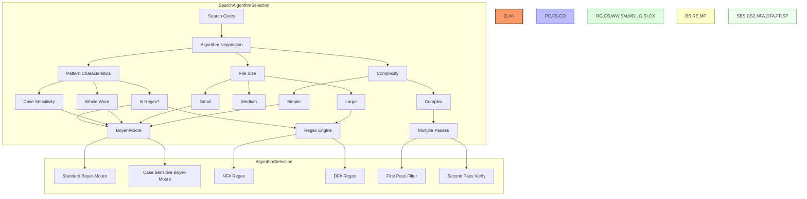

#### Search Algorithm Patterns

1. **Algorithm Selection**: Choosing the right search algorithm
   ```rust
   fn select_algorithm(query: &str, options: &SearchOptions) -> Box<dyn SearchAlgorithm> {
       // Choose the optimal algorithm based on query characteristics
       if options.regex {
           Box::new(RegexSearch::new(query, options))
       } else if options.case_sensitive {
           if options.whole_word {
               Box::new(CaseSensitiveWholeWordSearch::new(query))
           } else {
               Box::new(CaseSensitiveSearch::new(query))
           }
       } else {
           if options.whole_word {
               Box::new(CaseInsensitiveWholeWordSearch::new(query))
           } else {
               Box::new(CaseInsensitiveSearch::new(query))
           }
       }
   }
   ```

2. **Search Strategy Pattern**: Using strategy pattern for algorithms
   ```rust
   trait SearchAlgorithm {
       fn search(&self, text: &str) -> Vec<SearchMatch>;
       fn supports_incremental(&self) -> bool;
       fn search_incremental(&self, text: &str, start_pos: usize) -> Option<SearchMatch>;
   }
   
   struct BoyerMooreSearch {
       pattern: Vec<u8>,
       // Boyer-Moore tables and state
   }
   
   impl SearchAlgorithm for BoyerMooreSearch {
       fn search(&self, text: &str) -> Vec<SearchMatch> {
           // Boyer-Moore implementation
       }
       
       fn supports_incremental(&self) -> bool {
           true
       }
       
       fn search_incremental(&self, text: &str, start_pos: usize) -> Option<SearchMatch> {
           // Incremental Boyer-Moore search
       }
   }
   ```

3. **Batched Processing**: Handling large files in chunks
   ```rust
   fn search_large_file(path: &Path, pattern: &SearchPattern, options: &SearchOptions) -> Vec<SearchMatch> {
       let file = File::open(path)?;
       let reader = BufReader::new(file);
       
       let mut matches = Vec::new();
       let mut buffer = Vec::with_capacity(BATCH_SIZE);
       let mut line_number = 1;
       
       for chunk in reader.chunks(BATCH_SIZE) {
           let chunk = chunk?;
           buffer.extend_from_slice(&chunk);
           
           // Process complete lines
           while let Some(line_end) = buffer.iter().position(|&b| b == b'\n') {
               let line = buffer.drain(..=line_end).collect::<Vec<_>>();
               let line_str = std::str::from_utf8(&line)?;
               
               for m in pattern.search(line_str) {
                   matches.push(SearchMatch {
                       line_number,
                       // ...other fields
                   });
               }
               
               line_number += 1;
           }
       }
       
       // Process any remaining data
       if !buffer.is_empty() {
           let line_str = std::str::from_utf8(&buffer)?;
           for m in pattern.search(line_str) {
               matches.push(SearchMatch {
                   line_number,
                   // ...other fields
               });
           }
       }
       
       matches
   }
   ```

4. **Concurrent File Search**: Multi-threaded project search
   ```rust
   fn search_project(paths: Vec<PathBuf>, pattern: SearchPattern, options: SearchOptions) -> SearchResults {
       let (tx, rx) = channel();
       let pool = ThreadPool::new(num_cpus::get());
       
       for path in paths {
           let tx = tx.clone();
           let pattern = pattern.clone();
           let options = options.clone();
           
           pool.execute(move || {
               match search_file(&path, &pattern, &options) {
                   Ok(matches) => {
                       if !matches.is_empty() {
                           tx.send(FileSearchResult::Matches(path, matches)).unwrap();
                       } else {
                           tx.send(FileSearchResult::NoMatches(path)).unwrap();
                       }
                   }
                   Err(e) => {
                       tx.send(FileSearchResult::Error(path, e)).unwrap();
                   }
               }
           });
       }
       
       // Collect results
       drop(tx); // Drop original sender
       
       let mut results = SearchResults::new();
       for result in rx {
           match result {
               FileSearchResult::Matches(path, matches) => {
                   results.add_file_matches(path, matches);
               }
               FileSearchResult::NoMatches(path) => {
                   results.record_searched_file(path);
               }
               FileSearchResult::Error(path, error) => {
                   results.record_error(path, error);
               }
           }
       }
       
       results
   }
   ```

### Regex Engine Integration

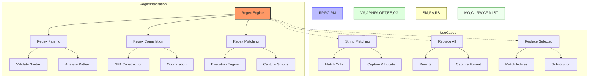

#### Regex Engine Patterns

1. **Regex Engine Abstraction**: Wrapper for regex library
   ```rust
   struct RegexEngine {
       // Internal regex engine state
   }
   
   impl RegexEngine {
       fn new() -> Self {
           RegexEngine { /* ... */ }
       }
       
       fn is_valid_pattern(&self, pattern: &str) -> bool {
           regex::Regex::new(pattern).is_ok()
       }
       
       fn compile(&self, pattern: &str, options: &RegexOptions) -> Result<CompiledRegex, RegexError> {
           let mut builder = regex::RegexBuilder::new(pattern);
           
           builder.case_insensitive(!options.case_sensitive)
                  .multi_line(options.multiline)
                  .dot_matches_new_line(options.dot_matches_newline)
                  .unicode(true);
           
           match builder.build() {
               Ok(regex) => Ok(CompiledRegex { inner: regex }),
               Err(e) => Err(RegexError::from(e)),
           }
       }
   }
   
   struct CompiledRegex {
       inner: regex::Regex,
   }
   
   impl CompiledRegex {
       fn find_all(&self, text: &str) -> Vec<RegexMatch> {
           self.inner.find_iter(text)
               .map(|m| RegexMatch {
                   start: m.start(),
                   end: m.end(),
                   text: m.as_str().to_string(),
               })
               .collect()
       }
       
       fn replace_all(&self, text: &str, replacement: &str) -> String {
           self.inner.replace_all(text, replacement).to_string()
       }
       
       fn captures(&self, text: &str) -> Vec<Vec<RegexCapture>> {
           self.inner.captures_iter(text)
               .map(|caps| {
                   (0..caps.len())
                       .filter_map(|i| {
                           caps.get(i).map(|m| RegexCapture {
                               group_index: i,
                               start: m.start(),
                               end: m.end(),
                               text: m.as_str().to_string(),
                           })
                       })
                       .collect()
               })
               .collect()
       }
   }
   ```

2. **Regex Capture Group Handling**: Processing capture groups
   ```rust
   fn process_replacement_with_captures(replacement: &str, captures: &[RegexCapture]) -> String {
       let mut result = String::with_capacity(replacement.len() * 2);
       let mut chars = replacement.chars().peekable();
       
       while let Some(c) = chars.next() {
           if c == '$' {
               if let Some(next) = chars.peek() {
                   if next.is_ascii_digit() {
                       let mut index = String::new();
                       while let Some(&next) = chars.peek() {
                           if next.is_ascii_digit() {
                               index.push(chars.next().unwrap());
                           } else {
                               break;
                           }
                       }
                       
                       if let Ok(group) = index.parse::<usize>() {
                           if let Some(capture) = captures.iter().find(|c| c.group_index == group) {
                               result.push_str(&capture.text);
                               continue;
                           }
                       }
                   }
               }
           }
           
           result.push(c);
       }
       
       result
   }
   ```

3. **Regex Performance Optimization**: Avoiding regex for simple cases
   ```rust
   fn optimize_search(query: &str, options: &SearchOptions) -> Box<dyn SearchAlgorithm> {
       // Simple literal search can be faster than regex for basic patterns
       if options.regex {
           // Check if the regex is actually just a literal search in disguise
           if is_simple_literal_regex(query) {
               let literal = extract_literal_from_regex(query);
               return Box::new(LiteralSearch::new(literal, options.case_sensitive));
           }
           
           Box::new(RegexSearch::new(query, options))
       } else {
           Box::new(LiteralSearch::new(query, options.case_sensitive))
       }
   }
   
   fn is_simple_literal_regex(pattern: &str) -> bool {
       // Check if pattern only contains literal characters without metacharacters
       !pattern.chars().any(|c| "\\^$.|?*+()[{".contains(c))
   }
   ```

4. **Regex Error Handling**: User-friendly regex error reporting
   ```rust
   fn validate_regex_pattern(pattern: &str) -> Result<(), RegexValidationError> {
       match regex::Regex::new(pattern) {
           Ok(_) => Ok(()),
           Err(e) => {
               let error_message = match e {
                   regex::Error::Syntax(msg) => {
                       format!("Syntax error in regex: {}", msg)
                   }
                   regex::Error::CompiledTooBig(..) => {
                       "Regex pattern is too complex".to_string()
                   }
                   _ => format!("Invalid regex: {}", e),
               };
               
               Err(RegexValidationError {
                   message: error_message,
                   position: find_error_position(&e),
               })
           }
       }
   }
   
   struct RegexValidationError {
       message: String,
       position: Option<usize>,
   }
   ```

### Project Search Optimization

```mermaid
flowchart TD
    subgraph ProjectSearchOptimization
        PS[Project Search]
        
        PS --> FP[File Prioritization]
        PS --> BE[Batch Execution]
        PS --> EF[Early Filtering]
        
        FP --> OB[Open Buffers First]
        FP --> RF[Recently Edited Files]
        FP --> VF[Visible Files]
        
        BE --> SU[Setup Phase]
        BE --> EX[Execution Phase]
        BE --> CO[Collection Phase]
        
        EF --> BF[Binary File Detection]
        EF --> GI[Gitignore Integration]
        EF --> PH[Path Heuristics]
    end
    
    subgraph Optimizations
        IC[Incremental Collection]
        PC[Parallel Chunks]
        CS[Content Streaming]
        MM[Memory Management]
        FB[File Buffering]
    end
    
    PS --> IC & PC & CS & MM & FB
    
    style PS fill:#f96,stroke:#333,stroke-width:2px
    style FP,BE,EF fill:#bbf,stroke:#33f,stroke-width:1px
    style OB,RF,VF,SU,EX,CO,BF,GI,PH fill:#dfd,stroke:#393,stroke-width:1px
    style IC,PC,CS,MM,FB fill:#ffc,stroke:#660,stroke-width:1px
```

#### Project Search Patterns

1. **File Prioritization**: Searching most important files first
   ```rust
   fn prioritize_files(paths: Vec<PathBuf>, workspace: &Workspace) -> Vec<PathBuf> {
       let mut prioritized = Vec::new();
       let mut normal = Vec::new();
       
       // Get open buffers and visible files
       let open_buffers: HashSet<PathBuf> = workspace.get_open_buffers()
           .iter()
           .filter_map(|b| b.file_path().map(PathBuf::from))
           .collect();
       
       let visible_files: HashSet<PathBuf> = workspace.get_visible_editors()
           .iter()
           .filter_map(|e| e.buffer().file_path().map(PathBuf::from))
           .collect();
       
       // Prioritize files
       for path in paths {
           if visible_files.contains(&path) {
               // Highest priority - currently visible
               prioritized.push(path);
           } else if open_buffers.contains(&path) {
               // High priority - open buffer
               prioritized.push(path);
           } else {
               // Normal priority
               normal.push(path);
           }
       }
       
       // Concatenate prioritized with normal
       prioritized.extend(normal);
       prioritized
   }
   ```

2. **Incremental Results Delivery**: Showing results as they arrive
   ```rust
   struct IncrementalSearch {
       options: SearchOptions,
       pattern: SearchPattern,
       sender: mpsc::Sender<SearchUpdate>,
       worker_pool: ThreadPool,
       files_to_search: Vec<PathBuf>,
       current_batch_index: AtomicUsize,
       batch_size: usize,
   }
   
   impl IncrementalSearch {
       fn start(&mut self) {
           let total_files = self.files_to_search.len();
           self.sender.send(SearchUpdate::Started { total_files }).unwrap();
           
           // Process batches
           let batch_count = (total_files + self.batch_size - 1) / self.batch_size;
           
           for _ in 0..self.worker_pool.max_count() {
               self.schedule_next_batch();
           }
       }
       
       fn schedule_next_batch(&self) {
           let batch_index = self.current_batch_index.fetch_add(1, Ordering::SeqCst);
           if batch_index >= (self.files_to_search.len() + self.batch_size - 1) / self.batch_size {
               return; // No more batches
           }
           
           let start = batch_index * self.batch_size;
           let end = std::cmp::min(start + self.batch_size, self.files_to_search.len());
           
           let files = self.files_to_search[start..end].to_vec();
           let sender = self.sender.clone();
           let pattern = self.pattern.clone();
           let options = self.options.clone();
           
           self.worker_pool.execute(move || {
               for file in files {
                   let result = search_file(&file, &pattern, &options);
                   match result {
                       Ok(matches) => {
                           if !matches.is_empty() {
                               sender.send(SearchUpdate::FileMatches { 
                                   path: file.clone(), 
                                   matches 
                               }).unwrap();
                           }
                       }
                       Err(e) => {
                           sender.send(SearchUpdate::Error { 
                               path: file.clone(), 
                               error: e 
                           }).unwrap();
                       }
                   }
                   
                   sender.send(SearchUpdate::FileProcessed { 
                       path: file 
                   }).unwrap();
               }
               
               // Schedule next batch when this worker is done
               sender.send(SearchUpdate::BatchCompleted { 
                   batch_index 
               }).unwrap();
           });
       }
   }
   
   enum SearchUpdate {
       Started { total_files: usize },
       FileMatches { path: PathBuf, matches: Vec<SearchMatch> },
       FileProcessed { path: PathBuf },
       Error { path: PathBuf, error: SearchError },
       BatchCompleted { batch_index: usize },
       Completed,
   }
   ```

3. **Early File Filtering**: Skip unnecessary files quickly
   ```rust
   fn should_search_file(path: &Path, options: &SearchOptions) -> bool {
       // Check if file should be excluded based on path patterns
       if let Some(ref exclude_patterns) = options.exclude_paths {
           for pattern in exclude_patterns {
               if glob_match(pattern, path) {
                   return false;
               }
           }
       }
       
       // Check if file should be included based on path patterns
       if let Some(ref include_patterns) = options.include_paths {
           if !include_patterns.is_empty() {
               let mut should_include = false;
               for pattern in include_patterns {
                   if glob_match(pattern, path) {
                       should_include = true;
                       break;
                   }
               }
               if !should_include {
                   return false;
               }
           }
       }
       
       // Skip binary files unless explicitly included
       if !options.include_binary && is_likely_binary(path) {
           return false;
       }
       
       true
   }
   
   fn is_likely_binary(path: &Path) -> bool {
       // Quick check based on extension
       if let Some(extension) = path.extension() {
           if let Some(ext) = extension.to_str() {
               if BINARY_EXTENSIONS.contains(&ext.to_lowercase().as_str()) {
                   return true;
               }
           }
       }
       
       // Peek at file content if needed
       if let Ok(file) = File::open(path) {
           let mut reader = BufReader::new(file);
           let mut buffer = [0; 512];
           
           if let Ok(bytes_read) = reader.read(&mut buffer) {
               if bytes_read > 0 {
                   return buffer[..bytes_read].contains(&0);
               }
           }
       }
       
       false
   }
   ```

4. **Memory-efficient File Processing**: Stream large files
   ```rust
   fn search_large_file_streaming(path: &Path, pattern: &SearchPattern, options: &SearchOptions) 
       -> impl Iterator<Item = SearchMatch> 
   {
       struct SearchIterator {
           reader: BufReader<File>,
           pattern: SearchPattern,
           buffer: Vec<u8>,
           line_number: usize,
           path: PathBuf,
           done: bool,
       }
       
       impl Iterator for SearchIterator {
           type Item = SearchMatch;
           
           fn next(&mut self) -> Option<Self::Item> {
               if self.done {
                   return None;
               }
               
               loop {
                   // Fill buffer if needed
                   if self.buffer.is_empty() {
                       let mut line = Vec::new();
                       match self.reader.read_until(b'\n', &mut line) {
                           Ok(0) => {
                               self.done = true;
                               return None;
                           }
                           Ok(_) => {
                               self.buffer = line;
                           }
                           Err(_) => {
                               self.done = true;
                               return None;
                           }
                       }
                   }
                   
                   // Process line
                   let line_str = match std::str::from_utf8(&self.buffer) {
                       Ok(s) => s,
                       Err(_) => {
                           // Skip non-UTF8 line
                           self.buffer.clear();
                           self.line_number += 1;
                           continue;
                       }
                   };
                   
                   // Search for pattern
                   if let Some(m) = self.pattern.find_first(line_str) {
                       let match_result = SearchMatch {
                           line_number: self.line_number,
                           column: m.start,
                           match_text: m.text.to_string(),
                           file_path: Some(self.path.clone()),
                           // ...other fields
                       };
                       
                       // Advance past this match in the buffer
                       self.pattern.advance_after_match(&mut self.buffer, m.start, m.end);
                       
                       return Some(match_result);
                   } else {
                       // No match in this line, move to next
                       self.buffer.clear();
                       self.line_number += 1;
                   }
               }
           }
       }
       
       SearchIterator {
           reader: BufReader::new(File::open(path).unwrap_or_else(|_| panic!("Failed to open {}", path.display()))),
           pattern: pattern.clone(),
           buffer: Vec::new(),
           line_number: 1,
           path: path.to_path_buf(),
           done: false,
       }
   }
   ```

### Replace Implementation

```mermaid
graph TD
    subgraph ReplaceImplementation
        RI[Replace Implementation]
        
        RI --> RS[Replace Strategy]
        RI --> RT[Replace Transaction]
        RI --> RU[Replace Undo]
        
        RS --> IR[In-place Replace]
        RS --> CR[Capture Replace]
        RS --> FR[Functional Replace]
        
        RT --> PP[Preview Phase]
        RT --> EP[Execution Phase]
        RT --> VP[Verification Phase]
        
        RU --> SR[Single File Revert]
        RU --> MR[Multi-file Revert]
        RU --> BF[Backup Files]
    end
    
    subgraph ReplaceUses
        SB[Single Buffer]
        MB[Multiple Buffers]
        MF[Multiple Files]
        
        SB --> LR[Local Replace]
        SB --> HR[History Tracked]
        
        MB --> CR2[Coordinated Replace]
        MB --> TR[Transactional]
        
        MF --> PR[Parallel Replace]
        MF --> BR[Backup and Replace]
    end
    
    RI --> SB & MB & MF
    
    style RI fill:#f96,stroke:#333,stroke-width:2px
    style RS,RT,RU fill:#bbf,stroke:#33f,stroke-width:1px
    style IR,CR,FR,PP,EP,VP,SR,MR,BF fill:#dfd,stroke:#393,stroke-width:1px
    style SB,MB,MF fill:#ffc,stroke:#660,stroke-width:1px
    style LR,HR,CR2,TR,PR,BR fill:#efe,stroke:#393,stroke-width:1px
```

#### Replace Operation Patterns

1. **Coordinated Buffer Replace**: Transactional replace across buffers
   ```rust
   fn replace_in_buffers(buffers: &[Buffer], matches: &[SearchMatch], replacement: &str, options: &ReplaceOptions) 
       -> Result<ReplaceResults, ReplaceError> 
   {
       let mut results = ReplaceResults {
           replaced_count: 0,
           affected_files: Vec::new(),
           errors: Vec::new(),
           complete: false,
           undo_available: true,
       };
       
       // Group matches by buffer
       let mut matches_by_buffer: HashMap<BufferId, Vec<&SearchMatch>> = HashMap::new();
       for m in matches {
           if let Some(buffer_id) = m.buffer_id {
               matches_by_buffer.entry(buffer_id).or_default().push(m);
           }
       }
       
       // Create a transaction for each buffer
       let mut transactions = Vec::new();
       
       for (buffer_id, buffer_matches) in matches_by_buffer {
           let buffer = match buffers.iter().find(|b| b.id() == buffer_id) {
               Some(b) => b,
               None => {
                   results.errors.push(ReplaceError::BufferNotFound(buffer_id));
                   continue;
               }
           };
           
           // Sort matches in reverse order to avoid position shifts
           let mut sorted_matches = buffer_matches.to_vec();
           sorted_matches.sort_by(|a, b| b.range.start.cmp(&a.range.start));
           
           let mut transaction = buffer.start_transaction();
           
           for m in sorted_matches {
               match transaction.replace(m.range, replacement) {
                   Ok(_) => {
                       results.replaced_count += 1;
                       if let Some(path) = buffer.file_path() {
                           if !results.affected_files.contains(&path) {
                               results.affected_files.push(path);
                           }
                       }
                   }
                   Err(e) => {
                       results.errors.push(ReplaceError::ReplaceFailed(m.clone(), e.to_string()));
                   }
               }
           }
           
           transactions.push((buffer, transaction));
       }
       
       // Commit all transactions if no errors, or if force option is set
       if results.errors.is_empty() || options.ignore_errors {
           for (buffer, transaction) in transactions {
               if let Err(e) = buffer.commit_transaction(transaction) {
                   results.errors.push(ReplaceError::TransactionFailed(buffer.id(), e.to_string()));
               }
           }
       } else {
           // Don't commit any transactions if there are errors
           return Err(ReplaceError::OperationFailed(results.errors.len()));
       }
       
       results.complete = true;
       Ok(results)
   }
   ```

2. **File System Replace with Backups**: Safe file system replacement
   ```rust
   fn replace_in_files(matches: &[SearchMatch], replacement: &str, options: &ReplaceOptions) 
       -> Result<ReplaceResults, ReplaceError> 
   {
       let mut results = ReplaceResults {
           replaced_count: 0,
           affected_files: Vec::new(),
           errors: Vec::new(),
           complete: false,
           undo_available: options.create_backups,
       };
       
       // Group matches by file
       let mut matches_by_file: HashMap<PathBuf, Vec<&SearchMatch>> = HashMap::new();
       for m in matches {
           if let Some(ref path) = m.file_path {
               matches_by_file.entry(path.clone()).or_default().push(m);
           }
       }
       
       // Process each file
       for (path, file_matches) in matches_by_file {
           // Create backup if requested
           if options.create_backups {
               let backup_path = get_backup_path(&path);
               if let Err(e) = std::fs::copy(&path, &backup_path) {
                   results.errors.push(ReplaceError::BackupFailed(path.clone(), e.to_string()));
                   continue;
               }
           }
           
           // Read file content
           let content = match std::fs::read_to_string(&path) {
               Ok(content) => content,
               Err(e) => {
                   results.errors.push(ReplaceError::ReadFailed(path.clone(), e.to_string()));
                   continue;
               }
           };
           
           // Sort matches in reverse order to avoid position shifts
           let mut sorted_matches = file_matches.to_vec();
           sorted_matches.sort_by(|a, b| b.range.start.cmp(&a.range.start));
           
           // Apply replacements
           let mut new_content = content.clone();
           let mut replaced_count = 0;
           
           for m in sorted_matches {
               if m.range.start < new_content.len() && m.range.end <= new_content.len() {
                   let replacement_text = if options.use_regex_captures && !m.capture_groups.is_empty() {
                       process_replacement_with_captures(replacement, &m.capture_groups)
                   } else {
                       replacement.to_string()
                   };
                   
                   new_content.replace_range(m.range.start..m.range.end, &replacement_text);
                   replaced_count += 1;
               }
           }
           
           // Write back to file if changes were made
           if replaced_count > 0 {
               if let Err(e) = std::fs::write(&path, new_content) {
                   results.errors.push(ReplaceError::WriteFailed(path.clone(), e.to_string()));
                   continue;
               }
               
               results.replaced_count += replaced_count;
               results.affected_files.push(path);
           }
       }
       
       results.complete = true;
       Ok(results)
   }
   
   fn get_backup_path(path: &Path) -> PathBuf {
       let mut backup_path = path.to_path_buf();
       let file_name = path.file_name().unwrap().to_str().unwrap();
       let backup_name = format!("{}.bak", file_name);
       backup_path.set_file_name(backup_name);
       backup_path
   }
   ```

3. **Regex Capture Replacement**: Using regex captures in replacements
   ```rust
   fn replace_with_regex(text: &str, regex: &Regex, replacement: &str, matches: &[SearchMatch]) 
       -> String 
   {
       let mut result = text.to_string();
       let mut offset = 0;
       
       for m in matches {
           // Adjust range based on previous replacements
           let start = m.range.start as isize + offset;
           let end = m.range.end as isize + offset;
           
           if start < 0 || end < 0 || start >= result.len() as isize || end > result.len() as isize {
               continue; // Skip invalid ranges
           }
           
           let start = start as usize;
           let end = end as usize;
           
           // Extract the matched text
           let matched = &result[start..end];
           
           // Create replacement text with capture references
           let replacement_text = if !m.capture_groups.is_empty() {
               // Use the regex engine to perform replacement with captures
               let capture_text = matched;
               let caps = regex.captures(capture_text).unwrap();
               
               let mut result = String::new();
               let mut last_match_end = 0;
               
               // Process $1, $2, etc. references
               let capture_refs = regex::Regex::new(r"\$(\d+)").unwrap();
               for cap_ref in capture_refs.captures_iter(replacement) {
                   let full_match = cap_ref.get(0).unwrap();
                   let capture_num: usize = cap_ref.get(1).unwrap().as_str().parse().unwrap();
                   
                   // Add text before the $n reference
                   result.push_str(&replacement[last_match_end..full_match.start()]);
                   
                   // Add the captured group text if it exists
                   if let Some(group) = caps.get(capture_num) {
                       result.push_str(group.as_str());
                   }
                   
                   last_match_end = full_match.end();
               }
               
               // Add any remaining text
               result.push_str(&replacement[last_match_end..]);
               result
           } else {
               replacement.to_string()
           };
           
           // Replace the matched text
           result.replace_range(start..end, &replacement_text);
           
           // Update offset for future replacements
           offset += replacement_text.len() as isize - (end - start) as isize;
       }
       
       result
   }
   ```

4. **Replace Preview Generation**: Creating previews before applying
   ```rust
   fn generate_replace_preview(matches: &[SearchMatch], replacement: &str, options: &ReplaceOptions) 
       -> Vec<ReplacePreview> 
   {
       let mut previews = Vec::new();
       
       // Group matches by file
       let mut matches_by_file: HashMap<PathBuf, Vec<&SearchMatch>> = HashMap::new();
       for m in matches {
           if let Some(ref path) = m.file_path {
               matches_by_file.entry(path.clone()).or_default().push(m);
           }
       }
       
       for (path, file_matches) in matches_by_file {
           if let Ok(content) = std::fs::read_to_string(&path) {
               let file_preview = ReplaceFilePreview {
                   file_path: path.clone(),
                   line_previews: Vec::new(),
               };
               
               // Get line-based view of the file
               let lines: Vec<&str> = content.lines().collect();
               
               // Group matches by line
               let mut matches_by_line: HashMap<usize, Vec<&SearchMatch>> = HashMap::new();
               for m in file_matches {
                   let line_idx = m.line_number - 1; // Convert to 0-based index
                   matches_by_line.entry(line_idx).or_default().push(m);
               }
               
               // Process each line with matches
               for (line_idx, line_matches) in matches_by_line {
                   if line_idx >= lines.len() {
                       continue; // Skip invalid line indices
                   }
                   
                   let original_line = lines[line_idx];
                   
                   // Create a preview of the changed line
                   let mut preview_line = original_line.to_string();
                   let mut offset = 0;
                   
                   // Sort matches to apply from right to left (to avoid position shifts)
                   let mut sorted_matches = line_matches.to_vec();
                   sorted_matches.sort_by(|a, b| {
                       let a_start = a.column;
                       let b_start = b.column;
                       b_start.cmp(&a_start)
                   });
                   
                   for m in sorted_matches {
                       // Calculate in-line position
                       let start_col = m.column;
                       let end_col = start_col + m.match_text.len();
                       
                       // Adjust for previous replacements
                       let start = (start_col as isize + offset) as usize;
                       let end = (end_col as isize + offset) as usize;
                       
                       if start < preview_line.len() && end <= preview_line.len() {
                           let replacement_text = if options.use_regex_captures && !m.capture_groups.is_empty() {
                               process_replacement_with_captures(replacement, &m.capture_groups)
                           } else {
                               replacement.to_string()
                           };
                           
                           preview_line.replace_range(start..end, &replacement_text);
                           offset += replacement_text.len() as isize - (end - start) as isize;
                       }
                   }
                   
                   file_preview.line_previews.push(ReplaceLinePreview {
                       line_number: line_idx + 1, // Back to 1-based index
                       original_line: original_line.to_string(),
                       preview_line,
                       matches: line_matches.iter().map(|&m| m.clone()).collect(),
                   });
               }
               
               previews.push(file_preview);
           }
       }
       
       previews
   }
   
   struct ReplacePreview {
       file_previews: Vec<ReplaceFilePreview>,
       total_matches: usize,
       total_files: usize,
   }
   
   struct ReplaceFilePreview {
       file_path: PathBuf,
       line_previews: Vec<ReplaceLinePreview>,
   }
   
   struct ReplaceLinePreview {
       line_number: usize,
       original_line: String,
       preview_line: String,
       matches: Vec<SearchMatch>,
   }
   ```

## Performance Considerations

### Search Performance

1. **Algorithm Selection**: Choose the right algorithm for the query
   - Use Boyer-Moore for simple literal searches
   - Use specialized case-insensitive algorithms when needed
   - Use regex engine only when necessary
   - Consider specialized algorithms for whole word matching

2. **Incremental Processing**: Process large files in chunks
   - Stream file content rather than loading entirely in memory
   - Process one line at a time for large files
   - Track line numbers for accurate position reporting
   - Use buffered I/O for efficient file reading

3. **Concurrent Search**: Use multiple threads for project search
   - Balance thread count based on CPU cores
   - Process files in batches for efficient scheduling
   - Use work-stealing algorithms for better load balancing
   - Prioritize important files (open, visible, recently edited)

4. **Early Filtering**: Skip unnecessary file processing
   - Check file extensions before opening files
   - Use gitignore patterns to exclude files
   - Detect binary files early to skip them
   - Use path patterns to filter files

### Replace Performance

1. **Efficient Text Manipulation**: Optimize replacement operations
   - Sort matches in reverse order to avoid position shifts
   - Use efficient string manipulation primitives
   - Precompile regular expressions
   - Cache capture group references

2. **Batch Processing**: Group operations for efficiency
   - Process files in batches
   - Group matches by file to minimize I/O
   - Use transactions for buffer modifications
   - Coordinate multi-buffer operations

3. **Incremental UI Updates**: Keep UI responsive during large operations
   - Preview replacements in chunks
   - Show progress during long-running operations
   - Allow cancellation of operations
   - Update UI incrementally as results arrive

## Swift Considerations

### Swift Implementation Strategies

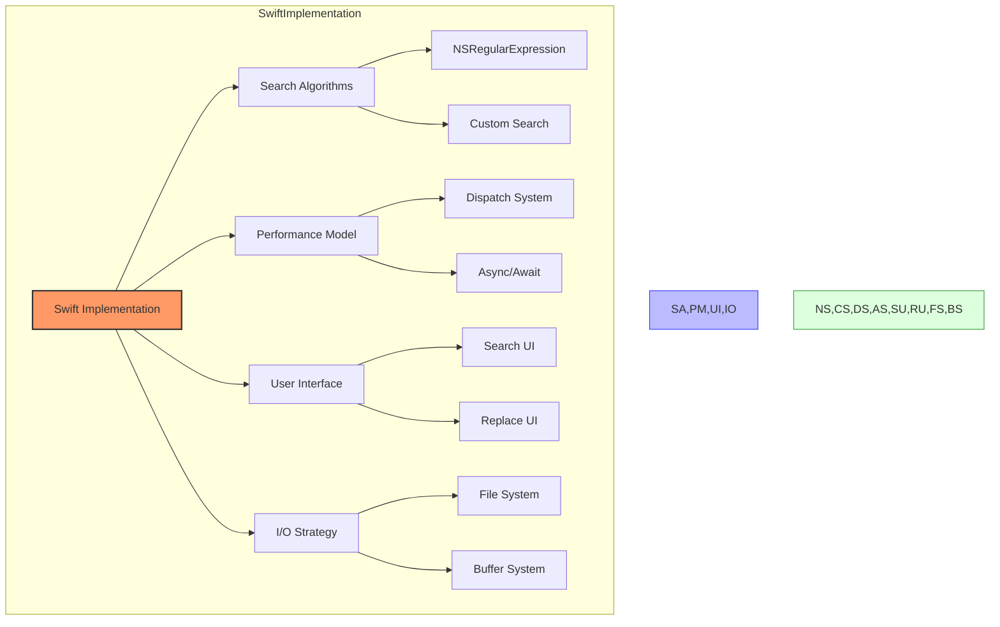

### Swift Search Implementation

- **Swift Regex**: Use Swift's native regex engine or NSRegularExpression
- **Concurrent Processing**: Use Swift's structured concurrency with async/await
- **Buffer Protocol**: Define protocols for text buffer access
- **Generic Algorithms**: Implement search algorithms with generics
- **Progress Reporting**: Use Swift's Progress API for reporting
- **File Access**: Use FileManager and streams for file access
- **Error Handling**: Implement robust error handling with Swift's Result type

### Search Algorithms in Swift

- **Boyer-Moore Implementation**: Swift implementation of fast string search
- **Case Insensitivity**: Proper Unicode case folding in Swift
- **Regex Engine**: Wrapping NSRegularExpression or Swift.Regex for ease of use
- **String Processing**: Efficient Unicode-aware string handling
- **Memory Management**: Careful memory usage for large files
- **Range Mapping**: Proper mapping between string offsets and indices

### Swift UI Considerations

- **Search UI**: Design efficient search interface
- **Result Presentation**: Organize and display search results
- **Replace Preview**: Interactive replacement preview
- **Progress Indication**: Show search and replace progress
- **Cancellation**: Support for cancelling operations
- **History Management**: Search and replace history
- **Keyboard Navigation**: Efficient keyboard shortcuts

## Interaction with Other Subsystems

### Search System → Text Editor Core
- Search operates on buffer content
- Search results are displayed in editor
- Replace operations modify buffer content
- Selection and cursor positioning
- See: [03_StratosphericView_TextEditorCore.md](./03_StratosphericView_TextEditorCore.md)

### Search System → Project Management
- Project-wide search uses project file structure
- Path filtering uses project configuration
- Result grouping by project structure
- See: [05_StratosphericView_ProjectManagement.md](./05_StratosphericView_ProjectManagement.md)

### Search System → Language Intelligence
- Structural search leverages Tree-sitter parsing
- Language-aware search features
- Semantic search capabilities
- See: [04_StratosphericView_LanguageIntelligence.md](./04_StratosphericView_LanguageIntelligence.md)

### Search System → UI Components
- Search results UI presentation
- Interactive result navigation
- Result highlighting in editor
- See: [16_AtmosphericView_UIComponents.md](./16_AtmosphericView_UIComponents.md)

### Search System → Command System
- Search commands and key bindings
- Command palette integration
- Command history for search operations
- See: [11_StratosphericView_CommandSystem.md](./11_StratosphericView_CommandSystem.md)

For a complete map of how the Search System connects to all other subsystems, see: [SubsystemRelationshipMap.md](./SubsystemRelationshipMap.md)

## Next Steps

After understanding the Search System, we'll examine the Git Integration, which provides version control capabilities within the editor. This includes repository status monitoring, commit operations, and diff visualization.