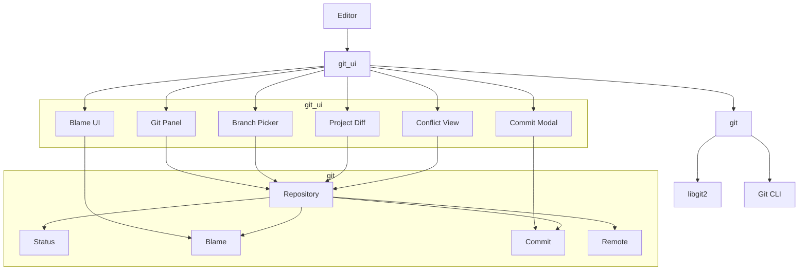
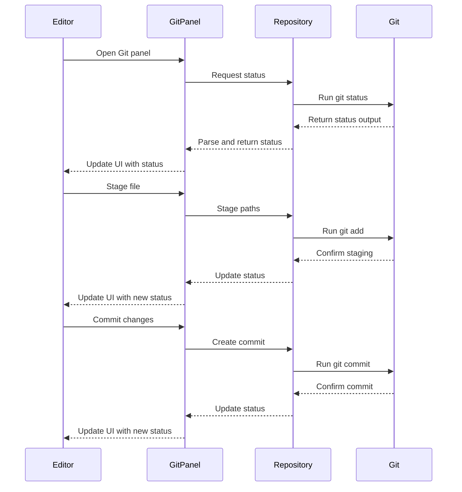
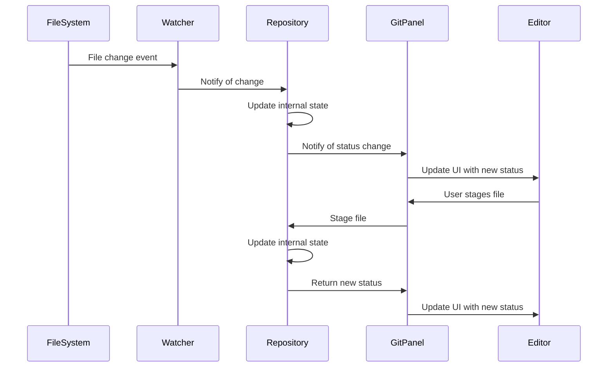

# Git Integration: Version Control in Zed

## Purpose

The Git integration system in Zed provides comprehensive version control capabilities directly within the editor. This allows users to monitor file status, create commits, manage branches, and perform operations like push, pull, and fetch without leaving the editor environment. The system wraps the underlying Git functionality and presents it through an intuitive user interface with visual indicators for file status, integrated diff views, and accessible commands.

## Concepts

### Core Abstractions

1. **Repository**: Represents a Git repository and provides methods to interact with it.
2. **Repository Path**: A specialized path type for files within a repository.
3. **Status**: Tracks the status of files (modified, added, deleted, untracked, etc.).
4. **Branch**: Represents a Git branch with tracking information.
5. **Commit**: Represents a snapshot of changes with associated metadata.
6. **Diff**: Shows differences between versions of files.
7. **Blame**: Shows line-by-line authorship information.

### Mental Models

1. **Repository State Model**: Git repositories exist in a state with a working directory, staging area (index), and commit history. The Git integration reflects this state model through UI elements and operations.

2. **File Status Lifecycle**: Files in a Git repository flow through various states:
   - Untracked → Staged (Added) → Committed
   - Committed → Modified → Staged → Committed
   - Committed → Deleted → Staged → Removed

3. **Remote Synchronization Model**: The local repository maintains a relationship with remote repositories through fetch, pull, and push operations, with branch tracking status showing ahead/behind counts.

4. **Conflict Resolution**: When conflicts occur during merge operations, the integration provides visual indicators and tools to resolve them.

## Architecture

The Git integration system in Zed is structured into two main crates:

1. **`git`**: Core Git functionality that wraps the libgit2 library and Git command-line operations.
2. **`git_ui`**: UI components that visualize Git state and provide user interaction.



### Key Components

#### Git Core (`git` crate)

1. **Repository**: Handles basic Git operations through the `GitRepository` trait:
   - File status tracking
   - Staging and unstaging changes
   - Commit creation and management
   - Branch operations
   - Remote synchronization (fetch, pull, push)

2. **Status**: Tracks the status of files in the repository:
   - Tracked vs. untracked files
   - Staged vs. unstaged changes
   - File modification status (added, modified, deleted)
   - Conflict status

3. **Blame**: Provides authorship information for lines in a file:
   - Commit SHA
   - Author name and email
   - Commit timestamp
   - Commit message

4. **Remote**: Manages remote repository connections:
   - Remote URL configurations
   - Authentication through askpass protocol
   - Push/pull operations with upstream tracking

#### Git UI (`git_ui` crate)

1. **Git Panel**: The main UI component for Git operations:
   - Shows repository status
   - Lists changed files with status indicators
   - Provides buttons for common operations (commit, push, pull)
   - Displays branch information and tracking status

2. **Blame UI**: Shows Git blame information in the editor gutter:
   - Author
   - Commit date
   - Commit message

3. **Commit Modal**: UI for creating commits:
   - Commit message editor
   - File selection for staging
   - Amend option for modifying the last commit

4. **Branch Picker**: UI for switching branches:
   - Lists available branches
   - Shows tracking information
   - Creates new branches

5. **Project Diff**: Shows a diff view for changed files:
   - Side-by-side or unified diff view
   - Syntax highlighting in diff
   - Navigation between changes

6. **Conflict View**: UI for resolving merge conflicts:
   - Shows conflicting sections
   - Provides options to choose between versions
   - Creates resolution commits

### Data Flow



### Integration Points

1. **Editor Integration**:
   - Git status decorations in the editor gutter and file tree
   - File diff view integration
   - Blame information display

2. **Project Management**:
   - Git repository detection
   - Branch tracking in project status
   - Git-specific project operations

3. **Command System**:
   - Git commands registered in the command palette
   - Keyboard shortcuts for common Git operations

4. **Workspace Integration**:
   - Git panel as a workspace component
   - Git-awareness in workspace navigation

## Interfaces

### GitRepository Trait

```rust
pub trait GitRepository: Send + Sync {
    fn reload_index(&self);
    fn load_index_text(&self, path: RepoPath) -> BoxFuture<Option<String>>;
    fn load_committed_text(&self, path: RepoPath) -> BoxFuture<Option<String>>;
    fn set_index_text(&self, path: RepoPath, content: Option<String>, env: Arc<HashMap<String, String>>) -> BoxFuture<anyhow::Result<()>>;
    fn remote_url(&self, name: &str) -> Option<String>;
    fn revparse_batch(&self, revs: Vec<String>) -> BoxFuture<Result<Vec<Option<String>>>>;
    fn head_sha(&self) -> BoxFuture<Option<String>>;
    fn merge_message(&self) -> BoxFuture<Option<String>>;
    fn status(&self, path_prefixes: &[RepoPath]) -> BoxFuture<Result<GitStatus>>;
    fn branches(&self) -> BoxFuture<Result<Vec<Branch>>>;
    fn change_branch(&self, name: String) -> BoxFuture<Result<()>>;
    fn create_branch(&self, name: String) -> BoxFuture<Result<()>>;
    fn reset(&self, commit: String, mode: ResetMode, env: Arc<HashMap<String, String>>) -> BoxFuture<Result<()>>;
    fn checkout_files(&self, commit: String, paths: Vec<RepoPath>, env: Arc<HashMap<String, String>>) -> BoxFuture<Result<()>>;
    fn show(&self, commit: String) -> BoxFuture<Result<CommitDetails>>;
    fn load_commit(&self, commit: String, cx: AsyncApp) -> BoxFuture<Result<CommitDiff>>;
    fn blame(&self, path: RepoPath, content: Rope) -> BoxFuture<Result<crate::blame::Blame>>;
    fn path(&self) -> PathBuf;
    fn main_repository_path(&self) -> PathBuf;
    fn stage_paths(&self, paths: Vec<RepoPath>, env: Arc<HashMap<String, String>>) -> BoxFuture<Result<()>>;
    fn unstage_paths(&self, paths: Vec<RepoPath>, env: Arc<HashMap<String, String>>) -> BoxFuture<Result<()>>;
    fn commit(&self, message: SharedString, name_and_email: Option<(SharedString, SharedString)>, options: CommitOptions, env: Arc<HashMap<String, String>>) -> BoxFuture<Result<()>>;
    fn push(&self, branch_name: String, upstream_name: String, options: Option<PushOptions>, askpass: AskPassDelegate, env: Arc<HashMap<String, String>>, cx: AsyncApp) -> BoxFuture<Result<RemoteCommandOutput>>;
    fn pull(&self, branch_name: String, upstream_name: String, askpass: AskPassDelegate, env: Arc<HashMap<String, String>>, cx: AsyncApp) -> BoxFuture<Result<RemoteCommandOutput>>;
    fn fetch(&self, askpass: AskPassDelegate, env: Arc<HashMap<String, String>>, cx: AsyncApp) -> BoxFuture<Result<RemoteCommandOutput>>;
    fn get_remotes(&self, branch_name: Option<String>) -> BoxFuture<Result<Vec<Remote>>>;
    fn check_for_pushed_commit(&self) -> BoxFuture<Result<Vec<SharedString>>>;
    fn diff(&self, diff: DiffType) -> BoxFuture<Result<String>>;
    fn checkpoint(&self) -> BoxFuture<'static, Result<GitRepositoryCheckpoint>>;
    fn restore_checkpoint(&self, checkpoint: GitRepositoryCheckpoint) -> BoxFuture<Result<()>>;
    fn compare_checkpoints(&self, left: GitRepositoryCheckpoint, right: GitRepositoryCheckpoint) -> BoxFuture<Result<bool>>;
    fn diff_checkpoints(&self, base_checkpoint: GitRepositoryCheckpoint, target_checkpoint: GitRepositoryCheckpoint) -> BoxFuture<Result<String>>;
}
```

### GitUI Component Interfaces

1. **GitPanel**:
   ```rust
   impl GitPanel {
       pub fn stage_all(&mut self, _: &git::StageAll, window: &mut Window, cx: &mut Context<Self>);
       pub fn unstage_all(&mut self, _: &git::UnstageAll, window: &mut Window, cx: &mut Context<Self>);
       pub fn fetch(&mut self, window: &mut Window, cx: &mut Context<Self>);
       pub fn push(&mut self, force: bool, window: &mut Window, cx: &mut Context<Self>);
       pub fn pull(&mut self, window: &mut Window, cx: &mut Context<Self>);
       pub fn git_init(&mut self, window: &mut Window, cx: &mut Context<Self>);
   }
   ```

2. **BranchPicker**:
   ```rust
   impl BranchPicker {
       pub fn pick_branch(&mut self, window: &mut Window, cx: &mut Context<Self>) -> Option<SharedString>;
       pub fn create_branch(&mut self, window: &mut Window, cx: &mut Context<Self>) -> Option<SharedString>;
   }
   ```

3. **CommitModal**:
   ```rust
   impl CommitModal {
       pub fn commit(&mut self, window: &mut Window, cx: &mut Context<Self>) -> Option<SharedString>;
       pub fn amend(&mut self, window: &mut Window, cx: &mut Context<Self>) -> Option<SharedString>;
   }
   ```

### Git Actions

```rust
actions!(
    git,
    [
        // per-hunk
        ToggleStaged,
        StageAndNext,
        UnstageAndNext,
        // per-file
        StageFile,
        UnstageFile,
        // repo-wide
        StageAll,
        UnstageAll,
        RestoreTrackedFiles,
        TrashUntrackedFiles,
        Uncommit,
        Push,
        ForcePush,
        Pull,
        Fetch,
        Commit,
        Amend,
        Cancel,
        ExpandCommitEditor,
        GenerateCommitMessage,
        Init,
    ]
);
```

## State Management

### Repository State

The Git integration tracks several types of state:

1. **Repository State**:
   - Working directory state (modified, untracked files)
   - Index state (staged changes)
   - HEAD state (current commit, branch)
   - Remote tracking state (ahead/behind counts)

2. **UI State**:
   - Git panel open/closed state
   - Selected files in the Git panel
   - Commit message draft
   - Diff view state (which files are being viewed)

### State Updates

State is updated through the following mechanisms:

1. **Repository Polling**:
   - Periodic checks for Git status changes
   - Event-based updates when file system events occur

2. **Command-Initiated Updates**:
   - After Git commands are executed
   - After user actions (staging, unstaging, committing)

3. **UI-Driven Updates**:
   - When panels are opened
   - When views are refreshed

### Data Flow for State Updates



## Swift Considerations

When reimplementing the Git integration in Swift, consider the following:

1. **Git Library Integration**:
   - Use libgit2 Swift bindings (GitKit, SwiftGit2)
   - Alternatively, use direct Git command execution through Process
   - Consider using Apple's FileProvider framework for change monitoring

2. **Asynchronous Operations**:
   - Swift's concurrency model with async/await
   - Task-based parallelism for Git operations
   - Continuation-based APIs for bridging callback-based Git libraries

3. **UI Implementation**:
   - Custom UI elements for Git status indicators
   - Composable components for Git-related views
   - Integration with Metal-based rendering for diff views

4. **Repository State Management**:
   - Actor-based state management for thread safety
   - Observable state pattern for UI updates
   - State diffing for efficient UI updates

### Swift Interface Example

```swift
// GitRepository protocol
protocol GitRepository {
    // Core repository operations
    func status(pathPrefixes: [RepoPath]) async throws -> GitStatus
    func branches() async throws -> [Branch]
    func changeBranch(name: String) async throws
    func createBranch(name: String) async throws
    
    // File operations
    func stagePaths(paths: [RepoPath], env: [String: String]) async throws
    func unstagePaths(paths: [RepoPath], env: [String: String]) async throws
    
    // Remote operations
    func push(branchName: String, upstreamName: String, options: PushOptions?, env: [String: String]) async throws -> RemoteCommandOutput
    func pull(branchName: String, upstreamName: String, env: [String: String]) async throws -> RemoteCommandOutput
    func fetch(env: [String: String]) async throws -> RemoteCommandOutput
    
    // Commit operations
    func commit(message: String, nameAndEmail: (String, String)?, options: CommitOptions, env: [String: String]) async throws
    
    // Diff and blame
    func diff(type: DiffType) async throws -> String
    func blame(path: RepoPath, content: Rope) async throws -> Blame
}

// Git panel view
struct GitPanelView: View {
    @State private var repository: GitRepository
    @State private var status: GitStatus
    @State private var selectedFile: RepoPath?
    
    var body: some View {
        VStack {
            // Branch information
            BranchInfoView(repository: repository)
            
            // File list with status
            FileListView(status: status, selectedFile: $selectedFile)
            
            // Action buttons
            HStack {
                Button("Commit", action: commit)
                Button("Push", action: push)
                Button("Pull", action: pull)
            }
        }
    }
    
    func commit() async {
        // Show commit modal and handle result
    }
    
    func push() async {
        // Perform push operation
    }
    
    func pull() async {
        // Perform pull operation
    }
}
```

## Subsystem Interactions

### Project Management System

The Git integration works closely with the Project Management system:

- Repository detection when opening projects
- Project-wide Git operations
- Git-aware file system watching
- Repository status in project views

### Editor System

The Git integration enhances the Editor with:

- Gutter decorations for Git status
- Blame information display
- Diff views for file changes
- Conflict resolution UI

### File System

The Git integration interacts with the File System:

- File change detection and Git status updates
- File read/write operations during checkout and reset
- Directory watching for Git state changes

### Command System

The Git integration registers commands with the Command System:

- Git operations as commands
- Keyboard shortcuts for common Git operations
- Command palette integration for Git commands

## Implementation Patterns

### Repository Management

Repositories are implemented using the `RealGitRepository` class that implements the `GitRepository` trait. This class combines libgit2 for low-level operations with direct Git command execution for complex operations like push/pull.

```rust
pub struct RealGitRepository {
    pub repository: Arc<Mutex<git2::Repository>>,
    pub git_binary_path: PathBuf,
    executor: BackgroundExecutor,
}

impl RealGitRepository {
    pub fn new(
        dotgit_path: &Path,
        git_binary_path: Option<PathBuf>,
        executor: BackgroundExecutor,
    ) -> Option<Self> {
        let workdir_root = dotgit_path.parent()?;
        let repository = git2::Repository::open(workdir_root).log_err()?;
        Some(Self {
            repository: Arc::new(Mutex::new(repository)),
            git_binary_path: git_binary_path.unwrap_or_else(|| PathBuf::from("git")),
            executor,
        })
    }
}
```

### Git Status Processing

Git status processing involves parsing the output of `git status` and mapping it to UI elements:

```rust
fn git_status_args(path_prefixes: &[RepoPath]) -> Vec<OsString> {
    let mut args = vec![
        OsString::from("--no-optional-locks"),
        OsString::from("status"),
        OsString::from("--porcelain=v1"),
        OsString::from("--untracked-files=all"),
        OsString::from("--no-renames"),
        OsString::from("-z"),
    ];
    args.extend(path_prefixes.iter().map(|path_prefix| {
        if path_prefix.0.as_ref() == Path::new("") {
            Path::new(".").into()
        } else {
            path_prefix.as_os_str().into()
        }
    }));
    args
}
```

### Git UI Components

Git UI components are implemented using GPUI's component system:

```rust
impl RenderOnce for GitStatusIcon {
    fn render(self, _window: &mut ui::Window, cx: &mut App) -> impl IntoElement {
        let status = self.status;

        let (icon_name, color) = if status.is_conflicted() {
            (
                IconName::Warning,
                cx.theme().colors().version_control_conflict,
            )
        } else if status.is_deleted() {
            (
                IconName::SquareMinus,
                cx.theme().colors().version_control_deleted,
            )
        } else if status.is_modified() {
            (
                IconName::SquareDot,
                cx.theme().colors().version_control_modified,
            )
        } else {
            (
                IconName::SquarePlus,
                cx.theme().colors().version_control_added,
            )
        };

        Icon::new(icon_name).color(Color::Custom(color))
    }
}
```

### Git Action Registration

Git actions are registered with the workspace to enable keyboard shortcuts and command palette access:

```rust
cx.observe_new(|workspace: &mut Workspace, _, cx| {
    ProjectDiff::register(workspace, cx);
    CommitModal::register(workspace);
    git_panel::register(workspace);
    repository_selector::register(workspace);
    branch_picker::register(workspace);

    // Register actions
    workspace.register_action(|workspace, _: &git::Fetch, window, cx| {
        let Some(panel) = workspace.panel::<git_panel::GitPanel>(cx) else {
            return;
        };
        panel.update(cx, |panel, cx| {
            panel.fetch(window, cx);
        });
    });
    // More action registrations...
})
```

## Conclusion

The Git integration system in Zed provides a comprehensive set of version control features directly within the editor. It combines low-level Git operations with high-level UI components to create a seamless experience for users. When reimplementing this system in Swift, focus on maintaining the clear separation between the Git operations layer and the UI layer, while leveraging Swift's concurrency model for efficient state management and UI updates.

## Related Subsystems

- [Project Management](05_StratosphericView_ProjectManagement.md): Manages projects that contain Git repositories
- [Editor Core](03_StratosphericView_TextEditorCore.md): Displays Git status and blame information
- [UI Components](16_AtmosphericView_UIComponents.md): Provides UI building blocks for Git panels and dialogs
- [File Watcher](22_AtmosphericView_FileWatcher.md): Monitors file system changes for Git status updates