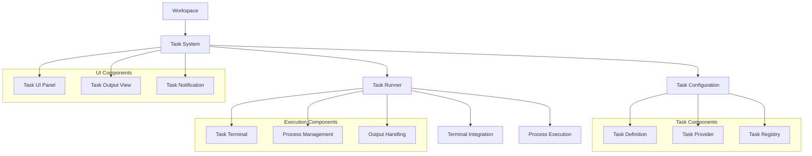
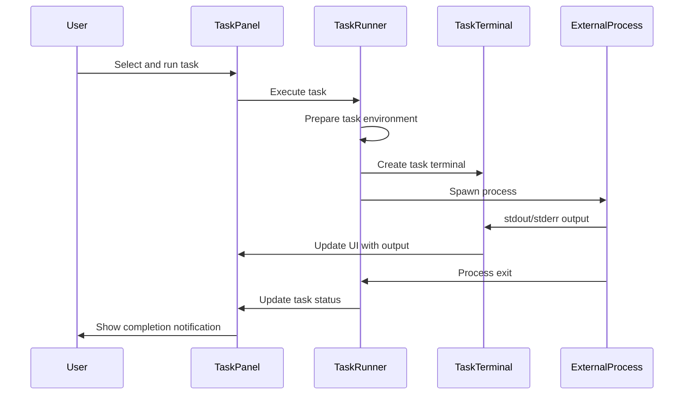
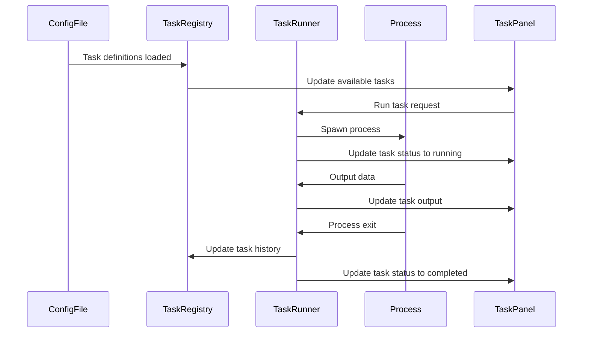

# Task System: Automation and Command Execution in Zed

## Purpose

The Task System in Zed provides a flexible framework for defining, configuring, and executing external commands and processes from within the editor. This system allows users to run build tasks, test suites, deployment scripts, and other automation processes directly from Zed, with output integrated into the editor's UI. The Task System bridges the gap between editor functionality and external tooling, enabling a seamless development workflow within a single environment.

## Concepts

### Core Abstractions

1. **Task**: A defined unit of work represented by a command to run and its configuration.
2. **Task Definition**: The configuration for a task, including command, arguments, environment variables, and working directory.
3. **Task Terminal**: A terminal instance that runs a task and captures its output.
4. **Task Provider**: A component that supplies task definitions, either from configuration files or dynamically.
5. **Task Output**: The captured stdout/stderr, exit code, and status information from a running task.

### Mental Models

1. **Task Configuration Model**: Tasks are defined in configuration files (like tasks.json) or generated dynamically by task providers, with a structured schema for command, arguments, environment, and working directory.

2. **Task Execution Lifecycle**:
   - Configuration → Preparation → Execution → Output Capture → Termination
   - Tasks can be initiated, paused, resumed, and terminated explicitly by the user
   - Task outputs persist beyond execution for review

3. **Task Terminal Integration**: Tasks run in terminal-like environments that capture and display output in real-time, with terminal-like capabilities (scrollback, text selection).

4. **Task System Hierarchy**:
   - Global Task Configuration: Editor-wide settings
   - Project-Level Tasks: Defined for a specific project
   - Dynamic Tasks: Generated based on context (current file, language, etc.)

## Architecture

The Task System in Zed consists of several interrelated components that manage the configuration, execution, and presentation of tasks.



### Key Components

#### Task System Core

1. **Task Configuration**: Manages the loading and parsing of task definitions from various sources:
   - Configuration files (tasks.json)
   - Project-specific settings
   - Language-specific task providers
   - Default task templates

2. **Task Runner**: Responsible for executing tasks and managing their lifecycle:
   - Prepares the environment for task execution
   - Spawns processes with appropriate configurations
   - Captures and routes process output
   - Handles task termination and exit codes

3. **Task Registry**: Maintains a registry of all available tasks:
   - Tracks tasks across workspace and projects
   - Provides task discovery mechanisms
   - Handles task serialization and persistence

#### Task Execution

1. **Task Terminal**: A specialized terminal instance for running tasks:
   - Integrates with the Terminal subsystem
   - Captures and displays process output
   - Provides terminal-like interaction capabilities
   - Tracks command exit codes and execution status

2. **Process Management**: Handles the execution of external processes:
   - Creates and manages child processes
   - Sets up stdin/stdout/stderr pipes
   - Applies environment variables and working directory
   - Monitors process lifecycle events

3. **Output Handling**: Processes and routes task output:
   - Captures stdout and stderr streams
   - Parses output for actionable information (errors, warnings)
   - Integrates with editor for navigation (jumping to error locations)

#### Task UI

1. **Task Panel UI**: The main interface for interacting with tasks:
   - Lists available tasks
   - Shows running task status
   - Provides task execution controls
   - Displays execution history

2. **Task Output View**: Displays the output of running tasks:
   - Terminal-like output rendering
   - Error and warning highlighting
   - Support for hyperlinks and navigation

3. **Task Notifications**: Provides notifications for task events:
   - Task completion notifications
   - Error notifications
   - Build success/failure alerts

### Data Flow

The following sequence diagram illustrates the typical flow when a user executes a task:



### Integration Points

1. **Terminal Integration**:
   - Task terminals leverage the core terminal emulation
   - Terminal interaction capabilities are available for tasks
   - Terminal UI components are reused for task output

2. **Project System**:
   - Tasks are associated with projects
   - Project-specific task configurations
   - Working directory settings based on project structure

3. **Editor Integration**:
   - Output parsing for navigation (jumping to error locations)
   - Task status indicators in editor UI
   - Context-aware task suggestions

4. **Settings System**:
   - Task configuration via settings
   - User customization of default tasks
   - Environment variable configuration

## Interfaces

### Task Definition Interface

```rust
#[derive(Clone, Debug, Default, Deserialize, Serialize)]
pub struct TaskDefinition {
    /// The name of the task
    pub name: String,
    
    /// The command to run
    pub command: String,
    
    /// The working directory for the command
    #[serde(default)]
    pub working_directory: Option<String>,
    
    /// Arguments to pass to the command
    #[serde(default)]
    pub args: Vec<String>,
    
    /// Environment variables to set for the command
    #[serde(default)]
    pub env: HashMap<String, String>,
    
    /// Whether the task should be run in a shell
    #[serde(default)]
    pub shell: bool,
    
    /// Additional configuration for specific task types
    #[serde(default)]
    pub options: TaskOptions,
}

#[derive(Clone, Debug, Default, Deserialize, Serialize)]
pub struct TaskOptions {
    /// Whether to reveal the task output when it's executed
    #[serde(default)]
    pub reveal: TaskRevealKind,
    
    /// How to handle previous instances when a task is rerun
    #[serde(default)]
    pub clear_previous_output: bool,
    
    /// Pattern for parsing errors in the output
    #[serde(default)]
    pub problem_matchers: Vec<String>,
}

#[derive(Clone, Copy, Debug, Deserialize, Serialize, PartialEq, Eq)]
pub enum TaskRevealKind {
    Always,
    Silent,
    Never,
}
```

### Task Runner Interface

```rust
pub trait TaskRunner: 'static {
    /// Run a task with the given configuration
    fn run_task(
        &self,
        task: TaskDefinition,
        workspace: WeakEntity<Workspace>,
        cx: &mut AppContext,
    ) -> Task<Result<TaskHandle>>;
    
    /// Get all running tasks
    fn running_tasks(&self) -> Vec<TaskHandle>;
    
    /// Get a task by ID
    fn task_with_id(&self, id: TaskId) -> Option<TaskHandle>;
    
    /// Stop a running task
    fn stop_task(&self, id: TaskId) -> Task<Result<()>>;
    
    /// Restart a task
    fn restart_task(&self, id: TaskId) -> Task<Result<TaskHandle>>;
}

pub trait TaskProvider: 'static {
    /// Get tasks available for the current context
    fn tasks(&self, workspace: &Workspace, cx: &AppContext) -> Vec<TaskDefinition>;
    
    /// Get a specific task by name
    fn task_by_name(&self, name: &str, workspace: &Workspace, cx: &AppContext) -> Option<TaskDefinition>;
}

#[derive(Clone, Debug, PartialEq, Eq, Hash)]
pub struct TaskId(Uuid);

#[derive(Clone)]
pub struct TaskHandle {
    pub id: TaskId,
    pub definition: TaskDefinition,
    pub status: TaskStatus,
    pub output: TaskOutput,
    pub terminal: Option<Entity<TaskTerminal>>,
}

#[derive(Clone, Copy, Debug, PartialEq, Eq)]
pub enum TaskStatus {
    Pending,
    Running,
    Success,
    Failure(i32),  // Exit code
    Terminated,
}

#[derive(Clone, Default)]
pub struct TaskOutput {
    pub stdout: String,
    pub stderr: String,
}
```

### Task UI Interfaces

```rust
impl TasksPanel {
    /// Create a new tasks panel
    pub fn new(workspace: WeakEntity<Workspace>, cx: &mut Context) -> Self;
    
    /// Display the tasks panel
    pub fn show(&mut self, cx: &mut Context);
    
    /// Hide the tasks panel
    pub fn hide(&mut self, cx: &mut Context);
    
    /// Run a task by name
    pub fn run_task_by_name(&mut self, name: &str, cx: &mut Context) -> Result<TaskHandle>;
    
    /// Stop a running task
    pub fn stop_task(&mut self, id: TaskId, cx: &mut Context) -> Result<()>;
    
    /// Clear all task outputs
    pub fn clear_all_outputs(&mut self, cx: &mut Context);
}

impl TaskTerminal {
    /// Create a new task terminal
    pub fn new(
        task_id: TaskId,
        definition: TaskDefinition,
        cx: &mut Context,
    ) -> Self;
    
    /// Write output to the terminal
    pub fn write(&mut self, data: &[u8], cx: &mut Context);
    
    /// Set the terminal's exit code
    pub fn set_exit_code(&mut self, code: i32, cx: &mut Context);
    
    /// Clear the terminal's output
    pub fn clear(&mut self, cx: &mut Context);
}
```

## State Management

### Task State

The Task System maintains several types of state:

1. **Task Configuration State**:
   - Available task definitions
   - User-defined tasks
   - Default tasks
   - Recent tasks

2. **Task Execution State**:
   - Currently running tasks
   - Completed tasks
   - Task execution history
   - Task output buffers

3. **Task UI State**:
   - Panel visibility
   - Selected task
   - Output scroll position
   - Terminal instance state

### State Updates

Task state is updated through these mechanisms:

1. **Configuration Changes**:
   - Task definition files changes
   - User settings changes
   - Project changes

2. **Execution Events**:
   - Task start/stop events
   - Process output events
   - Exit code/completion events

3. **UI Interactions**:
   - Task selection
   - Panel open/close
   - Task execution through UI
   - Terminal interactions

### Data Flow for State Updates



## Swift Considerations

When reimplementing the Task System in Swift, consider the following:

1. **Process Execution**:
   - Use `Process` class for external command execution
   - Leverage Swift concurrency with async/await for process management
   - Use `FileHandle` for non-blocking I/O with process streams

2. **Terminal Emulation**:
   - Consider SwiftTerm or similar libraries for terminal emulation
   - Implement custom terminal UI components with Metal rendering
   - Support ANSI escape sequences for colored output

3. **Configuration Management**:
   - Use Codable for task definition serialization
   - Property wrappers for configuration binding
   - FileMonitor for configuration file changes

4. **UI Implementation**:
   - Custom UI components for task listing and output
   - Combine framework for reactive UI updates
   - SwiftUI for declarative UI definition

### Swift Interface Example

```swift
// Task definition
struct TaskDefinition: Codable, Identifiable {
    let id: UUID
    var name: String
    var command: String
    var workingDirectory: String?
    var args: [String]
    var env: [String: String]
    var shell: Bool
    var options: TaskOptions
}

struct TaskOptions: Codable {
    var reveal: TaskRevealKind
    var clearPreviousOutput: Bool
    var problemMatchers: [String]
}

enum TaskRevealKind: String, Codable {
    case always, silent, never
}

// Task runner protocol
protocol TaskRunnerProtocol: AnyObject {
    func runTask(task: TaskDefinition) async throws -> TaskHandle
    func runningTasks() -> [TaskHandle]
    func task(withId id: UUID) -> TaskHandle?
    func stopTask(id: UUID) async throws
    func restartTask(id: UUID) async throws -> TaskHandle
}

// Task provider protocol
protocol TaskProviderProtocol {
    func tasks(for workspace: Workspace) -> [TaskDefinition]
    func task(named name: String, in workspace: Workspace) -> TaskDefinition?
}

// Task system implementation
class TaskSystem: TaskRunnerProtocol {
    private let taskRegistry: TaskRegistry
    private let processManager: ProcessManager
    
    init(taskRegistry: TaskRegistry, processManager: ProcessManager) {
        self.taskRegistry = taskRegistry
        self.processManager = processManager
    }
    
    func runTask(task: TaskDefinition) async throws -> TaskHandle {
        // Implementation details
    }
    
    // Other protocol methods
}

// Task panel view
struct TaskPanelView: View {
    @StateObject var viewModel: TaskPanelViewModel
    
    var body: some View {
        VStack {
            // Task list
            List(viewModel.tasks) { task in
                TaskRowView(task: task)
                    .onTapGesture {
                        viewModel.selectTask(task)
                    }
            }
            
            // Selected task output
            if let selectedTask = viewModel.selectedTask {
                TaskOutputView(taskHandle: selectedTask)
            }
            
            // Control buttons
            HStack {
                Button("Run") {
                    viewModel.runSelectedTask()
                }
                .disabled(viewModel.selectedTask == nil)
                
                Button("Stop") {
                    viewModel.stopSelectedTask()
                }
                .disabled(viewModel.selectedTask?.status != .running)
                
                Button("Clear All") {
                    viewModel.clearAllOutputs()
                }
            }
        }
    }
}
```

## Subsystem Interactions

### Terminal System

The Task System leverages the Terminal system for:

- Terminal emulation for task output
- Command execution environment
- Shell integration
- Input/output handling

### Project System

The Task System integrates with the Project system for:

- Project-specific task configurations
- Working directory resolution
- Project-relative paths
- Multi-project workspaces

### Settings System

The Task System interfaces with the Settings system for:

- User-defined task configurations
- Default task preferences
- Environment variable settings
- Task behavior customization

### Command System

The Task System registers with the Command system for:

- Task execution commands
- Keyboard shortcuts
- Command palette integration
- Context menu options

## Implementation Patterns

### Task Configuration Loading

Tasks are typically loaded from configuration files and settings:

```rust
fn load_tasks_from_config(config_path: &Path) -> Result<Vec<TaskDefinition>> {
    let config_content = fs::read_to_string(config_path)?;
    let config: TaskConfigFile = serde_json::from_str(&config_content)?;
    
    let mut tasks = Vec::new();
    for (name, task) in config.tasks {
        let mut task_def = TaskDefinition::from(task);
        task_def.name = name;
        tasks.push(task_def);
    }
    
    Ok(tasks)
}
```

### Task Execution

Tasks are executed by spawning processes with the appropriate configuration:

```rust
fn execute_task(&self, task: TaskDefinition) -> Result<TaskHandle> {
    let task_id = TaskId::new();
    let terminal = self.create_terminal(task_id, &task)?;
    
    let mut command = Command::new(&task.command);
    command.args(&task.args);
    
    if let Some(dir) = &task.working_directory {
        command.current_dir(dir);
    }
    
    for (key, value) in &task.env {
        command.env(key, value);
    }
    
    let mut process = command.spawn()?;
    
    // Set up output handling
    let stdout_handle = process.stdout.take().unwrap();
    let stderr_handle = process.stderr.take().unwrap();
    
    // Spawn output reading tasks
    self.spawn_output_reader(stdout_handle, terminal.clone(), OutputType::Stdout);
    self.spawn_output_reader(stderr_handle, terminal.clone(), OutputType::Stderr);
    
    // Spawn process monitoring task
    self.spawn_process_monitor(process, task_id, terminal.clone());
    
    let handle = TaskHandle {
        id: task_id,
        definition: task,
        status: TaskStatus::Running,
        output: TaskOutput::default(),
        terminal: Some(terminal),
    };
    
    self.running_tasks.lock().insert(task_id, handle.clone());
    
    Ok(handle)
}
```

### Task Output Handling

Task output is captured and processed:

```rust
fn spawn_output_reader(&self, handle: ChildStdout, terminal: Entity<TaskTerminal>, output_type: OutputType) {
    self.executor.spawn(async move {
        let reader = BufReader::new(handle);
        let mut lines = reader.lines();
        
        while let Some(line) = lines.next().await {
            if let Ok(line) = line {
                terminal.update(|term, cx| {
                    match output_type {
                        OutputType::Stdout => {
                            term.write_stdout(line, cx);
                        }
                        OutputType::Stderr => {
                            term.write_stderr(line, cx);
                        }
                    }
                })?;
            }
        }
        
        Ok(())
    }).detach();
}
```

### Task Status Monitoring

Task completion and exit codes are monitored:

```rust
fn spawn_process_monitor(&self, mut process: Child, task_id: TaskId, terminal: Entity<TaskTerminal>) {
    self.executor.spawn(async move {
        let exit_status = process.wait().await?;
        let exit_code = exit_status.code().unwrap_or(-1);
        
        terminal.update(|term, cx| {
            term.set_exit_code(exit_code, cx);
        })?;
        
        self.running_tasks.lock().remove(&task_id);
        
        let status = if exit_code == 0 {
            TaskStatus::Success
        } else {
            TaskStatus::Failure(exit_code)
        };
        
        self.task_completed(task_id, status);
        
        Ok(())
    }).detach();
}
```

## Conclusion

The Task System in Zed provides a flexible and powerful framework for executing external commands and processes within the editor environment. It bridges the gap between editing code and running builds, tests, and other development tasks, creating a more integrated development experience. When reimplementing in Swift, focus on leveraging Swift's concurrency model and native process APIs while maintaining the clear separation between task configuration, execution, and presentation.

## Related Subsystems

- [Terminal Integration](08_StratosphericView_TerminalIntegration.md): Provides the foundation for running and displaying task outputs
- [Project Management](05_StratosphericView_ProjectManagement.md): Integrates with tasks for project-specific execution contexts
- [Settings System](10_StratosphericView_Settings.md): Handles task configuration and preferences
- [Command System](11_StratosphericView_CommandSystem.md): Enables task execution via commands and shortcuts