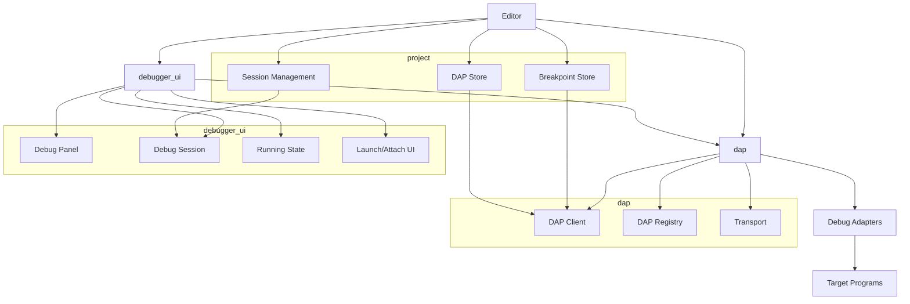
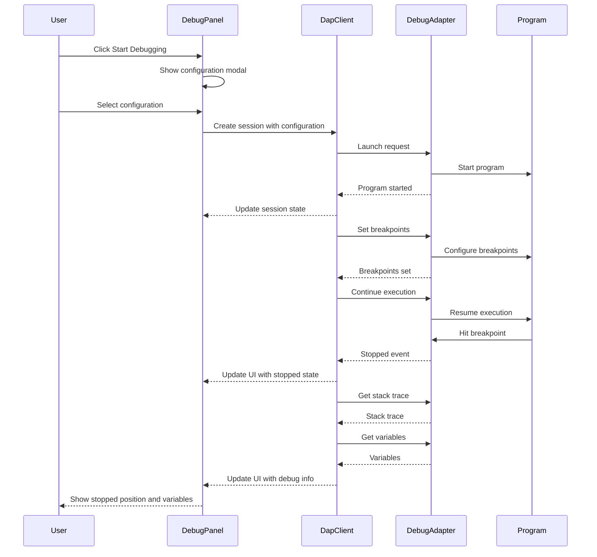
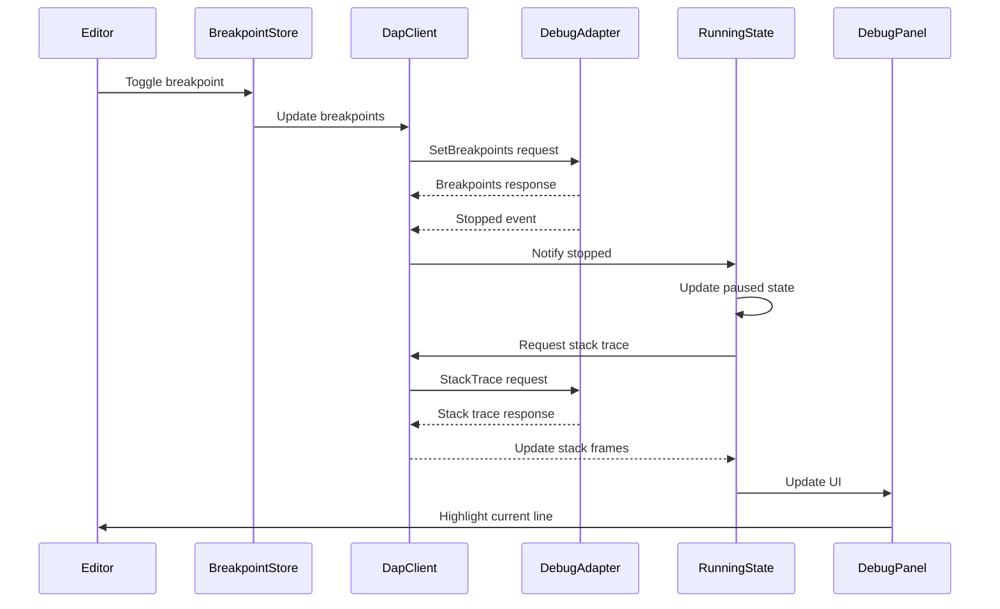

# Debug Support: Debugging Applications in Zed

## Purpose

The Debug Support system in Zed provides integrated debugging capabilities directly within the editor. It enables users to launch programs, set breakpoints, inspect variables, evaluate expressions, and control execution flow without switching to external debuggers. The system follows the Debug Adapter Protocol (DAP) standard, allowing it to support a wide range of languages and runtime environments through a uniform interface. This integration streamlines the development workflow by keeping coding and debugging activities within the same environment.

## Concepts

### Core Abstractions

1. **Debug Adapter**: An external tool that implements the Debug Adapter Protocol and communicates with the debugger for a specific language or runtime.
2. **Debug Session**: Represents a single debugging session with a running program.
3. **Breakpoint**: A marker in the code where execution will pause, allowing inspection of the program state.
4. **Stack Frame**: A representation of a function call in the call stack, including local variables and context.
5. **Variable**: A program variable that can be inspected during debugging.
6. **Expression Evaluation**: The ability to execute expressions in the context of the paused program.
7. **Launch/Attach Configuration**: Parameters that define how to start or connect to a program for debugging.

### Mental Models

1. **Debug Session Lifecycle**:
   - Configuration → Launch/Attach → Running/Paused → Termination
   - Sessions can be started, paused, continued, and stopped
   - Sessions maintain state about loaded modules, breakpoints, and variables

2. **Execution Control Flow**:
   - Programs run normally until hitting a breakpoint
   - When paused, users can examine state and step through execution
   - Step controls (into, over, out) determine how execution proceeds
   - Continue runs until the next breakpoint or termination

3. **Debug Information Model**:
   - Hierarchical view of debug information
   - Call Stack → Stack Frames → Scopes → Variables → Properties
   - Information is requested on-demand to minimize performance impact

4. **Debug Adapter Communication**:
   - Client-server protocol over stdin/stdout or sockets
   - Request/response pairs for commands
   - Events for asynchronous notifications

## Architecture

The Debug Support system in Zed is structured around the Debug Adapter Protocol (DAP) and consists of several components that work together to provide a seamless debugging experience.



### Key Components

#### Debug UI (`debugger_ui` crate)

1. **Debug Panel**: The main UI component for debugging:
   - Displays the call stack, variables, and breakpoints
   - Provides controls for execution (continue, step, pause, stop)
   - Shows debug output and console

2. **Debug Session**: Represents a specific debugging session:
   - Manages the UI state for a debugging session
   - Handles user interactions during debugging
   - Coordinates between the UI and the DAP client

3. **New Session/Attach Modal**: UI for starting debug sessions:
   - Provides configuration options for launching programs
   - Shows available attach targets
   - Creates and configures debug sessions

4. **Running State**: Tracks the state of a running debug session:
   - Maintains active threads and stack frames
   - Handles step requests and execution control
   - Updates the UI based on program state

#### DAP Support (`dap` crate)

1. **DAP Client**: Handles communication with debug adapters:
   - Sends requests to the debug adapter
   - Processes responses and events
   - Maintains session state

2. **DAP Registry**: Manages available debug adapters:
   - Discovers and registers debug adapters
   - Maps languages to appropriate adapters
   - Resolves adapter configurations

3. **Transport**: Handles the communication protocol:
   - Establishes connections to debug adapters
   - Serializes/deserializes protocol messages
   - Manages request/response correlation

#### Project Integration

1. **Breakpoint Store**: Manages breakpoints across the project:
   - Tracks breakpoint locations and conditions
   - Persists breakpoints between sessions
   - Synchronizes breakpoints with debug adapters

2. **DAP Store**: Coordinates multiple debug sessions:
   - Tracks running debug sessions
   - Manages adapter lifecycle
   - Handles session shutdown and cleanup

3. **Session Management**: Handles debug session configuration:
   - Stores launch configurations
   - Manages session creation and destruction
   - Integrates with workspace persistence

### Data Flow

The following sequence diagram illustrates the typical flow when a user starts a debug session and hits a breakpoint:



### Integration Points

1. **Editor Integration**:
   - Breakpoint markers in the editor gutter
   - Current execution point highlighting
   - Hover tooltips for variable values
   - Inline value display

2. **Terminal Integration**:
   - Console output from debugged programs
   - Interactive debug console for expression evaluation
   - Program input handling

3. **Language Intelligence**:
   - Language-specific debug adapters
   - Expression parsing and syntax highlighting
   - Symbol resolution for variables and expressions

4. **Project System**:
   - Project-specific debug configurations
   - Workspace-relative paths
   - Project-based adapter discovery

## Interfaces

### DAP Client Interface

```rust
pub struct Client {
    pub id: SessionId,
    transport: Transport,
    state: ClientState,
    event_listeners: HashMap<String, Vec<Box<dyn Fn(&Event) + Send>>>,
    request_listeners: HashMap<String, Vec<Box<dyn Fn(&Request) -> RequestResult + Send>>>,
    pending_requests: HashMap<u64, RequestResultHandler>,
    seq: Cell<u64>,
}

impl Client {
    pub fn launch(&self, config: LaunchRequestArguments) -> Task<Result<()>>;
    pub fn attach(&self, config: AttachRequestArguments) -> Task<Result<()>>;
    pub fn set_breakpoints(&self, args: SetBreakpointsArguments) -> Task<Result<SetBreakpointsResponse>>;
    pub fn configuration_done(&self) -> Task<Result<()>>;
    pub fn threads(&self) -> Task<Result<ThreadsResponse>>;
    pub fn stack_trace(&self, args: StackTraceArguments) -> Task<Result<StackTraceResponse>>;
    pub fn scopes(&self, args: ScopesArguments) -> Task<Result<ScopesResponse>>;
    pub fn variables(&self, args: VariablesArguments) -> Task<Result<VariablesResponse>>;
    pub fn continue_thread(&self, args: ContinueArguments) -> Task<Result<ContinueResponse>>;
    pub fn pause(&self, args: PauseArguments) -> Task<Result<()>>;
    pub fn next(&self, args: NextArguments) -> Task<Result<()>>;
    pub fn step_in(&self, args: StepInArguments) -> Task<Result<()>>;
    pub fn step_out(&self, args: StepOutArguments) -> Task<Result<()>>;
    pub fn evaluate(&self, args: EvaluateArguments) -> Task<Result<EvaluateResponse>>;
    pub fn terminate(&self, args: Option<TerminateArguments>) -> Task<Result<()>>;
    pub fn disconnect(&self, args: Option<DisconnectArguments>) -> Task<Result<()>>;
    pub fn register_event_handler(&mut self, event: &str, handler: Box<dyn Fn(&Event) + Send>);
}
```

### Debug Session Interface

```rust
pub struct DebugSession {
    remote_id: Option<ViewId>,
    running_state: Entity<RunningState>,
    label: OnceLock<SharedString>,
    _debug_panel: WeakEntity<DebugPanel>,
    _worktree_store: WeakEntity<WorktreeStore>,
    _workspace: WeakEntity<Workspace>,
    _subscriptions: [Subscription; 1],
}

impl DebugSession {
    pub fn running(
        project: Entity<Project>,
        workspace: WeakEntity<Workspace>,
        session: Entity<Session>,
        debug_panel: WeakEntity<DebugPanel>,
        serialized_layout: Option<SerializedLayout>,
        dock_axis: Axis,
        window: &mut Window,
        cx: &mut App,
    ) -> Entity<Self>;
    
    pub fn session_id(&self, cx: &App) -> SessionId;
    pub fn session(&self, cx: &App) -> Entity<Session>;
    pub fn shutdown(&mut self, cx: &mut Context<Self>);
    pub fn label(&self, cx: &App) -> SharedString;
    pub fn running_state(&self) -> &Entity<RunningState>;
}
```

### Running State Interface

```rust
pub struct RunningState {
    session: Entity<Session>,
    project: Entity<Project>,
    workspace: WeakEntity<Workspace>,
    selected_thread_id: Option<u64>,
    selected_stack_frame_id: Option<u64>,
    variables_ui: Entity<VariablesUi>,
    console_ui: Entity<ConsoleUi>,
    terminal_panel: Option<Entity<TerminalPanel>>,
    break_points_ui: Entity<BreakPointListUi>,
    stack_frames_ui: Option<Entity<StackFramesUi>>,
    modules_ui: Option<Entity<ModulesUi>,
    sources_ui: Option<Entity<SourcesUi>>,
    dock_views: DockViews,
    message_handler: Option<Subscription>,
    is_paused: bool,
    ignore_breakpoints: bool,
}

impl RunningState {
    pub fn pause_thread(&mut self, cx: &mut Context<Self>) -> Task<Result<()>>;
    pub fn step_in(&mut self, cx: &mut Context<Self>) -> Task<Result<()>>;
    pub fn step_over(&mut self, cx: &mut Context<Self>) -> Task<Result<()>>;
    pub fn step_out(&mut self, cx: &mut Context<Self>) -> Task<Result<()>>;
    pub fn step_back(&mut self, cx: &mut Context<Self>) -> Task<Result<()>>;
    pub fn toggle_ignore_breakpoints(&mut self, cx: &mut Context<Self>) -> Task<Result<()>>;
    pub fn restart_session(&mut self, cx: &mut Context<Self>) -> Task<Result<()>>;
    pub fn stop_thread(&mut self, cx: &mut Context<Self>) -> Task<Result<()>>;
    pub fn selected_thread_id(&self) -> Option<u64>;
    pub fn selected_stack_frame_id(&self, cx: &App) -> Option<u64>;
    pub fn session(&self) -> &Entity<Session>;
    pub fn session_id(&self) -> SessionId;
    pub fn is_paused(&self) -> bool;
}
```

### Debug Panel Interface

```rust
pub struct DebugPanel {
    active_session: Option<Entity<DebugSession>>,
    active_executor: Option<ExecutorId>,
    sessions: HashMap<SessionId, Entity<DebugSession>>,
    focus_handle: FocusHandle,
    _subscriptions: Vec<Subscription>,
}

impl DebugPanel {
    pub fn new(workspace: WeakEntity<Workspace>, cx: &mut Context) -> Self;
    pub fn sessions(&self) -> impl Iterator<Item = &Entity<DebugSession>>;
    pub fn active_session(&self) -> Option<&Entity<DebugSession>>;
    pub fn new_session(
        &mut self,
        project: Entity<Project>,
        workspace: WeakEntity<Workspace>,
        session: Entity<Session>,
        cx: &mut Context<Self>,
    );
    pub fn show_session(&mut self, session_id: SessionId, cx: &mut Context<Self>);
    pub fn remove_session(&mut self, session_id: SessionId, cx: &mut Context<Self>);
    pub fn shutdown_all(&mut self, cx: &mut Context<Self>);
}
```

## State Management

### Debug State

The Debug Support system maintains several types of state:

1. **Adapter Registry State**:
   - Available debug adapters
   - Adapter capabilities
   - Adapter configurations

2. **Session State**:
   - Running programs
   - Breakpoint locations
   - Execution status
   - Stack frames and variables

3. **UI State**:
   - Active debug session
   - Selected thread and stack frame
   - Panel visibility and focus
   - Console output and command history

### State Updates

Debug state is updated through several mechanisms:

1. **Protocol Events**:
   - Stopped events when hitting breakpoints
   - Thread and module events
   - Output events
   - Terminated events

2. **User Interactions**:
   - Setting/clearing breakpoints
   - Step commands
   - Variable inspection
   - Expression evaluation

3. **Configuration Changes**:
   - Launch configuration updates
   - Breakpoint property changes
   - Adapter settings modifications

### Data Flow for State Updates



## Swift Considerations

When reimplementing the Debug Support system in Swift, consider the following:

1. **DAP Client Implementation**:
   - Swift's built-in JSON encoding/decoding for DAP messages
   - Concurrency model with async/await for protocol communication
   - Actors for thread-safe state management
   - Swift's error handling for request failures

2. **Process Management**:
   - Use Process and ProcessInfo for launching debug adapters
   - FileHandle for stdin/stdout communication
   - Dispatch I/O channels for asynchronous communication

3. **UI Implementation**:
   - Custom Metal-rendered UI components for debug panels
   - Swift's property wrappers for reactive state management
   - Combine framework for event handling
   - SwiftUI for declarative UI definition when appropriate

4. **Editor Integration**:
   - Custom breakpoint rendering in editor gutter
   - Inline variable display
   - Current stack frame highlighting

### Swift Interface Example

```swift
// DAP client protocol
protocol DAPClientProtocol {
    func launch(config: LaunchRequestArguments) async throws
    func attach(config: AttachRequestArguments) async throws
    func setBreakpoints(args: SetBreakpointsArguments) async throws -> SetBreakpointsResponse
    func stackTrace(args: StackTraceArguments) async throws -> StackTraceResponse
    func variables(args: VariablesArguments) async throws -> VariablesResponse
    func continueThread(args: ContinueArguments) async throws -> ContinueResponse
    func pause(args: PauseArguments) async throws
    func stepIn(args: StepInArguments) async throws
    func stepOut(args: StepOutArguments) async throws
    func evaluate(args: EvaluateArguments) async throws -> EvaluateResponse
    func terminate(args: TerminateArguments?) async throws
    
    func registerEventHandler(for event: String, handler: @escaping (Event) -> Void)
}

// Debug session class
class DebugSession {
    private let client: DAPClientProtocol
    private let project: Project
    private var runningState: RunningState
    private var eventHandlers: [String: [(Event) -> Void]] = [:]
    
    init(client: DAPClientProtocol, project: Project) {
        self.client = client
        self.project = project
        self.runningState = RunningState(client: client)
        
        // Register for debug events
        client.registerEventHandler(for: "stopped") { [weak self] event in
            self?.handleStoppedEvent(event)
        }
        client.registerEventHandler(for: "terminated") { [weak self] event in
            self?.handleTerminatedEvent(event)
        }
    }
    
    func launch(config: LaunchRequestArguments) async throws {
        try await client.launch(config: config)
        try await client.setBreakpoints(args: breakpointArgs())
        try await client.configurationDone()
    }
    
    func pauseThread() async throws {
        guard let threadId = runningState.selectedThreadId else { return }
        try await client.pause(args: PauseArguments(threadId: threadId))
    }
    
    func stepIn() async throws {
        guard let threadId = runningState.selectedThreadId else { return }
        try await client.stepIn(args: StepInArguments(threadId: threadId))
    }
    
    func stepOver() async throws {
        guard let threadId = runningState.selectedThreadId else { return }
        try await client.next(args: NextArguments(threadId: threadId))
    }
    
    private func handleStoppedEvent(_ event: Event) {
        Task {
            guard let body = event.body as? StoppedEventBody else { return }
            runningState.isPaused = true
            runningState.selectedThreadId = body.threadId
            
            // Request stack trace and variables
            if let threadId = body.threadId {
                let stackTraceArgs = StackTraceArguments(threadId: threadId)
                let response = try await client.stackTrace(args: stackTraceArgs)
                runningState.stackFrames = response.stackFrames
                
                // Update UI with new stack frames
                NotificationCenter.default.post(name: .debugSessionUpdated, object: self)
            }
        }
    }
}

// Debug panel view
struct DebugPanelView: View {
    @StateObject var viewModel: DebugPanelViewModel
    
    var body: some View {
        VStack {
            // Toolbar with debug actions
            HStack {
                Button(action: { viewModel.continue() }) {
                    Image(systemName: "play.fill")
                }
                .disabled(!viewModel.isPaused)
                
                Button(action: { viewModel.pause() }) {
                    Image(systemName: "pause.fill")
                }
                .disabled(viewModel.isPaused)
                
                Button(action: { viewModel.stepOver() }) {
                    Image(systemName: "arrow.right")
                }
                .disabled(!viewModel.isPaused)
                
                Button(action: { viewModel.stepIn() }) {
                    Image(systemName: "arrow.down")
                }
                .disabled(!viewModel.isPaused)
                
                Button(action: { viewModel.stepOut() }) {
                    Image(systemName: "arrow.up")
                }
                .disabled(!viewModel.isPaused)
                
                Button(action: { viewModel.stop() }) {
                    Image(systemName: "stop.fill")
                }
            }
            
            TabView(selection: $viewModel.selectedTab) {
                StackFrameView(stackFrames: viewModel.stackFrames)
                    .tabItem { Text("Call Stack") }
                    .tag("stack")
                
                VariablesView(variables: viewModel.variables)
                    .tabItem { Text("Variables") }
                    .tag("variables")
                
                BreakpointsView(breakpoints: viewModel.breakpoints)
                    .tabItem { Text("Breakpoints") }
                    .tag("breakpoints")
                
                ConsoleView(output: viewModel.consoleOutput)
                    .tabItem { Text("Console") }
                    .tag("console")
            }
        }
    }
}
```

## Subsystem Interactions

### Terminal System

The Debug Support system integrates with the Terminal system for:

- Running debug adapters as child processes
- Capturing program output
- Providing a debug console for expression evaluation
- Terminal-based UI for some debug adapters

### Editor System

The Debug Support system enhances the Editor with:

- Breakpoint markers in the gutter
- Current execution point highlighting
- Inline variable display
- Go-to-definition for variables
- Run-to-cursor functionality

### Project System

The Debug Support system integrates with the Project system for:

- Project-specific debug configurations
- Workspace-relative paths for breakpoints
- Language detection for appropriate debug adapters
- Project-specific settings for debugging

### Language Intelligence System

The Debug Support system leverages the Language Intelligence system for:

- Language-specific debug adapters
- Expression parsing and evaluation
- Symbol resolution for variables
- Source mapping for compiled languages

## Implementation Patterns

### Debug Adapter Management

Debug adapters are managed by the DAP Registry, which maps languages to appropriate adapters:

```rust
impl DapRegistry {
    pub fn adapter_for_language(&self, language_id: &str) -> Option<DapLocator> {
        self.adapters
            .iter()
            .find(|locator| locator.languages.contains(&language_id.to_string()))
            .cloned()
    }

    pub fn register_adapter(&mut self, adapter: DapLocator) {
        self.adapters.push(adapter);
    }
}
```

### DAP Communication

Communication with debug adapters follows the DAP protocol specification:

```rust
pub async fn send_request<R: DeserializeOwned, A: Serialize>(
    &self,
    command: &str,
    args: Option<A>,
) -> Result<R> {
    let request_seq = self.seq.get();
    self.seq.set(request_seq + 1);

    let request = Request {
        seq: request_seq,
        type_: "request".to_string(),
        command: command.to_string(),
        arguments: args.map(|a| serde_json::to_value(a).unwrap()),
    };

    let (sender, receiver) = oneshot::channel();
    self.pending_requests.lock().insert(
        request_seq,
        Box::new(move |result| {
            let _ = sender.send(result);
        }),
    );

    let json = serde_json::to_string(&request)?;
    self.transport.send_message(&json).await?;

    let result = receiver.await?;
    result.map(|value| serde_json::from_value(value)?)
}
```

### Breakpoint Management

Breakpoints are managed by the Breakpoint Store, which tracks breakpoints across files:

```rust
impl BreakpointStore {
    pub fn toggle_breakpoint(
        &mut self,
        path: PathBuf,
        row: usize,
        cx: &mut Context<Self>,
    ) -> Option<SourceBreakpoint> {
        let key = BreakpointKey { path: path.clone(), row };

        if let Some(index) = self.find_breakpoint_index(&key) {
            let removed = self.breakpoints.swap_remove(index);
            cx.notify();
            self.emit(BreakpointStoreEvent::Removed(removed));
            None
        } else {
            let breakpoint = SourceBreakpoint {
                path,
                row,
                message: None,
                condition: None,
                hit_condition: None,
                state: BreakpointState::Enabled,
            };

            self.breakpoints.push(breakpoint.clone());
            cx.notify();
            self.emit(BreakpointStoreEvent::Added(breakpoint.clone()));
            Some(breakpoint)
        }
    }
}
```

### Debug UI Components

Debug UI components are implemented using GPUI's component system:

```rust
impl Render for DebugPanel {
    fn render(&mut self, cx: &mut ViewContext<Self>) -> impl IntoElement {
        v_flex()
            .key_focus(true)
            .id("debug-panel")
            .size_full()
            .on_action(cx.listener(|this, _: &ToggleFocus, _cx| {
                this.focus_handle.focus_self()
            }))
            .child(if let Some(active_session) = self.active_session.as_ref() {
                active_session.read(cx).running_state().read(cx).render(cx)
            } else {
                v_flex()
                    .size_full()
                    .justify_center()
                    .items_center()
                    .gap_2()
                    .child(Indicator::render_loading())
                    .child(Label::new("No active debug session"))
                    .into_any_element()
            })
    }
}
```

### Debug Session State Management

Debug session state is managed through events and state updates:

```rust
fn handle_stopped_event(&mut self, event: &Event, cx: &mut Context<Self>) {
    if let Some(body) = event.body.as_ref() {
        if let Some(thread_id) = body.get("threadId").and_then(|v| v.as_u64()) {
            self.selected_thread_id = Some(thread_id);
            self.is_paused = true;
            
            // Update stack frames
            self.update_stack_frames(thread_id, cx);
            
            // Update variables if we have a stack frame
            if let Some(stack_frame_id) = self.selected_stack_frame_id {
                self.update_variables(stack_frame_id, cx);
            }
            
            cx.notify();
        }
    }
}
```

## Conclusion

The Debug Support system in Zed provides a comprehensive debugging experience directly within the editor. By leveraging the Debug Adapter Protocol, it supports a wide range of languages and runtimes through a uniform interface. The system's integration with the editor, terminal, and project components creates a seamless debugging workflow that enhances productivity by keeping development and debugging activities within the same environment. When reimplementing this system in Swift, focus on maintaining the clean separation between protocol handling, state management, and UI components, while leveraging Swift's concurrency model and type system for a more robust implementation.

## Related Subsystems

- [Editor Core](03_StratosphericView_TextEditorCore.md): Provides the editor interface for breakpoints and execution highlighting
- [Terminal Integration](08_StratosphericView_TerminalIntegration.md): Supplies terminal capabilities for program I/O and debug console
- [Task System](19_AtmosphericView_TaskSystem.md): Complementary system for running build and test tasks
- [Language Intelligence](04_StratosphericView_LanguageIntelligence.md): Provides language-specific features for debugging