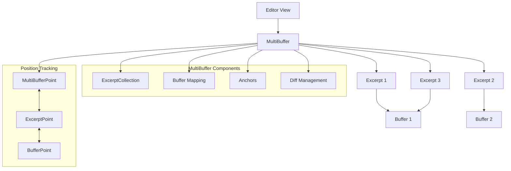
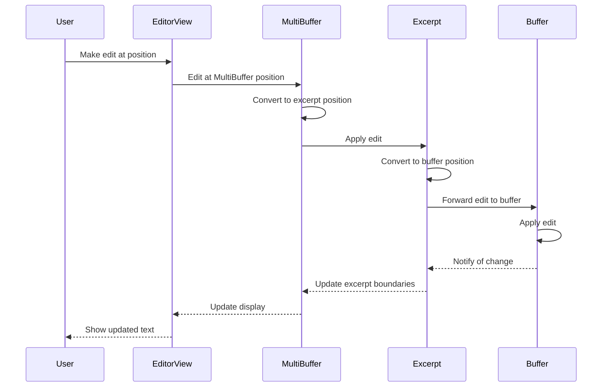
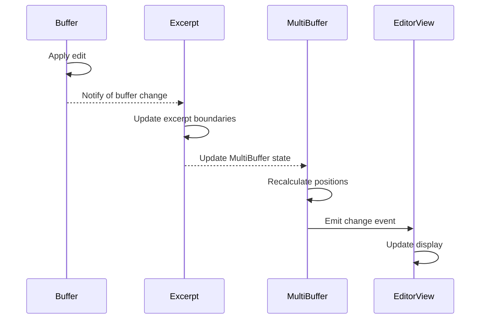

# MultiBuffer: Multiple Buffer Editing in Zed

## Purpose

The MultiBuffer system in Zed enables the simultaneous editing of multiple text buffers within a single editor view. This feature allows users to work with excerpts from different files in a unified context, facilitating tasks like code reviews, comparison of related code segments, and aggregation of information from multiple sources. MultiBuffer enables a more flexible and powerful editing experience by breaking free from the traditional one-file-per-editor paradigm, allowing developers to organize their workspace in ways that match their mental models rather than file system organization.

## Concepts

### Core Abstractions

1. **MultiBuffer**: A collection of excerpts from one or more text buffers that can be edited together in a single view.

2. **Excerpt**: A contiguous region of text from a specific buffer, defined by a start and end anchor, that appears within a MultiBuffer.

3. **Anchor**: A position marker in a buffer that maintains its logical position as the text changes, allowing excerpts to adapt to edits.

4. **ExcerptId**: A unique identifier for an excerpt within a MultiBuffer.

5. **PathKey**: A reference to the file path associated with a buffer, used to organize excerpts by their source.

6. **DiffHunk**: A representation of changes between versions of text, used to visualize differences within excerpts.

### Mental Models

1. **Composite Document Model**: MultiBuffer presents multiple text segments as a unified document with consistent navigation, editing, and visualization capabilities, though the segments may originate from different files.

2. **Anchor-Based Position Tracking**: Positions within excerpts are tracked using anchors that move with the text as it's edited, ensuring stable references even as content changes.

3. **Hierarchical Organization**: Excerpts are organized in a sequential order within the MultiBuffer, but maintain their association with their source buffers, creating a two-level hierarchy of content.

4. **Shared Edit Context**: Changes made within a MultiBuffer are reflected in the underlying buffers, ensuring consistency between different views of the same content.

## Architecture

The MultiBuffer system in Zed is structured around the core concept of managing multiple excerpts from different text buffers while maintaining consistent editing capabilities.



### Key Components

#### MultiBuffer Core

1. **Excerpt Collection**: Manages the set of excerpts displayed in the MultiBuffer.
   - Stores excerpts in a sequential order
   - Maintains the mapping between excerpts and their source buffers
   - Handles the insertion, removal, and reordering of excerpts

2. **Buffer Management**: Coordinates with the underlying buffer system.
   - Tracks the state of all buffers involved in the MultiBuffer
   - Forwards edits from the MultiBuffer to the appropriate buffer
   - Synchronizes buffer changes back to the MultiBuffer view

3. **Anchor System**: Tracks positions within excerpts as text changes.
   - Maps between MultiBuffer positions and buffer positions
   - Ensures stable references to text positions during edits
   - Handles excerpt boundaries maintenance

4. **Diff Visualization**: Shows differences between versions of text.
   - Displays changes between the current state and a base version
   - Highlights additions, deletions, and modifications
   - Provides interactive controls for navigating differences

#### Position Tracking

1. **MultiBuffer Points**: Coordinates within the unified MultiBuffer view.
   - Represents absolute positions within the MultiBuffer
   - Includes both row and column information
   - Serves as the primary reference for user interactions

2. **Excerpt Points**: Coordinates relative to a specific excerpt.
   - Tracks positions within individual excerpts
   - Maps to corresponding buffer positions
   - Maintains logical position during edits

3. **Buffer Points**: Coordinates within the original buffers.
   - Represents positions in the underlying buffer
   - Used to propagate edits to the buffer
   - Ensures consistency with other views of the same buffer

#### Editor Integration

1. **Display Mapping**: Renders the MultiBuffer in the editor view.
   - Converts MultiBuffer positions to screen coordinates
   - Handles visual indicators for excerpt boundaries
   - Manages scroll positions and viewport

2. **Selection Management**: Handles text selection across excerpts.
   - Allows selections to span multiple excerpts
   - Maintains selections during buffer changes
   - Provides operations that work seamlessly across excerpt boundaries

3. **Edit Propagation**: Ensures changes are correctly applied.
   - Forwards edits to the appropriate buffers
   - Updates the MultiBuffer view to reflect changes
   - Maintains consistency between different views

### Data Flow

The following sequence diagram illustrates how edits flow through the MultiBuffer system:



### Integration Points

1. **Editor Integration**:
   - MultiBuffer serves as the document model for the editor
   - Editor components visualize MultiBuffer content
   - User interactions are translated to MultiBuffer operations

2. **Buffer System**:
   - MultiBuffer coordinates with the underlying Buffer system
   - Changes in buffers are reflected in the MultiBuffer
   - Edits in the MultiBuffer are propagated to buffers

3. **File System**:
   - MultiBuffer tracks file associations of its buffers
   - File operations affect the MultiBuffer's structure
   - Saving changes affects the underlying files

4. **Language Services**:
   - Language features (syntax highlighting, code completion, etc.) are applied per excerpt
   - MultiBuffer coordinates with language services to provide context-appropriate features
   - Diagnostics and other language information are displayed in the context of the MultiBuffer

## Interfaces

### MultiBuffer Interface

```rust
pub struct MultiBuffer {
    snapshot: RefCell<MultiBufferSnapshot>,
    buffers: RefCell<HashMap<BufferId, BufferState>>,
    excerpts_by_path: BTreeMap<PathKey, Vec<ExcerptId>>,
    paths_by_excerpt: HashMap<ExcerptId, PathKey>,
    diffs: HashMap<BufferId, DiffState>,
    subscriptions: Topic,
    singleton: bool,
    history: History,
    title: Option<String>,
    capability: Capability,
    buffer_changed_since_sync: Rc<Cell<bool>>,
}

impl MultiBuffer {
    pub fn new(buffer: Entity<Buffer>, cx: &mut App) -> Self;
    pub fn new_empty(capability: Capability) -> Self;
    
    // Excerpt management
    pub fn excerpts(&self) -> Vec<ExcerptId>;
    pub fn excerpt(&self, id: ExcerptId) -> Option<&Excerpt>;
    pub fn excerpt_at_offset(&self, offset: usize) -> Option<(ExcerptId, &Excerpt)>;
    pub fn add_excerpts(&mut self, buffer: Entity<Buffer>, ranges: Vec<Range<language::Anchor>>, predecessor: Option<ExcerptId>, cx: &mut App) -> Vec<ExcerptId>;
    pub fn remove_excerpts(&mut self, ids: Vec<ExcerptId>, cx: &mut App) -> Result<()>;
    
    // Buffer management
    pub fn buffer_for_excerpt(&self, excerpt_id: ExcerptId) -> Option<Entity<Buffer>>;
    pub fn buffers(&self) -> HashSet<Entity<Buffer>>;
    
    // Position conversion
    pub fn anchor_in_excerpt(&self, excerpt_id: ExcerptId, offset: usize) -> Option<Anchor>;
    pub fn excerpt_containing_anchor(&self, anchor: &Anchor) -> Option<ExcerptId>;
    pub fn point_to_offset(&self, point: MultiBufferPoint) -> Result<usize>;
    pub fn offset_to_point(&self, offset: usize) -> Result<MultiBufferPoint>;
    
    // Content access
    pub fn text(&self) -> String;
    pub fn text_for_range(&self, range: Range<Anchor>) -> Result<String>;
    pub fn line(&self, row: u32) -> Result<&str>;
    
    // Editing
    pub fn edit(&mut self, edits: &[(Range<Anchor>, &str)], cx: &mut App) -> Result<()>;
    pub fn start_transaction(&mut self) -> Transaction;
    
    // Events
    pub fn subscribe<F>(&self, callback: F) -> Subscription
    where
        F: Fn(&Event, &mut App) + 'static;
}
```

### Excerpt Interface

```rust
#[derive(Clone, Debug)]
pub struct Excerpt {
    id: ExcerptId,
    buffer_id: BufferId,
    range: ExcerptRange<language::Anchor>,
    max_point: Point,
    text_summary: TextSummary,
}

impl Excerpt {
    pub fn id(&self) -> ExcerptId;
    pub fn buffer_id(&self) -> BufferId;
    pub fn start(&self) -> language::Anchor;
    pub fn end(&self) -> language::Anchor;
    pub fn range(&self) -> &ExcerptRange<language::Anchor>;
    pub fn max_point(&self) -> Point;
    pub fn text_summary(&self) -> &TextSummary;
    pub fn contains_buffer_row(&self, row: u32) -> bool;
    pub fn excerpt_point_for_buffer_point(&self, buffer_point: Point) -> Result<ExcerptPoint>;
    pub fn buffer_point_for_excerpt_point(&self, excerpt_point: ExcerptPoint) -> Result<Point>;
}
```

### Anchor Interface

```rust
#[derive(Clone, Copy, Debug, PartialEq, Eq, PartialOrd, Ord)]
pub struct Anchor {
    excerpt_id: ExcerptId,
    buffer_id: BufferId,
    buffer_anchor: language::Anchor,
}

impl Anchor {
    pub fn in_buffer(excerpt_id: ExcerptId, buffer_id: BufferId, buffer_anchor: language::Anchor) -> Self;
    pub fn excerpt_id(&self) -> ExcerptId;
    pub fn buffer_id(&self) -> BufferId;
    pub fn buffer_anchor(&self) -> language::Anchor;
}
```

### Event System

```rust
#[derive(Clone, Debug, PartialEq, Eq)]
pub enum Event {
    ExcerptsAdded {
        buffer: Entity<Buffer>,
        predecessor: ExcerptId,
        excerpts: Vec<(ExcerptId, ExcerptRange<language::Anchor>)>,
    },
    ExcerptsRemoved {
        ids: Vec<ExcerptId>,
        removed_buffer_ids: Vec<BufferId>,
    },
    ExcerptsExpanded {
        ids: Vec<ExcerptId>,
    },
    ExcerptsEdited {
        excerpt_ids: Vec<ExcerptId>,
        buffer_ids: Vec<BufferId>,
    },
    DiffHunksToggled,
    Edited {
        singleton_buffer_edited: bool,
        edited_buffer: Option<Entity<Buffer>>,
    },
    // ...other events
}
```

## State Management

### MultiBuffer State

The MultiBuffer system maintains several types of state:

1. **Structural State**:
   - The collection of excerpts and their order
   - The mapping between excerpts and buffers
   - Excerpt boundaries and dimensions

2. **Content State**:
   - The text content of each buffer
   - The displayed portions of each buffer
   - Diff information for change visualization

3. **UI State**:
   - Scroll position and viewport
   - Active selections
   - Visual decorations (syntax highlighting, diff markers, etc.)

### State Updates

MultiBuffer state is updated through several mechanisms:

1. **User Edits**:
   - Direct text modifications by the user
   - Structure changes (adding/removing excerpts)
   - Navigation and selection changes

2. **Buffer Changes**:
   - External modifications to buffers
   - File system changes
   - Collaborative edits

3. **View Updates**:
   - Scroll position changes
   - Viewport resizing
   - Visual preference updates

### Data Flow for State Updates

When a buffer changes, the changes flow through the system as follows:



## Swift Considerations

When reimplementing the MultiBuffer system in Swift, consider the following:

1. **Buffer and Text Representation**:
   - Swift's String and String.Index system for text representation
   - Custom rope or piece table implementation for efficient text handling
   - Strong typing for different coordinate systems (buffer vs. excerpt vs. display)

2. **Position Tracking**:
   - Implementation of stable anchor points that adapt to text changes
   - Efficient mapping between different coordinate systems
   - Handling of UTF-16 code units for compatibility with text input systems

3. **Data Structure Design**:
   - Swift's value semantics for immutable state representation
   - Actor model for thread-safe state management
   - Efficient tree structures for excerpt organization

4. **UI Integration**:
   - Metal-based text rendering for performance
   - Custom text layout system for multi-buffer visualization
   - Gesture handling for cross-excerpt operations

### Swift Interface Example

```swift
// MultiBuffer class
class MultiBuffer {
    // Core properties
    private var excerpts: [ExcerptId: Excerpt]
    private var orderedExcerptIds: [ExcerptId]
    private var buffers: [BufferId: Buffer]
    private var excerptsByPath: [PathKey: [ExcerptId]]
    
    // State management
    private let changeSubject = PassthroughSubject<MultiBufferEvent, Never>()
    
    // Initialization
    init(buffer: Buffer) {
        // Initialize with a single buffer as the only excerpt
    }
    
    init() {
        // Initialize with an empty multi-buffer
    }
    
    // Excerpt management
    func addExcerpts(from buffer: Buffer, ranges: [Range<BufferAnchor>], after predecessorId: ExcerptId?) -> [ExcerptId] {
        // Add new excerpts to the multi-buffer
    }
    
    func removeExcerpts(_ ids: [ExcerptId]) throws {
        // Remove excerpts from the multi-buffer
    }
    
    // Position conversion
    func pointToOffset(_ point: MultiBufferPoint) throws -> Int {
        // Convert a point to an absolute offset
    }
    
    func offsetToPoint(_ offset: Int) throws -> MultiBufferPoint {
        // Convert an absolute offset to a point
    }
    
    // Content access
    func text() -> String {
        // Return the entire text content
    }
    
    func textForRange(_ range: Range<Anchor>) throws -> String {
        // Return the text for a specific range
    }
    
    // Editing
    func edit(_ edits: [(Range<Anchor>, String)]) throws {
        // Apply edits to the multi-buffer
    }
    
    // Change observation
    var changes: AnyPublisher<MultiBufferEvent, Never> {
        return changeSubject.eraseToAnyPublisher()
    }
}

// Excerpt struct
struct Excerpt {
    let id: ExcerptId
    let bufferId: BufferId
    var range: Range<BufferAnchor>
    
    // Position conversion
    func excerptPointForBufferPoint(_ bufferPoint: BufferPoint) throws -> ExcerptPoint {
        // Convert a buffer point to an excerpt point
    }
    
    func bufferPointForExcerptPoint(_ excerptPoint: ExcerptPoint) throws -> BufferPoint {
        // Convert an excerpt point to a buffer point
    }
}

// Anchor struct
struct Anchor: Comparable, Hashable {
    let excerptId: ExcerptId
    let bufferId: BufferId
    let bufferAnchor: BufferAnchor
    
    static func inBuffer(excerptId: ExcerptId, bufferId: BufferId, bufferAnchor: BufferAnchor) -> Anchor {
        return Anchor(excerptId: excerptId, bufferId: bufferId, bufferAnchor: bufferAnchor)
    }
}

// MultiBuffer view
struct MultiBufferView: View {
    @ObservedObject var viewModel: MultiBufferViewModel
    
    var body: some View {
        ScrollView {
            VStack(spacing: 0) {
                ForEach(viewModel.excerptViewModels) { excerptViewModel in
                    ExcerptView(viewModel: excerptViewModel)
                        .environmentObject(viewModel)
                }
            }
        }
        .overlay(
            SelectionOverlay(selections: viewModel.selections)
        )
    }
}
```

## Subsystem Interactions

### Buffer System

The MultiBuffer system builds upon and extends the Buffer system:

- MultiBuffer contains references to multiple Buffer instances
- Edits to the MultiBuffer are forwarded to the appropriate Buffer
- Changes to Buffers are reflected in the MultiBuffer
- Position tracking spans both systems with conversions between coordinate spaces

### Editor System

The MultiBuffer system interacts with the Editor system:

- Editor displays and enables interaction with MultiBuffer content
- Selection and cursor operations work across excerpt boundaries
- Editor commands operate on MultiBuffer content
- Editor UI components visualize MultiBuffer structure

### Language Intelligence

The MultiBuffer system coordinates with Language Intelligence:

- Language services are applied to each excerpt based on its source buffer
- Syntax highlighting is preserved across excerpt boundaries
- Code completion and other language features work within excerpts
- Diagnostics are displayed in the context of the MultiBuffer

### Project System

The MultiBuffer system integrates with the Project system:

- MultiBuffer can contain excerpts from files across a project
- Project operations can affect MultiBuffer structure
- Navigation between project files can utilize MultiBuffer views
- Project-wide search can utilize MultiBuffer representations

## Implementation Patterns

### Excerpt Organization

Excerpts are organized in a sequential structure with efficient lookup:

```rust
impl MultiBuffer {
    fn excerpts_tree(&self) -> &SumTree<Excerpt> {
        &self.snapshot.borrow().excerpts
    }
    
    pub fn excerpt_at_offset(&self, offset: usize) -> Option<(ExcerptId, &Excerpt)> {
        let excerpts = self.excerpts_tree();
        let mut cursor = excerpts.cursor::<usize>();
        cursor.seek(&offset, Bias::Right);
        
        let excerpt = cursor.item()?;
        let excerpt_start = cursor.start();
        if excerpt_start <= offset {
            Some((excerpt.id(), excerpt))
        } else {
            None
        }
    }
}
```

### Position Mapping

The system provides bidirectional mapping between different coordinate spaces:

```rust
impl MultiBuffer {
    pub fn point_to_buffer_point(
        &self,
        excerpt_id: ExcerptId,
        point: MultiBufferPoint,
    ) -> Result<(Entity<Buffer>, language::Point)> {
        let excerpts = self.excerpts_tree();
        let excerpt = self.excerpt(excerpt_id)?;
        
        let buffer = self.buffer_for_excerpt(excerpt_id)?;
        let excerpt_point = self.point_to_excerpt_point(excerpt_id, point)?;
        let buffer_point = excerpt.buffer_point_for_excerpt_point(excerpt_point)?;
        
        Ok((buffer, buffer_point))
    }
    
    pub fn buffer_point_to_point(
        &self,
        excerpt_id: ExcerptId,
        buffer_point: language::Point,
    ) -> Result<MultiBufferPoint> {
        let excerpt = self.excerpt(excerpt_id)?;
        let excerpt_point = excerpt.excerpt_point_for_buffer_point(buffer_point)?;
        
        let excerpt_offset = self.excerpt_offset(excerpt_id)?;
        let point_offset = excerpt_offset + excerpt_point.to_offset();
        
        self.offset_to_point(point_offset)
    }
}
```

### Edit Propagation

Edits are mapped from MultiBuffer coordinates to buffer coordinates:

```rust
impl MultiBuffer {
    pub fn edit(&mut self, edits: &[(Range<Anchor>, &str)], cx: &mut App) -> Result<()> {
        let mut edited_buffer_ids = HashSet::new();
        let mut edited_excerpt_ids = HashSet::new();
        
        // Group edits by buffer
        let mut buffer_edits: HashMap<Entity<Buffer>, Vec<(Range<language::Anchor>, &str)>> = HashMap::new();
        
        for (range, text) in edits {
            let start_excerpt_id = range.start.excerpt_id();
            let end_excerpt_id = range.end.excerpt_id();
            
            edited_excerpt_ids.insert(start_excerpt_id);
            edited_excerpt_ids.insert(end_excerpt_id);
            
            // Map the range to buffer coordinates
            let buffer = self.buffer_for_excerpt(start_excerpt_id)?;
            let buffer_range = Range {
                start: range.start.buffer_anchor(),
                end: range.end.buffer_anchor(),
            };
            
            buffer_edits.entry(buffer).or_default().push((buffer_range, text));
            edited_buffer_ids.insert(range.start.buffer_id());
        }
        
        // Apply edits to each buffer
        for (buffer, buffer_edits) in buffer_edits {
            buffer.update(cx, |buffer, cx| {
                buffer.edit(buffer_edits, cx)?;
                Ok(())
            })?;
        }
        
        // Emit event
        if !edited_buffer_ids.is_empty() {
            self.emit(Event::ExcerptsEdited {
                excerpt_ids: edited_excerpt_ids.into_iter().collect(),
                buffer_ids: edited_buffer_ids.into_iter().collect(),
            }, cx);
        }
        
        Ok(())
    }
}
```

### Excerpt Boundary Management

The system ensures excerpt boundaries remain valid as text changes:

```rust
impl Excerpt {
    fn update_after_buffer_edit(&mut self, edit: &BufferEdit) -> bool {
        let mut changed = false;
        
        // Update the start anchor if needed
        if edit.affects_anchor(&self.range.start) {
            self.range.start = edit.updated_anchor(self.range.start);
            changed = true;
        }
        
        // Update the end anchor if needed
        if edit.affects_anchor(&self.range.end) {
            self.range.end = edit.updated_anchor(self.range.end);
            changed = true;
        }
        
        // Recalculate excerpt dimensions if boundaries changed
        if changed {
            self.recalculate_dimensions();
        }
        
        changed
    }
    
    fn recalculate_dimensions(&mut self) {
        // Calculate the text dimensions based on the new excerpt range
    }
}
```

## Conclusion

The MultiBuffer system in Zed provides a powerful and flexible way to work with content from multiple files within a single editor view. By abstracting the concept of text segments into excerpts that can be drawn from different buffers, it enables workflows that transcend traditional file boundaries. This approach allows developers to organize their work based on logical relationships rather than file system structure, facilitating tasks like code review, comparison, and aggregation.

When reimplementing this system in Swift, focus on maintaining the clear separation between different coordinate spaces (buffer, excerpt, and display), ensuring efficient state management with Swift's value semantics, and creating a responsive UI with Metal-based rendering. The core concepts of anchors for stable position tracking and excerpt management will translate well to Swift's strong type system.

## Related Subsystems

- [Buffer and Rope](13_AtmosphericView_BufferAndRope.md): Provides the foundational text storage mechanism that MultiBuffer builds upon
- [Cursor and Selection](14_AtmosphericView_CursorAndSelection.md): Handles selection modeling across excerpt boundaries
- [Editor Core](03_StratosphericView_TextEditorCore.md): Integrates with MultiBuffer to provide the editing experience
- [Project Management](05_StratosphericView_ProjectManagement.md): Provides the file context that MultiBuffer excerpts reference