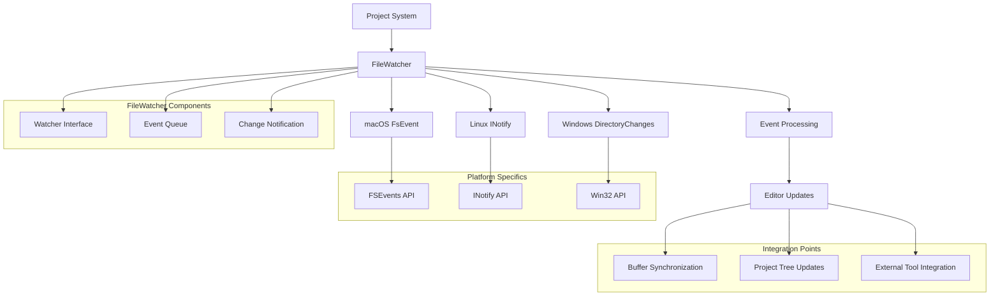
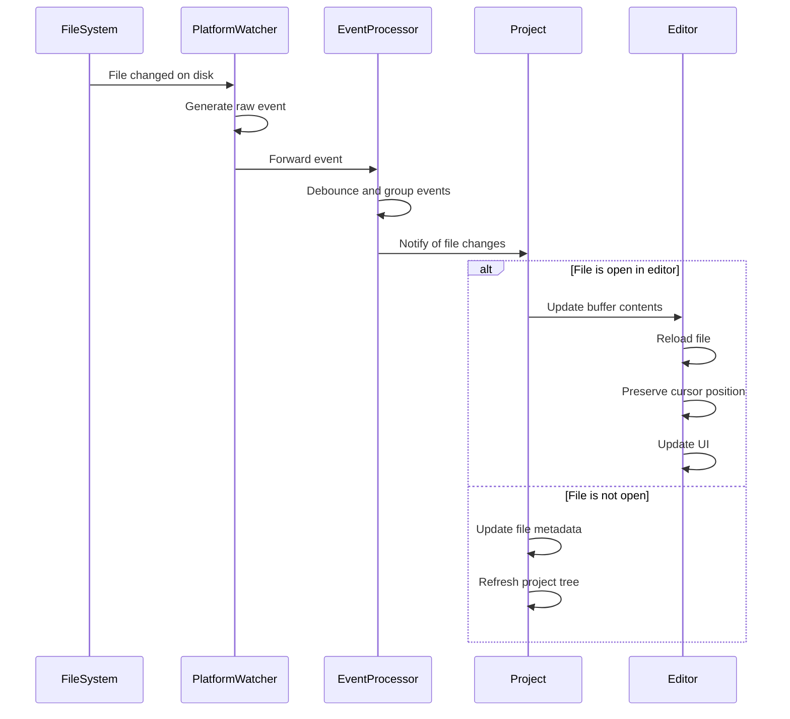
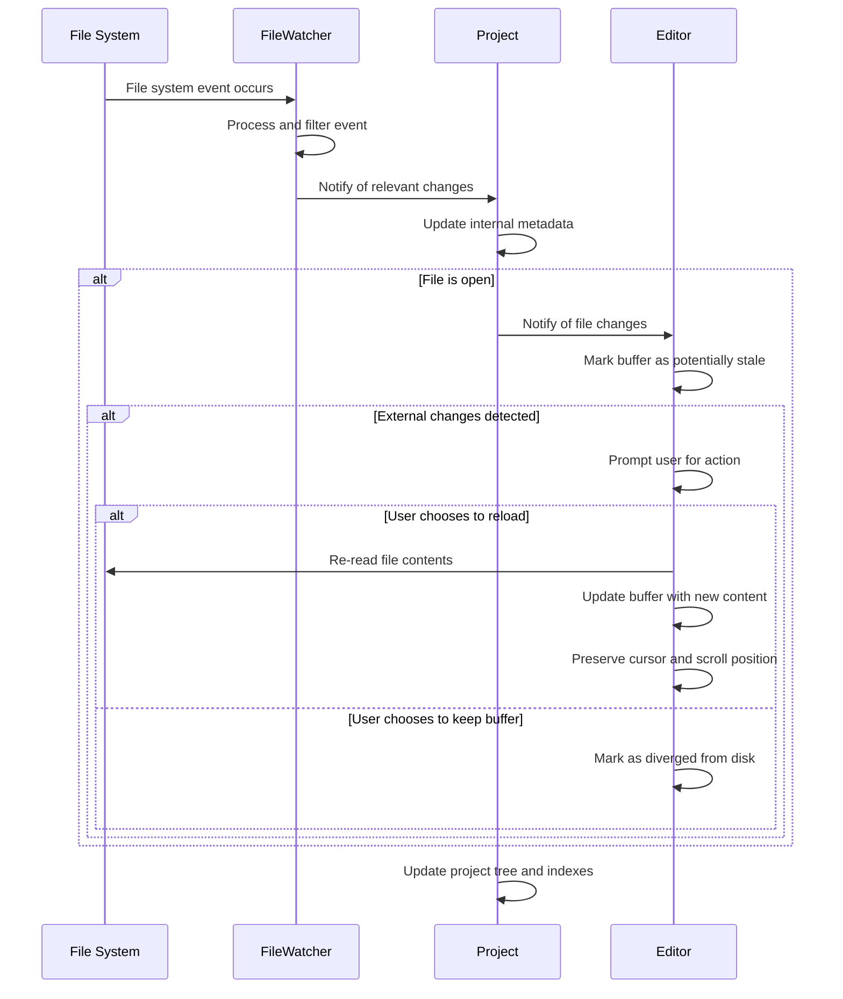

# FileWatcher: File System Monitoring in Zed

## Purpose

The FileWatcher system in Zed provides a mechanism for monitoring the file system for changes and reflecting those changes in the editor. It ensures that the editor's state remains synchronized with the file system, even when files are modified externally. This capability is crucial for a modern code editor, as it allows users to see changes made by external tools, collaborate with others using different editors, and maintain consistency between the editor's in-memory representation and the actual files on disk. The FileWatcher system is designed to be efficient, cross-platform, and reliable, minimizing resource usage while providing timely notifications of relevant file system events.

## Concepts

### Core Abstractions

1. **Watcher**: An entity that monitors specific paths for changes and reports events when changes occur.

2. **PathEvent**: A representation of a file system event, including the path affected and the kind of event (created, changed, removed).

3. **EventStream**: A continuous flow of file system events from the operating system to the application.

4. **FileSystem (Fs)**: The abstraction over the underlying file system operations, providing both file manipulation capabilities and monitoring facilities.

5. **ChangeHandler**: A callback function that processes file system events and updates the editor state accordingly.

### Mental Models

1. **Event-Driven File Synchronization**: Changes to the file system generate events that are processed to update the editor's state, ensuring consistency between what the user sees and what's actually on disk.

2. **Notification Filtering and Debouncing**: File events are filtered and debounced to avoid excessive updates and processing of irrelevant changes, focusing on meaningful changes that affect the user's workspace.

3. **Cross-Platform Abstraction**: Different operating systems have varying file system notification mechanisms, which the FileWatcher system abstracts away to provide a consistent interface.

4. **Hierarchical Monitoring**: Directories are monitored recursively, allowing for efficient tracking of changes within complex project structures without excessive resource consumption.

## Architecture

The FileWatcher system in Zed is structured around platform-specific implementations that are abstracted behind a common interface, providing a unified way to monitor file system changes across different operating systems.



### Key Components

#### Platform-Agnostic Components

1. **Watcher Interface**: Defines the common API for file system monitoring across all platforms.
   - Provides methods to add and remove watched paths
   - Abstracts platform-specific event generation
   - Ensures consistent behavior across different operating systems

2. **PathEvent System**: Represents file system changes in a uniform way.
   - Standardizes event types (creation, modification, deletion)
   - Includes path information for affected files
   - Provides filtering capabilities for relevant events

3. **Event Processing**: Handles raw file system events and converts them into actionable updates.
   - Debounces rapid successive events
   - Filters out irrelevant changes
   - Groups related events for efficient processing

4. **Fs Abstraction**: Wraps file system operations and monitoring capabilities.
   - Provides a unified interface for file operations
   - Integrates file watching with other file operations
   - Supports both synchronous and asynchronous interaction models

#### Platform-Specific Implementations

1. **macOS FSEvents Watcher**: Uses Apple's FSEvents API for efficient file monitoring.
   - Leverages system-level event stream for performance
   - Supports both file and directory monitoring
   - Provides historical event access capabilities

2. **Linux INotify Watcher**: Utilizes the Linux kernel's inotify facility.
   - Monitors file descriptors for changes
   - Handles event coalescing and filtering
   - Manages watch descriptor limits and resources

3. **Windows Directory Changes Watcher**: Employs the Windows ReadDirectoryChangesW API.
   - Processes change notifications from the Windows file system
   - Handles buffer management for event queues
   - Translates Windows-specific events to the common model

#### Integration Components

1. **Buffer Synchronization**: Updates editor buffers based on file system events.
   - Reloads files when external changes are detected
   - Warns about conflicts between in-memory and on-disk versions
   - Preserves cursor positions when reloading files

2. **Project Tree Updates**: Keeps the project explorer in sync with the file system.
   - Updates file listings when files are created or deleted
   - Refreshes metadata when files change
   - Maintains expanded/collapsed state during updates

3. **External Tool Integration**: Coordinates with tools that might modify files.
   - Handles version control updates
   - Manages changes from build tools
   - Coordinates with external formatters and linters

### Data Flow

The following sequence diagram illustrates how file system events flow through the FileWatcher system:



### Integration Points

1. **Project System Integration**:
   - Monitors project directories for changes
   - Updates project structure when files are added or removed
   - Coordinates search index updates based on file changes

2. **Editor Integration**:
   - Notifies open editors when their files change
   - Manages reloading of modified files
   - Handles conflict resolution for concurrent edits

3. **Version Control Integration**:
   - Filters out events caused by VCS operations
   - Updates VCS status when monitored files change
   - Coordinates with Git status to avoid redundant operations

4. **Language Services Integration**:
   - Triggers language server reanalysis when files change
   - Updates diagnostics and code intelligence based on external changes
   - Coordinates with build tools and compilers

## Interfaces

### Watcher Interface

```rust
pub trait Watcher: Send + Sync {
    fn add(&self, path: &Path) -> Result<()>;
    fn remove(&self, path: &Path) -> Result<()>;
}
```

### PathEvent Structure

```rust
#[derive(Copy, Clone, PartialEq, Eq, PartialOrd, Ord, Debug)]
pub enum PathEventKind {
    Removed,
    Created,
    Changed,
}

#[derive(Clone, PartialEq, Eq, PartialOrd, Ord, Debug)]
pub struct PathEvent {
    pub path: PathBuf,
    pub kind: Option<PathEventKind>,
}
```

### Fs Interface for Watching

```rust
#[async_trait::async_trait]
pub trait Fs: Send + Sync {
    // Other file system operations...
    
    async fn watch(
        &self,
        path: &Path,
        latency: Duration,
    ) -> (
        Pin<Box<dyn Send + Stream<Item = Vec<PathEvent>>>>,
        Arc<dyn Watcher>,
    );
}
```

### Platform-Specific Watcher (macOS Example)

```rust
pub struct EventStream {
    lifecycle: Arc<Mutex<Lifecycle>>,
    state: Box<State>,
}

impl EventStream {
    pub fn new(paths: &[&Path], latency: Duration) -> (Self, Handle);
    pub fn start(&mut self, callback: impl FnMut(Vec<Event>) -> bool + 'static) -> Handle;
}

bitflags! {
    #[derive(Debug, Clone, Copy, PartialEq, Eq)]
    pub struct StreamFlags: u32 {
        const NONE = 0x00000000;
        const MUST_SCAN_SUBDIRS = 0x00000001;
        const USER_DROPPED = 0x00000002;
        const KERNEL_DROPPED = 0x00000004;
        const OWNS_FD = 0x00000008;
        const IS_FILE = 0x00000010;
        const IS_DIR = 0x00000020;
        const IS_SYMLINK = 0x00000040;
        const ITEM_CREATED = 0x00000100;
        const ITEM_REMOVED = 0x00000200;
        const ITEM_INODE_META_MOD = 0x00000400;
        const ITEM_RENAMED = 0x00000800;
        const ITEM_MODIFIED = 0x00001000;
        const ITEM_FINDER_INFO_MOD = 0x00002000;
        const ITEM_CHANGE_OWNER = 0x00004000;
        const ITEM_XATTR_MOD = 0x00008000;
        const IS_HARD_LINK = 0x00010000;
        const IS_LAST_HARD_LINK = 0x00020000;
        const ITEM_CLONED = 0x00400000;
    }
}
```

### FsWatcher Implementation

```rust
pub struct FsWatcher {
    tx: smol::channel::Sender<()>,
    pending_path_events: Arc<Mutex<Vec<PathEvent>>>,
}

impl FsWatcher {
    pub fn new(
        tx: smol::channel::Sender<()>,
        pending_path_events: Arc<Mutex<Vec<PathEvent>>>,
    ) -> Self;
}

impl Watcher for FsWatcher {
    fn add(&self, path: &Path) -> Result<()>;
    fn remove(&self, path: &Path) -> Result<()>;
}
```

## State Management

### FileWatcher State

The FileWatcher system maintains several types of state:

1. **Monitoring State**:
   - Paths currently being watched
   - Active watchers and their configuration
   - Platform-specific watcher state

2. **Event State**:
   - Pending events waiting to be processed
   - Event history for detecting patterns
   - Debounce timers for coalescing events

3. **Integration State**:
   - Mapping between files and their watchers
   - Connection state with the file system
   - Synchronization state with editor buffers

### State Updates

FileWatcher state is updated through several mechanisms:

1. **File System Events**:
   - Direct notifications from the operating system
   - Polling results for platforms without native event support
   - Manual refresh operations for consistency checks

2. **User Actions**:
   - Opening and closing files
   - Creating and deleting files within the editor
   - Changing project structure or settings

3. **System Events**:
   - Application focus changes
   - System sleep/wake cycles
   - Network mount status changes

### Data Flow for State Updates



## Swift Considerations

When reimplementing the FileWatcher system in Swift, consider the following:

1. **Platform-Specific APIs**:
   - Use FSEvents API directly on macOS for optimal performance
   - Consider cross-platform abstraction libraries for Windows/Linux support
   - Leverage Foundation's FileManager for common operations

2. **Concurrency Model**:
   - Use Swift's structured concurrency (async/await) for event handling
   - Employ Actor model for thread-safe state management
   - Consider Combine framework for event streams

3. **Integration Strategy**:
   - Design a clean interface between file watching and buffer management
   - Use Swift's type system to enforce correct event handling
   - Consider delegation patterns for system integration

4. **Resource Management**:
   - Implement proper resource cleanup using defer blocks and deinit
   - Monitor memory usage, especially for large projects
   - Use AutoreleasePool for C API interaction when needed

### Swift Interface Example

```swift
// Core protocol for file watching
protocol FileWatcher {
    func startWatching(path: URL) throws
    func stopWatching(path: URL)
    var events: AnyPublisher<FileEvent, Never> { get }
}

// Event structure
struct FileEvent: Equatable, Comparable {
    enum EventKind {
        case created
        case modified
        case removed
    }
    
    let path: URL
    let kind: EventKind
    let timestamp: Date
    
    static func < (lhs: FileEvent, rhs: FileEvent) -> Bool {
        return lhs.timestamp < rhs.timestamp
    }
}

// macOS implementation
class MacOSFileWatcher: FileWatcher {
    private let eventStream: FSEventStream
    private let eventSubject = PassthroughSubject<FileEvent, Never>()
    private var watchedPaths = Set<URL>()
    
    init() {
        // Initialize FSEvents stream
    }
    
    func startWatching(path: URL) throws {
        guard FileManager.default.fileExists(atPath: path.path) else {
            throw FileWatcherError.pathDoesNotExist
        }
        
        watchedPaths.insert(path)
        // Update FSEvents stream with new path
    }
    
    func stopWatching(path: URL) {
        watchedPaths.remove(path)
        // Update FSEvents stream
    }
    
    var events: AnyPublisher<FileEvent, Never> {
        return eventSubject.eraseToAnyPublisher()
    }
    
    private func handleFSEvent(_ event: FSEvent) {
        // Convert FSEvent to FileEvent and publish
        let fileEvent = FileEvent(
            path: URL(fileURLWithPath: event.path),
            kind: mapEventFlags(event.flags),
            timestamp: Date()
        )
        eventSubject.send(fileEvent)
    }
    
    private func mapEventFlags(_ flags: FSEventStreamEventFlags) -> FileEvent.EventKind {
        // Map FSEvents flags to our EventKind
    }
}

// FileSystem abstraction including watcher functionality
actor FileSystem {
    private let fileWatcher: FileWatcher
    private var openBuffers: [URL: FileBuffer] = [:]
    
    init(fileWatcher: FileWatcher = MacOSFileWatcher()) {
        self.fileWatcher = fileWatcher
        setupEventHandling()
    }
    
    private func setupEventHandling() {
        Task {
            for await event in fileWatcher.events.values {
                handleFileEvent(event)
            }
        }
    }
    
    private func handleFileEvent(_ event: FileEvent) {
        guard let buffer = openBuffers[event.path] else { return }
        
        switch event.kind {
        case .modified:
            Task {
                await buffer.markAsOutOfSync()
                NotificationCenter.default.post(
                    name: .fileModifiedExternally,
                    object: event.path
                )
            }
        case .removed:
            Task {
                await buffer.markAsDeleted()
                NotificationCenter.default.post(
                    name: .fileDeletedExternally,
                    object: event.path
                )
            }
        default:
            break
        }
    }
    
    func openFile(at path: URL) async throws -> FileBuffer {
        if let buffer = openBuffers[path] {
            return buffer
        }
        
        let contents = try String(contentsOf: path)
        let buffer = FileBuffer(path: path, contents: contents)
        openBuffers[path] = buffer
        
        try fileWatcher.startWatching(path: path)
        return buffer
    }
    
    func saveFile(at path: URL, contents: String) async throws {
        try contents.write(to: path, atomically: true, encoding: .utf8)
        if let buffer = openBuffers[path] {
            await buffer.markAsSynced()
        }
    }
}
```

## Subsystem Interactions

### Project System

The FileWatcher system interacts with the Project system to:

- Monitor project directories for changes
- Update project structure when files are created or deleted
- Trigger workspace refreshes when significant changes occur
- Coordinate with project-specific settings for file watching

### Buffer System

The FileWatcher system interacts with the Buffer system to:

- Notify buffers when their underlying files change
- Coordinate buffer reloading when external changes are detected
- Prevent data loss when files have both external and internal changes
- Maintain sync state between buffers and their files

### Version Control System

The FileWatcher system coordinates with the Version Control system to:

- Avoid unnecessary updates during VCS operations
- Trigger status refreshes when monitored files change
- Filter out VCS metadata changes from user notifications
- Coordinate handling of file conflicts during merges

### Language Services

The FileWatcher system works with the Language Services to:

- Trigger reanalysis when relevant files change
- Update language server state after file modifications
- Refresh code intelligence when dependencies change
- Coordinate with build systems for compilation results

## Implementation Patterns

### Cross-Platform Event Handling

File system events are mapped to a common format across different platforms:

```rust
fn handle_event(event: Result<notify::Event, notify::Error>) {
    // Filter out access events
    let Some(event) = event
        .log_err()
        .filter(|event| !matches!(event.kind, EventKind::Access(_)))
    else {
        return;
    };
    
    global::<()>(move |watcher| {
        for f in watcher.watchers.lock().iter() {
            f(&event)
        }
    })
    .log_err();
}
```

### Event Filtering and Processing

Events are filtered and processed to identify relevant changes:

```rust
fn add(&self, path: &std::path::Path) -> gpui::Result<()> {
    let root_path = SanitizedPath::from(path);
    
    let tx = self.tx.clone();
    let pending_paths = self.pending_path_events.clone();
    
    use notify::Watcher;
    
    global({
        |g| {
            g.add(move |event: &notify::Event| {
                let kind = match event.kind {
                    EventKind::Create(_) => Some(PathEventKind::Created),
                    EventKind::Modify(_) => Some(PathEventKind::Changed),
                    EventKind::Remove(_) => Some(PathEventKind::Removed),
                    _ => None,
                };
                
                let mut path_events = event
                    .paths
                    .iter()
                    .filter_map(|event_path| {
                        let event_path = SanitizedPath::from(event_path);
                        event_path.starts_with(&root_path).then(|| PathEvent {
                            path: event_path.as_path().to_path_buf(),
                            kind,
                        })
                    })
                    .collect::<Vec<_>>();
                
                // Process and notify of relevant events
                if !path_events.is_empty() {
                    path_events.sort();
                    let mut pending_paths = pending_paths.lock();
                    if pending_paths.is_empty() {
                        tx.try_send(()).ok();
                    }
                    util::extend_sorted(
                        &mut *pending_paths,
                        path_events,
                        usize::MAX,
                        |a, b| a.path.cmp(&b.path),
                    );
                }
            })
        }
    })?;
    
    // Start watching the specified path
    global(|g| {
        g.watcher
            .lock()
            .watch(path, notify::RecursiveMode::NonRecursive)
    })??;
    
    Ok(())
}
```

### Platform-Specific Optimization (macOS Example)

For macOS, the FSEvents API provides efficient watching capabilities:

```rust
impl EventStream {
    pub fn new(paths: &[&Path], latency: Duration) -> (Self, Handle) {
        unsafe {
            let cf_paths =
                cf::CFArrayCreateMutable(cf::kCFAllocatorDefault, 0, &cf::kCFTypeArrayCallBacks);
            
            // Add paths to the CFArray
            for path in paths {
                let path_bytes = path.as_os_str().as_bytes();
                let cf_url = cf::CFURLCreateFromFileSystemRepresentation(
                    cf::kCFAllocatorDefault,
                    path_bytes.as_ptr() as *const i8,
                    path_bytes.len() as cf::CFIndex,
                    false,
                );
                let cf_path = cf::CFURLCopyFileSystemPath(cf_url, cf::kCFURLPOSIXPathStyle);
                cf::CFArrayAppendValue(cf_paths, cf_path);
                cf::CFRelease(cf_path);
                cf::CFRelease(cf_url);
            }
            
            // Initialize FSEvents stream
            let mut state = Box::new(State {
                latency,
                paths: cf_paths,
                callback: None,
                last_valid_event_id: None,
                stream: ptr::null_mut(),
            });
            
            // Create FSEvents stream context
            let stream_context = fs::FSEventStreamContext {
                version: 0,
                info: state.as_ref() as *const _ as *mut c_void,
                retain: None,
                release: None,
                copy_description: None,
            };
            
            // Create and configure the stream
            let stream = fs::FSEventStreamCreate(
                cf::kCFAllocatorDefault,
                Self::trampoline,
                &stream_context,
                cf_paths,
                FSEventsGetCurrentEventId(),
                latency.as_secs_f64(),
                fs::kFSEventStreamCreateFlagFileEvents
            );
            
            // Complete setup and return
            state.stream = stream;
            let lifecycle = Arc::new(Mutex::new(Lifecycle::New));
            (
                Self {
                    lifecycle: lifecycle.clone(),
                    state,
                },
                Handle(lifecycle),
            )
        }
    }
}
```

### Efficient Event Batching

Events are batched for efficient processing:

```rust
async fn process_events(events_rx: &mut Receiver<()>, pending_events: &Mutex<Vec<PathEvent>>) -> Vec<PathEvent> {
    // Wait for the initial event notification
    let _ = events_rx.recv().await;
    
    // Give a short time for additional events to accumulate
    smol::Timer::after(Duration::from_millis(50)).await;
    
    // Drain additional notifications
    while events_rx.try_recv().is_ok() {}
    
    // Extract all pending events
    let mut pending = pending_events.lock();
    let events = std::mem::take(&mut *pending);
    events
}
```

## Conclusion

The FileWatcher system in Zed provides a robust mechanism for monitoring file system changes and keeping the editor's state synchronized with the underlying files. By abstracting platform-specific file system notification APIs behind a consistent interface, it offers reliable file monitoring across different operating systems while optimizing for each platform's capabilities. The system's integration with other parts of the editor, including the buffer management, project system, and language services, ensures a seamless experience where external changes are properly detected, processed, and reflected in the user interface.

When reimplementing this system in Swift, focus on leveraging platform-native APIs like FSEvents on macOS while maintaining a clean abstraction layer for cross-platform compatibility. The event-driven architecture translates well to Swift's concurrency model and Combine framework, allowing for efficient and responsive handling of file system events.

## Related Subsystems

- [Buffer and Rope](13_AtmosphericView_BufferAndRope.md): Provides the text storage that must stay synchronized with file system changes
- [Project Management](05_StratosphericView_ProjectManagement.md): Integrates with file watching to maintain project structure
- [Git Integration](18_AtmosphericView_GitIntegration.md): Coordinates with file watching for version control operations
- [Language Intelligence](04_StratosphericView_LanguageIntelligence.md): Uses file change notifications to update code analysis