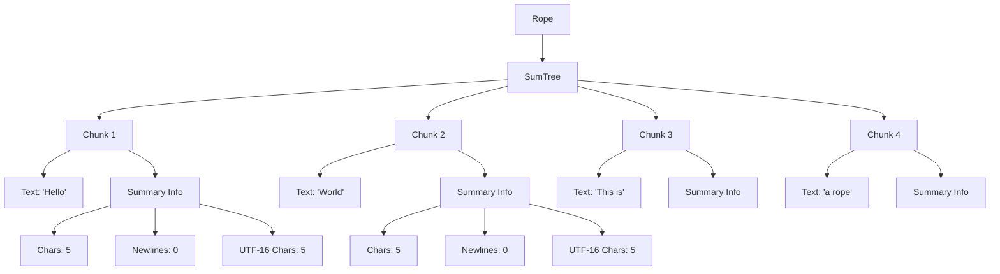

# Rope Algorithms: Efficient Text Management in Zed

## Purpose

The Rope data structure is a cornerstone of Zed's text editing capabilities, enabling efficient manipulation of large text documents with minimal memory overhead and optimal performance. This document provides a detailed examination of the algorithms and implementation details that power Zed's rope system, explaining how it achieves high-performance editing operations while maintaining memory efficiency. Understanding these algorithms is crucial for implementing a text editor that can handle large files with responsive editing, smooth scrolling, and efficient search operations.

## Core Algorithms and Data Structures

### Rope Structure

At its core, Zed's rope implementation is built as a balanced tree of text chunks, with each node containing summary information that facilitates fast navigation and editing operations.



#### Sum Tree Implementation

The core data structure that enables efficient rope operations is the `SumTree`, a specialized balanced tree that maintains summary information for each node:

```rust
pub struct Rope {
    chunks: SumTree<Chunk>,
}
```

The `SumTree` is a B-tree variant with the following key properties:

1. Each internal node maintains summary information about its subtree
2. Tree nodes have a branching factor of 6 (configurable for testing)
3. The tree is automatically rebalanced during editing operations
4. Fast seeking through the tree is possible using dimension measurements

#### Chunk Design

The text content is stored in fixed-size chunks, with carefully chosen size limits:

```rust
pub(crate) const MIN_BASE: usize = if cfg!(test) { 6 } else { 64 };
pub(crate) const MAX_BASE: usize = MIN_BASE * 2;

#[derive(Clone, Debug, Default)]
pub struct Chunk {
    chars: u128,
    chars_utf16: u128,
    newlines: u128,
    tabs: u128,
    pub text: ArrayString<MAX_BASE>,
}
```

Key design decisions:

1. **Fixed Capacity**: Each chunk has a maximum capacity (128 bytes in production), preventing excessive memory allocation
2. **Bit-Packed Metadata**: Character boundaries, newlines, and tabs are tracked using bit-packed fields for efficient traversal
3. **UTF-16 Mapping**: Character counts in UTF-16 are stored for compatibility with external systems like language servers

### Dimension System

The rope implementation uses a dimension system that allows fast navigation through the tree by different metrics:

```rust
pub trait Dimension<'a, S: Summary>: Clone {
    fn zero(cx: &S::Context) -> Self;
    fn add_summary(&mut self, summary: &'a S, cx: &S::Context);
    fn from_summary(summary: &'a S, cx: &S::Context) -> Self;
}
```

Key dimensions tracked include:

1. **Byte Offsets**: Raw byte positions in the text
2. **Character Counts**: Number of Unicode code points
3. **Line and Column Position**: Tracked as Points with row and column values
4. **UTF-16 Code Units**: For compatibility with language servers and other external tools

### Core Operations

#### Seeking and Navigation

The most fundamental operation is efficient seeking through the rope, which enables all other operations:

```rust
impl<'a> Cursor<'a, T, D> {
    pub fn seek(&mut self, target: &impl SeekTarget<'a, T::Summary, D>, cx: &<T::Summary as Summary>::Context) {
        self.seeking_forward = true;
        self.seek_internal(target, Bias::Right, cx);
    }

    fn seek_internal(
        &mut self,
        target: &impl SeekTarget<'a, T::Summary, D>,
        bias: Bias,
        cx: &<T::Summary as Summary>::Context,
    ) {
        // Implementation details for traversing the tree
    }
}
```

The seeking algorithm:

1. Starts at the current cursor position
2. Compares the target position against the summary at each node
3. Traverses down the tree following the comparison result
4. Arrives at the leaf chunk containing the target position

#### Text Insertion

Text insertion is implemented through a combination of slicing and appending:

```rust
pub fn replace(&mut self, range: Range<usize>, text: &str) {
    let mut new_rope = Rope::new();
    let mut cursor = self.cursor(0);
    new_rope.append(cursor.slice(range.start));
    cursor.seek_forward(range.end);
    new_rope.push(text);
    new_rope.append(cursor.suffix());
    *self = new_rope;
}
```

The algorithm:

1. Creates a new rope to hold the result
2. Copies content before the edit range
3. Inserts the new text
4. Copies content after the edit range
5. Replaces the original rope with the new one

For efficiency with large insertions, a specialized `push_large` method is used:

```rust
fn push_large(&mut self, mut text: &str) {
    // To avoid frequent reallocs when loading large swaths of file contents,
    // we estimate worst-case capacity needed
    const MIN_CHUNK_SIZE: usize = chunk::MAX_BASE - 3;
    let capacity = text.len().div_ceil(MIN_CHUNK_SIZE);
    let mut new_chunks = Vec::with_capacity(capacity);
    
    // Split text into fixed-size chunks
    while !text.is_empty() {
        let mut split_ix = cmp::min(chunk::MAX_BASE, text.len());
        while !text.is_char_boundary(split_ix) {
            split_ix -= 1;
        }
        let (chunk, remainder) = text.split_at(split_ix);
        new_chunks.push(chunk);
        text = remainder;
    }
    
    // Use parallel extension for large insertions
    if new_chunks.len() >= PARALLEL_THRESHOLD {
        self.chunks
            .par_extend(new_chunks.into_par_iter().map(Chunk::new), &());
    } else {
        self.chunks
            .extend(new_chunks.into_iter().map(Chunk::new), &());
    }
}
```

#### Text Deletion

Text deletion uses a similar approach to insertion, combining slices without the deleted range:

```rust
pub fn delete(&mut self, range: Range<usize>) {
    let mut new_rope = Rope::new();
    let mut cursor = self.cursor(0);
    new_rope.append(cursor.slice(range.start));
    cursor.seek_forward(range.end);
    new_rope.append(cursor.suffix());
    *self = new_rope;
}
```

#### Coordinate Conversion

Converting between different coordinate systems is a frequent operation:

```rust
pub fn offset_to_point(&self, offset: usize) -> Point {
    let mut cursor = self.chunks.cursor::<(usize, Point)>();
    cursor.seek(&offset, Bias::Right, &());
    cursor.start().1
}

pub fn point_to_offset(&self, point: Point) -> usize {
    let mut cursor = self.chunks.cursor::<(Point, usize)>();
    cursor.seek(&point, Bias::Right, &());
    cursor.start().1
}
```

These conversions:

1. Create a cursor with the appropriate dimension combination
2. Seek to the target coordinate
3. Return the corresponding other coordinate from the cursor's position

### Optimizations

Several key optimizations make the rope implementation highly efficient:

#### 1. Chunking Strategy

The chunk size is carefully balanced:

- Small enough to avoid excessive copying during edits (MAX_BASE = 128 bytes)
- Large enough to minimize tree depth and traversal overhead (MIN_BASE = 64 bytes)
- Maintains character boundaries when splitting chunks

```rust
fn push(&mut self, mut text: &str) {
    // Try to append to the last chunk first
    self.chunks.update_last(
        |last_chunk| {
            let split_ix = if last_chunk.text.len() + text.len() <= chunk::MAX_BASE {
                text.len()
            } else {
                let mut split_ix = cmp::min(
                    chunk::MIN_BASE.saturating_sub(last_chunk.text.len()),
                    text.len(),
                );
                while !text.is_char_boundary(split_ix) {
                    split_ix += 1;
                }
                split_ix
            };

            let (suffix, remainder) = text.split_at(split_ix);
            last_chunk.push_str(suffix);
            text = remainder;
        },
        &(),
    );
    
    // Handle remaining text with appropriate chunking
    // ...
}
```

#### 2. Parallel Processing

For large text operations, parallel processing is used to improve performance:

```rust
if new_chunks.len() >= PARALLEL_THRESHOLD {
    self.chunks
        .par_extend(new_chunks.into_par_iter().map(Chunk::new), &());
} else {
    self.chunks
        .extend(new_chunks.into_iter().map(Chunk::new), &());
}
```

The parallel threshold is set to optimize performance:

```rust
#[cfg(test)]
const PARALLEL_THRESHOLD: usize = 4;
#[cfg(not(test))]
const PARALLEL_THRESHOLD: usize = 4 * (2 * sum_tree::TREE_BASE);
```

#### 3. Bit-Packed Metadata

Character boundaries, newlines, and tabs are stored as bit-packed fields for efficient access:

```rust
#[inline(always)]
pub fn push_str(&mut self, text: &str) {
    for (char_ix, c) in text.char_indices() {
        let ix = self.text.len() + char_ix;
        self.chars |= 1 << ix;
        self.chars_utf16 |= 1 << ix;
        self.chars_utf16 |= (c.len_utf16() as u128) << ix;
        self.newlines |= ((c == '\n') as u128) << ix;
        self.tabs |= ((c == '\t') as u128) << ix;
    }
    self.text.push_str(text);
}
```

This enables:
- Fast determination of character boundaries
- Quick newline counting without scanning
- Efficient UTF-16 code unit counting

#### 4. Pre-allocated Capacity

When handling large insertions, the code pre-allocates capacity to avoid reallocation:

```rust
let capacity = text.len().div_ceil(MIN_CHUNK_SIZE);
let mut new_chunks = Vec::with_capacity(capacity);
```

This is particularly important for loading large files, where repeated reallocations would significantly impact performance.

#### 5. Cursor Reuse

Cursors maintain their position in the tree, allowing for efficient sequential operations:

```rust
pub fn replace(&mut self, range: Range<usize>, text: &str) {
    let mut new_rope = Rope::new();
    let mut cursor = self.cursor(0);
    new_rope.append(cursor.slice(range.start));
    cursor.seek_forward(range.end);
    new_rope.push(text);
    new_rope.append(cursor.suffix());
    *self = new_rope;
}
```

This avoids re-traversing the tree for each operation in a sequence.

## Performance Characteristics

### Time Complexity

The rope implementation achieves the following time complexity for key operations:

| Operation | Time Complexity | Notes |
|-----------|-----------------|-------|
| Insert/Delete | O(log N) | Where N is the text length |
| Seek by offset | O(log N) | Traversal through balanced tree |
| Seek by point | O(log N) | Using point dimension |
| Append/Prepend | O(log N) | Often optimized to near O(1) |
| Character at offset | O(log N) | Tree traversal to specific chunk |
| Substring (slice) | O(log N) | For creation, plus length of result |
| Offset to point conversion | O(log N) | Traversal with dimension tracking |
| Point to offset conversion | O(log N) | Traversal with dimension tracking |

### Space Complexity

The rope has highly efficient space usage:

- **Overall**: O(N) space for a text of length N
- **Overhead**: Approximately 10-15% beyond the raw text size
- **Fragmentation**: Minimized by the chunk size constraints (MIN_BASE and MAX_BASE)

### Performance Tradeoffs

Several key tradeoffs are made in the implementation:

1. **Chunk Size**:
   - Larger chunks reduce tree depth and improve traversal speed
   - Smaller chunks reduce copying during edits
   - The 64-128 byte range balances these concerns

2. **Tree Balancing**:
   - The B-tree structure maintains balance during edits
   - Rebalancing operations add some overhead but ensure consistent performance

3. **Copy-on-Write vs. In-place Edits**:
   - Many operations create new rope instances rather than modifying in place
   - This simplifies implementation but can increase memory usage during edits
   - The tradeoff favors simplicity and correctness over absolute memory efficiency

4. **Parallel Processing**:
   - Parallel operations improve performance for large edits
   - The overhead of parallelism is avoided for small edits
   - The threshold is tuned to optimize overall performance

## Implementation Challenges

### Character Boundary Handling

A significant challenge is maintaining character boundaries when splitting text:

```rust
let mut split_ix = cmp::min(chunk::MAX_BASE, text.len());
while !text.is_char_boundary(split_ix) {
    split_ix -= 1;
}
```

This ensures that:
- UTF-8 character encodings are never split across chunks
- Operations that work with character boundaries remain correct
- Text display is consistent after editing operations

### UTF-16 Code Unit Tracking

Supporting systems that use UTF-16 (like language servers) requires tracking both UTF-8 and UTF-16 character counts:

```rust
self.chars_utf16 |= 1 << ix;
self.chars_utf16 |= (c.len_utf16() as u128) << ix;
```

This adds complexity but is essential for interoperability with external tools.

### Tree Rebalancing

Maintaining tree balance during editing operations requires careful implementation:

- Insertions and deletions can unbalance the tree
- Rebalancing operations must preserve the logical structure
- Balance must be maintained without excessive overhead

The `SumTree` implementation handles this complexity, ensuring consistent performance regardless of edit patterns.

### Efficient Random Access

Random access is frequent in text editors (cursor movement, selection, etc.), so efficient seeking is critical:

```rust
pub fn seek(&mut self, target: &impl SeekTarget<'a, T::Summary, D>, cx: &<T::Summary as Summary>::Context) {
    self.seeking_forward = true;
    self.seek_internal(target, Bias::Right, cx);
}
```

The seeking algorithm uses the tree's structure and summary information to minimize traversal depth.

## Swift Implementation Considerations

When implementing this rope algorithm in Swift, consider the following approaches:

### Data Structure Design

```swift
struct Rope {
    private let chunks: SumTree<Chunk>
    
    init() {
        self.chunks = SumTree()
    }
    
    func replace(range: Range<Int>, with text: String) -> Rope {
        var newRope = Rope()
        var cursor = self.cursor(at: 0)
        newRope.append(cursor.slice(upTo: range.lowerBound))
        cursor.seek(to: range.upperBound)
        newRope.push(text)
        newRope.append(cursor.suffix())
        return newRope
    }
    
    // Other methods...
}

struct Chunk {
    private static let maxSize = 128
    private static let minSize = 64
    
    private var text: String
    private var charBoundaries: UInt128
    private var newlines: UInt128
    private var utf16CodeUnits: UInt128
    
    // Methods...
}
```

### Optimizations for Swift

1. **Value Semantics**:
   - Swift's strong value semantics work well with the copy-on-write nature of rope operations
   - Use `@frozen` where appropriate to optimize struct layout
   - Consider explicit copy-on-write implementation for large ropes

2. **Memory Management**:
   - Swift's ARC will handle memory management automatically
   - Use array storage with precise capacity management
   - Consider fixed-size arrays for chunks rather than dynamic strings

3. **Swift Concurrency**:
   - Replace Rayon's parallel iterators with Swift's structured concurrency
   - Use `async`/`await` for file operations
   - Consider actor isolation for thread safety

4. **Unicode Handling**:
   - Leverage Swift's strong Unicode support
   - Replace manual UTF-8/UTF-16 tracking with Swift's built-in string views
   - Use Swift's Unicode scalars for character boundary detection

### Example Swift SumTree Implementation

```swift
struct SumTree<Element: TreeElement> {
    private var root: Node<Element>
    
    struct Node<Element: TreeElement> {
        var elements: [Element]
        var children: [Node<Element>]?
        var summary: Element.Summary
        
        // Methods...
    }
    
    func cursor<D: Dimension>(at startPosition: D) -> Cursor<D> {
        return Cursor(tree: self, position: startPosition)
    }
    
    func append(_ other: SumTree<Element>) {
        // Implementation...
    }
    
    // Other methods...
}

protocol TreeElement {
    associatedtype Summary: SummaryProtocol
    
    func summarize() -> Summary
}

protocol SummaryProtocol {
    static func zero() -> Self
    mutating func add(_ other: Self)
}

protocol Dimension {
    associatedtype Summary: SummaryProtocol
    
    static func zero() -> Self
    mutating func add(summary: Summary)
}
```

### Performance Considerations

1. **Struct vs. Class**:
   - Use structs for immutable components (better value semantics)
   - Consider classes for mutable components with identity
   - Pay attention to copy costs for large string chunks

2. **String Storage**:
   - Swift's String is already a form of rope internally
   - Consider whether to use Swift.String for chunks or custom storage
   - Benchmark different approaches for your specific use case

3. **Memory Layout**:
   - Use MemoryLayout to optimize struct size
   - Consider aligning data for optimal memory access
   - Use fixed-size buffers where appropriate

## Conclusion

Zed's rope implementation provides a sophisticated yet efficient approach to text management. The core design—a balanced tree of text chunks with summary information—enables fast operations even on very large documents. Key optimizations like chunk size constraints, parallel processing for large operations, and bit-packed metadata contribute to the overall performance.

When implementing a similar system in Swift, focus on leveraging Swift's strong type system and value semantics while adapting the core algorithms to fit Swift's idioms. The result should maintain the same performance characteristics while benefiting from Swift's safety and expressiveness.

## Related Subsystems

- [Buffer and Rope](13_AtmosphericView_BufferAndRope.md): The higher-level view of how rope is used in Zed's buffer system
- [Cursor and Selection](14_AtmosphericView_CursorAndSelection.md): How the rope system integrates with cursor positioning and selection
- [Syntax Highlighting](15_AtmosphericView_SyntaxHighlighting.md): How the rope structure supports efficient syntax highlighting
- [MultiBuffer](21_AtmosphericView_MultiBuffer.md): How multiple ropes are managed in a unified editing context