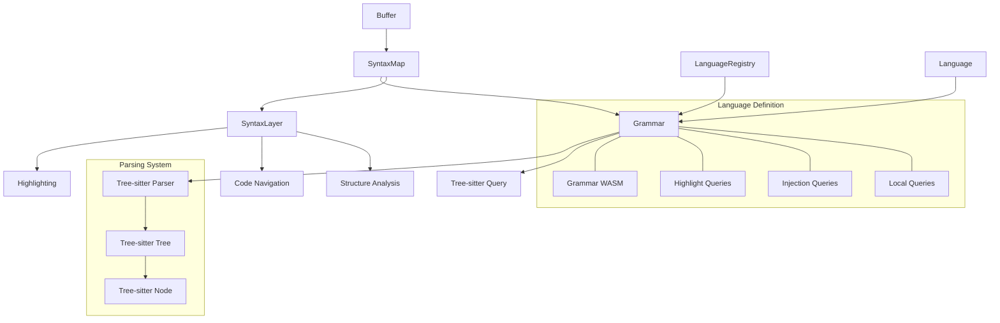

# Tree-sitter Integration: Incremental Parsing in Zed

## Purpose

The Tree-sitter integration in Zed provides robust, incremental parsing of source code, enabling efficient syntax highlighting, code intelligence, and navigation features. This document explores the architecture and implementation details of how Zed incorporates Tree-sitter, a parsing system designed for high-performance syntax analysis of programming languages. Understanding this integration is crucial for reimplementing the editor's language intelligence features, ensuring that code highlighting, navigation, and structural operations remain fast and accurate even for large files and complex languages.

## Core Components and Concepts

### Tree-sitter Fundamentals

At its core, Tree-sitter is an incremental parsing system with these key characteristics:

1. **Incremental Parsing**: Only the changed parts of a document need to be reparsed, making it efficient for real-time editing.

2. **Error Tolerance**: Can produce useful syntax trees even with incomplete or incorrect code.

3. **Language Agnostic**: Uses a grammar definition format that works across many programming languages.

4. **Concrete Syntax Trees**: Produces full concrete syntax trees (not abstract syntax trees), preserving all syntactic details.

5. **Query System**: Provides a powerful query language to extract information from syntax trees.

### Architecture Overview

Zed's Tree-sitter integration consists of several interconnected components:



### Key Components

#### 1. SyntaxMap

The `SyntaxMap` is the central hub for managing syntax trees across a buffer:

```rust
pub struct SyntaxMap {
    snapshot: SyntaxSnapshot,
    language_registry: Option<Arc<LanguageRegistry>>,
}

#[derive(Clone)]
pub struct SyntaxSnapshot {
    layers: SumTree<SyntaxLayerEntry>,
    parsed_version: clock::Global,
    interpolated_version: clock::Global,
    language_registry_version: usize,
}
```

This structure:
- Maintains a tree of syntax layers for a buffer
- Tracks version information for incremental updates
- Manages the relationship with the language registry

#### 2. SyntaxLayer

Each `SyntaxLayer` represents a single parsed syntax tree:

```rust
#[derive(Debug)]
pub struct SyntaxLayer<'a> {
    pub language: &'a Arc<Language>,
    pub(crate) depth: usize,
    tree: &'a Tree,
    pub(crate) offset: (usize, tree_sitter::Point),
}
```

Layers are crucial because:
- They map to specific regions of text
- They support language embedding (e.g., JavaScript in HTML)
- They maintain a hierarchy of languages in a file

#### 3. Language and Grammar

The `Language` structure defines a programming language's parsing and highlighting rules:

```rust
pub struct Language {
    pub(crate) id: LanguageId,
    pub(crate) config: LanguageConfig,
    pub(crate) grammar: Option<Arc<Grammar>>,
}

pub struct Grammar {
    id: usize,
    language: tree_sitter::Language,
    highlight_query: Option<Arc<Query>>,
    injection_query: Option<Arc<Query>>,
    local_query: Option<Arc<Query>>,
    outline_query: Option<Arc<Query>>,
}
```

This organization:
- Separates language configuration from syntax rules
- Maintains queries for different features (highlighting, injections, etc.)
- Provides access to the Tree-sitter language and parser

#### 4. Parser Management

Zed manages Tree-sitter parsers through a pooling system:

```rust
static PARSERS: Mutex<Vec<Parser>> = Mutex::new(vec![]);

pub fn with_parser<F, R>(func: F) -> R
where
    F: FnOnce(&mut Parser) -> R,
{
    let mut parser = PARSERS.lock().pop().unwrap_or_else(|| {
        let mut parser = Parser::new();
        parser
            .set_wasm_store(WasmStore::new(&WASM_ENGINE).unwrap())
            .unwrap();
        parser
    });
    parser.set_included_ranges(&[]).unwrap();
    let result = func(&mut parser);
    PARSERS.lock().push(parser);
    result
}
```

This approach:
- Reuses parsers to avoid repeated initialization costs
- Configures parsers with appropriate settings before use
- Supports WebAssembly-based grammar loading

## Implementation Details

### Incremental Parsing Algorithm

The core of Tree-sitter's value lies in its incremental parsing approach:

1. **Change Detection**: When text changes, Zed identifies the affected regions in the buffer.

2. **Tree Reuse**: The existing syntax tree is reused except for the modified sections.

3. **Minimal Reparse**: Only the changed subtrees are reparsed, preserving the rest of the structure.

The implementation in Zed:

```rust
fn parse_buffer(
    buffer: &Buffer,
    old_tree: Option<&Tree>,
    language: Arc<Language>,
    included_ranges: &[Range<usize>],
    options: &TreeSitterOptions,
) -> Result<Tree> {
    with_parser(|parser| {
        // Set the language for the parser
        parser.set_language(&language.grammar.as_ref().unwrap().language)?;
        
        // Configure included ranges for language injections
        if !included_ranges.is_empty() {
            let ranges = included_ranges
                .iter()
                .map(|range| {
                    let start = buffer.offset_to_point(range.start);
                    let end = buffer.offset_to_point(range.end);
                    tree_sitter::Range {
                        start_byte: range.start,
                        end_byte: range.end,
                        start_point: start.to_tree_sitter_point(),
                        end_point: end.to_tree_sitter_point(),
                    }
                })
                .collect::<Vec<_>>();
            parser.set_included_ranges(&ranges)?;
        }
        
        // Configure timeouts and parsing mode
        if let Some(cancellation_flag) = options.cancellation_flag.as_ref() {
            parser.set_cancellation_flag(cancellation_flag).unwrap();
        }
        parser.set_timeout_micros(options.timeout_micros);
        
        // Parse the buffer with incremental updates
        let tree = parser.parse_with(
            |byte, _| buffer.byte_at(byte).map(|b| b as i32).unwrap_or(0),
            old_tree,
        );
        
        Ok(tree.ok_or_else(|| anyhow!("Parsing canceled"))?)
    })
}
```

### Language Injection System

One of the most powerful features is language injection, which handles embedded languages:

```rust
fn add_injections(
    map: &mut SyntaxMap,
    parent_layer: &SyntaxLayerEntry,
    parent_buffer: &Buffer,
    language_registry: &LanguageRegistry,
    parse_options: &TreeSitterOptions,
) -> Result<()> {
    let parent_tree = match &parent_layer.content {
        SyntaxLayerContent::Parsed { tree, language } => {
            let grammar = match &language.grammar {
                Some(grammar) => grammar,
                None => return Ok(()),
            };
            
            let injection_query = match &grammar.injection_query {
                Some(query) => query,
                None => return Ok(()),
            };
            
            // Use the query to find injection points
            with_query_cursor(|cursor| {
                cursor.set_match_limit(10000);
                let matches = cursor.matches(
                    injection_query,
                    tree.root_node(),
                    TextProvider(parent_buffer),
                );
                
                // Process each injection match
                for mat in matches {
                    if let Some(language_capture) = mat.captures.iter().find(|c| {
                        injection_query.capture_names()[c.index as usize] == "language"
                    }) {
                        // Extract the language name and content range
                        let language_name = parent_buffer
                            .text_for_range(byte_range_to_char_range(
                                parent_buffer,
                                language_capture.node.byte_range(),
                            ))?
                            .trim()
                            .to_string();
                        
                        // Find the content node
                        if let Some(content_capture) = mat.captures.iter().find(|c| {
                            injection_query.capture_names()[c.index as usize] == "content"
                        }) {
                            // Create a new syntax layer for the injected language
                            let content_node = content_capture.node;
                            let content_range = byte_range_to_char_range(
                                parent_buffer,
                                content_node.byte_range(),
                            );
                            
                            // Add the injection layer
                            map.add_layer_at_range(
                                language_name,
                                parent_layer.depth + 1,
                                content_range,
                                language_registry,
                                parent_buffer,
                                parse_options,
                            )?;
                        }
                    }
                }
                
                Ok(())
            })?;
            
            Ok(())
        }
        _ => Ok(()),
    }
}
```

This system:
- Uses Tree-sitter queries to identify embedded language regions
- Creates nested syntax layers for each embedded language
- Maintains a hierarchy that can handle multiple levels of embedding

### Highlighting System

Syntax highlighting is implemented using Tree-sitter queries:

```rust
fn highlight_buffer_with_query(
    buffer: &Buffer,
    tree: &Tree,
    query: &Query,
    highlights: &mut HighlightMap,
) -> Result<()> {
    with_query_cursor(|cursor| {
        cursor.set_match_limit(10000);
        let matches = cursor.matches(query, tree.root_node(), TextProvider(buffer));
        
        for mat in matches {
            for capture in mat.captures {
                // Map capture to highlight style
                let capture_name = query.capture_names()[capture.index as usize].as_str();
                if let Some(style) = capture_name_to_highlight_style(capture_name) {
                    let node_range = capture.node.byte_range();
                    let range = byte_range_to_char_range(buffer, node_range);
                    
                    // Add highlight to the map
                    highlights.add_highlight(range, style);
                }
            }
        }
        
        Ok(())
    })
}
```

The highlighting process:
- Uses Tree-sitter queries to match syntax patterns
- Maps query capture names to highlight styles
- Builds a map of text ranges to highlight styles
- Updates highlighting incrementally as the document changes

### Syntax Tree Querying

The query system is central to extracting information from syntax trees:

```rust
pub struct SyntaxMapCaptures<'a> {
    layers: Vec<SyntaxMapCapturesLayer<'a>>,
    active_layer_count: usize,
    grammars: Vec<&'a Grammar>,
}

pub struct SyntaxMapMatches<'a> {
    layers: Vec<SyntaxMapMatchesLayer<'a>>,
    active_layer_count: usize,
    grammars: Vec<&'a Grammar>,
}
```

These structures:
- Allow querying across multiple syntax layers
- Handle nested languages seamlessly
- Support advanced use cases like code outline generation

### Performance Optimizations

Several optimizations ensure parsing remains efficient:

1. **Parser Pooling**: Reusing parsers to avoid initialization costs.

2. **Timeouts**: Setting parsing timeouts to prevent blocking on complex files.

3. **Incremental Updates**: Only reparsing changed parts of the document.

4. **Lazy Loading**: Loading languages and grammars on demand.

5. **WebAssembly Integration**: Using WebAssembly for cross-platform grammar definitions.

```rust
// WebAssembly engine initialization
static WASM_ENGINE: LazyLock<wasmtime::Engine> = LazyLock::new(|| {
    wasmtime::Engine::new(&wasmtime::Config::new()).expect("Failed to create Wasmtime engine")
});

// Lazy language configuration
static PLAIN_TEXT: LazyLock<Arc<Language>> = LazyLock::new(|| {
    Arc::new(Language::new(
        LanguageConfig {
            name: "Plain Text".into(),
            soft_wrap: Some(SoftWrap::EditorWidth),
            matcher: LanguageMatcher {
                path_suffixes: vec!["txt".to_owned()],
                first_line_pattern: None,
            },
            ..Default::default()
        },
        None,
    ))
});
```

## Applications and Extensions

### Code Navigation

Tree-sitter enables precise code navigation features:

```rust
fn outline_for_buffer(
    buffer: &Buffer,
    syntax_map: &SyntaxMap,
    outline_config: &OutlineConfig,
) -> Result<Outline> {
    let mut outline_items = Vec::new();
    
    for layer in syntax_map.layers() {
        let grammar = match layer.language.grammar.as_ref() {
            Some(grammar) => grammar,
            None => continue,
        };
        
        let outline_query = match &grammar.outline_query {
            Some(query) => query,
            None => continue,
        };
        
        with_query_cursor(|cursor| {
            let matches = cursor.matches(
                outline_query,
                layer.tree.root_node(),
                TextProvider(buffer),
            );
            
            for mat in matches {
                // Process outline item captures
                let mut name = None;
                let mut kind = None;
                let mut range = None;
                
                for capture in &mat.captures {
                    let capture_name = &outline_query.capture_names()[capture.index as usize];
                    match capture_name.as_str() {
                        "name" => {
                            name = Some(buffer.text_for_range(
                                byte_range_to_char_range(buffer, capture.node.byte_range()),
                            )?);
                        }
                        "kind" => {
                            kind = Some(buffer.text_for_range(
                                byte_range_to_char_range(buffer, capture.node.byte_range()),
                            )?);
                        }
                        "range" => {
                            range = Some(byte_range_to_char_range(
                                buffer,
                                capture.node.byte_range(),
                            ));
                        }
                        _ => {}
                    }
                }
                
                // Create outline item
                if let (Some(name), Some(kind), Some(range)) = (name, kind, range) {
                    outline_items.push(OutlineItem {
                        text: name.into(),
                        kind: kind.into(),
                        range,
                        depth: 0,
                    });
                }
            }
            
            Ok(())
        })?;
    }
    
    // Sort and organize outline items
    outline_items.sort_by_key(|item| item.range.start);
    compute_outline_depths(&mut outline_items);
    
    Ok(Outline {
        items: outline_items,
    })
}
```

### Structural Editing

Tree-sitter enables structure-aware editing operations:

```rust
fn select_syntax_node(
    editor: &mut Editor,
    selection: &Selection,
    map: &SyntaxMap,
    expand: bool,
    cx: &mut Context,
) -> Result<Selection> {
    let cursor_position = selection.head();
    let point = editor.point_for_anchor(cursor_position);
    
    // Find the smallest node containing the cursor
    let node = find_node_containing_point(map, point, cx)?;
    
    if expand {
        // Expand selection to include the entire node
        let node_range = byte_range_to_char_range(editor.buffer(), node.byte_range());
        Ok(Selection::new(
            editor.buffer().anchor_for_offset(node_range.start),
            editor.buffer().anchor_for_offset(node_range.end),
        ))
    } else {
        // Create a selection at the node boundaries
        let node_start = editor.buffer().anchor_for_offset(node.start_byte());
        let node_end = editor.buffer().anchor_for_offset(node.end_byte());
        Ok(Selection::new(node_start, node_end))
    }
}
```

### Language Debugging Tools

Zed includes tools for inspecting and debugging syntax trees:

```rust
pub struct SyntaxTreeView {
    workspace_handle: WeakEntity<Workspace>,
    editor: Option<EditorState>,
    list_scroll_handle: UniformListScrollHandle,
    selected_descendant_ix: Option<usize>,
    hovered_descendant_ix: Option<usize>,
    focus_handle: FocusHandle,
}

impl Render for SyntaxTreeView {
    fn render(&mut self, cx: &mut ViewContext<Self>) -> impl IntoElement {
        // Render the syntax tree visualization
        if let Some(EditorState { active_buffer: Some(buffer_state), .. }) = &self.editor {
            if let Some(layer) = &buffer_state.active_layer {
                let tree = &layer.tree;
                let root_node = tree.root_node();
                
                // Build a list of all nodes in the tree
                let mut descendants = Vec::new();
                collect_descendants(&root_node, 0, &mut descendants);
                
                // Render the tree as an expandable list
                return div()
                    .size_full()
                    .child(
                        uniform_list()
                            .track_scroll(&self.list_scroll_handle)
                            .items(
                                descendants,
                                |_, (node, depth)| format!("{}{:?}", "  ".repeat(depth), node),
                                |_, (node, depth), cx| {
                                    render_node(node, depth, cx)
                                },
                            ),
                    )
                    .into_any_element();
            }
        }
        
        // Fallback when no syntax tree is available
        div()
            .size_full()
            .child(Label::new("No syntax tree available"))
            .into_any_element()
    }
}
```

## Language Server Protocol Integration

The Tree-sitter integration complements the Language Server Protocol (LSP) integration:

```rust
fn convert_tree_sitter_position_to_lsp(
    position: tree_sitter::Point,
) -> lsp::Position {
    lsp::Position {
        line: position.row as u32,
        character: position.column as u32,
    }
}

fn provide_document_symbols(
    document_uri: &lsp::Url,
    buffer: &Buffer,
    syntax_map: &SyntaxMap,
) -> Result<Vec<lsp::DocumentSymbol>> {
    // Generate document symbols from syntax tree
    let outline = outline_for_buffer(buffer, syntax_map, &OutlineConfig::default())?;
    
    // Convert to LSP document symbols
    let symbols = outline.items.into_iter().map(|item| {
        let range = lsp::Range {
            start: lsp::Position {
                line: buffer.offset_to_point(item.range.start).row,
                character: buffer.offset_to_point(item.range.start).column as u32,
            },
            end: lsp::Position {
                line: buffer.offset_to_point(item.range.end).row,
                character: buffer.offset_to_point(item.range.end).column as u32,
            },
        };
        
        lsp::DocumentSymbol {
            name: item.text.to_string(),
            detail: None,
            kind: kind_to_lsp_symbol_kind(&item.kind),
            tags: None,
            deprecated: None,
            range,
            selection_range: range,
            children: None,
        }
    }).collect();
    
    Ok(symbols)
}
```

This integration:
- Provides fallback syntax information when LSP is unavailable
- Supplements LSP functionality with local parsing
- Creates a seamless experience combining both systems

## Swift Implementation Considerations

When reimplementing Tree-sitter integration in Swift, consider these approaches:

### Parser Management

```swift
// Tree-sitter parser pool
class ParserPool {
    private var parsers = [TSParser]()
    private let mutex = NSLock()
    
    func withParser<T>(_ block: (TSParser) -> T) -> T {
        mutex.lock()
        defer { mutex.unlock() }
        
        let parser: TSParser
        if let existingParser = parsers.popLast() {
            parser = existingParser
        } else {
            parser = TSParser()
            // Configure new parser
        }
        
        let result = block(parser)
        parsers.append(parser)
        return result
    }
}
```

### Language Definition

```swift
struct Language {
    let id: LanguageId
    let config: LanguageConfig
    let grammar: Grammar?
    
    struct LanguageConfig {
        let name: String
        let fileExtensions: [String]
        let firstLinePattern: NSRegularExpression?
        let indentRules: IndentRules
        // Other configuration properties
    }
}

struct Grammar {
    let language: TSLanguage
    let highlightQuery: TSQuery?
    let injectionQuery: TSQuery?
    let localQuery: TSQuery?
    let outlineQuery: TSQuery?
    
    func parse(text: String, oldTree: TSTree?) -> TSTree? {
        ParserPool.shared.withParser { parser in
            parser.setLanguage(language)
            return parser.parse(text, oldTree: oldTree)
        }
    }
}
```

### Syntax Map Implementation

```swift
class SyntaxMap {
    private var layers: [SyntaxLayer]
    private var version: UInt64
    private let languageRegistry: LanguageRegistry
    
    func addLayer(range: Range<Int>, languageName: String, buffer: Buffer) {
        // Find the language
        guard let language = languageRegistry.languageFor(name: languageName) else {
            return
        }
        
        // Create a new layer
        let newLayer = SyntaxLayer(
            range: range,
            language: language,
            depth: calculateDepth(for: range)
        )
        
        // Parse the layer
        parseLayer(newLayer, buffer: buffer)
        
        // Add to layers
        insertLayer(newLayer)
    }
    
    func parseLayer(_ layer: SyntaxLayer, buffer: Buffer) {
        guard let grammar = layer.language.grammar else {
            return
        }
        
        // Extract text for parsing
        let text = buffer.text(in: layer.range)
        
        // Parse the text
        layer.tree = grammar.parse(text: text, oldTree: layer.tree)
        
        // Process language injections if needed
        processInjections(layer: layer, buffer: buffer)
    }
    
    // Other methods for querying and managing layers
}

class SyntaxLayer {
    let range: Range<Int>
    let language: Language
    let depth: Int
    var tree: TSTree?
    
    // Methods for working with the layer
}
```

### Highlight Implementation

```swift
class HighlightMap {
    private var highlights: [Range<Int>: HighlightStyle]
    
    func highlightBuffer(_ buffer: Buffer, tree: TSTree, query: TSQuery) {
        let cursor = TSQueryCursor()
        cursor.exec(query: query, node: tree.rootNode)
        
        while let match = cursor.nextMatch() {
            for capture in match.captures {
                let captureName = query.captureName(for: capture.index)
                guard let style = highlightStyleFor(captureName: captureName) else {
                    continue
                }
                
                let range = capture.node.range
                addHighlight(range: range, style: style)
            }
        }
    }
    
    func addHighlight(range: Range<Int>, style: HighlightStyle) {
        highlights[range] = style
    }
    
    func styleAt(offset: Int) -> HighlightStyle? {
        // Find style at the given offset
        for (range, style) in highlights {
            if range.contains(offset) {
                return style
            }
        }
        return nil
    }
}
```

### Performance Considerations

1. **WebAssembly Integration**: Use WebAssembly for cross-platform grammar definitions.

2. **Concurrency**: Leverage Swift's concurrency model for background parsing.

```swift
func parseInBackground(buffer: Buffer) async throws -> TSTree {
    try await Task.detached(priority: .background) {
        ParserPool.shared.withParser { parser in
            // Configure parser
            return parser.parse(buffer.text, oldTree: buffer.oldTree)
        }
    }.value
}
```

3. **Memory Management**: Carefully manage Tree-sitter object lifetimes.

```swift
// Use Swift's memory management
class TreeOwner {
    private let tree: TSTree
    
    init(tree: TSTree) {
        self.tree = tree
    }
    
    deinit {
        // Release the tree if needed
    }
    
    func withTreeDo<T>(_ block: (TSTree) -> T) -> T {
        return block(tree)
    }
}
```

4. **Incremental Updates**: Implement efficient buffer change tracking.

```swift
func applyEdit(edit: Edit, oldTree: TSTree?) -> TSTree? {
    let inputEdit = TSInputEdit(
        startByte: edit.range.lowerBound,
        oldEndByte: edit.range.upperBound,
        newEndByte: edit.range.lowerBound + edit.newText.utf8.count,
        startPoint: pointAt(offset: edit.range.lowerBound),
        oldEndPoint: pointAt(offset: edit.range.upperBound),
        newEndPoint: calculateNewEndPoint(edit)
    )
    
    ParserPool.shared.withParser { parser in
        oldTree?.edit(inputEdit)
        return parser.parse(text, oldTree: oldTree)
    }
}
```

## Conclusion

The Tree-sitter integration in Zed is a foundational component enabling efficient syntax analysis, highlighting, and structural code operations. Its incremental parsing approach, language injection system, and query capabilities make it well-suited for modern code editing requirements.

The implementation strikes a balance between performance and flexibility, allowing for:

1. Real-time editing with responsive syntax highlighting
2. Support for embedded languages within files
3. Structural code navigation and manipulation
4. Integration with language servers for enhanced intelligence

When reimplementing this system in Swift, focus on maintaining the incremental nature of parsing, the layered approach to language embedding, and the efficient query capabilities that make Tree-sitter powerful. Leverage Swift's strong type system and concurrency model to create a clean, maintainable implementation that preserves the performance characteristics of the original.

## Related Subsystems

- [Syntax Highlighting](15_AtmosphericView_SyntaxHighlighting.md): Uses Tree-sitter for incremental highlighting
- [Language Intelligence](04_StratosphericView_LanguageIntelligence.md): Combines Tree-sitter with LSP
- [Buffer and Rope](13_AtmosphericView_BufferAndRope.md): Provides the text storage that Tree-sitter analyzes
- [LanguageServerProtocol](30_CloudLevel_LanguageServerProtocol.md): Complements Tree-sitter for enhanced code intelligence