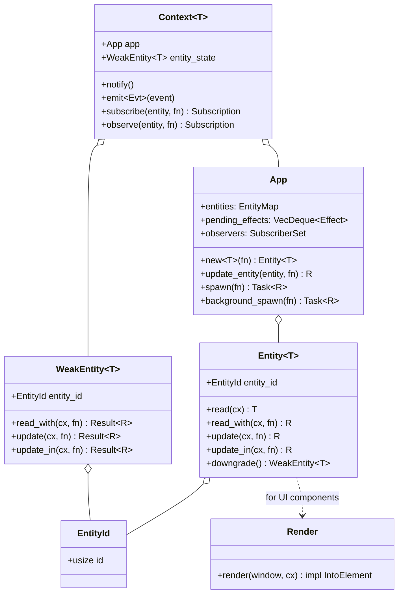
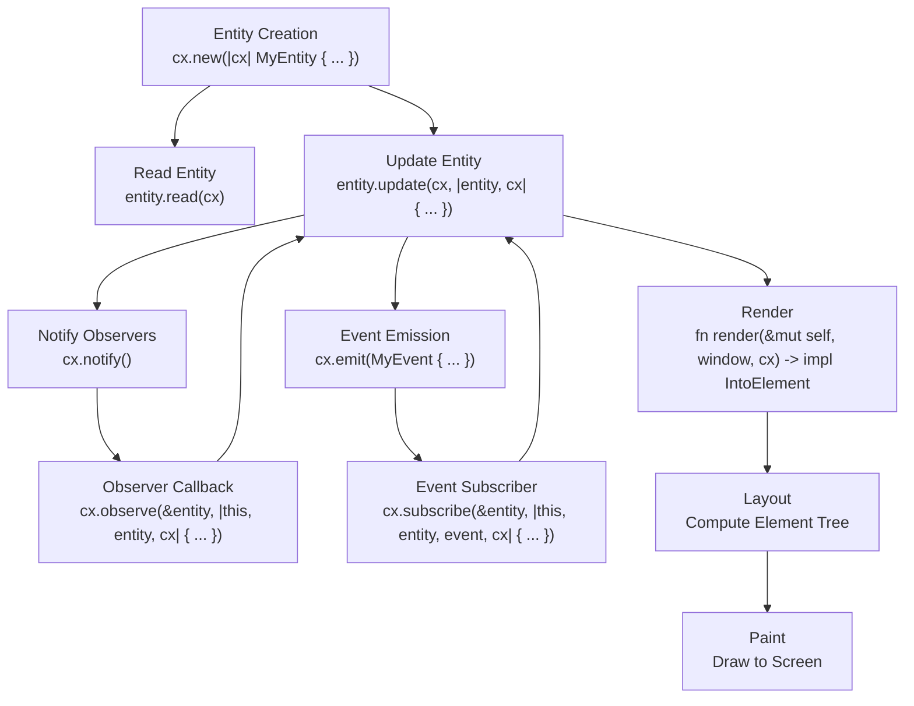

# Cloud Level: Entity System

## Purpose

The Entity System is the backbone of Zed's state management and UI architecture. It provides a structured approach to managing application state through strongly-typed entities with automatic memory management, an observer system for reactive updates, and integration with the UI rendering system. The entity system enables Zed to maintain a clean separation between data and presentation while supporting complex state transitions and reactive UI updates.

## Concepts

* **Entity**: A strongly-typed container for state that can be observed, updated, and used in UI rendering
* **Context**: A mechanism for interacting with entities and the application environment
* **Observer Pattern**: A system for entities to react to changes in other entities
* **Event System**: A decoupled communication mechanism between entities
* **Reference Management**: Automatic memory management through reference counting
* **Effect System**: Batched processing of side effects for efficiency
* **Render Integration**: Seamless connection between entity state and UI elements

## Architecture

The Entity System is built around a few core components that work together to provide state management with reactive UI updates:



### Core Components

1. **EntityId**: A unique identifier generated through the slotmap crate, providing stable IDs with fast lookup.

2. **Entity\<T\>**: A strongly-typed handle to state of type T with operations to read and update the state.

3. **WeakEntity\<T\>**: A weak reference that doesn't prevent an entity from being dropped, used to avoid reference cycles.

4. **EntityMap**: Internal storage that maps EntityIds to their state, tracking reference counts and access patterns.

5. **App**: The application context that manages entities, effects, and provides methods for entity creation and updates.

6. **Context\<T\>**: A typed context for interacting with a specific entity and the application environment.

7. **Render Trait**: Interface for UI components to transform their state into visual elements.

### State Flow



## Implementation Details

### Entity Creation

Entity creation involves reserving a slot in the entity map, building the entity with a specific context, and returning a handle:

```rust
pub fn new<T: 'static>(&mut self, build_entity: impl FnOnce(&mut Context<T>) -> T) -> Entity<T> {
    self.update(|cx| {
        // Reserve a slot with a unique EntityId
        let slot = cx.entities.reserve();
        let handle = slot.clone();
        
        // Build the entity with its own context
        let entity = build_entity(&mut Context::new_context(cx, slot.downgrade()));
        
        // Queue an effect signaling entity creation
        cx.push_effect(Effect::EntityCreated {
            entity: handle.clone().into_any(),
            tid: TypeId::of::<T>(),
            window: cx.window_update_stack.last().cloned(),
        });
        
        // Store the entity in the map
        cx.entities.insert(slot, entity);
        handle
    })
}
```

Typical usage pattern:

```rust
// Create a new editor entity
let editor = cx.new(|cx| {
    Editor::new(
        buffer,
        editor_style,
        workspace,
        project,
        extension_registry,
        cx,
    )
});
```

### Entity Access and Update

Entities provide methods to read and update their state:

```rust
// Read-only access
pub fn read<'a>(&self, cx: &'a App) -> &'a T {
    cx.entities.read(self)
}

// With a custom function
pub fn read_with<R>(&self, cx: &App, read: impl FnOnce(&T, &App) -> R) -> R {
    cx.entities.read_with(self, read, cx)
}

// Update with mutation
pub fn update<R, C: AppContext>(
    &self,
    cx: &mut C,
    update: impl FnOnce(&mut T, &mut Context<T>) -> R,
) -> C::Result<R> {
    cx.update_entity(self, update)
}

// Update with window access
pub fn update_in<R, C: VisualContext>(
    &self,
    cx: &mut C,
    update: impl FnOnce(&mut T, &mut Window, &mut Context<T>) -> R,
) -> C::Result<R> {
    cx.update_window_entity(self, update)
}
```

When updating an entity:
1. The entity is leased (temporarily removed from the EntityMap)
2. The update closure is called with the entity state and a context
3. The entity is returned to the EntityMap when done

This prevents concurrent updates to the same entity, ensuring thread safety.

### Observation and Notification

Entities can observe changes in other entities:

```rust
pub fn observe<W>(
    &mut self,
    entity: &Entity<W>,
    mut on_notify: impl FnMut(&mut T, Entity<W>, &mut Context<T>) + 'static,
) -> Subscription
```

When an entity's state changes, it notifies observers:

```rust
pub fn notify(&mut self) {
    self.app.notify(self.entity_state.entity_id);
}
```

This adds an effect to the pending queue, which will be processed during the effect flush cycle.

### Event System

Entities can emit events:

```rust
pub fn emit<Evt>(&mut self, event: Evt)
where
    T: EventEmitter<Evt>,
    Evt: 'static,
```

Other entities can subscribe to these events:

```rust
pub fn subscribe<T2, Evt>(
    &mut self,
    entity: &Entity<T2>,
    mut on_event: impl FnMut(&mut T, Entity<T2>, &Evt, &mut Context<T>) + 'static,
) -> Subscription
```

This allows for decoupled communication between entities.

### UI Integration

Entities that represent UI components implement the `Render` trait:

```rust
impl Render for MyComponent {
    fn render(&mut self, window: &mut Window, cx: &mut Context<Self>) -> impl IntoElement {
        div()
            .flex()
            .gap_2()
            .child(label("Hello"))
            .child(button("Click me").on_click(cx.listener(|this, _event, window, cx| {
                this.clicked = true;
                cx.notify();
            })))
    }
}
```

The `Entity<T>` type implements the `Element` trait, allowing entity handles to be used directly in UI construction:

```rust
div().child(my_entity)
```

### Async Support

The entity system supports async operations through various context types:

```rust
// Background work (other threads)
let task = cx.background_spawn(async move {
    // Heavy computation here
    process_data()
});

// Foreground task (UI thread)
cx.spawn(async move |cx| {
    // Wait for background work
    let result = task.await;
    
    // Update UI with result
    cx.update_entity(entity, |entity, cx| {
        entity.update_with_result(result);
        cx.notify(); // Trigger re-render
    })
}).detach();
```

Tasks need proper management:
- `await` them within another async context
- `detach()` or `detach_and_log_err(cx)` to let them run independently
- Store them in a field to tie their lifetime to an owner

## State Management Patterns

### Component Composition

Entities can be composed through ownership relationships:

```rust
struct ParentComponent {
    child: Entity<ChildComponent>,
    _subscriptions: Vec<Subscription>,
}

impl ParentComponent {
    pub fn new(cx: &mut Context<Self>) -> Self {
        let child = cx.new(|cx| ChildComponent::new(cx));
        
        let mut subscriptions = Vec::new();
        
        // Subscribe to child events
        subscriptions.push(cx.subscribe(&child, |this, _child, event, cx| {
            this.handle_child_event(event, cx);
        }));
        
        Self {
            child,
            _subscriptions: subscriptions,
        }
    }
}
```

### Subscriptions and Cleanup

Entities store subscriptions to ensure proper cleanup:

```rust
struct MyComponent {
    _subscriptions: Vec<Subscription>,
}

impl MyComponent {
    fn new(other_entity: &Entity<OtherComponent>, cx: &mut Context<Self>) -> Self {
        let mut subscriptions = Vec::new();
        
        // Observe other entity
        subscriptions.push(cx.observe(other_entity, |this, other, cx| {
            // React to changes
            this.value = other.read(cx).some_value;
            cx.notify();
        }));
        
        Self {
            _subscriptions: subscriptions,
        }
    }
}
```

When an entity is dropped, all its subscriptions are automatically cleaned up.

### Concurrency Patterns

The entity system supports a single-threaded model for UI with background tasks for heavy work:

```rust
fn perform_heavy_task(&mut self, cx: &mut Context<Self>) {
    // Start background work
    let work = cx.background_spawn(async move {
        // Run on separate thread
        compute_expensive_result()
    });
    
    // Handle the result on the UI thread
    self.pending_task = Some(cx.spawn(async move |this, cx| {
        let result = work.await;
        
        this.update(cx, |this, cx| {
            this.result = result;
            this.pending_task = None;
            cx.notify();
        })
    }));
}
```

This pattern allows for responsive UIs while performing computational work.

## Swift Reimplementation Considerations

### Type System and Memory Management

Swift's ARC (Automatic Reference Counting) system is similar to Rust's ownership model but with important differences:

1. Use `final class` for entity state with appropriate reference management:

```swift
final class EntityState<T> {
    private let id: EntityId
    private weak var entityMap: EntityMap?
    private let state: T
    
    // Implement reference counting
}
```

2. Implement strong and weak reference types:

```swift
struct Entity<T> {
    private let state: EntityState<T>
    
    func read<R>(_ app: App, _ fn: (T, App) -> R) -> R {
        // Implementation
    }
    
    func update<R>(_ cx: Context, _ fn: (inout T, Context) -> R) -> R {
        // Implementation
    }
    
    func downgrade() -> WeakEntity<T> {
        // Create weak reference
    }
}

struct WeakEntity<T> {
    private weak var state: EntityState<T>?
    
    func upgrade() -> Entity<T>? {
        // Try to create strong reference
    }
}
```

### Handling Closures and Type Erasure

Swift has excellent closure support but handles type erasure differently:

1. Use Swift's generic closures for entity operations:

```swift
func observe<W>(_ entity: Entity<W>, _ handler: @escaping (inout T, Entity<W>, Context) -> Void) -> Subscription {
    // Implementation
}
```

2. For type erasure, use Swift's `Any` type with appropriate type checking:

```swift
func emit<E: Event>(_ event: E) {
    app.queueEffect(.emit(emitter: entityId, eventType: ObjectIdentifier(E.self), event: event))
}

func subscribe<T2, E: Event>(_ entity: Entity<T2>, _ handler: @escaping (inout T, Entity<T2>, E, Context) -> Void) -> Subscription {
    // Implementation with type checking
}
```

### Concurrency Model

Leverage Swift's modern concurrency features:

1. Use Swift's async/await instead of custom task types:

```swift
func backgroundTask<T>(_ work: @escaping () async -> T) async -> T {
    await Task.detached(priority: .background) {
        await work()
    }.value
}

func updateAfterBackground<T, R>(_ work: @escaping () async -> T, _ update: @escaping (inout Self, T) -> R) {
    Task {
        let result = await backgroundTask(work)
        await MainActor.run {
            self.update { entity, cx in
                update(&entity, result)
            }
        }
    }
}
```

2. Use Swift's actors for thread safety:

```swift
actor EntityMap {
    private var entities: [EntityId: Any] = [:]
    
    func insert<T>(_ id: EntityId, _ entity: T) {
        entities[id] = entity
    }
    
    func read<T>(_ id: EntityId) -> T? {
        entities[id] as? T
    }
}
```

### UI Integration

Swift's SwiftUI provides similar reactive UI patterns:

1. Create a binding system between entities and SwiftUI views:

```swift
struct EntityView<T: Render, Content: View>: View {
    let entity: Entity<T>
    let content: (T, Context) -> Content
    @StateObject private var observer = EntityObserver()
    
    var body: some View {
        content(observer.state, observer.context)
            .onAppear {
                observer.observe(entity)
            }
    }
}
```

2. Replace the Render trait with a Swift protocol:

```swift
protocol Render {
    associatedtype Body: View
    func render(window: Window, context: Context<Self>) -> Body
}
```

## References to Other Components

- [GPUI Framework](./22_AtmosphericView_UIComponents.md): The entity system is a core part of GPUI
- [Buffer and Rope](./23_CloudLevel_RopeAlgorithms.md): Entities are used to manage buffer state
- [Operational Transform](./26_CloudLevel_OperationalTransform.md): Collaborative editing uses the entity system
- [Editor Component](./16_CloudLevel_EditorComponent.md): The editor is built as a complex entity
- [UI Layout](./28_CloudLevel_UILayout.md): Entity rendering connects to the layout system