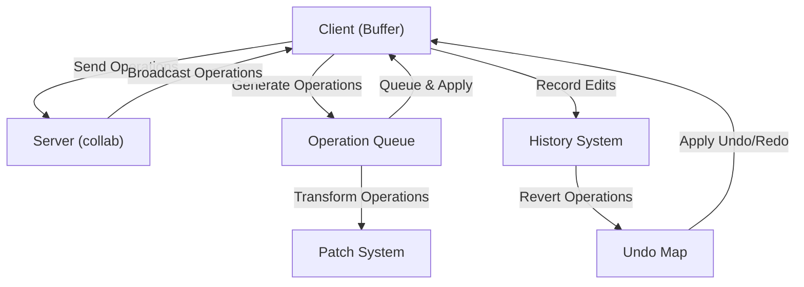

# Cloud Level: Operational Transform

## Purpose

The Operational Transform (OT) system in Zed enables real-time collaborative editing, allowing multiple users to simultaneously edit the same text while maintaining consistency across all clients. It resolves conflicts between concurrent edits, ensures that all users eventually see the same content regardless of the order in which operations are received, and provides a foundation for features like shared editing sessions, multiplayer, and channel buffers.

## Concepts

* **Operation**: A description of a change to a text buffer, including insertions and deletions
* **Transform**: A process of adjusting operations to account for the effects of concurrent operations
* **Conflict Resolution**: Rules for handling when two users edit the same region of text
* **Causality**: The relationship between operations that ensures they are applied in a consistent order
* **Lamport Timestamps**: Logical clocks used to establish a partial ordering of events in a distributed system
* **Convergence**: The property that all clients eventually reach the same state after applying all operations

## Architecture

Zed's operational transform implementation is integrated into its text editing system and collaborative features. The architecture spans multiple components:



### Core Components

1. **Operation System**: Represents edits to text buffers, including:
   - The `Edit` struct representing a range replacement in a text buffer
   - The `Operation` type describing text edits with timestamps 
   - The `Patch` system for composing and transforming edits

2. **Buffer Collaboration**: Manages shared editing sessions with:
   - Operation queues to buffer pending operations
   - Lamport clocks for establishing causal ordering
   - Remote operation handling and transformation

3. **Server Components**: The collab crate provides:
   - Operation storage and serialization
   - Broadcasting operations to connected clients
   - Persistence of buffer state and operations
   - Reconciliation of concurrent changes

4. **Client Integration**: Editor components that:
   - Generate operations from local edits
   - Apply remote operations
   - Handle synchronization and conflict resolution

## Implementation Details

### Operations and Edits

The core of Zed's OT system begins with the `Edit` data structure:

```rust
#[derive(Clone, Debug, Default, Eq, PartialEq)]
pub struct Edit<D> {
    pub old: Range<D>,
    pub new: Range<D>,
}
```

This represents a text edit where a range in the original text is replaced with a new range. In a collaborative context, operations are tracked with timestamps:

```rust
pub trait Operation: Clone + Debug {
    fn lamport_timestamp(&self) -> clock::Lamport;
}

#[derive(Clone, Debug)]
pub struct OperationQueue<T: Operation>(SumTree<OperationItem<T>>);
```

The `OperationQueue` is a specialized data structure that maintains operations sorted by their Lamport timestamps, which ensures a consistent ordering across clients.

### Patch Composition and Transformation

The `Patch` system is crucial for operational transformation. It handles the composition of multiple edits and the transformation of concurrent operations:

```rust
#[derive(Clone, Default, Debug, PartialEq, Eq)]
pub struct Patch<T>(Vec<Edit<T>>);

impl<T> Patch<T> 
where
    T: /* various trait bounds */
{
    pub fn compose(&self, new_edits_iter: impl IntoIterator<Item = Edit<T>>) -> Self {
        // Implementation that composes this patch with new edits
    }
    
    pub fn invert(&mut self) -> &mut Self {
        // Implementation that inverts this patch (for undo)
    }
}
```

The `compose` method is particularly important for OT as it combines sequences of edits while preserving their intent. When a client receives a remote operation that was generated concurrently with a local operation, the system uses composition and transformation to ensure both operations achieve their intended effect.

### Conflict Resolution Strategy

When concurrent edits occur to the same region of text, Zed uses a conflict resolution strategy that preserves the intent of both users' edits:

1. **Insertion Ordering**: Insertions at the same position are ordered by their Lamport timestamps, with earlier insertions appearing first
2. **Deletion Conflict**: When one user deletes text that another has edited, the deletion has precedence
3. **Edit Transformation**: Operations are transformed against all concurrent operations that precede them in the causality order

This conflict resolution approach ensures convergence (all clients eventually reach the same state) and preserves intention (edits have their intended effect whenever possible).

### Remote Operation Handling

When a remote operation is received, it's processed through several steps:

```rust
fn apply_remote_edit(
    &mut self,
    version: &clock::Global,
    ranges: &[Range<FullOffset>],
    new_text: &[Arc<str>],
    timestamp: clock::Lamport,
) {
    // 1. Check if ranges are empty
    if ranges.is_empty() {
        return;
    }

    // 2. Transform the remote edits based on concurrent operations
    let edits = ranges.iter().zip(new_text.iter());
    let mut edits_patch = Patch::default();
    
    // 3. Apply the transformed edits to the local buffer
    // Implementation handles complex cases of concurrent edits
}
```

The system tracks a global version vector to establish causality between operations, ensuring that concurrent operations are correctly identified and transformed.

### History and Undo System

Collaborative editing requires a sophisticated undo system that understands both local and remote operations:

```rust
struct History {
    operations: BTreeMap<clock::Lamport, Operation>,
    undo_stack: Vec<HistoryEntry>,
    redo_stack: Vec<HistoryEntry>,
    transaction_depth: usize,
    group_interval: Duration,
}
```

The history system maintains separate undo and redo stacks with transaction support. When a user undoes an operation, it generates a new inverse operation that's transmitted to all collaborators, rather than literally rewinding the document state.

### Client-Server Protocol

The client-server protocol for OT involves several types of messages:

1. **Operation Broadcast**: Server broadcasts operations to all connected clients
2. **Acknowledgment**: Clients acknowledge receipt of operations
3. **Version Vectors**: Clients and server exchange version vectors to track causality
4. **Presence Updates**: Server notifies clients about collaborator status

```rust
// Server-side buffer operation table schema
pub struct Model {
    pub buffer_id: BufferId,
    pub epoch: i32,
    pub lamport_timestamp: i32,
    pub replica_id: i32,
    pub value: Vec<u8>, // Serialized operation
}
```

The server stores operations with their lamport timestamps and replica IDs, which are necessary for reconstructing the order and causality relationships between operations.

### Testing and Verification

Zed's OT implementation includes comprehensive randomized testing that verifies convergence and correctness:

```rust
#[gpui::test(
    iterations = 100,
    on_failure = "crate::tests::save_randomized_test_plan"
)]
async fn test_random_channel_buffers(
    cx: &mut TestAppContext,
    executor: BackgroundExecutor, 
    rng: StdRng,
) {
    run_randomized_test::<RandomChannelBufferTest>(cx, executor, rng).await;
}
```

These tests generate random sequences of operations across multiple simulated clients and verify that all clients converge to the same final state, which is essential for ensuring correctness in complex collaborative scenarios.

## Swift Reimplementation Considerations

### Core Data Structures

The Swift implementation will need equivalent data structures with similar performance characteristics:

```swift
struct Edit<Offset> {
    var oldRange: Range<Offset>
    var newRange: Range<Offset>
}

struct Operation {
    var timestamp: Lamport
    var edits: [Edit<Int>]
    var replicaId: Int
}

class OperationQueue {
    private var operations: [Operation] = []
    
    func insert(_ operation: Operation) {
        // Insert operation in lamport timestamp order
    }
    
    func drain() -> [Operation] {
        let result = operations
        operations = []
        return result
    }
}
```

### Concurrency and Thread Safety

Swift's concurrency model differs from Rust, so the OT system should leverage Swift's modern concurrency features:

```swift
actor BufferCollaborationActor {
    private var pendingOperations: OperationQueue = OperationQueue()
    private var version: VersionVector = VersionVector()
    
    func applyLocalEdit(range: Range<Int>, newText: String) async -> Operation {
        // Generate and apply local operation
        // Return operation for transmission
    }
    
    func applyRemoteOperation(_ operation: Operation) async {
        // Apply remote operation with appropriate transformation
    }
}
```

Using Swift's actor model provides similar safety guarantees to Rust's ownership system while leveraging Swift's natural asynchronous programming model.

### Conflict Resolution Implementation

The conflict resolution algorithm in Swift would follow the same principles:

```swift
extension Patch {
    func compose(with newEdits: [Edit<Int>]) -> Patch {
        var composed = Patch(edits: [])
        
        // Composition algorithm similar to Rust implementation
        // with Swift-specific optimizations
        
        return composed
    }
    
    func transform(against other: Patch) -> Patch {
        // Transform this patch against the other patch
        // following OT principles
    }
}
```

### Network Protocol Adaptation

The network protocol should be designed to work efficiently with Swift's networking APIs:

```swift
class CollaborationClient {
    private let socket: WebSocketTask
    private let bufferActor: BufferCollaborationActor
    
    func sendOperation(_ operation: Operation) async {
        let message = try encodeOperation(operation)
        try await socket.send(.data(message))
    }
    
    func processIncomingMessage(_ data: Data) async {
        let operation = try decodeOperation(data)
        await bufferActor.applyRemoteOperation(operation)
    }
}
```

### Testing Strategy

The Swift implementation should include similarly rigorous testing:

```swift
class OperationalTransformTests: XCTestCase {
    func testRandomizedOperations() async throws {
        // Create multiple simulated clients
        // Generate random operations
        // Verify convergence
    }
    
    func testConcurrentInsertions() async throws {
        // Test specific conflict cases
    }
    
    func testConcurrentDeletions() async throws {
        // Test specific conflict cases
    }
}
```

## References to Other Components

- [Buffer and Rope](./23_CloudLevel_RopeAlgorithms.md): The text buffer system that OT operates on
- [Entity System](./25_CloudLevel_EntitySystem.md): The state management system that integrates with OT
- [Cloud Level: Collaborative Editing](./06_StratosphericView_CollaborationSystem.md): The higher-level collaborative features built on OT
- [Task Scheduling](./27_CloudLevel_TaskScheduling.md): Concurrency model used by the OT system