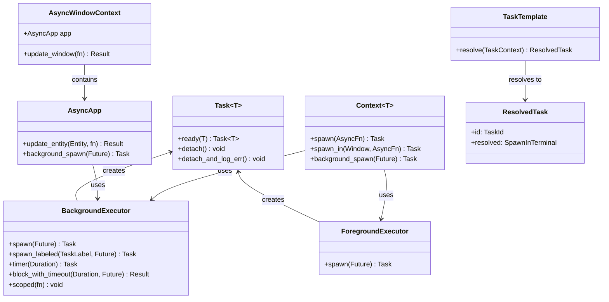

# Cloud Level: Task Scheduling

## Purpose

The Task Scheduling system in Zed provides a robust architecture for managing concurrent operations, both in the UI foreground and background threads. It enables asynchronous execution of potentially long-running operations while maintaining UI responsiveness, handles cancellation and error propagation, and provides a structured way to execute tasks in terminals. The system is fundamental to Zed's responsiveness and ability to perform complex operations without blocking the user interface.

## Concepts

* **Foreground Tasks**: Operations that run on the UI thread, ensuring they can safely access and modify UI state
* **Background Tasks**: Operations that run on separate threads to avoid blocking the UI, typically for computationally intensive work
* **Task Lifecycle**: The creation, execution, and cleanup of asynchronous operations
* **Cancellation**: The ability to terminate a task before it completes its work
* **Context Propagation**: Maintaining access to application state across async boundaries
* **Effect System**: Batched processing of side effects resulting from task execution
* **Terminal Tasks**: Shell commands that run in terminal instances

## Architecture

The task scheduling system in Zed spans multiple components with different responsibilities:



### Core Components

1. **Task System**
   - `Task<T>`: A future representing an operation that will eventually produce a value of type T
   - `BackgroundExecutor`: Manages tasks running on background threads
   - `ForegroundExecutor`: Manages tasks running on the UI thread

2. **Async Contexts**
   - `AsyncApp`: A version of `App` that can be held across await points
   - `AsyncWindowContext`: Combines an `AsyncApp` with a window reference
   - `Context<T>`: A specialized version of `App` for a specific entity type

3. **Effect System**
   - Batches side effects like notifications and events
   - Ensures consistent state updates across asynchronous boundaries

4. **Terminal Tasks**
   - `TaskTemplate`: A template for a task with variables
   - `ResolvedTask`: A fully resolved task ready to be executed
   - `SpawnInTerminal`: Contains information to spawn a task in a terminal

## Implementation Details

### Task Creation and Management

Tasks in Zed are created through various spawn methods:

```rust
// Create a background task
let task = cx.background_spawn(async move {
    // Heavy computation here
    process_data()
});

// Create a foreground task
let task = cx.spawn(async move |cx| {
    // UI update here
    update_ui(cx)
});

// Create a foreground task with entity access
let task = context.spawn(async move |entity, cx| {
    // Access entity state across await points
    entity.update(cx, |entity, cx| {
        entity.do_something();
    })
});

// Create a window-specific task
let task = context.spawn_in(window, async move |entity, cx| {
    // Access entity and window across await points
    entity.update_in(cx, |entity, window, cx| {
        entity.do_something_with_window(window);
    })
});
```

Each task returns a `Task<T>` object that implements `Future`, allowing it to be awaited. Tasks are cancelled if their handle is dropped, unless explicitly detached.

### Cancellation and Cleanup

Zed provides several mechanisms for task cancellation and cleanup:

```rust
// Option 1: Await the task (prevents cancellation)
let result = task.await;

// Option 2: Detach the task (allows it to run to completion)
task.detach();

// Option 3: Detach and log any errors
task.detach_and_log_err(cx);

// Option 4: Store the task in a field (cancelled when owner is dropped)
self.pending_task = Some(task);
```

The `Scope` API also provides a way to spawn multiple tasks and ensure they all complete before returning:

```rust
executor.scoped(|scope| {
    for i in 0..10 {
        scope.spawn(async move {
            process_item(i).await;
        });
    }
    // All tasks will complete before returning
});
```

### Context Propagation

Async contexts allow entity state to be safely accessed across await points:

```rust
cx.spawn(async move |cx| {
    // Background work
    let data = fetch_data().await;
    
    // Update UI with result
    cx.update_entity(entity, |entity, cx| {
        entity.update_with_data(data);
        cx.notify(); // Trigger re-render
    })
}).detach();
```

For entity-specific operations, specialized spawn methods provide access to the entity's state:

```rust
context.spawn(async move |entity, cx| {
    // Background work
    let data = fetch_data().await;
    
    // Update entity state
    entity.update(cx, |entity, cx| {
        entity.update_with_data(data);
        cx.notify(); // Trigger re-render
    })
}).detach();
```

### Effect System

The effect system ensures that side effects are processed in batched fashion:

```rust
// Queue an effect to be processed later
cx.push_effect(Effect::Notify { entity: entity_id });

// Emit an event (queued as an effect)
cx.emit(MyEvent { data: 42 });

// Notify observers (queued as an effect)
cx.notify();
```

Effects are processed at the end of update cycles, ensuring consistent state updates.

### Terminal Tasks

The terminal task system provides a way to execute shell commands:

```rust
// Define a task template
let template = TaskTemplate {
    label: "Build Project",
    command: "cargo",
    args: vec!["build", "--release"],
    env: HashMap::new(),
    cwd: None,
    reveal: RevealStrategy::Always,
    ..Default::default()
};

// Resolve the template with context
let resolved = template.resolve(&task_context);

// Execute the task in a terminal
terminal.spawn_task(resolved.resolved);
```

Task templates support variable substitution, allowing dynamic task parameters:

```rust
// Define a task with variables
let template = TaskTemplate {
    label: "Run Current File",
    command: "node",
    args: vec!["${ZED_FILE}"],
    ..Default::default()
};

// Context with file information
let mut context = TaskContext::default();
context.task_variables.insert(VariableName::File, "/path/to/file.js".to_string());

// Resolve variables
let resolved = template.resolve(&context);
// resolved.resolved.command = "node"
// resolved.resolved.args = ["/path/to/file.js"]
```

## Usage Patterns

### Background Processing Pattern

For heavy computations that shouldn't block the UI:

```rust
fn process_heavy_data(&mut self, cx: &mut Context<Self>) {
    // Start background work
    let work = cx.background_spawn(async move {
        // Run on separate thread
        process_large_dataset()
    });
    
    // Handle the result on the UI thread
    self.pending_task = Some(cx.spawn(async move |this, cx| {
        let result = work.await;
        
        this.update(cx, |this, cx| {
            this.result = result;
            this.pending_task = None;
            cx.notify();
        })
    }));
}
```

### Entity Observation Pattern

For reacting to changes in other entities:

```rust
fn observe_other_entity(&mut self, other: &Entity<OtherEntity>, cx: &mut Context<Self>) {
    // Observe changes to other entity
    self._subscriptions.push(cx.observe(other, |this, other, cx| {
        // Read state from other entity
        let other_state = other.read(cx).state.clone();
        
        // Update our state
        this.other_state = other_state;
        cx.notify();
    }));
}
```

### Window Task Pattern

For tasks that need to update window state:

```rust
fn perform_window_operation(&mut self, window: &Window, cx: &mut Context<Self>) {
    // Start async operation
    self.pending_task = Some(cx.spawn_in(window, async move |this, cx| {
        // Perform async work
        let result = fetch_data().await;
        
        // Update window with result
        this.update_in(cx, |this, window, cx| {
            this.update_window_with_result(result, window);
            cx.notify();
        })
    }));
}
```

### Task Composition Pattern

For coordinating multiple dependent tasks:

```rust
fn perform_multi_stage_task(&mut self, cx: &mut Context<Self>) {
    // Initial task
    self.pending_task = Some(cx.spawn(async move |this, cx| {
        // First stage
        let stage1_result = fetch_data().await;
        
        // Second stage (depends on first stage)
        let stage2_result = process_data(stage1_result).await;
        
        // Update with final result
        this.update(cx, |this, cx| {
            this.result = stage2_result;
            this.pending_task = None;
            cx.notify();
        })
    }));
}
```

### Terminal Task Pattern

For executing shell commands in terminal tabs:

```rust
fn run_in_terminal(&mut self, terminal_view: &Entity<TerminalView>, cx: &mut Context<Self>) {
    // Create task template
    let template = TaskTemplate {
        label: "Run Tests",
        command: "npm",
        args: vec!["test"],
        cwd: Some(self.project_root.clone()),
        reveal: RevealStrategy::Always,
        ..Default::default()
    };
    
    // Resolve task with context
    let task = template.resolve(&self.task_context);
    
    // Execute in terminal
    terminal_view.update(cx, |terminal, cx| {
        terminal.spawn_task(task.resolved);
    });
}
```

### Timer Pattern

For delayed operations:

```rust
fn schedule_delayed_operation(&mut self, cx: &mut Context<Self>) {
    // Create a timer
    let delay = cx.background_executor().timer(Duration::from_secs(5));
    
    // Execute after delay
    self.pending_task = Some(cx.spawn(async move |this, cx| {
        delay.await;
        
        this.update(cx, |this, cx| {
            this.perform_delayed_operation();
            this.pending_task = None;
            cx.notify();
        })
    }));
}
```

## Swift Reimplementation Considerations

### Modern Swift Concurrency

Swift's built-in concurrency system with async/await and actors provides a natural fit for reimplementing Zed's task system:

```swift
// Task types
struct Task<T> {
    let task: Swift.Task<T, Error>
    
    static func ready(_ value: T) -> Task<T> {
        Task(task: Swift.Task { value })
    }
    
    func detach() {
        // Allow task to continue running
    }
}

// Background executor
class BackgroundExecutor {
    func spawn<T>(_ work: @escaping () async -> T) -> Task<T> {
        let task = Swift.Task.detached {
            await work()
        }
        return Task(task: task)
    }
    
    func timer(_ duration: Duration) -> Task<Void> {
        Task(task: Swift.Task {
            try await Task.sleep(for: .seconds(duration.seconds))
        })
    }
}

// Foreground executor using MainActor
@MainActor
class ForegroundExecutor {
    func spawn<T>(_ work: @escaping () async -> T) -> Task<T> {
        let task = Swift.Task {
            await work()
        }
        return Task(task: task)
    }
}
```

### Actor-Based Contexts

Swift's actor model provides a natural fit for the context system:

```swift
// Entity-specific context
actor EntityContext<T: Entity> {
    private weak var entity: T?
    private let app: App
    
    init(entity: T, app: App) {
        self.entity = entity
        self.app = app
    }
    
    func update<R>(_ updateFn: @escaping (inout T) -> R) async -> R? {
        guard let entity = entity else { return nil }
        return await entity.update(updateFn)
    }
    
    func notify() {
        Task {
            await app.notify(entity?.id)
        }
    }
    
    func spawn<R>(_ work: @escaping (WeakEntity<T>) async -> R) -> Swift.Task<R?, Error> {
        Swift.Task {
            guard let entity = entity else { return nil }
            return await work(WeakEntity(entity))
        }
    }
}
```

### Terminal Task System

Swift's property wrappers can provide a clean API for task templates:

```swift
struct TaskTemplate {
    var label: String
    var command: String
    var args: [String]
    var env: [String: String] = [:]
    var cwd: URL?
    var reveal: RevealStrategy = .always
    
    func resolve(with context: TaskContext) -> ResolvedTask {
        // Substitute variables
        let resolvedCommand = substituteVariables(command, context: context)
        let resolvedArgs = args.map { substituteVariables($0, context: context) }
        
        return ResolvedTask(
            id: TaskId(UUID().uuidString),
            original: self,
            resolved: SpawnInTerminal(
                command: resolvedCommand,
                args: resolvedArgs,
                // Other fields...
            )
        )
    }
}

// Usage
let template = TaskTemplate(
    label: "Run Current File",
    command: "node",
    args: ["${ZED_FILE}"]
)
```

### Effect System

Swift's concurrency model can implement the effect system using actors and tasks:

```swift
actor EffectSystem {
    private var pendingEffects: [Effect] = []
    
    func pushEffect(_ effect: Effect) {
        pendingEffects.append(effect)
    }
    
    func flushEffects() async {
        let effects = pendingEffects
        pendingEffects = []
        
        for effect in effects {
            switch effect {
            case .notify(let entityId):
                await notifyObservers(entityId)
            case .emit(let emitterId, let eventType, let event):
                await emitEvent(emitterId, eventType: eventType, event: event)
            // Other effect types...
            }
        }
    }
}
```

## References to Other Components

- [Entity System](./25_CloudLevel_EntitySystem.md): Tasks interact closely with the entity system for state management
- [Operational Transform](./26_CloudLevel_OperationalTransform.md): Collaborative editing relies on task scheduling for concurrent operations
- [AtmosphericView_TaskSystem](./19_AtmosphericView_TaskSystem.md): Higher-level view of the task system including terminal tasks
- [UILayout](./28_CloudLevel_UILayout.md): UI updates often happen as a result of task completion