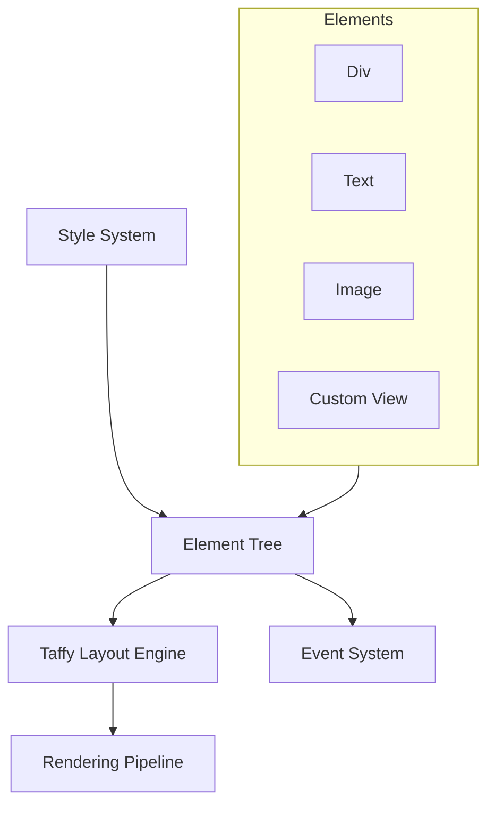

# Cloud Level: UI Layout

## Purpose

The UI Layout system in Zed provides a structured approach to arranging and rendering UI elements on screen. It implements a flexbox-inspired layout algorithm, combined with a declarative styling system similar to CSS/Tailwind, and a rendering pipeline that efficiently translates layout information into pixels. This system enables the creation of complex, responsive user interfaces while maintaining performance and consistency across the application.

## Concepts

* **Elements**: The core building blocks of the UI that handle layout, rendering, and interaction
* **Flexbox Layout**: A layout algorithm based on web standards for arranging elements
* **Style System**: Declarative styling properties inspired by CSS/Tailwind
* **Rendering Pipeline**: The process of translating layout information into pixels
* **Event Handling**: Processing user interactions with UI elements
* **Component Model**: Reusable UI patterns composed from primitive elements

## Architecture

The UI Layout system in Zed consists of several interconnected components:



### Core Components

1. **Element System**: The foundation of UI rendering in Zed
   - `Element` trait for layout and rendering
   - `IntoElement` for conversion to elements
   - `Render` for view components
   - `RenderOnce` for lightweight components

2. **Taffy Layout Engine**: An implementation of the flexbox layout algorithm
   - Computes element positions and sizes
   - Manages layout constraints and overflow
   - Handles resizing and reflow

3. **Style System**: Declarative styling properties
   - Flexbox properties (direction, alignment, justification)
   - Visual properties (colors, borders, shadows)
   - Sizing and positioning properties
   - Pseudo-state styling (hover, focus, etc.)

4. **Rendering Pipeline**: Translates layout into pixels
   - Metal rendering for macOS
   - DirectX for Windows
   - OpenGL/Vulkan for Linux
   - Batched rendering for performance

5. **Event System**: Handles user interactions
   - Mouse events (click, hover, drag)
   - Keyboard events
   - Focus management
   - Event propagation (capture and bubble phases)

## Implementation Details

### Element System

The `Element` trait is the core abstraction for UI components:

```rust
pub trait Element: 'static + IntoElement {
    type RequestLayoutState: 'static;
    type PrepaintState: 'static;

    fn id(&self) -> Option<ElementId>;

    fn request_layout(
        &mut self,
        id: Option<&GlobalElementId>,
        window: &mut Window,
        cx: &mut App,
    ) -> (LayoutId, Self::RequestLayoutState);

    fn prepaint(
        &mut self,
        id: Option<&GlobalElementId>,
        bounds: Bounds<Pixels>,
        request_layout: &mut Self::RequestLayoutState,
        window: &mut Window,
        cx: &mut App,
    ) -> Self::PrepaintState;

    fn paint(
        &mut self,
        id: Option<&GlobalElementId>,
        bounds: Bounds<Pixels>,
        request_layout: &mut Self::RequestLayoutState,
        prepaint: &mut Self::PrepaintState,
        window: &mut Window,
        cx: &mut App,
    );
}
```

The `Element` lifecycle consists of three phases:
1. `request_layout`: Requests layout from the Taffy engine
2. `prepaint`: Prepares for painting based on computed bounds
3. `paint`: Renders the element to the screen

The `Render` trait ties the element system to GPUI's entity system:

```rust
pub trait Render: 'static + Sized {
    fn render(&mut self, window: &mut Window, cx: &mut Context<Self>) -> impl IntoElement;
}
```

This trait is implemented by entity types that represent UI components, allowing them to produce elements for rendering.

### Layout Engine

Zed uses the Taffy layout engine for flexbox-style layout:

```rust
pub struct TaffyLayoutEngine {
    taffy: TaffyTree<NodeContext>,
    absolute_layout_bounds: FxHashMap<LayoutId, Bounds<Pixels>>,
    computed_layouts: FxHashSet<LayoutId>,
}
```

Layout computation happens in several stages:
1. Request layout for each element, creating a layout tree
2. Compute layout with available space constraints
3. Apply layout to position elements within their parent bounds

Layout is computed lazily and cached for performance:

```rust
pub fn compute_layout(
    &mut self,
    id: LayoutId,
    available_space: Size<AvailableSpace>,
    window: &mut Window,
    cx: &mut App,
) {
    if !self.computed_layouts.insert(id) {
        // Clear cached layout when recomputing
        let mut stack = SmallVec::<[LayoutId; 64]>::new();
        stack.push(id);
        while let Some(id) = stack.pop() {
            self.absolute_layout_bounds.remove(&id);
            stack.extend(
                self.taffy
                    .children(id.into())
                    .expect(EXPECT_MESSAGE)
                    .into_iter()
                    .map(Into::into),
            );
        }
    }

    self.taffy.compute_layout_with_measure(
        id.into(),
        available_space.into(),
        |known_dimensions, available_space, _id, node_context| {
            // Measure function for custom-sized elements
            let known_dimensions = Size {
                width: known_dimensions.width.map(Pixels),
                height: known_dimensions.height.map(Pixels),
            };

            (node_context.measure)(known_dimensions, available_space.into(), window, cx)
                .into()
        },
    );
}
```

### Style System

The style system provides a declarative way to specify element appearance:

```rust
#[derive(Clone, Refineable, Debug)]
pub struct Style {
    // Layout properties
    pub display: Display,
    pub visibility: Visibility,
    #[refineable]
    pub overflow: Point<Overflow>,
    pub position: Position,
    #[refineable]
    pub inset: Edges<Length>,
    
    // Size properties
    #[refineable]
    pub size: Size<Length>,
    #[refineable]
    pub min_size: Size<Length>,
    #[refineable]
    pub max_size: Size<Length>,
    
    // Flexbox properties
    pub flex_direction: FlexDirection,
    pub flex_wrap: FlexWrap,
    #[refineable]
    pub flex: Point<f32>,
    #[refineable]
    pub gap: Size<Length>,
    pub justify_content: JustifyContent,
    pub align_items: AlignItems,
    pub align_self: AlignSelf,
    pub align_content: AlignContent,
    
    // Visual properties
    #[refineable]
    pub background: Option<Background>,
    #[refineable]
    pub border: Edges<BorderStyle>,
    #[refineable]
    pub corner_radii: Corners<Length>,
    // ... many more properties
}
```

Elements are styled using a fluent builder API inspired by Tailwind CSS:

```rust
div()
    .flex()
    .flex_col()
    .gap_2()
    .p_4()
    .bg(theme.colors().background)
    .border_1(theme.colors().border)
    .rounded_md()
    .children(items.into_iter().map(|item| item_view(item)))
```

This approach allows for concise, readable UI code that's easy to maintain.

### Rendering Pipeline

The rendering pipeline transforms the element tree into pixels:

1. **Scene Construction**: Convert element tree into rendering primitives
2. **Batching**: Group similar rendering operations for efficiency
3. **Rendering**: Use platform-specific APIs to draw primitives

On macOS, the rendering is handled by Metal:

```rust
pub(crate) struct MetalRenderer {
    device: metal::Device,
    layer: metal::MetalLayer,
    presents_with_transaction: bool,
    command_queue: CommandQueue,
    paths_rasterization_pipeline_state: metal::RenderPipelineState,
    path_sprites_pipeline_state: metal::RenderPipelineState,
    shadows_pipeline_state: metal::RenderPipelineState,
    quads_pipeline_state: metal::RenderPipelineState,
    underlines_pipeline_state: metal::RenderPipelineState,
    monochrome_sprites_pipeline_state: metal::RenderPipelineState,
    polychrome_sprites_pipeline_state: metal::RenderPipelineState,
    surfaces_pipeline_state: metal::RenderPipelineState,
    unit_vertices: metal::Buffer,
    instance_buffer_pool: Arc<Mutex<InstanceBufferPool>>,
    sprite_atlas: Arc<MetalAtlas>,
    core_video_texture_cache: core_video::metal_texture_cache::CVMetalTextureCache,
}
```

Rendering happens in batches for performance:

1. Group elements by their rendering pipeline
2. Sort by depth to handle overlapping elements
3. Draw in optimized batches to minimize state changes

### Event System

The event system processes user interactions with elements:

```rust
pub fn on_mouse_down(
    &mut self,
    button: MouseButton,
    listener: impl Fn(&MouseDownEvent, &mut Window, &mut App) + 'static,
) {
    self.mouse_down_listeners
        .push(Box::new(move |event, phase, hitbox, window, cx| {
            if phase == DispatchPhase::Bubble
                && event.button == button
                && hitbox.is_hovered(window)
            {
                (listener)(event, window, cx)
            }
        }));
}
```

Events follow a DOM-like propagation model:
1. **Capture Phase**: Events travel from root to target
2. **Target Phase**: Event reaches the target element
3. **Bubble Phase**: Events bubble back up to the root

This allows both parent and child elements to respond to events appropriately.

## Core Elements

### Div Element

The most commonly used element is `Div`, which serves as a flexible container:

```rust
pub struct Div {
    id: Option<ElementId>,
    style: Style,
    children: SmallVec<[AnyElement; 8]>,
    interactivity: Interactivity,
}

impl Element for Div {
    fn request_layout(&mut self, id: Option<&GlobalElementId>, window: &mut Window, cx: &mut App) -> (LayoutId, Self::RequestLayoutState) {
        let mut children_layouts = SmallVec::with_capacity(self.children.len());
        for child in &mut self.children {
            let layout_id = child.request_layout(window, cx);
            children_layouts.push(layout_id);
        }
        
        let layout_id = window.taffy.request_layout(
            self.style.clone(),
            window.rem_size,
            &children_layouts,
        );
        
        (layout_id, DivLayoutState { children_layouts })
    }
    
    fn paint(&mut self, id: Option<&GlobalElementId>, bounds: Bounds<Pixels>, request_layout: &mut Self::RequestLayoutState, prepaint: &mut Self::PrepaintState, window: &mut Window, cx: &mut App) {
        // Paint background
        if let Some(background) = &self.style.background {
            window.paint_quad(Quad {
                bounds,
                background: background.clone(),
                border: self.style.border.clone(),
                corner_radii: self.style.corner_radii.clone(),
                shadow: self.style.shadow.clone(),
            });
        }
        
        // Paint children
        for (i, child) in self.children.iter_mut().enumerate() {
            let child_bounds = window.layout_bounds(request_layout.children_layouts[i]);
            child.paint(window, cx);
        }
    }
}
```

### Text Element

Text rendering is handled by platform-specific text systems:

```rust
pub struct Text {
    id: Option<ElementId>,
    style: Style,
    content: SharedString,
    font: Option<Font>,
    color: Option<Rgba>,
}

impl Element for Text {
    fn request_layout(&mut self, id: Option<&GlobalElementId>, window: &mut Window, cx: &mut App) -> (LayoutId, Self::RequestLayoutState) {
        let layout_id = window.taffy.request_measured_layout(
            self.style.clone(),
            window.rem_size,
            |known_dimensions, available_space, window, cx| {
                window.text_system.measure_text(
                    &self.content,
                    self.font.clone().unwrap_or_else(|| window.default_font()),
                    self.style.font_size.unwrap_or(window.default_font_size),
                    available_space,
                    known_dimensions,
                )
            },
        );
        
        (layout_id, TextLayoutState { layout_id })
    }
    
    fn paint(&mut self, id: Option<&GlobalElementId>, bounds: Bounds<Pixels>, request_layout: &mut Self::RequestLayoutState, prepaint: &mut Self::PrepaintState, window: &mut Window, cx: &mut App) {
        window.paint_text(
            &self.content,
            bounds,
            self.font.clone().unwrap_or_else(|| window.default_font()),
            self.style.font_size.unwrap_or(window.default_font_size),
            self.color.unwrap_or_else(|| window.default_text_color()),
        );
    }
}
```

## Common Patterns

### Component Pattern

Reusable UI components are created using the `RenderOnce` trait:

```rust
pub struct Button {
    label: SharedString,
    on_click: Option<Box<dyn Fn(&mut Window, &mut App)>>,
}

impl RenderOnce for Button {
    fn render(self, window: &mut Window, cx: &mut App) -> impl IntoElement {
        div()
            .px_4()
            .py_2()
            .bg(cx.theme().colors().accent)
            .text_color(cx.theme().colors().text_inverse)
            .rounded_md()
            .child(text(self.label))
            .when(self.on_click.is_some(), |el| {
                el.on_click(move |_, window, cx| {
                    if let Some(on_click) = &self.on_click {
                        (on_click)(window, cx);
                    }
                })
            })
    }
}

// Usage
button("Click me")
    .on_click(|_, cx| {
        // Handle click
    })
```

### Responsive Layout Pattern

Creating responsive layouts with flexbox:

```rust
div()
    .flex()
    .w_full()
    .when(is_mobile, |el| {
        el.flex_col().gap_2()
    })
    .when(!is_mobile, |el| {
        el.flex_row().justify_between().gap_4()
    })
    .children(items)
```

### List Pattern

Efficiently rendering lists of items:

```rust
div()
    .flex()
    .flex_col()
    .gap_1()
    .h_full()
    .overflow_y_scroll()
    .children(
        items
            .into_iter()
            .map(|item| list_item(item))
    )
```

### Composition Pattern

Building complex UIs through composition:

```rust
div()
    .flex()
    .flex_col()
    .size_full()
    .children(vec![
        header_component().h_10(),
        div()
            .flex()
            .flex_1()
            .children(vec![
                sidebar_component().w_64(),
                main_content().flex_1(),
            ]),
        footer_component().h_10(),
    ])
```

## Swift Reimplementation Considerations

### SwiftUI Integration

SwiftUI provides a similar declarative UI framework that can be adapted for Zed:

```swift
// Element protocol
protocol Element {
    associatedtype LayoutState
    associatedtype PaintState
    
    func requestLayout(id: ElementId?, window: Window, context: Context) -> (LayoutId, LayoutState)
    func prepaint(id: ElementId?, bounds: Bounds, layoutState: inout LayoutState, window: Window, context: Context) -> PaintState
    func paint(id: ElementId?, bounds: Bounds, layoutState: inout LayoutState, paintState: inout PaintState, window: Window, context: Context)
}
```

### Layout System

Swift's implementation can leverage AutoLayout or a custom flexbox implementation:

```swift
class TaffyLayoutEngine {
    private var layoutTree: TaffyTree
    
    func requestLayout(style: Style, children: [LayoutId]) -> LayoutId {
        // Convert style to Taffy style
        let taffyStyle = style.toTaffy()
        
        // Create layout node with children
        return layoutTree.newWithChildren(taffyStyle, children: children)
    }
    
    func computeLayout(id: LayoutId, availableSpace: Size<AvailableSpace>) {
        layoutTree.computeLayout(id, availableSpace: availableSpace.toTaffy())
    }
    
    func layoutBounds(id: LayoutId) -> Bounds<Pixels> {
        let layout = layoutTree.layout(id)
        return Bounds(
            origin: Point(x: Pixels(layout.location.x), y: Pixels(layout.location.y)),
            size: Size(width: Pixels(layout.size.width), height: Pixels(layout.size.height))
        )
    }
}
```

### Style System

A Swift implementation can use property wrappers for a fluent API:

```swift
struct Style {
    var display: Display = .flex
    var position: Position = .relative
    var size: Size<Length> = Size(.auto, .auto)
    var flexDirection: FlexDirection = .row
    var justifyContent: JustifyContent = .flexStart
    var alignItems: AlignItems = .stretch
    var background: Background? = nil
    var cornerRadius: CornerRadius = .zero
    // ... other properties
}

extension View {
    func flex() -> Self {
        var copy = self
        copy.style.display = .flex
        return copy
    }
    
    func flexDirection(_ direction: FlexDirection) -> Self {
        var copy = self
        copy.style.flexDirection = direction
        return copy
    }
    
    // ... other style modifiers
}
```

### Rendering System

Swift's rendering can use Metal directly as Zed does:

```swift
class MetalRenderer {
    private let device: MTLDevice
    private let commandQueue: MTLCommandQueue
    private let pipelineState: MTLRenderPipelineState
    
    func render(scene: Scene) {
        guard let commandBuffer = commandQueue.makeCommandBuffer() else { return }
        guard let renderEncoder = commandBuffer.makeRenderCommandEncoder(descriptor: renderPassDescriptor) else { return }
        
        // Set pipeline state
        renderEncoder.setRenderPipelineState(pipelineState)
        
        // Render elements by type
        renderQuads(scene.quads, encoder: renderEncoder)
        renderText(scene.text, encoder: renderEncoder)
        renderSprites(scene.sprites, encoder: renderEncoder)
        
        // Finish encoding and commit
        renderEncoder.endEncoding()
        commandBuffer.commit()
    }
}
```

## References to Other Components

- [Entity System](./25_CloudLevel_EntitySystem.md): UI elements are typically rendered by entities
- [Task Scheduling](./27_CloudLevel_TaskScheduling.md): UI updates often happen as a result of task completion
- [Theme System](./12_StratosphericView_ThemeSystem.md): Provides styling information for UI elements
- [GPUI Framework](./02_StratosphericView_GPUI.md): The UI layout system is a core part of GPUI