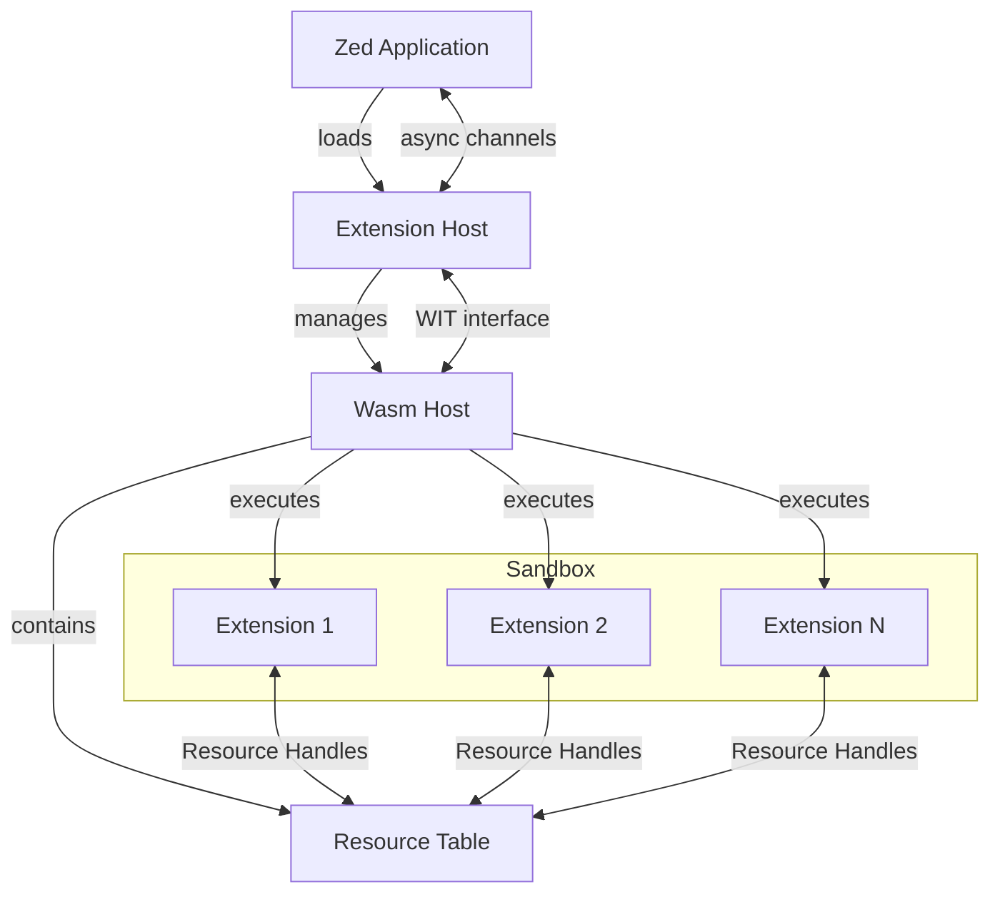

# 29. Cloud Level: Extension Sandboxing

## Purpose

The Extension Sandboxing system in Zed provides a secure execution environment for third-party extensions, isolating them from the main application while still allowing them to extend editor functionality. This document examines how Zed implements isolation, permission controls, and secure resource sharing to enable a robust extension ecosystem without compromising security or stability.

## Concepts

### WebAssembly Sandboxing

At the core of Zed's extension system is WebAssembly (Wasm), a binary instruction format designed as a portable compilation target. WebAssembly provides several security properties that make it ideal for extension sandboxing:

- **Memory isolation**: Wasm modules can only access memory explicitly allocated to them
- **No direct system access**: Extensions cannot make direct system calls
- **Controlled APIs**: Extensions can only interact with the host through explicitly exposed interfaces

### Resource Handles

Instead of giving extensions direct references to Zed's internal objects, the system uses opaque resource handles:

- **Resource Table**: A registry that stores references to host resources
- **Resource Handles**: Opaque identifiers that extensions use to refer to resources
- **Type Safety**: Resources are strongly typed to ensure correct usage

### WIT (WebAssembly Interface Types)

Zed uses WIT (WebAssembly Interface Types) to define the interface between extensions and the host application:

- **Type-safe boundaries**: Strong typing ensures correct parameter passing
- **Version compatibility**: Interface versioning enables backward compatibility
- **Async support**: Asynchronous functions can be exposed through the interface

### Extension Manifests

Each extension must provide a manifest that declares:

- **Metadata**: Name, author, version, description
- **Capabilities**: What host APIs the extension requires
- **Configuration**: User-configurable settings for the extension

## Architecture

Zed's extension sandbox architecture consists of several key components:



### Extension Host

The `ExtensionHost` component is responsible for:

- Loading and managing the lifecycle of extensions
- Serving as the primary communication point between Zed and extensions
- Dispatching operations between the main application and the Wasm host

### Wasm Host

The `WasmHost` manages the WebAssembly runtime environment:

- Initializes and configures the Wasmtime engine
- Compiles and instantiates WebAssembly modules
- Manages the resource table for safe object references
- Implements the host side of the WIT interface

### Extension State

Each loaded extension has associated state containing:

- Compiled WebAssembly instance
- Work directory for file operations
- Resource references specific to the extension
- Communication channels for async operations

## Implementation Details

### Wasm Instance Creation

When an extension is loaded, Zed follows these steps:

1. Validate the extension manifest
2. Check compatibility with the current API version
3. Prepare an isolated work directory
4. Configure the WASI context with appropriate permissions
5. Compile and instantiate the WebAssembly module
6. Initialize the extension by calling its entry point

### Filesystem Isolation

Each extension is granted access only to its own work directory:

```rust
fn writeable_path_from_extension(&self, id: &Arc<str>, path: &Path) -> Result<PathBuf> {
    let extension_work_dir = self.work_dir.join(id.as_ref());
    let path = normalize_path(&extension_work_dir.join(path));
    if path.starts_with(&extension_work_dir) {
        Ok(path)
    } else {
        Err(anyhow!("cannot write to path {}", path.display()))
    }
}
```

This approach prevents extensions from accessing files outside their designated area, using path normalization to prevent path traversal attacks.

### Resource Management

Resources are managed through a table that maps opaque handles to actual resources:

1. When a host resource needs to be exposed to an extension, it's added to the resource table
2. The extension receives only the handle (an integer ID)
3. When the extension calls an API with the handle, the system looks up the actual resource
4. When the extension is unloaded, all its resources are cleaned up

### Communication Channels

Communication between the extension and the host occurs through several mechanisms:

- **Synchronous WIT calls**: For direct, immediate operations
- **Asynchronous channels**: For operations that may take time or need to be queued
- **Callbacks**: For host-to-extension notifications

### Permission Validation

Before performing sensitive operations, the system validates permissions:

```rust
// Example of command execution permission check
self.manifest.allow_exec(&command.command, &command.args)?;
```

The manifest's declared capabilities are checked against the attempted operations, preventing extensions from exceeding their granted permissions.

### Version Compatibility

Zed maintains backward compatibility through a version system:

```rust
wasmtime::component::bindgen!({
    async: true,
    trappable_imports: true,
    path: "../extension_api/wit/since_v0.5.0",
    // Additional configurations
});
```

Different API versions can coexist, with the host selecting the appropriate interface based on the extension's declared compatibility.

## Swift Reimplementation Considerations

### WebAssembly Runtime

For Swift implementation, consider these options:

1. **[Wasmtime Swift](https://github.com/bytecodealliance/wasmtime-swift)**: A Swift binding to the Wasmtime runtime
2. **[WasmKit](https://github.com/crnd/wasmkit)**: A native Swift WebAssembly interpreter
3. **JavaScriptCore's WebAssembly support**: Available on Apple platforms

### Resource Table Implementation

Swift's strong type system and ARC (Automatic Reference Counting) can be leveraged for resource management:

```swift
class ResourceTable {
    private var resources: [UInt32: Any] = [:]
    private var nextId: UInt32 = 1
    
    func add<T>(_ resource: T) -> UInt32 {
        let id = nextId
        nextId += 1
        resources[id] = resource
        return id
    }
    
    func get<T>(_ id: UInt32) -> T? {
        return resources[id] as? T
    }
    
    func remove(_ id: UInt32) {
        resources.removeValue(forKey: id)
    }
}
```

### Filesystem Isolation

Swift's `FileManager` can be used to implement similar filesystem isolation:

```swift
func validatePath(forExtension extensionId: String, path: String) -> Result<URL, Error> {
    let extensionWorkDir = workDirectoryURL.appendingPathComponent(extensionId)
    let fullPath = extensionWorkDir.appendingPathComponent(path).standardized
    
    guard fullPath.path.starts(with: extensionWorkDir.path) else {
        return .failure(ExtensionError.pathTraversal(path: fullPath.path))
    }
    
    return .success(fullPath)
}
```

### Extension Manifest

Swift's `Codable` protocol makes it easy to define and validate extension manifests:

```swift
struct ExtensionManifest: Codable {
    let name: String
    let version: String
    let author: String
    let description: String
    let capabilities: [Capability]
    let configuration: [ConfigurationItem]
    
    func allowsExecution(command: String, arguments: [String]) -> Bool {
        // Implementation of permission checking
    }
}
```

### Async Communication

Swift's built-in concurrency features can be used for extension-host communication:

```swift
// Using Swift's structured concurrency
actor ExtensionHost {
    func invokeExtension(id: String, method: String, arguments: [Any]) async throws -> Any {
        // Implementation
    }
    
    func notifyExtension(id: String, event: String, data: Any) async {
        // Implementation
    }
}
```

## Conclusion

Zed's extension sandboxing system demonstrates a well-designed approach to secure extension hosting using WebAssembly. The combination of memory isolation, controlled API access, and explicit permission checks provides strong security guarantees while still enabling powerful extension capabilities.

When reimplementing this system in Swift, developers should focus on equivalent isolation mechanisms, proper resource management, and a well-defined extension-host interface. Swift's strong type system and modern concurrency features can provide a solid foundation for implementing a similar architecture on Apple platforms.