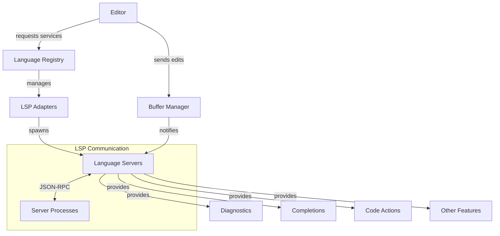

# 30. Cloud Level: Language Server Protocol

## Purpose

The Language Server Protocol (LSP) implementation in Zed provides a standardized interface for communication between the editor and language-specific analysis tools. This document examines how Zed integrates and manages language servers to provide intelligent features like code completion, diagnostics, go-to-definition, and other language-aware capabilities while maintaining a clean separation between the editor and language-specific processing.

## Concepts

### Language Server Protocol

The Language Server Protocol (LSP) defines a standard way for development tools to communicate with language-specific functionality providers. Key concepts include:

- **JSON-RPC**: The communication protocol used between the editor and language servers
- **Requests and Notifications**: The two primary message types in LSP communication
- **Capabilities Negotiation**: A system where the client and server declare what features they support
- **Document Synchronization**: Mechanisms to keep the server aware of editor changes

### Language Server Management

Zed manages language servers through several key abstractions:

- **LanguageServer**: A process that provides language-specific analysis
- **LspAdapter**: Defines how to locate, install, and communicate with specific language servers
- **CachedLspAdapter**: A wrapper that caches adapter properties for improved performance
- **LanguageServerId**: A unique identifier for each running language server

### Resource and State Management

To effectively manage language servers and their state, Zed employs:

- **Workspace Folders**: Representing directories the language server should analyze
- **Document Tracking**: Registering files with language servers for analysis
- **Capability Tracking**: Tracking what each language server can do
- **Configuration Parameters**: Customizing language server behavior

## Architecture

Zed's LSP architecture consists of several interconnected components:



### LanguageServer Component

The `LanguageServer` struct manages the lifecycle and communication with an external language server process:

- Spawns and maintains the language server process
- Manages I/O communication channels
- Handles JSON-RPC message formatting and parsing
- Tracks server capabilities
- Maintains workspace state

### LspAdapter System

The `LspAdapter` trait defines how to interact with specific language servers:

- Detecting if a language server is installed
- Installing language servers when needed
- Configuring initialization parameters
- Transforming LSP types into Zed-specific structures
- Handling language-specific customizations

### Request and Response Handling

The LSP implementation includes sophisticated handling of requests and responses:

- Async message processing with timeout handling
- Subscription-based notification handlers
- Request ID tracking and correlation
- Error handling and recovery

## Implementation Details

### Language Server Process Management

When initializing a language server, Zed follows these steps:

1. Locates or installs the language server binary
2. Spawns the server process with appropriate environment
3. Sets up stdin/stdout/stderr pipes for communication
4. Sends initialization request with client capabilities
5. Processes server capabilities response
6. Notifies the server of workspace folders and open documents

The code responsible for process creation:

```rust
pub fn new(
    stderr_capture: Arc<Mutex<Option<String>>>,
    server_id: LanguageServerId,
    server_name: LanguageServerName,
    binary: LanguageServerBinary,
    root_path: &Path,
    code_action_kinds: Option<Vec<CodeActionKind>>,
    workspace_folders: Arc<Mutex<BTreeSet<Url>>>,
    cx: &mut AsyncApp,
) -> Result<Self> {
    // Set up working directory
    let working_dir = if root_path.is_dir() {
        root_path
    } else {
        root_path.parent().unwrap_or_else(|| Path::new("/"))
    };

    // Start language server process
    let mut server = util::command::new_smol_command(&binary.path)
        .current_dir(working_dir)
        .args(&binary.arguments)
        .envs(binary.env.clone().unwrap_or_default())
        .stdin(Stdio::piped())
        .stdout(Stdio::piped())
        .stderr(Stdio::piped())
        .kill_on_drop(true)
        .spawn()?;

    // Set up communication channels
    let stdin = server.stdin.take().unwrap();
    let stdout = server.stdout.take().unwrap();
    let stderr = server.stderr.take().unwrap();
    
    // Create language server instance
    // ...
}
```

### JSON-RPC Protocol Implementation

The LSP implementation handles JSON-RPC messages through a structured system:

1. **Request Construction**: Formats a request with ID, method, and parameters
2. **Message Transport**: Sends messages with Content-Length headers
3. **Response Handling**: Correlates responses with requests using IDs
4. **Notification Dispatch**: Routes notifications to registered handlers

Example of request handling:

```rust
pub fn request<T: request::Request>(
    &self,
    params: T::Params,
) -> impl LspRequestFuture<T::Result>
where
    T::Result: 'static + Send,
{
    // Generate request ID
    let id = self.next_id.fetch_add(1, SeqCst);
    
    // Serialize request
    let message = serde_json::to_string(&Request {
        jsonrpc: JSON_RPC_VERSION,
        id: RequestId::Int(id),
        method: T::METHOD,
        params,
    }).unwrap();

    // Set up response channel
    let (tx, rx) = oneshot::channel();
    
    // Register response handler
    // ...
    
    // Send request
    // ...
    
    // Return future that resolves with response
    // ...
}
```

### Client Capabilities Management

Zed exposes a rich set of client capabilities to language servers, enabling advanced features:

```rust
ClientCapabilities {
    workspace: Some(WorkspaceClientCapabilities {
        configuration: Some(true),
        did_change_watched_files: Some(DidChangeWatchedFilesClientCapabilities {
            dynamic_registration: Some(true),
            relative_pattern_support: Some(true),
        }),
        // Additional workspace capabilities...
    }),
    text_document: Some(TextDocumentClientCapabilities {
        completion: Some(CompletionClientCapabilities {
            completion_item: Some(CompletionItemCapability {
                snippet_support: Some(true),
                resolve_support: Some(CompletionItemCapabilityResolveSupport {
                    properties: vec![
                        "additionalTextEdits".to_string(),
                        "command".to_string(),
                        "documentation".to_string(),
                    ],
                }),
                // Additional completion capabilities...
            }),
            // ...
        }),
        // Additional text document capabilities...
    }),
    // Additional capability categories...
}
```

### LspAdapter Design

The `LspAdapter` trait defines methods that language-specific implementations must provide:

```rust
#[async_trait(?Send)]
pub trait LspAdapter: 'static + Send + Sync {
    // Identification
    fn name(&self) -> LanguageServerName;
    
    // Server acquisition
    fn get_language_server_command(...) -> Pin<Box<dyn Future<...>>>;
    async fn check_if_user_installed(...) -> Option<LanguageServerBinary>;
    async fn fetch_latest_server_version(...) -> Result<Box<dyn Any>>;
    
    // Server installation
    async fn fetch_server_binary(...) -> Result<LanguageServerBinary>;
    
    // Language-specific mappings
    fn language_ids(&self) -> HashMap<String, String>;
    
    // Feature customization
    fn code_action_kinds(&self) -> Option<Vec<CodeActionKind>>;
    fn initialization_options(&self) -> Option<Value>;
    
    // Additional methods for transforming and processing LSP data
    // ...
}
```

## Swift Reimplementation Considerations

### LSP Client Implementation

For Swift implementation, consider:

1. **Process Management**: Use Swift's `Process` class for spawning language server processes
2. **JSON-RPC Communication**: Implement a structured JSON-RPC client with proper message framing
3. **Concurrency Model**: Leverage Swift's structured concurrency for async communication

```swift
class LanguageServer {
    private let process: Process
    private let stdInPipe: Pipe
    private let stdOutPipe: Pipe
    private let stdErrPipe: Pipe
    private var nextRequestId: Int32 = 0
    private var responseHandlers: [RequestId: (Result<Any, Error>) -> Void] = [:]
    
    // Process management
    func start() async throws {
        // Set up process
        process.executableURL = URL(fileURLWithPath: binaryPath)
        process.arguments = arguments
        
        // Set up pipes
        process.standardInput = stdInPipe
        process.standardOutput = stdOutPipe
        process.standardError = stdErrPipe
        
        // Start process
        try process.run()
        
        // Start I/O handling tasks
        Task { try await handleStdOut() }
        Task { try await handleStdErr() }
    }
    
    // Request handling
    func request<T: LSPRequest>(_ request: T) async throws -> T.Response {
        let id = nextRequestId
        nextRequestId += 1
        
        // Create and send request
        // Set up response handling
        
        return try await withCheckedThrowingContinuation { continuation in
            responseHandlers[RequestId.int(id)] = { result in
                continuation.resume(with: result)
            }
            
            // Send request
        }
    }
    
    // Additional methods for notification handling, etc.
}
```

### Adapter System

Swift's protocol system offers a natural fit for the adapter pattern:

```swift
protocol LSPAdapter {
    var name: String { get }
    
    func languageServerCommand(
        for workspace: URL,
        options: LanguageServerOptions
    ) async throws -> LanguageServerBinary
    
    func fetchLatestServerVersion() async throws -> Any
    
    func installServer(version: Any, location: URL) async throws -> LanguageServerBinary
    
    // Additional protocol requirements
}
```

### Asynchronous Processing

Swift's structured concurrency makes handling LSP requests and notifications cleaner:

```swift
func handleDidChangeTextDocument(params: DidChangeTextDocumentParams) async {
    // Process document changes
    for change in params.contentChanges {
        await buffer.applyEdit(change)
    }
    
    // Update diagnostics asynchronously
    Task {
        let diagnostics = await fetchDiagnostics(for: params.textDocument.uri)
        await publishDiagnostics(diagnostics)
    }
}
```

## Conclusion

Zed's LSP implementation demonstrates a well-structured approach to integrating language intelligence services into the editor. The separation of concerns between the generic LSP protocol handling and the language-specific adapter logic allows for easy extension to new languages while maintaining a consistent experience across different language servers.

The use of async communication patterns, structured resource management, and clear interface boundaries provides a solid foundation for language intelligence features. When implementing a similar system in Swift, leveraging Swift's structured concurrency and protocol-oriented programming can lead to an even cleaner implementation while maintaining the same powerful capabilities.