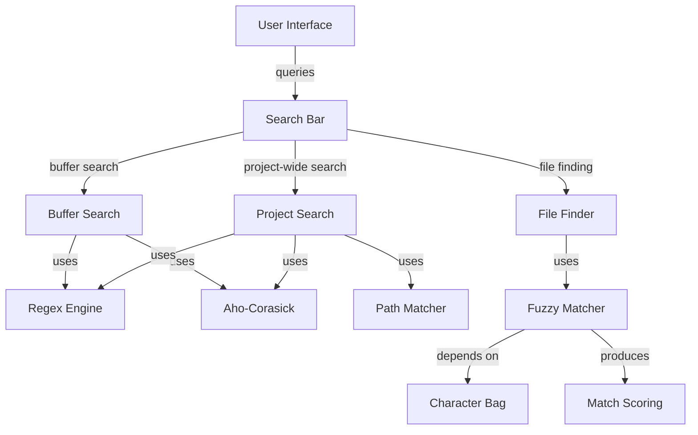

# 31. Cloud Level: Search Algorithms

## Purpose

The search system in Zed provides fast and effective mechanisms for locating code and files within projects. This document examines the search algorithms and data structures used in Zed to enable efficient searching across different contexts, including buffer content searching, fuzzy file matching, and project-wide code searches. These systems are critical for enabling a fluid user experience by providing immediate feedback when navigating and editing code.

## Concepts

### Search Types and Patterns

Zed implements several distinct search paradigms:

- **Exact Text Search**: Character-by-character matching of literal strings
- **Regular Expression Search**: Pattern-based matching using standard regex syntax
- **Fuzzy File Finding**: Approximate matching for files using score-based ranking
- **Project-wide Search**: Searching across all files in a project with filtering capabilities
- **Symbol Search**: Searching code symbols (functions, classes, etc.) using language-aware indexing

### Matching Algorithms

Several matching algorithms power Zed's search capabilities:

- **Aho-Corasick Algorithm**: An efficient string searching algorithm that locates elements of a finite set of strings within a text
- **Fancy Regex**: A regex engine that supports advanced features like look-ahead and look-behind
- **Fuzzy Matching**: A custom algorithm that evaluates possible matches with a scoring system based on character proximity and sequential matching

### Search Optimization Techniques

Zed implements several optimizations to make searches fast and responsive:

- **Character Bags**: Efficient representations of character sets for quick rejection testing
- **Streaming Search**: Processing search data in chunks to avoid memory issues with large files
- **Concurrency**: Parallel processing of search tasks across multiple threads
- **Path Matching**: Specialized path matching algorithms for working with file paths

## Architecture

Zed's search system consists of several interconnected components:



### Key Components

1. **Search System**: Orchestrates different search types and algorithms
2. **Fuzzy Module**: Provides fuzzy matching capabilities for file finding
3. **Buffer Search**: Enables searching within currently opened buffers
4. **Project Search**: Handles project-wide searches with filtering options
5. **Path Matching**: Manages pattern-based file path matching

## Implementation Details

### Aho-Corasick for Exact Text Search

For literal text searches, Zed uses the Aho-Corasick algorithm, which provides efficient string matching capabilities:

```rust
pub fn text(
    query: impl ToString,
    whole_word: bool,
    case_sensitive: bool,
    include_ignored: bool,
    files_to_include: PathMatcher,
    files_to_exclude: PathMatcher,
    match_full_paths: bool,
    buffers: Option<Vec<Entity<Buffer>>>,
) -> Result<Self> {
    let query = query.to_string();
    if !case_sensitive && !query.is_ascii() {
        // AhoCorasickBuilder doesn't support case-insensitive search with unicode characters
        // Fallback to regex search as recommended
        return Self::regex(
            regex::escape(&query),
            whole_word,
            case_sensitive,
            include_ignored,
            false,
            files_to_include,
            files_to_exclude,
            false,
            buffers,
        );
    }
    let search = AhoCorasickBuilder::new()
        .ascii_case_insensitive(!case_sensitive)
        .build([&query])?;
    
    // Create and return search object
}
```

The implementation includes a fallback to regex for non-ASCII case-insensitive searches, as Aho-Corasick has limitations with Unicode case folding.

### Regular Expression Engine

For pattern-based searches, Zed employs the Fancy Regex crate, which provides advanced regex capabilities:

```rust
pub fn regex(
    query: impl ToString,
    whole_word: bool,
    case_sensitive: bool,
    include_ignored: bool,
    one_match_per_line: bool,
    files_to_include: PathMatcher,
    files_to_exclude: PathMatcher,
    match_full_paths: bool,
    buffers: Option<Vec<Entity<Buffer>>>,
) -> Result<Self> {
    let mut query = query.to_string();
    // Add word boundary markers if whole_word is enabled
    if whole_word {
        // Add \b markers at start/end of query when appropriate
    }

    let multiline = query.contains('\n') || query.contains("\\n");
    let regex = RegexBuilder::new(&query)
        .case_insensitive(!case_sensitive)
        .build()?;
    
    // Create and return regex search object
}
```

The regex implementation handles special cases like word boundaries, multiline support, and case sensitivity options.

### Character Bag for Fast Rejection

Zed implements a "Character Bag" data structure to optimize search performance through fast rejection:

```rust
// In fuzzy/src/char_bag.rs
pub struct CharBag(u128);

impl CharBag {
    pub fn new() -> Self {
        Self(0)
    }

    pub fn insert(&mut self, c: char) {
        let c = c.to_ascii_lowercase();
        if c.is_ascii() {
            self.0 |= 1u128 << (c as u8);
        }
    }

    pub fn contains(&self, c: char) -> bool {
        let c = c.to_ascii_lowercase();
        if c.is_ascii() {
            (self.0 & (1u128 << (c as u8))) != 0
        } else {
            false
        }
    }

    pub fn is_superset(&self, other: Self) -> bool {
        (self.0 & other.0) == other.0
    }
}
```

This bit-based representation allows for O(1) character containment checks and fast superset testing, which is used to quickly filter out file paths that cannot possibly match a fuzzy query.

### Fuzzy Matching Algorithm

The fuzzy matching algorithm is a sophisticated system that scores potential matches based on several factors:

```rust
fn score_match(
    &mut self,
    path: &[char],
    path_lowercased: &[char],
    prefix: &[char],
    lowercase_prefix: &[char],
    extra_lowercase_chars: &BTreeMap<usize, usize>,
) -> f64 {
    let score = self.recursive_score_match(
        path,
        path_lowercased,
        prefix,
        lowercase_prefix,
        extra_lowercase_chars,
        0,
        0,
        0,
    );
    
    // Process and return final score
}
```

The scoring system considers:

1. **Distance Penalty**: Characters that are far apart receive lower scores
2. **Sequential Matches**: Consecutive character matches receive bonuses
3. **Start of Word Bonuses**: Matches at the start of words or path components are scored higher
4. **Case Matching**: Exact case matches are favored over case-insensitive matches

### Buffer Search Optimization

When searching within a buffer, Zed employs several optimizations to handle large files efficiently:

```rust
pub async fn search(
    &self,
    buffer: &BufferSnapshot,
    subrange: Option<Range<usize>>,
) -> Vec<Range<usize>> {
    const YIELD_INTERVAL: usize = 20000;
    
    // Extract text to search
    let rope = if let Some(range) = subrange {
        buffer.as_rope().slice(range)
    } else {
        buffer.as_rope().clone()
    };

    let mut matches = Vec::new();
    match self {
        Self::Text { search, whole_word, .. } => {
            for (ix, mat) in search
                .stream_find_iter(rope.bytes_in_range(0..rope.len()))
                .enumerate()
            {
                if (ix + 1) % YIELD_INTERVAL == 0 {
                    yield_now().await;  // Cooperative multitasking
                }
                
                // Handle match
            }
        }
        
        Self::Regex { regex, multiline, .. } => {
            // Specialized handling for regex searches
        }
    }
    
    matches
}
```

Key optimizations include:
- Periodic yielding to avoid blocking the UI
- Stream-based search to handle large files
- Special handling for multiline regex patterns
- Word boundary checking for whole-word searches

### Path Matching

File path matching uses a specialized `PathMatcher` that can efficiently filter file paths based on patterns:

```rust
pub fn match_path(&self, file_path: &Path) -> bool {
    let mut path = file_path.to_path_buf();
    loop {
        if self.files_to_exclude().is_match(&path) {
            return false;
        } else if self.files_to_include().sources().is_empty()
            || self.files_to_include().is_match(&path)
        {
            return true;
        } else if !path.pop() {
            return false;
        }
    }
}
```

This algorithm checks a path against include and exclude patterns, traversing up the directory tree if needed.

### Project-wide Search

Project-wide search combines multiple algorithms to efficiently search across files:

1. First, files are filtered based on include/exclude patterns
2. Files passing the filter are searched using either Aho-Corasick or regex
3. Matches are collected and ranked according to relevance
4. Search tasks are performed in the background to maintain UI responsiveness

## Swift Reimplementation Considerations

### Equivalent String Search Libraries

Swift equivalents for the search algorithms include:

1. **AhoCorasick**: While Swift doesn't have a direct equivalent in the standard library, the [Aho-Corasick Swift](https://github.com/krzyzanowskim/CryptoSwift/blob/master/Sources/CryptoSwift/AhoCorasick.swift) implementation could be used
2. **Regular Expressions**: Swift 5.7+ includes the modern `Regex` type with performance comparable to Fancy Regex
3. **NSRegularExpression**: For older Swift versions, this Foundation class provides regex capabilities

```swift
// Modern Swift regex example
func searchWithRegex(text: String, pattern: String, caseSensitive: Bool) -> [Range<String.Index>] {
    do {
        let regex = try Regex(pattern, options: caseSensitive ? [] : [.caseInsensitive])
        return text.matches(of: regex).map { $0.range }
    } catch {
        return []
    }
}
```

### Character Set Optimization

Swift's `Set<Character>` or bit-vector representations can be used to implement the CharBag concept:

```swift
struct CharacterBag {
    private var bits: UInt128 = 0
    
    mutating func insert(_ char: Character) {
        guard let asciiValue = char.lowercased().first?.asciiValue else { return }
        bits |= 1 << asciiValue
    }
    
    func contains(_ char: Character) -> Bool {
        guard let asciiValue = char.lowercased().first?.asciiValue else { return false }
        return (bits & (1 << asciiValue)) != 0
    }
    
    func isSuperset(of other: CharacterBag) -> Bool {
        return (bits & other.bits) == other.bits
    }
}
```

### Cooperative Multitasking

For search operations, Swift's structured concurrency can be leveraged:

```swift
func searchBuffer(_ buffer: BufferSnapshot, range: Range<Int>? = nil) async -> [Range<Int>] {
    let yieldInterval = 20000
    var matches: [Range<Int>] = []
    
    // Extract text to search
    let text = range.map { buffer.text[$0] } ?? buffer.text
    
    // Use appropriate search algorithm
    for (index, match) in findMatches(in: text).enumerated() {
        if (index + 1) % yieldInterval == 0 {
            // Yield to other tasks
            await Task.yield()
        }
        
        matches.append(match)
    }
    
    return matches
}
```

### Path Filtering

Swift's file path handling capabilities can be used to implement path filtering:

```swift
func matchPath(_ path: URL) -> Bool {
    var currentPath = path
    while true {
        if excludePatterns.isMatch(currentPath) {
            return false
        } else if includePatterns.isEmpty || includePatterns.isMatch(currentPath) {
            return true
        } else if currentPath.deletingLastPathComponent() == currentPath {
            return false
        } else {
            currentPath = currentPath.deletingLastPathComponent()
        }
    }
}
```

## Conclusion

Zed's search implementation demonstrates a sophisticated approach to the universal problem of finding things in code. By combining multiple specialized algorithms, each optimized for a specific search context, Zed achieves both speed and flexibility in its search capabilities.

Key aspects worth emulating in any reimplementation include:
1. The use of specialized algorithms for different search types
2. Character bag optimization for fast rejection
3. Scoring algorithms for fuzzy matching
4. Asynchronous search execution with cooperative yielding
5. Specialized path matching for file filtering

By carefully selecting Swift equivalents for these core algorithms and data structures, a Swift implementation could achieve similar performance and flexibility while taking advantage of Swift's strong type system and modern concurrency features.