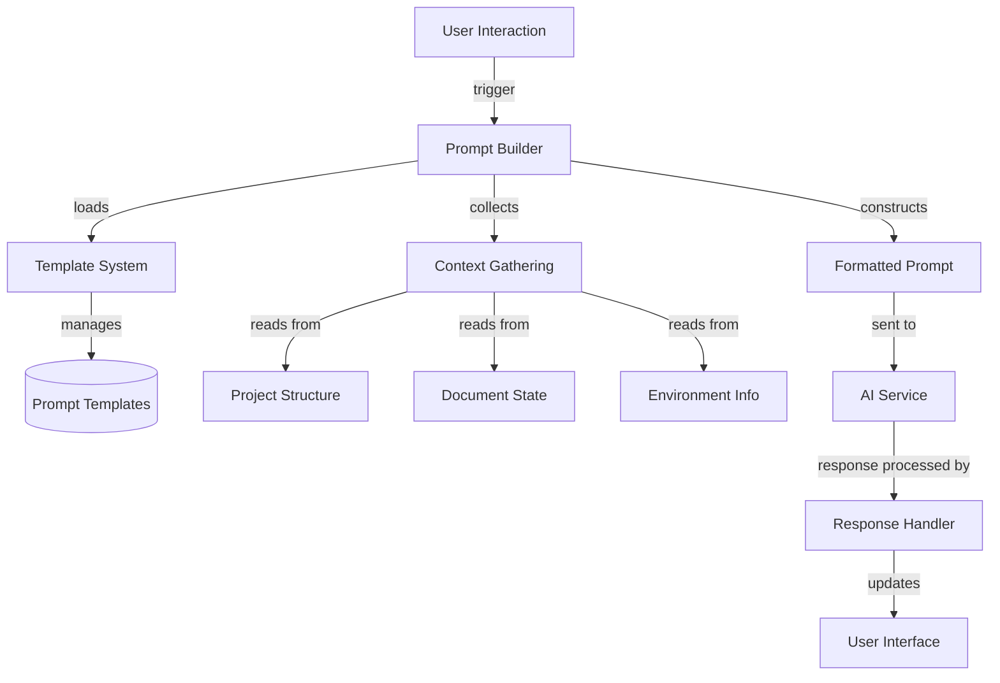

# 32. Cloud Level: AI Prompting

## Purpose

The AI prompting system in Zed is responsible for creating well-structured, context-rich prompts that enable AI assistants to provide relevant and helpful responses. This document examines how Zed constructs prompts, manages templates, handles context inclusion, and ensures consistent AI interactions across different usage scenarios such as inline code assistance, chat-based help, and terminal command generation.

## Concepts

### Prompt Templates

Zed uses a templating system for AI prompts that allows for consistent structure while incorporating dynamic content:

- **System Prompts**: Define the AI assistant's persona, capabilities, and operational boundaries
- **Content Prompts**: Structure requests for editing or generating content
- **Terminal Prompts**: Format requests for terminal command suggestions
- **Handlebars Templates**: Provide a flexible way to insert contextual information into prompt templates

### Context Inclusion

Providing relevant context to the AI is crucial for getting useful responses:

- **Project Context**: Information about the workspace structure and configuration
- **File Context**: Source code or text being edited
- **Selection Context**: Specifically selected text for targeted assistance
- **Diagnostic Context**: Any errors or warnings in the code
- **Environment Context**: Operating system, shell, and toolchain information

### Tool Awareness

The AI assistant's capabilities are enhanced through awareness of available tools:

- **Tool Discovery**: Dynamic detection of available assistant tools
- **Tool Permissions**: Control over which tools the AI can use
- **Tool Integration**: Integration of tool results into the AI's context

### User Rules and Project Rules

Custom instructions can be defined at different levels:

- **User Rules**: Global instructions that apply to all projects
- **Project Rules**: Project-specific guidelines stored in special files

## Architecture

The AI prompting system consists of several interconnected components:



### Key Components

1. **PromptBuilder**: Orchestrates prompt creation by gathering context and applying templates
2. **TemplateSystem**: Manages prompt templates and supports overriding built-in templates
3. **ContextGathering**: Collects relevant information from the workspace and environment
4. **AIService**: Interfaces with language model providers

## Implementation Details

### Template Management

Prompt templates are loaded from built-in assets and can be customized by users:

```rust
pub fn load(fs: Arc<dyn Fs>, stdout_is_a_pty: bool, cx: &mut App) -> Arc<Self> {
    Self::new(Some(PromptLoadingParams {
        fs: fs.clone(),
        repo_path: stdout_is_a_pty
            .then(|| std::env::current_dir().log_err())
            .flatten(),
        cx,
    }))
    .log_err()
    .map(Arc::new)
    .unwrap_or_else(|| Arc::new(Self::new(None).unwrap()))
}

fn register_built_in_templates(handlebars: &mut Handlebars<'_>) -> Result<()> {
    // Register built-in templates
    handlebars.register_template_string(
        "system_prompt",
        Assets::get("prompts/assistant_system_prompt.hbs")
            .ok_or_else(|| anyhow!("Missing template"))?
            .data
            .to_string(),
    )?;
    
    handlebars.register_template_string(
        "content_prompt",
        Assets::get("prompts/content_prompt.hbs")
            .ok_or_else(|| anyhow!("Missing template"))?
            .data
            .to_string(),
    )?;
    
    handlebars.register_template_string(
        "terminal_assistant_prompt",
        Assets::get("prompts/terminal_assistant_prompt.hbs")
            .ok_or_else(|| anyhow!("Missing template"))?
            .data
            .to_string(),
    )?;
    
    Ok(())
}
```

The system watches for template overrides in the filesystem:

```rust
fn watch_fs_for_template_overrides(
    params: PromptLoadingParams,
    handlebars: Arc<Mutex<Handlebars<'static>>>,
) {
    params.cx.spawn(|_| async move {
        let templates_dir = params.fs.canonicalize(&"prompts".into()).await.ok();
        if let Some(templates_dir) = templates_dir {
            // Watch for template changes
            let watcher = params.fs.watch(&templates_dir, 0).await.ok();
            if let Some(mut watcher) = watcher {
                loop {
                    if let Some(event) = watcher.next().await {
                        // Handle template file change
                        // Reload the template
                    }
                }
            }
        }
    }).detach();
}
```

### System Prompt Template

The system prompt establishes the AI assistant's persona and capabilities:

```handlebars
You are a highly skilled software engineer with extensive knowledge in many programming languages, frameworks, design patterns, and best practices.

## Communication

1. Be conversational but professional.
2. Refer to the user in the second person and yourself in the first person.
3. Format your responses in markdown. Use backticks to format file, directory, function, and class names.
4. NEVER lie or make things up.

{{#if has_tools}}
## Tool Use

1. Make sure to adhere to the tools schema.
2. Provide every required argument.
3. DO NOT use tools to access items that are already available in the context section.
4. Use only the tools that are currently available.

...
{{/if}}
```

### Context Gathering

Project context is gathered and structured for inclusion in prompts:

```rust
#[derive(Debug, Clone, Serialize)]
pub struct ProjectContext {
    pub worktrees: Vec<WorktreeContext>,
    pub has_rules: bool,
    pub user_rules: Vec<UserRulesContext>,
    pub has_user_rules: bool,
    pub os: String,
    pub arch: String,
    pub shell: String,
}

impl ProjectContext {
    pub fn new(worktrees: Vec<WorktreeContext>, default_user_rules: Vec<UserRulesContext>) -> Self {
        let has_rules = worktrees
            .iter()
            .any(|worktree| worktree.rules_file.is_some());
        Self {
            worktrees,
            has_rules,
            has_user_rules: !default_user_rules.is_empty(),
            user_rules: default_user_rules,
            os: std::env::consts::OS.to_string(),
            arch: std::env::consts::ARCH.to_string(),
            shell: get_system_shell(),
        }
    }
}
```

### Content Editing Prompts

When the AI is asked to edit content, specialized templates are used:

```rust
#[derive(Serialize)]
pub struct ContentPromptContext {
    pub content_type: String,
    pub language_name: Option<String>,
    pub is_insert: bool,
    pub is_truncated: bool,
    pub document_content: String,
    pub user_prompt: String,
    pub rewrite_section: Option<String>,
    pub diagnostic_errors: Vec<ContentPromptDiagnosticContext>,
}

pub fn render_content_prompt(
    &self,
    ctx: ContentPromptContext,
) -> Result<String, RenderError> {
    self.handlebars.lock().render("content_prompt", &ctx)
}
```

The content prompt template provides clear instructions to the AI about the editing task:

```handlebars
{{#if language_name}}
Here's a file of {{language_name}} that I'm going to ask you to make an edit to.
{{else}}
Here's a file of text that I'm going to ask you to make an edit to.
{{/if}}

{{#if is_insert}}
The point you'll need to insert at is marked with <insert_here></insert_here>.
{{else}}
The section you'll need to rewrite is marked with <rewrite_this></rewrite_this> tags.
{{/if}}

<document>
{{{document_content}}}
</document>

{{#if is_truncated}}
The context around the relevant section has been truncated (possibly in the middle of a line) for brevity.
{{/if}}
```

### Terminal Assistant Prompts

For generating terminal commands, a specialized prompt format is used:

```rust
#[derive(Serialize)]
pub struct TerminalAssistantPromptContext {
    pub os: String,
    pub arch: String,
    pub shell: Option<String>,
    pub working_directory: Option<String>,
    pub latest_output: Vec<String>,
    pub user_prompt: String,
}

pub fn render_terminal_assistant_prompt(
    &self,
    ctx: TerminalAssistantPromptContext,
) -> Result<String, RenderError> {
    self.handlebars.lock().render("terminal_assistant_prompt", &ctx)
}
```

The terminal assistant template focuses on command generation:

```handlebars
You are an expert terminal user.
You will be given a description of a command and you need to respond with a command that matches the description.
Do not include markdown blocks or any other text formatting in your response, always respond with a single command that can be executed in the given shell.
Current OS name is '{{os}}', architecture is '{{arch}}'.
{{#if shell}}
Current shell is '{{shell}}'.
{{/if}}
{{#if working_directory}}
Current working directory is '{{working_directory}}'.
{{/if}}
```

### Conditional Logic in Templates

The templating system uses Handlebars helpers to enable conditional inclusion of content:

```rust
fn has_tool_helper(
    h: &handlebars::Helper,
    _: &Handlebars,
    ctx: &handlebars::Context,
    _: &mut handlebars::RenderContext,
    out: &mut dyn handlebars::Output,
) -> handlebars::HelperResult {
    let tool_name = h.param(0).and_then(|v| v.value().as_str()).ok_or_else(|| {
        handlebars::RenderError::new("has_tool helper: missing or invalid tool name parameter")
    })?;

    let enabled_tools = ctx
        .data()
        .get("available_tools")
        .and_then(|v| v.as_array())
        .map(|arr| arr.iter().filter_map(|v| v.as_str()).collect::<Vec<&str>>())
        .ok_or_else(|| {
            handlebars::RenderError::new(
                "has_tool handlebars helper: available_tools not found or not an array",
            )
        })?;

    if enabled_tools.contains(&tool_name) {
        out.write("true")?;
    }

    Ok(())
}
```

This enables tool-awareness in prompts, with sections conditional on tool availability:

```handlebars
{{#if (has_tool 'grep') }}
- When looking for symbols in the project, prefer the `grep` tool.
- As you learn about the structure of the project, use that information to scope `grep` searches to targeted subtrees of the project.
- The user might specify a partial file path. If you don't know the full path, use `find_path` (not `grep`) before you read the file.
{{/if}}
```

### Prompt Store for User-Created Prompts

In addition to system prompts, Zed maintains a database of user-created prompts:

```rust
pub struct PromptStore {
    env: heed::Env,
    metadata_cache: RwLock<MetadataCache>,
    metadata: Database<SerdeJson<PromptId>, SerdeJson<PromptMetadata>>,
    bodies: Database<SerdeJson<PromptId>, Str>,
}

impl PromptStore {
    pub fn global(cx: &App) -> impl Future<Output = Result<Entity<Self>>> + use<> {
        let store = GlobalPromptStore::global(cx).0.clone();
        async move { store.await.map_err(|err| anyhow!(err)) }
    }
    
    // Methods for creating, updating, and retrieving prompts
}
```

## Swift Reimplementation Considerations

### Template Engine

Swift's string interpolation and template management options include:

1. **SwiftUI-style ViewBuilder**: A declarative approach to building templates
2. **Stencil**: A popular Swift templating engine inspired by Django's template language
3. **Mustache for Swift**: An implementation of Mustache templates for Swift

```swift
// Using Stencil for templates
struct PromptBuilder {
    private let environment: Environment
    
    init() {
        let templatesBundle = Bundle.main.path(forResource: "Templates", ofType: nil)!
        let loader = FileSystemLoader(paths: [templatesBundle])
        environment = Environment(loader: loader)
    }
    
    func renderSystemPrompt(context: [String: Any]) throws -> String {
        return try environment.renderTemplate(name: "system_prompt.stencil", context: context)
    }
    
    func renderContentPrompt(context: [String: Any]) throws -> String {
        return try environment.renderTemplate(name: "content_prompt.stencil", context: context)
    }
}
```

### Context Management

Swift's strong type system can enhance context gathering with clear model definitions:

```swift
struct ProjectContext: Codable {
    var worktrees: [WorktreeContext]
    var hasRules: Bool
    var userRules: [UserRulesContext]
    var hasUserRules: Bool
    var os: String
    var arch: String
    var shell: String
    
    init(worktrees: [WorktreeContext], userRules: [UserRulesContext]) {
        self.worktrees = worktrees
        self.hasRules = worktrees.contains { $0.rulesFile != nil }
        self.userRules = userRules
        self.hasUserRules = !userRules.isEmpty
        self.os = ProcessInfo.processInfo.operatingSystemVersionString
        self.arch = "arm64" // or get dynamically
        self.shell = Self.determineSystemShell()
    }
    
    private static func determineSystemShell() -> String {
        // Implementation to determine the user's shell
    }
}
```

### Template Customization

Swift's file system monitoring capabilities can be used to watch for template overrides:

```swift
class TemplateManager {
    private let fileManager = FileManager.default
    private let templateMonitor: DispatchSourceFileSystemObject?
    
    init(templatesDirectory: URL) {
        // Set up template monitoring
        let directoryDescriptor = open(templatesDirectory.path, O_EVTONLY)
        if directoryDescriptor >= 0 {
            templateMonitor = DispatchSource.makeFileSystemObjectSource(
                fileDescriptor: directoryDescriptor,
                eventMask: .write,
                queue: DispatchQueue.global()
            )
            
            templateMonitor?.setEventHandler { [weak self] in
                self?.reloadTemplates()
            }
            
            templateMonitor?.resume()
        } else {
            templateMonitor = nil
        }
    }
    
    private func reloadTemplates() {
        // Implementation to reload templates when they change
    }
}
```

### Prompt Storage

Swift's CoreData or GRDB could be used for storing user-created prompts:

```swift
struct PromptStore {
    private let database: Database
    
    init(databaseURL: URL) throws {
        self.database = try Database(path: databaseURL.path)
        try setupSchema()
    }
    
    private func setupSchema() throws {
        try database.execute(
            sql: """
                CREATE TABLE IF NOT EXISTS prompts (
                    id TEXT PRIMARY KEY,
                    title TEXT,
                    body TEXT,
                    is_default INTEGER,
                    saved_at TEXT
                )
            """
        )
    }
    
    func savePrompt(_ prompt: UserPrompt) throws {
        try database.execute(
            sql: """
                INSERT OR REPLACE INTO prompts (id, title, body, is_default, saved_at)
                VALUES (?, ?, ?, ?, ?)
            """,
            arguments: [
                prompt.id,
                prompt.title,
                prompt.body,
                prompt.isDefault ? 1 : 0,
                ISO8601DateFormatter().string(from: prompt.savedAt)
            ]
        )
    }
}
```

## Conclusion

Zed's AI prompting system demonstrates a sophisticated approach to structuring AI interactions through flexible templates, comprehensive context gathering, and user customization options. The system ensures consistent AI behavior while enabling tailored responses for different scenarios like code editing, project exploration, and terminal command generation.

Key aspects worth emulating in a Swift reimplementation include:

1. The Handlebars template system for dynamic prompt construction
2. Hierarchical context gathering from project, environment, and user settings
3. Support for template overrides to enable user customization
4. Tool awareness through conditional template sections
5. Structured editing prompts that clearly define the task boundaries

By implementing these core concepts in Swift, a similarly powerful and flexible AI prompting system can be created, ensuring effective AI assistance across a wide range of editing and development tasks.