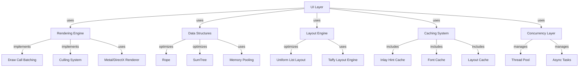

# 33. Ground Level: Performance Optimizations

## Purpose

Zed is designed to be a high-performance, responsive code editor capable of handling large files, complex operations, and real-time collaboration without lag or resource exhaustion. This document examines the key performance optimization techniques implemented throughout Zed's codebase to achieve these goals, covering memory management, rendering efficiency, concurrency strategies, caching mechanisms, and specialized data structures.

## Concepts

### Memory Optimization

Efficient memory usage is critical for maintaining editor performance, especially when working with large files or multiple buffers. Key memory optimization concepts include:

- **Allocation Minimization**: Reducing heap allocations for better performance
- **Memory Pooling**: Reusing memory blocks instead of constantly allocating and deallocating
- **Stack vs Heap Usage**: Preferring stack allocations for small, short-lived data
- **Preallocation Strategies**: Allocating memory upfront to avoid costly reallocations

### Rendering Optimization

As a graphical application, rendering efficiency significantly impacts Zed's perceived performance. Key rendering optimization concepts include:

- **Layered Rendering**: Separating content into layers for efficient updates
- **Viewport Culling**: Only rendering elements visible in the current viewport
- **Batching**: Grouping similar drawing operations to minimize GPU state changes
- **Pipeline Optimization**: Streamlining the sequence of operations in the rendering pipeline

### Concurrency

Effective use of multiple CPU cores through concurrency allows Zed to perform heavy operations without blocking the UI. Key concurrency concepts include:

- **Task-Based Parallelism**: Breaking work into independent tasks that can run concurrently
- **Thread Pooling**: Reusing threads for different tasks to avoid thread creation overhead
- **Lock-Free Algorithms**: Avoiding contention through lock-free data structures
- **Workload Distribution**: Determining when to parallelize based on task size

### Caching

Caching reduces duplicate work by storing and reusing previous results. Key caching concepts include:

- **Invalidation Strategies**: When and how to determine that cached data is no longer valid
- **Cache Hierarchy**: Using multiple cache levels with different access patterns
- **Cache Coherence**: Ensuring cache consistency across different subsystems
- **Memoization**: Storing function results based on input parameters

## Architecture

Zed integrates performance optimizations across multiple layers of its architecture:



## Implementation Details

### Memory Optimizations

#### SmallVec Usage for Stack Allocation

Zed uses the `SmallVec` type throughout its codebase to avoid heap allocations for small collections:

```rust
// In rope.rs, line 106
let mut new_chunks = SmallVec::<[_; 16]>::new();
```

This keeps small arrays on the stack rather than the heap, improving memory locality and reducing allocation overhead. By specifying a reasonable inline capacity (16 in this case), most operations can avoid heap allocations entirely.

#### Buffer Pooling in GPU Rendering

The Metal renderer implements a buffer pool to reuse GPU memory buffers rather than constantly allocating and deallocating:

```rust
// In metal_renderer.rs
struct InstanceBufferPool {
    buffers: Vec<Buffer>,
    frame_index: usize,
    max_frame_count: usize,
}

impl InstanceBufferPool {
    fn allocate_buffer(&mut self, size: usize, device: &MetalDevice) -> Buffer {
        // Try to reuse an existing buffer first
        if let Some(buffer) = self.find_available_buffer(size) {
            return buffer;
        }
        
        // Create a new buffer if necessary
        let buffer = device.new_buffer(
            size,
            MTLResourceOptions::CPUCacheModeWriteCombined,
        );
        self.buffers.push(buffer.clone());
        buffer
    }
}
```

This pattern reduces pressure on memory allocation systems and GPU driver overhead, resulting in smoother rendering performance.

#### Chunking Strategy in Rope

The text rope implementation carefully manages chunk sizes to balance between the overhead of many small allocations versus the inefficiency of large chunks for small edits:

```rust
// Constants in rope.rs
const MIN_BASE: usize = 10; // Min chunk size (bytes)
const MAX_BASE: usize = 32; // Max chunk size (bytes)

// Chunk creation logic (simplified)
fn push_chunk(&mut self, chunk: String) {
    if chunk.len() <= MAX_BASE {
        // Small chunk: store directly
        self.chunks.push(chunk);
    } else {
        // Large chunk: split into smaller chunks
        self.push_large(chunk);
    }
}
```

The chunk size constants are carefully chosen based on empirical testing to optimize for common editing patterns.

#### Memory Preallocation

In performance-critical paths, Zed preallocates memory with worst-case estimations to avoid reallocation during operation:

```rust
// Example from rope.rs's push_large method
fn push_large(&mut self, s: String) {
    // Calculate worst-case chunk count based on UTF-8 encoding
    // A 1024-byte string can occupy between 32 (ASCII) and 36 (4-byte UTF-8) chunks
    let max_chunks = (s.len() + MIN_BASE - 1) / MIN_BASE;
    let mut chunks = Vec::with_capacity(max_chunks);
    
    // Split string into chunks
    // ...
}
```

This careful capacity planning prevents performance-killing reallocations during large string operations.

### Rendering Optimizations

#### Viewport Culling in UniformList

The list components only render items that are currently visible in the viewport:

```rust
// In uniform_list.rs
fn render_visible_items(&mut self, bounds: Bounds, cx: &mut Context) -> Vec<Element> {
    let visible_range = self.compute_visible_range(bounds);
    
    // Only render items within the visible range
    (visible_range.start..visible_range.end)
        .map(|index| self.render_item(index, cx))
        .collect()
}
```

This dramatically reduces rendering overhead for large lists where most elements are off-screen.

#### Batching in Metal Renderer

The Metal renderer implements efficient batching of draw calls by grouping primitives by type:

```rust
// In metal_renderer.rs
fn batch_primitives(&mut self, primitives: &[Primitive]) {
    // Reset batches
    self.shadow_batches.clear();
    self.quad_batches.clear();
    self.path_batches.clear();
    
    // Group primitives by type and material
    for primitive in primitives {
        match primitive {
            Primitive::Shadow(shadow) => {
                self.add_to_shadow_batch(shadow);
            }
            Primitive::Quad(quad) => {
                self.add_to_quad_batch(quad);
            }
            Primitive::Path(path) => {
                self.add_to_path_batch(path);
            }
        }
    }
}
```

By grouping similar draw calls, the renderer minimizes state changes on the GPU, which are typically expensive operations.

#### Fast Path for Uniform Height Elements

The `uniform_list` component is specifically optimized for lists with items of uniform height, bypassing the full layout system:

```rust
// In uniform_list.rs (simplified)
fn layout_children(&mut self, cx: &mut Context) {
    // Measure the first item to determine uniform height
    let item_height = if let Some(first_item) = self.items.first() {
        let layout = cx.compute_layout(first_item);
        layout.size.height
    } else {
        0.0
    };
    
    // Apply uniform height to all items without full layout calculation
    for (i, item) in self.items.iter_mut().enumerate() {
        item.set_bounds(Bounds {
            origin: Point::new(0.0, i as f32 * item_height),
            size: Size::new(self.width, item_height),
        });
    }
}
```

This avoids the overhead of running the full Taffy layout system when a simpler algorithm can achieve the same result.

### Concurrency Patterns

#### Parallel Processing for Large Data

The rope data structure implements parallel construction for large text using Rayon:

```rust
// In rope.rs
fn from_par_iter<I>(iter: I) -> Self 
where
    I: IntoParallelIterator<Item = String>,
{
    let chunks: Vec<_> = iter.into_par_iter().collect();
    
    // Process chunks in parallel when there are enough to justify the overhead
    if chunks.len() >= PARALLEL_THRESHOLD {
        Self::build_tree_in_parallel(&chunks)
    } else {
        Self::build_tree_sequentially(&chunks)
    }
}
```

This approach uses parallel processing only when the data size justifies the overhead, with a threshold constant that's tuned differently for production and testing:

```rust
#[cfg(test)]
const PARALLEL_THRESHOLD: usize = 4;
#[cfg(not(test))]
const PARALLEL_THRESHOLD: usize = 4 * (2 * sum_tree::TREE_BASE);
```

#### Rate Limiting for LSP Requests

The inlay hint cache implements a semaphore-based rate limiter to prevent overwhelming language servers:

```rust
// In inlay_hint_cache.rs
struct InlayHintCache {
    lsp_request_limiter: Arc<Semaphore>,
    // ...
}

impl InlayHintCache {
    async fn fetch_hints(&self, buffer: &Buffer) -> Result<Vec<InlayHint>> {
        // Acquire permit before making LSP request
        let _permit = self.lsp_request_limiter.acquire().await?;
        
        // Make LSP request, release permit when done
        let hints = self.language_server
            .request::<lsp::request::InlayHint>(&params)
            .await?;
            
        Ok(hints)
    }
}
```

This prevents the editor from overwhelming language servers with too many concurrent requests, which could cause performance issues or crashes.

### Caching Strategies

#### Inlay Hint Cache with Invalidation Strategies

The inlay hint cache implements different invalidation strategies based on the type of buffer change:

```rust
// In inlay_hint_cache.rs
enum InvalidationStrategy {
    RefreshRequested,  // Full refresh from LSP
    BufferEdited,      // Partial invalidation for edited regions
    None,              // Append-only for new regions
}

impl InlayHintCache {
    fn update(&mut self, buffer: &Buffer, strategy: InvalidationStrategy) {
        match strategy {
            InvalidationStrategy::RefreshRequested => {
                self.clear();
                self.request_hints_for_visible_range(buffer);
            }
            InvalidationStrategy::BufferEdited => {
                self.invalidate_edited_regions(buffer);
                self.request_hints_for_visible_range(buffer);
            }
            InvalidationStrategy::None => {
                self.request_hints_for_missing_ranges(buffer);
            }
        }
    }
}
```

This provides efficient caching behavior adapted to different scenarios, avoiding unnecessary work.

#### Debouncing for Expensive Operations

The inlay hint cache implements debouncing to avoid excessive updates:

```rust
// In inlay_hint_cache.rs
struct InlayHintCache {
    invalidate_debounce: Option<Duration>,
    append_debounce: Option<Duration>,
    // ...
}

impl InlayHintCache {
    fn schedule_update(&self, buffer: &Buffer, strategy: InvalidationStrategy) {
        // Debounce based on strategy
        let timeout = match strategy {
            InvalidationStrategy::BufferEdited => self.invalidate_debounce,
            InvalidationStrategy::None => self.append_debounce,
            _ => None,
        };
        
        if let Some(timeout) = timeout {
            // Schedule debounced update
            self.debouncer.schedule(timeout, move || {
                self.update(buffer, strategy);
            });
        } else {
            // Update immediately
            self.update(buffer, strategy);
        }
    }
}
```

This pattern prevents performance issues from rapid consecutive updates, which is especially important for operations triggered by user input like typing.

### Specialized Data Structures

#### SumTree for Efficient Text Operations

Zed uses a specialized B+ tree variant called `SumTree` for efficient text manipulation:

```rust
// In sum_tree.rs (simplified)
pub struct SumTree<T, S> {
    root: Option<NodeHandle<T, S>>,
    summary: S,
}

impl<T, S: Summary> SumTree<T, S> {
    // Efficient operations with logarithmic complexity
    pub fn push(&mut self, item: T) { /* ... */ }
    pub fn splice(&mut self, range: Range<usize>, items: &[T]) { /* ... */ }
    pub fn slice(&self, range: Range<usize>) -> Self { /* ... */ }
    pub fn cursor_at(&self, position: usize) -> Cursor<T, S> { /* ... */ }
}
```

The `SumTree` provides operations with O(log n) complexity for text operations like seeking, slicing, and editing, even for very large documents.

#### Rope for Text Editing

Zed implements a rope data structure specifically for efficient text editing:

```rust
// In rope.rs (simplified)
pub struct Rope {
    tree: SumTree<String, RopeSummary>,
}

impl Rope {
    pub fn edit(&mut self, range: Range<usize>, new_text: &str) {
        // Convert new_text into chunks
        let chunks = self.chunk_text(new_text);
        
        // Splice chunks into tree at specified range
        self.tree.splice(range, &chunks);
    }
}
```

The rope organizes text into chunks that can be efficiently rearranged, inserted, and deleted without copying the entire document.

## Swift Reimplementation Considerations

### Memory Optimization

For Swift implementation, consider these approaches to memory optimization:

1. **Value Types**: Swift's value types (structs) often provide better performance than reference types (classes) for small data structures
2. **Contiguous Memory**: Use Swift's `ContiguousArray` for better performance with arrays of value types
3. **withUnsafePointer**: Use unsafe memory access for performance-critical paths with proper safety checks

```swift
struct EditorBuffer {
    // Use ContiguousArray for better performance
    private var chunks: ContiguousArray<String> = []
    
    func withChunks<R>(_ body: (UnsafeBufferPointer<String>) -> R) -> R {
        return chunks.withUnsafeBufferPointer(body)
    }
}
```

### Rendering Optimization

For Swift implementation on Apple platforms, leverage these rendering techniques:

1. **Metal Performance Shaders**: Use Metal's specialized shader libraries for common operations
2. **CALayer Recycling**: Implement a layer recycling pool for UIKit/AppKit interfaces
3. **Drawable Caching**: Cache drawables for static content

```swift
class BufferPool<T> {
    private var availableBuffers: [T] = []
    
    func dequeueBuffer() -> T? {
        return availableBuffers.popLast()
    }
    
    func enqueueBuffer(_ buffer: T) {
        availableBuffers.append(buffer)
    }
}
```

### Concurrency

Swift's built-in concurrency features provide several advantages:

1. **Structured Concurrency**: Use Swift's async/await with task groups for parallel operations
2. **Actors**: Use actors to ensure thread safety with less overhead than locks
3. **Operation Queue with Quality of Service**: Prioritize tasks based on user interaction

```swift
actor EditorState {
    private var document: Rope
    
    func edit(range: Range<Int>, newText: String) async {
        // Perform edit within actor for thread safety
        document.edit(range: range, newText: newText)
        
        // Notify observers asynchronously
        await notifyObservers()
    }
}
```

### Caching

Swift provides several mechanisms for implementing efficient caches:

1. **NSCache**: Built-in cache with automatic memory management
2. **Swift Collection's LRU Cache**: Recently added LRU implementation in Swift Collections package
3. **Computed Properties with lazy**: For one-time calculation and storage

```swift
class LayoutCache {
    private let cache = NSCache<NSString, LayoutInfo>()
    
    func cachedLayout(for key: String) -> LayoutInfo? {
        return cache.object(forKey: key as NSString)
    }
    
    func store(layout: LayoutInfo, for key: String) {
        cache.setObject(layout, forKey: key as NSString)
    }
    
    func invalidate(matching prefix: String) {
        // Implement invalidation logic
    }
}
```

## Conclusion

Zed's performance optimization strategies demonstrate a carefully engineered approach to creating a responsive, efficient code editor. The combination of memory management techniques, rendering optimizations, concurrency patterns, caching strategies, and specialized data structures work together to provide a seamless editing experience even with large files and complex operations.

When implementing similar functionality in Swift, focusing on these same principles while leveraging Swift's unique language features and the Apple platform's capabilities can achieve comparable performance characteristics. By understanding the performance challenges that Zed addresses and how it solves them, developers can apply these lessons to create high-performance applications in any language or platform.