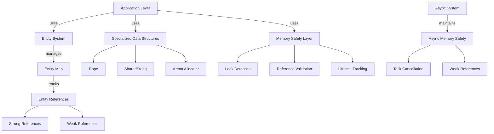

# 34. Ground Level: Memory Management

## Purpose

Memory management is a critical aspect of Zed's architecture that ensures efficient resource usage, prevents memory leaks, and maintains responsive performance even with large files or complex operations. This document examines Zed's memory management techniques, including its entity system, reference patterns, specialized data structures, and safety mechanisms that collectively create a robust foundation for the editor's functionality.

## Concepts

### Entity and Reference Management

Zed implements a sophisticated entity management system to track and control the lifecycle of objects:

- **Entities**: Named objects with identity, state, and lifecycle management
- **Reference Counting**: Tracking object lifetimes through reference counts
- **Strong vs. Weak References**: Different reference types based on ownership requirements
- **Handle Validation**: Runtime checks to ensure references remain valid

### Memory Allocation Patterns

Different allocation strategies are employed based on usage patterns:

- **Arena Allocation**: Bulk allocation/deallocation for groups of related objects
- **Object Pooling**: Reusing objects rather than frequent allocation/deallocation
- **Stack vs. Heap**: Choosing appropriate memory regions based on object size and lifetime
- **Alignment**: Ensuring proper memory alignment for performance and correctness

### Shared Ownership

Handling objects that need to be accessed from multiple locations:

- **Reference Counting**: Tracking shared ownership through atomic counters
- **Copy-on-Write**: Sharing immutable data with efficient mutation semantics
- **Immutable Sharing**: Optimizing for cases where data is rarely modified
- **View Pattern**: Creating lightweight references into larger data structures

### Memory Safety Approaches

Techniques to prevent memory-related bugs:

- **Lifetime Management**: Explicit tracking of object lifetimes
- **Use-after-free Prevention**: Runtime checks to prevent accessing freed memory
- **Leak Detection**: Active monitoring for objects that aren't properly released
- **Safe Async Patterns**: Ensuring memory safety across asynchronous boundaries

## Architecture

Zed's memory management is structured across several layers that work together to ensure efficiency and safety:



## Implementation Details

### Entity System

The core of Zed's memory management is its entity system, implemented in the GPUI framework:

```rust
// Entity represents a strong reference to an object
pub struct Entity<T> {
    id: EntityId,
    type_id: TypeId,
    _phantom: PhantomData<fn() -> T>,
}

// WeakEntity is a non-owning reference
pub struct WeakEntity<T> {
    id: EntityId,
    type_id: TypeId,
    _phantom: PhantomData<fn() -> T>,
}

// EntityMap tracks all entities in the system
struct EntityMap {
    entities: HashMap<EntityId, EntityEntry>,
    next_entity_id: u64,
}

struct EntityEntry {
    state: Arc<dyn Any + Send + Sync>,
    type_id: TypeId,
    strong_count: usize,
    weak_count: usize,
}
```

The entity system provides several key features:

1. **Typed References**: Type-safe access to entities through generics
2. **Reference Counting**: Automatic tracking of strong and weak references
3. **Runtime Validation**: Checks to ensure entities exist before dereferencing
4. **Memory Safety**: Prevention of use-after-free errors through runtime checks

An example of entity creation and use:

```rust
// Create a new entity
let entity = cx.new(|_| MyType::new());

// Create a weak reference
let weak = entity.downgrade();

// Access entity state safely
entity.update(cx, |state, cx| {
    // Mutate state here
});

// Try to access through weak reference
if let Ok(result) = weak.update(cx, |state, cx| {
    // Access only succeeds if entity still exists
}) {
    // Handle result
}
```

### Arena Allocation

Zed implements a custom arena allocator for efficient management of temporary objects:

```rust
pub struct Arena {
    // Current allocation block
    current_chunk: *mut u8,
    // Remaining space in current chunk
    remaining_in_chunk: usize,
    // List of allocated chunks
    chunks: Vec<(*mut u8, usize)>,
    // Objects requiring destructors
    objects_with_destructors: Vec<(*mut dyn Any, fn(*mut dyn Any))>,
}

pub struct ArenaBox<T> {
    ptr: *mut T,
    arena_id: ArenaId,
}
```

The arena allocator provides:

1. **Bulk Allocation**: Allocates memory in large chunks to reduce overhead
2. **Fast Deallocation**: Frees all allocations at once when the arena is cleared
3. **Proper Cleanup**: Runs destructors for all objects with drop implementations
4. **Safety Checks**: Validates arena boxes to prevent use-after-free

Example usage:

```rust
// Create an arena
let arena = Arena::new();

// Allocate objects in the arena
let object1 = arena.alloc(MyLargeStruct::new());
let object2 = arena.alloc(AnotherStruct::new());

// Use the objects
object1.do_something();
object2.do_something_else();

// Free all objects at once
arena.clear();
```

### String Optimization with SharedString

Zed implements specialized string types to optimize for common editor operations:

```rust
pub enum SharedString {
    Static(&'static str),
    Dynamic(Arc<str>),
}

impl Clone for SharedString {
    fn clone(&self) -> Self {
        match self {
            Self::Static(s) => Self::Static(s),
            Self::Dynamic(s) => Self::Dynamic(s.clone()),
        }
    }
}
```

This implementation provides:

1. **Zero-Cost Static Strings**: No allocation for static string literals
2. **Efficient Cloning**: Cloning only increments a reference count for dynamic strings
3. **Memory Sharing**: Multiple components can share the same string data
4. **Optimized Equality Checks**: Fast comparison even for large strings

Example usage:

```rust
// Create from static string - no allocation
let label1 = SharedString::from("Button");

// Create from dynamic string - allocated once and shared
let label2 = SharedString::from(format!("User: {}", username));

// Cloning is cheap - just increments reference count
let label3 = label2.clone();
```

### Rope Data Structure for Text Editing

The rope data structure provides memory-efficient text editing:

```rust
pub struct Rope {
    tree: SumTree<String, RopeSummary>,
}

impl Rope {
    pub fn edit(&mut self, range: Range<usize>, new_text: &str) {
        let chunks = self.chunk_text(new_text);
        self.tree.splice(range, &chunks);
    }
    
    fn chunk_text(&self, text: &str) -> Vec<String> {
        // Split text into optimal chunk sizes
    }
}
```

Key memory optimizations in the rope implementation:

1. **Chunking Strategy**: Text is stored in optimally sized chunks (typically 10-32 bytes)
2. **Efficient Edits**: Modifies only affected chunks, not the entire text
3. **Shared Structure**: Unmodified parts of the text structure remain untouched
4. **Memory Reuse**: Careful reuse of existing chunks when possible

Example of efficient text editing:

```rust
// Create a rope with large text
let mut rope = Rope::from(large_document);

// Edit a small section - only affects relevant chunks
rope.edit(1000..1010, "new text");

// The majority of the rope structure is unchanged and memory is reused
```

### Reference Patterns and Ownership

Zed employs consistent patterns for memory ownership throughout the codebase:

```rust
// Strong ownership with reference counting
type SharedBuffer = Arc<Buffer>;

// Non-owning reference that doesn't prevent deallocation
type WeakBufferRef = Weak<Buffer>;

// Application-managed entities with custom lifecycle
type BufferHandle = Entity<Buffer>;

// Exclusive ownership of heap-allocated object
type OwnedParser = Box<Parser>;

// Temporary object with arena allocation
type TempNode<'a> = ArenaBox<'a, Node>;
```

This approach provides:

1. **Clear Ownership Semantics**: Explicit indication of ownership responsibility
2. **Automatic Cleanup**: Resources are automatically freed when no longer needed
3. **Flexible Sharing**: Different reference types for different sharing requirements
4. **Memory Safety**: Prevents use-after-free and double-free errors

### Memory-Safe Async Patterns

Asynchronous code requires special handling to maintain memory safety:

```rust
impl<T: 'static> Entity<T> {
    pub fn update_in<C, W, F, R>(
        &self,
        async_cx: &mut C,
        f: F,
    ) -> impl Future<Output = Result<R>>
    where
        C: AsyncContextProvider,
        W: WindowHandle,
        F: FnOnce(&mut T, &mut W, &mut Context<T>) -> R,
    {
        let weak_self = self.downgrade();
        let window = async_cx.window().downgrade();
        
        async move {
            // Try to upgrade weak references
            let this = weak_self.upgrade()?;
            let window = window.upgrade()?;
            
            // Only proceed if both still exist
            // ...
        }
    }
}
```

Key async memory safety techniques:

1. **Weak References**: Using weak references for callbacks to prevent memory leaks
2. **Upgrade Pattern**: Explicitly upgrading weak references when needed
3. **Early Return**: Safely handling cases where referenced objects have been freed
4. **Task Cancellation**: Properly cleaning up resources when tasks are cancelled

### Leak Detection

Zed includes built-in leak detection to identify memory leaks during development:

```rust
#[cfg(debug_assertions)]
fn track_entity_creation(&self, id: EntityId, type_name: &'static str) {
    if std::env::var("LEAK_BACKTRACE").is_ok() {
        let backtrace = std::backtrace::Backtrace::capture();
        self.entity_backtraces.lock().insert(id, (type_name, backtrace));
    }
}

#[cfg(debug_assertions)]
fn report_leaks(&self) {
    let backtraces = self.entity_backtraces.lock();
    if !backtraces.is_empty() {
        eprintln!("Entity leaks detected:");
        for (id, (type_name, backtrace)) in backtraces.iter() {
            eprintln!("  Entity {} of type {} was created at:", id, type_name);
            eprintln!("{}", backtrace);
        }
    }
}
```

This system provides:

1. **Early Detection**: Identifies leaks during development
2. **Detailed Information**: Captures backtraces showing where leaked objects were created
3. **Type Information**: Includes type names to help identify what kinds of objects are leaking
4. **Configurable Activation**: Only active when needed to minimize performance impact

## Swift Reimplementation Considerations

### Reference Management

Swift provides several mechanisms for implementing similar reference management:

1. **ARC (Automatic Reference Counting)**: Built-in reference counting for class instances
2. **Weak and Unowned References**: Native support for non-owning references
3. **Class vs. Struct**: Value semantics with structs for simpler ownership models

```swift
// Entity system in Swift
final class EntityManager {
    private var entities: [UUID: Any] = [:]
    private var refCounts: [UUID: Int] = [:]
    
    func create<T: AnyObject>(_ factory: () -> T) -> EntityRef<T> {
        let id = UUID()
        let instance = factory()
        entities[id] = instance
        refCounts[id] = 1
        return EntityRef(id: id, manager: self)
    }
    
    func retain(_ id: UUID) {
        refCounts[id, default: 0] += 1
    }
    
    func release(_ id: UUID) {
        guard let count = refCounts[id], count > 0 else { return }
        refCounts[id] = count - 1
        
        if count == 1 {
            entities.removeValue(forKey: id)
            refCounts.removeValue(forKey: id)
        }
    }
}

struct EntityRef<T: AnyObject> {
    let id: UUID
    weak var manager: EntityManager?
    
    // Access entity safely with validation
}
```

### Arena Allocation

Swift can implement similar arena allocation patterns:

```swift
final class Arena<Key: Hashable> {
    private var blocks: [UnsafeMutableRawPointer] = []
    private var currentBlock: UnsafeMutableRawPointer
    private var currentOffset: Int = 0
    private var objectsWithDeinitializers: [(UnsafeMutableRawPointer, () -> Void)] = []
    
    // Allocation methods
    
    func allocate<T>(_ value: T) -> ArenaPointer<T, Key> {
        // Implementation
    }
    
    func clear() {
        // Run deinitializers in reverse order
        for (_, deinitializer) in objectsWithDeinitializers.reversed() {
            deinitializer()
        }
        
        // Free all blocks
        blocks.forEach { $0.deallocate() }
    }
}
```

### String Optimization

Swift's copy-on-write strings already provide many optimizations, but can be enhanced:

```swift
enum SharedString {
    case staticString(StaticString)
    case dynamicString(String)
    
    var string: String {
        switch self {
        case .staticString(let staticStr):
            return staticStr.description
        case .dynamicString(let str):
            return str
        }
    }
}
```

### Rope Implementation

A Swift rope implementation can use similar chunking strategies:

```swift
struct Rope {
    private var tree: SumTree<String, RopeSummary>
    
    func edit(range: Range<Int>, newText: String) {
        let chunks = chunkText(newText)
        tree.splice(range, items: chunks)
    }
    
    private func chunkText(_ text: String) -> [String] {
        // Similar chunking logic to optimize for Swift String
    }
}
```

### Safe Async Patterns

Swift's structured concurrency provides strong safety guarantees:

```swift
extension Entity {
    func update<T>(
        asyncContext: AsyncContext,
        action: @escaping (T) async throws -> Void
    ) async throws {
        // Convert to weak reference
        let weakSelf = asWeak()
        
        // Use withTask for cancellation handling
        try await withTask {
            // Upgrade to strong reference
            guard let strongSelf = weakSelf.asStrong() else {
                throw EntityError.entityReleased
            }
            
            // Perform action safely
            try await action(strongSelf)
        }
    }
}
```

## Conclusion

Zed's memory management architecture demonstrates a sophisticated approach to balancing efficiency, safety, and performance in a complex application. Through its entity system, specialized data structures, arena allocation, and careful reference management, Zed achieves robust memory safety while maintaining high performance even for large documents and complex operations.

When implementing similar functionality in Swift, leveraging Swift's ARC system, value semantics, and structured concurrency features can provide comparable memory safety with potentially simpler code. The core concepts of entity management, specialized text structures, and efficient allocation patterns remain equally applicable and can be adapted to Swift's ownership model to create a high-performance editor with strong memory safety guarantees.