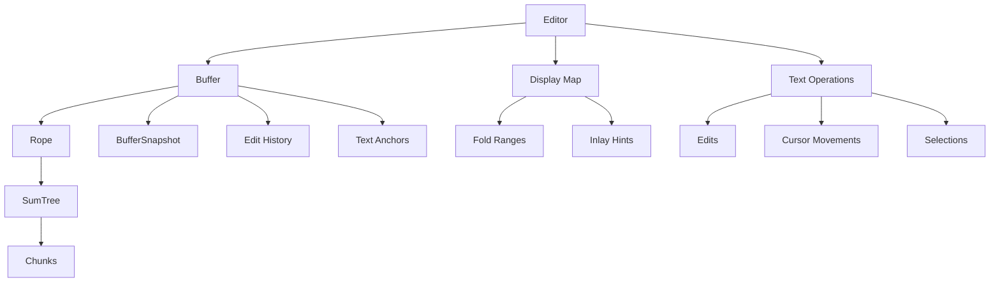

# Text Processing in Zed

## Purpose
This document examines Zed's text processing capabilities, focusing on how text is represented, manipulated, and displayed. Understanding text processing is crucial as it forms the foundation of any text editor and directly impacts performance, memory usage, and user experience. This analysis will detail Zed's data structures and algorithms for efficient text operations.

## Concepts

### Rope Data Structure
At the core of Zed's text processing lies the rope data structure, a specialized data structure optimized for representing and manipulating large text documents. Unlike a simple string, a rope organizes text into a tree of smaller chunks, allowing for efficient insertion, deletion, and navigation without having to copy the entire text buffer for each operation.

### SumTree
Zed implements its rope using a SumTree, which is a B+ tree variant where each node contains summary information about its subtree. This summary information enables efficient queries about text properties like line counts, character counts, and positional mapping between different coordinate systems.

### Chunks and Text Representation
Text is stored in chunks of bounded size, with each chunk containing not just the text itself but also metadata about character boundaries, newlines, and other useful information for quick navigation and indexing.

### Coordinate Systems
Zed maintains several coordinate systems:
- Byte offsets (positions within the raw text)
- Character counts (accounting for multi-byte Unicode characters)
- Line and column positions (for cursor positioning and display)
- UTF-16 code units (for compatibility with external systems like language servers)

### Text Operations
The system supports efficient operations including:
- Text insertion and deletion
- Navigation by character, line, or custom units
- Search and replacement
- Selection manipulation
- Collaborative editing via operational transforms

## Architecture

The text processing system in Zed is composed of several interconnected components:



### Key Components

1. **Rope**: The core data structure representing text
2. **Buffer**: Manages the text content and coordinates the editing operations
3. **BufferSnapshot**: An immutable view of the buffer at a point in time
4. **DisplayMap**: Maps buffer coordinates to screen coordinates, handling folds and inlays
5. **Editor**: Combines the buffer with UI elements for display and interaction

## Implementation Details

### Rope Implementation

The rope implementation in Zed uses a custom `SumTree` to organize text in chunks. Each chunk has a maximum size (`MAX_BASE`, typically 128 bytes) to ensure balanced tree operations:

```rust
#[derive(Clone, Default)]
pub struct Rope {
    chunks: SumTree<Chunk>,
}

pub struct Chunk {
    chars: u128,         // Bitmap of character boundaries 
    chars_utf16: u128,   // Bitmap and counts for UTF-16
    newlines: u128,      // Bitmap of newline positions
    tabs: u128,          // Bitmap of tab positions
    pub text: ArrayString<MAX_BASE>,
}
```

This structure allows for:
- Fast splitting and joining of text
- Efficient indexing into the text
- Quick computation of line numbers and column positions
- Maintaining mapping between different coordinate systems

The bitmaps use a clever representation where each bit represents a position in the text, making operations like "find the nth character" or "count newlines before position X" extremely efficient.

### Coordinate Mapping

Zed provides comprehensive coordinate mapping between different systems:

```rust
impl Rope {
    pub fn offset_to_point(&self, offset: usize) -> Point { ... }
    pub fn point_to_offset(&self, point: Point) -> usize { ... }
    pub fn offset_to_offset_utf16(&self, offset: usize) -> OffsetUtf16 { ... }
    pub fn offset_utf16_to_offset(&self, offset: OffsetUtf16) -> usize { ... }
    pub fn point_to_point_utf16(&self, point: Point) -> PointUtf16 { ... }
    // ... and more
}
```

These methods ensure efficient translation between coordinate systems, which is essential for operations like cursor movement, selection manipulation, and integration with external tools like language servers.

### Text Mutation

Text mutation operations are designed to minimize memory allocation and copying:

```rust
impl Rope {
    pub fn push(&mut self, text: &str) { ... }
    pub fn push_front(&mut self, text: &str) { ... }
    pub fn replace(&mut self, range: Range<usize>, text: &str) { ... }
    pub fn slice(&self, range: Range<usize>) -> Rope { ... }
    // ... and more
}
```

The implementation uses smart chunking strategies to avoid excessive tree rebalancing:
1. For small edits, it tries to modify existing chunks
2. For larger edits, it efficiently splits and recombines chunks
3. When appending large amounts of text, it uses parallelism for better performance

### Buffer and History

The `Buffer` type wraps the rope and adds crucial functionality:

```rust
pub struct Buffer {
    snapshot: BufferSnapshot,
    history: History,
    deferred_ops: OperationQueue<Operation>,
    // ... other fields
}
```

Key aspects:
1. Maintains edit history for undo/redo
2. Supports collaborative editing through operational transforms
3. Provides efficient snapshots for concurrent access
4. Manages text anchors that maintain their logical position as text changes

### Display Mapping

The `DisplayMap` handles the transformation from buffer coordinates to screen coordinates:

```rust
pub struct DisplayMap {
    snapshot: BufferSnapshot,
    // ... various display state fields
}
```

This component:
1. Manages soft wrapping of lines
2. Handles code folding regions
3. Incorporates inlay hints (like type hints in code)
4. Accounts for invisible characters (tabs, spaces, etc.)
5. Handles bidirectional text

### Searching and Matching

Zed implements efficient text search through multiple strategies:
1. Direct string matching for simple cases
2. Regular expression support for complex patterns
3. Specialized algorithms for finding word boundaries, brackets, etc.

The search algorithms are designed to work efficiently with the rope structure, avoiding the need to materialize the entire text buffer.

## Swift Reimplementation Considerations

### Data Structure Adaptation

1. **SumTree Implementation**: 
   - Swift doesn't have direct equivalents to Rust's trait system, so the `SumTree` implementation would need to be adapted.
   - Consider using protocols and associated types to mimic Rust's traits.
   - Swift's value semantics would be beneficial for immutable snapshots.

2. **Bitmap Operations**:
   - Swift has good support for bit-level operations, but the specific optimizations might differ.
   - Consider using `UInt128` or a custom type to match Rust's `u128` usage for bitmaps.

3. **Memory Management**:
   - Rather than Rust's borrowing system, use Swift's ARC with careful consideration of reference cycles.
   - Consider copy-on-write semantics for efficient snapshots.

### Coordinate Systems

1. **Strong Typing**:
   - Use Swift's strong type system to create distinct types for different coordinate systems (byte offset, point, UTF-16 offset).
   - Consider using structs with private initializers to ensure coordinate system conversions go through proper channels.

2. **Efficient Mapping**:
   - Implement the mapping functions with similar optimizations as the Rust version.
   - Use Swift's computed properties for common conversions.

### Text Operations

1. **String Handling**:
   - Swift's `String` type already handles Unicode correctly but is less efficient for large-scale operations.
   - Create a similar chunking strategy to Rust's implementation.
   - Use Swift's `String.Index` system carefully as it differs from Rust's byte indexing.

2. **Concurrency Model**:
   - Use Swift's structured concurrency (async/await) instead of Rust's async model.
   - Swift actors could provide a natural replacement for some of Rust's concurrency patterns.

### Performance Considerations

1. **Memory Layout**:
   - Ensure structs have optimal memory layout in Swift.
   - Consider using `@frozen` for performance-critical structs.

2. **Algorithm Adaptation**:
   - The bitmap operations in `Chunk` might need adaptation for optimal Swift performance.
   - Consider Swift-specific optimizations for text processing.

3. **Swift's String Internals**:
   - Be aware of Swift's `String` implementation details, which differ from Rust's UTF-8 representation.
   - May need custom handling for certain Unicode operations.

## Conclusion

Zed's text processing system is a sophisticated implementation that combines a rope data structure with efficient coordinate mapping and text manipulation operations. The system is designed to handle large documents with good performance while correctly managing complex Unicode text.

The rope-based approach using a `SumTree` provides an excellent balance between memory efficiency and operation speed. The careful handling of different coordinate systems ensures that the editor can interact properly with external tools while maintaining a responsive user interface.

For Swift reimplementation, the core data structures and algorithms can be adapted while taking advantage of Swift's unique language features like strong typing, protocols, and value semantics. Special attention should be paid to memory management patterns and Unicode handling, which differ significantly between Rust and Swift.