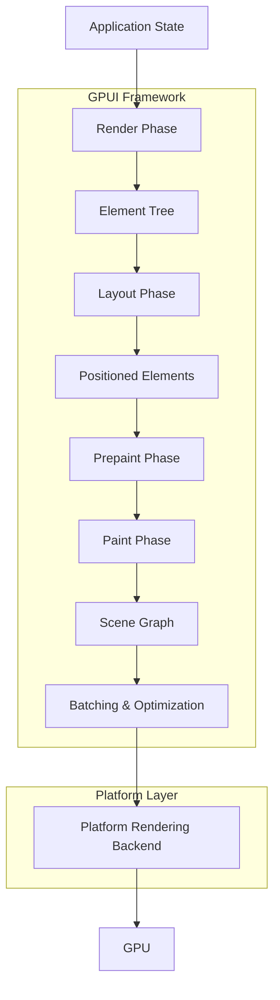

# UI Rendering in Zed

## Purpose
This document examines the rendering architecture in Zed, focusing on how UI elements are transformed from high-level abstractions to pixels on the screen. Understanding the rendering pipeline is crucial for both performance optimization and implementing custom UI components. This analysis will detail the rendering stack from the GPUI framework through platform-specific backends.

## Concepts

### Scene Graph Model
Zed uses a scene graph approach to represent the visual elements of the application. The scene graph is a hierarchical collection of graphical elements that can be manipulated and rendered. This approach allows for efficient updates and rendering of complex UIs.

### Element Tree
UI elements in Zed form a tree structure. Each frame, this element tree is constructed from the application state, laid out according to flexible rules, and painted to the screen. The tree is ephemeral, being rebuilt for each render cycle.

### Layout System
Zed employs a Flexbox-based layout engine (via the Taffy library) to determine the position and size of UI elements. This layout system is similar to web standards, allowing for responsive and flexible layouts.

### Rendering Pipeline
The rendering pipeline processes the element tree through several stages:
1. Element construction (render phase)
2. Layout calculation (layout phase)
3. Pre-paint preparation (prepaint phase)
4. Painting to scene graph (paint phase)
5. Batching and optimization
6. Backend-specific rendering (Metal/OpenGL/DirectX)

### Retained Mode vs. Immediate Mode
Zed's GPUI primarily uses a retained mode GUI paradigm where the application maintains a model of the UI that is updated and rendered each frame, rather than directly issuing draw commands (immediate mode).

## Architecture

The UI rendering system in Zed consists of several interconnected components organized in layers:



### Key Components

1. **Element System**: The abstraction for UI components (`Element` trait)
2. **Taffy Layout Engine**: The layout calculator that positions elements
3. **Scene Graph**: The intermediate representation of visual elements
4. **Metal/OpenGL Renderer**: Platform-specific rendering backends
5. **Window System**: Manages OS windows, input events, and rendering contexts

## Implementation Details

### Element System

The `Element` trait is the foundation of Zed's UI rendering system:

```rust
pub trait Element: 'static + IntoElement {
    type RequestLayoutState: 'static;
    type PrepaintState: 'static;

    fn id(&self) -> Option<ElementId>;
    
    fn request_layout(
        &mut self,
        id: Option<&GlobalElementId>,
        window: &mut Window,
        cx: &mut App,
    ) -> (LayoutId, Self::RequestLayoutState);

    fn prepaint(
        &mut self,
        id: Option<&GlobalElementId>,
        bounds: Bounds<Pixels>,
        request_layout: &mut Self::RequestLayoutState,
        window: &mut Window,
        cx: &mut App,
    ) -> Self::PrepaintState;

    fn paint(
        &mut self,
        id: Option<&GlobalElementId>,
        bounds: Bounds<Pixels>,
        request_layout: &mut Self::RequestLayoutState,
        prepaint: &mut Self::PrepaintState,
        window: &mut Window,
        cx: &mut App,
    );
}
```

Elements are constructed through the `render` method of the `Render` trait:

```rust
pub trait Render: 'static + Sized {
    fn render(&mut self, window: &mut Window, cx: &mut Context<Self>) -> impl IntoElement;
}
```

This design creates a clear separation between:
- Model (the application state)
- View definition (the `render` method)
- Rendering (the `Element` implementation)

### Taffy Layout Engine

Zed uses Taffy, a Rust implementation of Flexbox, for layout calculations:

```rust
pub struct TaffyLayoutEngine {
    taffy: TaffyTree<NodeContext>,
    absolute_layout_bounds: FxHashMap<LayoutId, Bounds<Pixels>>,
    computed_layouts: FxHashSet<LayoutId>,
}
```

The layout engine:
1. Takes element styles and content sizes
2. Calculates element positions and dimensions
3. Handles complex arrangements like flexbox and grids
4. Manages element measurement for dynamic content

### Scene Graph

The `Scene` struct represents the intermediate rendering model:

```rust
pub(crate) struct Scene {
    pub(crate) paint_operations: Vec<PaintOperation>,
    primitive_bounds: BoundsTree<ScaledPixels>,
    layer_stack: Vec<DrawOrder>,
    pub(crate) shadows: Vec<Shadow>,
    pub(crate) quads: Vec<Quad>,
    pub(crate) paths: Vec<Path<ScaledPixels>>,
    pub(crate) underlines: Vec<Underline>,
    pub(crate) monochrome_sprites: Vec<MonochromeSprite>,
    pub(crate) polychrome_sprites: Vec<PolychromeSprite>,
    pub(crate) surfaces: Vec<PaintSurface>,
}
```

The scene graph contains various primitive drawing operations that are sorted and batched for efficient rendering. These primitives include:
- Quads (rectangles with colors, borders, etc.)
- Paths (vector shapes)
- Sprites (bitmap images)
- Text (rendered glyphs)
- Shadows and other effects

### Metal Renderer (macOS)

On macOS, Zed uses Metal for hardware-accelerated rendering:

```rust
pub(crate) struct MetalRenderer {
    device: metal::Device,
    layer: metal::MetalLayer,
    command_queue: CommandQueue,
    paths_rasterization_pipeline_state: metal::RenderPipelineState,
    // Other pipeline states and resources
    instance_buffer_pool: Arc<Mutex<InstanceBufferPool>>,
    sprite_atlas: Arc<MetalAtlas>,
    // Other fields
}
```

The Metal renderer:
1. Translates scene graph operations into Metal draw commands
2. Manages GPU resources like textures and buffers
3. Implements shader pipelines for different rendering tasks
4. Optimizes memory usage with buffer pooling
5. Handles GPU synchronization and frame presentation

### Rendering Process Flow

The rendering process follows these steps:

1. **Invalidation**: Views signal that they need to be redrawn
   ```rust
   window_invalidator.invalidate_view(entity, cx);
   ```

2. **Element Construction**: The view hierarchy is traversed to build an element tree
   ```rust
   fn render(&mut self, window: &mut Window, cx: &mut Context<Self>) -> impl IntoElement {
       div()
           .style(/* ... */)
           .child(/* ... */)
           .child(/* ... */)
   }
   ```

3. **Layout Calculation**: Elements request layout and the Taffy engine calculates positions
   ```rust
   fn request_layout(&mut self, /* ... */) -> (LayoutId, Self::RequestLayoutState) {
       let layout_id = cx.request_layout(self.style, self.rem_size, &self.children);
       (layout_id, state)
   }
   ```

4. **Prepaint**: Elements process their bounds and prepare for painting
   ```rust
   fn prepaint(&mut self, /* ... */) -> Self::PrepaintState {
       // Process bounds, register hitboxes, etc.
   }
   ```

5. **Paint**: Elements draw themselves to the scene graph
   ```rust
   fn paint(&mut self, /* ... */) {
       window.paint_quad(Quad {
           bounds,
           background: self.background,
           // Other properties
       });
   }
   ```

6. **Scene Processing**: The scene graph is sorted and optimized
   ```rust
   scene.finish(); // Sort primitives
   ```

7. **GPU Rendering**: The platform renderer translates the scene to GPU commands
   ```rust
   // In MetalRenderer
   fn render_scene(&mut self, scene: &Scene) {
       // Set up command buffer, render passes, etc.
       // Draw primitives with appropriate shaders
       // Present to screen
   }
   ```

### Batching and Optimization

Zed implements several optimizations for efficient rendering:

1. **Instance Batching**: Similar primitives are grouped to minimize draw calls
   ```rust
   pub(crate) struct InstanceBufferPool {
       buffer_size: usize,
       buffers: Vec<metal::Buffer>,
   }
   ```

2. **Atlas Texturing**: Multiple small textures are packed into larger atlases
   ```rust
   pub(crate) struct MetalAtlas {
       device: metal::Device,
       texture: metal::Texture,
       // Other fields
   }
   ```

3. **Primitive Sorting**: Draw operations are sorted to minimize state changes
   ```rust
   // In Scene.finish()
   self.quads.sort_by_key(|quad| quad.order);
   self.paths.sort_by_key(|path| path.order);
   // Sort other primitives
   ```

4. **View Culling**: Off-screen elements are skipped from rendering
   ```rust
   // Check if bounds intersect with visible area
   if clipped_bounds.is_empty() {
       return;
   }
   ```

### Special Rendering Components

#### Text Rendering

Text rendering is handled through platform-specific text systems:

```rust
impl WindowTextSystem for PlatformDisplay {
    fn shape_line(&self, /* ... */) -> ShapedLine {
        // Complex text shaping logic
    }
    
    fn raster_glyph(&self, /* ... */) -> RasterizedGlyph {
        // Glyph rasterization
    }
}
```

Zed uses platform text APIs for complex script rendering and text layout, ensuring high-quality typography.

#### Editor Rendering

The editor component has specialized rendering logic for efficiently displaying code:

```rust
// Simplified from EditorElement
fn paint(&mut self, /* ... */) {
    // Paint visible lines
    for line in visible_lines {
        // Handle selections, line numbers, syntax highlighting
        // Paint glyphs, cursors, inlay hints
    }
    
    // Paint scrollbars, minimap, etc.
}
```

The editor renderer:
1. Only renders visible lines
2. Efficiently handles syntax highlighting
3. Manages cursors and selections
4. Displays line numbers and gutters
5. Renders specialized UI like inlay hints and git diff markers

## Swift Reimplementation Considerations

### Graphics API Selection

1. **Metal Integration**:
   - Swift has native Metal bindings which would be more straightforward than Rust's foreign bindings.
   - Consider using MetalKit for some of the boilerplate that's manually implemented in Zed.

2. **Platform Abstraction**:
   - If cross-platform is a goal, consider implementing a rendering abstraction layer.
   - Metal for macOS/iOS, and potentially another backend for other platforms.

### Layout Engine Alternatives

1. **SwiftUI Layout**:
   - SwiftUI's layout system is similar to Flexbox but has its own quirks.
   - Consider whether to reimplement Taffy or adapt to SwiftUI's layout primitives.

2. **Custom Layout Engine**:
   - A direct port of Taffy could be implemented for exact layout compatibility.
   - Performance might differ due to different memory models and optimization techniques.

### Scene Graph Implementation

1. **Structured Rendering**:
   - Use Swift's type system for a more structured scene graph with clear type hierarchies.
   - Consider protocol-oriented design with protocol inheritance for primitive types.

2. **Memory Management**:
   - Swift's ARC differs from Rust's ownership model; carefully design buffer pooling.
   - Use value types (structs) for immutable primitives and reference types (classes) for shared resources.

### Performance Considerations

1. **Swift Performance Tradeoffs**:
   - Swift's dynamic dispatch may affect performance in hot paths; consider `@inlinable` and `@inline(__always)`.
   - Use Swift's value semantics for scene graph nodes that change frequently.

2. **Memory Management**:
   - Implement buffer pooling with careful consideration of ARC behavior.
   - Consider using unsafe memory access in performance-critical sections, with proper safety checks.

3. **Concurrency Model**:
   - Swift's concurrency model (async/await) is different from Rust's async model.
   - Consider using Swift Actors to isolate rendering state and prevent races.

### Text Rendering

1. **CoreText Integration**:
   - Use Swift's native bindings to CoreText for text rendering on Apple platforms.
   - Text rendering is a complex domain; leverage platform APIs as much as possible.

2. **Font Management**:
   - Consider using the system font manager instead of custom font loading.
   - Design a clear font caching strategy to prevent performance issues.

## Conclusion

Zed's UI rendering system employs a sophisticated architecture that balances flexibility, performance, and maintainability. The separation between element definition, layout calculation, and actual rendering allows for a clean component model while still enabling high-performance graphics.

The scene graph approach, combined with efficient batching and GPU rendering, allows Zed to maintain smooth performance even with complex UIs. The Metal backend on macOS provides hardware-accelerated rendering with minimal overhead.

For Swift reimplementation, the core architectural concepts can be preserved while adapting to Swift's language features and the native platform APIs. The main challenge will be balancing the desire for identical visual output with the opportunities to leverage platform-specific optimizations available in Swift and Apple's frameworks.