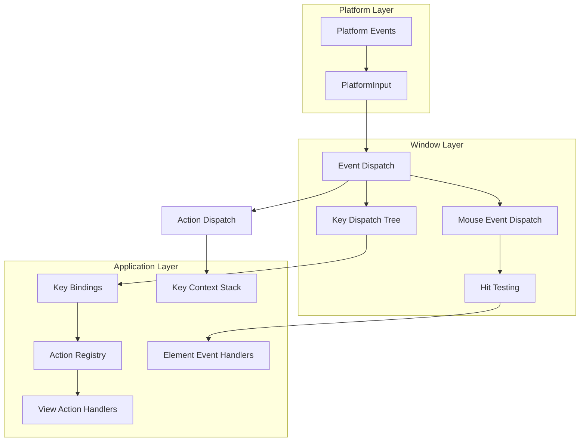

# Event Handling in Zed

## Purpose
This document examines Zed's event handling system, focusing on how user interactions (keyboard, mouse, focus changes, etc.) are processed and distributed throughout the application. Understanding this system is crucial for implementing responsive UIs and complex user interactions. This analysis will detail the event handling architecture from platform-specific events through to application-level action dispatch.

## Concepts

### Event Flow Architecture
Zed implements a comprehensive event system that routes user interactions from platform-specific inputs to high-level application actions. The system follows a capture/bubble phase model similar to web browser event handling, allowing for both global event interception and targeted event handling.

### Event Types
The system processes multiple types of events:
- **Input events**: Keyboard events, mouse events, scroll events, etc.
- **Focus events**: Tracking UI focus changes between elements
- **Action events**: High-level application actions triggered by key bindings
- **System events**: Window state changes, display changes, etc.

### Event Dispatch Phases
Each event is processed in two distinct phases:
1. **Capture Phase**: Events propagate from the root to the target element, allowing parent elements to intercept events
2. **Bubble Phase**: Events propagate from the target element back up to the root, allowing for delegated handling

### Key Bindings and Action System
Zed connects raw input events to semantic application actions through a key binding system. This allows for configurable key mappings and provides a level of indirection between physical inputs and logical actions.

### Input Handling
Text input handling is managed through specialized handlers that provide methods for text selection, replacement, and editing, enabling powerful text editing capabilities across the application.

## Architecture

The event handling system in Zed connects several architectural layers, from platform-specific event sources to application-level action handlers:



### Key Components

1. **Platform Input**: Converts platform-specific events to GPUI's event types
2. **Dispatch Tree**: Hierarchical structure for routing events through the UI tree
3. **Key Context**: Defines context-sensitive key bindings for different UI states
4. **Action Registry**: Maps action types to their handlers throughout the application
5. **Input Handlers**: Specialized interfaces for handling text input and editing

## Implementation Details

### Event Types and Representation

Zed defines a comprehensive set of event types to represent user interactions:

```rust
pub trait InputEvent: Sealed + 'static {
    fn to_platform_input(self) -> PlatformInput;
}

pub trait KeyEvent: InputEvent {}
pub trait MouseEvent: InputEvent {}

// Key events
#[derive(Clone, Debug, Eq, PartialEq)]
pub struct KeyDownEvent {
    pub keystroke: Keystroke,
    pub is_held: bool,
}

#[derive(Clone, Debug)]
pub struct KeyUpEvent {
    pub keystroke: Keystroke,
}

#[derive(Clone, Debug, Default)]
pub struct ModifiersChangedEvent {
    pub modifiers: Modifiers,
}

// Mouse events
#[derive(Clone, Debug, Default)]
pub struct MouseDownEvent {
    pub button: MouseButton,
    pub position: Point<Pixels>,
    pub modifiers: Modifiers,
    pub click_count: usize,
    pub first_mouse: bool,
}

#[derive(Clone, Debug, Default)]
pub struct MouseUpEvent {
    pub button: MouseButton,
    pub position: Point<Pixels>,
    pub modifiers: Modifiers,
    pub click_count: usize,
}
```

These events are wrapped in a `PlatformInput` enum to provide a unified type for event handling:

```rust
pub enum PlatformInput {
    KeyDown(KeyDownEvent),
    KeyUp(KeyUpEvent),
    ModifiersChanged(ModifiersChangedEvent),
    MouseDown(MouseDownEvent),
    MouseMove(MouseMoveEvent),
    MouseUp(MouseUpEvent),
    // ... other event types
}
```

### Platform Event Translation

Platform-specific events are translated into Zed's event types through platform adapters. For instance, on macOS:

```rust
// In events.rs for macOS
impl PlatformInput {
    pub(crate) unsafe fn from_native(
        native_event: id,
        window_height: Option<Pixels>,
    ) -> Option<Self> {
        unsafe {
            let event_type = native_event.eventType();
            
            match event_type {
                NSEventType::NSFlagsChanged => {
                    Some(Self::ModifiersChanged(ModifiersChangedEvent {
                        modifiers: read_modifiers(native_event),
                    }))
                }
                NSEventType::NSKeyDown => Some(Self::KeyDown(KeyDownEvent {
                    keystroke: parse_keystroke(native_event),
                    is_held: native_event.isARepeat() == YES,
                })),
                // ... other event type translations
            }
        }
    }
}
```

### Dispatch Tree Structure

The dispatch tree is a hierarchical structure that mirrors the UI element tree and manages event routing:

```rust
pub(crate) struct DispatchTree {
    node_stack: Vec<DispatchNodeId>,
    pub(crate) context_stack: Vec<KeyContext>,
    view_stack: Vec<EntityId>,
    nodes: Vec<DispatchNode>,
    focusable_node_ids: FxHashMap<FocusId, DispatchNodeId>,
    view_node_ids: FxHashMap<EntityId, DispatchNodeId>,
    keymap: Rc<RefCell<Keymap>>,
    action_registry: Rc<ActionRegistry>,
}

#[derive(Default)]
pub(crate) struct DispatchNode {
    pub key_listeners: Vec<KeyListener>,
    pub action_listeners: Vec<DispatchActionListener>,
    pub modifiers_changed_listeners: Vec<ModifiersChangedListener>,
    pub context: Option<KeyContext>,
    pub focus_id: Option<FocusId>,
    view_id: Option<EntityId>,
    parent: Option<DispatchNodeId>,
}
```

### Event Dispatch Process

The central method for handling events is `dispatch_event` in the `Window` struct:

```rust
fn dispatch_event(&mut self, mut event: PlatformInput, cx: &mut App) -> DispatchEventResult {
    // Reset state for new event
    self.default_prevented = false;

    // Handle different event types
    match &mut event {
        PlatformInput::KeyDown(event) => {
            // Process key down event
            self.process_key_down(event, cx)
        }
        PlatformInput::MouseDown(event) => {
            // Process mouse down event
            self.process_mouse_down(event, cx)
        }
        // ... other event types
    }
}
```

Events are typically dispatched in two phases:

```rust
// Simplified dispatch logic for key events
fn dispatch_key_event(&mut self, event: &KeyEvent, cx: &mut App) -> bool {
    // Capture phase - root to focused element
    let mut propagate = self.dispatch_key_event_in_phase(
        event, 
        DispatchPhase::Capture, 
        cx
    );
    
    // Bubble phase - focused element to root
    if propagate {
        propagate = self.dispatch_key_event_in_phase(
            event, 
            DispatchPhase::Bubble, 
            cx
        );
    }
    
    propagate
}
```

### Key Bindings and Action System

The key binding system maps keystrokes to actions:

```rust
// Defining actions
actions!(editor, [Undo, Redo]);

// Key binding registration
cx.bind_keys([
  KeyBinding::new("cmd-z", Editor::undo, Some("Editor")),
  KeyBinding::new("cmd-shift-z", Editor::redo, Some("Editor")),
])

// Action handler implementation
impl Editor {
  fn undo(&mut self, _: &Undo, _window: &mut Window, _cx: &mut Context<Self>) { ... }
  fn redo(&mut self, _: &Redo, _window: &mut Window, _cx: &mut Context<Self>) { ... }
}

// Listening for actions in render method
impl Render for Editor {
  fn render(&mut self, window: &mut Window, cx: &mut Context<Self>) -> impl IntoElement {
    div()
      .key_context("Editor")
      .on_action(cx.listener(Editor::undo))
      .on_action(cx.listener(Editor::redo))
    ...
  }
}
```

The key context system enables context-sensitive key bindings:

```rust
// Element with context-specific key bindings
div()
    .key_context("Editor")  // Applies "Editor" context to this element and descendants
    .child(/* ... */)
```

### Input Handling for Text

The `EntityInputHandler` trait provides a unified interface for text input:

```rust
pub trait EntityInputHandler: 'static + Sized {
    fn text_for_range(
        &mut self,
        range: Range<usize>,
        adjusted_range: &mut Option<Range<usize>>,
        window: &mut Window,
        cx: &mut Context<Self>,
    ) -> Option<String>;

    fn selected_text_range(
        &mut self,
        ignore_disabled_input: bool,
        window: &mut Window,
        cx: &mut Context<Self>,
    ) -> Option<UTF16Selection>;

    fn replace_text_in_range(
        &mut self,
        range: Option<Range<usize>>,
        text: &str,
        window: &mut Window,
        cx: &mut Context<Self>,
    );
    
    // ... other text manipulation methods
}
```

This interface is used to connect UI elements with text editing capabilities:

```rust
// During element painting
window.handle_input(
    ElementInputHandler::new(element_bounds, view_entity),
);
```

### Mouse Event Hit Testing

Mouse events are dispatched based on hit testing against element bounds:

```rust
fn dispatch_mouse_event(&mut self, event: &MouseEvent, cx: &mut App) -> bool {
    // Find the hit element at the event position
    let hit_test_result = self.hit_test(event.position);
    
    // Capture phase - root to target element
    let mut propagate = self.dispatch_mouse_event_in_phase(
        event,
        hit_test_result,
        DispatchPhase::Capture,
        cx
    );
    
    // Bubble phase - target element to root
    if propagate {
        propagate = self.dispatch_mouse_event_in_phase(
            event,
            hit_test_result,
            DispatchPhase::Bubble,
            cx
        );
    }
    
    propagate
}
```

## Swift Reimplementation Considerations

### Event System Architecture

1. **Responder Chain vs. Capture/Bubble**:
   - Swift's UIKit/AppKit use a responder chain model that differs from the capture/bubble model.
   - Consider implementing a custom event dispatch system that follows Zed's model rather than relying on the native responder chain.

2. **Action System**:
   - Swift's target-action pattern is similar to Zed's action system but less flexible.
   - Design a more comprehensive action registry that can support context-sensitive actions.

### Event Types

1. **Strong Typing**:
   - Use Swift's strong type system to create a similar event hierarchy.
   - Consider using protocols with associated types for more type safety.

2. **Event Protocol Implementation**:
   ```swift
   protocol InputEvent {
       func toPlatformInput() -> PlatformInput
   }
   
   protocol KeyEvent: InputEvent {}
   protocol MouseEvent: InputEvent {}
   
   struct KeyDownEvent: KeyEvent {
       let keystroke: Keystroke
       let isHeld: Bool
       
       func toPlatformInput() -> PlatformInput {
           return .keyDown(self)
       }
   }
   ```

### Platform Integration

1. **AppKit/UIKit Event Translation**:
   - Implement adapters for NSEvent/UIEvent to your custom event types.
   - Consider using responder methods as entry points but translate to your event system.

2. **Key Mapping**:
   - macOS uses different key codes and modifier flags than Zed.
   - Create a mapping layer between platform key codes and your key representation.

### Dispatch Tree Implementation

1. **Element Tree Synchronization**:
   - Ensure the dispatch tree stays synchronized with the UI element tree.
   - In Swift, this might involve more explicit subscription patterns due to different memory models.

2. **Memory Management**:
   - Replace Rust's reference-counted pointers with Swift's ARC references.
   - Be careful with potential reference cycles in event handlers; use weak references where appropriate.

### Performance Considerations

1. **Event Pooling**:
   - Consider implementing event object pooling to reduce allocation pressure.
   - Swift's value types for small event objects could be more efficient than class instances.

2. **Handler Optimization**:
   - Profile event dispatch paths to identify bottlenecks.
   - Consider specialized fast paths for common events like mouse movement.

### Context-Specific Features

1. **Text Input**:
   - Integrate with NSTextInputClient (macOS) or UITextInput (iOS) for text input handling.
   - Implement a bridging layer between platform text APIs and your text system.

2. **Accessibility**:
   - Ensure event handling connects properly with platform accessibility features.
   - Design event handlers with accessibility in mind.

## Conclusion

Zed's event handling system provides a robust foundation for user interaction, combining the flexibility of web-like event dispatching with the performance requirements of a native application. The capture/bubble phase model enables sophisticated event handling scenarios, while the dispatch tree structure ensures events are routed efficiently through the UI hierarchy.

The system's separation of input events from actions creates a clear distinction between physical interactions and their semantic meaning in the application. This separation enables configurable key bindings and more maintainable code.

For a Swift reimplementation, the core architecture can be preserved while adapting to Swift's language features and memory model. The biggest challenges will likely be integrating with platform-specific input systems while maintaining the flexibility and power of Zed's event model.

By carefully designing the event handling system, a Swift implementation can achieve the same responsive feel and powerful interaction capabilities that make Zed's interface feel natural and intuitive to users.