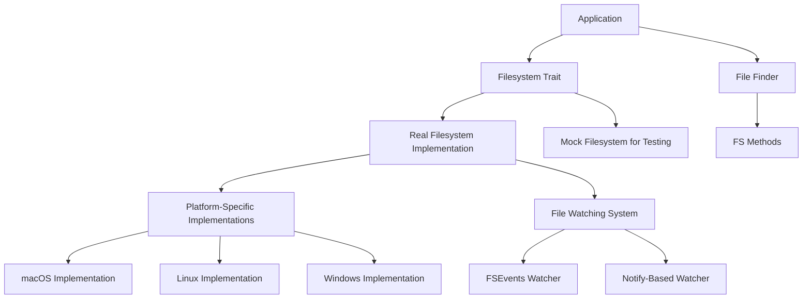

# File I/O in Zed

## Purpose
This document examines Zed's file I/O system, focusing on how the editor interacts with the filesystem for reading, writing, and monitoring files. Understanding these mechanisms is crucial for ensuring data reliability, performance, and cross-platform compatibility. This analysis will detail the architecture of Zed's file system abstractions, optimization strategies, and platform-specific implementations.

## Concepts

### File System Abstraction
Zed uses a trait-based abstraction for file system operations. This allows for consistent access patterns while enabling platform-specific optimizations and facilitating testing through mock implementations.

### File Watching
File watching capabilities enable Zed to detect changes made to files outside the editor, supporting real-time collaboration and preventing data loss from external modifications.

### Atomic File Operations
Atomic file operations ensure data integrity by preventing partial writes and reducing the risk of file corruption during system failures.

### Path Management
Zed implements careful path management to handle different platforms, dealing with case sensitivity differences, path normalization, and symlink resolution.

### Metadata Handling
The system tracks file metadata like modification times to detect external changes and efficiently determine when files need to be refreshed.

## Architecture

The file I/O system in Zed is structured into several modular components:



### Key Components

1. **Filesystem Trait**: A platform-agnostic interface for file operations
2. **File Watchers**: Platform-specific implementations for detecting file changes
3. **Path Event System**: A unified system for propagating file system change events
4. **File Finder**: UI component for navigating and opening files
5. **Atomic Writing**: System for safely writing to files

## Implementation Details

### Filesystem Trait

The core of Zed's file I/O system is the `Fs` trait, which defines a comprehensive interface for file operations:

```rust
#[async_trait::async_trait]
pub trait Fs: Send + Sync {
    async fn create_dir(&self, path: &Path) -> Result<()>;
    async fn create_file(&self, path: &Path, options: CreateOptions) -> Result<()>;
    async fn create_symlink(&self, path: &Path, target: PathBuf) -> Result<()>;
    async fn copy_file(&self, source: &Path, target: &Path, options: CopyOptions) -> Result<()>;
    async fn rename(&self, source: &Path, target: &Path, options: RenameOptions) -> Result<()>;
    async fn remove_dir(&self, path: &Path, options: RemoveOptions) -> Result<()>;
    async fn remove_file(&self, path: &Path, options: RemoveOptions) -> Result<()>;
    async fn trash_file(&self, path: &Path, options: RemoveOptions) -> Result<()>;
    async fn open_handle(&self, path: &Path) -> Result<Arc<dyn FileHandle>>;
    async fn load(&self, path: &Path) -> Result<String>;
    async fn load_bytes(&self, path: &Path) -> Result<Vec<u8>>;
    async fn atomic_write(&self, path: PathBuf, text: String) -> Result<()>;
    async fn save(&self, path: &Path, text: &Rope, line_ending: LineEnding) -> Result<()>;
    async fn write(&self, path: &Path, content: &[u8]) -> Result<()>;
    async fn canonicalize(&self, path: &Path) -> Result<PathBuf>;
    async fn is_file(&self, path: &Path) -> bool;
    async fn is_dir(&self, path: &Path) -> bool;
    async fn metadata(&self, path: &Path) -> Result<Option<Metadata>>;
    async fn read_link(&self, path: &Path) -> Result<PathBuf>;
    async fn read_dir(&self, path: &Path) -> Result<Pin<Box<dyn Send + Stream<Item = Result<PathBuf>>>>>;
    async fn watch(&self, path: &Path, latency: Duration) -> (Pin<Box<dyn Send + Stream<Item = Vec<PathEvent>>>>, Arc<dyn Watcher>);
    fn home_dir(&self) -> Option<PathBuf>;
    async fn is_case_sensitive(&self) -> Result<bool>;
    // ... other methods
}
```

This trait is implemented by `RealFs` for actual file operations and `FakeFs` for testing purposes. The implementation approach allows Zed to:

1. Abstract platform-specific details
2. Facilitate mocking for tests
3. Ensure consistent async behavior across platforms
4. Handle errors uniformly

### Real Filesystem Implementation

The `RealFs` struct implements the `Fs` trait with platform-specific code where necessary:

```rust
pub struct RealFs {
    git_binary_path: Option<PathBuf>,
    executor: BackgroundExecutor,
}

#[async_trait::async_trait]
impl Fs for RealFs {
    async fn create_file(&self, path: &Path, options: CreateOptions) -> Result<()> {
        let mut open_options = smol::fs::OpenOptions::new();
        open_options.write(true).create(true);
        if options.overwrite {
            open_options.truncate(true);
        } else if !options.ignore_if_exists {
            open_options.create_new(true);
        }
        open_options.open(path).await?;
        Ok(())
    }
    
    // ... implementations of other methods
}
```

The implementation uses `smol` for async file operations, ensuring non-blocking behavior for I/O-intensive tasks.

### Atomic File Writing

Zed implements atomic writing to ensure file integrity even during crashes or power failures:

```rust
#[cfg(not(target_os = "windows"))]
async fn atomic_write(&self, path: PathBuf, data: String) -> Result<()> {
    smol::unblock(move || {
        let mut tmp_file = if cfg!(any(target_os = "linux", target_os = "freebsd")) {
            // Use the directory of the destination as temp dir to avoid
            // invalid cross-device link error
            tempfile::NamedTempFile::new_in(path.parent().unwrap_or(paths::temp_dir()))
        } else {
            tempfile::NamedTempFile::new()
        }?;
        tmp_file.write_all(data.as_bytes())?;
        tmp_file.persist(path)?;
        Ok::<(), anyhow::Error>(())
    })
    .await?;

    Ok(())
}
```

The implementation:
1. Creates a temporary file
2. Writes the content to the temporary file
3. Renames (atomic operation on most filesystems) the temporary file to the target path

For Windows, a specialized implementation addresses platform-specific limitations:

```rust
#[cfg(target_os = "windows")]
async fn atomic_write(&self, path: PathBuf, data: String) -> Result<()> {
    smol::unblock(move || {
        // Create temp in same directory to avoid cross-volume issues
        let temp_dir = TempDir::new_in(path.parent().unwrap_or(paths::temp_dir()))?;
        let temp_file = {
            let temp_file_path = temp_dir.path().join("temp_file");
            let mut file = std::fs::File::create_new(&temp_file_path)?;
            file.write_all(data.as_bytes())?;
            temp_file_path
        };
        atomic_replace(path.as_path(), temp_file.as_path())?;
        Ok::<(), anyhow::Error>(())
    })
    .await?;
    Ok(())
}
```

### File Watching

Zed implements platform-specific file watching to detect external changes:

#### macOS Implementation

On macOS, Zed uses the FSEvents API for efficient file watching:

```rust
pub struct MacWatcher {
    events_tx: smol::channel::Sender<Vec<fsevent::Event>>,
    handles: Weak<Mutex<BTreeMap<PathBuf, fsevent::Handle>>>,
    latency: Duration,
}

impl Watcher for MacWatcher {
    fn add(&self, path: &Path) -> Result<()> {
        let handles = self.handles.upgrade().context("unable to watch path, receiver dropped")?;
        let mut handles = handles.lock();

        // Return early if an ancestor of this path was already being watched
        if let Some((watched_path, _)) = handles
            .range::<Path, _>((Bound::Unbounded, Bound::Included(path)))
            .next_back()
        {
            if path.starts_with(watched_path) {
                return Ok(());
            }
        }

        let (stream, handle) = EventStream::new(&[path], self.latency);
        let tx = self.events_tx.clone();
        std::thread::spawn(move || {
            stream.run(move |events| smol::block_on(tx.send(events)).is_ok());
        });
        handles.insert(path.into(), handle);

        Ok(())
    }
}
```

#### Non-macOS Implementation

For Linux, FreeBSD, and Windows, Zed uses the `notify` crate for file watching:

```rust
pub struct FsWatcher {
    tx: smol::channel::Sender<()>,
    pending_path_events: Arc<Mutex<Vec<PathEvent>>>,
}

impl Watcher for FsWatcher {
    fn add(&self, path: &std::path::Path) -> gpui::Result<()> {
        // Implementation using notify crate
        global({
            |g| {
                g.add(move |event: &notify::Event| {
                    let kind = match event.kind {
                        EventKind::Create(_) => Some(PathEventKind::Created),
                        EventKind::Modify(_) => Some(PathEventKind::Changed),
                        EventKind::Remove(_) => Some(PathEventKind::Removed),
                        _ => None,
                    };
                    
                    // Process events
                })
            }
        })?;

        global(|g| {
            g.watcher
                .lock()
                .watch(path, notify::RecursiveMode::NonRecursive)
        })??;

        Ok(())
    }
}
```

### Path Events and Handling

Events from file watchers are transformed into a unified `PathEvent` type:

```rust
#[derive(Copy, Clone, PartialEq, Eq, PartialOrd, Ord, Debug)]
pub enum PathEventKind {
    Removed,
    Created,
    Changed,
}

#[derive(Clone, PartialEq, Eq, PartialOrd, Ord, Debug)]
pub struct PathEvent {
    pub path: PathBuf,
    pub kind: Option<PathEventKind>,
}
```

This abstraction enables consistent event handling regardless of the platform-specific watcher implementation.

### File Handle Management

The `FileHandle` trait provides an interface for working with open file descriptors:

```rust
pub trait FileHandle: Send + Sync + std::fmt::Debug {
    fn current_path(&self, fs: &Arc<dyn Fs>) -> Result<PathBuf>;
}

impl FileHandle for std::fs::File {
    #[cfg(target_os = "macos")]
    fn current_path(&self, _: &Arc<dyn Fs>) -> Result<PathBuf> {
        // macOS-specific implementation using fcntl F_GETPATH
    }

    #[cfg(any(target_os = "linux", target_os = "freebsd"))]
    fn current_path(&self, _: &Arc<dyn Fs>) -> Result<PathBuf> {
        // Linux/FreeBSD implementation using /proc/self/fd/
    }

    #[cfg(target_os = "windows")]
    fn current_path(&self, _: &Arc<dyn Fs>) -> Result<PathBuf> {
        // Windows implementation
    }
}
```

This approach allows Zed to handle files that may be renamed after opening, particularly important for save operations.

### Case Sensitivity Detection

Zed handles differences in case sensitivity between filesystems:

```rust
async fn is_case_sensitive(&self) -> Result<bool> {
    let temp_dir = TempDir::new()?;
    let test_file_1 = temp_dir.path().join("case_sensitivity_test.tmp");
    let test_file_2 = temp_dir.path().join("CASE_SENSITIVITY_TEST.TMP");

    // Create first file
    self.create_file(&test_file_1, create_opts).await?;

    // Try to create second file with same name but different case
    let case_sensitive = match self.create_file(&test_file_2, create_opts).await {
        Ok(_) => Ok(true),
        Err(e) => {
            if let Some(io_error) = e.downcast_ref::<io::Error>() {
                if io_error.kind() == io::ErrorKind::AlreadyExists {
                    Ok(false)
                } else {
                    Err(e)
                }
            } else {
                Err(e)
            }
        }
    };

    temp_dir.close()?;
    case_sensitive
}
```

This detection is crucial for correctly handling file operations across different platforms and filesystem types.

### File Finder Integration

The file I/O system integrates with the UI through components like the `FileFinder`:

```rust
pub struct FileFinder {
    picker: Entity<Picker<FileFinderDelegate>>,
    picker_focus_handle: FocusHandle,
    init_modifiers: Option<Modifiers>,
}

impl FileFinder {
    fn open(
        workspace: &mut Workspace,
        separate_history: bool,
        window: &mut Window,
        cx: &mut Context<Workspace>,
    ) -> Task<()> {
        let project = workspace.project().read(cx);
        let fs = project.fs();

        // Determine currently opened paths
        let currently_opened_path = workspace
            .active_item(cx)
            .and_then(|item| item.project_path(cx))
            .map(|project_path| {
                let abs_path = project
                    .worktree_for_id(project_path.worktree_id, cx)
                    .map(|worktree| worktree.read(cx).abs_path().join(&project_path.path));
                FoundPath::new(project_path, abs_path)
            });

        // Check recent files
        // ...

        // Use file system operations to check existence
        let fs = fs.clone();
        cx.background_spawn(async move {
            if fs.is_file(&abs_path).await {
                Some(FoundPath::new(project_path, Some(abs_path)))
            } else {
                None
            }
        })
    }
}
```

This integration demonstrates how the file I/O system supports user-facing features by providing reliable access to filesystem information.

## Swift Reimplementation Considerations

### API Design

1. **Protocol-Based Approach**:
   - Use Swift protocols to replace Rust traits
   - Define clear protocol boundaries between platform-specific and common code
   - Consider using associated types for improved type safety

```swift
protocol FileSystem {
    func createDirectory(at path: URL) async throws
    func createFile(at path: URL, options: CreateOptions) async throws
    func loadString(from path: URL) async throws -> String
    func loadData(from path: URL) async throws -> Data
    func atomicWrite(string: String, to path: URL) async throws
    // Additional methods...
}

struct RealFileSystem: FileSystem {
    // Implementation
}
```

2. **Error Handling**:
   - Use Swift's error handling system with custom error types
   - Consider adopting `Result` type for operations that may fail in specific ways
   - Implement standardized error mapping from platform-specific errors

### Platform Integration

1. **macOS Integration**:
   - Leverage native Foundation APIs for file operations
   - Use `FSEvents` directly for file watching
   - Consider using Objective-C bridging for low-level APIs like `fcntl`

2. **Cross-Platform Support**:
   - Implement platform detection and conditional compilation where needed
   - Use protocol extensions to share common behavior across platforms
   - Consider using Swift Package Manager's platform-specific targets

### Concurrency Model

1. **Swift Concurrency**:
   - Replace Rust's async/await with Swift's structured concurrency
   - Use Swift actors to manage shared state instead of mutexes
   - Consider adopting Swift's Task system for background operations

```swift
actor FileWatcher {
    private var watchedPaths: [URL: FSEventStreamRef] = [:]
    
    func watch(path: URL, latency: TimeInterval) async -> AsyncStream<[PathEvent]> {
        // Implementation
    }
    
    func addPath(_ path: URL) async throws {
        // Implementation
    }
}
```

2. **Cancellation Handling**:
   - Implement proper Task cancellation for file operations
   - Ensure resources are cleaned up when tasks are cancelled
   - Use Swift's `withTaskCancellationHandler` for custom cancellation behavior

### Performance Considerations

1. **Memory Management**:
   - Use value types (structs) for immutable data like path events
   - Consider reference types (classes) for resources requiring lifecycle management
   - Implement proper copy-on-write semantics for large data structures

2. **File I/O Optimization**:
   - Implement buffered I/O similar to Rust's implementation
   - Consider memory mapping for large files
   - Use dispatch queues for I/O operations to prevent main thread blocking

3. **Path Manipulation**:
   - Use Foundation's URL API for path manipulation
   - Implement extension methods to match Rust's path handling functionality
   - Consider implementing a dedicated path normalization system

### Testing Strategy

1. **Mock Implementation**:
   - Create a `MockFileSystem` conforming to the `FileSystem` protocol
   - Implement deterministic behavior for testing
   - Add simulated delays and errors for testing edge cases

2. **Test Infrastructure**:
   - Implement temporary directory helpers
   - Create test utilities for file creation and manipulation
   - Design tests to verify cross-platform behavior

## Conclusion

Zed's file I/O system exemplifies a well-designed abstraction that balances platform-specific optimizations with a consistent interface. The trait-based design enables flexible implementation strategies while maintaining a unified API for the rest of the application.

The careful handling of atomic operations, case sensitivity, and file watching demonstrates a focus on reliability and data integrity. Platform-specific optimizations, particularly in file watching implementations, show attention to performance and resource efficiency.

For a Swift reimplementation, the core architectural decisions can be preserved while adapting to Swift's language features. The protocol-based design, actor model for concurrency, and clear separation of platform-specific code will be key to maintaining the same level of robustness and performance as the Rust implementation.