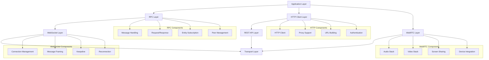
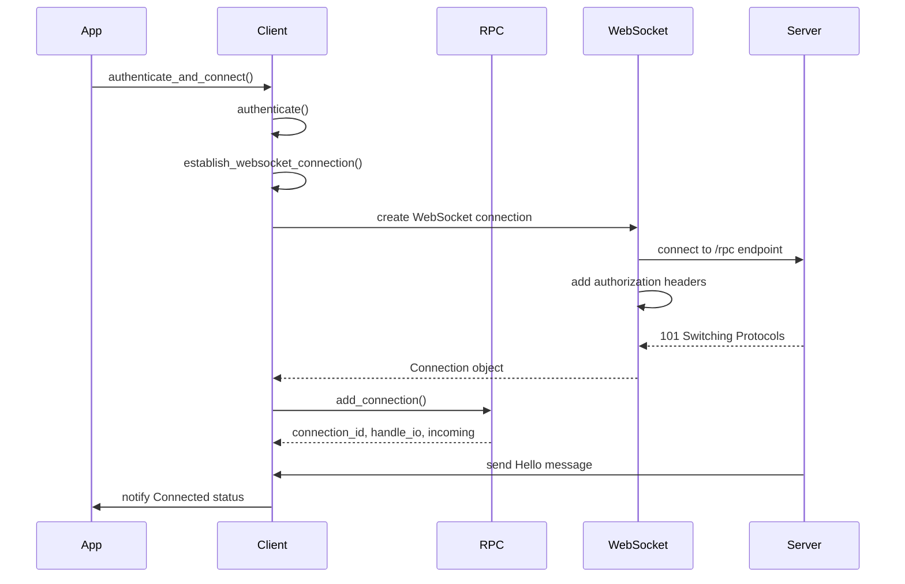
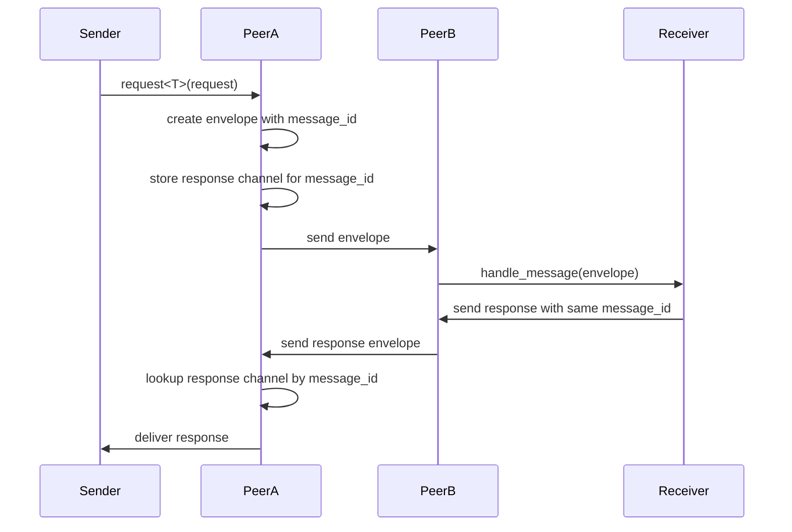
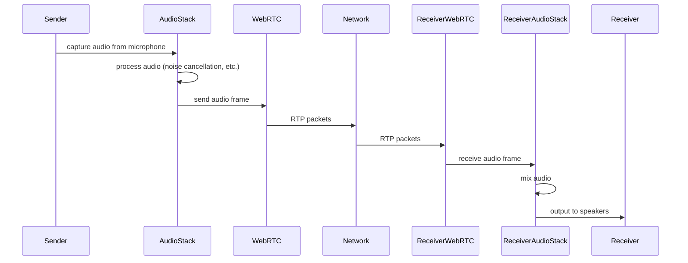
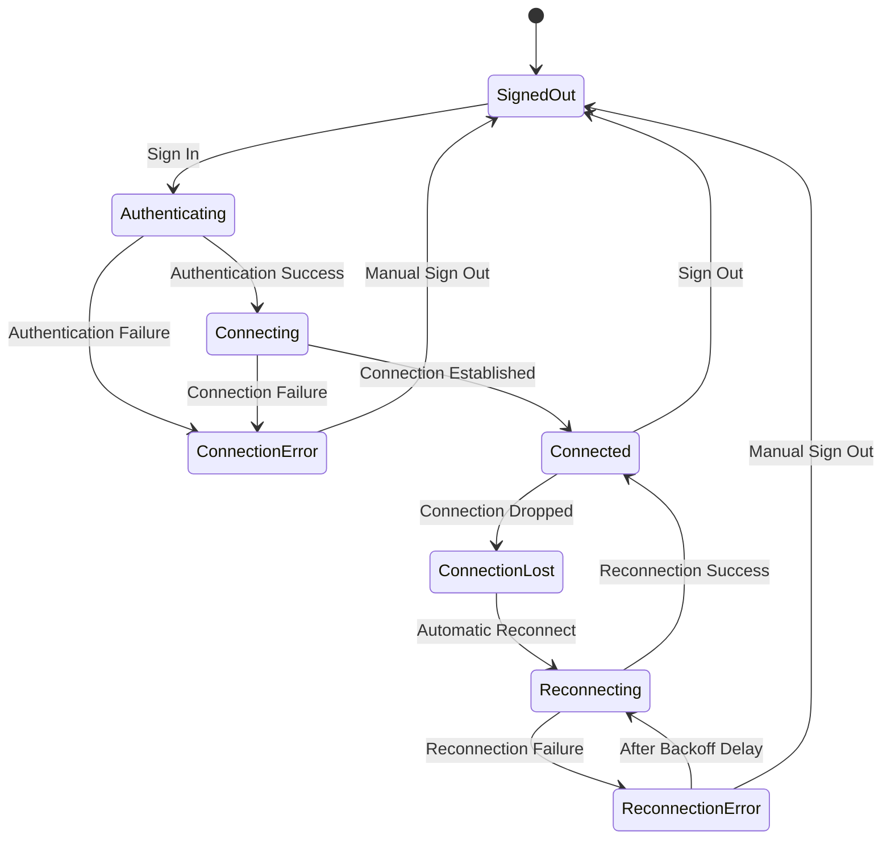

# Network Protocols: Communication Infrastructure in Zed

## Purpose

The Network Protocols subsystem in Zed provides the underlying communication infrastructure that enables collaborative editing, client-server interactions, and real-time multimedia streaming. This system implements several different protocols to handle various types of network communication, from WebSocket-based RPC for collaborative editing to WebRTC for audio/video communication. The Network Protocols layer is designed to be robust, handling connection drops, authentication, and efficient binary message encoding to enable a seamless collaborative experience.

## Concepts

### Core Abstractions

1. **RPC (Remote Procedure Calls)**: A protocol for remote function invocation between Zed clients and servers, forming the foundation of collaborative features.
2. **WebSocket Connection**: Persistent TCP connections over WebSockets for bidirectional, low-latency communication.
3. **HTTP Clients**: Client implementations for REST API calls to the Zed backend services.
4. **WebRTC**: Real-time communication protocol for peer-to-peer audio and video streaming during calls.
5. **Peer**: A representation of a connection endpoint that can send and receive messages.
6. **Connection**: An abstraction over physical network connections with message framing.
7. **Message Envelope**: A container format that wraps all messages with metadata like sender ID and message type.

### Mental Models

1. **Message Passing Model**: All communication in Zed is built around asynchronous message passing, where entities exchange typed messages.

2. **Connection Lifecycle**:
   ```
   Connection Establishment → Authentication → Active Communication → Connection Loss → Reconnection Attempts
   ```

3. **Request-Response Pattern**: Communication typically follows a request-response pattern, with the ability to make streaming requests that produce multiple responses.

4. **Peer Identity Model**: Each connection endpoint has a unique peer ID, allowing messages to be routed correctly in complex topologies.

5. **Reconnection Backoff Model**: When connections are lost, Zed attempts to reconnect with an exponential backoff strategy to handle transient network failures gracefully.

## Architecture

The Network Protocols implementation in Zed is organized into several layers:



### Key Components

#### RPC Layer (`rpc` crate)

1. **Peer**: The core abstraction for connection endpoints.
   - Manages multiple connections
   - Handles message routing
   - Tracks connection state

2. **Connection**: Represents a single WebSocket connection.
   - Handles message framing
   - Implements keepalive
   - Manages reconnection

3. **Message Handling**:
   - Type-safe message envelopes
   - Message ID tracking
   - Request-response correlation

4. **Entity Subscription**: Mechanism to associate remote entities with local entities.
   - Routes messages to appropriate local entities
   - Handles message queuing for late subscribers

#### HTTP Client Layer (`http_client` crate)

1. **HTTP Client**: Wrapper around lower-level HTTP libraries.
   - URL construction and manipulation
   - Authentication header management
   - Proxy support
   - Timeout handling

2. **HTTP Methods**: Support for different HTTP methods.
   - GET, POST, etc.
   - JSON serialization/deserialization
   - Streaming responses

3. **Redirect Handling**: Support for HTTP redirects.
   - Configurable redirect policy
   - Security controls for redirects

#### Client Layer (`client` crate)

1. **Client**: The main entry point for network communication.
   - Authentication management
   - Connection establishment
   - Status tracking
   - Reconnection logic

2. **Telemetry**: System for collecting and reporting metrics.
   - Performance data
   - Error tracking
   - Usage statistics

3. **Credential Management**: Secure storage and retrieval of credentials.
   - Encrypted storage of access tokens
   - Integration with system credential managers

#### WebRTC Layer (`livekit_client` crate)

1. **Audio Stack**: Handles audio streaming.
   - Microphone capture
   - Speaker output
   - Audio processing (noise cancellation, etc.)

2. **Video Stack**: Handles video streaming.
   - Camera capture
   - Screen sharing
   - Video rendering

3. **Platform Integration**: Adapters for platform-specific multimedia APIs.
   - macOS: CoreVideo, CoreAudio
   - Linux: PulseAudio, X11/Wayland
   - Windows: DirectShow, WASAPI

### Data Flow

#### WebSocket Connection Establishment



#### RPC Request-Response Flow



#### Audio/Video Flow (WebRTC)



## Interfaces

### RPC Client Interface

```rust
pub trait ProtoClient: 'static + Send + Sync {
    fn request(
        &self,
        envelope: proto::Envelope,
        request_type: &'static str,
    ) -> BoxFuture<'static, Result<proto::Envelope>>;

    fn send(&self, envelope: proto::Envelope, message_type: &'static str) -> Result<()>;

    fn send_response(&self, envelope: proto::Envelope, message_type: &'static str) -> Result<()>;

    fn message_handler_set(&self) -> &parking_lot::Mutex<ProtoMessageHandlerSet>;

    fn is_via_collab(&self) -> bool;
}
```

### HTTP Client Interface

```rust
pub trait HttpClient: 'static + Send + Sync {
    fn type_name(&self) -> &'static str;

    fn send(
        &self,
        req: http::Request<AsyncBody>,
    ) -> BoxFuture<'static, Result<Response<AsyncBody>, anyhow::Error>>;

    fn get<'a>(
        &'a self,
        uri: &str,
        body: AsyncBody,
        follow_redirects: bool,
    ) -> BoxFuture<'a, Result<Response<AsyncBody>, anyhow::Error>>;

    fn post_json<'a>(
        &'a self,
        uri: &str,
        body: AsyncBody,
    ) -> BoxFuture<'a, Result<Response<AsyncBody>, anyhow::Error>>;

    fn proxy(&self) -> Option<&Url>;
}
```

### Client Status Interface

```rust
pub enum Status {
    SignedOut,
    UpgradeRequired,
    Authenticating,
    Connecting,
    ConnectionError,
    Connected {
        peer_id: PeerId,
        connection_id: ConnectionId,
    },
    ConnectionLost,
    Reauthenticating,
    Reconnecting,
    ReconnectionError {
        next_reconnection: Instant,
    },
}
```

### WebRTC Audio Interface

```rust
pub enum AudioStream {
    Input { _task: Task<()> },
    Output { _drop: Box<dyn std::any::Any> },
}

pub struct AudioStack {
    executor: BackgroundExecutor,
    apm: Arc<Mutex<apm::AudioProcessingModule>>,
    mixer: Arc<Mutex<audio_mixer::AudioMixer>>,
    _output_task: RefCell<Weak<Task<()>>>,
    next_ssrc: AtomicI32,
}
```

## State Management

### Client Connection State

The `Client` maintains its connection state in several places:

1. **Status State**: Current connection status (connected, disconnected, etc.).
   - Stored in a watch channel to allow subscribers to receive status updates
   - Updated as the connection transitions between states

2. **Credentials State**: Authentication tokens and user information.
   - Stored securely with platform-specific credential providers
   - Used for reconnection without requiring re-authentication

3. **Message Routing State**: Maps for directing incoming messages.
   - Maps message types to handler functions
   - Maps entity IDs to actual entity instances

4. **Reconnection State**: Information for connection recovery.
   - Exponential backoff timers
   - Next reconnection attempt time

### Connection State Changes



### WebRTC State Management

The WebRTC system maintains state for audio and video streams:

1. **Device State**: Current audio/video devices and their capabilities.
   - Sample rates
   - Channel configurations
   - Device availability

2. **Stream State**: Active audio and video streams.
   - Track IDs
   - Encoding parameters
   - Playback state

3. **Connection State**: WebRTC peer connection state.
   - ICE connection status
   - Signaling state
   - Media transport statistics

## Implementation Patterns

### WebSocket Connection Establishment

```rust
fn establish_websocket_connection(
    self: &Arc<Self>,
    credentials: &Credentials,
    cx: &AsyncApp,
) -> Task<Result<Connection, EstablishConnectionError>> {
    let release_channel = cx
        .update(|cx| ReleaseChannel::try_global(cx))
        .ok()
        .flatten();
    let app_version = cx
        .update(|cx| AppVersion::global(cx).to_string())
        .ok()
        .unwrap_or_default();

    let http = self.http.clone();
    let proxy = http.proxy().cloned();
    let credentials = credentials.clone();
    let rpc_url = self.rpc_url(http, release_channel);
    let system_id = self.telemetry.system_id();
    let metrics_id = self.telemetry.metrics_id();
    cx.spawn(async move |cx| {
        // Resolve the RPC URL
        let mut rpc_url = rpc_url.await?;
        
        // Establish TCP connection
        let stream = {
            let handle = cx.update(|cx| gpui_tokio::Tokio::handle(cx)).ok().unwrap();
            let _guard = handle.enter();
            match proxy {
                Some(proxy) => connect_socks_proxy_stream(&proxy, rpc_host).await?,
                None => Box::new(TcpStream::connect(rpc_host).await?),
            }
        };

        // Create WebSocket request
        let mut request = IntoClientRequest::into_client_request(rpc_url.as_str())?;
        
        // Add authentication headers
        let request_headers = request.headers_mut();
        request_headers.insert(
            "Authorization",
            HeaderValue::from_str(&credentials.authorization_header())?,
        );
        
        // Add additional headers
        request_headers.insert(
            "x-zed-protocol-version",
            HeaderValue::from_str(&rpc::PROTOCOL_VERSION.to_string())?,
        );
        request_headers.insert("x-zed-app-version", HeaderValue::from_str(&app_version)?);
        
        // Perform WebSocket handshake
        let (stream, _) = async_tungstenite::tokio::client_async_tls_with_connector_and_config(
            request,
            stream,
            Some(Arc::new(http_client_tls::tls_config()).into()),
            None,
        )
        .await?;

        // Create and return the connection object
        Ok(Connection::new(
            stream
                .map_err(|error| anyhow!(error))
                .sink_map_err(|error| anyhow!(error)),
        ))
    })
}
```

### RPC Message Routing

```rust
fn handle_message(self: &Arc<Client>, message: Box<dyn AnyTypedEnvelope>, cx: &AsyncApp) {
    let sender_id = message.sender_id();
    let request_id = message.message_id();
    let type_name = message.payload_type_name();
    let original_sender_id = message.original_sender_id();

    if let Some(future) = ProtoMessageHandlerSet::handle_message(
        &self.handler_set,
        message,
        self.clone().into(),
        cx.clone(),
    ) {
        let client_id = self.id();
        log::debug!(
            "rpc message received. client_id:{}, sender_id:{:?}, type:{}",
            client_id,
            original_sender_id,
            type_name
        );
        cx.spawn(async move |_| match future.await {
            Ok(()) => {
                log::debug!(
                    "rpc message handled. client_id:{}, sender_id:{:?}, type:{}",
                    client_id,
                    original_sender_id,
                    type_name
                );
            }
            Err(error) => {
                log::error!(
                    "error handling message. client_id:{}, sender_id:{:?}, type:{}, error:{:?}",
                    client_id,
                    original_sender_id,
                    type_name,
                    error
                );
            }
        })
        .detach();
    } else {
        log::info!("unhandled message {}", type_name);
        self.peer
            .respond_with_unhandled_message(sender_id.into(), request_id, type_name)
            .log_err();
    }
}
```

### Reconnection Logic

```rust
match status {
    Status::Connected { .. } => {
        state._reconnect_task = None;
    }
    Status::ConnectionLost => {
        let client = self.clone();
        state._reconnect_task = Some(cx.spawn(async move |cx| {
            #[cfg(any(test, feature = "test-support"))]
            let mut rng = StdRng::seed_from_u64(0);
            #[cfg(not(any(test, feature = "test-support")))]
            let mut rng = StdRng::from_entropy();

            let mut delay = INITIAL_RECONNECTION_DELAY;
            loop {
                match client.authenticate_and_connect(true, &cx).await {
                    ConnectionResult::Timeout => {
                        log::error!("client connect attempt timed out")
                    }
                    ConnectionResult::ConnectionReset => {
                        log::error!("client connect attempt reset")
                    }
                    ConnectionResult::Result(r) => {
                        if let Err(error) = r {
                            log::error!("failed to connect: {error}");
                        } else {
                            break;
                        }
                    }
                }

                if matches!(*client.status().borrow(), Status::ConnectionError) {
                    client.set_status(
                        Status::ReconnectionError {
                            next_reconnection: Instant::now() + delay,
                        },
                        &cx,
                    );
                    cx.background_executor().timer(delay).await;
                    delay = delay
                        .mul_f32(rng.gen_range(0.5..=2.5))
                        .max(INITIAL_RECONNECTION_DELAY)
                        .min(MAX_RECONNECTION_DELAY);
                } else {
                    break;
                }
            }
        }));
    }
    Status::SignedOut | Status::UpgradeRequired => {
        self.telemetry.set_authenticated_user_info(None, false);
        state._reconnect_task.take();
    }
    _ => {}
}
```

### WebRTC Audio Playback

```rust
async fn play_output(
    apm: Arc<Mutex<apm::AudioProcessingModule>>,
    mixer: Arc<Mutex<audio_mixer::AudioMixer>>,
    sample_rate: u32,
    num_channels: u32,
) -> Result<()> {
    loop {
        let mut device_change_listener = DeviceChangeListener::new(false)?;
        let (output_device, output_config) = default_device(false)?;
        let (end_on_drop_tx, end_on_drop_rx) = std::sync::mpsc::channel::<()>();
        let mixer = mixer.clone();
        let apm = apm.clone();
        let mut resampler = audio_resampler::AudioResampler::default();
        let mut buf = Vec::new();

        thread::spawn(move || {
            let output_stream = output_device.build_output_stream(
                &output_config.config(),
                {
                    move |mut data, _info| {
                        while data.len() > 0 {
                            if data.len() <= buf.len() {
                                let rest = buf.split_off(data.len());
                                data.copy_from_slice(&buf);
                                buf = rest;
                                return;
                            }
                            if buf.len() > 0 {
                                let (prefix, suffix) = data.split_at_mut(buf.len());
                                prefix.copy_from_slice(&buf);
                                data = suffix;
                            }

                            let mut mixer = mixer.lock();
                            let mixed = mixer.mix(output_config.channels() as usize);
                            let sampled = resampler.remix_and_resample(
                                mixed,
                                sample_rate / 100,
                                num_channels,
                                sample_rate,
                                output_config.channels() as u32,
                                output_config.sample_rate().0,
                            );
                            buf = sampled.to_vec();
                            apm.lock()
                                .process_reverse_stream(
                                    &mut buf,
                                    output_config.sample_rate().0 as i32,
                                    output_config.channels() as i32,
                                )
                                .ok();
                        }
                    }
                },
                |error| log::error!("error playing audio track: {:?}", error),
                Some(Duration::from_millis(100)),
            );

            let Some(output_stream) = output_stream.log_err() else {
                return;
            };

            output_stream.play().log_err();
            end_on_drop_rx.recv().ok();
        });

        device_change_listener.next().await;
        drop(end_on_drop_tx)
    }
}
```

## Swift Considerations

When reimplementing the Network Protocols subsystem in Swift, consider the following:

### WebSocket Implementation

```swift
// WebSocket connection implementation using URLSessionWebSocketTask
class Connection {
    private let webSocketTask: URLSessionWebSocketTask
    private let messageQueue = DispatchQueue(label: "com.zed.websocket.messages")
    private var isConnected = false
    
    init(webSocketTask: URLSessionWebSocketTask) {
        self.webSocketTask = webSocketTask
    }
    
    func connect() {
        webSocketTask.resume()
        isConnected = true
        receiveMessage()
    }
    
    private func receiveMessage() {
        guard isConnected else { return }
        
        webSocketTask.receive { [weak self] result in
            guard let self = self else { return }
            
            switch result {
            case .success(let message):
                switch message {
                case .data(let data):
                    // Process binary message
                    self.handleBinaryMessage(data)
                case .string(let string):
                    // Process text message
                    self.handleTextMessage(string)
                @unknown default:
                    break
                }
                // Continue receiving messages
                self.receiveMessage()
                
            case .failure(let error):
                // Handle error
                self.isConnected = false
                self.handleDisconnect(error)
            }
        }
    }
    
    func send(data: Data) {
        webSocketTask.send(.data(data)) { error in
            if let error = error {
                // Handle send error
                print("Error sending message: \(error)")
            }
        }
    }
    
    func close() {
        webSocketTask.cancel(with: .goingAway, reason: nil)
        isConnected = false
    }
    
    // Message handling methods would be implemented here
}
```

### HTTP Client Implementation

```swift
// HTTP client implementation using URLSession
class HttpClient {
    private let session: URLSession
    private let baseURL: URL
    
    init(baseURL: URL, configuration: URLSessionConfiguration = .default) {
        self.baseURL = baseURL
        self.session = URLSession(configuration: configuration)
    }
    
    func get<T: Decodable>(path: String, 
                          queryItems: [URLQueryItem]? = nil,
                          headers: [String: String]? = nil) async throws -> T {
        let request = try createRequest(method: "GET", path: path, queryItems: queryItems, headers: headers)
        return try await performRequest(request)
    }
    
    func post<T: Decodable, U: Encodable>(path: String, 
                                         body: U,
                                         headers: [String: String]? = nil) async throws -> T {
        var request = try createRequest(method: "POST", path: path, headers: headers)
        let encoder = JSONEncoder()
        request.httpBody = try encoder.encode(body)
        return try await performRequest(request)
    }
    
    private func createRequest(method: String, 
                              path: String, 
                              queryItems: [URLQueryItem]? = nil,
                              headers: [String: String]? = nil) throws -> URLRequest {
        var components = URLComponents(url: baseURL.appendingPathComponent(path), resolvingAgainstBaseURL: true)
        components?.queryItems = queryItems
        
        guard let url = components?.url else {
            throw URLError(.badURL)
        }
        
        var request = URLRequest(url: url)
        request.httpMethod = method
        request.setValue("application/json", forHTTPHeaderField: "Content-Type")
        
        headers?.forEach { key, value in
            request.setValue(value, forHTTPHeaderField: key)
        }
        
        return request
    }
    
    private func performRequest<T: Decodable>(_ request: URLRequest) async throws -> T {
        let (data, response) = try await session.data(for: request)
        
        guard let httpResponse = response as? HTTPURLResponse else {
            throw URLError(.badServerResponse)
        }
        
        guard (200...299).contains(httpResponse.statusCode) else {
            throw URLError(.badServerResponse)
        }
        
        let decoder = JSONDecoder()
        return try decoder.decode(T.self, from: data)
    }
}
```

### Client State Management

```swift
// Status enum for connection state
enum ConnectionStatus: Equatable {
    case signedOut
    case upgradeRequired
    case authenticating
    case connecting
    case connectionError
    case connected(peerId: UInt64, connectionId: ConnectionId)
    case connectionLost
    case reauthenticating
    case reconnecting
    case reconnectionError(nextReconnection: Date)
    
    var isConnected: Bool {
        if case .connected = self {
            return true
        }
        return false
    }
    
    var isSignedOut: Bool {
        if case .signedOut = self, case .upgradeRequired = self {
            return true
        }
        return false
    }
}

// Client implementation
class Client {
    private let httpClient: HttpClient
    private var connection: Connection?
    private var credentials: Credentials?
    private let statusSubject = CurrentValueSubject<ConnectionStatus, Never>(.signedOut)
    private var reconnectionTask: Task<Void, Never>?
    
    // Publish status changes for subscribers
    var status: AnyPublisher<ConnectionStatus, Never> {
        statusSubject.eraseToAnyPublisher()
    }
    
    init(httpClient: HttpClient) {
        self.httpClient = httpClient
    }
    
    func authenticateAndConnect() async throws {
        // Set status to authenticating
        statusSubject.send(.authenticating)
        
        // Authenticate
        let credentials = try await authenticate()
        
        // Set status to connecting
        statusSubject.send(.connecting)
        
        // Establish connection
        do {
            let connection = try await establishConnection(credentials: credentials)
            self.connection = connection
            self.credentials = credentials
            
            // Wait for Hello message
            let helloMessage = try await receiveHelloMessage(connection: connection)
            
            // Connected successfully
            statusSubject.send(.connected(
                peerId: helloMessage.peerId,
                connectionId: connection.id
            ))
        } catch {
            statusSubject.send(.connectionError)
            throw error
        }
    }
    
    private func authenticate() async throws -> Credentials {
        // Authentication implementation
        // ...
    }
    
    private func establishConnection(credentials: Credentials) async throws -> Connection {
        // Connection establishment implementation
        // ...
    }
    
    private func startReconnection() {
        guard reconnectionTask == nil else { return }
        
        reconnectionTask = Task {
            var delay = initialReconnectionDelay
            
            while !Task.isCancelled {
                do {
                    try await authenticateAndConnect()
                    break
                } catch {
                    print("Reconnection failed: \(error)")
                }
                
                // Calculate next reconnection time
                let nextReconnection = Date().addingTimeInterval(delay.timeInterval)
                statusSubject.send(.reconnectionError(nextReconnection: nextReconnection))
                
                // Wait before trying again
                try? await Task.sleep(nanoseconds: UInt64(delay.timeInterval * 1_000_000_000))
                
                // Increase delay with some randomization
                delay = min(
                    max(delay * Double.random(in: 0.5...2.5), initialReconnectionDelay),
                    maxReconnectionDelay
                )
            }
            
            reconnectionTask = nil
        }
    }
}
```

### WebRTC Integration

```swift
class AudioStack {
    private let audioSession = AVAudioSession.sharedInstance()
    private let audioEngine = AVAudioEngine()
    private let mixer = AVAudioMixerNode()
    private var playerNode: AVAudioPlayerNode?
    private var captureNode: AVAudioSourceNode?
    
    init() {
        setupAudioEngine()
    }
    
    private func setupAudioEngine() {
        // Configure audio session
        try? audioSession.setCategory(.playAndRecord, options: [.allowBluetooth, .defaultToSpeaker])
        try? audioSession.setActive(true)
        
        // Add mixer to engine
        audioEngine.attach(mixer)
        audioEngine.connect(mixer, to: audioEngine.mainMixerNode, format: nil)
        
        // Start engine
        try? audioEngine.start()
    }
    
    func playRemoteAudioTrack(track: RemoteAudioTrack) -> AudioStream {
        // Create player node
        let playerNode = AVAudioPlayerNode()
        audioEngine.attach(playerNode)
        audioEngine.connect(playerNode, to: mixer, format: nil)
        playerNode.play()
        
        // Set up track to feed audio into the player node
        // ...
        
        return AudioStream.output(AudioOutput(playerNode: playerNode))
    }
    
    func captureLocalMicrophoneTrack() -> (LocalAudioTrack, AudioStream) {
        // Create capture node
        let captureNode = AVAudioSourceNode { _, _, frameCount, audioBufferList -> OSStatus in
            // Fill buffer with microphone audio
            // ...
            return noErr
        }
        
        audioEngine.attach(captureNode)
        audioEngine.connect(captureNode, to: mixer, format: nil)
        
        // Create track from capture node
        // ...
        
        return (LocalAudioTrack(), AudioStream.input(AudioInput(captureNode: captureNode)))
    }
}

enum AudioStream {
    case input(AudioInput)
    case output(AudioOutput)
}

struct AudioInput {
    let captureNode: AVAudioSourceNode
}

struct AudioOutput {
    let playerNode: AVAudioPlayerNode
}
```

## Subsystem Interactions

### With Collaboration System

The Network Protocols subsystem provides the communication foundation for the Collaboration System:

- Transporting operational transforms between clients
- Managing connection state for collaborative sessions
- Handling peer discovery and identity
- Providing real-time audio/video for calls

### With Project Management

The Network Protocols subsystem interacts with Project Management:

- Fetching project metadata from remote servers
- Synchronizing project state with the server
- Handling file uploads and downloads
- Managing project permissions and access control

### With Language Intelligence

The Network Protocols subsystem supports Language Intelligence:

- Communicating with language servers over JSON-RPC
- Fetching and updating language models
- Retrieving completion suggestions from remote AI services

### With User Management

The Network Protocols subsystem integrates with User Management:

- Handling user authentication and authorization
- Managing user profile information
- Supporting user presence in collaborative sessions

## Conclusion

The Network Protocols subsystem in Zed provides a robust and flexible communication infrastructure that enables collaborative editing, real-time audio/video communication, and client-server interactions. The system implements several different protocols, from WebSocket-based RPC to WebRTC for multimedia streaming, and provides abstractions that make it easy to build higher-level features on top of these communication primitives.

When reimplementing this subsystem in Swift, focus on leveraging Swift's strong type system and concurrency features to create a clean and efficient implementation. Take advantage of Swift's structured concurrency model with async/await, as well as platform-specific APIs like URLSession for HTTP communication and AVFoundation for audio/video handling.

## Related Subsystems

- [Collaboration System](06_StratosphericView_CollaborationSystem.md): Uses Network Protocols for real-time collaborative editing
- [Project Management](05_StratosphericView_ProjectManagement.md): Uses Network Protocols for project synchronization
- [Language Intelligence](04_StratosphericView_LanguageIntelligence.md): Uses Network Protocols for language server communication
- [Terminal Integration](08_StratosphericView_TerminalIntegration.md): Uses Network Protocols for remote shell access
- [AI Features](09_StratosphericView_AIFeatures.md): Uses Network Protocols for AI model API communication