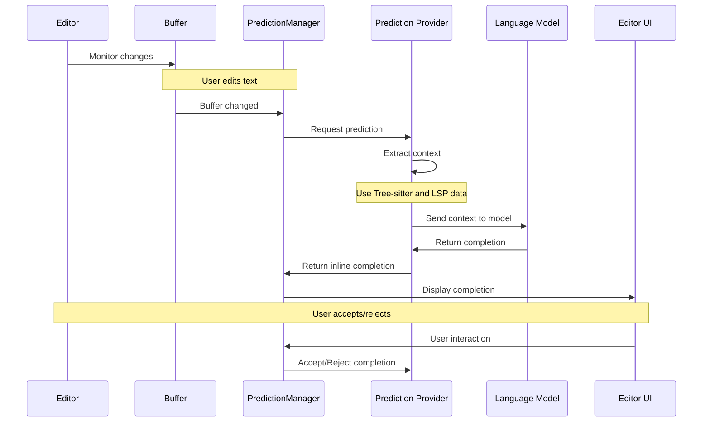
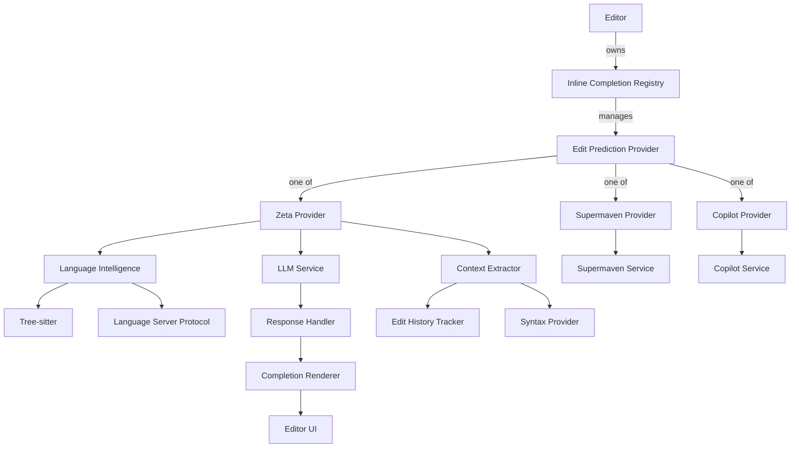
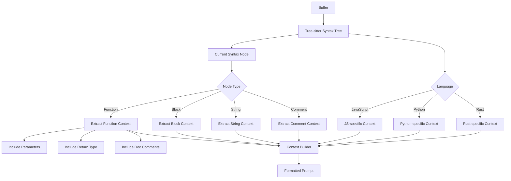
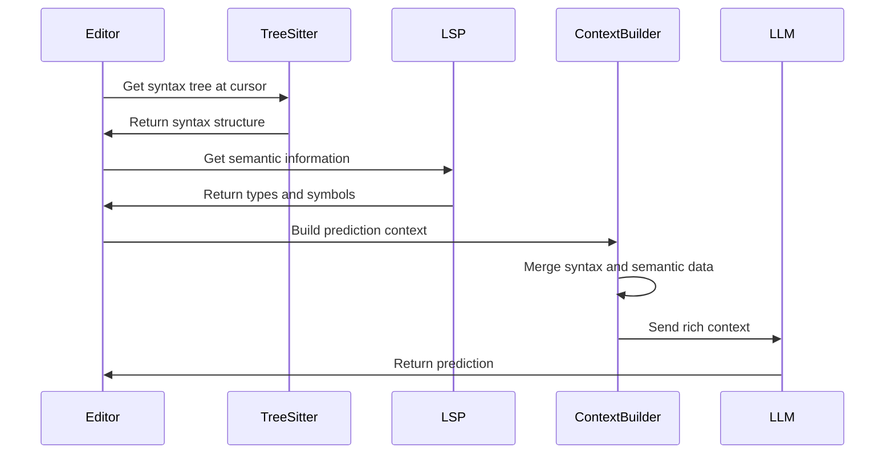

# Ground Level: Next Action Prediction System

## Purpose

The Next Action Prediction system in Zed (also known as Zed Predict) provides AI-powered inline code suggestions and completions as users type. This document examines the low-level implementation details of the prediction system, diving into how it processes user edits, generates predictions, and integrates with the editor to provide a seamless experience. Understanding these implementation details is essential for reimplementing this sophisticated feature in Swift while maintaining its performance characteristics and user experience.

## Core Components and Concepts

### Prediction Providers

The system supports multiple prediction providers through a unified interface:

**Code Reference**: `/crates/language/src/language_settings.rs`
```swift
enum EditPredictionProvider {
    case none
    case copilot // default
    case supermaven
    case zed
}
```

Each provider implements a common interface for generating text predictions while offering different capabilities:

1. **Zed Predict** (`Zed`): Zed's native prediction model for code completions
2. **Supermaven** (`Supermaven`): An alternative prediction provider integrated as a native client
3. **GitHub Copilot** (`Copilot`): Integration with GitHub's code completion service
4. **None**: Disables edit predictions entirely

### Data Flow Architecture

The system follows a complex data flow:



### Context Building

**Code Reference**: `/crates/zeta/src/input_excerpt.rs`
```swift
func excerptForCursorPosition(
    snapshot: BufferSnapshot,
    cursorPosition: Anchor
) -> Result<ExtractedExcerpt, Error> {
    // Extract code context around the cursor
    // ...
}
```

The system builds sophisticated context for predictions:

1. **Syntax-Aware Excerpts**: Using Tree-sitter to extract relevant code based on syntax structure
2. **Semantic Information**: Incorporating LSP-provided type information when available
3. **Edit History**: Tracking recent edit patterns to help the model understand user behavior
4. **File Metadata**: Including language, path, and other relevant information

### Completion Structure

**Code Reference**: `/crates/inline_completion/src/inline_completion.rs`
```swift
struct InlineCompletion {
    /// The ID of the completion, if it has one.
    var id: String?
    var edits: [(Range<Anchor>, String)]
    var editPreview: EditPreview?
}
```

This structure represents the completions that will be shown to users, containing:
1. A unique identifier for tracking
2. A collection of edits to apply to the buffer
3. A preview of how the edits will look

## Architecture

### System Components



### Provider Protocol

**Code Reference**: `/crates/inline_completion/src/inline_completion.rs`

```swift
protocol EditPredictionProvider: AnyObject {
    static func name() -> String
    static func displayName() -> String
    static func showCompletionsInMenu() -> Bool
    static func showTabAcceptMarker() -> Bool

    func dataCollectionState(_ app: App) -> DataCollectionState
    func usage(_ app: App) -> EditPredictionUsage?
    func toggleDataCollection(_ app: inout App)

    func isEnabled(buffer: Entity<Buffer>, cursorPosition: Anchor, app: App) -> Bool
    func isRefreshing() -> Bool

    func refresh(
        project: Entity<Project>?,
        buffer: Entity<Buffer>,
        cursorPosition: Anchor,
        debounce: Bool,
        context: Context<Self>
    )

    func needsTermsAcceptance(_ app: App) -> Bool
    func cycle(buffer: Entity<Buffer>, cursorPosition: Anchor, direction: Direction, context: Context<Self>)
    func accept(context: Context<Self>)
    func discard(context: Context<Self>)
    func suggest(buffer: Entity<Buffer>, cursorPosition: Anchor, context: Context<Self>) -> InlineCompletion?
}
```

This trait defines the interface that all prediction providers must implement, enabling the editor to work with different providers through a common protocol.

### Zeta (Zed's native provider)

**Code Reference**: `/crates/zeta/src/zeta.rs`

```swift
class Zeta {
    weak var workspace: WeakEntity<Workspace>?
    let client: Client
    var events: Deque<Event>
    var registeredBuffers: [EntityId: RegisteredBuffer]
    var shownCompletions: Deque<InlineCompletion>
    var ratedCompletions: Set<InlineCompletionId>
    var dataCollectionChoice: Entity<DataCollectionChoice>
    var llmToken: LlmApiToken
    var llmTokenSubscription: Subscription
    var lastUsage: EditPredictionUsage?
    var tosAccepted: Bool
    var updateRequired: Bool
    var userStoreSubscription: Subscription
    var licenseDetectionWatchers: [WorktreeId: LicenseDetectionWatcher]
}
```

The Zeta struct manages Zed's native prediction provider, which communicates with Zed's AI service to generate completions. It tracks user edits, manages completions, and handles user feedback on predictions.

### Registry and Provider Assignment

**Code Reference**: `/crates/zed/src/zed/inline_completion_registry.rs`

```swift
func initialize(client: Client, userStore: Entity<UserStore>, app: inout App) {
    // ... setup code ...
    let provider = allLanguageSettings(nil, app).editPredictions.provider
    assignEditPredictionProvider(
        editor: editor,
        provider: provider,
        client: client,
        userStore: userStore,
        window: window,
        context: context
    )
    // ... more code ...
}

func assignEditPredictionProvider(
    editor: inout Editor,
    provider: EditPredictionProvider,
    client: Client,
    userStore: Entity<UserStore>,
    window: inout Window,
    context: Context<Editor>
) {
    // ... implementation that assigns the appropriate provider ...
    switch provider {
    case .none:
        editor.setEditPredictionProvider(nil, window: window, context: context)

    case .copilot:
        if let copilot = Copilot.global(context) {
            // ... setup Copilot provider ...
            let provider = context.new { _ in
                CopilotCompletionProvider(copilot: copilot)
            }
            editor.setEditPredictionProvider(provider, window: window, context: context)
        }

    case .supermaven:
        if let supermaven = Supermaven.global(context) {
            let provider = context.new { _ in
                SupermavenCompletionProvider(supermaven: supermaven)
            }
            editor.setEditPredictionProvider(provider, window: window, context: context)
        }

    case .zed:
        if client.status().isBorrowed.isConnected {
            // ... setup Zeta provider ...
            let zeta = Zeta.register(
                workspace: workspace,
                worktree: worktree,
                client: client,
                userStore: userStore,
                context: context
            )
            // ... more setup ...
            let provider = context.new { _ in
                ZetaInlineCompletionProvider(
                    zeta: zeta,
                    dataCollection: dataCollection
                )
            }
            editor.setEditPredictionProvider(provider, window: window, context: context)
        }
    }
}
```

This code initializes the appropriate prediction provider based on user settings and attaches it to the editor.

## Integration with Language Intelligence

### Tree-sitter Integration

The prediction system deeply integrates with Tree-sitter to understand code structure and extract meaningful context.

**Key Integration Points**:

1. **Syntax-Aware Context Extraction**:
   - Uses Tree-sitter to identify function boundaries, blocks, and other syntax elements
   - Extracts context that respects syntax structure rather than just raw text windows
   - Understands language-specific syntax to provide more relevant context

2. **Code Structure Understanding**:
   - Identifies whether the cursor is in a comment, string, function body, etc.
   - Adjusts prediction behavior based on syntax context
   - Extracts surrounding declarations and imports for better predictions



### LSP Integration

LSP (Language Server Protocol) provides semantic understanding of the code, which the prediction system leverages for better completions.

**Key Integration Points**:

1. **Type Information**:
   - Incorporates type information for variables and functions
   - Understands parameter types and return types
   - Uses type constraints to generate more accurate completions

2. **Symbol Resolution**:
   - Knows about imported modules and available symbols
   - Understands which functions and methods are available
   - Can suggest appropriate API usage based on imports

3. **Project Structure**:
   - Leverages understanding of the project's structure
   - Can suggest imports based on project dependencies
   - Understands module relationships within the project



## Implementation Details

### Context Collection

The prediction system collects rich context around the cursor position:

**Code Reference**: `/crates/zeta/src/input_excerpt.rs`

```swift
let CURSOR_MARKER = "<|user_cursor_is_here|>"
let START_OF_FILE_MARKER = "<|start_of_file|>"
let EDITABLE_REGION_START_MARKER = "<|editable_region_start|>"
let EDITABLE_REGION_END_MARKER = "<|editable_region_end|>"
```

These special markers are used to indicate key positions in the context sent to the language model:

1. The cursor position marker helps the model understand where to generate completions
2. File boundary markers provide structure information
3. Editable region markers indicate where changes are allowed

### Context Construction

The system builds context from multiple sources:

**Code Reference**: `/crates/zeta/src/zeta.rs`

```swift
func predictEdits(
    client: Client,
    llmToken: LlmApiToken,
    inputExcerpt: String,
    inputOutline: String,
    inputEvents: String
    // ...
) async throws -> PredictEditsResponse {
    let payload = PredictEditsBody(
        excerpt: inputExcerpt,
        outline: inputOutline,
        events: inputEvents
        // ...
    )

    // Send request to prediction service
    // ...
}
```

The key context components are:

1. **Excerpt**: The code immediately surrounding the cursor
2. **Outline**: A broader summary of the file structure
3. **Events**: Recent editing history to provide behavioral context

### Suggestion Generation

The provider processes model responses into usable completions:

**Code Reference**: `/crates/zeta/src/zeta.rs`

```swift
extension InlineCompletion {
    func interpolate(newSnapshot: BufferSnapshot) -> [(Range<Anchor>, String)]? {
        return Self.interpolate(
            oldSnapshot: self.snapshot,
            newSnapshot: newSnapshot,
            currentEdits: self.edits
        )
    }
}

static func interpolate(
    oldSnapshot: BufferSnapshot,
    newSnapshot: BufferSnapshot,
    currentEdits: [(Range<Anchor>, String)]
) -> [(Range<Anchor>, String)]? {
    // Complex algorithm to adapt predictions to buffer changes
    // ...
}
```

This interpolation mechanism is critical - it allows predictions to adapt as the user continues typing, keeping suggestions relevant even as the buffer changes.

### User Interaction Handling

The system responds to user interactions with completions:

**Code Reference**: `/crates/editor/src/editor.rs`

```swift
func acceptInlineCompletion(
    _: AcceptInlineCompletion,
    window: inout Window,
    context: Context<Self>
) {
    if let provider = editPredictionProvider {
        provider.accept(context: context)
    }
}

func nextEditPrediction(
    _: NextEditPrediction,
    window: inout Window,
    context: Context<Self>
) {
    if let provider = editPredictionProvider {
        let selectionHead = selections.newestAnchor().head()
        provider.cycle(
            buffer: buffer(),
            cursorPosition: selectionHead,
            direction: .next,
            context: context
        )
    }
}
```

These methods allow users to:
1. Accept a completion with Tab
2. Cycle through alternative completions with keyboard shortcuts
3. Dismiss completions by continuing to type or pressing Escape

## Swift Implementation Considerations

### Provider Protocol

```swift
protocol EditPredictionProvider {
    static func name() -> String
    static func displayName() -> String
    static func showCompletionsInMenu() -> Bool
    static func showTabAcceptMarker() -> Bool
    
    func dataCollectionState(_ app: App) -> DataCollectionState
    func toggleDataCollection(_ app: inout App)
    
    func isEnabled(buffer: Buffer, cursorPosition: Anchor, app: App) -> Bool
    func isRefreshing() -> Bool
    
    func refresh(project: Project?, buffer: Buffer, cursorPosition: Anchor, debounce: Bool, context: Context)
    func cycle(buffer: Buffer, cursorPosition: Anchor, direction: Direction, context: Context)
    func accept(context: Context)
    func discard(context: Context)
    func suggest(buffer: Buffer, cursorPosition: Anchor, context: Context) -> InlineCompletion?
}
```

### Tree-sitter Bridge

The Swift implementation needs to bridge to Tree-sitter for syntax understanding:

```swift
class TreeSitterBridge {
    typealias TSParser = OpaquePointer
    typealias TSTree = OpaquePointer
    typealias TSNode = UnsafeRawPointer
    
    // Create and configure parser
    static func createParser() -> TSParser? {
        return ts_parser_new()
    }
    
    // Parse text into a syntax tree
    static func parse(parser: TSParser, oldTree: TSTree?, text: String) -> TSTree? {
        guard let buffer = text.data(using: .utf8) else { return nil }
        
        let input = TSInput(
            payload: buffer.withUnsafeBytes { UnsafeMutableRawPointer(mutating: $0.baseAddress) },
            read: { payload, byte_index, position, bytes_read in
                let data = payload.bindMemory(to: Data.self, capacity: 1)
                let length = data.pointee.count
                
                guard byte_index < length else {
                    bytes_read?.pointee = 0
                    return nil
                }
                
                let remainingLength = length - Int(byte_index)
                bytes_read?.pointee = UInt32(min(Int(TSInputEncodingUTF8), remainingLength))
                
                return data.pointee.withUnsafeBytes { bytes in
                    return bytes.baseAddress?.advanced(by: Int(byte_index))
                }
            },
            encoding: TSInputEncodingUTF8
        )
        
        return ts_parser_parse(parser, oldTree, input)
    }
    
    // Get node at cursor position
    static func nodeAtPosition(tree: TSTree, position: UInt32) -> TSNode? {
        let root = ts_tree_root_node(tree)
        let point = TSPoint(row: 0, column: position)
        return ts_node_descendant_for_point_range(root, point, point)
    }
}
```

### LSP Integration

Swift needs to communicate with language servers for semantic information:

```swift
class LanguageServerClient {
    private var process: Process?
    private var stdinPipe: Pipe?
    private var stdoutPipe: Pipe?
    private var pendingRequests: [Int: PendingRequest] = [:]
    
    func sendRequest<T: Decodable>(
        method: String,
        params: Encodable,
        timeout: TimeInterval = 10.0
    ) async throws -> T {
        let id = requestCounter.increment()
        let message = LspMessage(
            jsonrpc: "2.0",
            id: id,
            method: method,
            params: params
        )
        
        let data = try JSONEncoder().encode(message)
        
        return try await withCheckedThrowingContinuation { continuation in
            let request = PendingRequest(
                id: id, 
                completion: { result in
                    continuation.resume(with: result)
                }
            )
            
            pendingRequests[id] = request
            
            // Send the request to the language server
            try? stdinPipe?.fileHandleForWriting.write(
                "Content-Length: \(data.count)\r\n\r\n".data(using: .utf8)!
            )
            try? stdinPipe?.fileHandleForWriting.write(data)
            
            // Set timeout
            DispatchQueue.main.asyncAfter(deadline: .now() + timeout) {
                if let request = self.pendingRequests[id] {
                    self.pendingRequests.removeValue(forKey: id)
                    request.completion(.failure(LspError.timeout))
                }
            }
        }
    }
    
    private func processMessage(_ message: LspMessage) async {
        if let id = message.id, let request = pendingRequests[id] {
            pendingRequests.removeValue(forKey: id)
            
            if let error = message.error {
                request.completion(.failure(LspError.serverError(error)))
            } else if let result = message.result {
                do {
                    let resultData = try JSONSerialization.data(withJSONObject: result)
                    let typedResult = try JSONDecoder().decode(request.responseType, from: resultData)
                    request.completion(.success(typedResult))
                } catch {
                    request.completion(.failure(error))
                }
            }
        }
    }
}
```

### Context Building

The Swift implementation needs to build rich context for predictions:

```swift
class ContextBuilder {
    func buildContext(
        buffer: Buffer,
        cursorPosition: Anchor,
        syntaxTree: TSTree?,
        semanticInfo: [String: Any]?
    ) -> PredictionContext {
        let offset = cursorPosition.toOffset(in: buffer)
        let text = buffer.text
        
        // Extract immediate context around cursor
        let windowStart = max(0, offset - 500)
        let windowEnd = min(text.count, offset + 500)
        var excerpt = String(text[windowStart..<windowEnd])
        
        // Insert cursor marker
        let cursorInsertOffset = offset - windowStart
        excerpt.insert(contentsOf: "<|user_cursor_is_here|>", at: excerpt.index(excerpt.startIndex, offsetBy: cursorInsertOffset))
        
        // Extract syntax context if available
        var syntaxContext = ""
        if let tree = syntaxTree, 
           let node = TreeSitterBridge.nodeAtPosition(tree: tree, position: UInt32(offset)) {
            // Build syntax-aware context based on the node type
            // ...
        }
        
        // Add semantic information if available
        var semanticContext = ""
        if let info = semanticInfo {
            // Add type information, imports, etc.
            // ...
        }
        
        return PredictionContext(
            excerpt: excerpt,
            syntaxContext: syntaxContext,
            semanticContext: semanticContext,
            cursorOffset: cursorInsertOffset
        )
    }
}
```

### Efficient Memory Management

Swift's ARC requires careful handling of references:

```swift
class ZedPredictionProvider {
    // Use weak references for UI components
    private weak var editor: Editor?
    
    // Use proper memory management for completions
    private var currentTask: Task<Void, Never>?
    private var completions: [UUID: InlineCompletion] = [:]
    
    func cleanup() {
        // Cancel running tasks
        currentTask?.cancel()
        currentTask = nil
        
        // Clear completions
        completions.removeAll()
    }
    
    deinit {
        cleanup()
    }
}
```

## Performance Considerations

### 1. Context Extraction Optimization

```swift
func optimizedContextExtraction(buffer: Buffer, cursorPosition: Anchor) -> String {
    // Fast path for small files
    if buffer.length < 10_000 {
        return extractFullContext(buffer)
    }
    
    // For larger files, use syntax-aware extraction
    if let tree = buffer.syntaxTree {
        return extractSyntaxBasedContext(buffer, cursorPosition, tree)
    }
    
    // Fall back to window-based extraction
    return extractWindowContext(buffer, cursorPosition)
}
```

### 2. Request Debouncing

```swift
class RequestDebouncer {
    private var debounceTask: Task<Void, Never>?
    private let debounceInterval: TimeInterval
    
    init(debounceInterval: TimeInterval) {
        self.debounceInterval = debounceInterval
    }
    
    func debounce(action: @escaping () async -> Void) {
        debounceTask?.cancel()
        
        debounceTask = Task {
            do {
                try await Task.sleep(nanoseconds: UInt64(debounceInterval * 1_000_000_000))
                if !Task.isCancelled {
                    await action()
                }
            } catch {
                // Task was cancelled
            }
        }
    }
}
```

### 3. Caching Completions

```swift
class CompletionCache {
    private struct CacheKey: Hashable {
        let bufferVersion: Int
        let cursorOffset: Int
        let contextHash: Int
    }
    
    private var cache: [CacheKey: InlineCompletion] = [:]
    private let maxCacheSize = 20
    
    func getCachedCompletion(
        bufferVersion: Int,
        cursorOffset: Int,
        context: String
    ) -> InlineCompletion? {
        let key = CacheKey(
            bufferVersion: bufferVersion,
            cursorOffset: cursorOffset,
            contextHash: context.hashValue
        )
        
        return cache[key]
    }
    
    func cacheCompletion(
        bufferVersion: Int,
        cursorOffset: Int,
        context: String,
        completion: InlineCompletion
    ) {
        // Implement LRU cache eviction if needed
        if cache.count >= maxCacheSize {
            cache.removeFirst()
        }
        
        let key = CacheKey(
            bufferVersion: bufferVersion,
            cursorOffset: cursorOffset,
            contextHash: context.hashValue
        )
        
        cache[key] = completion
    }
}
```

## Conclusion

Zed's Next Action Prediction system is a sophisticated integration of language intelligence, AI models, and editor interaction. It combines Tree-sitter for syntax understanding, LSP for semantic information, and various prediction providers to offer intelligent code completions.

Implementing this system in Swift requires careful attention to several key areas:

1. **Language Intelligence Integration**: Bridge to Tree-sitter and LSP components
2. **Context Extraction**: Build rich, relevant context for predictions
3. **Provider Architecture**: Support multiple prediction sources through a unified interface
4. **Memory Management**: Use Swift's ARC effectively with careful reference management
5. **Concurrency**: Leverage Swift's structured concurrency for asynchronous operations
6. **Performance Optimization**: Implement caching, debouncing, and efficient context building

By following these implementation guidelines and understanding the core architecture, a Swift-based editor can provide similarly powerful next action prediction capabilities while maintaining excellent performance and user experience.