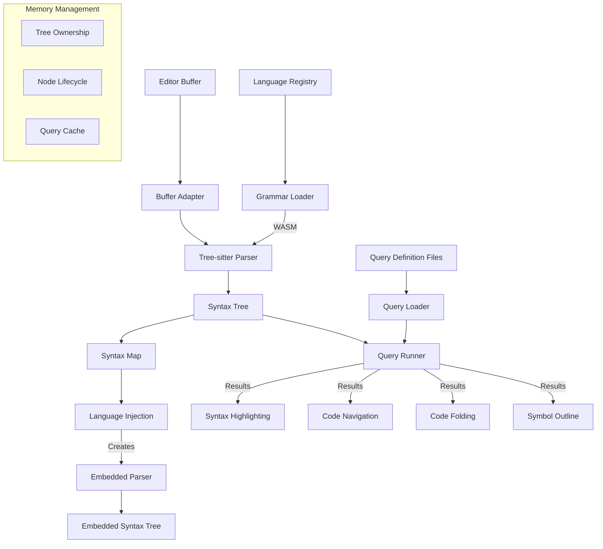

# Ground Level: Tree-sitter Implementation

## Purpose

This document provides a detailed examination of the low-level implementation of Tree-sitter integration within Zed. It focuses on the practical aspects of working with the Tree-sitter parsing system, including memory management, performance optimizations, incremental parsing, and language-specific considerations. Understanding these implementation details is essential for reimplementing this critical component in Swift while ensuring high performance and reliability for syntax analysis across all supported programming languages.

## Implementation Note

In the Zed codebase, Tree-sitter integration is primarily implemented in the `language` crate. Key files include:

- **`language/src/language.rs`**: Core integration with Tree-sitter, including parser management, query handling, and language loading
- **`language/src/syntax_map.rs`**: Management of syntax trees, handling multi-language files with language injection
- **`language/src/buffer.rs`**: Buffer representation with Tree-sitter integration for incremental parsing

The Rust implementation directly uses the Tree-sitter C library via its Rust bindings (`tree_sitter` crate). Language grammars are incorporated through language-specific crates like `tree_sitter_rust`, `tree_sitter_typescript`, etc., which provide compiled parsers.

Here's an example of how Tree-sitter would be used for syntax handling in a Swift implementation:

```swift
// Swift implementation example for Tree-sitter integration
import TreeSitter

// Parser creation and configuration
func newParser() throws -> TSParser {
    let parser = TSParser()
    parser.setTimeoutMicros(PARSER_TIMEOUT_MICROS)
    return parser
}

// Query execution
func queryMatches(
    query: TSQuery,
    node: TSNode,
    text: Data
) -> [QueryMatch] {
    let cursor = TSQueryCursor()
    var matches: [QueryMatch] = []

    cursor.exec(query: query, node: node)

    while let match = cursor.nextMatch() {
        var captures: [QueryCapture] = []

        for i in 0..<match.captureCount {
            let capture = match.captures[Int(i)]
            captures.append(QueryCapture(
                index: capture.index,
                node: capture.node
            ))
        }

        matches.append(QueryMatch(
            patternIndex: match.patternIndex,
            captures: captures
        ))
    }

    return matches
}
```

This demonstrates how a Swift implementation would abstract Tree-sitter operations while maintaining direct access to the performance benefits of the underlying C library through bridging.

## Core Components and Concepts

### Tree-sitter Library Integration

Tree-sitter is integrated into Zed through a combination of:

1. **Native Bindings**: FFI bindings to access Tree-sitter's C library
2. **Language Wrappers**: Swift-specific wrappers around Tree-sitter functionality
3. **Memory Management**: Careful tracking of Tree-sitter's memory usage
4. **Threading Model**: Ensuring safe concurrent access to parsing resources

### Parser Lifecycle

The parser lifecycle involves several stages:

1. **Initialization**: Creating and configuring parser instances
2. **Incremental Parsing**: Updating syntax trees as text changes
3. **Tree Management**: Tracking and disposing of syntax trees
4. **Query Execution**: Running queries against syntax trees
5. **Cleanup**: Properly disposing of resources

### Memory Management Patterns

Working with Tree-sitter requires careful memory management:

1. **Tree Ownership**: Tracking ownership of syntax trees
2. **Node References**: Managing references to nodes within trees
3. **Query Lifecycle**: Creating, using, and disposing of queries
4. **Buffer Synchronization**: Keeping Tree-sitter buffers in sync with editor buffers

### Incremental Parsing Strategy

Incremental parsing is a key performance feature:

1. **Edit Detection**: Identifying text changes since last parse
2. **Range Calculation**: Determining the affected parse range
3. **Tree Reuse**: Reusing unaffected parts of existing trees
4. **Parse Scheduling**: Optimizing when parsing occurs

## Architecture



## Implementation Details

### 1. FFI Bridging

The Tree-sitter interface requires careful bridging between Swift and C:

```swift
// Bridging Tree-sitter's C API to Swift
class TreeSitterBridge {
    // Opaque pointers to Tree-sitter objects
    typealias TSParser = OpaquePointer
    typealias TSTree = OpaquePointer
    typealias TSNode = UnsafeRawPointer
    typealias TSQuery = OpaquePointer
    
    // Create a new parser
    static func createParser() -> TSParser? {
        return ts_parser_new()
    }
    
    // Set language for parser
    static func setLanguage(parser: TSParser, language: TSLanguage) -> Bool {
        return ts_parser_set_language(parser, language)
    }
    
    // Parse text
    static func parse(parser: TSParser, oldTree: TSTree?, text: String) -> TSTree? {
        return text.withCString { cString in
            let length = strlen(cString)
            
            let input = TSInput(
                payload: UnsafeMutableRawPointer(mutating: cString),
                read: { payload, byteIndex, position, bytesRead in
                    let string = payload.assumingMemoryBound(to: CChar.self)
                    guard byteIndex < length else {
                        bytesRead.pointee = 0
                        return nil
                    }
                    
                    bytesRead.pointee = UInt32(length - byteIndex)
                    return string.advanced(by: Int(byteIndex))
                },
                encoding: TSInputEncodingUTF8
            )
            
            return ts_parser_parse(parser, oldTree, input)
        }
    }
    
    // Free resources
    static func freeParser(_ parser: TSParser) {
        ts_parser_delete(parser)
    }
    
    static func freeTree(_ tree: TSTree) {
        ts_tree_delete(tree)
    }
}
```

### 2. Language Grammar Loading

Loading language grammars efficiently:

```swift
class GrammarRegistry {
    private var languages: [String: TSLanguage] = [:]
    private var loadedGrammars: [String: Grammar] = [:]
    
    // Load a language from a WASM file
    func loadLanguage(_ languageId: String) throws -> TSLanguage {
        if let language = languages[languageId] {
            return language
        }
        
        // Find grammar path
        guard let grammarPath = findGrammarPath(languageId) else {
            throw GrammarError.grammarNotFound(languageId)
        }
        
        // Load WASM file
        let wasmData = try Data(contentsOf: URL(fileURLWithPath: grammarPath))
        
        // Load via Tree-sitter
        var errorMessage: UnsafePointer<CChar>?
        let language = ts_language_load_from_wasm(
            wasmData.withUnsafeBytes { $0.baseAddress },
            wasmData.count,
            &errorMessage
        )
        
        // Check for errors
        if let errorMessage = errorMessage {
            let message = String(cString: errorMessage)
            ts_free_string(UnsafeMutablePointer(mutating: errorMessage))
            throw GrammarError.grammarLoadFailed(languageId, message)
        }
        
        // Store and return
        languages[languageId] = language
        return language
    }
    
    // Load grammar with all associated queries
    func loadGrammar(_ languageId: String) throws -> Grammar {
        if let grammar = loadedGrammars[languageId] {
            return grammar
        }
        
        // Load language
        let language = try loadLanguage(languageId)
        
        // Load queries
        let highlightsQuery = try loadQuery(languageId, "highlights.scm", language)
        let injectionsQuery = try loadQuery(languageId, "injections.scm", language)
        let localQuery = try loadQuery(languageId, "locals.scm", language)
        
        // Create grammar
        let grammar = Grammar(
            languageId: languageId,
            language: language,
            highlightsQuery: highlightsQuery,
            injectionsQuery: injectionsQuery,
            localQuery: localQuery
        )
        
        loadedGrammars[languageId] = grammar
        return grammar
    }
    
    private func loadQuery(_ languageId: String, _ queryName: String, _ language: TSLanguage) throws -> TSQuery? {
        guard let queryPath = findQueryPath(languageId, queryName) else {
            return nil
        }
        
        let queryString = try String(contentsOfFile: queryPath)
        var errorOffset: UInt32 = 0
        var errorType: TSQueryError = TSQueryErrorNone
        
        let query = queryString.withCString { cString in
            return ts_query_new(
                language,
                cString,
                UInt32(strlen(cString)),
                &errorOffset,
                &errorType
            )
        }
        
        if errorType != TSQueryErrorNone {
            throw QueryError.queryParseError(queryName, Int(errorOffset), errorType)
        }
        
        return query
    }
}
```

### 3. Incremental Parsing

Implementing efficient incremental parsing:

```swift
class SyntaxParser {
    private var parser: TSParser
    private var currentTree: TSTree?
    private var textBuffer: TextBuffer
    
    init(textBuffer: TextBuffer) {
        self.parser = TreeSitterBridge.createParser()
        self.textBuffer = textBuffer
    }
    
    // Set the language for this parser
    func setLanguage(_ languageId: String, grammarRegistry: GrammarRegistry) throws {
        let language = try grammarRegistry.loadLanguage(languageId)
        guard TreeSitterBridge.setLanguage(parser: parser, language: language) else {
            throw ParserError.incompatibleLanguage
        }
    }
    
    // Parse with edit tracking for incremental parsing
    func parse() -> TSTree? {
        // Get edits since last parse
        let edits = textBuffer.editsSinceLastParse()
        
        // Apply edits to existing tree if we have one
        if let tree = currentTree, !edits.isEmpty {
            for edit in edits {
                let inputEdit = TSInputEdit(
                    start_byte: UInt32(edit.oldRange.lowerBound),
                    old_end_byte: UInt32(edit.oldRange.upperBound),
                    new_end_byte: UInt32(edit.newRange.upperBound),
                    start_point: edit.oldStartPoint.toTSPoint(),
                    old_end_point: edit.oldEndPoint.toTSPoint(),
                    new_end_point: edit.newEndPoint.toTSPoint()
                )
                
                ts_tree_edit(tree, &inputEdit)
            }
        }
        
        // Parse with text buffer adapter
        let text = textBuffer.text
        let newTree = TreeSitterBridge.parse(
            parser: parser,
            oldTree: currentTree,
            text: text
        )
        
        // Update current tree and free old one if needed
        if let oldTree = currentTree, oldTree != newTree {
            TreeSitterBridge.freeTree(oldTree)
        }
        currentTree = newTree
        
        return newTree
    }
    
    deinit {
        if let tree = currentTree {
            TreeSitterBridge.freeTree(tree)
        }
        TreeSitterBridge.freeParser(parser)
    }
}
```

### 4. Syntax Map

Managing a map of syntax trees:

```swift
class SyntaxMap {
    private var layers: [SyntaxLayer]
    private var parsedVersion: Version
    private var languageRegistry: LanguageRegistry
    
    // Get syntax at a specific position
    func syntaxAt(position: Int) -> SyntaxNode? {
        // Find the relevant syntax layer
        for layer in layers.reversed() {
            if let node = layer.nodeAt(position) {
                return node
            }
        }
        return nil
    }
    
    // Get all syntax nodes of a specific type
    func nodesOfType(_ type: String) -> [SyntaxNode] {
        var result = [SyntaxNode]()
        
        for layer in layers {
            let nodes = layer.findNodes { node in
                return node.type == type
            }
            result.append(contentsOf: nodes)
        }
        
        return result
    }
    
    // Find nodes matching a query
    func runQuery(query: TSQuery, in range: Range<Int>? = nil) -> [QueryMatch] {
        var matches = [QueryMatch]()
        
        for layer in layers {
            let layerMatches = layer.runQuery(query: query, in: range)
            matches.append(contentsOf: layerMatches)
        }
        
        return matches
    }
    
    // Add a new syntax layer (e.g., for embedded languages)
    func addLayer(language: Language, tree: TSTree, offset: Int) {
        let layer = SyntaxLayer(
            language: language,
            tree: tree,
            offset: offset
        )
        layers.append(layer)
    }
    
    // Update the syntax map with new buffer content
    func update(buffer: Buffer) -> Bool {
        // Check if we need to update
        let currentVersion = buffer.version
        if currentVersion == parsedVersion {
            return false
        }
        
        // Parse main language
        let languageId = buffer.languageId
        guard let language = languageRegistry.language(for: languageId) else {
            return false
        }
        
        let parser = SyntaxParser(textBuffer: buffer)
        try? parser.setLanguage(languageId, grammarRegistry: languageRegistry.grammarRegistry)
        
        guard let tree = parser.parse() else {
            return false
        }
        
        // Reset layers
        layers = [
            SyntaxLayer(
                language: language,
                tree: tree,
                offset: 0
            )
        ]
        
        // Process injections
        processInjections(buffer: buffer)
        
        parsedVersion = currentVersion
        return true
    }
    
    // Process language injections (embedded languages)
    private func processInjections(buffer: Buffer) {
        for layer in layers {
            guard let injectionsQuery = layer.language.injectionsQuery else {
                continue
            }
            
            let matches = layer.runQuery(query: injectionsQuery)
            for match in matches {
                if let contentNode = match.captures.first(where: { $0.name == "content" || $0.name == "injection.content" })?.node,
                   let languageName = languageNameFromMatch(match) {
                    
                    injectLanguage(
                        languageName: languageName,
                        contentNode: contentNode,
                        buffer: buffer
                    )
                }
            }
        }
    }
    
    private func injectLanguage(languageName: String, contentNode: SyntaxNode, buffer: Buffer) {
        guard let language = languageRegistry.language(for: languageName) else {
            return
        }
        
        let range = contentNode.range
        let text = buffer.text(in: range)
        
        let parser = SyntaxParser(textBuffer: TextBuffer(text: text))
        try? parser.setLanguage(languageName, grammarRegistry: languageRegistry.grammarRegistry)
        
        if let tree = parser.parse() {
            addLayer(
                language: language,
                tree: tree,
                offset: range.lowerBound
            )
        }
    }
}
```

### 5. Query System

Running and caching queries for syntax analysis:

```swift
class QueryManager {
    private var queryCache: [String: TSQuery] = [:]
    
    // Execute a query on a syntax tree
    func executeQuery(
        query: TSQuery,
        tree: TSTree,
        in range: Range<Int>? = nil
    ) -> [QueryMatch] {
        // Create cursor
        let cursor = ts_query_cursor_new()
        defer { ts_query_cursor_delete(cursor) }
        
        // Set range if provided
        if let range = range {
            let startPosition = positionForOffset(tree, range.lowerBound)
            let endPosition = positionForOffset(tree, range.upperBound)
            ts_query_cursor_set_point_range(cursor, startPosition, endPosition)
        }
        
        // Get root node
        let rootNode = ts_tree_root_node(tree)
        
        // Set node for querying
        ts_query_cursor_exec(cursor, query, rootNode)
        
        // Collect matches
        var matches = [QueryMatch]()
        var match = TSQueryMatch()
        
        while ts_query_cursor_next_match(cursor, &match) {
            // Extract capture information
            var captures = [QueryCapture]()
            for i in 0..<match.capture_count {
                let capture = match.captures[Int(i)]
                let name = getCaptureName(query, capture.index)
                
                captures.append(QueryCapture(
                    name: name,
                    node: SyntaxNode(
                        node: capture.node,
                        tree: tree
                    )
                ))
            }
            
            // Get pattern metadata
            let patternIndex = match.pattern_index
            let predicates = getPatternPredicates(query, patternIndex)
            
            matches.append(QueryMatch(
                pattern: patternIndex,
                captures: captures,
                predicates: predicates
            ))
        }
        
        return matches
    }
    
    // Get capture name for a capture index
    private func getCaptureName(_ query: TSQuery, _ index: UInt32) -> String {
        var length: UInt32 = 0
        let name = ts_query_capture_name_for_id(query, index, &length)
        return String(cString: name!)
    }
    
    // Extract pattern predicates
    private func getPatternPredicates(_ query: TSQuery, _ patternIndex: UInt32) -> [QueryPredicate] {
        var predicateCount: UInt32 = 0
        let predicates = ts_query_predicates_for_pattern(query, patternIndex, &predicateCount)
        
        var result = [QueryPredicate]()
        for i in 0..<predicateCount {
            let predicate = predicates.advanced(by: Int(i)).pointee
            result.append(parseQueryPredicate(predicate))
        }
        
        return result
    }
    
    // Compile a query
    func compileQuery(language: TSLanguage, source: String) throws -> TSQuery {
        // Check cache
        let cacheKey = "\(unsafeBitCast(language, to: Int.self))_\(source.hashValue)"
        if let cached = queryCache[cacheKey] {
            return cached
        }
        
        // Compile new query
        var errorOffset: UInt32 = 0
        var errorType: TSQueryError = TSQueryErrorNone
        
        let query = source.withCString { cString in
            return ts_query_new(
                language,
                cString,
                UInt32(strlen(cString)),
                &errorOffset,
                &errorType
            )
        }
        
        if errorType != TSQueryErrorNone {
            throw QueryError.queryParseError(source, Int(errorOffset), errorType)
        }
        
        // Cache and return
        queryCache[cacheKey] = query
        return query!
    }
    
    deinit {
        // Free all cached queries
        for query in queryCache.values {
            ts_query_delete(query)
        }
    }
}
```

### 6. Syntax Node Representation

Representing nodes in the syntax tree:

```swift
class SyntaxNode {
    private let node: TSNode
    private let tree: TSTree
    
    init(node: TSNode, tree: TSTree) {
        self.node = node
        self.tree = tree
    }
    
    // Get node type
    var type: String {
        let type = ts_node_type(node)
        return String(cString: type!)
    }
    
    // Get text range
    var range: Range<Int> {
        let startByte = Int(ts_node_start_byte(node))
        let endByte = Int(ts_node_end_byte(node))
        return startByte..<endByte
    }
    
    // Check if node is named
    var isNamed: Bool {
        return ts_node_is_named(node)
    }
    
    // Get child count
    var childCount: Int {
        return Int(ts_node_child_count(node))
    }
    
    // Get a specific child
    func child(at index: Int) -> SyntaxNode? {
        let childNode = ts_node_child(node, UInt32(index))
        if ts_node_is_null(childNode) {
            return nil
        }
        return SyntaxNode(node: childNode, tree: tree)
    }
    
    // Get all children
    var children: [SyntaxNode] {
        var children = [SyntaxNode]()
        for i in 0..<childCount {
            if let child = child(at: i) {
                children.append(child)
            }
        }
        return children
    }
    
    // Get parent node
    var parent: SyntaxNode? {
        let parentNode = ts_node_parent(node)
        if ts_node_is_null(parentNode) {
            return nil
        }
        return SyntaxNode(node: parentNode, tree: tree)
    }
    
    // Find first ancestor matching predicate
    func firstAncestor(where predicate: (SyntaxNode) -> Bool) -> SyntaxNode? {
        var current = self.parent
        while let node = current {
            if predicate(node) {
                return node
            }
            current = node.parent
        }
        return nil
    }
    
    // Find all descendants matching predicate
    func findDescendants(where predicate: (SyntaxNode) -> Bool) -> [SyntaxNode] {
        var results = [SyntaxNode]()
        findDescendantsHelper(node: self, predicate: predicate, results: &results)
        return results
    }
    
    private func findDescendantsHelper(
        node: SyntaxNode,
        predicate: (SyntaxNode) -> Bool,
        results: inout [SyntaxNode]
    ) {
        if predicate(node) {
            results.append(node)
        }
        
        for child in node.children {
            findDescendantsHelper(node: child, predicate: predicate, results: &results)
        }
    }
}
```

### 7. Highlighting Engine

Syntax highlighting based on Tree-sitter queries:

```swift
class SyntaxHighlighter {
    private let queryManager: QueryManager
    
    // Highlight a buffer
    func highlight(
        buffer: Buffer,
        syntaxMap: SyntaxMap,
        theme: Theme
    ) -> [TextHighlight] {
        var highlights = [TextHighlight]()
        
        for layer in syntaxMap.layers {
            guard let highlightsQuery = layer.language.highlightsQuery else {
                continue
            }
            
            let matches = layer.runQuery(query: highlightsQuery)
            
            for match in matches {
                for capture in match.captures {
                    if let highlightName = layer.language.highlightNameForCapture(capture.name) {
                        if let style = theme.styleForHighlight(highlightName) {
                            highlights.append(TextHighlight(
                                range: capture.node.range,
                                style: style
                            ))
                        }
                    }
                }
            }
        }
        
        // Sort and merge overlapping highlights
        return mergeHighlights(highlights.sorted { $0.range.lowerBound < $1.range.lowerBound })
    }
    
    private func mergeHighlights(_ highlights: [TextHighlight]) -> [TextHighlight] {
        guard !highlights.isEmpty else {
            return []
        }
        
        var result = [highlights[0]]
        
        for highlight in highlights.dropFirst() {
            let lastHighlight = result.last!
            
            if highlight.range.lowerBound <= lastHighlight.range.upperBound {
                // Handle overlapping highlights based on priority
                if highlight.style.priority > lastHighlight.style.priority {
                    // Split the last highlight if needed
                    if lastHighlight.range.lowerBound < highlight.range.lowerBound {
                        result[result.count - 1] = TextHighlight(
                            range: lastHighlight.range.lowerBound..<highlight.range.lowerBound,
                            style: lastHighlight.style
                        )
                        
                        if highlight.range.upperBound < lastHighlight.range.upperBound {
                            // Add the current highlight
                            result.append(highlight)
                            
                            // Add the remaining part of the last highlight
                            result.append(TextHighlight(
                                range: highlight.range.upperBound..<lastHighlight.range.upperBound,
                                style: lastHighlight.style
                            ))
                        } else {
                            // Add the current highlight which completely covers the remainder
                            result.append(highlight)
                        }
                    } else {
                        // Current highlight starts at the same position
                        if highlight.range.upperBound < lastHighlight.range.upperBound {
                            // Replace last highlight with current one
                            result[result.count - 1] = highlight
                            
                            // Add the remaining part of the last highlight
                            result.append(TextHighlight(
                                range: highlight.range.upperBound..<lastHighlight.range.upperBound,
                                style: lastHighlight.style
                            ))
                        } else {
                            // Complete replacement
                            result[result.count - 1] = highlight
                        }
                    }
                } else {
                    // Current highlight has lower priority, only add non-overlapping part
                    if highlight.range.upperBound > lastHighlight.range.upperBound {
                        result.append(TextHighlight(
                            range: lastHighlight.range.upperBound..<highlight.range.upperBound,
                            style: highlight.style
                        ))
                    }
                }
            } else {
                // No overlap, add as-is
                result.append(highlight)
            }
        }
        
        return result
    }
}
```

### 8. Performance Optimizations

Key optimizations for Tree-sitter performance:

```swift
extension SyntaxParser {
    // Set multithreaded parsing
    func setThreadCount(_ count: Int) {
        ts_parser_set_num_threads(parser, UInt32(count))
    }
    
    // Set timeout to prevent long parses
    func setTimeout(_ microseconds: Int) {
        ts_parser_set_timeout_micros(parser, UInt64(microseconds))
    }
    
    // Limit memory usage
    func setParseOptions(options: ParseOptions) {
        // Set memory limit
        if let memoryLimit = options.memoryLimit {
            ts_parser_set_included_ranges(
                parser,
                nil,
                0
            )
            // Once included ranges are reset, we can set the memory limit
            ts_parser_set_max_memory_bytes(parser, UInt64(memoryLimit))
        }
        
        // Set thread count
        if let threadCount = options.threadCount {
            setThreadCount(threadCount)
        }
        
        // Set timeout
        if let timeout = options.timeout {
            setTimeout(timeout)
        }
    }
    
    // Parse only visible range
    func parseVisibleRange(range: Range<Int>, text: String) -> TSTree? {
        // Convert range to TSRange
        let startPoint = positionForOffset(text, range.lowerBound)
        let endPoint = positionForOffset(text, range.upperBound)
        
        let tsRange = TSRange(
            start_point: startPoint,
            end_point: endPoint,
            start_byte: UInt32(range.lowerBound),
            end_byte: UInt32(range.upperBound)
        )
        
        // Set included ranges
        var includedRange = tsRange
        ts_parser_set_included_ranges(parser, &includedRange, 1)
        
        // Parse with visible range limit
        return TreeSitterBridge.parse(
            parser: parser,
            oldTree: currentTree,
            text: text
        )
    }
    
    // Use a cancellation flag for background parsing
    func parseWithCancellation(cancellationFlag: UnsafeMutablePointer<Bool>) -> TSTree? {
        ts_parser_set_cancellation_flag(parser, cancellationFlag)
        
        let result = TreeSitterBridge.parse(
            parser: parser,
            oldTree: currentTree,
            text: textBuffer.text
        )
        
        // Reset cancellation flag
        ts_parser_set_cancellation_flag(parser, nil)
        
        return result
    }
}
```

## Swift Implementation Considerations

### 1. Memory Management

Swift's memory management requires careful consideration:

```swift
// Use proper reference counting for Tree-sitter objects
class TreeSitterWrapper {
    private var parser: TSParser?
    private var tree: TSTree?
    
    init() {
        parser = ts_parser_new()
    }
    
    deinit {
        if let tree = tree {
            ts_tree_delete(tree)
        }
        if let parser = parser {
            ts_parser_delete(parser)
        }
    }
    
    // Safely update tree reference
    func updateTree(_ newTree: TSTree?) {
        if let oldTree = tree {
            ts_tree_delete(oldTree)
        }
        tree = newTree
    }
}
```

### 2. Threading Model

Tree-sitter parsing should be done on a background thread:

```swift
class BackgroundParser {
    private let parserQueue = DispatchQueue(label: "com.zed.treesitter.parser", qos: .userInitiated)
    private var parserWrapper = TreeSitterWrapper()
    private var parseTask: Task<Void, Never>?
    
    // Parse in background
    func parseAsync(buffer: Buffer) -> Task<SyntaxMap, Error> {
        // Cancel any ongoing parsing
        parseTask?.cancel()
        
        return Task.detached(priority: .userInitiated) { [weak self] in
            guard let self = self else {
                throw ParserError.parserReleased
            }
            
            // Ensure all parsing happens on the parser queue
            return try await withCheckedThrowingContinuation { continuation in
                self.parserQueue.async {
                    do {
                        let syntaxMap = try self.parse(buffer)
                        continuation.resume(returning: syntaxMap)
                    } catch {
                        continuation.resume(throwing: error)
                    }
                }
            }
        }
    }
}
```

### 3. Swift API Design

Design a clean Swift API for Tree-sitter:

```swift
// Swift-friendly interface to Tree-sitter
struct SyntaxTreeAPI {
    // Parse source code
    static func parse(source: String, language: Language) throws -> SyntaxTree {
        // Implementation that handles Tree-sitter internally
    }
    
    // Query a syntax tree
    static func query(tree: SyntaxTree, query: String) throws -> [QueryMatch] {
        // Implementation that handles Tree-sitter internally
    }
    
    // Get node at position
    static func nodeAt(position: Int, in tree: SyntaxTree) -> SyntaxNode? {
        // Implementation that handles Tree-sitter internally
    }
}

// Usage
let tree = try SyntaxTreeAPI.parse(source: sourceCode, language: .swift)
let classNodes = try SyntaxTreeAPI.query(tree: tree, query: "(class_declaration) @class")
```

### 4. Error Handling

Robust error handling for parsing and queries:

```swift
enum TreeSitterError: Error {
    case parserInitFailed
    case languageLoadFailed(String)
    case parseFailed(String)
    case queryCompileFailed(String, position: Int)
    case memoryLimitExceeded
    case timeout
    case cancelled
}

extension TreeSitterError: LocalizedError {
    var errorDescription: String? {
        switch self {
        case .parserInitFailed:
            return "Failed to initialize Tree-sitter parser"
        case .languageLoadFailed(let language):
            return "Failed to load grammar for language: \(language)"
        case .parseFailed(let reason):
            return "Parsing failed: \(reason)"
        case .queryCompileFailed(let query, let position):
            return "Query compilation failed at position \(position): \(query)"
        case .memoryLimitExceeded:
            return "Parser memory limit exceeded"
        case .timeout:
            return "Parser timed out"
        case .cancelled:
            return "Parsing was cancelled"
        }
    }
}
```

### 5. Native vs. Binary Distribution

Consider options for Tree-sitter integration:

```swift
// Option 1: Use binaries via dynamic linking
class DynamicTreeSitter {
    private let libraryHandle: UnsafeMutableRawPointer
    
    init() throws {
        // Open library
        guard let handle = dlopen("libtree-sitter.dylib", RTLD_NOW) else {
            throw TreeSitterError.libraryLoadFailed(String(cString: dlerror()))
        }
        libraryHandle = handle
        
        // Load symbols
        guard let parserNewSymbol = dlsym(handle, "ts_parser_new") else {
            throw TreeSitterError.symbolLoadFailed("ts_parser_new")
        }
        
        // Store function pointers
        parserNew = unsafeBitCast(parserNewSymbol, to: ParserNewFunction.self)
        
        // ... load other symbols
    }
    
    deinit {
        dlclose(libraryHandle)
    }
}

// Option 2: Use Swift Package with precompiled libraries
// Package.swift:
// dependencies: [
//     .package(url: "https://github.com/zed-editor/tree-sitter-swift.git", from: "1.0.0")
// ]
```

## Conclusion

Tree-sitter integration in Zed involves sophisticated memory management, incremental parsing strategies, and performance optimizations to provide fast and accurate syntax analysis. The Swift implementation must carefully bridge with Tree-sitter's C API while providing a clean, safe, and performant Swift interface.

Key considerations for the Swift implementation include:
- Proper memory management for Tree-sitter objects
- Background threading for parsing operations
- Incremental parsing for performance
- Query caching and optimization
- Swift-friendly error handling
- Clean API design for Swift code

By implementing these patterns, the Swift version can achieve the same performance and functionality as the original Rust implementation while providing a more Swift-idiomatic interface for the rest of the editor.