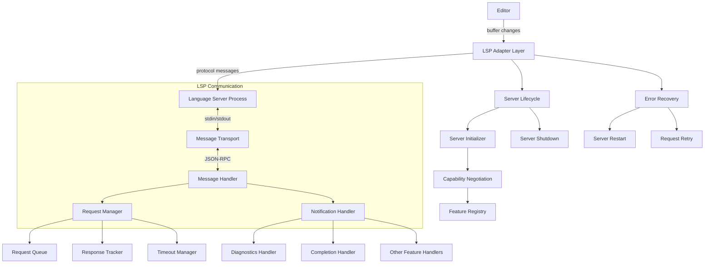

# Ground Level: Language Server Protocol Implementation

## Purpose

This document provides a detailed examination of the Language Server Protocol (LSP) implementation in Zed, focusing on the low-level aspects of establishing, managing, and communicating with language servers. Understanding these implementation details is crucial for reimplementing this system in Swift while maintaining compatibility with the wide range of language servers available in the ecosystem. This technical foundation enables Zed to provide rich language features like code completion, diagnostics, and refactoring across dozens of programming languages.

## Implementation Note

In the Zed codebase, the LSP implementation is distributed across several crates, with key components in:

- **`lsp/src/lsp.rs`**: Core LSP types and communication protocol implementation
- **`lsp/src/input_handler.rs`**: Handling LSP message parsing and processing
- **`project/src/lsp_store.rs`**: Management of LSP server instances and state
- **`project/src/lsp_command.rs`**: Command execution via LSP, including features like code actions

The implementation uses `lsp_types` for standard protocol definitions and establishes asynchronous communication channels with language server processes.

### Language Server Configuration Examples

Zed supports multiple language servers with language-specific configuration. For example, here's how different language servers would be configured in a Swift implementation:

```swift
// Example of Swift implementation for language server configuration
struct LanguageServerConfiguration {
    var name: String
    var command: [String]
    var initializationOptions: [String: Any]?

    static func defaultConfig() -> LanguageServerConfiguration {
        return LanguageServerConfiguration(
            name: "",
            command: [],
            initializationOptions: nil
        )
    }

    static func rust() -> LanguageServerConfiguration {
        var config = defaultConfig()
        config.name = "rust-analyzer"
        config.command = ["rust-analyzer"]
        config.initializationOptions = [
            "check": ["command": "clippy"],
            "cargo": ["loadOutDirsFromCheck": true],
            "procMacro": ["enable": true],
            "diagnostics": ["disabled": ["unresolved-proc-macro"]]
        ]
        return config
    }

    static func typescript() -> LanguageServerConfiguration {
        var config = defaultConfig()
        config.name = "typescript"
        config.command = ["typescript-language-server", "--stdio"]
        config.initializationOptions = [
            "preferences": [
                "importModuleSpecifierPreference": "relative"
            ]
        ]
        return config
    }
}
```

This modular design allows Zed to support language-specific features while maintaining a consistent interface for editor integration.

## Core Components and Concepts

### LSP Communication Architecture

The LSP implementation consists of several critical components:

1. **Transport Layer**: Handles raw communication with language server processes
2. **Message Protocol**: Implements the JSON-RPC based LSP message format
3. **Server Lifecycle**: Manages language server startup, initialization, and shutdown
4. **Request/Response Handling**: Coordinates sending requests and handling responses
5. **Notification Processing**: Handles asynchronous notifications from servers
6. **Capability Negotiation**: Manages feature support between client and server
7. **Error Recovery**: Implements strategies for handling server failures

### Language Server Management

The system carefully manages language server instances:

1. **Server Discovery**: Finding language server executables
2. **Server Installation**: Installing servers when needed
3. **Process Management**: Spawning and monitoring server processes
4. **Resource Limitation**: Constraining memory and CPU usage
5. **Workspace Configuration**: Providing project configuration to servers

### Request Lifecycle

Each LSP request follows a specific lifecycle:

1. **Request Formulation**: Creating properly formatted requests
2. **Request Sending**: Transmitting requests to servers
3. **Response Waiting**: Awaiting responses with timeouts
4. **Response Parsing**: Processing and validating responses
5. **Error Handling**: Managing timeouts, crashes, and other failures

### Document Synchronization

The system keeps language servers in sync with editor state:

1. **Document Opening**: Notifying servers about opened documents
2. **Change Tracking**: Sending incremental or full changes to servers
3. **Version Management**: Tracking document versions for each server
4. **Document Closing**: Properly closing documents when needed

## Architecture



## Implementation Details

### 1. LSP Client Implementation

The core LSP client connects to language servers:

```swift
class LanguageServerClient {
    // Server process and communication channels
    private var process: Process?
    private var stdinPipe: Pipe?
    private var stdoutPipe: Pipe?
    private var stderrPipe: Pipe?
    
    // Message handling
    private let messageQueue = AsyncQueue<LspMessage>()
    private var nextRequestId: Int = 1
    private var pendingRequests: [Int: PendingRequest] = [:]
    
    // Server state
    private var serverCapabilities: ServerCapabilities?
    private var initialized = false
    private var shuttingDown = false
    
    // Server configuration
    private let serverPath: String
    private let serverArgs: [String]
    private let workspaceFolders: [WorkspaceFolder]
    private let initializationOptions: [String: Any]?
    
    init(
        serverPath: String,
        serverArgs: [String] = [],
        workspaceFolders: [WorkspaceFolder] = [],
        initializationOptions: [String: Any]? = nil
    ) {
        self.serverPath = serverPath
        self.serverArgs = serverArgs
        self.workspaceFolders = workspaceFolders
        self.initializationOptions = initializationOptions
    }
    
    // Start the language server process
    func start() throws {
        // Create pipes
        let stdinPipe = Pipe()
        let stdoutPipe = Pipe()
        let stderrPipe = Pipe()
        
        // Configure process
        let process = Process()
        process.executableURL = URL(fileURLWithPath: serverPath)
        process.arguments = serverArgs
        process.standardInput = stdinPipe
        process.standardOutput = stdoutPipe
        process.standardError = stderrPipe
        
        // Set up environment if needed
        var environment = ProcessInfo.processInfo.environment
        environment["PATH"] = (environment["PATH"] ?? "") + ":/usr/local/bin:/opt/homebrew/bin"
        process.environment = environment
        
        // Start process
        try process.run()
        
        // Store references
        self.process = process
        self.stdinPipe = stdinPipe
        self.stdoutPipe = stdoutPipe
        self.stderrPipe = stderrPipe
        
        // Start reading stdout
        Task {
            try await readStdout(stdoutPipe)
        }
        
        // Start reading stderr
        Task {
            try await readStderr(stderrPipe)
        }
        
        // Initialize server
        try await initialize()
    }
    
    // Read from stdout and process messages
    private func readStdout(_ pipe: Pipe) async throws {
        let fileHandle = pipe.fileHandleForReading
        let messageParser = LspMessageParser()
        
        while let data = try await fileHandle.read(upToCount: 4096) {
            if let messages = messageParser.parseData(data) {
                for message in messages {
                    await processMessage(message)
                }
            }
        }
    }
    
    // Read from stderr for logging
    private func readStderr(_ pipe: Pipe) async throws {
        let fileHandle = pipe.fileHandleForReading
        
        while let data = try await fileHandle.read(upToCount: 4096) {
            if let errorMessage = String(data: data, encoding: .utf8) {
                log.error("LSP server error: \(errorMessage)")
            }
        }
    }
    
    // Process an incoming LSP message
    private func processMessage(_ message: LspMessage) async {
        switch message {
        case .response(let id, let result, let error):
            handleResponse(id: id, result: result, error: error)
            
        case .notification(let method, let params):
            await handleNotification(method: method, params: params)
            
        case .request(let id, let method, let params):
            await handleRequest(id: id, method: method, params: params)
        }
    }
    
    // Send a request to the language server
    func sendRequest<T: Decodable>(
        method: String,
        params: Encodable,
        timeout: TimeInterval = 10.0
    ) async throws -> T {
        let id = nextRequestId
        nextRequestId += 1
        
        // Create JSON-RPC request
        let request = LspRequest(id: id, method: method, params: params)
        let requestData = try JSONEncoder().encode(request)
        
        // Add content length header
        let contentLength = requestData.count
        let header = "Content-Length: \(contentLength)\r\n\r\n"
        let headerData = header.data(using: .utf8)!
        
        // Create pending request
        let continuation = CheckedContinuation<T, Error>()
        let pendingRequest = PendingRequest(
            id: id,
            startTime: Date(),
            timeout: timeout,
            continuation: continuation
        )
        pendingRequests[id] = pendingRequest
        
        // Send request
        try await stdinPipe?.fileHandleForWriting.write(contentsOf: headerData + requestData)
        
        // Set up timeout
        Task {
            try await Task.sleep(nanoseconds: UInt64(timeout * 1_000_000_000))
            if pendingRequests[id] != nil {
                pendingRequests.removeValue(forKey: id)
                continuation.resume(throwing: LspError.requestTimeout(method: method))
            }
        }
        
        // Wait for response
        return try await continuation.value
    }
    
    // Handle a response from the language server
    private func handleResponse(id: Int, result: Any?, error: LspError?) {
        guard let pendingRequest = pendingRequests.removeValue(forKey: id) else {
            log.warning("Received response for unknown request ID: \(id)")
            return
        }
        
        if let error = error {
            pendingRequest.continuation.resume(throwing: error)
            return
        }
        
        do {
            if let result = result {
                let resultData = try JSONSerialization.data(withJSONObject: result)
                let decodedResult = try JSONDecoder().decode(
                    pendingRequest.continuation.expectedType,
                    from: resultData
                )
                pendingRequest.continuation.resume(returning: decodedResult)
            } else {
                pendingRequest.continuation.resume(throwing: LspError.nullResult)
            }
        } catch {
            pendingRequest.continuation.resume(throwing: error)
        }
    }
    
    // Handle a notification from the language server
    private func handleNotification(method: String, params: Any?) async {
        switch method {
        case "textDocument/publishDiagnostics":
            if let params = params as? [String: Any],
               let diagnostics = try? JSONDecoder().decode(
                   PublishDiagnosticsParams.self,
                   from: JSONSerialization.data(withJSONObject: params)
               ) {
                await handleDiagnostics(diagnostics)
            }
            
        case "window/logMessage":
            if let params = params as? [String: Any],
               let message = try? JSONDecoder().decode(
                   LogMessageParams.self,
                   from: JSONSerialization.data(withJSONObject: params)
               ) {
                log.info("LSP server message: \(message.message)")
            }
            
        // Handle other notifications
        default:
            log.debug("Received unhandled notification: \(method)")
        }
    }
    
    // Handle a request from the language server
    private func handleRequest(id: Int, method: String, params: Any?) async {
        switch method {
        case "workspace/applyEdit":
            if let params = params as? [String: Any],
               let workspaceEdit = try? JSONDecoder().decode(
                   ApplyWorkspaceEditParams.self,
                   from: JSONSerialization.data(withJSONObject: params)
               ) {
                let result = await applyWorkspaceEdit(workspaceEdit.edit)
                sendResponse(id: id, result: ["applied": result])
            }
            
        case "window/showMessage":
            if let params = params as? [String: Any],
               let message = try? JSONDecoder().decode(
                   ShowMessageParams.self,
                   from: JSONSerialization.data(withJSONObject: params)
               ) {
                showMessage(message)
                sendResponse(id: id, result: nil)
            }
            
        // Handle other requests
        default:
            log.warning("Unsupported server request: \(method)")
            sendResponse(id: id, error: LspError.methodNotFound(method: method))
        }
    }
    
    // Send response to a server request
    private func sendResponse(id: Int, result: Any? = nil, error: LspError? = nil) {
        do {
            let response = LspResponse(id: id, result: result, error: error)
            let responseData = try JSONEncoder().encode(response)
            
            let contentLength = responseData.count
            let header = "Content-Length: \(contentLength)\r\n\r\n"
            let headerData = header.data(using: .utf8)!
            
            try stdinPipe?.fileHandleForWriting.write(contentsOf: headerData + responseData)
        } catch {
            log.error("Failed to send response: \(error)")
        }
    }
    
    // Initialize the language server
    private func initialize() async throws {
        // Create initialization params
        let initializeParams = InitializeParams(
            processId: ProcessInfo.processInfo.processIdentifier,
            clientInfo: ClientInfo(
                name: "Zed",
                version: Bundle.main.infoDictionary?["CFBundleShortVersionString"] as? String ?? "0.0.0"
            ),
            locale: Locale.current.identifier,
            rootPath: workspaceFolders.first?.uri.path,
            rootUri: workspaceFolders.first?.uri,
            workspaceFolders: workspaceFolders,
            capabilities: ClientCapabilities(),
            initializationOptions: initializationOptions,
            trace: "off"
        )
        
        // Send initialize request
        let response: InitializeResult = try await sendRequest(
            method: "initialize",
            params: initializeParams,
            timeout: 30.0
        )
        
        // Store server capabilities
        self.serverCapabilities = response.capabilities
        
        // Send initialized notification
        let initialized = LspNotification(
            method: "initialized",
            params: [:]
        )
        let initializedData = try JSONEncoder().encode(initialized)
        let contentLength = initializedData.count
        let header = "Content-Length: \(contentLength)\r\n\r\n"
        let headerData = header.data(using: .utf8)!
        
        try stdinPipe?.fileHandleForWriting.write(contentsOf: headerData + initializedData)
        
        self.initialized = true
    }
    
    // Shutdown the language server
    func shutdown() async throws {
        guard !shuttingDown && initialized else {
            return
        }
        
        shuttingDown = true
        
        // Send shutdown request
        try await sendRequest(method: "shutdown", params: EmptyObject())
        
        // Send exit notification
        let exit = LspNotification(method: "exit", params: EmptyObject())
        let exitData = try JSONEncoder().encode(exit)
        
        let contentLength = exitData.count
        let header = "Content-Length: \(contentLength)\r\n\r\n"
        let headerData = header.data(using: .utf8)!
        
        try stdinPipe?.fileHandleForWriting.write(contentsOf: headerData + exitData)
        
        // Wait for process to terminate
        await withCheckedContinuation { continuation in
            DispatchQueue.global().asyncAfter(deadline: .now() + 1.0) {
                self.process?.terminate()
                continuation.resume()
            }
        }
        
        // Clean up
        process = nil
        stdinPipe = nil
        stdoutPipe = nil
        stderrPipe = nil
        initialized = false
        shuttingDown = false
    }
    
    deinit {
        if process?.isRunning == true {
            process?.terminate()
        }
    }
}
```

### 2. LSP Message Parser

Parsing the LSP message format:

```swift
class LspMessageParser {
    private var buffer = Data()
    private var contentLength: Int?
    
    func parseData(_ data: Data) -> [LspMessage]? {
        buffer.append(data)
        
        var messages = [LspMessage]()
        
        while true {
            // Parse headers if needed
            if contentLength == nil {
                if let headers = parseHeaders() {
                    contentLength = headers["Content-Length"].flatMap { Int($0) }
                } else {
                    // Need more data for headers
                    break
                }
            }
            
            // Parse content if we have enough data
            if let contentLength = contentLength,
               buffer.count >= contentLength {
                let contentData = buffer.prefix(contentLength)
                buffer = buffer.dropFirst(contentLength)
                
                if let message = parseContent(contentData) {
                    messages.append(message)
                }
                
                // Reset for next message
                self.contentLength = nil
            } else {
                // Need more data for content
                break
            }
        }
        
        return messages.isEmpty ? nil : messages
    }
    
    private func parseHeaders() -> [String: String]? {
        // Find the header delimiter
        guard let headerEndRange = buffer.range(of: Data("\r\n\r\n".utf8)) else {
            return nil
        }
        
        // Extract header data
        let headerData = buffer.prefix(upTo: headerEndRange.lowerBound)
        let headerString = String(data: headerData, encoding: .utf8) ?? ""
        
        // Remove headers from buffer
        buffer = buffer.dropFirst(headerEndRange.upperBound - buffer.startIndex)
        
        // Parse headers
        var headers = [String: String]()
        for line in headerString.components(separatedBy: "\r\n") {
            if let colonIndex = line.firstIndex(of: ":") {
                let name = line[..<colonIndex].trimmingCharacters(in: .whitespaces)
                let value = line[line.index(after: colonIndex)...].trimmingCharacters(in: .whitespaces)
                headers[name] = value
            }
        }
        
        return headers
    }
    
    private func parseContent(_ data: Data) -> LspMessage? {
        do {
            let json = try JSONSerialization.jsonObject(with: data) as? [String: Any]
            
            if let json = json {
                if let id = json["id"] as? Int {
                    if json["method"] != nil {
                        // Request
                        return .request(
                            id: id,
                            method: json["method"] as? String ?? "",
                            params: json["params"]
                        )
                    } else {
                        // Response
                        return .response(
                            id: id,
                            result: json["result"],
                            error: parseError(json["error"])
                        )
                    }
                } else if let method = json["method"] as? String {
                    // Notification
                    return .notification(
                        method: method,
                        params: json["params"]
                    )
                }
            }
            
            return nil
        } catch {
            log.error("Failed to parse JSON-RPC message: \(error)")
            return nil
        }
    }
    
    private func parseError(_ error: Any?) -> LspError? {
        guard let errorDict = error as? [String: Any],
              let code = errorDict["code"] as? Int else {
            return nil
        }
        
        let message = errorDict["message"] as? String ?? "Unknown error"
        return LspError.serverError(code: code, message: message)
    }
}
```

### 3. LSP Adapter Implementation

Managing language-specific adapters:

```swift
protocol LspAdapter {
    // Server identification
    var id: String { get }
    var name: String { get }
    
    // Server discovery
    func isInstalled() async -> Bool
    func install() async throws
    func getServerPath() async throws -> String
    
    // Server configuration
    func getServerArguments() -> [String]
    func getInitializationOptions(workspaceFolders: [WorkspaceFolder]) -> [String: Any]?
    func getSyntaxTokenTypes() -> [String]
    
    // Server capabilities
    func supportsDocumentFormatting() -> Bool
    func supportsSemanticTokens() -> Bool
    func supportsCodeActions() -> Bool
    
    // Language-specific handling
    func transformDiagnostic(_ diagnostic: Diagnostic) -> Diagnostic
    func shouldDebounceRequest(method: String) -> Bool
}

class SwiftLspAdapter: LspAdapter {
    let id = "sourcekit-lsp"
    let name = "SourceKit-LSP"
    
    func isInstalled() async -> Bool {
        let process = Process()
        process.executableURL = URL(fileURLWithPath: "/usr/bin/env")
        process.arguments = ["which", "sourcekit-lsp"]
        
        let pipe = Pipe()
        process.standardOutput = pipe
        process.standardError = pipe
        
        do {
            try process.run()
            process.waitUntilExit()
            return process.terminationStatus == 0
        } catch {
            return false
        }
    }
    
    func install() async throws {
        throw LspAdapterError.manualInstallationRequired(name: name, instructions: """
            SourceKit-LSP is included with Xcode and Swift toolchain.
            Please ensure that Xcode is installed and the command line tools are set up:
            
            xcode-select --install
            """)
    }
    
    func getServerPath() async throws -> String {
        // Check for bundled sourcekit-lsp with Xcode
        let process = Process()
        process.executableURL = URL(fileURLWithPath: "/usr/bin/xcrun")
        process.arguments = ["--find", "sourcekit-lsp"]
        
        let pipe = Pipe()
        process.standardOutput = pipe
        
        try process.run()
        process.waitUntilExit()
        
        if process.terminationStatus == 0,
           let serverPath = String(data: pipe.fileHandleForReading.readDataToEndOfFile(), encoding: .utf8)?.trimmingCharacters(in: .whitespacesAndNewlines),
           !serverPath.isEmpty {
            return serverPath
        }
        
        // Fall back to PATH
        let whichProcess = Process()
        whichProcess.executableURL = URL(fileURLWithPath: "/usr/bin/env")
        whichProcess.arguments = ["which", "sourcekit-lsp"]
        
        let whichPipe = Pipe()
        whichProcess.standardOutput = whichPipe
        
        try whichProcess.run()
        whichProcess.waitUntilExit()
        
        if whichProcess.terminationStatus == 0,
           let serverPath = String(data: whichPipe.fileHandleForReading.readDataToEndOfFile(), encoding: .utf8)?.trimmingCharacters(in: .whitespacesAndNewlines),
           !serverPath.isEmpty {
            return serverPath
        }
        
        throw LspAdapterError.serverNotFound(name: name)
    }
    
    func getServerArguments() -> [String] {
        return []
    }
    
    func getInitializationOptions(workspaceFolders: [WorkspaceFolder]) -> [String: Any]? {
        return [
            "diagnostics": true,
            "indexing": true,
            "completion": [
                "callPatternHeuristics": true,
                "includeCodePatterns": true
            ]
        ]
    }
    
    func getSyntaxTokenTypes() -> [String] {
        return [
            "class", "struct", "enum", "interface", "parameter", "variable", "property",
            "function", "method", "type", "keyword", "string", "number", "comment"
        ]
    }
    
    func supportsDocumentFormatting() -> Bool {
        return true
    }
    
    func supportsSemanticTokens() -> Bool {
        return true
    }
    
    func supportsCodeActions() -> Bool {
        return true
    }
    
    func transformDiagnostic(_ diagnostic: Diagnostic) -> Diagnostic {
        // Swift-specific diagnostic transformation
        return diagnostic
    }
    
    func shouldDebounceRequest(method: String) -> Bool {
        switch method {
        case "textDocument/completion":
            return true
        case "textDocument/hover":
            return true
        default:
            return false
        }
    }
}
```

### 4. Document Synchronization

Keeping the language server in sync with editor:

```swift
class DocumentSynchronizer {
    private var languageServer: LanguageServerClient
    private var openDocuments: [String: DocumentState] = [:]
    
    struct DocumentState {
        let uri: DocumentUri
        let languageId: String
        var version: Int
        var text: String
    }
    
    init(languageServer: LanguageServerClient) {
        self.languageServer = languageServer
    }
    
    // Open a document
    func openDocument(
        uri: DocumentUri,
        languageId: String,
        text: String
    ) async throws {
        let params = DidOpenTextDocumentParams(
            textDocument: TextDocumentItem(
                uri: uri,
                languageId: languageId,
                version: 1,
                text: text
            )
        )
        
        try await languageServer.sendNotification(
            method: "textDocument/didOpen",
            params: params
        )
        
        openDocuments[uri.absoluteString] = DocumentState(
            uri: uri,
            languageId: languageId,
            version: 1,
            text: text
        )
    }
    
    // Send changes to an open document
    func changeDocument(
        uri: DocumentUri,
        changes: [TextDocumentContentChangeEvent]
    ) async throws {
        guard var state = openDocuments[uri.absoluteString] else {
            throw DocumentSyncError.documentNotOpen(uri: uri)
        }
        
        // Update version
        state.version += 1
        
        // Update text
        if changes.count == 1, let change = changes.first, change.range == nil {
            // Full content update
            state.text = change.text
        } else {
            // Apply incremental changes
            var text = state.text
            
            // Sort changes in reverse order to avoid position shifts
            let sortedChanges = changes.sorted { a, b in
                guard let rangeA = a.range, let rangeB = b.range else {
                    return false
                }
                return rangeA.start > rangeB.start
            }
            
            for change in sortedChanges {
                if let range = change.range {
                    let startOffset = positionToOffset(range.start, in: text)
                    let endOffset = positionToOffset(range.end, in: text)
                    
                    let prefix = text.prefix(startOffset)
                    let suffix = text.dropFirst(endOffset)
                    
                    text = prefix + change.text + suffix
                }
            }
            
            state.text = text
        }
        
        // Store updated state
        openDocuments[uri.absoluteString] = state
        
        // Send change notification
        let params = DidChangeTextDocumentParams(
            textDocument: VersionedTextDocumentIdentifier(
                uri: uri,
                version: state.version
            ),
            contentChanges: changes
        )
        
        try await languageServer.sendNotification(
            method: "textDocument/didChange",
            params: params
        )
    }
    
    // Close a document
    func closeDocument(uri: DocumentUri) async throws {
        guard openDocuments[uri.absoluteString] != nil else {
            throw DocumentSyncError.documentNotOpen(uri: uri)
        }
        
        let params = DidCloseTextDocumentParams(
            textDocument: TextDocumentIdentifier(uri: uri)
        )
        
        try await languageServer.sendNotification(
            method: "textDocument/didClose",
            params: params
        )
        
        openDocuments.removeValue(forKey: uri.absoluteString)
    }
    
    // Save a document
    func saveDocument(uri: DocumentUri) async throws {
        guard let state = openDocuments[uri.absoluteString] else {
            throw DocumentSyncError.documentNotOpen(uri: uri)
        }
        
        let params = DidSaveTextDocumentParams(
            textDocument: TextDocumentIdentifier(uri: uri),
            text: state.text
        )
        
        try await languageServer.sendNotification(
            method: "textDocument/didSave",
            params: params
        )
    }
    
    // Helper to convert Position to string offset
    private func positionToOffset(_ position: Position, in text: String) -> Int {
        var currentLine = 0
        var currentOffset = 0
        
        for (i, char) in text.enumerated() {
            if currentLine == position.line && currentOffset == position.character {
                return i
            }
            
            if char == "\n" {
                currentLine += 1
                currentOffset = 0
            } else {
                currentOffset += 1
            }
        }
        
        return text.count
    }
}
```

### 5. Request Debouncing and Timeout Handling

Managing request timing and recovery:

```swift
class LspRequestManager {
    private var activeRequests: [String: Set<Int>] = [:]
    private var debounceTimers: [String: Timer] = [:]
    private var debounceIntervals: [String: TimeInterval] = [
        "textDocument/completion": 0.15,
        "textDocument/hover": 0.2,
        "textDocument/signatureHelp": 0.2
    ]
    
    private let languageServer: LanguageServerClient
    private let adapter: LspAdapter
    
    init(languageServer: LanguageServerClient, adapter: LspAdapter) {
        self.languageServer = languageServer
        self.adapter = adapter
    }
    
    // Send a request with debouncing if needed
    func sendRequest<T: Decodable>(
        method: String,
        params: Encodable,
        timeout: TimeInterval = 10.0
    ) async throws -> T {
        // Check if method should be debounced
        if adapter.shouldDebounceRequest(method: method),
           let debounceInterval = debounceIntervals[method] {
            return try await debounce(
                method: method,
                params: params,
                interval: debounceInterval,
                timeout: timeout
            )
        } else {
            // Send immediately
            let requestId = try await sendRequestDirectly(
                method: method,
                params: params,
                timeout: timeout
            )
            
            // Track request
            trackRequest(method: method, id: requestId)
            
            // Wait for response
            return try await waitForResponse(method: method, id: requestId)
        }
    }
    
    // Debounce a request
    private func debounce<T: Decodable>(
        method: String,
        params: Encodable,
        interval: TimeInterval,
        timeout: TimeInterval
    ) async throws -> T {
        // Cancel existing timer
        debounceTimers[method]?.invalidate()
        
        // Return the result from a new debounced request
        return try await withCheckedThrowingContinuation { continuation in
            let timer = Timer.scheduledTimer(withTimeInterval: interval, repeats: false) { [weak self] _ in
                guard let self = self else {
                    continuation.resume(throwing: LspError.clientCancelled)
                    return
                }
                
                Task {
                    do {
                        let requestId = try await self.sendRequestDirectly(
                            method: method,
                            params: params,
                            timeout: timeout
                        )
                        
                        // Track request
                        self.trackRequest(method: method, id: requestId)
                        
                        // Wait for response
                        let response: T = try await self.waitForResponse(method: method, id: requestId)
                        continuation.resume(returning: response)
                    } catch {
                        continuation.resume(throwing: error)
                    }
                }
            }
            
            debounceTimers[method] = timer
        }
    }
    
    // Send a request directly to the server
    private func sendRequestDirectly(
        method: String,
        params: Encodable,
        timeout: TimeInterval
    ) async throws -> Int {
        // Prepare request
        let id = Int.random(in: 1...100000)
        let request = LspRequest(id: id, method: method, params: params)
        let requestData = try JSONEncoder().encode(request)
        
        // Add content length header
        let contentLength = requestData.count
        let header = "Content-Length: \(contentLength)\r\n\r\n"
        let headerData = header.data(using: .utf8)!
        
        // Send request
        try await languageServer.writeData(headerData + requestData)
        
        return id
    }
    
    // Track an active request
    private func trackRequest(method: String, id: Int) {
        var methodRequests = activeRequests[method] ?? []
        methodRequests.insert(id)
        activeRequests[method] = methodRequests
    }
    
    // Wait for a response with timeout
    private func waitForResponse<T: Decodable>(
        method: String,
        id: Int,
        timeout: TimeInterval = 10.0
    ) async throws -> T {
        return try await withCheckedThrowingContinuation { continuation in
            // Set up timeout
            Task {
                try await Task.sleep(nanoseconds: UInt64(timeout * 1_000_000_000))
                
                // Check if request is still active
                if let methodRequests = activeRequests[method], methodRequests.contains(id) {
                    activeRequests[method]?.remove(id)
                    continuation.resume(throwing: LspError.requestTimeout(method: method))
                }
            }
            
            // Register response handler
            languageServer.registerResponseHandler(id: id) { result, error in
                // Remove from active requests
                activeRequests[method]?.remove(id)
                
                if let error = error {
                    continuation.resume(throwing: error)
                    return
                }
                
                do {
                    if let result = result {
                        let resultData = try JSONSerialization.data(withJSONObject: result)
                        let decodedResult = try JSONDecoder().decode(T.self, from: resultData)
                        continuation.resume(returning: decodedResult)
                    } else {
                        continuation.resume(throwing: LspError.nullResult)
                    }
                } catch {
                    continuation.resume(throwing: error)
                }
            }
        }
    }
    
    // Cancel all active requests for a method
    func cancelRequests(method: String) {
        if let requestIds = activeRequests[method] {
            for id in requestIds {
                languageServer.cancelRequest(id: id)
            }
            activeRequests[method] = []
        }
        
        // Cancel debounce timer
        debounceTimers[method]?.invalidate()
        debounceTimers[method] = nil
    }
}
```

### 6. Error Recovery

Handling language server errors and recovery:

```swift
class LanguageServerRecovery {
    private let adapter: LspAdapter
    private var server: LanguageServerClient?
    private var recoveryAttempts = 0
    private let maxRecoveryAttempts = 3
    private var openDocuments: [String: DocumentState] = [:]
    
    // Server health tracking
    private var serverHealth = ServerHealth.unknown
    private var healthCheckTimer: Timer?
    private var lastResponseTime: Date?
    
    enum ServerHealth {
        case unknown
        case healthy
        case degraded
        case unresponsive
    }
    
    struct DocumentState {
        let uri: DocumentUri
        let languageId: String
        let version: Int
        let text: String
    }
    
    init(adapter: LspAdapter) {
        self.adapter = adapter
    }
    
    // Start the language server with recovery
    func startServer() async throws -> LanguageServerClient {
        if let server = server, serverHealth != .unresponsive {
            return server
        }
        
        do {
            // Start a new server
            let serverPath = try await adapter.getServerPath()
            let server = LanguageServerClient(
                serverPath: serverPath,
                serverArgs: adapter.getServerArguments(),
                workspaceFolders: getWorkspaceFolders()
            )
            
            try await server.start()
            
            // Store server reference
            self.server = server
            self.recoveryAttempts = 0
            self.serverHealth = .healthy
            
            // Start health checks
            startHealthChecks(server: server)
            
            // Reopen documents if needed
            await reopenDocuments(server: server)
            
            return server
        } catch {
            recoveryAttempts += 1
            
            if recoveryAttempts >= maxRecoveryAttempts {
                throw LspError.serverStartFailed(
                    name: adapter.name,
                    error: error,
                    attempts: recoveryAttempts
                )
            }
            
            // Retry with exponential backoff
            let delay = pow(2.0, Double(recoveryAttempts)) * 0.5
            try await Task.sleep(nanoseconds: UInt64(delay * 1_000_000_000))
            
            return try await startServer()
        }
    }
    
    // Perform regular health checks
    private func startHealthChecks(server: LanguageServerClient) {
        healthCheckTimer?.invalidate()
        
        healthCheckTimer = Timer.scheduledTimer(withTimeInterval: 30.0, repeats: true) { [weak self] _ in
            Task { [weak self] in
                await self?.checkServerHealth(server: server)
            }
        }
    }
    
    // Check if server is responsive
    private func checkServerHealth(server: LanguageServerClient) async {
        do {
            // Simple server.initialized request as health check
            let startTime = Date()
            let _: InitializeResult = try await server.sendRequest(
                method: "workspace/workspaceFolders",
                params: EmptyObject(),
                timeout: 5.0
            )
            
            // Update health metrics
            let responseTime = Date().timeIntervalSince(startTime)
            lastResponseTime = Date()
            
            // Update health status
            if responseTime > 2.0 {
                serverHealth = .degraded
            } else {
                serverHealth = .healthy
            }
        } catch {
            // Check if server is unresponsive
            if let lastResponse = lastResponseTime,
               Date().timeIntervalSince(lastResponse) > 120.0 {
                serverHealth = .unresponsive
                
                // Attempt recovery
                Task {
                    try await recoverServer()
                }
            } else {
                serverHealth = .degraded
            }
        }
    }
    
    // Recover the server
    private func recoverServer() async throws {
        guard let server = server else {
            return
        }
        
        // Try to shut down gracefully
        try? await server.shutdown()
        
        // Clear server reference
        self.server = nil
        
        // Start a new server
        _ = try await startServer()
    }
    
    // Reopen all tracked documents after recovery
    private func reopenDocuments(server: LanguageServerClient) async {
        for (_, state) in openDocuments {
            do {
                try await server.openDocument(
                    uri: state.uri,
                    languageId: state.languageId,
                    text: state.text
                )
            } catch {
                log.error("Failed to reopen document \(state.uri): \(error)")
            }
        }
    }
    
    // Track document state for recovery
    func trackDocument(
        uri: DocumentUri,
        languageId: String,
        version: Int,
        text: String
    ) {
        openDocuments[uri.absoluteString] = DocumentState(
            uri: uri,
            languageId: languageId,
            version: version,
            text: text
        )
    }
    
    // Untrack document
    func untrackDocument(uri: DocumentUri) {
        openDocuments.removeValue(forKey: uri.absoluteString)
    }
    
    // Get workspace folders for initialization
    private func getWorkspaceFolders() -> [WorkspaceFolder] {
        // Implementation to gather workspace folders
        return []
    }
}
```

### 7. LSP Feature Implementation

Implementing specific LSP features:

```swift
class CompletionProvider {
    private let server: LanguageServerClient
    private let requestManager: LspRequestManager
    
    init(server: LanguageServerClient, requestManager: LspRequestManager) {
        self.server = server
        self.requestManager = requestManager
    }
    
    // Request completions at a position
    func complete(
        uri: DocumentUri,
        position: Position,
        context: CompletionContext? = nil
    ) async throws -> [CompletionItem] {
        // Cancel any pending completion requests
        requestManager.cancelRequests(method: "textDocument/completion")
        
        // Create completion params
        let params = CompletionParams(
            textDocument: TextDocumentIdentifier(uri: uri),
            position: position,
            context: context
        )
        
        // Send request
        let response: CompletionResponse = try await requestManager.sendRequest(
            method: "textDocument/completion",
            params: params,
            timeout: 5.0
        )
        
        // Process response
        switch response {
        case .array(let items):
            return items
        case .list(let list):
            return list.items
        }
    }
    
    // Cancel any pending completion requests
    func cancelCompletions() {
        requestManager.cancelRequests(method: "textDocument/completion")
    }
}

class DiagnosticsProvider {
    private let server: LanguageServerClient
    private var diagnosticsHandler: ((PublishDiagnosticsParams) -> Void)?
    
    init(server: LanguageServerClient) {
        self.server = server
    }
    
    // Set handler for diagnostics
    func setDiagnosticsHandler(_ handler: @escaping (PublishDiagnosticsParams) -> Void) {
        diagnosticsHandler = handler
        
        // Register with server
        server.setNotificationHandler("textDocument/publishDiagnostics") { [weak self] params in
            if let params = params as? PublishDiagnosticsParams {
                self?.diagnosticsHandler?(params)
            }
        }
    }
}

class CodeActionProvider {
    private let server: LanguageServerClient
    private let requestManager: LspRequestManager
    
    init(server: LanguageServerClient, requestManager: LspRequestManager) {
        self.server = server
        self.requestManager = requestManager
    }
    
    // Request code actions
    func getCodeActions(
        uri: DocumentUri,
        range: Range,
        context: CodeActionContext
    ) async throws -> [CodeAction] {
        let params = CodeActionParams(
            textDocument: TextDocumentIdentifier(uri: uri),
            range: range,
            context: context
        )
        
        let response: [CodeAction]? = try await requestManager.sendRequest(
            method: "textDocument/codeAction",
            params: params,
            timeout: 5.0
        )
        
        return response ?? []
    }
}
```

## Swift Implementation Considerations

### 1. Process Management

Swift's process API requires careful handling:

```swift
class ProcessManager {
    // Start a process with proper error handling
    func startProcess(path: String, args: [String]) throws -> Process {
        let process = Process()
        process.executableURL = URL(fileURLWithPath: path)
        process.arguments = args
        
        // Set up pipes
        let stdinPipe = Pipe()
        let stdoutPipe = Pipe()
        let stderrPipe = Pipe()
        
        process.standardInput = stdinPipe
        process.standardOutput = stdoutPipe
        process.standardError = stderrPipe
        
        // Set up environment
        var environment = ProcessInfo.processInfo.environment
        environment["PATH"] = (environment["PATH"] ?? "") + ":/usr/local/bin:/opt/homebrew/bin"
        process.environment = environment
        
        // Set up termination handler
        process.terminationHandler = { process in
            let status = process.terminationStatus
            if status != 0 {
                log.warning("Process terminated with status: \(status)")
            }
        }
        
        // Start process
        do {
            try process.run()
            return process
        } catch {
            throw ProcessError.startFailed(path: path, error: error)
        }
    }
    
    // Safely terminate a process
    func terminateProcess(_ process: Process, gracefully: Bool = true) {
        if gracefully && process.isRunning {
            process.terminate()
            
            // Give it a moment to terminate gracefully
            let timeout = DispatchTime.now() + .seconds(3)
            let queue = DispatchQueue(label: "process.termination.wait")
            
            queue.asyncAfter(deadline: timeout) {
                if process.isRunning {
                    // Force kill if still running
                    process.interrupt()
                }
            }
        } else {
            // Force terminate
            process.interrupt()
        }
    }
}
```

### 2. JSON-RPC Communication

Implement clean JSON-RPC handling:

```swift
// JSON-RPC message types
enum JsonRpcMessage: Codable {
    case request(id: RequestId, method: String, params: Encodable?)
    case notification(method: String, params: Encodable?)
    case response(id: RequestId, result: Encodable?, error: JsonRpcError?)
    
    enum CodingKeys: String, CodingKey {
        case jsonrpc, id, method, params, result, error
    }
    
    // Encode for JSON-RPC 2.0
    func encode(to encoder: Encoder) throws {
        var container = encoder.container(keyedBy: CodingKeys.self)
        try container.encode("2.0", forKey: .jsonrpc)
        
        switch self {
        case .request(let id, let method, let params):
            try container.encode(id, forKey: .id)
            try container.encode(method, forKey: .method)
            try container.encodeIfPresent(params, forKey: .params)
            
        case .notification(let method, let params):
            try container.encode(method, forKey: .method)
            try container.encodeIfPresent(params, forKey: .params)
            
        case .response(let id, let result, let error):
            try container.encode(id, forKey: .id)
            try container.encodeIfPresent(result, forKey: .result)
            try container.encodeIfPresent(error, forKey: .error)
        }
    }
}
```

### 3. Error Handling

Implement robust error handling:

```swift
// Define comprehensive error types
enum LspError: Error, Codable {
    case parseError
    case invalidRequest(message: String)
    case methodNotFound(method: String)
    case invalidParams(message: String)
    case internalError(message: String)
    case serverError(code: Int, message: String)
    
    // Client-side errors (not part of LSP spec)
    case requestTimeout(method: String)
    case serverNotResponding
    case serverStartFailed(name: String, error: Error, attempts: Int)
    case serverCrashed(name: String)
    case documentNotOpen(uri: URL)
    case clientCancelled
    case nullResult
    
    // JSON-RPC code mapping
    var code: Int {
        switch self {
        case .parseError: return -32700
        case .invalidRequest: return -32600
        case .methodNotFound: return -32601
        case .invalidParams: return -32602
        case .internalError: return -32603
        case .serverError(let code, _): return code
            
        // Client error codes (outside the JSON-RPC reserved range)
        case .requestTimeout: return -32000
        case .serverNotResponding: return -32001
        case .serverStartFailed: return -32002
        case .serverCrashed: return -32003
        case .documentNotOpen: return -32004
        case .clientCancelled: return -32005
        case .nullResult: return -32006
        }
    }
    
    // Error message
    var message: String {
        switch self {
        case .parseError:
            return "Parse error"
        case .invalidRequest(let message):
            return "Invalid request: \(message)"
        case .methodNotFound(let method):
            return "Method not found: \(method)"
        case .invalidParams(let message):
            return "Invalid params: \(message)"
        case .internalError(let message):
            return "Internal error: \(message)"
        case .serverError(_, let message):
            return "Server error: \(message)"
        case .requestTimeout(let method):
            return "Request timeout: \(method)"
        case .serverNotResponding:
            return "Server not responding"
        case .serverStartFailed(let name, let error, let attempts):
            return "Failed to start \(name) after \(attempts) attempts: \(error.localizedDescription)"
        case .serverCrashed(let name):
            return "Server crashed: \(name)"
        case .documentNotOpen(let uri):
            return "Document not open: \(uri)"
        case .clientCancelled:
            return "Request cancelled by client"
        case .nullResult:
            return "Server returned null result"
        }
    }
}
```

### 4. Concurrency Model

Leverage Swift concurrency:

```swift
// Modern Swift concurrency
class LspClient {
    // Language server communication
    private let communicationActor = LspCommunicationActor()
    
    // Document management
    private let documentActor = DocumentSynchronizationActor()
    
    // Send a request with modern concurrency
    func sendRequest<Response: Decodable>(
        method: String,
        params: Encodable
    ) async throws -> Response {
        try await communicationActor.sendRequest(method: method, params: params)
    }
    
    // Actor for thread-safe communication
    actor LspCommunicationActor {
        private var outstandingRequests: [Int: CheckedContinuation<Any, Error>] = [:]
        private var nextRequestId = 1
        private var process: Process?
        private var inputPipe: Pipe?
        
        // Send a request
        func sendRequest<Response: Decodable>(
            method: String,
            params: Encodable
        ) async throws -> Response {
            let id = nextRequestId
            nextRequestId += 1
            
            // Create and send request
            let request = JsonRpcRequest(id: id, method: method, params: params)
            let data = try JSONEncoder().encode(request)
            try await writeMessage(data)
            
            // Wait for response
            return try await withCheckedThrowingContinuation { continuation in
                outstandingRequests[id] = continuation
                
                // Set timeout
                Task {
                    try await Task.sleep(nanoseconds: 10_000_000_000) // 10 seconds
                    if let continuation = outstandingRequests.removeValue(forKey: id) {
                        continuation.resume(throwing: LspError.requestTimeout(method: method))
                    }
                }
            }
        }
        
        // Process an incoming response
        func handleResponse(id: Int, result: Any?, error: LspError?) {
            guard let continuation = outstandingRequests.removeValue(forKey: id) else {
                return
            }
            
            if let error = error {
                continuation.resume(throwing: error)
            } else if let result = result {
                continuation.resume(returning: result)
            } else {
                continuation.resume(throwing: LspError.nullResult)
            }
        }
        
        // Write message to server
        private func writeMessage(_ data: Data) async throws {
            let header = "Content-Length: \(data.count)\r\n\r\n"
            let headerData = header.data(using: .utf8)!
            
            try inputPipe?.fileHandleForWriting.write(contentsOf: headerData)
            try inputPipe?.fileHandleForWriting.write(contentsOf: data)
        }
    }
    
    // Actor for thread-safe document management
    actor DocumentSynchronizationActor {
        private var openDocuments: [URL: DocumentState] = [:]
        
        struct DocumentState {
            let uri: URL
            let languageId: String
            var version: Int
            var text: String
        }
        
        // Open a document
        func openDocument(uri: URL, languageId: String, text: String) {
            openDocuments[uri] = DocumentState(
                uri: uri,
                languageId: languageId,
                version: 1,
                text: text
            )
        }
        
        // Close a document
        func closeDocument(uri: URL) {
            openDocuments.removeValue(forKey: uri)
        }
        
        // Update document text
        func updateDocument(uri: URL, changes: [TextEdit]) throws {
            guard var state = openDocuments[uri] else {
                throw LspError.documentNotOpen(uri: uri)
            }
            
            // Apply changes
            var text = state.text
            for change in changes.sorted(by: { $0.range.start > $1.range.start }) {
                // Apply change to text
                // ...
            }
            
            // Update version
            state.version += 1
            state.text = text
            
            // Store updated state
            openDocuments[uri] = state
        }
    }
}
```

### 5. Memory Safety

Ensure memory safety in Swift:

```swift
// Memory-safe buffer handling
class LspMessageBuffer {
    private var data = Data()
    private var expectedLength: Int?
    
    // Add data to buffer
    func append(_ newData: Data) -> [LspMessage] {
        data.append(newData)
        return processBuffer()
    }
    
    // Process buffer to extract messages
    private func processBuffer() -> [LspMessage] {
        var messages = [LspMessage]()
        
        while true {
            if expectedLength == nil {
                if let headerEnd = data.range(of: Data("\r\n\r\n".utf8)),
                   let headers = parseHeaders(data[..<headerEnd.upperBound]) {
                    
                    // Extract content length
                    if let contentLength = headers["Content-Length"].flatMap(Int.init) {
                        expectedLength = contentLength
                        data = data[headerEnd.upperBound...]
                    } else {
                        // Invalid headers, reset buffer
                        data = Data()
                        break
                    }
                } else {
                    // Need more data for headers
                    break
                }
            }
            
            // Process content if we have enough data
            if let contentLength = expectedLength,
               data.count >= contentLength {
                
                let messageData = data.prefix(contentLength)
                if let message = parseMessage(messageData) {
                    messages.append(message)
                }
                
                // Remove processed message from buffer
                data = data.dropFirst(contentLength)
                expectedLength = nil
            } else {
                // Need more data
                break
            }
        }
        
        return messages
    }
    
    // Parse headers safely
    private func parseHeaders(_ headerData: Data) -> [String: String]? {
        guard let headerString = String(data: headerData, encoding: .utf8) else {
            return nil
        }
        
        var headers = [String: String]()
        for line in headerString.components(separatedBy: "\r\n") {
            if line.isEmpty {
                continue
            }
            
            if let colonIndex = line.firstIndex(of: ":") {
                let name = line[..<colonIndex].trimmingCharacters(in: .whitespaces)
                let value = line[line.index(after: colonIndex)...].trimmingCharacters(in: .whitespaces)
                headers[name] = value
            }
        }
        
        return headers
    }
    
    // Parse message safely
    private func parseMessage(_ data: Data) -> LspMessage? {
        do {
            let json = try JSONSerialization.jsonObject(with: data) as? [String: Any]
            // Process message...
            return nil // Placeholder
        } catch {
            return nil
        }
    }
}
```

## Conclusion

The Language Server Protocol implementation in Zed demonstrates how a sophisticated editor can integrate with diverse language-specific tooling while maintaining a clean architecture. Reimplementing this system in Swift requires careful attention to process management, concurrency, and error handling while leveraging Swift's native capabilities.

Key considerations for the Swift implementation include:

1. **Process Management**: Safely managing language server processes with proper error recovery
2. **JSON-RPC Communication**: Implementing the LSP message protocol with robust parsing
3. **Document Synchronization**: Keeping language servers in sync with editor buffer changes
4. **Concurrency Model**: Using Swift actors for thread-safe access to shared state
5. **Request Handling**: Managing request lifecycles with proper timeout handling
6. **Memory Safety**: Ensuring safe buffer handling for message processing
7. **Error Recovery**: Implementing graceful recovery from server failures

By following these patterns, a Swift implementation can provide the same level of language intelligence features as the original Rust implementation while maintaining the reliability and performance that users expect from a modern code editor.