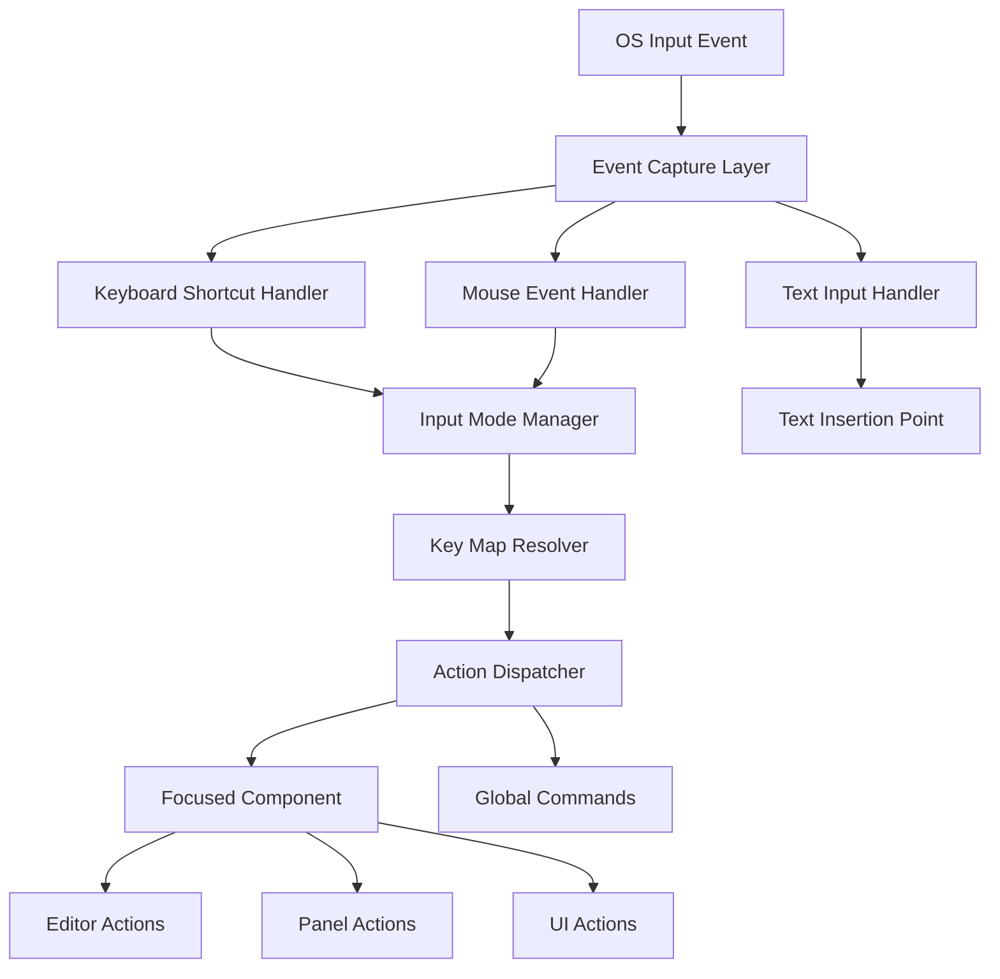

# Input Handling System

## Purpose

This document provides detailed implementation guidance for the input handling system in the Swift implementation of Zed. It covers how to process keyboard and mouse events efficiently, manage input modes, integrate with OS-level input mechanisms, and implement editor-specific input behaviors. The system ensures responsive and customizable user input handling critical for a high-performance text editor.

## Concepts

### Input Event Pipeline

The input event pipeline processes raw input events from the OS and transforms them into editor actions. This pipeline consists of several stages:

1. **Event Capture**: Intercepting raw input events from AppKit/SwiftUI
2. **Mode Filtering**: Processing events differently based on editor mode (normal, insert, visual)
3. **Keybinding Resolution**: Mapping key combinations to editor commands
4. **Command Dispatch**: Executing the resolved command
5. **Event Bubbling**: Allowing parent components to handle unprocessed events

### Input Modes

Like Vim, Zed supports different input modes that change how input events are interpreted:

1. **Normal Mode**: Key presses trigger commands (default for Vim users)
2. **Insert Mode**: Key presses insert text (default for non-Vim users)
3. **Visual Mode**: Key presses modify selections
4. **Command Mode**: Key presses are interpreted as command input

### Key Maps and Bindings

The keybinding system maps input sequences to editor actions:

1. **Key Map**: A collection of keybindings for a specific editor mode
2. **Keybinding**: A mapping from key combination to action
3. **Multi-key Sequence**: Support for key sequences like Vim's 'gg' or Emacs' 'C-x C-s'
4. **Key Timeout**: Time limit for detecting multi-key sequences

### Action Dispatch System

The action dispatch system executes actions in response to input events:

1. **Action Registry**: Central registry of all available editor actions
2. **Action Context**: Contextual information provided to actions during execution
3. **Focus Handling**: Determining which component should receive the action
4. **Action Cancellation**: Mechanism for long-running actions to be cancelled

## Architecture

The input system architecture consists of several interconnected components:



### Key Components

1. **InputEventHandler**: Captures and normalizes OS input events
2. **InputModeManager**: Manages the current editor mode
3. **KeyMapResolver**: Resolves key combinations to actions
4. **ActionDispatcher**: Dispatches actions to the appropriate component
5. **InputContext**: Provides context for input handling

## Implementation Details

### Input Event Handling

The input event handling system needs to integrate with both AppKit and SwiftUI event systems:

```swift
protocol InputEventHandler {
    func handleKeyDown(with event: NSEvent, in view: NSView) -> Bool
    func handleKeyUp(with event: NSEvent, in view: NSView) -> Bool
    func handleFlagsChanged(with event: NSEvent, in view: NSView) -> Bool
    func handleMouseDown(with event: NSEvent, in view: NSView) -> Bool
    func handleMouseUp(with event: NSEvent, in view: NSView) -> Bool
    func handleMouseMoved(with event: NSEvent, in view: NSView) -> Bool
}

class EditorInputHandler: InputEventHandler {
    private let actionDispatcher: ActionDispatcher
    private let keyMapResolver: KeyMapResolver
    private let inputModeManager: InputModeManager
    private var currentKeySequence: [KeyCombo] = []
    private var sequenceTimer: Timer?
    
    init(actionDispatcher: ActionDispatcher, 
         keyMapResolver: KeyMapResolver, 
         inputModeManager: InputModeManager) {
        self.actionDispatcher = actionDispatcher
        self.keyMapResolver = keyMapResolver
        self.inputModeManager = inputModeManager
    }
    
    func handleKeyDown(with event: NSEvent, in view: NSView) -> Bool {
        // Convert NSEvent to KeyCombo
        let keyCombo = KeyCombo(event: event)
        
        // Add to current sequence
        currentKeySequence.append(keyCombo)
        
        // Reset sequence timer
        sequenceTimer?.invalidate()
        sequenceTimer = Timer.scheduledTimer(withTimeInterval: 1.0, repeats: false) { [weak self] _ in
            self?.currentKeySequence = []
        }
        
        // Get current input mode
        let currentMode = inputModeManager.currentMode
        
        // Try to resolve action
        if let action = keyMapResolver.resolveAction(for: currentKeySequence, in: currentMode) {
            // Action found, dispatch it
            let handled = actionDispatcher.dispatch(action, context: InputContext(view: view, event: event))
            
            if handled {
                // Clear sequence after successful dispatch
                currentKeySequence = []
                return true
            }
        }
        
        // Check if the sequence is a prefix of any keybinding
        if keyMapResolver.isSequencePrefix(currentKeySequence, in: currentMode) {
            // It's a prefix, wait for more keys
            return true
        }
        
        // Not a recognized sequence, reset and let the system handle it
        currentKeySequence = []
        return false
    }
    
    // Implement other handlers...
}
```

### Key Map System

The key map system resolves key combinations to actions:

```swift
/// Represents a single key combination
struct KeyCombo: Hashable {
    let keyCode: Int
    let modifiers: NSEvent.ModifierFlags
    
    init(event: NSEvent) {
        self.keyCode = Int(event.keyCode)
        self.modifiers = event.modifierFlags.intersection(.deviceIndependentFlagsMask)
    }
    
    var description: String {
        // Return human-readable description like "Cmd+S"
        var desc = ""
        
        if modifiers.contains(.command) {
            desc += "Cmd+"
        }
        if modifiers.contains(.option) {
            desc += "Opt+"
        }
        if modifiers.contains(.control) {
            desc += "Ctrl+"
        }
        if modifiers.contains(.shift) {
            desc += "Shift+"
        }
        
        // Convert keyCode to character
        // This is simplified; a real implementation would use a proper mapping
        let char = characterForKeyCode(keyCode)
        desc += char
        
        return desc
    }
    
    private func characterForKeyCode(_ keyCode: Int) -> String {
        // Simplified mapping
        switch keyCode {
        case 0: return "a"
        case 1: return "s"
        case 2: return "d"
        // ... more mappings ...
        default: return "Unknown"
        }
    }
}

/// Represents a sequence of key combinations that maps to an action
struct KeyBinding {
    let sequence: [KeyCombo]
    let actionId: String
    let context: KeyBindingContext
    
    struct KeyBindingContext {
        let mode: InputMode
        let whenExpression: String?
    }
}

/// Manages keybindings and resolves key sequences to actions
class KeyMapResolver {
    private var keyBindings: [InputMode: [KeyBinding]] = [:]
    
    func addKeyBinding(_ binding: KeyBinding) {
        var bindingsForMode = keyBindings[binding.context.mode] ?? []
        bindingsForMode.append(binding)
        keyBindings[binding.context.mode] = bindingsForMode
    }
    
    func removeKeyBinding(_ binding: KeyBinding) {
        guard var bindingsForMode = keyBindings[binding.context.mode] else { return }
        bindingsForMode.removeAll { $0.actionId == binding.actionId }
        keyBindings[binding.context.mode] = bindingsForMode
    }
    
    func resolveAction(for sequence: [KeyCombo], in mode: InputMode) -> String? {
        guard let bindingsForMode = keyBindings[mode] else { return nil }
        
        for binding in bindingsForMode {
            if binding.sequence == sequence {
                // Evaluate 'when' expression if present
                if let whenExpression = binding.context.whenExpression {
                    if evaluateExpression(whenExpression) {
                        return binding.actionId
                    }
                } else {
                    return binding.actionId
                }
            }
        }
        
        return nil
    }
    
    func isSequencePrefix(_ sequence: [KeyCombo], in mode: InputMode) -> Bool {
        guard let bindingsForMode = keyBindings[mode] else { return false }
        
        for binding in bindingsForMode {
            if sequence.count < binding.sequence.count {
                let prefix = Array(binding.sequence.prefix(sequence.count))
                if prefix == sequence {
                    return true
                }
            }
        }
        
        return false
    }
    
    private func evaluateExpression(_ expression: String) -> Bool {
        // Simplified expression evaluation
        // A real implementation would use a proper expression evaluator
        return true
    }
}
```

### Input Mode Management

The input mode system manages the current editor mode:

```swift
enum InputMode: String {
    case normal
    case insert
    case visual
    case command
}

protocol InputModeDelegate: AnyObject {
    func inputModeDidChange(from oldMode: InputMode, to newMode: InputMode)
}

class InputModeManager {
    private(set) var currentMode: InputMode
    private weak var delegate: InputModeDelegate?
    
    init(initialMode: InputMode = .insert, delegate: InputModeDelegate? = nil) {
        self.currentMode = initialMode
        self.delegate = delegate
    }
    
    func setMode(_ mode: InputMode) {
        let oldMode = currentMode
        currentMode = mode
        delegate?.inputModeDidChange(from: oldMode, to: mode)
    }
    
    func toggleBetween(mode1: InputMode, mode2: InputMode) {
        if currentMode == mode1 {
            setMode(mode2)
        } else {
            setMode(mode1)
        }
    }
}
```

### Action Dispatch System

The action dispatch system executes actions:

```swift
struct InputContext {
    let view: NSView
    let event: NSEvent
    var userData: [String: Any] = [:]
}

protocol ActionHandler {
    func canHandle(actionId: String) -> Bool
    func handle(actionId: String, context: InputContext) -> Bool
}

class ActionDispatcher {
    private var globalHandlers: [ActionHandler] = []
    private var focusBasedHandlers: [ActionHandler] = []
    
    func registerGlobalHandler(_ handler: ActionHandler) {
        globalHandlers.append(handler)
    }
    
    func registerFocusBasedHandler(_ handler: ActionHandler) {
        focusBasedHandlers.append(handler)
    }
    
    func dispatch(_ actionId: String, context: InputContext) -> Bool {
        // First try focus-based handlers
        for handler in focusBasedHandlers {
            if handler.canHandle(actionId: actionId) {
                if handler.handle(actionId: actionId, context: context) {
                    return true
                }
            }
        }
        
        // Then try global handlers
        for handler in globalHandlers {
            if handler.canHandle(actionId: actionId) {
                if handler.handle(actionId: actionId, context: context) {
                    return true
                }
            }
        }
        
        return false
    }
}
```

### Text Input System

For direct text input when in insert mode:

```swift
class TextInputHandler: NSObject, NSTextInputClient {
    private let textBuffer: TextBuffer
    private var markedRange: NSRange?
    private var selectedRange: NSRange = NSRange(location: 0, length: 0)
    
    init(textBuffer: TextBuffer) {
        self.textBuffer = textBuffer
        super.init()
    }
    
    // MARK: - NSTextInputClient
    
    func insertText(_ string: Any, replacementRange: NSRange) {
        guard let string = string as? String else { return }
        
        let range = BufferRange(
            start: BufferPosition(offset: replacementRange.location),
            end: BufferPosition(offset: replacementRange.location + replacementRange.length)
        )
        
        textBuffer.edit(range: range, newText: string)
        
        // Update selection after insert
        selectedRange = NSRange(location: range.start.offset + string.count, length: 0)
    }
    
    func setMarkedText(_ string: Any, selectedRange: NSRange, replacementRange: NSRange) {
        guard let string = string as? String else { return }
        
        let range = replacementRange.length > 0 
            ? replacementRange 
            : markedRange ?? NSRange(location: selectedRange.location, length: 0)
        
        let bufferRange = BufferRange(
            start: BufferPosition(offset: range.location),
            end: BufferPosition(offset: range.location + range.length)
        )
        
        textBuffer.edit(range: bufferRange, newText: string)
        
        if string.isEmpty {
            markedRange = nil
        } else {
            markedRange = NSRange(location: range.location, length: string.count)
        }
        
        self.selectedRange = NSRange(
            location: range.location + selectedRange.location,
            length: selectedRange.length
        )
    }
    
    func unmarkText() {
        markedRange = nil
    }
    
    func selectedRange() -> NSRange {
        return selectedRange
    }
    
    func markedRange() -> NSRange {
        return markedRange ?? NSRange(location: NSNotFound, length: 0)
    }
    
    func hasMarkedText() -> Bool {
        return markedRange != nil
    }
    
    func attributedSubstring(forProposedRange range: NSRange, actualRange: NSRangePointer?) -> NSAttributedString? {
        let bufferRange = BufferRange(
            start: BufferPosition(offset: range.location),
            end: BufferPosition(offset: range.location + range.length)
        )
        
        let substring = textBuffer.substring(in: bufferRange)
        return NSAttributedString(string: substring)
    }
    
    func validAttributesForMarkedText() -> [NSAttributedString.Key] {
        return [.underlineStyle, .foregroundColor]
    }
    
    func firstRect(forCharacterRange range: NSRange, actualRange: NSRangePointer?) -> NSRect {
        // This would be implemented by the view to convert buffer positions to screen coordinates
        return .zero
    }
    
    func characterIndex(for point: NSPoint) -> Int {
        // This would be implemented by the view to convert screen coordinates to buffer positions
        return 0
    }
}
```

### Editor Integration

The editor view controller needs to integrate with the input system:

```swift
class EditorViewController: NSViewController, InputModeDelegate {
    private let textBuffer: TextBuffer
    private var textView: EditorTextView!
    private let inputHandler: EditorInputHandler
    private let inputModeManager: InputModeManager
    private let actionDispatcher: ActionDispatcher
    private let keyMapResolver: KeyMapResolver
    
    init(textBuffer: TextBuffer) {
        self.textBuffer = textBuffer
        
        // Initialize input system
        self.actionDispatcher = ActionDispatcher()
        self.keyMapResolver = KeyMapResolver()
        self.inputModeManager = InputModeManager(initialMode: .insert)
        self.inputHandler = EditorInputHandler(
            actionDispatcher: actionDispatcher,
            keyMapResolver: keyMapResolver,
            inputModeManager: inputModeManager
        )
        
        super.init(nibName: nil, bundle: nil)
        
        inputModeManager.delegate = self
        
        // Register editor actions
        registerEditorActions()
        setupDefaultKeyBindings()
    }
    
    // MARK: - Action Registration
    
    private func registerEditorActions() {
        let editorActionHandler = EditorActionHandler(textBuffer: textBuffer)
        actionDispatcher.registerFocusBasedHandler(editorActionHandler)
    }
    
    private func setupDefaultKeyBindings() {
        // Insert mode bindings
        keyMapResolver.addKeyBinding(KeyBinding(
            sequence: [KeyCombo(keyCode: 36, modifiers: [])], // Return key
            actionId: "editor.newline",
            context: KeyBinding.KeyBindingContext(mode: .insert, whenExpression: nil)
        ))
        
        // Normal mode bindings
        keyMapResolver.addKeyBinding(KeyBinding(
            sequence: [KeyCombo(keyCode: 0, modifiers: [])], // 'a' key
            actionId: "editor.append",
            context: KeyBinding.KeyBindingContext(mode: .normal, whenExpression: nil)
        ))
        
        // Common bindings (work in all modes)
        keyMapResolver.addKeyBinding(KeyBinding(
            sequence: [KeyCombo(keyCode: 1, modifiers: [.command])], // Cmd+S
            actionId: "editor.save",
            context: KeyBinding.KeyBindingContext(mode: .insert, whenExpression: nil)
        ))
    }
    
    // MARK: - InputModeDelegate
    
    func inputModeDidChange(from oldMode: InputMode, to newMode: InputMode) {
        // Update UI to reflect mode change
        updateCursor(for: newMode)
        updateStatusBar(with: newMode)
    }
    
    private func updateCursor(for mode: InputMode) {
        switch mode {
        case .normal:
            textView.showBlockCursor()
        case .insert:
            textView.showIBeamCursor()
        case .visual:
            textView.showIBeamCursor()
        case .command:
            textView.showIBeamCursor()
        }
    }
    
    private func updateStatusBar(with mode: InputMode) {
        // Update status bar to show current mode
        let modeText: String
        switch mode {
        case .normal: modeText = "NORMAL"
        case .insert: modeText = "INSERT"
        case .visual: modeText = "VISUAL"
        case .command: modeText = "COMMAND"
        }
        
        // Update status bar
    }
}
```

### Event Flow in the Editor Hierarchy

To properly handle focus and event bubbling in a complex editor interface:

```swift
protocol FocusableView: AnyObject {
    var isFocused: Bool { get }
    func focus()
    func blur()
    var superview: FocusableView? { get }
    var focusableSubviews: [FocusableView] { get }
    func handleAction(_ actionId: String, context: InputContext) -> Bool
}

class FocusManager {
    private(set) weak var currentFocus: FocusableView?
    private let rootView: FocusableView
    
    init(rootView: FocusableView) {
        self.rootView = rootView
    }
    
    func setFocus(to view: FocusableView) {
        currentFocus?.blur()
        view.focus()
        currentFocus = view
    }
    
    func handleAction(_ actionId: String, context: InputContext) -> Bool {
        // Try currently focused view first
        if let focused = currentFocus {
            if focused.handleAction(actionId, context: context) {
                return true
            }
            
            // Bubble up through ancestors
            var current: FocusableView? = focused.superview
            while let ancestor = current {
                if ancestor.handleAction(actionId, context: context) {
                    return true
                }
                current = ancestor.superview
            }
        }
        
        // Try root as last resort
        return rootView.handleAction(actionId, context: context)
    }
    
    func focusNext() {
        guard let current = currentFocus else {
            // Focus first focusable view
            if let first = findFirstFocusable(in: rootView) {
                setFocus(to: first)
            }
            return
        }
        
        // Find next focusable view
        if let next = findNextFocusable(after: current) {
            setFocus(to: next)
        }
    }
    
    func focusPrevious() {
        guard let current = currentFocus else {
            // Focus last focusable view
            if let last = findLastFocusable(in: rootView) {
                setFocus(to: last)
            }
            return
        }
        
        // Find previous focusable view
        if let previous = findPreviousFocusable(before: current) {
            setFocus(to: previous)
        }
    }
    
    private func findFirstFocusable(in view: FocusableView) -> FocusableView? {
        for subview in view.focusableSubviews {
            if let first = findFirstFocusable(in: subview) {
                return first
            }
        }
        return view
    }
    
    private func findLastFocusable(in view: FocusableView) -> FocusableView? {
        // Reverse iterate through subviews
        for subview in view.focusableSubviews.reversed() {
            if let last = findLastFocusable(in: subview) {
                return last
            }
        }
        return view
    }
    
    private func findNextFocusable(after view: FocusableView) -> FocusableView? {
        // Implementation would traverse the view hierarchy to find the next focusable view
        // This is a placeholder
        return nil
    }
    
    private func findPreviousFocusable(before view: FocusableView) -> FocusableView? {
        // Implementation would traverse the view hierarchy to find the previous focusable view
        // This is a placeholder
        return nil
    }
}
```

## Swift Reimplementation Considerations

### AppKit Integration

1. **Raw Event Processing**:
   - NSResponder chain provides events but requires careful management
   - Use the responder chain while avoiding the performance overhead of forwarding events

```swift
// Extending AppKit NSView to handle events better
extension EditorTextView {
    override func keyDown(with event: NSEvent) {
        if !inputHandler.handleKeyDown(with: event, in: self) {
            super.keyDown(with: event)
        }
    }
    
    override func keyUp(with event: NSEvent) {
        if !inputHandler.handleKeyUp(with: event, in: self) {
            super.keyUp(with: event)
        }
    }
    
    override func flagsChanged(with event: NSEvent) {
        if !inputHandler.handleFlagsChanged(with: event, in: self) {
            super.flagsChanged(with: event)
        }
    }
}
```

2. **Text Input Client**:
   - Implement NSTextInputClient for proper IME support
   - Ensure proper Unicode handling across languages

3. **Focus Management**:
   - Implement first responder handling
   - Integrate with the FocusManager

### SwiftUI Integration

1. **Event Bridging**:
   - Use NSViewRepresentable to bridge AppKit and SwiftUI events

```swift
struct EditorView: NSViewControllerRepresentable {
    @Binding var textBuffer: TextBuffer
    
    func makeNSViewController(context: Context) -> EditorViewController {
        return EditorViewController(textBuffer: textBuffer)
    }
    
    func updateNSViewController(_ viewController: EditorViewController, context: Context) {
        // Update controller when needed
    }
}
```

2. **Focus Integration**:
   - Use FocusState for managing SwiftUI focus states

```swift
struct EditorContainer: View {
    @FocusState private var editorFocused: Bool
    let textBuffer: TextBuffer
    
    var body: some View {
        EditorView(textBuffer: textBuffer)
            .focused($editorFocused)
            .onAppear {
                editorFocused = true
            }
    }
}
```

### Platform-Specific Considerations

1. **Keyboard Layout Handling**:
   - Support international keyboard layouts
   - Properly handle dead keys and IME composition

2. **Accessibility Support**:
   - Ensure proper VoiceOver integration
   - Implement accessible keyboard navigation

3. **Touch Bar / Command Palette Integration**:
   - Expose key commands to Touch Bar and Command Palette
   - Dynamically update available commands based on context

## Performance Considerations

1. **Event Throttling**:
   - Prevent excessive event processing during rapid input
   - Implement debouncing for expensive operations

```swift
class InputThrottler {
    private var lastEventTime: TimeInterval = 0
    private let minimumInterval: TimeInterval
    
    init(minimumInterval: TimeInterval = 0.01) {
        self.minimumInterval = minimumInterval
    }
    
    func shouldProcessEvent() -> Bool {
        let currentTime = Date().timeIntervalSince1970
        let timeSinceLastEvent = currentTime - lastEventTime
        
        if timeSinceLastEvent >= minimumInterval {
            lastEventTime = currentTime
            return true
        }
        
        return false
    }
}
```

2. **Key Sequence Optimization**:
   - Use efficient data structures for key sequence matching
   - Implement trie-based matching for multi-key sequences

```swift
class KeyBindingTrie {
    private class Node {
        var actionId: String?
        var children: [KeyCombo: Node] = [:]
    }
    
    private let root = Node()
    
    func add(sequence: [KeyCombo], actionId: String) {
        var current = root
        
        for combo in sequence {
            if current.children[combo] == nil {
                current.children[combo] = Node()
            }
            current = current.children[combo]!
        }
        
        current.actionId = actionId
    }
    
    func find(sequence: [KeyCombo]) -> String? {
        var current = root
        
        for combo in sequence {
            guard let next = current.children[combo] else {
                return nil
            }
            current = next
        }
        
        return current.actionId
    }
    
    func isPrefix(sequence: [KeyCombo]) -> Bool {
        var current = root
        
        for combo in sequence {
            guard let next = current.children[combo] else {
                return false
            }
            current = next
        }
        
        return !current.children.isEmpty
    }
}
```

3. **Event Batching**:
   - Batch related input events to reduce processing overhead
   - Coalesce multiple key repeat events

## Practical Implementation Steps

1. **Basic Event Handling**:
   - Implement NSResponder chain integration
   - Create basic KeyCombo struct
   - Implement simple action dispatch

2. **Key Binding System**:
   - Implement KeyBinding and KeyMapResolver
   - Support for keybinding loading from JSON

3. **Input Mode System**:
   - Implement InputModeManager
   - Add visual indicators for current mode

4. **Text Input**:
   - Implement NSTextInputClient
   - Support for IME composition

5. **Focus System**:
   - Implement FocusManager
   - Add keyboard navigation between components

6. **Multi-key Sequences**:
   - Implement sequence timer
   - Add trie-based matching

7. **Action System Refinement**:
   - Add context-aware action handling
   - Implement action cancellation

## References

This design connects to the following architecture documents:

- [11_StratosphericView_CommandSystem.md](/docs/MissionCabbage/11_StratosphericView_CommandSystem.md) - Command architecture
- [37_GroundLevel_EventHandling.md](/docs/MissionCabbage/37_GroundLevel_EventHandling.md) - Event handling overview 
- [42_Swift_ReactiveUI.md](/docs/MissionCabbage/42_Swift_ReactiveUI.md) - UI framework integration
- [46_GroundLevel_NextActionPrediction.md](/docs/MissionCabbage/46_GroundLevel_NextActionPrediction.md) - Predictive input

## Conclusion

The input handling system is critical for editor responsiveness and user experience. This implementation provides a flexible, extensible, and performant foundation for handling keyboard input, mouse events, and text composition. By leveraging Swift's type system and AppKit/SwiftUI integration, we can create an editor that feels native while supporting advanced features like vim modes and complex key bindings.

The architecture balances simplicity with flexibility, allowing for easy extension as new input methods and editor capabilities are developed. Particular attention has been paid to performance considerations to ensure that input handling doesn't become a bottleneck in the editor's operation.