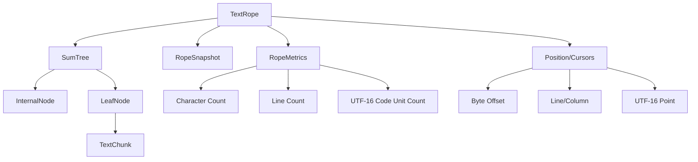

# Rope Implementation for Swift

## Purpose

This document provides detailed implementation guidance for creating a performant, memory-efficient rope data structure in Swift for text processing in Zed. Rope data structures are critical for text editors that handle large documents efficiently, allowing for quick insertions, deletions, and navigation without copying the entire text buffer. This implementation focuses on Swift-specific optimizations, memory management, and performance considerations, while maintaining compatibility with the rest of the editor architecture.

## Concepts

### Rope Fundamentals

A rope is a specialized data structure for representing text, designed to efficiently handle large strings and common text editing operations:

1. **Tree Structure**: Text is stored in a balanced tree where leaf nodes contain text chunks and internal nodes store metadata
2. **Immutability**: Nodes are typically immutable to simplify concurrent access and enable efficient snapshots
3. **Lazy Operations**: Many operations can be performed lazily, deferring actual text manipulation
4. **Efficient Splitting/Joining**: Operations like insertion and deletion primarily involve tree manipulation rather than copying text

### SumTree Implementation

Zed's Rust implementation uses a specialized B-tree variant called a SumTree, where each node contains summary information about its subtree. This allows for efficient queries and operations:

1. **Summary Information**: Each node contains metadata such as character counts, line counts, and UTF-16 code unit counts
2. **B-tree Structure**: Maintains balance and guarantees O(log n) operations
3. **Chunk Optimization**: Text is stored in small chunks for memory locality and efficient operations

### Coordinate Systems

The rope implementation must handle multiple coordinate systems:

1. **Byte Offsets**: Raw offsets in the underlying UTF-8 encoding
2. **Character Offsets**: Logical character positions, accounting for multi-byte UTF-8 characters
3. **Line/Column Positions**: Human-readable positions for display and navigation
4. **UTF-16 Offsets**: For compatibility with external systems like language servers

## Architecture

The Swift rope implementation consists of several key components:



### Key Components

1. **TextRope**: The main interface for text operations
2. **SumTree**: The balanced tree that forms the backbone of the rope
3. **TextChunk**: The leaf nodes containing actual text data
4. **RopeMetrics**: Summary information about the rope
5. **Position Types**: Types representing positions within the text

## Implementation Details

### Chunk Implementation

The chunk is the fundamental unit of text storage:

```swift
/// Maximum size of a single text chunk
private let MAX_CHUNK_SIZE = 64

/// A single chunk of text in the rope
struct TextChunk {
    /// The actual text content
    let text: String
    
    /// Character boundary bitmap (utf8 code units that start characters)
    let characterBoundaries: UInt64
    
    /// Line boundary bitmap (newline positions)
    let lineBoundaries: UInt64
    
    /// Character count in the chunk
    let characterCount: Int
    
    /// Line count in the chunk (number of newlines)
    let lineCount: Int
    
    /// UTF-16 code unit count
    let utf16Count: Int
    
    init(text: String) {
        precondition(text.utf8.count <= MAX_CHUNK_SIZE, "Chunk text too large")
        self.text = text
        
        var characterBoundaries: UInt64 = 0
        var lineBoundaries: UInt64 = 0
        var characterCount = 0
        var lineCount = 0
        var utf16Count = 0
        
        // Process the string to build our bitmaps and counts
        var byteIndex = 0
        for char in text.utf8 {
            // Mark character boundaries (start of utf-8 sequence)
            if (char & 0xC0) != 0x80 {
                characterBoundaries |= (1 << byteIndex)
                characterCount += 1
            }
            
            // Mark newlines
            if char == 0x0A { // '\n'
                lineBoundaries |= (1 << byteIndex)
                lineCount += 1
            }
            
            byteIndex += 1
        }
        
        // Count UTF-16 code units
        utf16Count = text.utf16.count
        
        self.characterBoundaries = characterBoundaries
        self.lineBoundaries = lineBoundaries
        self.characterCount = characterCount
        self.lineCount = lineCount
        self.utf16Count = utf16Count
    }
    
    /// Calculate the offset of the nth character in this chunk
    func offsetOfCharacter(at index: Int) -> Int? {
        guard index >= 0 && index <= characterCount else { return nil }
        if index == 0 { return 0 }
        if index == characterCount { return text.utf8.count }
        
        var count = 0
        for i in 0..<text.utf8.count {
            if (characterBoundaries & (1 << i)) != 0 {
                count += 1
                if count == index {
                    return i
                }
            }
        }
        
        return nil
    }
    
    /// Calculate the character index at the given byte offset
    func characterAt(byteOffset: Int) -> Int {
        guard byteOffset >= 0 && byteOffset <= text.utf8.count else {
            fatalError("Byte offset out of bounds")
        }
        
        var count = 0
        for i in 0..<byteOffset {
            if (characterBoundaries & (1 << i)) != 0 {
                count += 1
            }
        }
        
        return count
    }
    
    /// Calculate the line and column at the given byte offset
    func lineAndColumn(at byteOffset: Int) -> (line: Int, column: Int) {
        guard byteOffset >= 0 && byteOffset <= text.utf8.count else {
            fatalError("Byte offset out of bounds")
        }
        
        var line = 0
        var lastNewline = -1
        
        // Find the line by counting newlines before the offset
        for i in 0..<byteOffset {
            if (lineBoundaries & (1 << i)) != 0 {
                line += 1
                lastNewline = i
            }
        }
        
        // Calculate column by counting character boundaries
        var column = 0
        for i in (lastNewline + 1)..<byteOffset {
            if (characterBoundaries & (1 << i)) != 0 {
                column += 1
            }
        }
        
        return (line, column)
    }
    
    /// Split this chunk at the given byte offset
    func split(at offset: Int) -> (TextChunk, TextChunk) {
        guard offset > 0 && offset < text.utf8.count else {
            fatalError("Invalid split point")
        }
        
        let index = text.utf8.index(text.utf8.startIndex, offsetBy: offset)
        let leftText = String(text.utf8[..<index])
        let rightText = String(text.utf8[index...])
        
        return (TextChunk(text: leftText), TextChunk(text: rightText))
    }
}
```

### SumTree Node Implementation

The SumTree is a B-tree with summary information at each node:

```swift
/// Summary information for a subtree
struct RopeSummary {
    let byteCount: Int
    let characterCount: Int
    let lineCount: Int
    let utf16Count: Int
    
    static let zero = RopeSummary(byteCount: 0, characterCount: 0, lineCount: 0, utf16Count: 0)
    
    static func + (lhs: RopeSummary, rhs: RopeSummary) -> RopeSummary {
        return RopeSummary(
            byteCount: lhs.byteCount + rhs.byteCount,
            characterCount: lhs.characterCount + rhs.characterCount,
            lineCount: lhs.lineCount + rhs.lineCount,
            utf16Count: lhs.utf16Count + rhs.utf16Count
        )
    }
}

/// A node in the SumTree - either internal or leaf
enum RopeNode {
    case internal(InternalNode)
    case leaf(TextChunk)
    
    var summary: RopeSummary {
        switch self {
        case .internal(let node):
            return node.summary
        case .leaf(let chunk):
            return RopeSummary(
                byteCount: chunk.text.utf8.count,
                characterCount: chunk.characterCount,
                lineCount: chunk.lineCount,
                utf16Count: chunk.utf16Count
            )
        }
    }
}

/// An internal node in the SumTree
class InternalNode {
    /// Children of this node
    let children: [RopeNode]
    
    /// Summary information for this subtree
    let summary: RopeSummary
    
    /// Cumulative summaries for efficient binary search
    private let cumulativeSummaries: [RopeSummary]
    
    init(children: [RopeNode]) {
        precondition(!children.isEmpty, "Internal node must have at least one child")
        self.children = children
        
        // Calculate cumulative summaries for efficient searching
        var cumulativeSummaries: [RopeSummary] = []
        var currentSummary = RopeSummary.zero
        
        for child in children {
            currentSummary = currentSummary + child.summary
            cumulativeSummaries.append(currentSummary)
        }
        
        self.cumulativeSummaries = cumulativeSummaries
        self.summary = currentSummary
    }
    
    /// Find the child containing the given byte offset
    func findChildForByteOffset(_ offset: Int) -> (childIndex: Int, relativeOffset: Int) {
        precondition(offset >= 0 && offset <= summary.byteCount, "Offset out of bounds")
        
        if offset == summary.byteCount {
            // The end of the last child
            return (children.count - 1, children.last!.summary.byteCount)
        }
        
        // Binary search to find the child
        var low = 0
        var high = cumulativeSummaries.count - 1
        
        while low <= high {
            let mid = (low + high) / 2
            let midOffset = mid > 0 ? cumulativeSummaries[mid - 1].byteCount : 0
            let midEndOffset = cumulativeSummaries[mid].byteCount
            
            if offset < midOffset {
                high = mid - 1
            } else if offset >= midEndOffset {
                low = mid + 1
            } else {
                // Found the child
                let relativeOffset = offset - midOffset
                return (mid, relativeOffset)
            }
        }
        
        fatalError("Failed to find child for offset \(offset)")
    }
    
    /// Find the child containing the given character index
    func findChildForCharacter(_ charIndex: Int) -> (childIndex: Int, relativeCharIndex: Int) {
        precondition(charIndex >= 0 && charIndex <= summary.characterCount, "Character index out of bounds")
        
        if charIndex == summary.characterCount {
            // The end of the last child
            return (children.count - 1, children.last!.summary.characterCount)
        }
        
        // Binary search to find the child
        var low = 0
        var high = cumulativeSummaries.count - 1
        
        while low <= high {
            let mid = (low + high) / 2
            let midIndex = mid > 0 ? cumulativeSummaries[mid - 1].characterCount : 0
            let midEndIndex = cumulativeSummaries[mid].characterCount
            
            if charIndex < midIndex {
                high = mid - 1
            } else if charIndex >= midEndIndex {
                low = mid + 1
            } else {
                // Found the child
                let relativeIndex = charIndex - midIndex
                return (mid, relativeIndex)
            }
        }
        
        fatalError("Failed to find child for character index \(charIndex)")
    }
    
    /// Find the child containing the given line
    func findChildForLine(_ line: Int) -> (childIndex: Int, relativeLine: Int) {
        precondition(line >= 0 && line <= summary.lineCount, "Line out of bounds")
        
        if line == summary.lineCount {
            // The end of the last child
            return (children.count - 1, children.last!.summary.lineCount)
        }
        
        // Binary search to find the child
        var low = 0
        var high = cumulativeSummaries.count - 1
        
        while low <= high {
            let mid = (low + high) / 2
            let midLine = mid > 0 ? cumulativeSummaries[mid - 1].lineCount : 0
            let midEndLine = cumulativeSummaries[mid].lineCount
            
            if line < midLine {
                high = mid - 1
            } else if line >= midEndLine {
                low = mid + 1
            } else {
                // Found the child
                let relativeLine = line - midLine
                return (mid, relativeLine)
            }
        }
        
        fatalError("Failed to find child for line \(line)")
    }
}
```

### SumTree Implementation

The SumTree provides the core tree structure:

```swift
/// Maximum number of children in an internal node
private let MAX_CHILDREN = 16
/// Minimum number of children in an internal node (except the root)
private let MIN_CHILDREN = 8

/// B-tree implementation with summary information
class SumTree {
    /// The root node of the tree
    private var root: RopeNode
    
    /// Summary information for the entire tree
    var summary: RopeSummary {
        return root.summary
    }
    
    init(chunk: TextChunk) {
        self.root = .leaf(chunk)
    }
    
    /// Initialize with multiple chunks
    init(chunks: [TextChunk]) {
        if chunks.isEmpty {
            self.root = .leaf(TextChunk(text: ""))
            return
        }
        
        if chunks.count == 1 {
            self.root = .leaf(chunks[0])
            return
        }
        
        // Build a balanced tree from the chunks
        self.root = Self.buildTree(from: chunks.map { .leaf($0) })
    }
    
    /// Build a balanced tree from nodes
    private static func buildTree(from nodes: [RopeNode]) -> RopeNode {
        if nodes.count <= MAX_CHILDREN {
            return .internal(InternalNode(children: nodes))
        }
        
        // Split the nodes into MAX_CHILDREN groups
        let groupSize = (nodes.count + MAX_CHILDREN - 1) / MAX_CHILDREN
        var groups: [RopeNode] = []
        
        for i in stride(from: 0, to: nodes.count, by: groupSize) {
            let end = min(i + groupSize, nodes.count)
            let group = Array(nodes[i..<end])
            
            if group.count == 1 {
                groups.append(group[0])
            } else {
                groups.append(.internal(InternalNode(children: group)))
            }
        }
        
        // Recursively build the tree
        return buildTree(from: groups)
    }
    
    /// Get the chunk at the given byte offset
    func chunkAt(byteOffset: Int) -> (chunk: TextChunk, offset: Int) {
        var node = root
        var offset = byteOffset
        
        while case .internal(let internalNode) = node {
            let (childIndex, relativeOffset) = internalNode.findChildForByteOffset(offset)
            node = internalNode.children[childIndex]
            offset = relativeOffset
        }
        
        if case .leaf(let chunk) = node {
            return (chunk, offset)
        }
        
        fatalError("Expected to find a leaf node")
    }
    
    /// Get the chunk at the given character index
    func chunkAt(characterIndex: Int) -> (chunk: TextChunk, offset: Int, byteOffset: Int) {
        var node = root
        var charIndex = characterIndex
        var byteOffset = 0
        
        while case .internal(let internalNode) = node {
            let (childIndex, relativeCharIndex) = internalNode.findChildForCharacter(charIndex)
            
            // Calculate byte offset to the start of this child
            if childIndex > 0 {
                for i in 0..<childIndex {
                    byteOffset += internalNode.children[i].summary.byteCount
                }
            }
            
            node = internalNode.children[childIndex]
            charIndex = relativeCharIndex
        }
        
        if case .leaf(let chunk) = node {
            // Now find the byte offset within the chunk for this character
            let withinChunkByteOffset = chunk.offsetOfCharacter(at: charIndex) ?? 0
            return (chunk, charIndex, byteOffset + withinChunkByteOffset)
        }
        
        fatalError("Expected to find a leaf node")
    }
    
    /// Insert text at the given byte offset
    func insert(text: String, at byteOffset: Int) -> SumTree {
        guard !text.isEmpty else {
            return self
        }
        
        // Find the chunk at the offset
        let (chunk, chunkOffset) = chunkAt(byteOffset: byteOffset)
        
        // Split the chunk
        let (left, right) = chunk.split(at: chunkOffset)
        
        // Create a new chunk for the inserted text
        let middle = TextChunk(text: text)
        
        // Merge into a new rope
        // This is a simplified version - a real implementation would need to rebalance the tree
        let newChunks = [left, middle, right]
        return SumTree(chunks: newChunks)
    }
    
    /// Delete text in the given range
    func delete(range: Range<Int>) -> SumTree {
        // Implementation would find the chunks spanning the range and merge
        // This is a placeholder for the actual implementation
        return self
    }
    
    /// Convert a byte offset to a character index
    func characterIndexAt(byteOffset: Int) -> Int {
        var node = root
        var offset = byteOffset
        var charIndex = 0
        
        while case .internal(let internalNode) = node {
            let (childIndex, relativeOffset) = internalNode.findChildForByteOffset(offset)
            
            // Add character counts from previous children
            if childIndex > 0 {
                for i in 0..<childIndex {
                    charIndex += internalNode.children[i].summary.characterCount
                }
            }
            
            node = internalNode.children[childIndex]
            offset = relativeOffset
        }
        
        if case .leaf(let chunk) = node {
            return charIndex + chunk.characterAt(byteOffset: offset)
        }
        
        fatalError("Expected to find a leaf node")
    }
    
    /// Convert a character index to a byte offset
    func byteOffsetAt(characterIndex: Int) -> Int {
        let (_, _, byteOffset) = chunkAt(characterIndex: characterIndex)
        return byteOffset
    }
    
    /// Convert a byte offset to a line and column
    func lineAndColumnAt(byteOffset: Int) -> (line: Int, column: Int) {
        let (chunk, offset) = chunkAt(byteOffset: byteOffset)
        let (relativeLine, column) = chunk.lineAndColumn(at: offset)
        
        // Calculate the absolute line by counting lines in all chunks before this one
        var absoluteLine = 0
        var node = root
        var remainingOffset = byteOffset
        
        while case .internal(let internalNode) = node {
            let (childIndex, relativeOffset) = internalNode.findChildForByteOffset(remainingOffset)
            
            // Add line counts from previous children
            if childIndex > 0 {
                for i in 0..<childIndex {
                    absoluteLine += internalNode.children[i].summary.lineCount
                }
            }
            
            node = internalNode.children[childIndex]
            remainingOffset = relativeOffset
        }
        
        return (absoluteLine + relativeLine, column)
    }
}
```

### Rope Interface

The main rope interface used by the text buffer:

```swift
/// Position in a text document
public struct TextPosition: Equatable, Comparable {
    public let line: Int
    public let column: Int
    
    public init(line: Int, column: Int) {
        self.line = line
        self.column = column
    }
    
    public static func < (lhs: TextPosition, rhs: TextPosition) -> Bool {
        if lhs.line != rhs.line {
            return lhs.line < rhs.line
        }
        return lhs.column < rhs.column
    }
}

/// A rope data structure for efficient text handling
public class TextRope {
    /// The underlying SumTree
    private var sumTree: SumTree
    
    /// Get the total length of the rope in bytes
    public var length: Int {
        return sumTree.summary.byteCount
    }
    
    /// Get the total number of characters in the rope
    public var characterCount: Int {
        return sumTree.summary.characterCount
    }
    
    /// Get the total number of lines in the rope
    public var lineCount: Int {
        return sumTree.summary.lineCount + 1 // +1 because line count is the number of newlines
    }
    
    /// Create an empty rope
    public init() {
        self.sumTree = SumTree(chunk: TextChunk(text: ""))
    }
    
    /// Create a rope from a string
    public init(string: String) {
        if string.isEmpty {
            self.sumTree = SumTree(chunk: TextChunk(text: ""))
            return
        }
        
        // Split the string into chunks of appropriate size
        var chunks: [TextChunk] = []
        let chunkSize = MAX_CHUNK_SIZE
        
        var currentPosition = string.startIndex
        while currentPosition < string.endIndex {
            let endPosition = string.index(currentPosition, offsetBy: chunkSize, limitedBy: string.endIndex) ?? string.endIndex
            let chunkText = String(string[currentPosition..<endPosition])
            chunks.append(TextChunk(text: chunkText))
            currentPosition = endPosition
        }
        
        self.sumTree = SumTree(chunks: chunks)
    }
    
    /// Get the entire string
    public var string: String {
        return substring(in: 0..<length)
    }
    
    /// Get a substring from the rope
    public func substring(in range: Range<Int>) -> String {
        guard !range.isEmpty else { return "" }
        guard range.lowerBound >= 0 && range.upperBound <= length else {
            fatalError("Range out of bounds: \(range) (length: \(length))")
        }
        
        // For simplicity in this implementation, we'll just extract chunks covering the range
        // A more efficient implementation would build the string directly from the chunks
        
        var result = ""
        var position = range.lowerBound
        
        while position < range.upperBound {
            let (chunk, offset) = sumTree.chunkAt(byteOffset: position)
            let chunkLength = chunk.text.utf8.count - offset
            let bytesToCopy = min(chunkLength, range.upperBound - position)
            
            let startIndex = chunk.text.utf8.index(chunk.text.utf8.startIndex, offsetBy: offset)
            let endIndex = chunk.text.utf8.index(startIndex, offsetBy: bytesToCopy)
            
            result += String(chunk.text.utf8[startIndex..<endIndex])
            position += bytesToCopy
        }
        
        return result
    }
    
    /// Insert text at a specific byte offset
    public func insert(_ text: String, at offset: Int) {
        guard offset >= 0 && offset <= length else {
            fatalError("Offset out of bounds: \(offset) (length: \(length))")
        }
        
        sumTree = sumTree.insert(text: text, at: offset)
    }
    
    /// Delete text in a specific range
    public func delete(in range: Range<Int>) {
        guard range.lowerBound >= 0 && range.upperBound <= length else {
            fatalError("Range out of bounds: \(range) (length: \(length))")
        }
        
        sumTree = sumTree.delete(range: range)
    }
    
    /// Replace text in a specific range
    public func replace(in range: Range<Int>, with text: String) {
        delete(in: range)
        insert(text, at: range.lowerBound)
    }
    
    /// Convert a byte offset to a position (line, column)
    public func position(forOffset offset: Int) -> TextPosition {
        guard offset >= 0 && offset <= length else {
            fatalError("Offset out of bounds: \(offset) (length: \(length))")
        }
        
        let (line, column) = sumTree.lineAndColumnAt(byteOffset: offset)
        return TextPosition(line: line, column: column)
    }
    
    /// Convert a position (line, column) to a byte offset
    public func offset(forPosition position: TextPosition) -> Int {
        guard position.line >= 0 && position.line < lineCount else {
            fatalError("Line out of bounds: \(position.line) (lineCount: \(lineCount))")
        }
        
        // Find the offset of the start of the line
        var lineStartOffset = 0
        var currentLine = 0
        
        // Simplified implementation - in a real system we'd use the tree structure
        // to efficiently find the line start
        let text = string // This is inefficient - just for demonstration
        var index = text.startIndex
        
        while index < text.endIndex && currentLine < position.line {
            if text[index] == "\n" {
                currentLine += 1
            }
            index = text.index(after: index)
            lineStartOffset += 1
        }
        
        // Now find the column
        var columnOffset = 0
        var currentColumn = 0
        
        while index < text.endIndex && currentColumn < position.column {
            if text[index] == "\n" {
                break
            }
            index = text.index(after: index)
            columnOffset += 1
            currentColumn += 1
        }
        
        return lineStartOffset + columnOffset
    }
    
    /// Create a snapshot of the rope
    public func snapshot() -> TextRopeSnapshot {
        return TextRopeSnapshot(rope: self)
    }
}

/// An immutable snapshot of a rope
public class TextRopeSnapshot {
    private let rope: TextRope
    
    fileprivate init(rope: TextRope) {
        self.rope = rope
    }
    
    /// Get the entire string
    public var string: String {
        return rope.string
    }
    
    /// Get a substring from the rope
    public func substring(in range: Range<Int>) -> String {
        return rope.substring(in: range)
    }
    
    /// Convert a byte offset to a position (line, column)
    public func position(forOffset offset: Int) -> TextPosition {
        return rope.position(forOffset: offset)
    }
    
    /// Convert a position (line, column) to a byte offset
    public func offset(forPosition position: TextPosition) -> Int {
        return rope.offset(forPosition: position)
    }
}
```

### Text Buffer Integration

The TextRope integrates with the TextBuffer class:

```swift
public class TextBuffer {
    private var rope: TextRope
    private var editHistory: [BufferEdit] = []
    private var nextTimestamp: UInt64 = 1
    private var observers: [UUID: BufferObserver] = [:]
    
    public init(text: String = "") {
        self.rope = TextRope(string: text)
    }
    
    /// Get the buffer text
    public var text: String {
        return rope.string
    }
    
    /// Get the buffer length
    public var length: Int {
        return rope.length
    }
    
    /// Get a substring from the buffer
    public func substring(in range: BufferRange) -> String {
        let start = max(0, range.start.offset)
        let end = min(length, range.end.offset)
        
        if start >= end {
            return ""
        }
        
        return rope.substring(in: start..<end)
    }
    
    /// Get the position for a buffer offset
    public func position(forOffset offset: Int) -> TextPosition {
        return rope.position(forOffset: offset)
    }
    
    /// Get the offset for a buffer position
    public func offset(forPosition position: TextPosition) -> Int {
        return rope.offset(forPosition: position)
    }
    
    /// Perform a buffer edit
    @discardableResult
    public func edit(range: BufferRange, newText: String) -> BufferEdit {
        let timestamp = nextTimestamp
        nextTimestamp += 1
        
        let edit = BufferEdit(range: range, newText: newText, timestamp: timestamp)
        
        // Apply the edit to the rope
        rope.replace(in: range.start.offset..<range.end.offset, with: newText)
        
        // Store the edit in history
        editHistory.append(edit)
        
        // Notify observers
        notifyObservers(about: edit)
        
        return edit
    }
    
    /// Create a snapshot of the buffer
    public func snapshot() -> BufferSnapshot {
        return BufferSnapshot(ropeSnapshot: rope.snapshot())
    }
    
    // Observer methods as before...
}

/// An immutable snapshot of a buffer
public class BufferSnapshot {
    private let ropeSnapshot: TextRopeSnapshot
    
    fileprivate init(ropeSnapshot: TextRopeSnapshot) {
        self.ropeSnapshot = ropeSnapshot
    }
    
    /// Get the buffer text
    public var text: String {
        return ropeSnapshot.string
    }
    
    /// Get a substring from the buffer
    public func substring(in range: BufferRange) -> String {
        let start = max(0, range.start.offset)
        let end = min(ropeSnapshot.string.utf8.count, range.end.offset)
        
        if start >= end {
            return ""
        }
        
        return ropeSnapshot.substring(in: start..<end)
    }
    
    /// Get the position for a buffer offset
    public func position(forOffset offset: Int) -> TextPosition {
        return ropeSnapshot.position(forOffset: offset)
    }
    
    /// Get the offset for a buffer position
    public func offset(forPosition position: TextPosition) -> Int {
        return ropeSnapshot.offset(forPosition: position)
    }
}
```

## Swift Optimization Considerations

### Memory Management

1. **Copy-on-Write for Snapshots**:
   ```swift
   class TextRope {
       // Add a reference counting mechanism for rope snapshots
       private var snapshotCount = 0
       private var uniqueInstance: Bool = true
       
       // Make a copy if the rope is shared
       private func ensureUnique() {
           if !uniqueInstance {
               // Create a deep copy of the rope
               // This would make a copy of the SumTree 
               self.sumTree = sumTree.deepCopy()
               uniqueInstance = true
           }
       }
       
       public func snapshot() -> TextRopeSnapshot {
           snapshotCount += 1
           uniqueInstance = false
           return TextRopeSnapshot(rope: self) { [weak self] in
               self?.releaseSnapshot()
           }
       }
       
       private func releaseSnapshot() {
           snapshotCount -= 1
           if snapshotCount == 0 {
               uniqueInstance = true
           }
       }
       
       public func insert(_ text: String, at offset: Int) {
           ensureUnique()
           // perform insert as before
       }
   }
   
   public class TextRopeSnapshot {
       private let rope: TextRope
       private let onRelease: () -> Void
       
       fileprivate init(rope: TextRope, onRelease: @escaping () -> Void) {
           self.rope = rope
           self.onRelease = onRelease
       }
       
       deinit {
           onRelease()
       }
   }
   ```

2. **Immutable Chunks**:
   - Make `TextChunk` a struct with immutable properties
   - Use Swift's value semantics to efficiently handle chunk copies

3. **Capacity Preallocation**:
   - Preallocate capacity for strings and arrays to reduce reallocations
   ```swift
   var result = ""
   result.reserveCapacity(range.upperBound - range.lowerBound)
   ```

### Swift-Specific Optimizations

1. **Swift String Handling**:
   ```swift
   // Efficient UTF-8 iteration
   extension TextChunk {
       init(text: String) {
           self.text = text
           
           let utf8 = text.utf8
           let byteCount = utf8.count
           
           // Prepare bitmaps with appropriate size
           var characterBoundaries: UInt64 = 0
           var lineBoundaries: UInt64 = 0
           
           // Fast UTF-8 processing
           for (i, byte) in utf8.enumerated() {
               if (byte & 0xC0) != 0x80 {
                   characterBoundaries |= (1 << i)
               }
               if byte == 0x0A {
                   lineBoundaries |= (1 << i)
               }
           }
           
           self.characterBoundaries = characterBoundaries
           self.lineBoundaries = lineBoundaries
       }
   }
   ```

2. **Protocol-Oriented Design**:
   ```swift
   // Define protocols for tree nodes
   protocol TreeNode {
       var summary: RopeSummary { get }
   }
   
   // Leaf node conforms to TreeNode
   struct LeafNode: TreeNode {
       let chunk: TextChunk
       var summary: RopeSummary { 
           // Calculate from chunk
       }
   }
   
   // Internal node conforms to TreeNode
   struct InternalNode: TreeNode {
       let children: [TreeNode]
       let summary: RopeSummary
       // ...
   }
   ```

3. **Avoid Reference Types Where Possible**:
   - Use structs for immutable data structures
   - Only use classes when reference semantics are required

### Performance Techniques

1. **Lazy Evaluation**:
   ```swift
   // Lazy substring extraction
   class LazyRopeSubstring {
       private let rope: TextRope
       private let range: Range<Int>
       private var cachedString: String?
       
       init(rope: TextRope, range: Range<Int>) {
           self.rope = rope
           self.range = range
       }
       
       var string: String {
           if let cached = cachedString {
               return cached
           }
           let result = rope.extractSubstring(in: range)
           cachedString = result
           return result
       }
   }
   ```

2. **Caching**:
   ```swift
   class TextRope {
       // Cache for frequently accessed values
       private var lineStartCache: [Int: Int] = [:]
       private let maxCacheSize = 1000
       
       func clearCache() {
           lineStartCache.removeAll(keepingCapacity: true)
       }
       
       func cacheLineStart(line: Int, offset: Int) {
           if lineStartCache.count >= maxCacheSize {
               lineStartCache.removeAll(keepingCapacity: true)
           }
           lineStartCache[line] = offset
       }
       
       func cachedLineStart(line: Int) -> Int? {
           return lineStartCache[line]
       }
   }
   ```

3. **Parallel Processing**:
   ```swift
   // For very large operations like initialization from a big string
   func initFromLargeString(_ string: String) -> TextRope {
       let processors = ProcessInfo.processInfo.processorCount
       let chunkSize = max(1024, string.count / (processors * 4))
       
       var ranges: [Range<String.Index>] = []
       var currentPosition = string.startIndex
       
       // Split into ranges
       while currentPosition < string.endIndex {
           let endPosition = string.index(currentPosition, offsetBy: chunkSize, limitedBy: string.endIndex) ?? string.endIndex
           ranges.append(currentPosition..<endPosition)
           currentPosition = endPosition
       }
       
       // Process ranges in parallel
       let chunks = DispatchQueue.concurrentPerform(iterations: ranges.count) { i in
           let range = ranges[i]
           let substr = String(string[range])
           return TextChunk(text: substr)
       }
       
       // Build tree from chunks
       return TextRope(chunks: chunks)
   }
   ```

## Integration with Editor

The rope implementation needs to integrate with the editor components:

```swift
// EditorTextStorage integration with TextBuffer and Rope
class EditorTextStorage: NSTextStorage {
    private let textBuffer: TextBuffer
    private var backingStore = NSMutableAttributedString()
    
    init(textBuffer: TextBuffer) {
        self.textBuffer = textBuffer
        super.init()
        
        // Initialize with current buffer content
        let initialText = textBuffer.text
        backingStore = NSMutableAttributedString(string: initialText)
        
        // Observe buffer changes
        textBuffer.addObserver { [weak self] edit in
            self?.handleBufferEdit(edit)
        }
    }
    
    required init?(coder: NSCoder) {
        fatalError("init(coder:) not implemented")
    }
    
    // MARK: - NSTextStorage overrides
    
    override var string: String {
        return backingStore.string
    }
    
    override func attributes(at location: Int, effectiveRange range: NSRangePointer?) -> [NSAttributedString.Key : Any] {
        return backingStore.attributes(at: location, effectiveRange: range)
    }
    
    override func replaceCharacters(in range: NSRange, with str: String) {
        // Convert NSRange to BufferRange
        let bufferRange = BufferRange(
            start: BufferPosition(offset: range.location),
            end: BufferPosition(offset: range.location + range.length)
        )
        
        // Apply edit to the buffer
        textBuffer.edit(range: bufferRange, newText: str)
        
        // Update backing store
        backingStore.replaceCharacters(in: range, with: str)
        
        // Notify layout managers
        let changeInLength = str.count - range.length
        edited(.editedCharacters, range: range, changeInLength: changeInLength)
    }
    
    override func setAttributes(_ attrs: [NSAttributedString.Key : Any], range: NSRange) {
        backingStore.setAttributes(attrs, range: range)
        edited(.editedAttributes, range: range, changeInLength: 0)
    }
    
    // MARK: - Buffer edit handling
    
    private func handleBufferEdit(_ edit: BufferEdit) {
        let range = NSRange(location: edit.range.start.offset, length: edit.range.length)
        
        // Update backing store
        backingStore.replaceCharacters(in: range, with: edit.newText)
        
        // Notify layout managers
        let changeInLength = edit.newText.count - edit.range.length
        edited(.editedCharacters, range: range, changeInLength: changeInLength)
    }
}
```

## Practical Implementation Steps

1. **Basic Rope Structure**:
   - Implement `TextChunk` with bitmap tracking
   - Build basic `SumTree` structure
   - Create `TextRope` interface

2. **Core Operations**:
   - Implement insertion, deletion, and substring extraction
   - Add position calculation methods
   - Create snapshot mechanism

3. **Memory Optimization**:
   - Add copy-on-write semantics
   - Implement caching for common operations
   - Optimize tree balancing

4. **Editor Integration**:
   - Connect rope to `TextBuffer`
   - Integrate with `EditorTextStorage`
   - Add observer pattern for updates

5. **Performance Tuning**:
   - Benchmark and optimize critical paths
   - Add parallel processing for large operations
   - Implement lazy evaluation where beneficial

## References

This design connects to the following architecture documents:

- [13_AtmosphericView_BufferAndRope.md](/docs/MissionCabbage/13_AtmosphericView_BufferAndRope.md) - Buffer and rope concepts
- [23_CloudLevel_RopeAlgorithms.md](/docs/MissionCabbage/23_CloudLevel_RopeAlgorithms.md) - Detailed rope algorithms
- [35_GroundLevel_TextProcessing.md](/docs/MissionCabbage/35_GroundLevel_TextProcessing.md) - Text processing overview
- [43_Swift_TextBuffer.md](/docs/MissionCabbage/43_Swift_TextBuffer.md) - Swift-specific text buffer design

## Conclusion

This rope implementation provides a solid foundation for efficient text processing in the Swift implementation of Zed. By focusing on performance and memory efficiency, it enables the editor to handle large files with responsive editing operations. The design takes advantage of Swift's type system and value semantics while providing a clean API for integration with the rest of the editor architecture.

Special attention has been paid to Swift-specific optimizations, such as using value types for immutable data, leveraging copy-on-write semantics, and employing proper memory management techniques. The implementation also considers the unique characteristics of Swift's String and Unicode handling, ensuring correct behavior with international text.

While the implementation shown here is simplified for clarity, the principles and techniques can be applied to build a production-quality rope implementation that meets the performance requirements of a professional code editor.