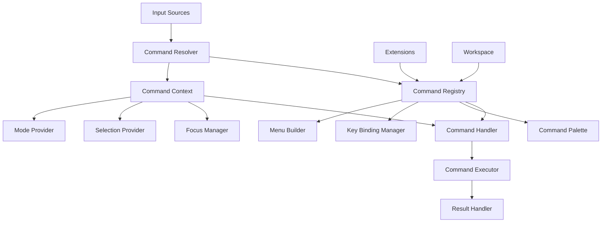

# Command Dispatch System

## Purpose

This document details the implementation of Zed's command dispatch system in Swift, focusing on translating Zed's action pattern to Swift's language features and platform capabilities. The command dispatch system is responsible for registering, resolving, and executing commands from various sources including keyboard shortcuts, menus, the command palette, and programmatic invocations. An efficient command system is critical for a responsive editor experience and for supporting extensibility.

## Concepts

### Command Architecture

The command architecture consists of several key concepts:

1. **Command**: A named action that can be executed with optional parameters
2. **Command Registry**: A central repository of all available commands
3. **Command Context**: Contextual information provided to commands during execution
4. **Command Handler**: Code that implements the execution of a command
5. **Command Binding**: Association between user input (like keyboard shortcuts) and commands

### Command Lifecycle

Commands follow a lifecycle pattern:

1. **Registration**: Commands are registered with the system
2. **Resolution**: Input is resolved to a specific command
3. **Context Collection**: Context is gathered for command execution
4. **Execution**: The command is executed with the context
5. **Result Handling**: Command results are processed

### Command Sources

Commands can be triggered from multiple sources:

1. **Keyboard Shortcuts**: Mapped key combinations
2. **Menus**: UI menu selections
3. **Command Palette**: Fuzzy search interface for commands
4. **Programmatic Invocation**: Direct calls from code
5. **Extensions**: Custom commands from extensions

### Context-Aware Execution

Commands execute with awareness of their context:

1. **Focused Component**: What UI component has focus
2. **Selection**: Current text or item selection
3. **Mode**: Current editor mode (normal, insert, visual)
4. **Document State**: Current document's state
5. **Global State**: Application-wide state

## Architecture

The command system architecture consists of several key components:



### Key Components

1. **CommandManager**: Central coordinator for the command system
2. **CommandRegistry**: Stores registered commands and their handlers
3. **CommandResolver**: Maps input to specific commands
4. **CommandExecutor**: Executes commands with the appropriate context
5. **CommandPalette**: UI for searching and executing commands
6. **KeyBindingManager**: Maps keyboard shortcuts to commands

## Implementation Details

### Command Protocol and Types

The foundation of the command system is the `Command` protocol:

```swift
/// A unique identifier for a command
public struct CommandId: Hashable, Codable, ExpressibleByStringLiteral {
    public let rawValue: String
    
    public init(stringLiteral value: StringLiteralType) {
        self.rawValue = value
    }
    
    public init(_ value: String) {
        self.rawValue = value
    }
}

/// Context for command execution
public struct CommandContext {
    /// The active window
    public let window: Window?
    
    /// The focused entity
    public let focusedEntity: AnyEntity?
    
    /// The current editor mode (if applicable)
    public let editorMode: EditorMode?
    
    /// The current selection (if applicable)
    public let selection: Any?
    
    /// Additional context parameters
    public let parameters: [String: Any]
    
    public init(window: Window? = nil,
                focusedEntity: AnyEntity? = nil,
                editorMode: EditorMode? = nil,
                selection: Any? = nil,
                parameters: [String: Any] = [:]) {
        self.window = window
        self.focusedEntity = focusedEntity
        self.editorMode = editorMode
        self.selection = selection
        self.parameters = parameters
    }
    
    /// Get a parameter with the specified key and type
    public func parameter<T>(_ key: String) -> T? {
        return parameters[key] as? T
    }
    
    /// Create a new context with additional parameters
    public func with(parameters additionalParameters: [String: Any]) -> CommandContext {
        var newParameters = self.parameters
        for (key, value) in additionalParameters {
            newParameters[key] = value
        }
        return CommandContext(
            window: window,
            focusedEntity: focusedEntity,
            editorMode: editorMode,
            selection: selection,
            parameters: newParameters
        )
    }
}

/// Result of command execution
public enum CommandResult {
    case success
    case failure(Error)
    case notHandled
}

/// Protocol for command handlers
public protocol CommandHandler {
    func canHandle(command: CommandId, context: CommandContext) -> Bool
    func handle(command: CommandId, context: CommandContext) -> CommandResult
}

/// A command that can be executed
public struct Command {
    /// Unique identifier for the command
    public let id: CommandId
    
    /// Human-readable title
    public let title: String
    
    /// Optional icon name
    public let icon: String?
    
    /// Category for grouping commands in UI
    public let category: String?
    
    /// When expression that determines when the command is available
    public let when: String?
    
    /// Whether the command should be hidden from command palette
    public let hidden: Bool
    
    public init(id: CommandId,
                title: String,
                icon: String? = nil,
                category: String? = nil,
                when: String? = nil,
                hidden: Bool = false) {
        self.id = id
        self.title = title
        self.icon = icon
        self.category = category
        self.when = when
        self.hidden = hidden
    }
}
```

### Command Registry

The command registry stores all available commands:

```swift
/// Registry for all available commands
public class CommandRegistry {
    /// Registered commands
    private var commands: [CommandId: Command] = [:]
    
    /// Command handlers
    private var handlers: [CommandHandler] = []
    
    /// Register a command
    public func register(command: Command) {
        commands[command.id] = command
    }
    
    /// Register multiple commands
    public func register(commands: [Command]) {
        for command in commands {
            register(command: command)
        }
    }
    
    /// Unregister a command
    public func unregister(commandId: CommandId) {
        commands.removeValue(forKey: commandId)
    }
    
    /// Register a command handler
    public func registerHandler(_ handler: CommandHandler) {
        handlers.append(handler)
    }
    
    /// Get a command by ID
    public func command(forId id: CommandId) -> Command? {
        return commands[id]
    }
    
    /// Get all registered commands
    public func allCommands() -> [Command] {
        return Array(commands.values)
    }
    
    /// Find a handler for a command
    public func findHandler(for commandId: CommandId, context: CommandContext) -> CommandHandler? {
        for handler in handlers {
            if handler.canHandle(command: commandId, context: context) {
                return handler
            }
        }
        return nil
    }
    
    /// Get visible commands for the command palette
    public func visibleCommands() -> [Command] {
        return allCommands().filter { !$0.hidden }
    }
    
    /// Get commands in a specific category
    public func commands(inCategory category: String) -> [Command] {
        return allCommands().filter { $0.category == category }
    }
    
    /// Evaluate if a command is available in the current context
    public func isCommandAvailable(_ command: Command, in context: CommandContext) -> Bool {
        // If there's no when expression, the command is always available
        guard let whenExpression = command.when else {
            return true
        }
        
        // Evaluate the when expression
        return evaluateWhenExpression(whenExpression, in: context)
    }
    
    private func evaluateWhenExpression(_ expression: String, in context: CommandContext) -> Bool {
        // In a real implementation, this would parse and evaluate the when expression
        // For now, we'll just return true
        return true
    }
}
```

### Command Manager

The command manager coordinates command execution:

```swift
/// Central manager for the command system
public class CommandManager {
    /// The command registry
    private let registry: CommandRegistry
    
    /// Context provider for building command contexts
    private let contextProvider: CommandContextProvider
    
    public init(registry: CommandRegistry, contextProvider: CommandContextProvider) {
        self.registry = registry
        self.contextProvider = contextProvider
    }
    
    /// Execute a command by ID
    public func executeCommand(_ commandId: CommandId, parameters: [String: Any] = [:]) -> CommandResult {
        // Get the context
        let baseContext = contextProvider.currentContext()
        let context = baseContext.with(parameters: parameters)
        
        // Find a handler
        guard let handler = registry.findHandler(for: commandId, context: context) else {
            return .notHandled
        }
        
        // Handle the command
        return handler.handle(command: commandId, context: context)
    }
    
    /// Check if a command can be executed
    public func canExecuteCommand(_ commandId: CommandId) -> Bool {
        guard let command = registry.command(forId: commandId) else {
            return false
        }
        
        let context = contextProvider.currentContext()
        return registry.isCommandAvailable(command, in: context) &&
               registry.findHandler(for: commandId, context: context) != nil
    }
    
    /// Get all commands that can be executed in the current context
    public func availableCommands() -> [Command] {
        let context = contextProvider.currentContext()
        return registry.allCommands().filter { command in
            registry.isCommandAvailable(command, in: context) &&
            registry.findHandler(for: command.id, context: context) != nil
        }
    }
}

/// Provider for command contexts
public protocol CommandContextProvider {
    func currentContext() -> CommandContext
}

/// Default implementation of CommandContextProvider
public class DefaultCommandContextProvider: CommandContextProvider {
    private let window: Window?
    private let focusManager: FocusManager
    
    public init(window: Window?, focusManager: FocusManager) {
        self.window = window
        self.focusManager = focusManager
    }
    
    public func currentContext() -> CommandContext {
        let focusedEntity = focusManager.focusedEntity
        
        // Get editor mode if focused entity is an editor
        let editorMode: EditorMode?
        if let editor = focusedEntity?.downcast(to: EditorState.self) {
            editorMode = editor.read { $0.mode }
        } else {
            editorMode = nil
        }
        
        // Get selection if applicable
        let selection: Any?
        if let selectable = focusedEntity?.downcast(to: SelectableState.self) {
            selection = selectable.read { $0.selection }
        } else {
            selection = nil
        }
        
        return CommandContext(
            window: window,
            focusedEntity: focusedEntity,
            editorMode: editorMode,
            selection: selection,
            parameters: [:]
        )
    }
}
```

### Command Handlers

Different subsystems can provide command handlers:

```swift
/// Handler for editor commands
public class EditorCommandHandler: CommandHandler {
    private let workspace: Entity<WorkspaceState>
    
    public init(workspace: Entity<WorkspaceState>) {
        self.workspace = workspace
    }
    
    public func canHandle(command: CommandId, context: CommandContext) -> Bool {
        // Check if the command is an editor command
        return command.rawValue.starts(with: "editor.")
    }
    
    public func handle(command: CommandId, context: CommandContext) -> CommandResult {
        // Handle editor commands
        switch command {
        case "editor.newFile":
            return handleNewFile(context)
        case "editor.save":
            return handleSave(context)
        case "editor.saveAll":
            return handleSaveAll(context)
        case "editor.find":
            return handleFind(context)
        case "editor.replace":
            return handleReplace(context)
        default:
            return .notHandled
        }
    }
    
    private func handleNewFile(_ context: CommandContext) -> CommandResult {
        // Implementation for creating a new file
        return workspace.update { state, cx in
            state.createNewFile(cx)
            return .success
        } ?? .failure(CommandError.entityUpdateFailed)
    }
    
    private func handleSave(_ context: CommandContext) -> CommandResult {
        guard let editor = context.focusedEntity?.downcast(to: EditorState.self) else {
            return .notHandled
        }
        
        return editor.update { state, cx in
            state.save(cx)
            return .success
        } ?? .failure(CommandError.entityUpdateFailed)
    }
    
    private func handleSaveAll(_ context: CommandContext) -> CommandResult {
        return workspace.update { state, cx in
            state.saveAllDocuments(cx)
            return .success
        } ?? .failure(CommandError.entityUpdateFailed)
    }
    
    private func handleFind(_ context: CommandContext) -> CommandResult {
        guard let editor = context.focusedEntity?.downcast(to: EditorState.self) else {
            return .notHandled
        }
        
        return editor.update { state, cx in
            state.showFindPanel(cx)
            return .success
        } ?? .failure(CommandError.entityUpdateFailed)
    }
    
    private func handleReplace(_ context: CommandContext) -> CommandResult {
        guard let editor = context.focusedEntity?.downcast(to: EditorState.self) else {
            return .notHandled
        }
        
        return editor.update { state, cx in
            state.showReplacePanel(cx)
            return .success
        } ?? .failure(CommandError.entityUpdateFailed)
    }
}

/// Handler for workspace commands
public class WorkspaceCommandHandler: CommandHandler {
    private let workspace: Entity<WorkspaceState>
    
    public init(workspace: Entity<WorkspaceState>) {
        self.workspace = workspace
    }
    
    public func canHandle(command: CommandId, context: CommandContext) -> Bool {
        return command.rawValue.starts(with: "workspace.")
    }
    
    public func handle(command: CommandId, context: CommandContext) -> CommandResult {
        switch command {
        case "workspace.openFolder":
            return handleOpenFolder(context)
        case "workspace.closeFolder":
            return handleCloseFolder(context)
        case "workspace.newWindow":
            return handleNewWindow(context)
        default:
            return .notHandled
        }
    }
    
    private func handleOpenFolder(_ context: CommandContext) -> CommandResult {
        // Implementation
        return .success
    }
    
    private func handleCloseFolder(_ context: CommandContext) -> CommandResult {
        // Implementation
        return .success
    }
    
    private func handleNewWindow(_ context: CommandContext) -> CommandResult {
        // Implementation
        return .success
    }
}

/// Errors that can occur during command execution
public enum CommandError: Error {
    case commandNotFound
    case handlerNotFound
    case invalidContext
    case entityUpdateFailed
    case executionFailed(String)
}
```

### Key Binding System

The key binding system maps keyboard shortcuts to commands:

```swift
/// Represents a key combination
public struct KeyCombo: Hashable, Codable {
    public let key: String
    public let modifiers: KeyModifiers
    
    public init(key: String, modifiers: KeyModifiers = []) {
        self.key = key
        self.modifiers = modifiers
    }
    
    public var displayString: String {
        var parts: [String] = []
        
        if modifiers.contains(.command) {
            parts.append("⌘")
        }
        if modifiers.contains(.shift) {
            parts.append("⇧")
        }
        if modifiers.contains(.option) {
            parts.append("⌥")
        }
        if modifiers.contains(.control) {
            parts.append("⌃")
        }
        
        parts.append(key.uppercased())
        
        return parts.joined(separator: "")
    }
}

/// Key modifiers
public struct KeyModifiers: OptionSet, Hashable, Codable {
    public let rawValue: Int
    
    public init(rawValue: Int) {
        self.rawValue = rawValue
    }
    
    public static let command = KeyModifiers(rawValue: 1 << 0)
    public static let shift = KeyModifiers(rawValue: 1 << 1)
    public static let option = KeyModifiers(rawValue: 1 << 2)
    public static let control = KeyModifiers(rawValue: 1 << 3)
}

/// A key binding maps a key combination to a command
public struct KeyBinding: Codable {
    public let combo: KeyCombo
    public let command: CommandId
    public let when: String?
    
    public init(combo: KeyCombo, command: CommandId, when: String? = nil) {
        self.combo = combo
        self.command = command
        self.when = when
    }
}

/// Manager for key bindings
public class KeyBindingManager {
    /// Registry of commands
    private let commandRegistry: CommandRegistry
    
    /// Key bindings
    private var keyBindings: [KeyBinding] = []
    
    public init(commandRegistry: CommandRegistry) {
        self.commandRegistry = commandRegistry
    }
    
    /// Register a key binding
    public func registerKeyBinding(_ binding: KeyBinding) {
        keyBindings.append(binding)
    }
    
    /// Register multiple key bindings
    public func registerKeyBindings(_ bindings: [KeyBinding]) {
        keyBindings.append(contentsOf: bindings)
    }
    
    /// Unregister a key binding
    public func unregisterKeyBinding(for combo: KeyCombo) {
        keyBindings.removeAll { $0.combo == combo }
    }
    
    /// Resolve a key combo to a command in the given context
    public func resolveCommand(for combo: KeyCombo, context: CommandContext) -> CommandId? {
        // Find bindings for this combo
        let matchingBindings = keyBindings.filter { $0.combo == combo }
        
        // Filter by when expression
        for binding in matchingBindings {
            if let when = binding.when {
                // Evaluate when expression
                if !evaluateWhenExpression(when, in: context) {
                    continue
                }
            }
            
            // Make sure the command exists and can be handled
            guard let command = commandRegistry.command(forId: binding.command),
                  commandRegistry.isCommandAvailable(command, in: context),
                  commandRegistry.findHandler(for: binding.command, context: context) != nil else {
                continue
            }
            
            return binding.command
        }
        
        return nil
    }
    
    /// Get all key bindings for a command
    public func keyBindings(for commandId: CommandId) -> [KeyBinding] {
        return keyBindings.filter { $0.command == commandId }
    }
    
    /// Load key bindings from a JSON file
    public func loadKeyBindings(from url: URL) throws {
        let data = try Data(contentsOf: url)
        let decoder = JSONDecoder()
        let bindings = try decoder.decode([KeyBinding].self, from: data)
        registerKeyBindings(bindings)
    }
    
    /// Save key bindings to a JSON file
    public func saveKeyBindings(to url: URL) throws {
        let encoder = JSONEncoder()
        encoder.outputFormatting = .prettyPrinted
        let data = try encoder.encode(keyBindings)
        try data.write(to: url)
    }
    
    private func evaluateWhenExpression(_ expression: String, in context: CommandContext) -> Bool {
        // In a real implementation, this would parse and evaluate the when expression
        // For now, we'll just return true
        return true
    }
}
```

### Command Palette

The command palette provides a UI for finding and executing commands:

```swift
/// Model for the command palette
public class CommandPaletteModel {
    /// Command registry
    private let commandRegistry: CommandRegistry
    
    /// Command manager
    private let commandManager: CommandManager
    
    /// Current search query
    @Published public var searchQuery: String = ""
    
    /// Filtered commands based on the search query
    @Published public var filteredCommands: [Command] = []
    
    /// Selected command index
    @Published public var selectedIndex: Int = 0
    
    public init(commandRegistry: CommandRegistry, commandManager: CommandManager) {
        self.commandRegistry = commandRegistry
        self.commandManager = commandManager
        
        // Initial list of commands
        updateFilteredCommands()
    }
    
    /// Update the filtered commands based on the search query
    public func updateFilteredCommands() {
        let availableCommands = commandManager.availableCommands().filter { !$0.hidden }
        
        if searchQuery.isEmpty {
            filteredCommands = availableCommands
        } else {
            filteredCommands = availableCommands.filter { command in
                fuzzyMatch(pattern: searchQuery.lowercased(), string: command.title.lowercased())
            }
        }
        
        // Reset selected index
        selectedIndex = filteredCommands.isEmpty ? -1 : 0
    }
    
    /// Set the search query
    public func setSearchQuery(_ query: String) {
        searchQuery = query
        updateFilteredCommands()
    }
    
    /// Select the next command
    public func selectNext() {
        if filteredCommands.isEmpty {
            selectedIndex = -1
            return
        }
        
        selectedIndex = (selectedIndex + 1) % filteredCommands.count
    }
    
    /// Select the previous command
    public func selectPrevious() {
        if filteredCommands.isEmpty {
            selectedIndex = -1
            return
        }
        
        selectedIndex = (selectedIndex - 1 + filteredCommands.count) % filteredCommands.count
    }
    
    /// Execute the selected command
    public func executeSelected() -> CommandResult? {
        guard selectedIndex >= 0 && selectedIndex < filteredCommands.count else {
            return nil
        }
        
        let command = filteredCommands[selectedIndex]
        return commandManager.executeCommand(command.id)
    }
    
    /// Simple fuzzy matching algorithm
    private func fuzzyMatch(pattern: String, string: String) -> Bool {
        var patternIndex = pattern.startIndex
        var stringIndex = string.startIndex
        
        while patternIndex < pattern.endIndex && stringIndex < string.endIndex {
            if pattern[patternIndex] == string[stringIndex] {
                patternIndex = pattern.index(after: patternIndex)
            }
            stringIndex = string.index(after: stringIndex)
        }
        
        return patternIndex == pattern.endIndex
    }
}

/// SwiftUI view for command palette
public struct CommandPaletteView: View {
    @ObservedObject var model: CommandPaletteModel
    @Binding var isPresented: Bool
    
    public init(model: CommandPaletteModel, isPresented: Binding<Bool>) {
        self.model = model
        self._isPresented = isPresented
    }
    
    public var body: some View {
        VStack(spacing: 0) {
            // Search field
            TextField("Search commands...", text: $model.searchQuery)
                .onChange(of: model.searchQuery) { _ in
                    model.updateFilteredCommands()
                }
                .padding()
                .background(Color(.textBackgroundColor))
            
            // Command list
            List(model.filteredCommands, id: \.id.rawValue) { command in
                CommandRow(command: command, isSelected: model.selectedIndex == model.filteredCommands.firstIndex(where: { $0.id == command.id }) ?? -1)
                    .onTapGesture {
                        model.selectedIndex = model.filteredCommands.firstIndex(where: { $0.id == command.id }) ?? 0
                        _ = model.executeSelected()
                        isPresented = false
                    }
            }
        }
        .frame(width: 600, height: 400)
        .onKeyPress(.downArrow) {
            model.selectNext()
            return .handled
        }
        .onKeyPress(.upArrow) {
            model.selectPrevious()
            return .handled
        }
        .onKeyPress(.return) {
            _ = model.executeSelected()
            isPresented = false
            return .handled
        }
        .onKeyPress(.escape) {
            isPresented = false
            return .handled
        }
    }
}

/// Row in the command palette
struct CommandRow: View {
    let command: Command
    let isSelected: Bool
    
    var body: some View {
        HStack {
            if let icon = command.icon {
                Image(systemName: icon)
                    .frame(width: 20)
            } else {
                Spacer()
                    .frame(width: 20)
            }
            
            VStack(alignment: .leading) {
                Text(command.title)
                    .fontWeight(isSelected ? .bold : .regular)
                
                if let category = command.category {
                    Text(category)
                        .font(.caption)
                        .foregroundColor(.secondary)
                }
            }
            
            Spacer()
            
            // Show key binding if available
            if let keyBinding = KeyBindingManager.shared.keyBindings(for: command.id).first {
                Text(keyBinding.combo.displayString)
                    .font(.caption)
                    .padding(4)
                    .background(Color(.tertiaryLabelColor))
                    .cornerRadius(4)
            }
        }
        .padding(.vertical, 4)
        .background(isSelected ? Color.accentColor.opacity(0.2) : Color.clear)
    }
}
```

### Menu System

The menu system builds application menus from commands:

```swift
/// Menu item types
public enum MenuItem {
    case command(CommandId, String? = nil)
    case separator
    case submenu(String, [MenuItem])
}

/// Menu builder for constructing app menus
public class MenuBuilder {
    /// Command registry
    private let commandRegistry: CommandRegistry
    
    /// Key binding manager
    private let keyBindingManager: KeyBindingManager
    
    public init(commandRegistry: CommandRegistry, keyBindingManager: KeyBindingManager) {
        self.commandRegistry = commandRegistry
        self.keyBindingManager = keyBindingManager
    }
    
    /// Build a menu from menu items
    public func buildMenu(items: [MenuItem]) -> NSMenu {
        let menu = NSMenu()
        
        for item in items {
            if let menuItem = buildMenuItem(item) {
                menu.addItem(menuItem)
            }
        }
        
        return menu
    }
    
    /// Build a menu item
    private func buildMenuItem(_ item: MenuItem) -> NSMenuItem? {
        switch item {
        case .separator:
            return NSMenuItem.separator()
            
        case .command(let commandId, let title):
            guard let command = commandRegistry.command(forId: commandId) else {
                return nil
            }
            
            let menuTitle = title ?? command.title
            let menuItem = NSMenuItem(title: menuTitle, action: #selector(AppDelegate.handleMenuAction(_:)), keyEquivalent: "")
            menuItem.representedObject = commandId
            
            // Add key equivalent if there's a key binding
            if let keyBinding = keyBindingManager.keyBindings(for: commandId).first {
                menuItem.keyEquivalent = keyBinding.combo.key.lowercased()
                
                var modifiers = NSEvent.ModifierFlags()
                if keyBinding.combo.modifiers.contains(.command) {
                    modifiers.insert(.command)
                }
                if keyBinding.combo.modifiers.contains(.shift) {
                    modifiers.insert(.shift)
                }
                if keyBinding.combo.modifiers.contains(.option) {
                    modifiers.insert(.option)
                }
                if keyBinding.combo.modifiers.contains(.control) {
                    modifiers.insert(.control)
                }
                
                menuItem.keyEquivalentModifierMask = modifiers
            }
            
            return menuItem
            
        case .submenu(let title, let items):
            let menuItem = NSMenuItem(title: title, action: nil, keyEquivalent: "")
            let submenu = NSMenu(title: title)
            
            for subitem in items {
                if let subMenuItem = buildMenuItem(subitem) {
                    submenu.addItem(subMenuItem)
                }
            }
            
            menuItem.submenu = submenu
            return menuItem
        }
    }
}

/// Standard menu definitions
public struct StandardMenus {
    /// File menu
    public static var fileMenu: [MenuItem] {
        return [
            .command("file.new", "New"),
            .command("file.open", "Open..."),
            .separator,
            .command("file.save", "Save"),
            .command("file.saveAs", "Save As..."),
            .command("file.saveAll", "Save All"),
            .separator,
            .command("file.close", "Close"),
            .command("file.closeAll", "Close All")
        ]
    }
    
    /// Edit menu
    public static var editMenu: [MenuItem] {
        return [
            .command("edit.undo", "Undo"),
            .command("edit.redo", "Redo"),
            .separator,
            .command("edit.cut", "Cut"),
            .command("edit.copy", "Copy"),
            .command("edit.paste", "Paste"),
            .separator,
            .command("edit.find", "Find..."),
            .command("edit.replace", "Replace..."),
            .separator,
            .command("edit.selectAll", "Select All")
        ]
    }
    
    /// View menu
    public static var viewMenu: [MenuItem] {
        return [
            .command("view.toggleSidebar", "Toggle Sidebar"),
            .command("view.toggleStatusBar", "Toggle Status Bar"),
            .separator,
            .command("view.zoomIn", "Zoom In"),
            .command("view.zoomOut", "Zoom Out"),
            .command("view.resetZoom", "Reset Zoom"),
            .separator,
            .submenu("Appearance", [
                .command("view.theme.light", "Light"),
                .command("view.theme.dark", "Dark"),
                .command("view.theme.system", "System")
            ])
        ]
    }
    
    /// Main menu bar
    public static var mainMenu: [MenuItem] {
        return [
            .submenu("File", fileMenu),
            .submenu("Edit", editMenu),
            .submenu("View", viewMenu)
        ]
    }
}
```

### Integrating with the Entity System

The command system needs to integrate with the entity system:

```swift
/// Extension to App for command system support
extension App {
    /// Create the command system
    public func createCommandSystem() -> CommandManager {
        let commandRegistry = CommandRegistry()
        let contextProvider = DefaultCommandContextProvider(
            window: nil,
            focusManager: self.focusManager
        )
        
        let commandManager = CommandManager(
            registry: commandRegistry,
            contextProvider: contextProvider
        )
        
        // Register standard commands
        registerStandardCommands(in: commandRegistry)
        
        // Register command handlers
        registerCommandHandlers(in: commandRegistry)
        
        return commandManager
    }
    
    /// Register standard commands
    private func registerStandardCommands(in registry: CommandRegistry) {
        // File commands
        registry.register(commands: [
            Command(id: "file.new", title: "New File", icon: "doc.badge.plus", category: "File"),
            Command(id: "file.open", title: "Open File...", icon: "folder", category: "File"),
            Command(id: "file.save", title: "Save", icon: "square.and.arrow.down", category: "File"),
            Command(id: "file.saveAs", title: "Save As...", icon: "square.and.arrow.down.on.square", category: "File"),
            Command(id: "file.saveAll", title: "Save All", icon: "square.and.arrow.down.on.square.fill", category: "File"),
            Command(id: "file.close", title: "Close", icon: "xmark", category: "File"),
            Command(id: "file.closeAll", title: "Close All", icon: "xmark.circle", category: "File")
        ])
        
        // Edit commands
        registry.register(commands: [
            Command(id: "edit.undo", title: "Undo", icon: "arrow.uturn.backward", category: "Edit"),
            Command(id: "edit.redo", title: "Redo", icon: "arrow.uturn.forward", category: "Edit"),
            Command(id: "edit.cut", title: "Cut", icon: "scissors", category: "Edit"),
            Command(id: "edit.copy", title: "Copy", icon: "doc.on.doc", category: "Edit"),
            Command(id: "edit.paste", title: "Paste", icon: "doc.on.clipboard", category: "Edit"),
            Command(id: "edit.find", title: "Find...", icon: "magnifyingglass", category: "Edit"),
            Command(id: "edit.replace", title: "Replace...", icon: "text.cursor", category: "Edit"),
            Command(id: "edit.selectAll", title: "Select All", icon: "checkmark.circle", category: "Edit")
        ])
        
        // View commands
        registry.register(commands: [
            Command(id: "view.toggleSidebar", title: "Toggle Sidebar", icon: "sidebar.left", category: "View"),
            Command(id: "view.toggleStatusBar", title: "Toggle Status Bar", icon: "info.circle", category: "View"),
            Command(id: "view.zoomIn", title: "Zoom In", icon: "plus.magnifyingglass", category: "View"),
            Command(id: "view.zoomOut", title: "Zoom Out", icon: "minus.magnifyingglass", category: "View"),
            Command(id: "view.resetZoom", title: "Reset Zoom", icon: "1.magnifyingglass", category: "View")
        ])
    }
    
    /// Register command handlers
    private func registerCommandHandlers(in registry: CommandRegistry) {
        let workspace = self.workspace
        
        // Register handlers
        registry.registerHandler(EditorCommandHandler(workspace: workspace))
        registry.registerHandler(WorkspaceCommandHandler(workspace: workspace))
        
        // Add more handlers as needed...
    }
}
```

## Swift Reimplementation Considerations

### AppKit Integration

For AppKit menu integration:

```swift
/// AppDelegate extension for handling menu actions
extension AppDelegate {
    @objc func handleMenuAction(_ sender: NSMenuItem) {
        guard let commandId = sender.representedObject as? CommandId else {
            return
        }
        
        let commandManager = App.shared.commandManager
        _ = commandManager.executeCommand(commandId)
    }
    
    func setupMainMenu() {
        let menuBuilder = MenuBuilder(
            commandRegistry: App.shared.commandRegistry,
            keyBindingManager: App.shared.keyBindingManager
        )
        
        let mainMenu = menuBuilder.buildMenu(items: StandardMenus.mainMenu)
        NSApp.mainMenu = mainMenu
    }
}
```

### Keyboard Shortcut Handling

For handling keyboard shortcuts:

```swift
/// NSEvent conversion to KeyCombo
extension KeyCombo {
    init(from event: NSEvent) {
        var modifiers: KeyModifiers = []
        
        // Convert NSEvent modifiers to KeyModifiers
        if event.modifierFlags.contains(.command) {
            modifiers.insert(.command)
        }
        if event.modifierFlags.contains(.shift) {
            modifiers.insert(.shift)
        }
        if event.modifierFlags.contains(.option) {
            modifiers.insert(.option)
        }
        if event.modifierFlags.contains(.control) {
            modifiers.insert(.control)
        }
        
        // Convert key code to key string
        let key = KeyCodeConverter.keyStringForKeyCode(Int(event.keyCode))
        
        self.init(key: key, modifiers: modifiers)
    }
}

/// Converter for key codes to key strings
class KeyCodeConverter {
    private static let keyCodeMap: [Int: String] = [
        0: "a",
        1: "s",
        2: "d",
        3: "f",
        // ... more key mappings ...
        36: "return",
        49: "space",
        123: "left",
        124: "right",
        125: "down",
        126: "up"
    ]
    
    static func keyStringForKeyCode(_ keyCode: Int) -> String {
        return keyCodeMap[keyCode] ?? "unknown"
    }
}

/// NSView extension for handling key events
extension NSView {
    /// Handle key down event
    @objc func handleKeyDown(with event: NSEvent) -> Bool {
        let keyCombo = KeyCombo(from: event)
        let contextProvider = DefaultCommandContextProvider(
            window: self.window,
            focusManager: App.shared.focusManager
        )
        let context = contextProvider.currentContext()
        
        // Try to resolve command
        if let commandId = App.shared.keyBindingManager.resolveCommand(for: keyCombo, context: context) {
            // Execute command
            let result = App.shared.commandManager.executeCommand(commandId)
            
            // If command was handled, consume the event
            if case .success = result {
                return true
            }
        }
        
        // Not handled
        return false
    }
}
```

### SwiftUI Integration

For SwiftUI integration:

```swift
/// View modifier for command binding
struct CommandButtonStyle: ViewModifier {
    let commandId: CommandId
    let isEnabled: Bool
    
    func body(content: Content) -> some View {
        content
            .disabled(!isEnabled)
            .onTapGesture {
                _ = App.shared.commandManager.executeCommand(commandId)
            }
    }
}

extension View {
    /// Bind a command to a view
    func command(_ commandId: CommandId, isEnabled: Bool = true) -> some View {
        modifier(CommandButtonStyle(commandId: commandId, isEnabled: isEnabled))
    }
}

/// SwiftUI button bound to a command
struct CommandButton: View {
    let commandId: CommandId
    let label: Text
    
    @State private var isEnabled = true
    
    var body: some View {
        Button(action: {
            _ = App.shared.commandManager.executeCommand(commandId)
        }) {
            label
        }
        .disabled(!isEnabled)
        .onAppear {
            checkIfEnabled()
        }
    }
    
    private func checkIfEnabled() {
        isEnabled = App.shared.commandManager.canExecuteCommand(commandId)
    }
}
```

### Slash Command Integration

For integrating with the slash command system:

```swift
/// Slash command provider based on the command system
public class CommandSystemSlashCommandProvider: SlashCommandProvider {
    private let commandRegistry: CommandRegistry
    private let commandManager: CommandManager
    
    public init(commandRegistry: CommandRegistry, commandManager: CommandManager) {
        self.commandRegistry = commandRegistry
        self.commandManager = commandManager
    }
    
    public func provideCommands() -> [SlashCommand] {
        // Convert regular commands to slash commands
        return commandRegistry.visibleCommands().map { command in
            SlashCommand(
                id: "cmd:" + command.id.rawValue,
                title: command.title,
                description: command.category ?? "Command",
                icon: command.icon,
                execute: { [weak self] _, _ in
                    _ = self?.commandManager.executeCommand(command.id)
                    return true
                }
            )
        }
    }
}
```

## Performance Considerations

### Command Lookup Optimization

```swift
/// Optimized command lookup using a trie
class CommandTrie {
    private class Node {
        var commands: [Command] = []
        var children: [Character: Node] = [:]
    }
    
    private let root = Node()
    
    /// Add a command to the trie
    func add(command: Command) {
        let title = command.title.lowercased()
        
        var current = root
        
        // Add to root for empty search
        current.commands.append(command)
        
        // Add to each prefix
        for i in title.indices {
            let prefix = title[..<i]
            for char in prefix {
                if current.children[char] == nil {
                    current.children[char] = Node()
                }
                current = current.children[char]!
            }
            current.commands.append(command)
        }
    }
    
    /// Find commands matching a prefix
    func find(prefix: String) -> [Command] {
        let prefix = prefix.lowercased()
        
        if prefix.isEmpty {
            return root.commands
        }
        
        var current = root
        
        for char in prefix {
            guard let next = current.children[char] else {
                return []
            }
            current = next
        }
        
        return current.commands
    }
}
```

### Caching Context Evaluation

```swift
/// Cached when expression evaluation
class WhenExpressionEvaluator {
    private var cache: [String: (CommandContext, Bool, TimeInterval)] = [:]
    private let cacheLifetime: TimeInterval = 0.5 // seconds
    
    func evaluate(_ expression: String, in context: CommandContext) -> Bool {
        let now = Date().timeIntervalSince1970
        
        // Check cache
        if let (cachedContext, result, timestamp) = cache[expression] {
            if now - timestamp < cacheLifetime && contextEquals(cachedContext, context) {
                return result
            }
        }
        
        // Evaluate expression
        let result = evaluateExpression(expression, in: context)
        
        // Cache result
        cache[expression] = (context, result, now)
        
        return result
    }
    
    private func evaluateExpression(_ expression: String, in context: CommandContext) -> Bool {
        // Real implementation would parse and evaluate the expression
        return true
    }
    
    private func contextEquals(_ context1: CommandContext, _ context2: CommandContext) -> Bool {
        // Compare relevant parts of contexts
        return context1.window === context2.window &&
               context1.focusedEntity?.id == context2.focusedEntity?.id &&
               context1.editorMode == context2.editorMode
    }
}
```

### Throttling Command Execution

```swift
/// Throttled command executor to prevent rapid execution
class ThrottledCommandExecutor {
    private var lastExecutionTime: [CommandId: TimeInterval] = [:]
    private let minInterval: TimeInterval = 0.1 // seconds
    
    func shouldExecute(commandId: CommandId) -> Bool {
        let now = Date().timeIntervalSince1970
        
        if let lastTime = lastExecutionTime[commandId],
           now - lastTime < minInterval {
            return false
        }
        
        lastExecutionTime[commandId] = now
        return true
    }
}
```

## Practical Implementation Steps

1. **Core Command System**:
   - Implement `Command` and `CommandRegistry`
   - Create `CommandManager` for execution
   - Build command context infrastructure

2. **Key Binding System**:
   - Implement `KeyCombo` and `KeyBinding`
   - Create `KeyBindingManager`
   - Build key event handling

3. **UI Integration**:
   - Create command palette UI
   - Build menu integration
   - Add keyboard shortcut support

4. **Command Handlers**:
   - Implement handlers for different subsystems
   - Create extension points for plugins
   - Add context-aware execution

5. **Performance Optimization**:
   - Add command lookup optimization
   - Implement caching for when expressions
   - Add throttling for rapid execution

## References

This design connects to the following architecture documents:

- [11_StratosphericView_CommandSystem.md](/docs/MissionCabbage/11_StratosphericView_CommandSystem.md) - Command system overview
- [37_GroundLevel_EventHandling.md](/docs/MissionCabbage/37_GroundLevel_EventHandling.md) - Event handling
- [42_Swift_ReactiveUI.md](/docs/MissionCabbage/42_Swift_ReactiveUI.md) - UI framework integration
- [51_GroundLevel_InputHandlingSystem.md](/docs/MissionCabbage/51_GroundLevel_InputHandlingSystem.md) - Input handling

## Conclusion

The command dispatch system provides a flexible, extensible foundation for user interaction with the editor. By separating commands from their binding sources (keyboard, menu, palette, etc.), we enable a consistent interaction model that can be extended by plugins and customized by users.

The Swift implementation leverages the language's strong type system and protocol-oriented programming to create a clean, maintainable architecture. The integration with both AppKit and SwiftUI allows for a hybrid approach that balances performance with modern UI patterns.

Particular attention has been paid to performance considerations, with optimizations for command lookup, context evaluation caching, and execution throttling. These ensure that the command system remains responsive even in complex editing scenarios with many commands and key bindings.

The practical implementation steps provide a clear path forward for building this system incrementally, starting with the core functionality and gradually adding more advanced features.