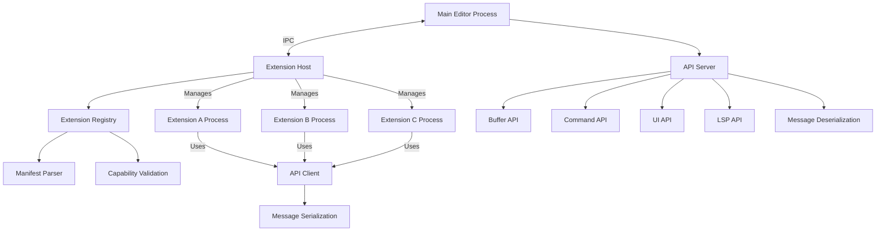

# 56. Ground Level: Editor Extension Mechanisms

## Purpose

This document details the low-level implementation mechanisms that enable Zed's extension system in Swift. It addresses the core infrastructure required to support a flexible and performant extension API, allowing third-party developers to enhance the editor with additional functionality while maintaining safety, stability, and performance.

## Concepts

### Extension Isolation

Extensions in Zed operate in a sandboxed environment to prevent malicious or poorly written extensions from compromising the editor's stability:

- **Process Isolation**: Extensions run in separate processes to protect the main editor
- **Memory Boundaries**: Clear memory partitioning between extension and editor code
- **Communication Channels**: Well-defined message passing infrastructure
- **Resource Limits**: Constraints on CPU, memory, and I/O usage

### Extension Lifecycle

Extensions follow a defined lifecycle that the system must manage:

- **Registration**: Recording extension metadata and capabilities
- **Activation**: Loading and initializing extension code
- **Deactivation**: Graceful shutdown and cleanup
- **Updates**: Hot-reloading and version management

### Extension API Surface

The extension system exposes a controlled API surface:

- **Editor Core Access**: Read/modify buffer contents, selections, etc.
- **UI Integration**: Add custom panels, decorations, and widgets
- **Language Intelligence**: Access to language server data
- **Command Registration**: Add new commands to the command palette
- **Settings Integration**: Add configurable settings

## Architecture



## Implementation Details

### Extension Host

The Extension Host serves as the bridge between the main editor and extension processes:

```swift
final class ExtensionHost {
    private let extensionRegistry: ExtensionRegistry
    private var extensionProcesses: [ExtensionId: ExtensionProcess] = [:]
    private let messageRouter = MessageRouter()
    private let eventLoop: NIOEventLoop
    
    init(extensionRegistry: ExtensionRegistry, eventLoop: NIOEventLoop) {
        self.extensionRegistry = extensionRegistry
        self.eventLoop = eventLoop
        setupMessageHandlers()
    }
    
    func activateExtension(id: ExtensionId) async throws {
        guard let extension = extensionRegistry.extension(withId: id) else {
            throw ExtensionError.notFound(id)
        }
        
        // Check if already running
        if extensionProcesses[id] != nil {
            return
        }
        
        // Create and start extension process
        let process = try await ExtensionProcess.create(
            extension: extension,
            messageHandler: { [weak self] message in
                self?.handleMessage(from: id, message: message)
            }
        )
        
        extensionProcesses[id] = process
        
        // Send activation message
        try await process.sendMessage(.activate)
    }
    
    func deactivateExtension(id: ExtensionId) async throws {
        guard let process = extensionProcesses[id] else {
            return // Already deactivated
        }
        
        // Send deactivation message and wait for acknowledgment
        try await process.sendMessage(.deactivate)
        
        // Terminate process and remove from active processes
        try await process.terminate()
        extensionProcesses.removeValue(forKey: id)
    }
    
    private func handleMessage(from extensionId: ExtensionId, message: ExtensionMessage) {
        messageRouter.route(message, from: extensionId)
    }
    
    private func setupMessageHandlers() {
        messageRouter.register(handler: { [weak self] (id: ExtensionId, message: APIRequest) in
            self?.handleAPIRequest(from: id, request: message)
        })
        
        // Register other message handlers...
    }
    
    private func handleAPIRequest(from extensionId: ExtensionId, request: APIRequest) async {
        // Validate request against extension's declared capabilities
        guard extensionRegistry.validateCapability(extensionId: extensionId, capability: request.capability) else {
            let response = APIResponse.error(.capabilityNotDeclared)
            try? await extensionProcesses[extensionId]?.sendMessage(response)
            return
        }
        
        // Process API request
        let result = await apiServer.handleRequest(request)
        
        // Send response back to extension
        try? await extensionProcesses[extensionId]?.sendMessage(result)
    }
}
```

### Extension Process Management

The `ExtensionProcess` class handles the lifecycle of each extension process:

```swift
final class ExtensionProcess {
    private let process: Process
    private let extensionId: ExtensionId
    private let stdinPipe = Pipe()
    private let stdoutPipe = Pipe()
    private let messageHandler: (ExtensionMessage) -> Void
    
    private var pendingRequests: [UUID: (Result<Any, Error>) -> Void] = [:]
    private let processQueue = DispatchQueue(label: "com.zed.extension.\(extensionId)")
    
    static func create(
        extension: Extension,
        messageHandler: @escaping (ExtensionMessage) -> Void
    ) async throws -> ExtensionProcess {
        let process = Process()
        
        // Configure process with sandbox parameters
        process.executableURL = URL(fileURLWithPath: "/usr/bin/swift")
        process.arguments = ["run", "--package-path", extension.path]
        
        // Set up environment
        var environment = ProcessInfo.processInfo.environment
        environment["ZED_EXTENSION_ID"] = extension.id.rawValue
        environment["ZED_EXTENSION_API_VERSION"] = "1.0.0"
        environment["ZED_EXTENSION_IPC_MODE"] = "stdio"
        process.environment = environment
        
        // Set up I/O
        let stdinPipe = Pipe()
        let stdoutPipe = Pipe()
        process.standardInput = stdinPipe
        process.standardOutput = stdoutPipe
        
        // Create process wrapper
        let extensionProcess = ExtensionProcess(
            process: process,
            extensionId: extension.id,
            stdinPipe: stdinPipe,
            stdoutPipe: stdoutPipe,
            messageHandler: messageHandler
        )
        
        // Start process
        try process.run()
        
        // Start message handling
        extensionProcess.startMessageHandling()
        
        return extensionProcess
    }
    
    func sendMessage(_ message: ExtensionMessage) async throws {
        return try await withCheckedThrowingContinuation { continuation in
            processQueue.async {
                do {
                    // Serialize message
                    let data = try JSONEncoder().encode(message)
                    
                    // Add header with content length
                    let header = "Content-Length: \(data.count)\r\n\r\n"
                    let headerData = header.data(using: .utf8)!
                    
                    // Write header and message
                    try self.stdinPipe.fileHandleForWriting.write(contentsOf: headerData)
                    try self.stdinPipe.fileHandleForWriting.write(contentsOf: data)
                    
                    continuation.resume()
                } catch {
                    continuation.resume(throwing: error)
                }
            }
        }
    }
    
    func terminate() async throws {
        process.terminate()
        // Wait for process to exit
        // ...
    }
    
    private func startMessageHandling() {
        // Set up async reading from stdout
        stdoutPipe.fileHandleForReading.readabilityHandler = { [weak self] fileHandle in
            guard let self = self else { return }
            
            let data = fileHandle.availableData
            if !data.isEmpty {
                self.processIncomingData(data)
            }
        }
    }
    
    private func processIncomingData(_ data: Data) {
        // Process incoming message data
        // Parse Content-Length header, parse JSON message, etc.
        // ...
        
        // Once message is parsed, call message handler
        if let message = parsedMessage {
            messageHandler(message)
        }
    }
}
```

### Extension Registry

The `ExtensionRegistry` manages metadata for all available extensions:

```swift
struct Extension {
    let id: ExtensionId
    let name: String
    let version: String
    let main: String
    let path: String
    let capabilities: Set<ExtensionCapability>
    let activationEvents: [ActivationEvent]
    let contributes: [Contribution]
}

final class ExtensionRegistry {
    private var extensions: [ExtensionId: Extension] = [:]
    private let manifestParser = ManifestParser()
    
    func loadExtensions(from directory: URL) async throws {
        let fileManager = FileManager.default
        let extensionDirectories = try fileManager.contentsOfDirectory(
            at: directory,
            includingPropertiesForKeys: [.isDirectoryKey]
        ).filter { try $0.resourceValues(forKeys: [.isDirectoryKey]).isDirectory == true }
        
        for extensionDir in extensionDirectories {
            let manifestURL = extensionDir.appendingPathComponent("extension.toml")
            
            if fileManager.fileExists(atPath: manifestURL.path) {
                let manifestData = try Data(contentsOf: manifestURL)
                let extension = try manifestParser.parse(data: manifestData, path: extensionDir.path)
                extensions[extension.id] = extension
            }
        }
    }
    
    func extension(withId id: ExtensionId) -> Extension? {
        return extensions[id]
    }
    
    func allExtensions() -> [Extension] {
        return Array(extensions.values)
    }
    
    func validateCapability(extensionId: ExtensionId, capability: ExtensionCapability) -> Bool {
        guard let extension = extensions[extensionId] else {
            return false
        }
        
        return extension.capabilities.contains(capability)
    }
}
```

### Extension API Server

The API server provides extensions with access to editor functionality:

```swift
final class APIServer {
    private let bufferManager: BufferManager
    private let commandRegistry: CommandRegistry
    private let uiManager: UIManager
    private let lspManager: LSPManager
    
    init(
        bufferManager: BufferManager,
        commandRegistry: CommandRegistry,
        uiManager: UIManager,
        lspManager: LSPManager
    ) {
        self.bufferManager = bufferManager
        self.commandRegistry = commandRegistry
        self.uiManager = uiManager
        self.lspManager = lspManager
    }
    
    func handleRequest(_ request: APIRequest) async -> APIResponse {
        switch request.target {
        case .buffer:
            return await handleBufferRequest(request)
        case .command:
            return await handleCommandRequest(request)
        case .ui:
            return await handleUIRequest(request)
        case .lsp:
            return await handleLSPRequest(request)
        default:
            return .error(.invalidTarget)
        }
    }
    
    private func handleBufferRequest(_ request: APIRequest) async -> APIResponse {
        guard let bufferId = request.payload["bufferId"] as? BufferId else {
            return .error(.invalidParameters)
        }
        
        guard let buffer = bufferManager.buffer(withId: bufferId) else {
            return .error(.resourceNotFound)
        }
        
        switch request.method {
        case "getText":
            let text = buffer.text
            return .success(["text": text])
            
        case "setText":
            guard let newText = request.payload["text"] as? String else {
                return .error(.invalidParameters)
            }
            
            do {
                try await buffer.setText(newText)
                return .success([:])
            } catch {
                return .error(.internalError(error.localizedDescription))
            }
            
        case "applyEdit":
            guard let edit = request.payload["edit"] as? [String: Any],
                  let range = rangeFromPayload(edit),
                  let text = edit["text"] as? String else {
                return .error(.invalidParameters)
            }
            
            do {
                try await buffer.replace(range: range, with: text)
                return .success([:])
            } catch {
                return .error(.internalError(error.localizedDescription))
            }
            
        default:
            return .error(.methodNotFound)
        }
    }
    
    // Other request handlers...
}
```

### Message Serialization

Communication between the editor and extensions uses a standardized message format:

```swift
struct ExtensionMessage: Codable {
    let type: String
    let id: UUID
    let payload: [String: AnyCodable]
}

struct AnyCodable: Codable {
    let value: Any
    
    init(_ value: Any) {
        self.value = value
    }
    
    init(from decoder: Decoder) throws {
        let container = try decoder.singleValueContainer()
        
        if container.decodeNil() {
            self.value = NSNull()
        } else if let bool = try? container.decode(Bool.self) {
            self.value = bool
        } else if let int = try? container.decode(Int.self) {
            self.value = int
        } else if let double = try? container.decode(Double.self) {
            self.value = double
        } else if let string = try? container.decode(String.self) {
            self.value = string
        } else if let array = try? container.decode([AnyCodable].self) {
            self.value = array.map(\.value)
        } else if let dictionary = try? container.decode([String: AnyCodable].self) {
            self.value = dictionary.mapValues(\.value)
        } else {
            throw DecodingError.dataCorruptedError(
                in: container,
                debugDescription: "AnyCodable cannot decode value"
            )
        }
    }
    
    func encode(to encoder: Encoder) throws {
        var container = encoder.singleValueContainer()
        
        switch value {
        case is NSNull, is Void:
            try container.encodeNil()
        case let bool as Bool:
            try container.encode(bool)
        case let int as Int:
            try container.encode(int)
        case let double as Double:
            try container.encode(double)
        case let string as String:
            try container.encode(string)
        case let array as [Any]:
            try container.encode(array.map(AnyCodable.init))
        case let dict as [String: Any]:
            try container.encode(dict.mapValues(AnyCodable.init))
        default:
            throw EncodingError.invalidValue(
                value,
                EncodingError.Context(
                    codingPath: container.codingPath,
                    debugDescription: "AnyCodable cannot encode value"
                )
            )
        }
    }
}
```

### Extension API Client

The API client in extension processes provides a Swift API for extensions:

```swift
final class ExtensionAPI {
    private let messageChannel = MessageChannel()
    private var pendingRequests: [UUID: (Result<Any, Error>) -> Void] = [:]
    private let requestQueue = DispatchQueue(label: "com.zed.extension.api")
    
    init() {
        // Set up message handling
        messageChannel.onMessage = { [weak self] message in
            self?.handleMessage(message)
        }
        
        // Start listening for messages
        messageChannel.start()
    }
    
    // Buffer API
    func getBufferText(bufferId: BufferId) async throws -> String {
        let result = try await sendRequest(
            target: .buffer,
            method: "getText",
            parameters: ["bufferId": bufferId]
        )
        
        guard let text = result["text"] as? String else {
            throw ExtensionAPIError.unexpectedResponse
        }
        
        return text
    }
    
    func setBufferText(bufferId: BufferId, text: String) async throws {
        _ = try await sendRequest(
            target: .buffer,
            method: "setText",
            parameters: ["bufferId": bufferId, "text": text]
        )
    }
    
    func applyBufferEdit(bufferId: BufferId, range: Range<Position>, text: String) async throws {
        _ = try await sendRequest(
            target: .buffer,
            method: "applyEdit",
            parameters: [
                "bufferId": bufferId,
                "edit": [
                    "startLine": range.lowerBound.line,
                    "startColumn": range.lowerBound.column,
                    "endLine": range.upperBound.line,
                    "endColumn": range.upperBound.column,
                    "text": text
                ]
            ]
        )
    }
    
    // Other API methods...
    
    private func sendRequest(
        target: APITarget,
        method: String,
        parameters: [String: Any] = [:]
    ) async throws -> [String: Any] {
        return try await withCheckedThrowingContinuation { continuation in
            let requestId = UUID()
            
            let request = ExtensionMessage(
                type: "request",
                id: requestId,
                payload: [
                    "target": target.rawValue,
                    "method": method,
                    "parameters": parameters
                ].mapValues(AnyCodable.init)
            )
            
            requestQueue.async {
                self.pendingRequests[requestId] = { result in
                    continuation.resume(with: result)
                }
                
                do {
                    try self.messageChannel.sendMessage(request)
                } catch {
                    self.pendingRequests.removeValue(forKey: requestId)
                    continuation.resume(throwing: error)
                }
            }
        }
    }
    
    private func handleMessage(_ message: ExtensionMessage) {
        guard message.type == "response",
              let requestId = message.payload["requestId"]?.value as? UUID,
              let callback = pendingRequests.removeValue(forKey: requestId) else {
            return
        }
        
        if let error = message.payload["error"]?.value as? [String: Any] {
            let code = error["code"] as? Int ?? 0
            let message = error["message"] as? String ?? "Unknown error"
            callback(.failure(ExtensionAPIError.serverError(code: code, message: message)))
        } else if let result = message.payload["result"]?.value as? [String: Any] {
            callback(.success(result))
        } else {
            callback(.failure(ExtensionAPIError.unexpectedResponse))
        }
    }
}
```

### Extension Manifest Format

Extensions use a TOML manifest to declare metadata and capabilities:

```swift
struct ManifestParser {
    func parse(data: Data, path: String) throws -> Extension {
        let toml = try TOMLDecoder().decode(ExtensionManifest.self, from: data)
        
        return Extension(
            id: ExtensionId(rawValue: toml.id),
            name: toml.name,
            version: toml.version,
            main: toml.main,
            path: path,
            capabilities: Set(toml.capabilities.map(ExtensionCapability.init)),
            activationEvents: toml.activationEvents.map(parseActivationEvent),
            contributes: parseContributions(toml.contributes)
        )
    }
    
    private func parseActivationEvent(_ event: String) -> ActivationEvent {
        // Parse activation event string
        // ...
    }
    
    private func parseContributions(_ contributes: [String: Any]) -> [Contribution] {
        // Parse contribution definitions
        // ...
    }
}

struct ExtensionManifest: Decodable {
    let id: String
    let name: String
    let version: String
    let main: String
    let capabilities: [String]
    let activationEvents: [String]
    let contributes: [String: Any]
}
```

### Memory and Resource Management

Extensions must operate within defined resource limits to prevent performance issues:

```swift
final class ResourceMonitor {
    private let extensionId: ExtensionId
    private var memoryUsage: UInt64 = 0
    private var cpuUsage: Double = 0
    private let memoryLimit: UInt64
    private let cpuLimit: Double
    
    private var monitoringTask: Task<Void, Never>?
    
    init(extensionId: ExtensionId, memoryLimit: UInt64, cpuLimit: Double) {
        self.extensionId = extensionId
        self.memoryLimit = memoryLimit
        self.cpuLimit = cpuLimit
    }
    
    func startMonitoring(pid: pid_t) {
        monitoringTask = Task {
            while !Task.isCancelled {
                updateResourceUsage(pid: pid)
                
                if memoryUsage > memoryLimit {
                    NotificationCenter.default.post(
                        name: .extensionMemoryLimitExceeded,
                        object: nil,
                        userInfo: ["extensionId": extensionId]
                    )
                }
                
                if cpuUsage > cpuLimit {
                    NotificationCenter.default.post(
                        name: .extensionCPULimitExceeded,
                        object: nil,
                        userInfo: ["extensionId": extensionId]
                    )
                }
                
                try? await Task.sleep(nanoseconds: 1_000_000_000) // 1 second
            }
        }
    }
    
    func stopMonitoring() {
        monitoringTask?.cancel()
        monitoringTask = nil
    }
    
    private func updateResourceUsage(pid: pid_t) {
        // Get memory and CPU usage using process info APIs
        // ...
    }
}
```

## Integration with Other Systems

### Command System Integration

Extensions can contribute commands to the editor's command system:

```swift
final class CommandRegistry {
    private var commands: [CommandId: Command] = [:]
    private var extensionCommands: [ExtensionId: Set<CommandId>] = [:]
    
    func registerCommand(
        id: CommandId,
        extensionId: ExtensionId,
        title: String,
        handler: @escaping () async -> Void
    ) {
        let command = Command(
            id: id,
            title: title,
            handler: handler
        )
        
        commands[id] = command
        extensionCommands[extensionId, default: []].insert(id)
    }
    
    func unregisterExtensionCommands(extensionId: ExtensionId) {
        guard let commandIds = extensionCommands[extensionId] else {
            return
        }
        
        for commandId in commandIds {
            commands.removeValue(forKey: commandId)
        }
        
        extensionCommands.removeValue(forKey: extensionId)
    }
    
    func executeCommand(id: CommandId) async {
        guard let command = commands[id] else {
            return
        }
        
        await command.handler()
    }
}
```

### UI Integration

Extensions can contribute UI elements to the editor:

```swift
final class UIManager {
    private var viewControllers: [ExtensionId: [String: UIViewController]] = [:]
    private var viewContributions: [ViewContributionPoint: [ExtensionViewInfo]] = [:]
    
    func registerView(
        extensionId: ExtensionId,
        viewId: String,
        title: String,
        contributionPoint: ViewContributionPoint,
        viewControllerProvider: @escaping () -> UIViewController
    ) {
        let viewController = viewControllerProvider()
        viewControllers[extensionId, default: [:]][viewId] = viewController
        
        let info = ExtensionViewInfo(
            extensionId: extensionId,
            viewId: viewId,
            title: title,
            viewController: viewController
        )
        
        viewContributions[contributionPoint, default: []].append(info)
        
        // Notify UI to update
        NotificationCenter.default.post(
            name: .extensionViewRegistered,
            object: nil,
            userInfo: [
                "contributionPoint": contributionPoint,
                "viewInfo": info
            ]
        )
    }
    
    func unregisterExtensionViews(extensionId: ExtensionId) {
        // Remove all views from this extension
        viewControllers.removeValue(forKey: extensionId)
        
        // Remove from contribution points
        for (contributionPoint, views) in viewContributions {
            viewContributions[contributionPoint] = views.filter { $0.extensionId != extensionId }
        }
        
        // Notify UI to update
        NotificationCenter.default.post(
            name: .extensionViewsUnregistered,
            object: nil,
            userInfo: ["extensionId": extensionId]
        )
    }
    
    func viewsForContributionPoint(_ point: ViewContributionPoint) -> [ExtensionViewInfo] {
        return viewContributions[point] ?? []
    }
}
```

### Language Server Protocol Integration

Extensions can tap into LSP data for language intelligence:

```swift
final class LSPManager {
    private var languageServers: [String: LanguageServer] = [:]
    
    func registerLanguageServer(
        language: String,
        serverPath: String,
        initializationOptions: [String: Any]? = nil
    ) async throws {
        let server = LanguageServer(
            language: language,
            serverPath: serverPath,
            initializationOptions: initializationOptions
        )
        
        try await server.start()
        languageServers[language] = server
    }
    
    func unregisterLanguageServer(language: String) async {
        guard let server = languageServers[language] else {
            return
        }
        
        await server.stop()
        languageServers.removeValue(forKey: language)
    }
    
    func completionItems(
        language: String,
        documentURI: String,
        position: Position
    ) async throws -> [CompletionItem] {
        guard let server = languageServers[language] else {
            throw LSPError.serverNotAvailable
        }
        
        return try await server.completionItems(documentURI: documentURI, position: position)
    }
    
    // Other LSP methods...
}
```

## Swift-Specific Implementation Considerations

### Type-Safe API

Leverage Swift's type system for a more robust extension API:

```swift
enum BufferAPI {
    static func getText(buffer: BufferId) async throws -> String {
        let response = try await apiClient.sendRequest(
            target: .buffer,
            method: "getText",
            parameters: ["bufferId": buffer]
        )
        
        return try response.decode()
    }
    
    static func setText(buffer: BufferId, text: String) async throws {
        _ = try await apiClient.sendRequest(
            target: .buffer,
            method: "setText",
            parameters: ["bufferId": buffer, "text": text]
        )
    }
}

extension APIResponse {
    func decode<T: Decodable>() throws -> T {
        guard let data = try? JSONSerialization.data(withJSONObject: result) else {
            throw ExtensionAPIError.invalidResponse
        }
        
        return try JSONDecoder().decode(T.self, from: data)
    }
}
```

### Actors for Concurrency

Use Swift's actor model to manage concurrency in extensions:

```swift
actor ExtensionCoordinator {
    private let api: ExtensionAPI
    private var registeredCommands: Set<CommandId> = []
    private var registeredViews: Set<String> = []
    
    init(api: ExtensionAPI) {
        self.api = api
    }
    
    func registerCommand(id: CommandId, title: String, handler: @escaping () async -> Void) async throws {
        try await api.registerCommand(id: id, title: title, handler: handler)
        registeredCommands.insert(id)
    }
    
    func registerView(id: String, title: String, contributionPoint: ViewContributionPoint, view: any View) async throws {
        try await api.registerView(id: id, title: title, contributionPoint: contributionPoint, view: view)
        registeredViews.insert(id)
    }
    
    func cleanup() async {
        for commandId in registeredCommands {
            try? await api.unregisterCommand(id: commandId)
        }
        
        for viewId in registeredViews {
            try? await api.unregisterView(id: viewId)
        }
    }
}
```

### Memory Management with ARC

Careful attention to memory management is essential in extensions:

```swift
final class ExtensionLifecycle {
    private weak var coordinator: ExtensionCoordinator?
    private var cleanupTask: Task<Void, Never>?
    
    init(coordinator: ExtensionCoordinator) {
        self.coordinator = coordinator
        
        // Set up clean shutdown on process termination
        NotificationCenter.default.addObserver(
            self,
            selector: #selector(handleTermination),
            name: ProcessInfo.processTerminationNotification,
            object: nil
        )
    }
    
    @objc private func handleTermination() {
        cleanupTask = Task {
            await coordinator?.cleanup()
        }
    }
    
    deinit {
        NotificationCenter.default.removeObserver(self)
    }
}
```

### Protocol-Based Design

Use protocols for clear interfaces and testability:

```swift
protocol ExtensionMessaging {
    func sendMessage(_ message: ExtensionMessage) throws
    var onMessage: ((ExtensionMessage) -> Void)? { get set }
    func start()
    func stop()
}

final class StdioMessaging: ExtensionMessaging {
    private let stdoutHandle = FileHandle.standardOutput
    private let stdinHandle = FileHandle.standardInput
    private let readQueue = DispatchQueue(label: "com.zed.extension.stdio.read")
    private var isRunning = false
    
    var onMessage: ((ExtensionMessage) -> Void)?
    
    func sendMessage(_ message: ExtensionMessage) throws {
        let data = try JSONEncoder().encode(message)
        let header = "Content-Length: \(data.count)\r\n\r\n"
        let headerData = header.data(using: .utf8)!
        
        stdoutHandle.write(headerData)
        stdoutHandle.write(data)
    }
    
    func start() {
        guard !isRunning else { return }
        isRunning = true
        
        readQueue.async { [weak self] in
            guard let self = self else { return }
            self.readMessages()
        }
    }
    
    func stop() {
        isRunning = false
    }
    
    private func readMessages() {
        // Read messages from stdin
        // ...
    }
}
```

## Performance Considerations

### 1. Efficient IPC

```swift
final class BinaryMessageProtocol {
    // Use binary format for better performance
    func encode(_ message: ExtensionMessage) throws -> Data {
        var data = Data()
        
        // Write message type (fixed-size byte)
        let typeValue: UInt8
        switch message.type {
        case "request": typeValue = 1
        case "response": typeValue = 2
        case "notification": typeValue = 3
        default: typeValue = 0
        }
        data.append(typeValue)
        
        // Write message ID (16 bytes)
        withUnsafeBytes(of: message.id.uuid) { buffer in
            data.append(contentsOf: buffer)
        }
        
        // Use MessagePack for efficient payload serialization
        let payloadData = try MessagePackEncoder().encode(message.payload)
        
        // Write payload length (4 bytes)
        let payloadLength = UInt32(payloadData.count)
        withUnsafeBytes(of: payloadLength) { buffer in
            data.append(contentsOf: buffer)
        }
        
        // Write payload
        data.append(payloadData)
        
        return data
    }
    
    func decode(_ data: Data) throws -> ExtensionMessage {
        // Decode binary message
        // ...
    }
}
```

### 2. Request Batching

```swift
final class BatchedAPIClient {
    private let api: ExtensionAPI
    private var pendingRequests: [(target: APITarget, method: String, parameters: [String: Any], continuation: CheckedContinuation<Any, Error>)] = []
    private let batchInterval: TimeInterval = 0.016 // 16ms
    private var batchTimer: Timer?
    private let batchLock = NSLock()
    
    init(api: ExtensionAPI) {
        self.api = api
    }
    
    func sendRequest(target: APITarget, method: String, parameters: [String: Any]) async throws -> Any {
        return try await withCheckedThrowingContinuation { continuation in
            batchLock.lock()
            
            pendingRequests.append((target, method, parameters, continuation))
            
            if batchTimer == nil {
                batchTimer = Timer.scheduledTimer(
                    timeInterval: batchInterval,
                    target: self,
                    selector: #selector(processBatch),
                    userInfo: nil,
                    repeats: false
                )
            }
            
            batchLock.unlock()
        }
    }
    
    @objc private func processBatch() {
        batchLock.lock()
        defer { batchLock.unlock() }
        
        guard !pendingRequests.isEmpty else { return }
        
        let requests = pendingRequests
        pendingRequests.removeAll()
        batchTimer = nil
        
        Task {
            do {
                let batchResponse = try await api.sendBatchRequest(requests.map { req in
                    [
                        "target": req.target.rawValue,
                        "method": req.method,
                        "parameters": req.parameters
                    ]
                })
                
                // Handle batch response and resume continuations
                for (index, response) in batchResponse.enumerated() {
                    if index < requests.count {
                        if let error = response["error"] as? [String: Any] {
                            let code = error["code"] as? Int ?? 0
                            let message = error["message"] as? String ?? "Unknown error"
                            requests[index].continuation.resume(throwing: ExtensionAPIError.serverError(code: code, message: message))
                        } else {
                            requests[index].continuation.resume(returning: response["result"] ?? [:])
                        }
                    }
                }
            } catch {
                // If batch request fails, resume all continuations with the error
                for request in requests {
                    request.continuation.resume(throwing: error)
                }
            }
        }
    }
}
```

### 3. Memory Pooling for Message Handling

```swift
final class MessageBufferPool {
    private let bufferSize: Int = 4096
    private let maxBuffers: Int = 32
    private var availableBuffers: [UnsafeMutableBufferPointer<UInt8>] = []
    private let poolLock = NSLock()
    
    init() {
        // Pre-allocate some buffers
        for _ in 0..<8 {
            let buffer = UnsafeMutableBufferPointer<UInt8>.allocate(capacity: bufferSize)
            availableBuffers.append(buffer)
        }
    }
    
    func borrowBuffer() -> UnsafeMutableBufferPointer<UInt8> {
        poolLock.lock()
        defer { poolLock.unlock() }
        
        if let buffer = availableBuffers.popLast() {
            return buffer
        } else {
            return UnsafeMutableBufferPointer<UInt8>.allocate(capacity: bufferSize)
        }
    }
    
    func returnBuffer(_ buffer: UnsafeMutableBufferPointer<UInt8>) {
        poolLock.lock()
        defer { poolLock.unlock() }
        
        if availableBuffers.count < maxBuffers {
            availableBuffers.append(buffer)
        } else {
            buffer.deallocate()
        }
    }
    
    deinit {
        for buffer in availableBuffers {
            buffer.deallocate()
        }
    }
}
```

## Conclusion

Implementing an extension system for Zed in Swift requires careful attention to process isolation, memory management, API design, and performance. The system must balance flexibility for extension developers with stability and security for the main editor.

Key implementation strategies include:
1. Process isolation through separate extension processes
2. Well-defined, type-safe API interfaces
3. Efficient IPC mechanisms using binary protocols
4. Memory management with Swift's ARC
5. Concurrency management with Swift's actor model

By implementing these techniques, Zed can provide a robust extension ecosystem that allows developers to enhance the editor while maintaining its core performance and stability.

## Related Documents
- [02_StratosphericView_GPUI.md](02_StratosphericView_GPUI.md) - Core architecture that extensions integrate with
- [07_StratosphericView_ExtensionSystem.md](07_StratosphericView_ExtensionSystem.md) - High-level extension system architecture
- [29_CloudLevel_ExtensionSandbox.md](29_CloudLevel_ExtensionSandbox.md) - Extension sandboxing mechanisms
- [34_GroundLevel_MemoryManagement.md](34_GroundLevel_MemoryManagement.md) - Memory management techniques relevant to extensions
- [37_GroundLevel_EventHandling.md](37_GroundLevel_EventHandling.md) - Event handling mechanisms used by extensions