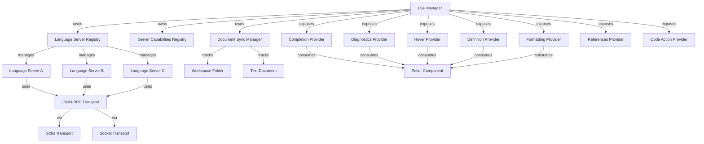

# 57. Ground Level: Language Server Protocol Integration

## Purpose

This document details the low-level implementation details of the Language Server Protocol (LSP) integration in Zed, focusing on how it should be rebuilt in Swift. LSP provides language intelligence features such as code completion, diagnostics, go-to-definition, and more. This document explains the core architecture, communication protocols, and necessary components to create a performant, stable LSP client implementation in Swift that can interact with various language servers while maintaining the editor's responsiveness.

## Core Concepts

### LSP Communication

The Language Server Protocol defines a communication protocol between development tools and language servers:

- **JSON-RPC**: The underlying protocol used for communication
- **Request-Response Pattern**: Synchronous communication for lookups
- **Notification Pattern**: Asynchronous updates with no response
- **Server Lifecycle**: Initialize, start, shutdown, and exit phases
- **Document Synchronization**: Keeping server's document state in sync with editor

### Document Management

Language servers need to track document states for analysis:

- **Text Synchronization**: Full or incremental updates of buffer content
- **Buffer Mapping**: Mapping editor buffers to LSP documents
- **Version Tracking**: Preventing race conditions with document versions

### Feature Integration

LSP offers a range of language intelligence features that need integration:

- **Diagnostics**: Errors, warnings, and hints
- **Code Completion**: Contextual code suggestions
- **Go to Definition**: Navigating to symbol definitions
- **Hover Information**: Documentation and type information
- **Code Actions**: Quick fixes and refactoring options
- **Formatting**: Code formatting capabilities

## Architecture



## Implementation Details

### LSP Manager

The `LSPManager` class serves as the main entry point for the LSP subsystem:

```swift
final class LSPManager: Actor {
    private let languageServerRegistry: LanguageServerRegistry
    private let documentSyncManager: DocumentSyncManager
    private let workspaceFolder: URL
    
    init(workspaceFolder: URL) {
        self.workspaceFolder = workspaceFolder
        self.languageServerRegistry = LanguageServerRegistry()
        self.documentSyncManager = DocumentSyncManager()
    }
    
    func registerServerForLanguage(
        _ language: Language,
        serverPath: String,
        serverArgs: [String] = [],
        initializationOptions: [String: Any]? = nil
    ) async throws {
        // Check if a server is already registered for this language
        if await languageServerRegistry.hasServer(for: language) {
            throw LSPError.serverAlreadyRegistered(language)
        }
        
        // Create and initialize the language server
        let server = try await LanguageServer(
            language: language,
            serverPath: serverPath,
            serverArgs: serverArgs,
            workspaceFolder: workspaceFolder,
            initializationOptions: initializationOptions
        )
        
        // Register the server
        await languageServerRegistry.register(server: server, for: language)
        
        // Synchronize open documents
        let documents = await documentSyncManager.allDocuments()
        for document in documents where document.language == language {
            await server.openDocument(document)
        }
    }
    
    func didOpenDocument(_ document: TextDocument) async {
        // Add document to sync manager
        await documentSyncManager.add(document)
        
        // Inform all relevant language servers
        if let server = await languageServerRegistry.server(for: document.language) {
            await server.openDocument(document)
        }
    }
    
    func didChangeDocument(_ document: TextDocument, changes: [TextDocumentChange]) async {
        // Update document in sync manager
        await documentSyncManager.update(document, changes: changes)
        
        // Notify relevant language server
        if let server = await languageServerRegistry.server(for: document.language) {
            await server.changeDocument(document, changes: changes)
        }
    }
    
    func didCloseDocument(_ document: TextDocument) async {
        // Remove document from sync manager
        await documentSyncManager.remove(document)
        
        // Notify relevant language server
        if let server = await languageServerRegistry.server(for: document.language) {
            await server.closeDocument(document)
        }
    }
    
    func provideCompletions(
        for document: TextDocument,
        at position: Position,
        context: CompletionContext? = nil
    ) async throws -> [CompletionItem] {
        guard let server = await languageServerRegistry.server(for: document.language) else {
            throw LSPError.noServerForLanguage(document.language)
        }
        
        guard await server.hasCapability(.completion) else {
            throw LSPError.capabilityNotSupported(.completion)
        }
        
        return try await server.completion(document: document, position: position, context: context)
    }
    
    func provideDefinition(
        for document: TextDocument,
        at position: Position
    ) async throws -> [Location] {
        guard let server = await languageServerRegistry.server(for: document.language) else {
            throw LSPError.noServerForLanguage(document.language)
        }
        
        guard await server.hasCapability(.definition) else {
            throw LSPError.capabilityNotSupported(.definition)
        }
        
        return try await server.definition(document: document, position: position)
    }
    
    // Additional provider methods for other LSP features...
}
```

### Language Server

The `LanguageServer` class represents a connection to a specific language server process:

```swift
// Enum for server capabilities
enum ServerCapability: String {
    case completion = "completionProvider"
    case definition = "definitionProvider"
    case references = "referencesProvider"
    case hover = "hoverProvider"
    case formatting = "documentFormattingProvider"
    case codeAction = "codeActionProvider"
    // Add other capabilities as needed
}

final class LanguageServer: Actor {
    private let language: Language
    private let serverPath: String
    private let serverArgs: [String]
    private let workspaceFolder: URL
    private let initializationOptions: [String: Any]?
    
    private var process: Process?
    private var transport: LSPTransport?
    private var capabilities: [ServerCapability: Any] = [:]
    private var pendingRequests: [Int: (Result<Any, Error>) -> Void] = [:]
    private var nextRequestId = 1
    private var isInitialized = false
    private var isShuttingDown = false
    
    private var documentVersions: [DocumentUri: Int] = [:]
    
    init(
        language: Language,
        serverPath: String,
        serverArgs: [String],
        workspaceFolder: URL,
        initializationOptions: [String: Any]? = nil
    ) async throws {
        self.language = language
        self.serverPath = serverPath
        self.serverArgs = serverArgs
        self.workspaceFolder = workspaceFolder
        self.initializationOptions = initializationOptions
        
        try await start()
    }
    
    // Server lifecycle methods
    
    private func start() async throws {
        // Create process
        let process = Process()
        process.executableURL = URL(fileURLWithPath: serverPath)
        process.arguments = serverArgs
        
        // Create pipes for stdio
        let stdinPipe = Pipe()
        let stdoutPipe = Pipe()
        let stderrPipe = Pipe()
        
        process.standardInput = stdinPipe
        process.standardOutput = stdoutPipe
        process.standardError = stderrPipe
        
        // Create transport
        let transport = StdioTransport(
            stdinPipe: stdinPipe,
            stdoutPipe: stdoutPipe
        )
        
        // Set up message handling
        transport.onMessage = { [weak self] message in
            Task { [weak self] in
                await self?.handleMessage(message)
            }
        }
        
        transport.onError = { [weak self] error in
            Task { [weak self] in
                await self?.handleTransportError(error)
            }
        }
        
        // Start the process
        try process.run()
        
        // Save references
        self.process = process
        self.transport = transport
        
        // Initialize the server
        try await initialize()
    }
    
    private func initialize() async throws {
        // Prepare initialization params
        let params: [String: Any] = [
            "processId": ProcessInfo.processInfo.processIdentifier,
            "rootUri": workspaceFolder.absoluteString,
            "capabilities": [
                "workspace": [
                    "applyEdit": true,
                    "configuration": true,
                    "didChangeConfiguration": true,
                    "didChangeWatchedFiles": true,
                    "executeCommand": true,
                    "symbol": true,
                    "workspaceFolders": true
                ],
                "textDocument": [
                    "codeAction": true,
                    "completion": [
                        "completionItem": [
                            "snippetSupport": true,
                            "documentationFormat": ["markdown", "plaintext"],
                            "deprecatedSupport": true,
                            "preselectSupport": true
                        ]
                    ],
                    "definition": true,
                    "documentHighlight": true,
                    "documentSymbol": true,
                    "formatting": true,
                    "hover": [
                        "contentFormat": ["markdown", "plaintext"]
                    ],
                    "rangeFormatting": true,
                    "references": true,
                    "rename": true,
                    "synchronization": [
                        "didSave": true,
                        "dynamicRegistration": true,
                        "willSave": true,
                        "willSaveWaitUntil": true
                    ]
                ]
            ],
            "initializationOptions": initializationOptions ?? [:]
        ]
        
        // Send initialization request
        let response = try await sendRequest(method: "initialize", params: params)
        
        // Extract server capabilities
        if let result = response as? [String: Any],
           let capabilities = result["capabilities"] as? [String: Any] {
            parseCapabilities(capabilities)
        }
        
        // Send initialized notification
        sendNotification(method: "initialized", params: [:])
        
        // Mark as initialized
        isInitialized = true
    }
    
    func shutdown() async throws {
        guard !isShuttingDown else { return }
        isShuttingDown = true
        
        // Send shutdown request
        if isInitialized {
            _ = try? await sendRequest(method: "shutdown", params: nil)
            sendNotification(method: "exit", params: nil)
        }
        
        // Clean up resources
        transport?.close()
        transport = nil
        
        process?.terminate()
        process = nil
        
        // Clear state
        pendingRequests.removeAll()
        capabilities.removeAll()
        documentVersions.removeAll()
        isInitialized = false
    }
    
    deinit {
        // Ensure resources are cleaned up
        Task {
            try? await shutdown()
        }
    }
    
    // Communication methods
    
    private func sendRequest(method: String, params: Any?) async throws -> Any {
        guard let transport = transport, !isShuttingDown else {
            throw LSPError.serverNotRunning
        }
        
        let requestId = nextRequestId
        nextRequestId += 1
        
        let message: [String: Any] = [
            "jsonrpc": "2.0",
            "id": requestId,
            "method": method,
            "params": params ?? NSNull()
        ]
        
        return try await withCheckedThrowingContinuation { continuation in
            pendingRequests[requestId] = continuation.resume(with:)
            
            do {
                try transport.send(message)
            } catch {
                pendingRequests.removeValue(forKey: requestId)
                continuation.resume(throwing: error)
            }
        }
    }
    
    private func sendNotification(method: String, params: Any?) {
        guard let transport = transport, !isShuttingDown else {
            return
        }
        
        let message: [String: Any] = [
            "jsonrpc": "2.0",
            "method": method,
            "params": params ?? NSNull()
        ]
        
        try? transport.send(message)
    }
    
    private func handleMessage(_ message: [String: Any]) async {
        // Handle response messages
        if let id = message["id"] as? Int {
            if let result = message["result"] {
                if let callback = pendingRequests.removeValue(forKey: id) {
                    callback(.success(result))
                }
            } else if let error = message["error"] as? [String: Any] {
                if let callback = pendingRequests.removeValue(forKey: id) {
                    let code = error["code"] as? Int ?? -1
                    let message = error["message"] as? String ?? "Unknown error"
                    let data = error["data"]
                    callback(.failure(LSPError.serverError(code: code, message: message, data: data)))
                }
            }
        }
        // Handle notification messages
        else if let method = message["method"] as? String, 
                let params = message["params"] {
            await handleNotification(method: method, params: params)
        }
    }
    
    private func handleNotification(method: String, params: Any) async {
        switch method {
        case "textDocument/publishDiagnostics":
            await handleDiagnostics(params: params)
        // Handle other notifications
        default:
            break
        }
    }
    
    private func handleDiagnostics(params: Any) async {
        guard let params = params as? [String: Any],
              let uri = params["uri"] as? String,
              let diagnostics = params["diagnostics"] as? [[String: Any]] else {
            return
        }
        
        let parsedDiagnostics = diagnostics.compactMap { Diagnostic(json: $0) }
        
        // Notify diagnostic updates
        NotificationCenter.default.post(
            name: .lspDiagnosticsReceived,
            object: nil,
            userInfo: [
                "uri": uri,
                "diagnostics": parsedDiagnostics
            ]
        )
    }
    
    private func handleTransportError(_ error: Error) async {
        // Log error
        print("LSP transport error: \(error.localizedDescription)")
        
        // Attempt to restart server if not shutting down
        if !isShuttingDown {
            // Implement restart logic
        }
    }
    
    // Capability handling
    
    private func parseCapabilities(_ capabilities: [String: Any]) {
        for capability in ServerCapability.allCases {
            if let value = capabilities[capability.rawValue] {
                self.capabilities[capability] = value
            }
        }
    }
    
    func hasCapability(_ capability: ServerCapability) -> Bool {
        return capabilities[capability] != nil
    }
    
    // Document synchronization
    
    func openDocument(_ document: TextDocument) async {
        let version = documentVersions[document.uri] ?? 1
        documentVersions[document.uri] = version
        
        sendNotification(
            method: "textDocument/didOpen",
            params: [
                "textDocument": [
                    "uri": document.uri,
                    "languageId": document.language.identifier,
                    "version": version,
                    "text": document.text
                ]
            ]
        )
    }
    
    func changeDocument(_ document: TextDocument, changes: [TextDocumentChange]) async {
        guard var version = documentVersions[document.uri] else {
            return
        }
        
        version += 1
        documentVersions[document.uri] = version
        
        let textDocumentSyncKind = await getTextDocumentSyncKind()
        
        switch textDocumentSyncKind {
        case 1: // Full
            sendNotification(
                method: "textDocument/didChange",
                params: [
                    "textDocument": [
                        "uri": document.uri,
                        "version": version
                    ],
                    "contentChanges": [
                        ["text": document.text]
                    ]
                ]
            )
            
        case 2: // Incremental
            let contentChanges = changes.map { change -> [String: Any] in
                var result: [String: Any] = [
                    "text": change.text
                ]
                
                if let range = change.range {
                    result["range"] = [
                        "start": [
                            "line": range.start.line,
                            "character": range.start.character
                        ],
                        "end": [
                            "line": range.end.line,
                            "character": range.end.character
                        ]
                    ]
                }
                
                return result
            }
            
            sendNotification(
                method: "textDocument/didChange",
                params: [
                    "textDocument": [
                        "uri": document.uri,
                        "version": version
                    ],
                    "contentChanges": contentChanges
                ]
            )
            
        default:
            // No synchronization
            break
        }
    }
    
    func closeDocument(_ document: TextDocument) async {
        documentVersions.removeValue(forKey: document.uri)
        
        sendNotification(
            method: "textDocument/didClose",
            params: [
                "textDocument": [
                    "uri": document.uri
                ]
            ]
        )
    }
    
    private func getTextDocumentSyncKind() -> Int {
        // Extract textDocumentSync capability
        if let textDocumentSync = capabilities[.textDocumentSync] {
            if let kind = textDocumentSync as? Int {
                return kind
            } else if let syncDict = textDocumentSync as? [String: Any],
                      let kind = syncDict["change"] as? Int {
                return kind
            }
        }
        
        // Default to full sync (1)
        return 1
    }
    
    // Language features
    
    func completion(
        document: TextDocument,
        position: Position,
        context: CompletionContext? = nil
    ) async throws -> [CompletionItem] {
        var params: [String: Any] = [
            "textDocument": [
                "uri": document.uri
            ],
            "position": [
                "line": position.line,
                "character": position.character
            ]
        ]
        
        if let context = context {
            params["context"] = [
                "triggerKind": context.triggerKind.rawValue,
                "triggerCharacter": context.triggerCharacter
            ]
        }
        
        let response = try await sendRequest(
            method: "textDocument/completion",
            params: params
        )
        
        // Parse response
        if let resultDict = response as? [String: Any] {
            if let items = resultDict["items"] as? [[String: Any]] {
                return items.compactMap { CompletionItem(json: $0) }
            } else if let isIncomplete = resultDict["isIncomplete"] as? Bool,
                      isIncomplete == false {
                // Empty completion list
                return []
            }
        } else if let items = response as? [[String: Any]] {
            return items.compactMap { CompletionItem(json: $0) }
        }
        
        return []
    }
    
    func definition(
        document: TextDocument,
        position: Position
    ) async throws -> [Location] {
        let params: [String: Any] = [
            "textDocument": [
                "uri": document.uri
            ],
            "position": [
                "line": position.line,
                "character": position.character
            ]
        ]
        
        let response = try await sendRequest(
            method: "textDocument/definition",
            params: params
        )
        
        // Parse response
        if let locationDict = response as? [String: Any] {
            // Single location
            if let location = Location(json: locationDict) {
                return [location]
            }
        } else if let locationArray = response as? [[String: Any]] {
            // Multiple locations
            return locationArray.compactMap { Location(json: $0) }
        }
        
        return []
    }
    
    // Add other language feature methods (hover, references, etc.)
}
```

### LSP Transport

The LSP transport layer handles communication with language servers:

```swift
protocol LSPTransport {
    var onMessage: (([String: Any]) -> Void)? { get set }
    var onError: ((Error) -> Void)? { get set }
    
    func send(_ message: [String: Any]) throws
    func close()
}

final class StdioTransport: LSPTransport {
    var onMessage: (([String: Any]) -> Void)?
    var onError: ((Error) -> Void)?
    
    private let stdinPipe: Pipe
    private let stdoutPipe: Pipe
    private let readQueue = DispatchQueue(label: "com.zed.lsp.stdio.read")
    private var buffer = Data()
    private var isReading = false
    
    init(stdinPipe: Pipe, stdoutPipe: Pipe) {
        self.stdinPipe = stdinPipe
        self.stdoutPipe = stdoutPipe
        
        setupReader()
    }
    
    private func setupReader() {
        readQueue.async { [weak self] in
            guard let self = self else { return }
            self.isReading = true
            self.readMessages()
        }
    }
    
    private func readMessages() {
        while isReading {
            do {
                let availableData = try stdoutPipe.fileHandleForReading.read(upToCount: 4096)
                
                guard let data = availableData, !data.isEmpty else {
                    // No data or EOF, break the loop
                    isReading = false
                    break
                }
                
                buffer.append(data)
                processBuffer()
            } catch {
                onError?(error)
                isReading = false
                break
            }
        }
    }
    
    private func processBuffer() {
        while true {
            // Find the Content-Length header
            guard let headerEnd = buffer.range(of: "\r\n\r\n".data(using: .utf8)!) else {
                break
            }
            
            let headerData = buffer.subdata(in: 0..<headerEnd.lowerBound)
            guard let headerString = String(data: headerData, encoding: .utf8) else {
                buffer.removeSubrange(0..<headerEnd.upperBound)
                continue
            }
            
            // Find the Content-Length value
            let pattern = "Content-Length:\\s*(\\d+)"
            guard let regex = try? NSRegularExpression(pattern: pattern, options: []),
                  let match = regex.firstMatch(
                      in: headerString,
                      options: [],
                      range: NSRange(headerString.startIndex..., in: headerString)
                  ),
                  let contentLengthRange = Range(match.range(at: 1), in: headerString),
                  let contentLength = Int(headerString[contentLengthRange]) else {
                buffer.removeSubrange(0..<headerEnd.upperBound)
                continue
            }
            
            // Check if we have enough data
            let messageStart = headerEnd.upperBound
            let messageEnd = messageStart + contentLength
            
            if buffer.count >= messageEnd {
                let messageData = buffer.subdata(in: messageStart..<messageEnd)
                
                // Parse the JSON message
                do {
                    if let message = try JSONSerialization.jsonObject(with: messageData) as? [String: Any] {
                        onMessage?(message)
                    }
                } catch {
                    onError?(error)
                }
                
                buffer.removeSubrange(0..<messageEnd)
            } else {
                // Not enough data yet
                break
            }
        }
    }
    
    func send(_ message: [String: Any]) throws {
        // Serialize the message to JSON
        let messageData = try JSONSerialization.data(withJSONObject: message)
        
        // Create the header
        let header = "Content-Length: \(messageData.count)\r\n\r\n"
        guard let headerData = header.data(using: .utf8) else {
            throw LSPError.invalidMessage
        }
        
        // Write header and message
        stdinPipe.fileHandleForWriting.write(headerData)
        stdinPipe.fileHandleForWriting.write(messageData)
    }
    
    func close() {
        isReading = false
        // Close pipes
        try? stdinPipe.fileHandleForWriting.close()
        try? stdoutPipe.fileHandleForReading.close()
    }
}
```

### Document Synchronization

The `DocumentSyncManager` maintains the state of documents:

```swift
struct TextDocument {
    let uri: DocumentUri
    let language: Language
    let text: String
    let version: Int
}

struct TextDocumentChange {
    let range: Range<Position>?
    let text: String
}

actor DocumentSyncManager {
    private var documents: [DocumentUri: TextDocument] = [:]
    
    func add(_ document: TextDocument) {
        documents[document.uri] = document
    }
    
    func update(_ document: TextDocument, changes: [TextDocumentChange]) {
        documents[document.uri] = document
    }
    
    func get(_ uri: DocumentUri) -> TextDocument? {
        return documents[uri]
    }
    
    func remove(_ document: TextDocument) {
        documents.removeValue(forKey: document.uri)
    }
    
    func allDocuments() -> [TextDocument] {
        return Array(documents.values)
    }
}
```

### Language Server Registry

The `LanguageServerRegistry` manages the available language servers:

```swift
actor LanguageServerRegistry {
    private var servers: [Language: LanguageServer] = [:]
    
    func register(server: LanguageServer, for language: Language) {
        servers[language] = server
    }
    
    func unregister(language: Language) async throws {
        if let server = servers[language] {
            try await server.shutdown()
            servers.removeValue(forKey: language)
        }
    }
    
    func server(for language: Language) -> LanguageServer? {
        return servers[language]
    }
    
    func hasServer(for language: Language) -> Bool {
        return servers[language] != nil
    }
    
    func allServers() -> [LanguageServer] {
        return Array(servers.values)
    }
    
    func shutdown() async {
        for server in servers.values {
            try? await server.shutdown()
        }
        servers.removeAll()
    }
}
```

### LSP Types

Common LSP types that need to be implemented:

```swift
typealias DocumentUri = String

struct Position: Codable, Equatable {
    let line: Int
    let character: Int
}

struct Range: Codable, Equatable {
    let start: Position
    let end: Position
}

struct Location: Codable {
    let uri: DocumentUri
    let range: Range
    
    init?(json: [String: Any]) {
        guard let uri = json["uri"] as? String,
              let rangeDict = json["range"] as? [String: Any],
              let startDict = rangeDict["start"] as? [String: Any],
              let endDict = rangeDict["end"] as? [String: Any],
              let startLine = startDict["line"] as? Int,
              let startChar = startDict["character"] as? Int,
              let endLine = endDict["line"] as? Int,
              let endChar = endDict["character"] as? Int else {
            return nil
        }
        
        self.uri = uri
        self.range = Range(
            start: Position(line: startLine, character: startChar),
            end: Position(line: endLine, character: endChar)
        )
    }
}

struct CompletionContext {
    enum TriggerKind: Int {
        case invoked = 1
        case triggerCharacter = 2
        case triggerForIncompleteCompletions = 3
    }
    
    let triggerKind: TriggerKind
    let triggerCharacter: String?
}

struct CompletionItem: Codable {
    let label: String
    let kind: Int?
    let detail: String?
    let documentation: CompletionDocumentation?
    let filterText: String?
    let insertText: String?
    let insertTextFormat: Int?
    let sortText: String?
    let preselect: Bool?
    let deprecated: Bool?
    
    init?(json: [String: Any]) {
        guard let label = json["label"] as? String else {
            return nil
        }
        
        self.label = label
        self.kind = json["kind"] as? Int
        self.detail = json["detail"] as? String
        self.filterText = json["filterText"] as? String
        self.insertText = json["insertText"] as? String
        self.insertTextFormat = json["insertTextFormat"] as? Int
        self.sortText = json["sortText"] as? String
        self.preselect = json["preselect"] as? Bool
        self.deprecated = json["deprecated"] as? Bool
        
        // Parse documentation
        if let doc = json["documentation"] {
            if let docString = doc as? String {
                self.documentation = .plainText(docString)
            } else if let docDict = doc as? [String: Any],
                      let value = docDict["value"] as? String {
                if let kind = docDict["kind"] as? String, kind == "markdown" {
                    self.documentation = .markdown(value)
                } else {
                    self.documentation = .plainText(value)
                }
            } else {
                self.documentation = nil
            }
        } else {
            self.documentation = nil
        }
    }
}

enum CompletionDocumentation: Codable {
    case plainText(String)
    case markdown(String)
    
    var text: String {
        switch self {
        case .plainText(let text), .markdown(let text):
            return text
        }
    }
}

struct Diagnostic: Codable {
    enum Severity: Int, Codable {
        case error = 1
        case warning = 2
        case information = 3
        case hint = 4
    }
    
    let range: Range
    let severity: Severity?
    let code: String?
    let source: String?
    let message: String
    
    init?(json: [String: Any]) {
        guard let rangeDict = json["range"] as? [String: Any],
              let startDict = rangeDict["start"] as? [String: Any],
              let endDict = rangeDict["end"] as? [String: Any],
              let startLine = startDict["line"] as? Int,
              let startChar = startDict["character"] as? Int,
              let endLine = endDict["line"] as? Int,
              let endChar = endDict["character"] as? Int,
              let message = json["message"] as? String else {
            return nil
        }
        
        self.range = Range(
            start: Position(line: startLine, character: startChar),
            end: Position(line: endLine, character: endChar)
        )
        
        if let severityInt = json["severity"] as? Int,
           let severity = Severity(rawValue: severityInt) {
            self.severity = severity
        } else {
            self.severity = nil
        }
        
        self.code = json["code"] as? String
        self.source = json["source"] as? String
        self.message = message
    }
}

// Add other LSP types (HoverResult, SymbolInformation, etc.)
```

### Error Handling

Properly structured errors for LSP operations:

```swift
enum LSPError: Error, LocalizedError {
    case serverNotRunning
    case transportError(Error)
    case invalidMessage
    case requestFailed(String)
    case serverError(code: Int, message: String, data: Any? = nil)
    case noServerForLanguage(Language)
    case serverAlreadyRegistered(Language)
    case capabilityNotSupported(ServerCapability)
    
    var errorDescription: String? {
        switch self {
        case .serverNotRunning:
            return "Language server is not running"
        case .transportError(let error):
            return "LSP transport error: \(error.localizedDescription)"
        case .invalidMessage:
            return "Invalid LSP message"
        case .requestFailed(let reason):
            return "LSP request failed: \(reason)"
        case .serverError(let code, let message, _):
            return "LSP server error (\(code)): \(message)"
        case .noServerForLanguage(let language):
            return "No language server available for \(language.name)"
        case .serverAlreadyRegistered(let language):
            return "Language server already registered for \(language.name)"
        case .capabilityNotSupported(let capability):
            return "Language server does not support \(capability.rawValue)"
        }
    }
}
```

## Integration with Editor Components

### Completion Provider

The completion provider integrates LSP completions with the editor:

```swift
final class LSPCompletionProvider: CompletionProvider {
    private let lspManager: LSPManager
    
    init(lspManager: LSPManager) {
        self.lspManager = lspManager
    }
    
    func provideCompletions(
        for buffer: Buffer,
        at position: BufferPosition,
        context: EditorCompletionContext
    ) async -> [EditorCompletionItem] {
        // Convert Buffer to TextDocument
        guard let document = textDocumentForBuffer(buffer) else {
            return []
        }
        
        // Convert buffer position to LSP position
        let lspPosition = Position(
            line: position.line,
            character: position.column
        )
        
        // Create completion context if needed
        var lspContext: CompletionContext?
        if let triggerCharacter = context.triggerCharacter {
            lspContext = CompletionContext(
                triggerKind: .triggerCharacter,
                triggerCharacter: triggerCharacter
            )
        }
        
        // Request completions from LSP
        do {
            let completionItems = try await lspManager.provideCompletions(
                for: document,
                at: lspPosition,
                context: lspContext
            )
            
            // Convert to editor completion items
            return completionItems.map { item in
                EditorCompletionItem(
                    label: item.label,
                    kind: completionKindForLSPKind(item.kind),
                    detail: item.detail,
                    documentation: item.documentation?.text,
                    insertText: item.insertText ?? item.label,
                    sortText: item.sortText ?? item.label,
                    filterText: item.filterText ?? item.label,
                    deprecated: item.deprecated ?? false,
                    preselect: item.preselect ?? false
                )
            }
        } catch {
            print("LSP completion error: \(error.localizedDescription)")
            return []
        }
    }
    
    private func textDocumentForBuffer(_ buffer: Buffer) -> TextDocument? {
        guard let language = buffer.language,
              let uri = buffer.uri else {
            return nil
        }
        
        return TextDocument(
            uri: uri,
            language: language,
            text: buffer.text,
            version: buffer.version
        )
    }
    
    private func completionKindForLSPKind(_ kind: Int?) -> EditorCompletionKind {
        guard let kind = kind else {
            return .text
        }
        
        // Map LSP completion item kinds to editor completion kinds
        switch kind {
        case 1: return .text
        case 2: return .method
        case 3: return .function
        case 4: return .constructor
        case 5: return .field
        case 6: return .variable
        case 7: return .class
        case 8: return .interface
        case 9: return .module
        case 10: return .property
        case 11: return .unit
        case 12: return .value
        case 13: return .enum
        case 14: return .keyword
        case 15: return .snippet
        case 16: return .color
        case 17: return .file
        case 18: return .reference
        case 19: return .folder
        case 20: return .enumMember
        case 21: return .constant
        case 22: return .struct
        case 23: return .event
        case 24: return .operator
        case 25: return .typeParameter
        default: return .text
        }
    }
}
```

### Diagnostics Provider

The diagnostics provider presents LSP diagnostics in the editor:

```swift
final class LSPDiagnosticsProvider {
    private let lspManager: LSPManager
    private var diagnosticsByUri: [DocumentUri: [Diagnostic]] = [:]
    private var subscriptions: [AnyCancellable] = []
    
    init(lspManager: LSPManager) {
        self.lspManager = lspManager
        
        // Subscribe to diagnostic notifications
        NotificationCenter.default
            .publisher(for: .lspDiagnosticsReceived)
            .sink { [weak self] notification in
                guard let self = self,
                      let userInfo = notification.userInfo,
                      let uri = userInfo["uri"] as? String,
                      let diagnostics = userInfo["diagnostics"] as? [Diagnostic] else {
                    return
                }
                
                self.updateDiagnostics(uri: uri, diagnostics: diagnostics)
            }
            .store(in: &subscriptions)
    }
    
    private func updateDiagnostics(uri: DocumentUri, diagnostics: [Diagnostic]) {
        diagnosticsByUri[uri] = diagnostics
        
        // Notify editor of diagnostic update
        NotificationCenter.default.post(
            name: .editorDiagnosticsUpdated,
            object: nil,
            userInfo: [
                "uri": uri,
                "diagnostics": diagnostics.map { toEditorDiagnostic($0) }
            ]
        )
    }
    
    func getDiagnostics(for uri: DocumentUri) -> [EditorDiagnostic] {
        guard let diagnostics = diagnosticsByUri[uri] else {
            return []
        }
        
        return diagnostics.map { toEditorDiagnostic($0) }
    }
    
    private func toEditorDiagnostic(_ diagnostic: Diagnostic) -> EditorDiagnostic {
        let severity: EditorDiagnosticSeverity
        
        switch diagnostic.severity {
        case .error:
            severity = .error
        case .warning:
            severity = .warning
        case .information:
            severity = .information
        case .hint:
            severity = .hint
        case nil:
            severity = .error // Default to error if not specified
        }
        
        return EditorDiagnostic(
            range: BufferRange(
                start: BufferPosition(line: diagnostic.range.start.line, column: diagnostic.range.start.character),
                end: BufferPosition(line: diagnostic.range.end.line, column: diagnostic.range.end.character)
            ),
            severity: severity,
            message: diagnostic.message,
            source: diagnostic.source
        )
    }
}
```

## Swift-Specific Implementation Considerations

### Using Actors for Concurrency

Swift's actor model provides safe concurrency for LSP interactions:

```swift
actor LanguageServer {
    // State and methods from earlier LanguageServer class
    
    // Actor methods are implicitly async, ensuring only one
    // thread accesses the server's state at a time
}

// Calling an actor method implicitly awaits access
func example() async {
    let server = await languageServerRegistry.server(for: language)
    try await server?.completion(document: document, position: position)
}
```

### Swift Concurrency for Request Handling

Swift's structured concurrency simplifies LSP request/response handling:

```swift
func sendRequest(method: String, params: Any?) async throws -> Any {
    // Implementation using Swift's async/await pattern
    return try await withCheckedThrowingContinuation { continuation in
        let requestId = nextRequestId
        nextRequestId += 1
        
        pendingRequests[requestId] = continuation.resume(with:)
        
        do {
            try transport.send([
                "jsonrpc": "2.0",
                "id": requestId,
                "method": method,
                "params": params ?? NSNull()
            ])
        } catch {
            pendingRequests.removeValue(forKey: requestId)
            continuation.resume(throwing: error)
        }
    }
}
```

### Task Management for Background Processing

Managing task lifetimes for LSP operations:

```swift
final class LSPTaskManager {
    private var activeTasks: [UUID: Task<Void, Error>] = [:]
    
    func startTask(for key: UUID, operation: @escaping () async throws -> Void) {
        // Cancel existing task if present
        activeTasks[key]?.cancel()
        
        // Start new task
        let task = Task {
            try await operation()
        }
        
        activeTasks[key] = task
        
        // Set up automatic cleanup when task completes
        Task {
            do {
                _ = try await task.value
            } catch {
                print("Task failed: \(error.localizedDescription)")
            }
            
            // Only remove if it's still the same task
            if activeTasks[key]?.isCancelled == task.isCancelled {
                activeTasks.removeValue(forKey: key)
            }
        }
    }
    
    func cancelTask(for key: UUID) {
        activeTasks[key]?.cancel()
        activeTasks.removeValue(forKey: key)
    }
    
    func cancelAllTasks() {
        for task in activeTasks.values {
            task.cancel()
        }
        activeTasks.removeAll()
    }
}
```

### Memory Management with ARC

Careful memory management is important for long-running LSP sessions:

```swift
final class LSPSession {
    // Weak references to prevent reference cycles
    private weak var document: Document?
    
    // Task storage to prevent tasks from being cancelled prematurely
    private var serverTask: Task<Void, Error>?
    
    // Clean up resources in deinit
    deinit {
        serverTask?.cancel()
        serverTask = nil
    }
    
    func startSession(document: Document) {
        self.document = document
        
        // Store the task to keep it alive
        serverTask = Task {
            // Long-running server session...
        }
    }
}
```

### Type-Safe JSON Handling

Leverage Swift's Codable for safer JSON handling:

```swift
// Type-safe JSON encoding/decoding for LSP messages
struct LSPNotification<T: Encodable>: Encodable {
    let jsonrpc: String = "2.0"
    let method: String
    let params: T
}

struct LSPRequest<T: Encodable>: Encodable {
    let jsonrpc: String = "2.0"
    let id: Int
    let method: String
    let params: T
}

struct LSPResponse<T: Decodable>: Decodable {
    let jsonrpc: String
    let id: Int
    let result: T?
    let error: LSPError?
    
    struct LSPError: Decodable {
        let code: Int
        let message: String
        let data: AnyCodable?
    }
}
```

## Performance Considerations

### 1. Efficient Text Synchronization

Incremental updates significantly reduce bandwidth and processing:

```swift
func optimizedChangeDocument(_ document: TextDocument, changes: [TextDocumentChange]) async {
    guard var version = documentVersions[document.uri] else {
        return
    }
    
    version += 1
    documentVersions[document.uri] = version
    
    // Decide whether to use incremental or full sync based on change size
    let totalChangeSize = changes.reduce(0) { $0 + ($1.text.count) }
    let isLargeChange = totalChangeSize > document.text.count / 3
    
    if isLargeChange {
        // For large changes, full sync may be more efficient
        sendNotification(
            method: "textDocument/didChange",
            params: [
                "textDocument": [
                    "uri": document.uri,
                    "version": version
                ],
                "contentChanges": [
                    ["text": document.text]
                ]
            ]
        )
    } else {
        // For small changes, use incremental sync
        let contentChanges = changes.map { change -> [String: Any] in
            var result: [String: Any] = [
                "text": change.text
            ]
            
            if let range = change.range {
                result["range"] = [
                    "start": [
                        "line": range.start.line,
                        "character": range.start.character
                    ],
                    "end": [
                        "line": range.end.line,
                        "character": range.end.character
                    ]
                ]
            }
            
            return result
        }
        
        sendNotification(
            method: "textDocument/didChange",
            params: [
                "textDocument": [
                    "uri": document.uri,
                    "version": version
                ],
                "contentChanges": contentChanges
            ]
        )
    }
}
```

### 2. Request Debouncing

Debounce requests to avoid overwhelming language servers:

```swift
final class RequestDebouncer {
    private var scheduledWork: [String: Task<Void, Never>] = [:]
    private let debounceInterval: TimeInterval
    
    init(debounceInterval: TimeInterval) {
        self.debounceInterval = debounceInterval
    }
    
    func debounce(
        identifier: String,
        operation: @escaping () async -> Void
    ) {
        // Cancel previous operation if it exists
        scheduledWork[identifier]?.cancel()
        
        // Schedule new operation
        let task = Task {
            do {
                try await Task.sleep(nanoseconds: UInt64(debounceInterval * 1_000_000_000))
                if !Task.isCancelled {
                    await operation()
                }
            } catch {
                // Task was cancelled, do nothing
            }
            
            if scheduledWork[identifier]?.isCancelled != false {
                scheduledWork.removeValue(forKey: identifier)
            }
        }
        
        scheduledWork[identifier] = task
    }
    
    func cancelAll() {
        for task in scheduledWork.values {
            task.cancel()
        }
        scheduledWork.removeAll()
    }
}
```

### 3. Request Queue with Priorities

Prioritize interactive requests over background processing:

```swift
actor RequestQueue {
    enum Priority: Int, Comparable {
        case low = 0
        case normal = 1
        case high = 2
        
        static func < (lhs: Priority, rhs: Priority) -> Bool {
            return lhs.rawValue < rhs.rawValue
        }
    }
    
    private struct QueuedRequest {
        let id: UUID
        let priority: Priority
        let operation: () async throws -> Any
        let continuation: CheckedContinuation<Any, Error>
    }
    
    private var queue: [QueuedRequest] = []
    private var isProcessing = false
    
    func enqueue<T>(
        priority: Priority = .normal,
        operation: @escaping () async throws -> T
    ) async throws -> T {
        return try await withCheckedThrowingContinuation { continuation in
            let request = QueuedRequest(
                id: UUID(),
                priority: priority,
                operation: { try await operation() },
                continuation: continuation as! CheckedContinuation<Any, Error>
            )
            
            // Insert according to priority (higher priorities first)
            if let index = queue.firstIndex(where: { $0.priority < request.priority }) {
                queue.insert(request, at: index)
            } else {
                queue.append(request)
            }
            
            // Start processing if not already doing so
            if !isProcessing {
                processQueue()
            }
        } as! T
    }
    
    private func processQueue() {
        guard !isProcessing, !queue.isEmpty else {
            return
        }
        
        isProcessing = true
        
        Task {
            while !queue.isEmpty {
                let request = queue.removeFirst()
                
                do {
                    let result = try await request.operation()
                    request.continuation.resume(returning: result)
                } catch {
                    request.continuation.resume(throwing: error)
                }
            }
            
            isProcessing = false
        }
    }
}
```

### 4. Completion Caching

Cache completion results to improve responsiveness:

```swift
final class CompletionCache {
    private struct CacheKey: Hashable {
        let documentUri: String
        let line: Int
        let character: Int
        let prefix: String
    }
    
    private var cache: [CacheKey: [CompletionItem]] = [:]
    private let maxCacheItems = 50
    private var cacheOrder: [CacheKey] = []
    
    func getCachedCompletions(
        documentUri: String,
        position: Position,
        prefix: String
    ) -> [CompletionItem]? {
        let key = CacheKey(
            documentUri: documentUri,
            line: position.line,
            character: position.character,
            prefix: prefix
        )
        
        return cache[key]
    }
    
    func cacheCompletions(
        documentUri: String,
        position: Position,
        prefix: String,
        completions: [CompletionItem]
    ) {
        let key = CacheKey(
            documentUri: documentUri,
            line: position.line,
            character: position.character,
            prefix: prefix
        )
        
        // Add to cache
        cache[key] = completions
        
        // Update cache order for LRU eviction
        if let existingIndex = cacheOrder.firstIndex(of: key) {
            cacheOrder.remove(at: existingIndex)
        }
        cacheOrder.append(key)
        
        // Evict old items if cache is too large
        while cacheOrder.count > maxCacheItems {
            let oldestKey = cacheOrder.removeFirst()
            cache.removeValue(forKey: oldestKey)
        }
    }
    
    func invalidateCache(documentUri: String) {
        // Remove all items for this document
        let keysToRemove = cache.keys.filter { $0.documentUri == documentUri }
        
        for key in keysToRemove {
            cache.removeValue(forKey: key)
            if let index = cacheOrder.firstIndex(of: key) {
                cacheOrder.remove(at: index)
            }
        }
    }
}
```

## Integration with Other Systems

### Buffer System Integration

Interface with the editor's buffer system:

```swift
extension LSPManager {
    func registerBuffer(_ buffer: Buffer) async {
        // Convert buffer to TextDocument
        guard let language = buffer.language,
              let uri = buffer.uri else {
            return
        }
        
        let document = TextDocument(
            uri: uri,
            language: language,
            text: buffer.text,
            version: buffer.version
        )
        
        // Notify LSP manager
        await didOpenDocument(document)
        
        // Set up buffer change monitoring
        buffer.onDidChange = { [weak self] changes in
            guard let self = self else { return }
            
            // Update document
            let updatedDocument = TextDocument(
                uri: uri,
                language: language,
                text: buffer.text,
                version: buffer.version
            )
            
            // Convert changes
            let lspChanges = changes.map { change in
                TextDocumentChange(
                    range: change.range.map { range in
                        Range(
                            start: Position(line: range.start.line, character: range.start.column),
                            end: Position(line: range.end.line, character: range.end.column)
                        )
                    },
                    text: change.text
                )
            }
            
            Task {
                await self.didChangeDocument(updatedDocument, changes: lspChanges)
            }
        }
        
        buffer.onDidClose = { [weak self] in
            guard let self = self else { return }
            
            Task {
                await self.didCloseDocument(document)
            }
        }
    }
}
```

### Editor Command Integration

Integrate LSP commands with the editor's command system:

```swift
extension LSPManager {
    func registerCommands(in commandRegistry: CommandRegistry) {
        commandRegistry.register(command: "lsp.goToDefinition") { [weak self] context in
            guard let self = self,
                  let buffer = context.buffer,
                  let cursor = context.cursor else {
                return
            }
            
            Task {
                await self.executeGoToDefinition(buffer: buffer, cursor: cursor)
            }
        }
        
        commandRegistry.register(command: "lsp.findReferences") { [weak self] context in
            guard let self = self,
                  let buffer = context.buffer,
                  let cursor = context.cursor else {
                return
            }
            
            Task {
                await self.executeFindReferences(buffer: buffer, cursor: cursor)
            }
        }
        
        // Register other LSP commands
    }
    
    private func executeGoToDefinition(buffer: Buffer, cursor: BufferPosition) async {
        guard let language = buffer.language,
              let uri = buffer.uri,
              let server = await languageServerRegistry.server(for: language) else {
            return
        }
        
        let document = TextDocument(
            uri: uri,
            language: language,
            text: buffer.text,
            version: buffer.version
        )
        
        let position = Position(line: cursor.line, character: cursor.column)
        
        do {
            let locations = try await server.definition(document: document, position: position)
            
            if let location = locations.first {
                // Navigate to location
                NotificationCenter.default.post(
                    name: .navigateToLocation,
                    object: nil,
                    userInfo: ["location": location]
                )
            }
        } catch {
            print("Go to definition failed: \(error.localizedDescription)")
        }
    }
}
```

### Workspace Management Integration

Integrate with the editor's workspace system:

```swift
final class WorkspaceManager {
    private let lspManager: LSPManager
    
    init(lspManager: LSPManager) {
        self.lspManager = lspManager
    }
    
    func didOpenWorkspace(at path: URL) async {
        // Register language servers based on workspace content
        do {
            // Scan workspace for language types
            let languages = try await detectLanguagesInWorkspace(path)
            
            // Initialize appropriate language servers
            for language in languages {
                if let serverConfig = serverConfigForLanguage(language) {
                    try await lspManager.registerServerForLanguage(
                        language,
                        serverPath: serverConfig.path,
                        serverArgs: serverConfig.args,
                        initializationOptions: serverConfig.initOptions
                    )
                }
            }
        } catch {
            print("Failed to initialize workspace language servers: \(error.localizedDescription)")
        }
    }
    
    private func detectLanguagesInWorkspace(_ path: URL) async throws -> [Language] {
        // Scan workspace and detect languages based on file extensions
        // ...
    }
    
    private func serverConfigForLanguage(_ language: Language) -> (path: String, args: [String], initOptions: [String: Any]?)? {
        switch language.identifier {
        case "rust":
            return ("/usr/local/bin/rust-analyzer", [], nil)
        case "typescript":
            return ("/usr/local/bin/typescript-language-server", ["--stdio"], nil)
        case "python":
            return ("/usr/local/bin/pyright-langserver", ["--stdio"], nil)
        // Add configurations for other languages
        default:
            return nil
        }
    }
}
```

## Conclusion

The LSP integration for Zed in Swift requires a carefully architected system to provide language intelligence features while maintaining editor performance. By implementing efficient communication channels, proper document synchronization, and intelligent caching mechanisms, the editor can offer a responsive experience even with computationally intensive language analysis.

Key implementation strategies include:
1. Actor-based concurrency for thread safety
2. Efficient communication protocols with JSON-RPC
3. Careful state management with version tracking
4. Performance optimizations like debouncing and caching
5. Clean integration with other editor systems

These strategies allow the Swift implementation to provide the same level of language intelligence as the original Rust version while leveraging Swift's concurrency model and type system for added safety and maintainability.

## Related Documents

- [04_StratosphericView_LanguageIntelligence.md](04_StratosphericView_LanguageIntelligence.md) - High-level language intelligence architecture
- [13_AtmosphericView_BufferAndRope.md](13_AtmosphericView_BufferAndRope.md) - Buffer system that LSP integrates with
- [30_CloudLevel_LanguageServerProtocol.md](30_CloudLevel_LanguageServerProtocol.md) - Protocol details for LSP
- [46_GroundLevel_NextActionPrediction.md](46_GroundLevel_NextActionPrediction.md) - AI features that integrate with LSP
- [24_CloudLevel_TreeSitterIntegration.md](24_CloudLevel_TreeSitterIntegration.md) - Syntax system that works alongside LSP