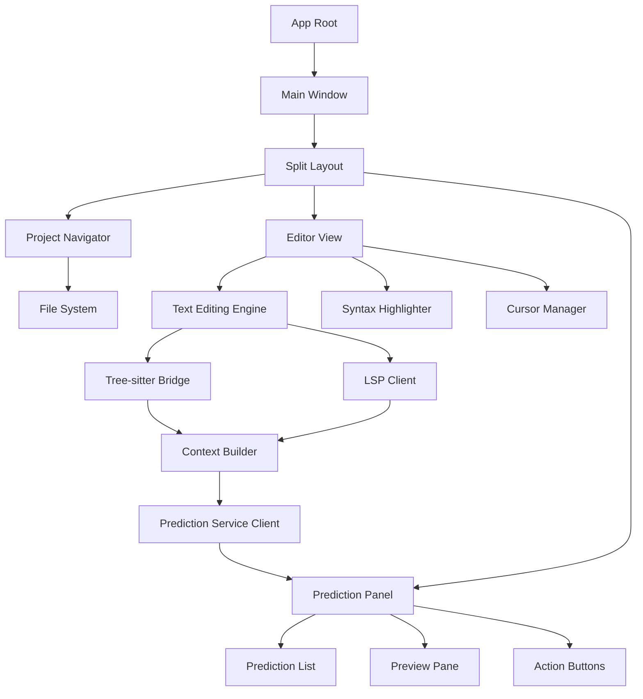

# Minimum Viable Swift Prototype

This document outlines a plan for creating a minimal viable prototype of the Zed editor in Swift, focusing on demonstrating the Next Action Prediction system. The goal is to create a simple but functional editor that showcases the potential of the Swift port with minimal implementation effort.

## Goals

1. Demonstrate the core capabilities of the Next Action Prediction system in Swift
2. Provide a visual way to see predictions and their impact
3. Keep the implementation simple while still being useful
4. Focus on the unique selling points rather than implementing all editor features
5. Identify and address real-world Swift migration challenges

## Core Components

### 1. Basic Text Editor

A simple text editing view with:

- Syntax highlighting (using a Swift port of Tree-sitter)
- Basic cursor movement and text editing
- Line numbers
- Simple scrolling

### 2. Minimal Project Navigator

A basic sidebar for project navigation:

- File tree view
- Open file on click
- Simple file icons based on type
- Minimal folder structure

### 3. Prediction Visualization Panel

A right panel that shows:

- Current context around cursor
- Predicted actions with probability/confidence scores
- Visual preview of how each prediction would modify the code
- Accept/reject buttons for each prediction

### 4. Intelligence Integrations

Simplified implementations of:

- Tree-sitter for syntax understanding, with FFI bridging to the C library
- Basic LSP client for semantic information, tailored to Swift's concurrency model
- Prediction service client with robust error handling

### 5. Migration Challenges

The prototype should explicitly address these key challenges:

- **Memory Management**: Handling Tree-sitter's C-based memory with Swift's ARC
- **Concurrency Model**: Mapping Rust's async system to Swift's structured concurrency
- **Platform Integration**: Interfacing with macOS/iOS platform APIs
- **FFI Complexity**: Managing foreign function interfaces for C libraries
- **Performance Benchmarking**: Comparing Swift vs. Rust implementation performance

## Hybrid UI Approach

After analyzing GPUI's architecture and comparing it to SwiftUI, we've determined that a hybrid approach will deliver the best results:

### SwiftUI-Appropriate Areas

- **Static UI Components**: Navigation sidebar, panels, and information displays
- **Prediction Visualization**: UI for displaying AI predictions and interactions
- **Settings Interfaces**: Configuration panels and preferences
- **Auxiliary Windows**: Dialogs, alerts, and auxiliary panels
- **Animations and Transitions**: Visual state changes and interface animations

### AppKit-Appropriate Areas

- **Text Editing Core**: The main editor component for performance-critical text manipulation
- **Custom Drawing**: Performance-critical rendering contexts
- **Complex Keyboard Handling**: Advanced key binding and input processing
- **Large Document Management**: Handling very large files efficiently
- **Accessibility**: Leveraging AppKit's mature accessibility support

## Implementation Plan

### Phase 1: Core Editor (2-3 weeks)

1. **Project Setup**
   - Create a hybrid SwiftUI/AppKit project structure
   - Set up basic layout with SwiftUI container and AppKit editor component
   - Configure package dependencies

2. **Basic Editor Implementation**
   - Implement text editing view using NSTextView for the core editor component
   - Design SwiftUI wrapper for NSTextView with bridging protocols
   - Add syntax highlighting using a Swift port of Tree-sitter
   - Implement basic cursor and selection handling

3. **Simple Project Navigator**
   - Implement file system access
   - Create tree view of project files
   - Handle file opening/closing

### Phase 2: Intelligence Layer (2-3 weeks)

4. **Tree-sitter Integration**
   - Create Swift wrapper for Tree-sitter
   - Implement syntax tree parsing
   - Extract structured information around cursor

5. **Basic LSP Client**
   - Implement minimal LSP client focusing on:
     - Hover information
     - Completion requests
     - Type information
   - Connect to language servers for popular languages (TypeScript, Python, etc.)

6. **Context Building**
   - Implement context extraction based on cursor position
   - Combine syntax and semantic information
   - Format context for prediction service

### Phase 3: Prediction System (3-4 weeks)

7. **Prediction Service Client**
   - Create client for accessing prediction service (use OpenAI API as a fallback)
   - Implement context sending and response parsing
   - Add request throttling and caching

8. **Prediction Visualization**
   - Design and implement the prediction panel UI
   - Show predictions with highlighting of changes
   - Provide accept/reject mechanisms

9. **User Interaction**
   - Implement prediction acceptance into editor
   - Add keyboard shortcuts for working with predictions
   - Track user behavior for feedback

### Phase 4: Polish and Demo (1-2 weeks)

10. **Performance Optimization**
    - Improve context extraction speed
    - Optimize prediction request flow
    - Ensure editor remains responsive

11. **Visual Refinement**
    - Improve syntax highlighting
    - Add smooth transitions for predictions
    - Polish the overall UI

12. **Demo Preparation**
    - Create sample projects for demonstration
    - Prepare showcase examples
    - Document key features

## Technical Architecture



## Key Implementation Details

### Swift Tree-sitter Bridge

```swift
class TreeSitterBridge {
    private var parser: OpaquePointer? // Tree-sitter parser
    
    func parseText(_ text: String) -> SyntaxNode? {
        // Parse text and return root node
    }
    
    func nodeAtPosition(_ position: Int) -> SyntaxNode? {
        // Get syntax node at cursor position
    }
    
    func extractContext(_ position: Int, radius: Int = 500) -> String {
        // Extract context around cursor with syntax awareness
    }
}
```

### Simple LSP Client

```swift
class LspClient {
    private var process: Process?
    private var requests: [Int: (Result<Any, Error>) -> Void] = [:]
    
    func startServer(for language: String) {
        // Start language server for the given language
    }
    
    func getTypeInfo(at position: Position) async throws -> TypeInfo {
        // Get type information at position
    }
    
    func getCompletions(at position: Position) async throws -> [Completion] {
        // Get completions at position
    }
}
```

### Prediction Client

```swift
class PredictionClient {
    private let apiEndpoint: URL
    private let debouncer = Debouncer(delay: 0.3)
    
    func getPredictions(
        context: String,
        cursorPosition: Int
    ) async throws -> [Prediction] {
        // Get predictions from service
        return try await debouncer.debounce {
            // Format request and send to service
            // Parse and return predictions
        }
    }
}
```

### Prediction Display

```swift
struct PredictionView: View {
    let prediction: Prediction
    var onAccept: () -> Void
    var onReject: () -> Void
    
    var body: some View {
        VStack(alignment: .leading) {
            // Confidence score
            HStack {
                Text("Confidence: \(Int(prediction.confidence * 100))%")
                Spacer()
                ConfidenceBar(value: prediction.confidence)
            }
            
            // Preview of changes
            CodeDiffView(original: prediction.originalText, 
                         modified: prediction.predictedText)
            
            // Action buttons
            HStack {
                Button("Accept") { onAccept() }
                Button("Reject") { onReject() }
                Spacer()
                Button("See Alternatives") { /* Show alternatives */ }
            }
        }
        .padding()
        .background(Color.secondarySystemBackground)
        .cornerRadius(8)
    }
}
```

## Technology Stack

- **Language**: Swift 5.7+
- **UI Framework**: SwiftUI with AppKit/UIKit bridges where needed
- **Text Editing**: NSTextView/TextKit 2 wrapped in SwiftUI
- **Syntax Highlighting**: Swift port of Tree-sitter
- **LSP Communication**: Swift-based LSP client
- **Prediction Service**: REST API client (could use OpenAI API initially)
- **Concurrency**: Swift's async/await and structured concurrency

## Deployment Target

- **Primary**: macOS 13+ (Ventura)
- **Secondary** (if time permits): iOS 16+ (iPad Pro)

## Time Estimate

Total estimated time: **8-12 weeks** for a small team (2-3 developers)

## Potential Challenges

1. **Tree-sitter Integration**: Creating an efficient Swift wrapper for Tree-sitter
2. **LSP Client Implementation**: Simplifying LSP while keeping useful functionality
3. **Performance**: Ensuring prediction requests don't impact editing experience
4. **Context Quality**: Building high-quality context for meaningful predictions

## Future Expansion

After the MVP is complete, the prototype could be expanded to include:

1. **Multiple Prediction Providers**: Support for different prediction systems
2. **More Editor Features**: Tabs, split views, search/replace
3. **Better LSP Integration**: Diagnostics, references, refactoring
4. **User Feedback Loop**: Learning from user actions to improve predictions

## Conclusion

This MVP plan focuses on creating a working prototype that demonstrates the potential of a Swift-based code editor with next action prediction capabilities. By focusing on the core intelligence features while keeping the UI simple, we can create a compelling demonstration with reasonable effort.