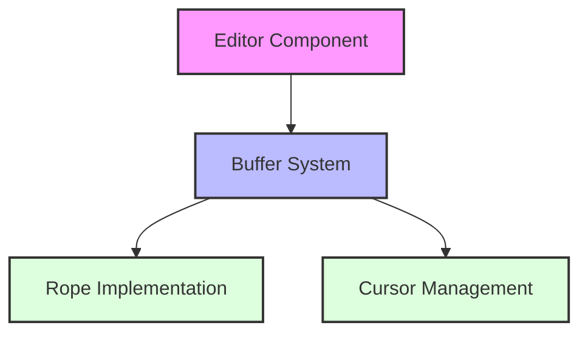

# Mission Cabbage Master Roadmap

This comprehensive roadmap document serves as both a progress report and a detailed plan for the Mission Cabbage documentation project. It summarizes work completed so far, outlines remaining documents to be created, establishes documentation standards, and provides a recommended development order.

## 1. Progress Summary

### 1.1 Original Documentation Set

The Mission Cabbage project has successfully created a comprehensive documentation set following the "zoom levels" methodology, analyzing the Zed codebase through progressively deeper layers:

- **Level 1: Orbital View** - High-level project-wide architecture (1 document)
- **Level 2: Stratospheric View** - Major subsystems architecture (11 documents)
- **Level 3: Atmospheric View** - Component-level design (10 documents)
- **Level 4: Cloud Level** - Algorithm and implementation details (10 documents)
- **Level 5: Ground Level** - Concrete implementations (11 documents)
- **Swift Implementation Guides** - Swift-specific guidance (5 documents)

All 48 originally planned documents have been completed, covering:

- Core UI framework (GPUI)
- Text editing capabilities
- Language intelligence features
- Collaboration systems
- Extension architecture
- Terminal integration
- AI assistants and code generation
- And many more subsystems

### 1.2 Bridge Documents Created

Bridge documents were added to connect abstract concepts with concrete implementations:

- **B01_EntitySystem_TechnicalBridge.md** - Connects GPUI framework concepts with entity system implementation details
- **B02_TextBuffer_TechnicalBridge.md** - Links text editor core concepts with buffer and rope implementations
- **B03_UI_TechnicalBridge.md** - Connects UI component architecture with rendering implementations
- **B04_LanguageIntelligence_TechnicalBridge.md** - Bridges language intelligence concepts with TreeSitter and LSP implementations
- **B05_ProjectManagement_TechnicalBridge.md** - Links project management concepts with implementation details
- **B06_TerminalIntegration_TechnicalBridge.md** - Connects terminal concepts with implementation specifics
- **B07_ExtensionSystem_TechnicalBridge.md** - Bridges extension system architecture with implementation details
- **B08_Settings_TechnicalBridge.md** - Connects settings subsystem with concrete implementations

### 1.3 Ground-Level and Cross-Cutting Documents Created

Additional ground-level implementation documents:

- **49_GroundLevel_ReactiveUIImplementation.md** - Details of the reactive UI implementation
- **51_GroundLevel_InputHandlingSystem.md** - Input event handling system implementation
- **52_GroundLevel_RopeImplementation.md** - Detailed rope data structure implementation
- **53_GroundLevel_CommandDispatchSystem.md** - Command system implementation details
- **56_GroundLevel_EditorExtensionMechanisms.md** - Editor extension mechanisms implementation
- **57_GroundLevel_LanguageServerProtocolIntegration.md** - LSP integration details

Cross-cutting concerns documents:

- **50_CrossCutting_PerformanceOptimizationPatterns.md** - Performance optimization patterns across subsystems
- **54_CrossCutting_ErrorHandlingRecoveryPatterns.md** - Error handling and recovery strategies
- **55_CrossCutting_MemoryManagementPatterns.md** - Memory management patterns across the codebase

Navigation and organization documents:

- **00_CabbageMap_ConnectivityGuide.md** - Central navigation hub for all documentation
- **00_DocumentTemplate.md** - Template for consistent document structure

## 2. Remaining Documentation Plan

While the core documentation set has been completed, several additional documents would enhance the comprehensiveness of the Mission Cabbage project. Below is a structured plan for these remaining documents.

### 2.1 Technical Bridges

| Title | Filename | Description | Priority | Dependencies | Effort |
|-------|----------|-------------|----------|--------------|--------|
| Collaboration System Technical Bridge | B09_CollaborationSystem_TechnicalBridge.md | Bridge between collaboration system architecture and operational transform implementation | High | 06_StratosphericView_CollaborationSystem.md, 26_CloudLevel_OperationalTransform.md | 1 day |
| Command System Technical Bridge | B10_CommandSystem_TechnicalBridge.md | Connect command system architecture with command dispatch implementation | Medium | 11_StratosphericView_CommandSystem.md, 53_GroundLevel_CommandDispatchSystem.md | 1 day |
| Theme System Technical Bridge | B11_ThemeSystem_TechnicalBridge.md | Bridge between theme system architecture and implementation | Low | 12_StratosphericView_ThemeSystem.md | 0.5 day |

### 2.2 Ground-Level Implementation Documents

| Title | Filename | Description | Priority | Dependencies | Effort |
|-------|----------|-------------|----------|--------------|--------|
| Settings Implementation | 58_GroundLevel_SettingsImplementation.md | Detailed implementation of settings persistence and validation | Medium | 10_StratosphericView_Settings.md, B08_Settings_TechnicalBridge.md | 1 day |
| Extension Sandboxing Implementation | 59_GroundLevel_ExtensionSandboxImplementation.md | Implementation details of the extension sandbox security | High | 07_StratosphericView_ExtensionSystem.md, 29_CloudLevel_ExtensionSandbox.md | 1 day |
| Collaboration Protocol Implementation | 60_GroundLevel_CollaborationProtocolImplementation.md | Details of the real-time collaboration protocol implementation | High | 06_StratosphericView_CollaborationSystem.md, 26_CloudLevel_OperationalTransform.md | 1.5 days |
| Theme Rendering Implementation | 61_GroundLevel_ThemeRenderingImplementation.md | Implementation details of theme application to UI elements | Low | 12_StratosphericView_ThemeSystem.md | 1 day |
| Code Navigation Implementation | 62_GroundLevel_CodeNavigationImplementation.md | Implementation of symbol navigation and code jumping | Medium | 04_StratosphericView_LanguageIntelligence.md | 1 day |

### 2.3 Cross-Cutting Concerns

| Title | Filename | Description | Priority | Dependencies | Effort |
|-------|----------|-------------|----------|--------------|--------|
| Testing Patterns and Strategies | 63_CrossCutting_TestingPatternsStrategies.md | Testing approaches across different subsystems | High | Multiple subsystems | 1 day |
| Localization and Internationalization | 64_CrossCutting_LocalizationInternationalization.md | Approaches to localization across the codebase | Medium | UI components and text handling | 1 day |
| Accessibility Implementation | 65_CrossCutting_AccessibilityImplementation.md | Cross-cutting accessibility concerns and implementations | High | UI subsystems | 1.5 days |
| Security Practices | 66_CrossCutting_SecurityPractices.md | Security considerations across various subsystems | Medium | Extension system, collaboration features | 1 day |

### 2.4 Swift-Specific Implementation Documents

| Title | Filename | Description | Priority | Dependencies | Effort |
|-------|----------|-------------|----------|--------------|--------|
| Swift Rendering System | 67_Swift_RenderingSystem.md | Metal-based rendering system adaptation for Swift | Critical | 36_GroundLevel_UIRendering.md, 42_Swift_ReactiveUI.md | 2 days |
| Swift Platform Integration | 68_Swift_PlatformIntegration.md | macOS platform integration details for Swift implementation | Critical | Various subsystems | 1.5 days |
| Swift Testing Framework | 69_Swift_TestingFramework.md | Testing approach for Swift reimplementation | High | 63_CrossCutting_TestingPatternsStrategies.md | 1 day |
| Swift Performance Optimization | 70_Swift_PerformanceOptimization.md | Swift-specific performance optimization techniques | High | 50_CrossCutting_PerformanceOptimizationPatterns.md | 1.5 days |
| Swift Accessibility Implementation | 71_Swift_AccessibilityImplementation.md | Swift and AppKit/SwiftUI accessibility implementations | Medium | 65_CrossCutting_AccessibilityImplementation.md | 1 day |

### 2.5 Integration Documents

| Title | Filename | Description | Priority | Dependencies | Effort |
|-------|----------|-------------|----------|--------------|--------|
| Subsystem Integration Map | 72_Integration_SubsystemInteractions.md | Detailed mapping of how subsystems interact and communicate | High | All subsystem documents | 2 days |
| Language Features Integration | 73_Integration_LanguageFeaturesWorkflow.md | End-to-end workflow of language features from UI to backend | Medium | Language intelligence documents | 1 day |
| Editor Extensions Integration | 74_Integration_EditorExtensionsWorkflow.md | Integration points for editor extensions across subsystems | Medium | Extension system documents | 1 day |
| Terminal and Shell Integration | 75_Integration_TerminalShellWorkflow.md | Complete integration flow of terminal features | Low | Terminal integration documents | 1 day |

## 3. Documentation Standards

### 3.1 Naming Conventions

All Mission Cabbage documents follow a consistent naming pattern:

- Orbital Layer: `01_OrbitalView_*.md`
- Stratospheric Layer: `XX_StratosphericView_*.md`
- Atmospheric Layer: `XX_AtmosphericView_*.md`
- Cloud Layer: `XX_CloudLevel_*.md`
- Ground Layer: `XX_GroundLevel_*.md`
- Bridge Documents: `BXX_*_TechnicalBridge.md`
- Cross-Cutting: `XX_CrossCutting_*.md`
- Swift Implementation: `XX_Swift_*.md`
- Integration Documents: `XX_Integration_*.md`

Document filenames should be descriptive, use PascalCase for multi-word concepts, and always include the layer prefix.

### 3.2 Cross-Referencing Practices

All documents should include:

1. **Dependencies Section**: A list of documents that this document depends on, with markdown links
2. **Related Documents Section**: Links to documents related to the current topic
3. **In-text References**: Use markdown links when referring to concepts detailed in other documents
4. **Forward References**: When applicable, link to documents that build upon the current document

Example:
```markdown
## Dependencies
- [01_OrbitalView_ProjectArchitecture.md](01_OrbitalView_ProjectArchitecture.md)
- [02_StratosphericView_GPUI.md](02_StratosphericView_GPUI.md)

## Related Documents
- [25_CloudLevel_EntitySystem.md](25_CloudLevel_EntitySystem.md)
- [49_GroundLevel_ReactiveUIImplementation.md](49_GroundLevel_ReactiveUIImplementation.md)
```

### 3.3 Code Example Guidelines

Code examples should follow these guidelines:

1. **Language Identification**: Always specify the language using markdown code fences
2. **Simplification**: Simplify examples to focus on the concept being illustrated
3. **Comments**: Include explanatory comments for complex parts
4. **Swift vs. Rust**: When showing Rust code, include the Swift equivalent when possible
5. **Consistency**: Use consistent naming conventions in all code examples
6. **Context**: Provide enough context around code snippets for them to be understandable

Example:
```markdown
```rust
// Rust implementation
pub fn process_text(buffer: &mut Buffer, range: Range<usize>) -> Result<(), Error> {
    // Implementation details
    buffer.edit(range, "new text")?; // Edit with error handling
    Ok(())
}
```

```swift
// Swift equivalent
func processText(buffer: inout Buffer, range: Range<Int>) throws {
    // Implementation details
    try buffer.edit(range: range, newText: "new text") // Edit with error handling
}
```
```

### 3.4 Diagrams and Visual Elements

All diagrams should follow these guidelines:

1. **Mermaid Format**: Use Mermaid for all diagrams for consistency and maintainability
2. **Diagram Types**:
   - Flowcharts for system relationships and processes
   - Sequence diagrams for interaction flows
   - Class diagrams for component structure
   - State diagrams for state transitions
3. **Consistent Styling**: Use consistent colors, shapes, and styles across diagrams
4. **Clear Labels**: All diagram elements should have clear, descriptive labels
5. **Hierarchy**: Use hierarchical organization when appropriate
6. **Legend**: Include a legend when using special symbols or colors

Example:
```markdown

```

### 3.5 Document Structure

Each document should follow the structure defined in `00_DocumentTemplate.md`:

1. **Purpose**: What problem does this component/system solve?
2. **Concepts**: Key abstractions and mental models
3. **Architecture**: How pieces fit together
4. **Interfaces**: Key APIs and contracts
5. **State Management**: How data flows and changes
6. **Swift Considerations**: Platform-specific notes for reimplementation
7. **Dependencies**: Documents this document depends on
8. **Related Documents**: Other relevant documents

## 4. Recommended Development Order

Based on priority and dependencies, here is the recommended order for developing the remaining documents:

### Phase 1: Critical Swift Implementation (3.5 days)
1. **67_Swift_RenderingSystem.md** - Critical for Swift UI implementation
2. **68_Swift_PlatformIntegration.md** - Required for macOS integration

### Phase 2: High-Priority Bridge Documents (2 days)
3. **B09_CollaborationSystem_TechnicalBridge.md** - Important for real-time features
4. **59_GroundLevel_ExtensionSandboxImplementation.md** - Critical for security
5. **60_GroundLevel_CollaborationProtocolImplementation.md** - Builds on bridge document

### Phase 3: Cross-Cutting Concerns (3.5 days)
6. **63_CrossCutting_TestingPatternsStrategies.md** - Foundation for testing
7. **65_CrossCutting_AccessibilityImplementation.md** - Important for usability
8. **70_Swift_PerformanceOptimization.md** - Critical for editor performance
9. **66_CrossCutting_SecurityPractices.md** - Important for overall security

### Phase 4: Integration Documents (3 days)
10. **72_Integration_SubsystemInteractions.md** - Critical for understanding connections
11. **69_Swift_TestingFramework.md** - Builds on testing patterns document
12. **73_Integration_LanguageFeaturesWorkflow.md** - Important workflow documentation

### Phase 5: Remaining Implementation Documents (4 days)
13. **58_GroundLevel_SettingsImplementation.md** - Medium priority
14. **62_GroundLevel_CodeNavigationImplementation.md** - Medium priority
15. **B10_CommandSystem_TechnicalBridge.md** - Medium priority
16. **74_Integration_EditorExtensionsWorkflow.md** - Medium priority

### Phase 6: Lower Priority Documents (3.5 days)
17. **64_CrossCutting_LocalizationInternationalization.md** - Medium priority
18. **71_Swift_AccessibilityImplementation.md** - Medium priority
19. **B11_ThemeSystem_TechnicalBridge.md** - Low priority
20. **61_GroundLevel_ThemeRenderingImplementation.md** - Low priority
21. **75_Integration_TerminalShellWorkflow.md** - Low priority

## 5. Total Effort and Timeline

The remaining documentation work represents approximately 19.5 days of effort. With a single document writer, this would take approximately 4 weeks of work. With two document writers working in parallel, it could be completed in approximately 2-3 weeks.

## 6. Reporting and Tracking

Progress on the documentation should be tracked in the main `MissionCabbage.md` file by:

1. Updating the "Current Status" section with newly completed documents
2. Adding new document plans to the appropriate sections
3. Indicating when documents move from planned to completed status

Additionally, the `00_CabbageMap_ConnectivityGuide.md` should be updated whenever new documents are created to maintain its role as the central navigation hub.

## 7. Conclusion

The Mission Cabbage documentation project has successfully completed its initial goal of comprehensively documenting the Zed editor architecture. The remaining documents proposed in this roadmap would enhance specific areas, particularly:

1. Swift-specific implementation guidance
2. Technical bridges for better Rust-to-Swift translation
3. Cross-cutting concerns that affect multiple subsystems
4. Integration documents showing end-to-end workflows

This roadmap provides a structured approach to completing these remaining documents while maintaining consistency with the existing documentation set.