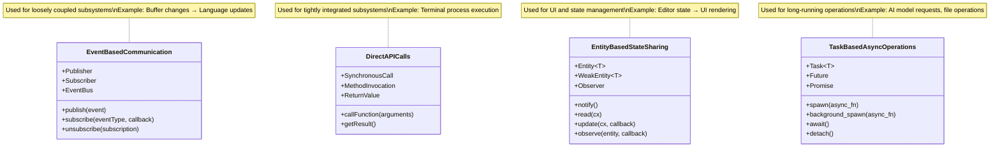

# Zed Subsystem Relationship Map

This document provides a comprehensive overview of how Zed's major subsystems connect and interact with each other, highlighting the key dependencies and data flows between components.

## Core Dependency Structure

## Subsystem Initialization Sequence

## Key Subsystem Interactions

### GPUI → Text Editor Core
- GPUI provides the UI framework, rendering capabilities, and state management
- Text Editor Core implements editor logic on top of GPUI primitives
- **Key Interface**: Entity-based state system for editor components
- **Data Flow**: GPUI event loop → editor state changes → UI updates

### Text Editor Core → Language Intelligence
- Text Editor Core provides buffer content and cursor information
- Language Intelligence provides syntax highlighting, diagnostics, and code intelligence
- **Key Interface**: Buffer change notifications, language server requests
- **Data Flow**: Edit operations → syntax updates → highlighting and diagnostics

### Text Editor Core → Project Management
- Text Editor Core operates on buffers provided by Project Management
- Project Management keeps track of files, directories, and project structures
- **Key Interface**: File access and modification APIs
- **Data Flow**: Project events → buffer loading/saving → editor operations

### Project Management → Collaboration
- Project Management provides project structure for collaboration
- Collaboration system synchronizes changes across client instances
- **Key Interface**: Project update events, operational transform
- **Data Flow**: Local changes → collaboration sync → remote updates

### Text Editor Core → Terminal Integration
- Text Editor Core provides workspace for terminal views
- Terminal Integration extends editor with shell access
- **Key Interface**: Terminal view APIs, process execution
- **Data Flow**: Terminal input → shell process → terminal output → view update

### Language Intelligence → AI Features
- Language Intelligence provides code context and structure
- AI Features use code understanding for intelligent assistance
- **Key Interface**: Code context extraction, semantic analysis
- **Data Flow**: Code selection → context building → AI query → suggested edits

### Extension System → Multiple Subsystems
- Extension System connects to almost all other subsystems
- Provides extension points for customizing editor functionality
- **Key Interface**: Extension API surface, capability system
- **Data Flow**: Extension activation → feature registration → extended functionality

### Settings → All Subsystems
- Settings system affects behavior of all other subsystems
- Provides user configuration for system-wide and per-project settings
- **Key Interface**: Configuration access APIs, change notifications
- **Data Flow**: Setting changes → configuration events → behavior adaptation

## Subsystem Dependencies Table

| Subsystem           | Directly Depends On                           | Provides Services To                       |
|---------------------|-----------------------------------------------|-------------------------------------------|
| GPUI                | None (foundational)                           | All other subsystems                       |
| Text Editor Core    | GPUI                                         | Language Intelligence, Terminal, AI Features |
| Language Intelligence | GPUI, Text Editor Core                       | Text Editor Core, AI Features              |
| Project Management  | GPUI, Text Editor Core                       | Text Editor Core, Collaboration, Extensions |
| Collaboration       | GPUI, Project Management, Text Editor Core   | Text Editor Core, Project Management        |
| Extension System    | GPUI, Text Editor Core                       | All other subsystems                       |
| Terminal Integration | GPUI, Text Editor Core                       | Text Editor Core, Extensions               |
| AI Features         | GPUI, Text Editor Core, Language Intelligence | Text Editor Core, Extensions               |
| Settings            | GPUI                                         | All other subsystems                       |

## Communication Patterns

### Data Flow Example: Code Editing to Syntax Highlighting

## State Ownership and Sharing

### State Access Patterns

| State Category        | Primary Owner            | Shared With                           | Access Pattern |
|-----------------------|--------------------------|---------------------------------------|--------------------|
| Buffer Content        | Text Editor Core         | Language Intelligence, Collaboration  | Entity observation with change notification |
| Project Structure     | Project Management       | Text Editor Core, Extension System    | Entity reading with query APIs |
| Language Information  | Language Intelligence    | Text Editor Core, AI Features         | Event-based updates |
| UI State              | GPUI                     | All subsystems with UI components     | Entity system with rendering callbacks |
| Extension Registry    | Extension System         | All extensible subsystems             | Registry pattern with capability queries |
| Settings/Configuration| Settings System          | All configurable subsystems           | Observable settings with change events |
| Collaboration State   | Collaboration System     | Text Editor Core, Project Management  | Synchronized state with OT algorithm |
| Terminal State        | Terminal Integration     | Text Editor Core (for display)        | Buffer-like API with display hooks |
| AI Context/History    | AI Features              | Language Intelligence (for context)   | Context provider pattern |

## Initialization Sequence

1. GPUI framework initialization
2. Settings system initialization
3. Project Management startup
4. Text Editor Core initialization
5. Language Intelligence services startup
6. Extension system initialization and extension loading
7. Collaboration system connection (if enabled)
8. Terminal Integration initialization
9. AI Features initialization

## Cross-Document References

For detailed information on each subsystem, refer to:

- [01_OrbitalView_ProjectArchitecture.md](./01_OrbitalView_ProjectArchitecture.md) - Overall system architecture
- [02_StratosphericView_GPUI.md](./02_StratosphericView_GPUI.md) - UI framework and state management
- [03_StratosphericView_TextEditorCore.md](./03_StratosphericView_TextEditorCore.md) - Core editing functionality
- [04_StratosphericView_LanguageIntelligence.md](./04_StratosphericView_LanguageIntelligence.md) - Language support
- [05_StratosphericView_ProjectManagement.md](./05_StratosphericView_ProjectManagement.md) - Project handling
- [06_StratosphericView_CollaborationSystem.md](./06_StratosphericView_CollaborationSystem.md) - Real-time collaboration
- [07_StratosphericView_ExtensionSystem.md](./07_StratosphericView_ExtensionSystem.md) - Extension system
- [08_StratosphericView_TerminalIntegration.md](./08_StratosphericView_TerminalIntegration.md) - Terminal features
- [09_StratosphericView_AIFeatures.md](./09_StratosphericView_AIFeatures.md) - AI capabilities